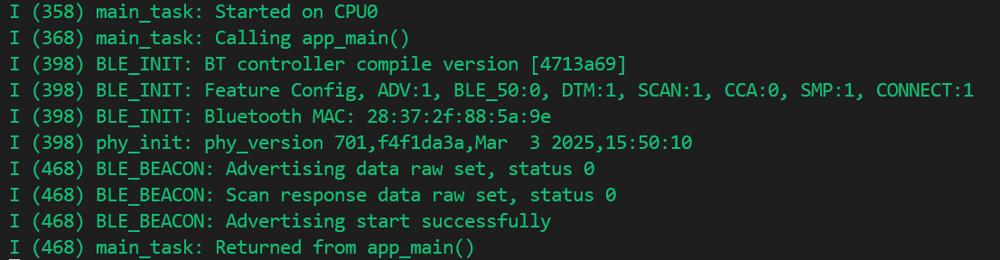
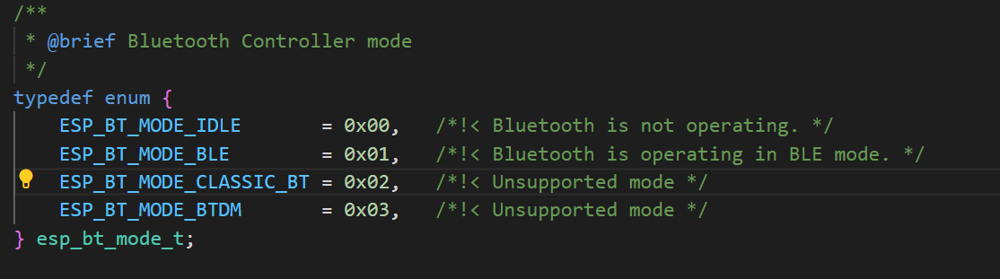
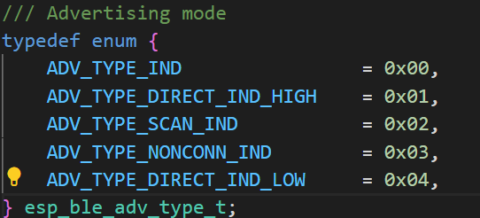
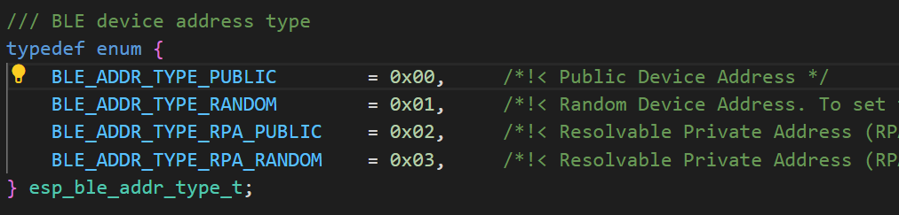
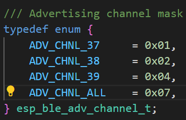
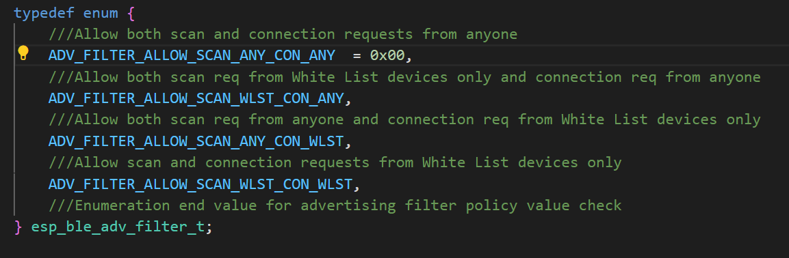
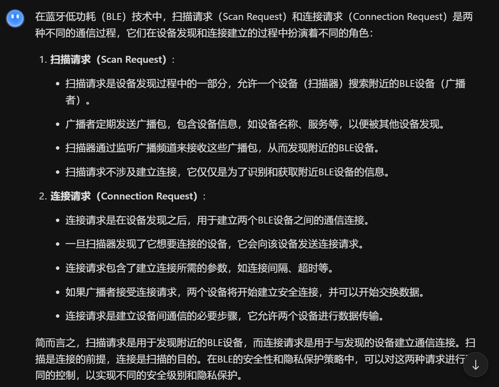
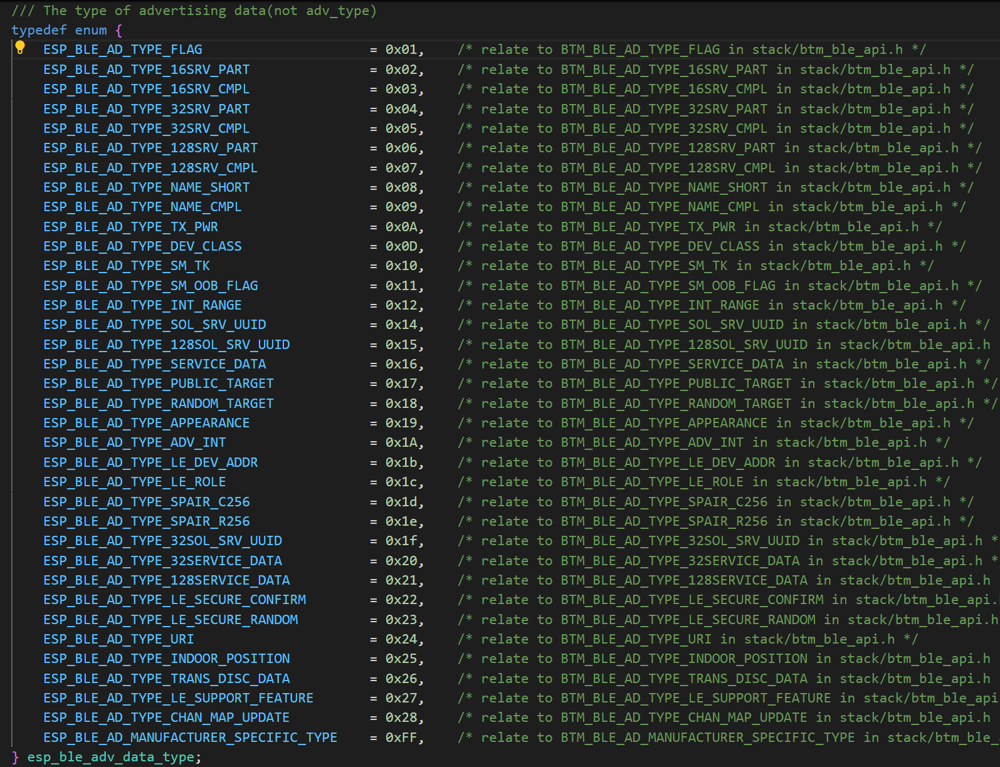

# Bluedroid Beacon 双模蓝牙信标

## 粗略阅读README文档

文档简介，本例旨在介绍1.如何初始化bluedroid堆栈 2.如何配置广告和扫描响应数据 3.如何将广告作为不可连接的信标开始 可以使用任意蓝牙扫描程序连接

准备工作，构建烧录

代码解释(*笔者注，本次实验记录的代码分析会参照该部分，便于对照阅读和学习*)

## 构建、烧录和监视

* 选择版本（由于笔者现在用的都是v5.5版本，故不作调换）
* 选择目标芯片
* 选择端口号
* 点击**构建、烧录和监视**


## 代码分析

### 头文件和宏定义以及静态变量

* `<stdint.h>` `<string.h>` `<stdio.h>` `<stdbool.h>` 为C语言基础库文件，用来提供 uint8_t、bool、memcpy、printf 等函数
* `"nvs_flash.h"` 导入NVS（非易失性存储）的API，用于后续使用
* ESP-IDF蓝牙核心头文件具体作用见下方代码注释
* 其他 *log* 、 *system* 、*freertos* 为系统级头文件，用于日志，芯片系统操作，RTOS操作系统
* `ADV_CONFIG_FLAG` `SCAN_RSP_CONFIG_FLAG` 两个位掩码用于“广播/扫描响应数据配置”结构体
* `URI_PREFIX_HTTPS` 是 Eddystone-URL 帧格式里对 “https://” 这一前缀的编码值 (*如果例程演示的是 Beacon（例如 Eddystone），就会把 0x17 放进广播数据里，表示后面跟的 URL 以 https:// 开头，从而省字节*)

```c
#include <stdint.h>
#include <string.h>
#include <stdio.h>
#include <stdbool.h>
#include "nvs_flash.h"

#include "esp_bt.h"             // 蓝牙双模（BT/BLE）控制器和主机的总入口
#include "esp_gap_ble_api.h"    // GAP（Generic Access Profile）层 API，负责广播、扫描、连接参数更新、安全配对等“链路管理”功能
#include "esp_gattc_api.h"      // GATT Client API（主机端），用来发现服务、读写特征值、注册 notify/indicate
#include "esp_gatt_defs.h"      // GATT 相关的常量、枚举、结构体定义、
#include "esp_bt_main.h"        // 蓝牙控制器的初始化 / 反初始化
#include "esp_log.h"             
#include "esp_system.h"
#include "esp_bt_defs.h"        // 蓝牙公共数据结构
#include "freertos/FreeRTOS.h"

#define ADV_CONFIG_FLAG      (1 << 0)
#define SCAN_RSP_CONFIG_FLAG (1 << 1)
#define URI_PREFIX_HTTPS     (0x17)
```

静态变量包括用于LOG的TAG标签，设备名称，配置变量初始化，以及和蓝牙协议有关的配置，具体分析按照文档顺序，在[后文](#数据分析)进行分析

```c
static const char *DEMO_TAG = "BLE_BEACON";
static const char device_name[] = "Bluedroid_Beacon";

static uint8_t adv_config_done = 0;
static esp_bd_addr_t local_addr;
static uint8_t local_addr_type;

static esp_ble_adv_params_t adv_params = {
    .adv_int_min = 0x20,  // 20ms
    .adv_int_max = 0x20,  // 20ms
    .adv_type = ADV_TYPE_SCAN_IND,
    .own_addr_type = BLE_ADDR_TYPE_PUBLIC,
    .channel_map = ADV_CHNL_ALL,
    .adv_filter_policy = ADV_FILTER_ALLOW_SCAN_ANY_CON_ANY,
};

//configure raw data for advertising packet
static uint8_t adv_raw_data[] = {
    0x02, ESP_BLE_AD_TYPE_FLAG, 0x06,
    0x11, ESP_BLE_AD_TYPE_NAME_CMPL, 'B', 'l', 'u', 'e', 'd', 'r', 'o', 'i', 'd', '_', 'B', 'e', 'a', 'c', 'o', 'n',
    0x02, ESP_BLE_AD_TYPE_TX_PWR, 0x09,
    0x03, ESP_BLE_AD_TYPE_APPEARANCE, 0x00,0x02,
    0x02, ESP_BLE_AD_TYPE_LE_ROLE, 0x00,
};

static uint8_t scan_rsp_raw_data[] = {
    0x08, ESP_BLE_AD_TYPE_LE_DEV_ADDR, 0x00, 0x00, 0x00, 0x00, 0x00, 0x00, 0x00,
    0x11, ESP_BLE_AD_TYPE_URI, URI_PREFIX_HTTPS, '/', '/', 'e', 's', 'p', 'r', 'e', 's', 's', 'i', 'f', '.', 'c', 'o', 'm',
};
```

### app_main函数

> 笔者注，后续代码分析会按找文档顺序来，可以对照学习，但文档是概述，笔者作为学习记录会进行详细分析解释

app_main是所有ESP32应用程序的入口，一般来说，应用程序初始化应该放在这里

1. `nvs_flash_init` NVS初始化，如果报特定错误，采用`nvs_flash_erase`重新配置默认nvs分区并重新初始化
2. `esp_bt_controller_mem_release`配置蓝牙控制，**根据模式释放控制器内存** [编程指南](https://docs.espressif.com/projects/esp-idf/zh_CN/stable/esp32/api-reference/bluetooth/controller_vhci.html#_CPPv429esp_bt_controller_mem_release13esp_bt_mode_t)
3. `BT_CONTROLLER_INIT_CONFIG_DEFAULT` 宏函数进行默认蓝牙配置 `esp_bt_controller_init` 写入配置进行初始化 [API调用](https://docs.espressif.com/projects/esp-idf/zh_CN/stable/esp32/api-reference/bluetooth/controller_vhci.html#_CPPv422esp_bt_controller_initP26esp_bt_controller_config_t)
4. `esp_bt_controller_enable(ESP_BT_MODE_BLE)`模式见上图，使能控制器，API调用同上链接。(**采用内存优化策略，前文释放的是经典蓝牙协议占用内存，此处只启用BLE低功耗蓝牙模式，优化内存和功耗**)
5. `esp_bluedroid_init` bluedroid 初始化和分配蓝牙资源 [API查看](https://docs.espressif.com/projects/esp-idf/zh_CN/stable/esp32/api-reference/bluetooth/esp_bt_main.html#_CPPv418esp_bluedroid_initv)
6. `esp_bluedroid_enable` 使能蓝牙
7. `esp_ble_gap_register_callback` 注册回调函数，在**所有GAP事件**发生时触发（具体事件见后回调函数）
8. `esp_ble_gap_set_device_name(device_name)` 设置设备名称
9. 掩码的或操作，通过宏定义的位移操作可以对每一位进行控制，或操作只对1有效，不影响其他位的原有配置 
10. `esp_ble_gap_config_adv_data_raw`进行广播数据配置，`adv_params`包含要广播的原始数据
11. `esp_ble_gap_get_local_used_addr` 调用函数获取本地使用的地址和地址类型，存入变量中
12. `esp_ble_gap_config_scan_rsp_data_raw` 配置其他设备主动扫描时返回的额外数据，前面也有MAC数据置入(*网络中每台设备都有一个唯一的网络标识，这个地址叫MAC地址或网卡地址，由网络设备制造商生产时写在硬件内部*)
13. 由于`local_addr`在ESP32中以小端序列存储，但广播需要按网络字节序列排序，所以位置有交换，MAC地址从第二个字节开始存储，也符合蓝牙广播协议的格式要求

```c
void app_main(void)
{
    esp_err_t ret;

    //initialize NVS
    ret = nvs_flash_init();
    if (ret == ESP_ERR_NVS_NO_FREE_PAGES || ret == ESP_ERR_NVS_NEW_VERSION_FOUND) {
        ESP_ERROR_CHECK(nvs_flash_erase());
        ret = nvs_flash_init();
    }
    ESP_ERROR_CHECK(ret);

    ESP_ERROR_CHECK(esp_bt_controller_mem_release(ESP_BT_MODE_CLASSIC_BT));

    esp_bt_controller_config_t bt_cfg = BT_CONTROLLER_INIT_CONFIG_DEFAULT();
    ret = esp_bt_controller_init(&bt_cfg);
    if (ret) {
        ESP_LOGE(DEMO_TAG, "%s initialize controller failed: %s", __func__, esp_err_to_name(ret));
        return;
    }

    ret = esp_bt_controller_enable(ESP_BT_MODE_BLE);
    if (ret) {
        ESP_LOGE(DEMO_TAG, "%s enable controller failed: %s", __func__, esp_err_to_name(ret));
        return;
    }

    ret = esp_bluedroid_init();
    if (ret) {
        ESP_LOGE(DEMO_TAG, "%s init bluetooth failed: %s", __func__, esp_err_to_name(ret));
        return;
    }

    ret = esp_bluedroid_enable();
    if (ret) {
        ESP_LOGE(DEMO_TAG, "%s enable bluetooth failed: %s", __func__, esp_err_to_name(ret));
        return;
    }

    ret = esp_ble_gap_register_callback(esp_gap_cb);
    if (ret) {
        ESP_LOGE(DEMO_TAG, "gap register error, error code = %x", ret);
        return;
    }

    ret = esp_ble_gap_set_device_name(device_name);
    if (ret) {
        ESP_LOGE(DEMO_TAG, "set device name error, error code = %x", ret);
        return;
    }

    //config adv data
    adv_config_done |= ADV_CONFIG_FLAG;
    adv_config_done |= SCAN_RSP_CONFIG_FLAG;
    ret = esp_ble_gap_config_adv_data_raw(adv_raw_data, sizeof(adv_raw_data));
    if (ret) {
        ESP_LOGE(DEMO_TAG, "config adv data failed, error code = %x", ret);
        return;
    }

    ret = esp_ble_gap_get_local_used_addr(local_addr, &local_addr_type);
    if (ret) {
        ESP_LOGE(DEMO_TAG, "get local used address failed, error code = %x", ret);
        return;
    }

    scan_rsp_raw_data[2] = local_addr[5];
    scan_rsp_raw_data[3] = local_addr[4];
    scan_rsp_raw_data[4] = local_addr[3];
    scan_rsp_raw_data[5] = local_addr[2];
    scan_rsp_raw_data[6] = local_addr[1];
    scan_rsp_raw_data[7] = local_addr[0];
    ret = esp_ble_gap_config_scan_rsp_data_raw(scan_rsp_raw_data, sizeof(scan_rsp_raw_data));
    if (ret) {
        ESP_LOGE(DEMO_TAG, "config scan rsp data failed, error code = %x", ret);
    }
}
```

### 数据分析

`adv_params` 广告结构参数 [指南](https://docs.espressif.com/projects/esp-idf/zh_CN/stable/esp32/api-reference/bluetooth/esp_gap_ble.html#_CPPv420esp_ble_adv_params_t)

* `adv_int_min` 非定向和低占空比定向广告的最小广告间隔。*范围：0x 0020 至 0x 4000 默认值：N = 0x 0800（1.28 秒）时间= N * 0.625 msec 时间范围：20 ms 至 10.24 秒*
* `adv_int_max` 非定向和低占空比定向广告的最大广告间隔。范围同上
* `adv_type` 广告类型
  * **ADV_TYPE_IND (0x00)** 独立设备(Indicative)广告类型。
用于广播设备的存在，但不包含特定的扫描响应数据。这种类型的广告**可以被扫描设备接收，但不会立即建立连接**。
  * **ADV_TYPE_DIRECT_IND_HIGH (0x01)** 高速直接指示（Direct Indicative）广告类型。**用于快速建立连接**，设备会直接向目标设备发送广告包。这种类型的广告通常用于**已知设备之间**的快速连接。
  * **ADV_TYPE_SCAN_IND (0x02)** 扫描指示（Scan Indicative）广告类型。设备广播自己的存在，同时等待扫描请求。这种类型的广告**允许设备被扫描设备发现，但不会主动建立连**
  * **ADV_TYPE_NONCONN_IND (0x03)** 非连接指示（Non-connectable Indicative）广告类型。设备广播自己的存在，但不建立连接。这种类型的广告用于**广播信息，但不进行设备间的连接**
  * **ADV_TYPE_DIRECT_IND_LOW (0x04)** 低速直接指示（Direct Indicative）广告类型。类似于 ADV_TYPE_DIRECT_IND_HIGH，但传输速率较低
* `own_addr_type` 所有者蓝牙设备地址类型
  * **BLE_ADDR_TYPE_PUBLIC (0x00)** 公共设备地址（Public Device Address）。这是**设备出厂时设定的地址**，对于所有设备都是唯一的。公共地址可以被其他设备用于建立连接，但可能会因为其唯一性而被跟踪
  * **BLE_ADDR_TYPE_RANDOM (0x01)** 随机设备地址（Random Device Address）。这种**地址是动态生成的**，不是唯一的，用于增强隐私保护。随机地址可以定期更换，以减少被跟踪的风险\
  * **BLE_ADDR_TYPE_RPA_PUBLIC (0x02)** 可解析的公共随机地址（Resolvable Private Address, RPA）。这种地址是使用设备的公共地址生成的，但对其他设备来说是随机的。RPA地址可以通过一个解析过程被转换回原始的公共地址，但这个过程需要双方设备都参与，从而提供了一定程度的隐私保护。
  * **BLE_ADDR_TYPE_RPA_RANDOM (0x03)** 可解析的随机随机地址（Resolvable Private Address, RPA）- 随机。这种地址是使用设备的随机地址生成的，同样对其他设备来说是随机的。与 BLE_ADDR_TYPE_RPA_PUBLIC 类似，RPA随机地址也可以通过解析过程被转换回原始地址，提供隐私保护
* `channel_map` 广告通道 
  * BLE使用三个广播频道：37、38和39，这些频道是BLE协议规定的标准广播频道
  * ALL就是在三个通过上均进行广播
* `adv_filter_policy` 广告过滤策略 
  * **ADV_FILTER_ALLOW_SCAN_ANY_CON_ANY (0x00)** 允许任何设备进行扫描和连接请求
  * **ADV_FILTER_ALLOW_SCAN_WLST_CON_ANY** 仅允许白名单（White List）上的设备进行扫描请求，但允许任何设备进行连接请求
  * **ADV_FILTER_ALLOW_SCAN_ANY_CON_WLST** 允许任何设备进行扫描请求，但仅允许白名单上的设备进行连接请求
  * **ADV_FILTER_ALLOW_SCAN_WLST_CON_WLST** 仅允许白名单上的设备进行扫描和连接请求
  * 

```c
static esp_ble_adv_params_t adv_params = {
    .adv_int_min = 0x20,  // 20ms
    .adv_int_max = 0x20,  // 20ms
    .adv_type = ADV_TYPE_SCAN_IND,
    .own_addr_type = BLE_ADDR_TYPE_PUBLIC,
    .channel_map = ADV_CHNL_ALL,
    .adv_filter_policy = ADV_FILTER_ALLOW_SCAN_ANY_CON_ANY,
};
```

`adv_raw_data` 广告响应字段，即数据字段，储存需要发送的数据 [蓝牙数据格式解释](https://blog.csdn.net/weixin_48033504/article/details/122638836)


```c
//configure raw data for advertising packet
static uint8_t adv_raw_data[] = {
    0x02, ESP_BLE_AD_TYPE_FLAG, 0x06,
    0x11, ESP_BLE_AD_TYPE_NAME_CMPL, 'B', 'l', 'u', 'e', 'd', 'r', 'o', 'i', 'd', '_', 'B', 'e', 'a', 'c', 'o', 'n',
    0x02, ESP_BLE_AD_TYPE_TX_PWR, 0x09,
    0x03, ESP_BLE_AD_TYPE_APPEARANCE, 0x00,0x02,
    0x02, ESP_BLE_AD_TYPE_LE_ROLE, 0x00,
};

static uint8_t scan_rsp_raw_data[] = {
    0x08, ESP_BLE_AD_TYPE_LE_DEV_ADDR, 0x00, 0x00, 0x00, 0x00, 0x00, 0x00, 0x00,
    0x11, ESP_BLE_AD_TYPE_URI, URI_PREFIX_HTTPS, '/', '/', 'e', 's', 'p', 'r', 'e', 's', 's', 'i', 'f', '.', 'c', 'o', 'm',
};
```

AI给出关于**数据类型**的回答如下

### 回调函数

在所有事件发送时都会触发该回调函数，故需要进行事件分类处理(*由于事件类型太多，笔者此处不作列举，具体可见源文件*)

1. 事件(event)判断
2. `ESP_GAP_BLE_ADV_DATA_SET_COMPLETE_EVT` 当广告数据设置完成时触发
   * `param->adv_data_cmpl.status` 广告数据的设置状态
   * `adv_config_done &= (~ADV_CONFIG_FLAG)` 清除ADV_CONFIG_FLAG标志，软件内部
   * 检查配置为0说明广告配置完成，`esp_ble_gap_start_advertising` 开始广告
3. `ESP_GAP_BLE_ADV_DATA_RAW_SET_COMPLETE_EVT` `ESP_GAP_BLE_SCAN_RSP_DATA_SET_COMPLETE_EVT` `ESP_GAP_BLE_SCAN_RSP_DATA_RAW_SET_COMPLETE_EVT` 分别是当原始广告数据设置完成时触发、当扫描响应数据设置完成时触发、当原始扫描响应数据设置完成时触发，逻辑基本一致，只是清除不一致
4. `ESP_GAP_BLE_ADV_START_COMPLETE_EVT` 广告事件开始时触发。检测广告开始的状态，打印报错日志或正常日志

```c
static void esp_gap_cb(esp_gap_ble_cb_event_t event, esp_ble_gap_cb_param_t *param)
{
    switch (event) {
    case ESP_GAP_BLE_ADV_DATA_SET_COMPLETE_EVT:
        ESP_LOGI(DEMO_TAG, "Advertising data set, status %d", param->adv_data_cmpl.status);
        adv_config_done &= (~ADV_CONFIG_FLAG);
        if (adv_config_done == 0) {
            esp_ble_gap_start_advertising(&adv_params);
        }
        break;
    case ESP_GAP_BLE_ADV_DATA_RAW_SET_COMPLETE_EVT:
        ESP_LOGI(DEMO_TAG, "Advertising data raw set, status %d", param->adv_data_raw_cmpl.status);
        adv_config_done &= (~ADV_CONFIG_FLAG);
        if (adv_config_done == 0) {
            esp_ble_gap_start_advertising(&adv_params);
        }
        break;
    case ESP_GAP_BLE_SCAN_RSP_DATA_SET_COMPLETE_EVT:
        ESP_LOGI(DEMO_TAG, "Scan response data set, status %d", param->scan_rsp_data_cmpl.status);
        adv_config_done &= (~SCAN_RSP_CONFIG_FLAG);
        if (adv_config_done == 0) {
            esp_ble_gap_start_advertising(&adv_params);
        }
        break;
    case ESP_GAP_BLE_SCAN_RSP_DATA_RAW_SET_COMPLETE_EVT:
        ESP_LOGI(DEMO_TAG, "Scan response data raw set, status %d", param->scan_rsp_data_raw_cmpl.status);
        adv_config_done &= (~SCAN_RSP_CONFIG_FLAG);
        if (adv_config_done == 0) {
            esp_ble_gap_start_advertising(&adv_params);
        }
        break;
    case ESP_GAP_BLE_ADV_START_COMPLETE_EVT:
        if (param->adv_start_cmpl.status != ESP_BT_STATUS_SUCCESS) {
            ESP_LOGE(DEMO_TAG, "Advertising start failed, status %d", param->adv_start_cmpl.status);
            break;
        }
        ESP_LOGI(DEMO_TAG, "Advertising start successfully");
        break;
    default:
        break;
    }
}
```

## 总结

本例是笔者第一个蓝牙的例程，由于main函数中只是一个流程，所以没有进行真正的蓝牙连接。进行代码分析，熟悉配置流程，各种结构参数。同时有简易的回调函数，知道事件的触发和数据的处理。
