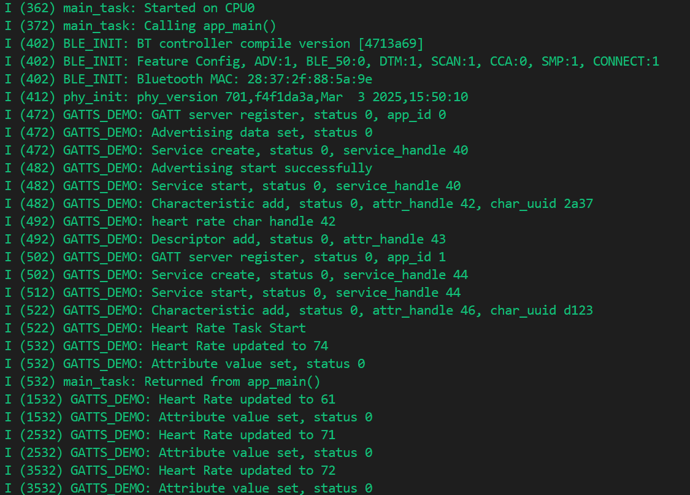
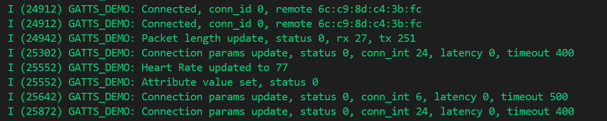
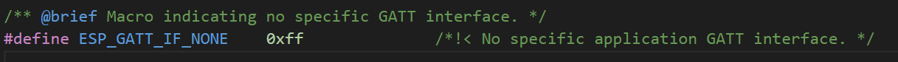

# Bluedroid GATT Server 双模GATT服务端

## 粗略阅读README文档

文档简介示例是进一步扩展，介绍了如何实现GATT服务器，如何处理特征访问请求

其他介绍和代码解释

## 构建、烧录和监视

* 选择目标芯片
* 选择端口号
* 选择烧录方式
* 点击**构建、烧录和监视**


1. 主任务在CPU0启动，调用主函数
2. `BLE_INIT` 蓝牙控制器的编译版本 
3. 蓝牙功能配置，包括广告、BLE5.0支持、设备测试模式、扫描、CCA、安全管理协议和连接支持
4. 蓝牙设备的MAC地址
5. phy_version 物流层初始化信息，包括版本和时间戳
6. `GATT_DEMO` 服务器注册成功，状态码为0，应用ID为0
7. 设置广播数据成功，状态码为0
8. 创建服务成功，状态码为0，服务句柄为40
9. 广播开始成功
10. 启动服务成功，状态码为0，服务句柄为40
11. 添加特征成功，状态码为0，属性句柄为42，属性UUID为2a37
12. 心率特征句柄为42
13. 添加描述符成功，状态码为0，属性句柄为43
14. GATT服务器注册成功，状态码为0，应用ID为1
15. 添加特征成功，状态码为0，属性句柄为46，属性UUID为d123
16. 心率任务开始
17. 心率更新为74
18. 设置属性值成功，状态码为0

...

1. 连接成功，连接ID为0，远程设备MAC地址
2. 数据包长度更新成功，状态码为0，接收长度为27，发送长度为251
3. 连接参数更新成功，状态码为0，连接间隔为24，延迟为0，超时为400
4. 心率更新为77
5. 设置属性值成功，状态码为0
6. 连接参数更新成功，状态码为0，连接间隔为6，延迟为0，超时为500
7. 连接参数更新成功，状态码为0，连接间隔为24，延迟为0，超时为400

上述为监视输出的翻译解释，就笔者而言，先知道，再了解。

## 代码分析

> 此处代码分析按笔者所理解的节奏，会先把头文件进行分析（因为头文件不复杂，且不长），示例还导入了led_strip ，在rmt/led_strip中有rmt的比较详细的解释，关于SPI操作led_strip在后面的示例会详细解释

### 头文件和导入文件分析

文件采用接口式，以函数暴露数据，而不直接操作数据。
`esp_random` 从硬件RNG中获取随机的32位字
`heart_rate` 的取值范围是60~81，模拟真实的心率数据
用于向连接的客户端提供实时的心率数据，即模拟传感器获取数据

> 一个小插曲，笔者在分析代码解释的时候AI突然崩了，一下子又很慌乱的感觉，可能习惯了不懂就找AI问的这种行为，觉得代码会有什么深意。我们必须承认AI是一个非常提高效率的工具，但很多时候应该相信自己的能力，其实这段代码的内容很简单，头文件也没有什么特殊的，所以请相信自己能分析，多试着分析

```c
/* Defines */
#define HEART_RATE_TASK_PERIOD (1000 / portTICK_PERIOD_MS)

/* Public function declarations */
uint8_t get_heart_rate(void);
void update_heart_rate(void);

/* Private variables */
static uint8_t heart_rate;

/* Public functions */
uint8_t get_heart_rate(void) { return heart_rate; }

void update_heart_rate(void) { heart_rate = 60 + (uint8_t)(esp_random() % 21); }
```

led的文件导入扩展库led_strip。笔者突然发现这基本和get-started中的blink一致，或者说本来控制就那些东西，所以此处不作具体分析，只是给外部提供了led控制四个函数

```c
/* Includes */
/* ESP APIs */
#include "driver/gpio.h"
#include "led_strip.h"

/* Defines */
#define BLINK_GPIO CONFIG_EXAMPLE_BLINK_GPIO

/* Public function declarations */
uint8_t get_led_state(void);
void led_on(void);
void led_off(void);
void led_init(void);

/* Private variables */
static uint8_t led_state;

#ifdef CONFIG_EXAMPLE_BLINK_LED_STRIP
static led_strip_handle_t led_strip;
#endif

/* Public functions */
uint8_t get_led_state(void)
{
    return led_state;
}

#ifdef CONFIG_EXAMPLE_BLINK_LED_STRIP

void led_on(void)
{
    /* Set the LED pixel using RGB from 0 (0%) to 255 (100%) for each color */
    led_strip_set_pixel(led_strip, 0, 16, 16, 16);

    /* Refresh the strip to send data */
    led_strip_refresh(led_strip);

    /* Update LED state */
    led_state = true;
}

void led_off(void)
{
    /* Set all LED off to clear all pixels */
    led_strip_clear(led_strip);

    /* Update LED state */
    led_state = false;
}

void led_init(void)
{
    // ESP_LOGI(TAG, "example configured to blink addressable led!");
    /* LED strip initialization with the GPIO and pixels number*/
    led_strip_config_t strip_config = {
        .strip_gpio_num = CONFIG_EXAMPLE_BLINK_GPIO,
        .max_leds = 1, // at least one LED on board
    };
#if CONFIG_EXAMPLE_BLINK_LED_STRIP_BACKEND_RMT
    led_strip_rmt_config_t rmt_config = {
        .resolution_hz = 10 * 1000 * 1000, // 10MHz
        .flags.with_dma = false,
    };
    ESP_ERROR_CHECK(
        led_strip_new_rmt_device(&strip_config, &rmt_config, &led_strip));
#elif CONFIG_EXAMPLE_BLINK_LED_STRIP_BACKEND_SPI
    led_strip_spi_config_t spi_config = {
        .spi_bus = SPI2_HOST,
        .flags.with_dma = true,
    };
    ESP_ERROR_CHECK(
        led_strip_new_spi_device(&strip_config, &spi_config, &led_strip));
#else
#error "unsupported LED strip backend"
#endif
    /* Set all LED off to clear all pixels */
    led_off();
}

#elif CONFIG_EXAMPLE_BLINK_LED_GPIO

void led_on(void)
{
    gpio_set_level(CONFIG_EXAMPLE_BLINK_GPIO, false);
}

void led_off(void)
{
    gpio_set_level(CONFIG_EXAMPLE_BLINK_GPIO, true);
}

void led_init(void)
{
    // ESP_LOGI(TAG, "example configured to blink gpio led!");
    gpio_reset_pin(CONFIG_EXAMPLE_BLINK_GPIO);
    /* Set the GPIO as a push/pull output */
    gpio_set_direction(CONFIG_EXAMPLE_BLINK_GPIO, GPIO_MODE_OUTPUT);
    gpio_set_level(CONFIG_EXAMPLE_BLINK_GPIO, 1);
}
```

### 宏定义、结构体和静态变量

* `PROFILE_NUM` PROFILE(蓝牙配置文件)的数量，`HEART_PROFILE_APP_ID` 、`AUTO_IO_PROFILE_APP_ID` 对应的ID
* `HEART_RATE_SVC_UUID` `HEART_RATE_CHAR_UUID` `AUTO_IO_SVC_UUID`储存三个服务对应UUID（唯一通用识别码）
* `HEART_NUM_HANDLE` 本例心率服务中句柄数量 ， `AUTO_IO_NUM_HANDLE` 自动IO的句柄数量
* `ADV_CONFIG_FLAG` `SCAN_RSP_CONFIG_FLAG` 是GAP中广告和扫描的掩码

`gatts_profile_inst` 类型整合了gatt服务中可能的参数

* `gatts_cb` : `esp_gatts_cb_t`类型，储存GATT server的回调函数
* `gatts_if` : GATT服务接口标识符
* `app_id` : 储存服务应用的ID
* `conn_id` : 储存远端连接对象的ID
* `service_handle` : 对应服务的句柄
* `service_id` : `esp_gatt_srvc_id_t`类型GATT服务标识符，包含UUID和版本号
* `char_handle` : 对应特征的句柄
* `char_uuid` : `esp_bt_uuid_t`类型，特征UUID
* `perm` : `esp_gatt_perm_t`类型，代表权限
* `property` : `esp_gatt_char_prop_t`类型，代表特征属性
* `descr_handle` : 对应描述符的句柄
* `descr_uuid` ： 描述符UUID


```c
#define PROFILE_NUM 2
#define HEART_PROFILE_APP_ID 0
#define AUTO_IO_PROFILE_APP_ID 1
#define HEART_RATE_SVC_UUID 0x180D
#define HEART_RATE_CHAR_UUID 0x2A37
#define HEART_NUM_HANDLE 4
#define AUTO_IO_SVC_UUID 0x1815
#define AUTO_IO_NUM_HANDLE 3

#define ADV_CONFIG_FLAG      (1 << 0)
#define SCAN_RSP_CONFIG_FLAG (1 << 1)

struct gatts_profile_inst {
    esp_gatts_cb_t gatts_cb;
    uint16_t gatts_if;
    uint16_t app_id;
    uint16_t conn_id;
    uint16_t service_handle;
    esp_gatt_srvc_id_t service_id;
    uint16_t char_handle;
    esp_bt_uuid_t char_uuid;
    esp_gatt_perm_t perm;
    esp_gatt_char_prop_t property;
    uint16_t descr_handle;
    esp_bt_uuid_t descr_uuid;
};
```

主要对有特定普遍性作用的变量进行解释

`esp_attr_value_t` 属性值类型

* `attr_max_len` 属性值最大长度
* `attr_len` 属性值当前长度
* `attr_value` 属性值指针


`esp_ble_adv_data_t` 广告内容数据 [API参考](https://docs.espressif.com/projects/esp-idf/zh_CN/v5.5/esp32/api-reference/bluetooth/esp_gap_ble.html#_CPPv418esp_ble_adv_data_t)

* `set_scan_rsp` 是否将广告数据设置为扫描响应
* `include_name` 广告数据是否包括设备名称
* `include_txpower` 广告数据是否包括tx功率
* `min_interval` 广告数据显示从机首次连接最小间隔
* `max_interval` 广告数据显示从机首次连接最大间隔
* `appearance` 设备外观？（设备制造商？）
* `manufacturer_len` 制造商数据长度
* `p_manufacturer_data` 制造商数据指针
* `service_data_len` 服务数据长度
* `p_service_data` 服务数据指针
* `flag` 发现模式的通告标志

`esp_ble_adv_params_t` 广告参数

* `adv_int_min` 非定向和低占空比定向广告的最小广告间隔
* `adv_int_max` 非定向和低占空比定向广告的最大广告间隔
* `adv_type` 广告类型
* `own_addr_type` 所有者蓝牙设备地址类型
* `channel_map` 广告通道
* `adv_filter_policy` 广告过滤策略

`gatts_profile_inst` 自定义类型数组，储存两个配置，通过[ID]指定编号，绑定`gatts_cb`回调函数和`gatts_if`绑定标识符该宏定义代表没有特定标识符

```c
static const char *GATTS_TAG = "GATTS_DEMO";
static esp_gatt_char_prop_t heart_property = 0;
static esp_gatt_char_prop_t auto_io_property = 0;
static uint8_t heart_rate_val[2] = {0};
static uint8_t led_status[2] = {0};
static bool indicate_enabled = false;
static bool hrs_create_cmpl = false;  // Heart Rate Service
static uint8_t adv_config_done = 0;

static esp_attr_value_t heart_rate_attr = {
    .attr_max_len = 2,
    .attr_len     = sizeof(heart_rate_val),
    .attr_value   = heart_rate_val,
};

static esp_attr_value_t led_status_attr = {
    .attr_max_len = 2,
    .attr_len     = sizeof(led_status),
    .attr_value   = led_status,
};

static const uint8_t led_chr_uuid[] = {
    0x23, 0xd1, 0xbc, 0xea, 0x5f, 0x78, 0x23, 0x15, 0xde, 0xef, 0x12, 0x12, 0x25, 0x15, 0x00, 0x00
};

static esp_ble_adv_data_t adv_data = {
    .set_scan_rsp = false,
    .include_name = true,
    .include_txpower = false,
    .min_interval = 0x0006,
    .max_interval = 0x0010,
    .appearance = 0x00,
    .manufacturer_len = 0,
    .p_manufacturer_data =  NULL,
    .service_data_len = 0,
    .p_service_data = NULL,
    .service_uuid_len = 0,
    .p_service_uuid = NULL,
    .flag = (ESP_BLE_ADV_FLAG_GEN_DISC | ESP_BLE_ADV_FLAG_BREDR_NOT_SPT),
};

static esp_ble_adv_params_t adv_params = {
    .adv_int_min        = 0x20,  // 20ms
    .adv_int_max        = 0x40,  // 40ms
    .adv_type           = ADV_TYPE_IND,
    .own_addr_type      = BLE_ADDR_TYPE_PUBLIC,
    .channel_map        = ADV_CHNL_ALL,
    .adv_filter_policy  = ADV_FILTER_ALLOW_SCAN_ANY_CON_ANY,
};

static struct gatts_profile_inst gl_profile_tab[PROFILE_NUM] = {
    [HEART_PROFILE_APP_ID] = {
        .gatts_cb = heart_gatts_profile_event_handler,
        .gatts_if = ESP_GATT_IF_NONE,       /* Not get the gatt_if, so initial is ESP_GATT_IF_NONE */
    },
    [AUTO_IO_PROFILE_APP_ID] = {
        .gatts_cb = auto_io_gatts_profile_event_handler,
        .gatts_if = ESP_GATT_IF_NONE,       /* Not get the gatt_if, so initial is ESP_GATT_IF_NONE */
    },
};
```

### app_main函数

1. NVS非易失性存储初始化
2. `esp_bt_controller_mem_release` 释放经典蓝牙内存
3. `BT_CONTROLLER_INIT_CONFIG_DEFAULT`宏函数进行默认配置
4. `esp_bt_controller_init` 蓝牙控制器写入配置并初始化 `esp_bt_controller_enable` 使能蓝牙控制器
5. `esp_bluedroid_init` 蓝牙主机初始化(根据文档描述，bluedroid充当主机作用) `esp_bluedroid_enable` 使能主机
6. `esp_ble_gap_register_callback` 绑定GAP事件回调函数
7. `esp_ble_gatts_register_callback` 注册GATT服务器应用程序回调
8. `esp_ble_gatts_app_register` 注册GATT服务器应用程序，指定应用ID，有两个应用，注册两个ID
9. `esp_ble_gatt_set_local_mtu` 设置本地所需MTU大小
10. 启动心率任务，生成随机心率

```c
void app_main(void)
{
    esp_err_t ret;

    led_init();

    ret = nvs_flash_init();
    if (ret == ESP_ERR_NVS_NO_FREE_PAGES || ret == ESP_ERR_NVS_NEW_VERSION_FOUND) {
        ESP_ERROR_CHECK(nvs_flash_erase());
        ret = nvs_flash_init();
    }
    ESP_ERROR_CHECK(ret);

    ESP_ERROR_CHECK(esp_bt_controller_mem_release(ESP_BT_MODE_CLASSIC_BT));

    esp_bt_controller_config_t bt_cfg = BT_CONTROLLER_INIT_CONFIG_DEFAULT();
    ret = esp_bt_controller_init(&bt_cfg);
    if (ret) {
        ESP_LOGE(GATTS_TAG, "%s initialize controller failed: %s", __func__, esp_err_to_name(ret));
        return;
    }

    ret = esp_bt_controller_enable(ESP_BT_MODE_BLE);
    if (ret) {
        ESP_LOGE(GATTS_TAG, "%s enable controller failed: %s", __func__, esp_err_to_name(ret));
        return;
    }

    ret = esp_bluedroid_init();
    if (ret) {
        ESP_LOGE(GATTS_TAG, "%s init bluetooth failed: %s", __func__, esp_err_to_name(ret));
        return;
    }

    ret = esp_bluedroid_enable();
    if (ret) {
        ESP_LOGE(GATTS_TAG, "%s enable bluetooth failed: %s", __func__, esp_err_to_name(ret));
        return;
    }

    ret = esp_ble_gap_register_callback(gap_event_handler);
    if (ret) {
        ESP_LOGE(GATTS_TAG, "gap register error, error code = %x", ret);
        return;
    }

    ret = esp_ble_gatts_register_callback(gatts_event_handler);
    if (ret) {
        ESP_LOGE(GATTS_TAG, "gatts register error, error code = %x", ret);
        return;
    }

    ret = esp_ble_gatts_app_register(HEART_PROFILE_APP_ID);
    if (ret) {
        ESP_LOGE(GATTS_TAG, "app register error, error code = %x", ret);
        return;
    }

    ret = esp_ble_gatts_app_register(AUTO_IO_PROFILE_APP_ID);
    if (ret) {
        ESP_LOGE(GATTS_TAG, "app register error, error code = %x", ret);
        return;
    }

    ret = esp_ble_gatt_set_local_mtu(500);
    if (ret) {
        ESP_LOGE(GATTS_TAG, "set local  MTU failed, error code = %x", ret);
    }

    xTaskCreate(heart_rate_task, "Heart Rate", 2 * 1024, NULL, 5, NULL);
}

```

### 事件回调函数

`gap_event_handler` GAP层主要负责广播、连接、参数更新等“链路管理”

1. 判断触发事件 [事件参数](https://docs.espressif.com/projects/esp-idf/zh_CN/v5.5/esp32/api-reference/bluetooth/esp_gap_ble.html#_CPPv422esp_gap_ble_cb_event_t)
2. `ESP_GAP_BLE_ADV_DATA_SET_COMPLETE_EVT` 广告数据设置完成，日志输出，清除标志位，判断是否为0并开启广告
3. `ESP_GAP_BLE_SCAN_RSP_DATA_SET_COMPLETE_EVT` 扫描响应数据集完成，日志输出，清除标志位，判断后开始广告
4. `ESP_GAP_BLE_ADV_START_COMPLETE_EVT` 广告开始完成，判断开始状态，根据是否成功进行日志输出
5. `ESP_GAP_BLE_UPDATE_CONN_PARAMS_EVT` 更新连接参数完成，日志输出更新后的参数
6. `ESP_GAP_BLE_SET_PKT_LENGTH_COMPLETE_EVT` 设置PKT长度完成，日志输出参数

```c
static void gap_event_handler(esp_gap_ble_cb_event_t event, esp_ble_gap_cb_param_t *param)
{
    switch (event) {
    case ESP_GAP_BLE_ADV_DATA_SET_COMPLETE_EVT:
        ESP_LOGI(GATTS_TAG, "Advertising data set, status %d", param->adv_data_cmpl.status);
        adv_config_done &= (~ADV_CONFIG_FLAG);
        if (adv_config_done == 0) {
            esp_ble_gap_start_advertising(&adv_params);
        }
        break;
    case ESP_GAP_BLE_SCAN_RSP_DATA_SET_COMPLETE_EVT:
        ESP_LOGI(GATTS_TAG, "Scan response data set, status %d", param->scan_rsp_data_cmpl.status);
        adv_config_done &= (~SCAN_RSP_CONFIG_FLAG);
        if (adv_config_done == 0) {
            esp_ble_gap_start_advertising(&adv_params);
        }
        break;
    case ESP_GAP_BLE_ADV_START_COMPLETE_EVT:
        if (param->adv_start_cmpl.status != ESP_BT_STATUS_SUCCESS) {
            ESP_LOGE(GATTS_TAG, "Advertising start failed, status %d", param->adv_start_cmpl.status);
            break;
        }
        ESP_LOGI(GATTS_TAG, "Advertising start successfully");
        break;
    case ESP_GAP_BLE_UPDATE_CONN_PARAMS_EVT:
        ESP_LOGI(GATTS_TAG, "Connection params update, status %d, conn_int %d, latency %d, timeout %d",
                 param->update_conn_params.status,
                 param->update_conn_params.conn_int,
                 param->update_conn_params.latency,
                 param->update_conn_params.timeout);
        break;
    case ESP_GAP_BLE_SET_PKT_LENGTH_COMPLETE_EVT:
        ESP_LOGI(GATTS_TAG, "Packet length update, status %d, rx %d, tx %d",
                 param->pkt_data_length_cmpl.status,
                 param->pkt_data_length_cmpl.params.rx_len,
                 param->pkt_data_length_cmpl.params.tx_len);
        break;
    default:
        break;
    }
}
```

该回调函数的参数均由BLE栈填充，`event`包含事件类型 `gatts_if`包含事件所属GATT接口标识码 `param`包含事件具体参数

1. 函数中判断事件`ESP_GATTS_REG_EVT`注册GATT服务应用程序触发，如果注册完成，把对应应用程序的标识码设置成接口标识码（只在第一次注册应用时触发）
2. do{...}while形式用于把代码封装成块，逻辑更清晰。循环判断标识码，如果是应用程序的标识码，或者是不指定的标识码，就调用对应的回调函数


```c
static void gatts_event_handler(esp_gatts_cb_event_t event, esp_gatt_if_t gatts_if, esp_ble_gatts_cb_param_t *param)
{
    if (event == ESP_GATTS_REG_EVT) {
        if (param->reg.status == ESP_GATT_OK) {
            gl_profile_tab[param->reg.app_id].gatts_if = gatts_if;

        } else {
            ESP_LOGI(GATTS_TAG, "Reg app failed, app_id %04x, status %d",
                    param->reg.app_id,
                    param->reg.status);
            return;
        }
    }

    //gatts_if registered complete, call cb handlers
    do {
        int idx;
        for (idx = 0; idx < PROFILE_NUM; idx++) {
            if (gatts_if == ESP_GATT_IF_NONE || /* ESP_GATT_IF_NONE, not specify a certain gatt_if, need to call every profile cb function */
                    gatts_if == gl_profile_tab[idx].gatts_if) {
                if (gl_profile_tab[idx].gatts_cb) {
                    gl_profile_tab[idx].gatts_cb(event, gatts_if, param);
                }
            }
        }
    } while(0);
}
```

### 应用程序回调函数

`heart_gatts_profile_event_handler` 心率应用程序的回调函数，参数由上一回调函数继承传入

1. 判断事件类型
2. `ESP_GATTS_REG_EVT` 初始化事件，在上层函数中进行过处理，此处进行日志打印状态和应用ID
   * `is_primary` 代表是否是主服务
   * `inst_id` 用以ID区分
   * `uuid` 储存UUID，可存16位，32位，128位，`len` 保存长度，具体UUID存在对应内存
   * `esp_ble_gap_config_adv_data` 用于覆盖BTA默认广告参数
3. `ESP_GATTS_CREATE_EVT` 创建GATT服务器时触发，先进行日志打印创建状态码和句柄
   1. 绑定软件内句柄和创建的句柄，设置特征UUID的长度和ID
   2. `esp_ble_gatts_start_service` 通过句柄开始服务
   3. `heart_property = ESP_GATT_CHAR_PROP_BIT_READ | ESP_GATT_CHAR_PROP_BIT_INDICATE` 定义特征值，通过两个宏的或操作同时启动这两个功能，客户端可以读取 | 服务器可以在数据更新时主动推送，并且客户端需要确认
   4. `esp_ble_gatts_add_char` 添加特征到服务 [API参考](https://docs.espressif.com/projects/esp-idf/zh_CN/v5.5/esp32/api-reference/bluetooth/esp_gatts.html#_CPPv422esp_ble_gatts_add_char8uint16_tP13esp_bt_uuid_t15esp_gatt_perm_t20esp_gatt_char_prop_tP16esp_attr_value_tP18esp_attr_control_t)
4. `ESP_GATTS_ADD_CHAR_EVT` 将特征添加到服务时触发，日志输出添加特征值的状态，特征值句柄，UUID
   1. 绑定特征值句柄，设置UUID
   2. 再次输出特征句柄，`esp_ble_gatts_add_char_descr` 添加特征描述符（此处没有指向描述值的指针）
5. `ESP_GATTS_ADD_CHAR_DESCR_EVT` 将特征描述符添加到服务触发（*尽管描述值指针为NULL，但事件仍会触发*），日志输出，绑定句柄
6. `ESP_GATTS_READ_EVT` 收到来自客户端的读取请求时触发，日志打印
   1. 创建`esp_gatt_rsp_t`类型变量，设初值为0
   2. 设置句柄和消息长度，复制值
   3. `esp_ble_gatts_send_response` 发送回复，参数为*GATT标识符，连接设备ID，发送ID，状态，数据指针*
7. `ESP_GATTS_WRITE_EVT` 收到来自客户端的写请求时触发，日志打印（**ESP_LOG_BUFFER_HEX**宏用于以16进制格式打印数据）
   1. 第一个大判断触发写事件的指针是否是特征描述指针，并且长度为2，根据[参数结构](https://docs.espressif.com/projects/esp-idf/zh_CN/v5.5/esp32/api-reference/bluetooth/esp_gatts.html#_CPPv424esp_ble_gatts_cb_param_t)，几乎每个事件都有专门的结构体存储参数，判断确认请求事件的描述符需要的是该操作
   2. `uint16_t descr_value = param->write.value[1]<<8 | param->write.value[0];`BLE协议使用小段字节序，该操作把2字节数据转换为16位整数（1字节8位，左移后拼接）
   3. `0x0001`描述值，如果`heart_property & ESP_GATT_CHAR_PROP_BIT_NOTIFY`即权限允许通知
   4. `esp_ble_gatts_send_indicate` 向客户端发送通知或指示（for循环只是代表填入数据的流程）[API指示](https://docs.espressif.com/projects/esp-idf/zh_CN/v5.5/esp32/api-reference/bluetooth/esp_gatts.html#_CPPv427esp_ble_gatts_send_indicate13esp_gatt_if_t8uint16_t8uint16_t8uint16_tP7uint8_tb)
   5. `0x0002`描述值，同样检查权限，`indicate_enabled` 变量设为true，在全局启用Indication指示功能，`esp_ble_gatts_send_indicate`函数进行发送数据
   6. `0x0000`描述值，`indicate_enabled` 变量设为false，客户端关闭指示功能
   7. 其他描述值并没编辑逻辑，只在日志输出
   8. `example_write_event_env`是自定义函数，展示在不满足判断是也可以进行别的操作
8. 其他很多事件没有特别的处理操作，只是进行日志打印，不作赘述
9. `ESP_GATTS_CONNECT_EVT` 设备连接时触发，设置conn_id为设备conn_id
10. `ESP_GATTS_DISCONNECT_EVT` 设备断开连接，无论`indicate_enabled`变量状态，设为false关闭，并`esp_ble_gap_start_advertising`重新开启广播
11. `ESP_GATTS_SET_ATTR_VAL_EVT` 设置属性值触发事件，日志输出
    1. 如果`indicate_enabled`为true，允许指示
    2. 拷贝数据并发送
    3. 事件触发实际是在本地数据变化，`esp_ble_gatts_set_attr_value()`重新设置值之后，如果客户端允许指示，服务端会自动发送更新后的数据，符合*ESP_GATT_CHAR_PROP_BIT_INDICATE*权限

```c
static void heart_gatts_profile_event_handler(esp_gatts_cb_event_t event, esp_gatt_if_t gatts_if, esp_ble_gatts_cb_param_t *param)
{
    switch (event) {
    case ESP_GATTS_REG_EVT:
        ESP_LOGI(GATTS_TAG, "GATT server register, status %d, app_id %d", param->reg.status, param->reg.app_id);
        gl_profile_tab[HEART_PROFILE_APP_ID].service_id.is_primary = true;
        gl_profile_tab[HEART_PROFILE_APP_ID].service_id.id.inst_id = 0x00;
        gl_profile_tab[HEART_PROFILE_APP_ID].service_id.id.uuid.len = ESP_UUID_LEN_16;
        gl_profile_tab[HEART_PROFILE_APP_ID].service_id.id.uuid.uuid.uuid16 = HEART_RATE_SVC_UUID;

        //config adv data
        esp_err_t ret = esp_ble_gap_config_adv_data(&adv_data);
        if (ret) {
            ESP_LOGE(GATTS_TAG, "config adv data failed, error code = %x", ret);
            break;
        }

        esp_ble_gatts_create_service(gatts_if, &gl_profile_tab[HEART_PROFILE_APP_ID].service_id, HEART_NUM_HANDLE);
        break;
    case ESP_GATTS_CREATE_EVT:
        //service has been created, now add characteristic declaration
        ESP_LOGI(GATTS_TAG, "Service create, status %d, service_handle %d", param->create.status, param->create.service_handle);
        gl_profile_tab[HEART_PROFILE_APP_ID].service_handle = param->create.service_handle;
        gl_profile_tab[HEART_PROFILE_APP_ID].char_uuid.len = ESP_UUID_LEN_16;
        gl_profile_tab[HEART_PROFILE_APP_ID].char_uuid.uuid.uuid16 = HEART_RATE_CHAR_UUID;
        esp_ble_gatts_start_service(gl_profile_tab[HEART_PROFILE_APP_ID].service_handle);
        heart_property = ESP_GATT_CHAR_PROP_BIT_READ | ESP_GATT_CHAR_PROP_BIT_INDICATE;
        ret = esp_ble_gatts_add_char(gl_profile_tab[HEART_PROFILE_APP_ID].service_handle, &gl_profile_tab[HEART_PROFILE_APP_ID].char_uuid,
                            ESP_GATT_PERM_READ,
                            heart_property,
                            &heart_rate_attr, NULL);
        if (ret) {
            ESP_LOGE(GATTS_TAG, "add char failed, error code = %x", ret);
        }
        break;
    case ESP_GATTS_ADD_CHAR_EVT:
        ESP_LOGI(GATTS_TAG, "Characteristic add, status %d, attr_handle %d, char_uuid %x",
                 param->add_char.status, param->add_char.attr_handle, param->add_char.char_uuid.uuid.uuid16);
        gl_profile_tab[HEART_PROFILE_APP_ID].char_handle = param->add_char.attr_handle;
        gl_profile_tab[HEART_PROFILE_APP_ID].descr_uuid.len = ESP_UUID_LEN_16;
        gl_profile_tab[HEART_PROFILE_APP_ID].descr_uuid.uuid.uuid16 = ESP_GATT_UUID_CHAR_CLIENT_CONFIG;
        ESP_LOGI(GATTS_TAG, "heart rate char handle %d", param->add_char.attr_handle);
        ret = esp_ble_gatts_add_char_descr(gl_profile_tab[HEART_PROFILE_APP_ID].service_handle, &gl_profile_tab[HEART_PROFILE_APP_ID].descr_uuid,
                            ESP_GATT_PERM_READ | ESP_GATT_PERM_WRITE, NULL, NULL);
        break;
    case ESP_GATTS_ADD_CHAR_DESCR_EVT:
        ESP_LOGI(GATTS_TAG, "Descriptor add, status %d, attr_handle %u",
                 param->add_char_descr.status, param->add_char_descr.attr_handle);
        gl_profile_tab[HEART_PROFILE_APP_ID].descr_handle = param->add_char_descr.attr_handle;
        hrs_create_cmpl = true;
        break;
    case ESP_GATTS_READ_EVT:
        ESP_LOGI(GATTS_TAG, "Characteristic read");
        esp_gatt_rsp_t rsp;
        memset(&rsp, 0, sizeof(esp_gatt_rsp_t));
        rsp.attr_value.handle = param->read.handle;
        rsp.attr_value.len = 2;
        memcpy(rsp.attr_value.value, heart_rate_val, sizeof(heart_rate_val));
        esp_ble_gatts_send_response(gatts_if, param->read.conn_id, param->read.trans_id, ESP_GATT_OK, &rsp);
        break;
    case ESP_GATTS_WRITE_EVT:
        ESP_LOGI(GATTS_TAG, "Characteristic write, value len %u, value ", param->write.len);
        ESP_LOG_BUFFER_HEX(GATTS_TAG, param->write.value, param->write.len);

        if (gl_profile_tab[HEART_PROFILE_APP_ID].descr_handle == param->write.handle && param->write.len == 2) {
            uint16_t descr_value = param->write.value[1]<<8 | param->write.value[0];
            if (descr_value == 0x0001) {
                if (heart_property & ESP_GATT_CHAR_PROP_BIT_NOTIFY) {
                    ESP_LOGI(GATTS_TAG, "Notification enable");
                    uint8_t notify_data[15];
                    for (int i = 0; i < sizeof(notify_data); i++) {
                        notify_data[i] = i%0xff;
                    }
                    //the size of notify_data[] need less than MTU size
                    esp_ble_gatts_send_indicate(gatts_if, param->write.conn_id, gl_profile_tab[HEART_PROFILE_APP_ID].char_handle,
                                            sizeof(notify_data), notify_data, false);
                }
            } else if (descr_value == 0x0002) {
                if (heart_property & ESP_GATT_CHAR_PROP_BIT_INDICATE) {
                    ESP_LOGI(GATTS_TAG, "Indication enable");
                    indicate_enabled = true;
                    uint8_t indicate_data[15];
                    for (int i = 0; i < sizeof(indicate_data); i++) {
                        indicate_data[i] = i%0xff;
                    }
                    //the size of indicate_data[] need less than MTU size
                    esp_ble_gatts_send_indicate(gatts_if, param->write.conn_id, gl_profile_tab[HEART_PROFILE_APP_ID].char_handle,
                                            sizeof(indicate_data), indicate_data, true);
                }
            } else if (descr_value == 0x0000) {
                indicate_enabled = false;
                ESP_LOGI(GATTS_TAG, "Notification/Indication disable");
            } else {
                ESP_LOGE(GATTS_TAG, "Invalid descriptor value");
                ESP_LOG_BUFFER_HEX(GATTS_TAG, param->write.value, param->write.len);
            }
        }
        example_write_event_env(gatts_if, param);
        break;
    case ESP_GATTS_DELETE_EVT:
        break;
    case ESP_GATTS_START_EVT:
        ESP_LOGI(GATTS_TAG, "Service start, status %d, service_handle %d", param->start.status, param->start.service_handle);
        break;
    case ESP_GATTS_STOP_EVT:
        break;
    case ESP_GATTS_CONNECT_EVT:
        ESP_LOGI(GATTS_TAG, "Connected, conn_id %u, remote "ESP_BD_ADDR_STR"",
                param->connect.conn_id, ESP_BD_ADDR_HEX(param->connect.remote_bda));
        gl_profile_tab[HEART_PROFILE_APP_ID].conn_id = param->connect.conn_id;
        break;
    case ESP_GATTS_DISCONNECT_EVT:
        ESP_LOGI(GATTS_TAG, "Disconnected, remote "ESP_BD_ADDR_STR", reason 0x%02x",
                 ESP_BD_ADDR_HEX(param->disconnect.remote_bda), param->disconnect.reason);
        indicate_enabled = false;
        esp_ble_gap_start_advertising(&adv_params);
        break;
    case ESP_GATTS_CONF_EVT:
        ESP_LOGI(GATTS_TAG, "Confirm receive, status %d, attr_handle %d", param->conf.status, param->conf.handle);
        if (param->conf.status != ESP_GATT_OK) {
            ESP_LOG_BUFFER_HEX(GATTS_TAG, param->conf.value, param->conf.len);
        }
        break;
    case ESP_GATTS_SET_ATTR_VAL_EVT:
        ESP_LOGI(GATTS_TAG, "Attribute value set, status %d", param->set_attr_val.status);
        if (indicate_enabled) {
            uint8_t indicate_data[2] = {0};
            memcpy(indicate_data, heart_rate_val, sizeof(heart_rate_val));
            esp_ble_gatts_send_indicate(gatts_if, gl_profile_tab[HEART_PROFILE_APP_ID].conn_id, gl_profile_tab[HEART_PROFILE_APP_ID].char_handle, sizeof(indicate_data), indicate_data, true);
        }
        break;
    default:
        break;
    }
}
```

`auto_io_gatts_profile_event_handler` 为自动输入输出的回调函数，由上一级回调函数调用并传入参数
部分函数和操作逻辑和上一个函数一致，笔者在此处不重复解释，只挑选不一致的部分进行解释

1. `ESP_GATTS_CREATE_EVT` 创建服务中，特征的UUID是128位，后续写入采用的是拷贝的方式，启动服务后权限只有写
2. `ESP_GATTS_ADD_CHAR_EVT` 添加特征到服务只是进行了日志输出和参数绑定，`ESP_GATTS_ADD_CHAR_DESCR_EVT`添加特征描述值时也一样
3. `ESP_GATTS_READ_EVT` 收到来自客户端的读取请求，依然进行初始化，然后给定参数，进行发送回复
4. `ESP_GATTS_WRITE_EVT` 收到客户端的写请求，根据写的值的不同进行灯的开启和关闭（*笔者注，本例的写请求可以看作是客户端向服务端传递数据，服务端对数据的处理就是对写请求的响应*）
5. `ESP_GATTS_CONNECT_EVT` 连接客户端时，获取设备地址，设置连接参数，获取连接ID，更新连接参数。（AI分析，和上一函数操作不同的原因在于，上一函数用于提供心率数据，更新频率低，对间隔要求不严格，所以只需要连接id确保数据发送正确；而本函数需要快速响应用户操作，以控制led灯，所以需要设置严格的间隔和其他参数）

```c
static void auto_io_gatts_profile_event_handler(esp_gatts_cb_event_t event, esp_gatt_if_t gatts_if, esp_ble_gatts_cb_param_t *param)
{
    switch (event) {
    case ESP_GATTS_REG_EVT:
        ESP_LOGI(GATTS_TAG, "GATT server register, status %d, app_id %d", param->reg.status, param->reg.app_id);
        gl_profile_tab[AUTO_IO_PROFILE_APP_ID].service_id.is_primary = true;
        gl_profile_tab[AUTO_IO_PROFILE_APP_ID].service_id.id.inst_id = 0x00;
        gl_profile_tab[AUTO_IO_PROFILE_APP_ID].service_id.id.uuid.len = ESP_UUID_LEN_16;
        gl_profile_tab[AUTO_IO_PROFILE_APP_ID].service_id.id.uuid.uuid.uuid16 = AUTO_IO_SVC_UUID;
        esp_ble_gatts_create_service(gatts_if, &gl_profile_tab[AUTO_IO_PROFILE_APP_ID].service_id, AUTO_IO_NUM_HANDLE);
        break;
    case ESP_GATTS_CREATE_EVT:
        //service has been created, now add characteristic declaration
        ESP_LOGI(GATTS_TAG, "Service create, status %d, service_handle %d", param->create.status, param->create.service_handle);
        gl_profile_tab[AUTO_IO_PROFILE_APP_ID].service_handle = param->create.service_handle;
        gl_profile_tab[AUTO_IO_PROFILE_APP_ID].char_uuid.len = ESP_UUID_LEN_128;
        memcpy(gl_profile_tab[AUTO_IO_PROFILE_APP_ID].char_uuid.uuid.uuid128, led_chr_uuid, ESP_UUID_LEN_128);

        esp_ble_gatts_start_service(gl_profile_tab[AUTO_IO_PROFILE_APP_ID].service_handle);
        auto_io_property = ESP_GATT_CHAR_PROP_BIT_WRITE ;
        esp_err_t ret = esp_ble_gatts_add_char(gl_profile_tab[AUTO_IO_PROFILE_APP_ID].service_handle, &gl_profile_tab[AUTO_IO_PROFILE_APP_ID].char_uuid,
                            ESP_GATT_PERM_READ | ESP_GATT_PERM_WRITE ,
                            auto_io_property,
                            &led_status_attr, NULL);
        if (ret) {
            ESP_LOGE(GATTS_TAG, "add char failed, error code = %x", ret);
        }
        break;
    case ESP_GATTS_ADD_CHAR_EVT:
        ESP_LOGI(GATTS_TAG, "Characteristic add, status %d, attr_handle %d, char_uuid %x",
                 param->add_char.status, param->add_char.attr_handle, param->add_char.char_uuid.uuid.uuid16);
        gl_profile_tab[AUTO_IO_PROFILE_APP_ID].char_handle = param->add_char.attr_handle;
        break;
    case ESP_GATTS_ADD_CHAR_DESCR_EVT:
        ESP_LOGI(GATTS_TAG, "Descriptor add, status %d", param->add_char_descr.status);
        gl_profile_tab[AUTO_IO_PROFILE_APP_ID].descr_handle = param->add_char_descr.attr_handle;
        break;
    case ESP_GATTS_READ_EVT:
        ESP_LOGI(GATTS_TAG, "Characteristic read");
        esp_gatt_rsp_t rsp;
        memset(&rsp, 0, sizeof(esp_gatt_rsp_t));

        rsp.attr_value.handle = param->read.handle;
        rsp.attr_value.len = 1;
        rsp.attr_value.value[0] = 0x02;
        esp_ble_gatts_send_response(gatts_if, param->read.conn_id, param->read.trans_id, ESP_GATT_OK, &rsp);
        break;
    case ESP_GATTS_WRITE_EVT:
        ESP_LOGI(GATTS_TAG, "Characteristic write, value len %u, value ", param->write.len);
        ESP_LOG_BUFFER_HEX(GATTS_TAG, param->write.value, param->write.len);
        if (param->write.value[0]) {
            ESP_LOGI(GATTS_TAG, "LED ON!");
            led_on();
        } else {
            ESP_LOGI(GATTS_TAG, "LED OFF!");
            led_off();
        }
        example_write_event_env(gatts_if, param);
        break;
    case ESP_GATTS_DELETE_EVT:
        break;
    case ESP_GATTS_START_EVT:
        ESP_LOGI(GATTS_TAG, "Service start, status %d, service_handle %d", param->start.status, param->start.service_handle);
        break;
    case ESP_GATTS_STOP_EVT:
        break;
    case ESP_GATTS_CONNECT_EVT:
        esp_ble_conn_update_params_t conn_params = {0};
        memcpy(conn_params.bda, param->connect.remote_bda, sizeof(esp_bd_addr_t));
        conn_params.latency = 0;
        conn_params.max_int = 0x20;
        conn_params.min_int = 0x10;
        conn_params.timeout = 400;
        ESP_LOGI(GATTS_TAG, "Connected, conn_id %u, remote "ESP_BD_ADDR_STR"",
                param->connect.conn_id, ESP_BD_ADDR_HEX(param->connect.remote_bda));
        gl_profile_tab[AUTO_IO_PROFILE_APP_ID].conn_id = param->connect.conn_id;
        esp_ble_gap_update_conn_params(&conn_params);
        break;
    case ESP_GATTS_DISCONNECT_EVT:
        ESP_LOGI(GATTS_TAG, "Disconnected, remote "ESP_BD_ADDR_STR", reason 0x%02x",
                 ESP_BD_ADDR_HEX(param->disconnect.remote_bda), param->disconnect.reason);
        break;
    case ESP_GATTS_CONF_EVT:
        ESP_LOGI(GATTS_TAG, "Confirm receive, status %d, attr_handle %d", param->conf.status, param->conf.handle);
        if (param->conf.status != ESP_GATT_OK) {
            ESP_LOG_BUFFER_HEX(GATTS_TAG, param->conf.value, param->conf.len);
        }
        break;
    default:
        break;
    }
}
```

### 任务函数和写操作自定义函数

任务函数中只是进行心率的更新并写入`heart_rate_val`，再调用`esp_ble_gatts_set_attr_value`进行特征值的更新，`hrs_create_cmpl` 只是一个启停的条件参数

```c
static void heart_rate_task(void* param)
{
    ESP_LOGI(GATTS_TAG, "Heart Rate Task Start");

    while (1) {
        if (hrs_create_cmpl) {
            update_heart_rate();
            ESP_LOGI(GATTS_TAG, "Heart Rate updated to %d", get_heart_rate());

            heart_rate_val[1] = get_heart_rate();
            esp_ble_gatts_set_attr_value(gl_profile_tab[HEART_PROFILE_APP_ID].char_handle, 2, heart_rate_val);
        }

        vTaskDelay(1000 / portTICK_PERIOD_MS);
    }
}
```

自定义函数向客户端返回“服务端收到请求”，如果需要的话

```c
void example_write_event_env(esp_gatt_if_t gatts_if, esp_ble_gatts_cb_param_t *param)
{
    esp_gatt_status_t status = ESP_GATT_OK;
    if (param->write.need_rsp) {
        esp_ble_gatts_send_response(gatts_if, param->write.conn_id, param->write.trans_id, status, NULL);
    }
}
```

## 总结

本例程很长，很复杂，不是类似电机驱动那样的驱动逻辑和参数处理复杂，而是事件非常多，整个蓝牙协议和连接是一件非常严谨的事情，两个设备间的通信需要约定协议，需要相互的应答和数据处理。特别是GATT服务端那十几个事件触发，有各自的时机，有些环环相扣，类似外设在main中的初始化，只是这个完成和开始是由ESP内部的蓝牙栈自己触发，所以相应的操作非常多，肯定需要多次的，反复地理解和熟悉。本示例进行了蓝牙连接，但尝试的时候并不熟悉数据的处理，并没有实现很好的通信效果，希望在后续的实验中有更多的理解
