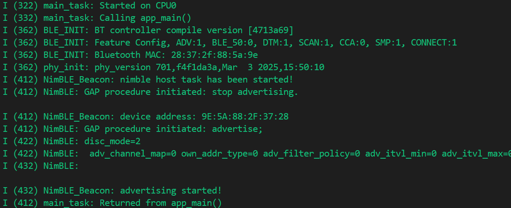
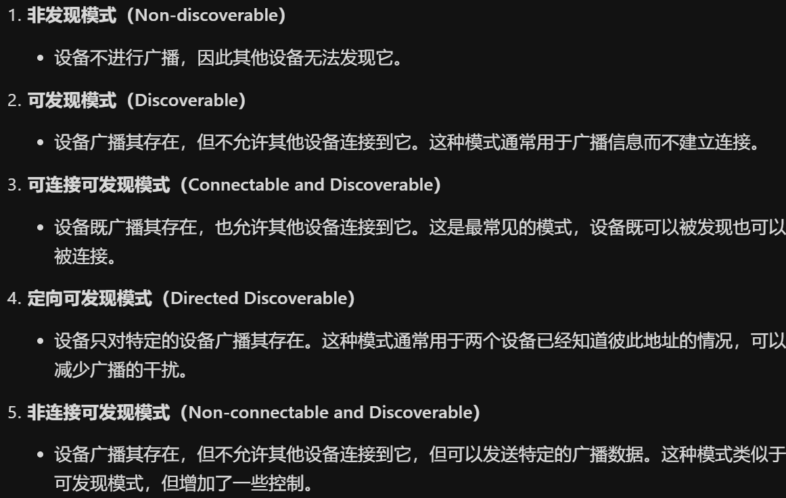

# NimBLE_Beacom 低功耗蓝牙信标

## 粗略阅读README文档

文档简介，示例介绍如何初始化NimBLE堆栈，配置广告和扫描相应数据，将广告作为不可连接的信标

演示指代，代码解释，其他

## 构建、烧录和监视

* 选择目标芯片
* 选择端口号
* 选择烧录方式
* 点击**构建、烧录和监视**


1. `BLE_INIT` 输出控制器编译版本号
2. 蓝牙功能配置：广告启用，BLE_5.0禁用，DTM（直接测试模式）启用，扫描启用，CCA（清除信道评估）禁用，SMP（安全管理协议）启用，连接启用
3. 蓝牙MAC地址
4. `phy_init` 物理层初始化，版本号，提交哈希值，编译日期
5. `NimBLE_Beacon` 示例日志输出 nimble启动
6. `NimBLE` 提示GAP程序初始化：停止广告
7. 设备地址
8. GAP程序初始化：开始广告
9. 发现模式为2（可发现可连接）
10. 广告配置：广告信道0，本地地址类型0，广告过滤器策略0，最小广告间隔0，最大广告间隔0
11. 广告开始

## 代码分析

> [代码详解](https://docs.espressif.com/projects/esp-idf/zh_CN/v5.5/esp32/api-guides/ble/get-started/ble-device-discovery.html#id25) 笔者发现官方编程指南中有本示例的代码详解，后续的分析算是笔者自己的记录，具体请参考官方解释

### NimBLE相关头文件

```c
/* NimBLE stack APIs */
#include "host/ble_hs.h"                    // 包含NimBLE主机子系统的API，主机子系统负责处理BLE协议栈的高层操作，如安全、连接、服务发现等
#include "host/ble_uuid.h"                  // 用于处理BLEUUID的函数和数据结构
#include "host/util/util.h"                 // 包含通用的函数和宏，可在NimBLE协议栈的其他部分使用
#include "nimble/ble.h"                     // NimBLE协议栈核心头文件，定义了协议主要接口和数据结构
#include "nimble/nimble_port.h"             // 包含NimBLE协议栈与特定硬件平台的接口定义
#include "nimble/nimble_port_freertos.h"    // NimBLE协议栈和FreeRTOS操作系统的接口定义
```

### app_main函数

1. 非易失性存储初始化
2. `nimble_port_init` 初始化主机和控制器堆栈
3. `gap_init` 自定义函数初始化GAP程序
4. `nimble_host_config_init` 自定义函数初始化主机
5. 创建`nimble_host_task`任务
6. 结束main程序

```c
void app_main(void) {
    /* Local variables */
    int rc = 0;
    esp_err_t ret = ESP_OK;

    /* NVS flash initialization */
    ret = nvs_flash_init();
    if (ret == ESP_ERR_NVS_NO_FREE_PAGES ||
        ret == ESP_ERR_NVS_NEW_VERSION_FOUND) {
        ESP_ERROR_CHECK(nvs_flash_erase());
        ret = nvs_flash_init();
    }
    if (ret != ESP_OK) {
        ESP_LOGE(TAG, "failed to initialize nvs flash, error code: %d ", ret);
        return;
    }

    /* NimBLE host stack initialization */
    ret = nimble_port_init();
    if (ret != ESP_OK) {
        ESP_LOGE(TAG, "failed to initialize nimble stack, error code: %d ",
                 ret);
        return;
    }

    /* GAP service initialization */
    rc = gap_init();
    if (rc != 0) {
        ESP_LOGE(TAG, "failed to initialize GAP service, error code: %d", rc);
        return;
    }

    /* NimBLE host configuration initialization */
    nimble_host_config_init();

    /* Start NimBLE host task thread and return */
    xTaskCreate(nimble_host_task, "NimBLE Host", 4*1024, NULL, 5, NULL);
    return;
}
```

### GAP相关程序

`gap_init` GAP初始化程序

1. `ble_svc_gap_init` 函数初始化GAP服务，建立设备在蓝牙网络中的基本信息标识框架
2. `ble_svc_gap_device_name_set` 设置GAP设备名称
3. `ble_svc_gap_device_appearance_set` 设置设备外观，该值用于传递其他辅助信息


```c
int gap_init(void) {
    /* Local variables */
    int rc = 0;

    /* Initialize GAP service */
    ble_svc_gap_init();

    /* Set GAP device name */
    rc = ble_svc_gap_device_name_set(DEVICE_NAME);
    if (rc != 0) {
        ESP_LOGE(TAG, "failed to set device name to %s, error code: %d",
                 DEVICE_NAME, rc);
        return rc;
    }

    /* Set GAP device appearance */
    rc = ble_svc_gap_device_appearance_set(BLE_GAP_APPEARANCE_GENERIC_TAG);
    if (rc != 0) {
        ESP_LOGE(TAG, "failed to set device appearance, error code: %d", rc);
        return rc;
    }
    return rc;
}
```

`adv_init` 广告初始化函数

1. `ble_hs_util_ensure_addr` 确保设备存在可以的蓝牙地址
2. `ble_hs_id_infer_auto(0, &own_addr_type)` 获得最优蓝牙地址状态，和地址类型
3. `ble_hs_id_copy_addr` 将蓝牙地址数据拷贝到软件地址储存中
4. `format_addr`使用sprintf函数将地址数组addr的内容格式化为一个字符串，并存储在addr_str指向的字符数组中。格式化字符串"%02X:%02X:%02X:%02X:%02X:%02X"指定了每个字节应该以两位十六进制数的形式输出，并在每个字节之间添加冒号作为分隔符。
5. 自定义函数开始广播

* `inline` 关键字是函数修饰符，建议编译器在调用函数时直接将函数代码插入函数调用点，而不是进行常规的函数时操作
* `static` 关键字代表静态，此处限制函数作用域，让其只在本文件中可以被调用

```c
/* Public functions */
void adv_init(void) {
    /* Local variables */
    int rc = 0;
    char addr_str[18] = {0};

    /* Make sure we have proper BT identity address set */
    rc = ble_hs_util_ensure_addr(0);
    if (rc != 0) {
        ESP_LOGE(TAG, "device does not have any available bt address!");
        return;
    }

    /* Figure out BT address to use while advertising */
    rc = ble_hs_id_infer_auto(0, &own_addr_type);
    if (rc != 0) {
        ESP_LOGE(TAG, "failed to infer address type, error code: %d", rc);
        return;
    }

    /* Copy device address to addr_val */
    rc = ble_hs_id_copy_addr(own_addr_type, addr_val, NULL);
    if (rc != 0) {
        ESP_LOGE(TAG, "failed to copy device address, error code: %d", rc);
        return;
    }
    format_addr(addr_str, addr_val);
    ESP_LOGI(TAG, "device address: %s", addr_str);

    /* Start advertising. */
    start_advertising();
}

/* Private functions */
inline static void format_addr(char *addr_str, uint8_t addr[]) {
    sprintf(addr_str, "%02X:%02X:%02X:%02X:%02X:%02X", addr[0], addr[1],
            addr[2], addr[3], addr[4], addr[5]);
}
```

1. `adv_fields` 结构体用于储存广告数据字段 `rsp_fields` 结构体用于储存扫描响应数据字段 `adv_params`结构体储存广告参数。 `ble_hs_adv_fields` 结构体预定义了一些常用的广播数据类型
2. `adv_fields.flags = BLE_HS_ADV_F_DISC_GEN | BLE_HS_ADV_F_BREDR_UNSUP` 设置广告标签为可发现和不支持经典蓝牙
3. `ble_svc_gap_device_name` 获取gap服务的设备名称，并存入广告数据段中，`name_is_complete` 代表名称字段是否完整
4. `tx_pwr_lvl` 设置设备发送功率，此处为自动，`tx_pwr_lvl_is_present`标记字段存在
5. `appearance` 设置设备外观，为通用标签，同样标记字段存在
6. `le_role` 设置设备LE角色，为外设，标记字段存在
7. `ble_gap_adv_set_fields` 设置广告数据
8. ` rsp_fields.device_addr` 设置扫描响应地址、地址类型、标记字段
9. 设置URI字段（*URI（Uniform Resource Identifier）字段用于传输一个统一资源标识符，它是一个用于标识资源的字符串。这个字段允许设备通过BLE广播其在线服务的地址，通常是指向一个网页的URL，用户可以通过点击这个地址在浏览器中打开相应的网页*）
10. `ble_gap_adv_rsp_set_fields` 设置扫描响应数据
11. `adv_params.conn_mode = BLE_GAP_CONN_MODE_NON` 连接模式为非连接 `adv_params.disc_mode = BLE_GAP_DISC_MODE_GEN` 发现模式为一般发现
12. `ble_gap_adv_start` 启动广播

```c
static void start_advertising(void) {
    /* Local variables */
    int rc = 0;
    const char *name;
    struct ble_hs_adv_fields adv_fields = {0};
    struct ble_hs_adv_fields rsp_fields = {0};
    struct ble_gap_adv_params adv_params = {0};

    /* Set advertising flags */
    adv_fields.flags = BLE_HS_ADV_F_DISC_GEN | BLE_HS_ADV_F_BREDR_UNSUP;

    /* Set device name */
    name = ble_svc_gap_device_name();
    adv_fields.name = (uint8_t *)name;
    adv_fields.name_len = strlen(name);
    adv_fields.name_is_complete = 1;

    /* Set device tx power */
    adv_fields.tx_pwr_lvl = BLE_HS_ADV_TX_PWR_LVL_AUTO;
    adv_fields.tx_pwr_lvl_is_present = 1;

    /* Set device appearance */
    adv_fields.appearance = BLE_GAP_APPEARANCE_GENERIC_TAG;
    adv_fields.appearance_is_present = 1;

    /* Set device LE role */
    adv_fields.le_role = BLE_GAP_LE_ROLE_PERIPHERAL;
    adv_fields.le_role_is_present = 1;

    /* Set advertiement fields */
    rc = ble_gap_adv_set_fields(&adv_fields);
    if (rc != 0) {
        ESP_LOGE(TAG, "failed to set advertising data, error code: %d", rc);
        return;
    }

    /* Set device address */
    rsp_fields.device_addr = addr_val;
    rsp_fields.device_addr_type = own_addr_type;
    rsp_fields.device_addr_is_present = 1;

    /* Set URI */
    rsp_fields.uri = esp_uri;
    rsp_fields.uri_len = sizeof(esp_uri);

    /* Set scan response fields */
    rc = ble_gap_adv_rsp_set_fields(&rsp_fields);
    if (rc != 0) {
        ESP_LOGE(TAG, "failed to set scan response data, error code: %d", rc);
        return;
    }

    /* Set non-connetable and general discoverable mode to be a beacon */
    adv_params.conn_mode = BLE_GAP_CONN_MODE_NON;
    adv_params.disc_mode = BLE_GAP_DISC_MODE_GEN;

    /* Start advertising */
    rc = ble_gap_adv_start(own_addr_type, NULL, BLE_HS_FOREVER, &adv_params,
                           NULL, NULL);
    if (rc != 0) {
        ESP_LOGE(TAG, "failed to start advertising, error code: %d", rc);
        return;
    }
    ESP_LOGI(TAG, "advertising started!");
}
```

### 控制任务

`nimble_host_config_init` 预定义结构体的变量

* `reset_cb` 绑定 `on_stack_reset` 堆栈重置回调，当NimBLE协议栈发送重置时调用
* `sync_cb` 绑定 `on_stack_sync` 堆栈重置回调，当NimBLE协议栈完成初始化并与控制器成功同步后调用，函数中进行广播初始化并启用
* `store_status_cb` 绑定 `ble_store_util_status_rr` 储存状态回调，函数为预实现，即组件定义的函数，当NimBLE需要存储或检索安全密钥、绑定信息等持久化数据时调用

`nimble_host_task` 任务函数，函数中`nimble_port_run`启动 NimBLE 主机层的 FreeRTOS 线程

```c
static void on_stack_reset(int reason) {
    /* On reset, print reset reason to console */
    ESP_LOGI(TAG, "nimble stack reset, reset reason: %d", reason);
}

static void on_stack_sync(void) {
    /* On stack sync, do advertising initialization */
    adv_init();
}

static void nimble_host_config_init(void) {
    /* Set host callbacks */
    ble_hs_cfg.reset_cb = on_stack_reset;
    ble_hs_cfg.sync_cb = on_stack_sync;
    ble_hs_cfg.store_status_cb = ble_store_util_status_rr;

    /* Store host configuration */
    ble_store_config_init();
}

static void nimble_host_task(void *param) {
    /* Task entry log */
    ESP_LOGI(TAG, "nimble host task has been started!");

    /* This function won't return until nimble_port_stop() is executed */
    nimble_port_run();

    /* Clean up at exit */
    vTaskDelete(NULL);
}
```

## 总结

本例进行了NimBLE协议栈的蓝牙基础配置，其实相比bluedroid并不算特别复杂，但很多变量类型的定义等内容在文档中并没有很好的介绍，可能更多地需要笔者自己去网上搜索和通过更多的示例学习进行熟悉。同时，笔者需要进行一个FreeRTOS项目的尝试和熟悉，毕竟看了很多示例也需要实操一下。