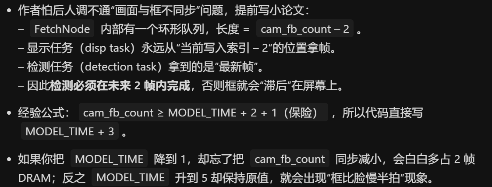

# human_face_recognition 人脸识别例程

## 文件简介

由于README文档并没有什么介绍，故简介笔者自己写。且**esp-who**的`component`和例程文件均采用C++编写。

另该例程导入太多`manage_components`，笔者时间有限，只对有利于理解和修改的函数进行分析记录

## 代码分析

### app_main.cpp

1. 导入需要的头文件
2. `using namespace`声明函数使用的命名空间，后续函数可以在命名空间内查找
3. `extern "C" void app_main(void)`链接一个纯C符号，防止`app_main`被C++编译器修改导致找不到入口
4. `vTaskPrioritySet(xTaskGetCurrentTaskHandle(), 5);`把当前任务优先级设为5
5. `#if`预编译先不分析
6. ESP32-S3 带 DVP 并口，驱动代码用 get_dvp_frame_cap_pipeline() 返回一个 std::shared_ptr<FrameCapture>，内部封装了：SCCB 初始化、OV2640/OV5640 传感器配置；I2S0 并行模式 DMA 双缓冲；默认输出 240×240 RGB565
7. `WhoRecognitionAppLCD`函数中初始化LCD、加载检测模型、创建FreeRTOS任务、注册按键回调、UI状态机
8. `WhoRecognitionAppTerm`把画面数据通过串口发送
9. `recognition_app->run();`内部阻塞，按钮任务

```c++
#include "frame_cap_pipeline.hpp"
#include "who_recognition_app_lcd.hpp"
#include "who_recognition_app_term.hpp"
#include "who_spiflash_fatfs.hpp"

using namespace who::frame_cap;
using namespace who::app;

extern "C" void app_main(void)
{
    vTaskPrioritySet(xTaskGetCurrentTaskHandle(), 5);
#if CONFIG_DB_FATFS_FLASH
    ESP_ERROR_CHECK(fatfs_flash_mount());
#elif CONFIG_DB_SPIFFS
    ESP_ERROR_CHECK(bsp_spiffs_mount());
#endif
#if CONFIG_DB_FATFS_SDCARD || CONFIG_HUMAN_FACE_DETECT_MODEL_IN_SDCARD || CONFIG_HUMAN_FACE_FEAT_MODEL_IN_SDCARD
    ESP_ERROR_CHECK(bsp_sdcard_mount());
#endif

// close led
#ifdef BSP_BOARD_ESP32_S3_EYE
    ESP_ERROR_CHECK(bsp_leds_init());
    ESP_ERROR_CHECK(bsp_led_set(BSP_LED_GREEN, false));
#endif

#if CONFIG_IDF_TARGET_ESP32S3
    auto frame_cap = get_dvp_frame_cap_pipeline();
#elif CONFIG_IDF_TARGET_ESP32P4
    auto frame_cap = get_mipi_csi_frame_cap_pipeline();
    // auto frame_cap = get_uvc_frame_cap_pipeline();
#endif
    auto recognition_app = new WhoRecognitionAppLCD(frame_cap);
    // try this if you don't have a lcd.
    // auto recognition_app = new WhoRecognitionAppTerm(frame_cap);
    recognition_app->run();
}
```

### 驱动代码 get_dvp_frame_cap_pipeline

1. `MODEL_TIME` 设置的含义为模型需要3帧才能输出结果
2. 
3. `get_cam_frame_size_from_lcd_resolution` 根据LCD的分辨率选择最接近的传感器支持值
4. `auto cam = new WhoS3Cam` 构造函数新建对象，分配内存在PSRAM中（SRAM不够）
5. `auto frame_cap = new WhoFrameCap();` 轻量级框架节点管理器，负责把“相机”封装成“数据源节点”
6. `frame_cap->add_node<WhoFetchNode>("FrameCapFetch", cam);` 模板函数，实例化一个 WhoFetchNode，命名“FrameCapFetch”，并把它绑定到 cam 数据源

```c++
// num of frames the model take to get result
#define MODEL_TIME 3

// The size of the fb_count and ringbuf_len must be big enough. If you have no idea how to set them, try with 5 and
// larger.
#if CONFIG_IDF_TARGET_ESP32S3
WhoFrameCap *get_dvp_frame_cap_pipeline()
{
    // The ringbuf_len of FetchNode equals cam_fb_count - 2. The WhoFetchNode fb will display on lcd, if you want to
    // make sure the displayed detection result is synced with the frame, the ringbuf size must be big enough to
    // cover the process time from now to the the detection result is ready. If the ring_buf_len is 3, the frame
    // which the disp task will display is 2 frames before than the frame which feeds into detection task. So the
    // detection task must finish within 2 frames, or the detect result will have a delay compared to the displayed
    // frame.
    framesize_t frame_size = get_cam_frame_size_from_lcd_resolution();
#ifdef BSP_BOARD_ESP32_S3_KORVO_2
    auto cam = new WhoS3Cam(PIXFORMAT_RGB565, frame_size, MODEL_TIME + 3, true, true);
#else
    auto cam = new WhoS3Cam(PIXFORMAT_RGB565, frame_size, MODEL_TIME + 3);
#endif
    auto frame_cap = new WhoFrameCap();
    frame_cap->add_node<WhoFetchNode>("FrameCapFetch", cam);
    return frame_cap;
}
```

### 构造函数 WhoS3Cam 和 WhoFrameCap

1. 命名空间`who`和`cam`作为符号修饰，便于版本、模块、和其他可能的命名冲突，实际调用是`who::cam::func()` 或写 `using namespace who::cam`
2. 

```c++
namespace who {
namespace cam {

class WhoS3Cam : public WhoCam {
public:
    WhoS3Cam(const pixformat_t pixel_format,
             const framesize_t frame_size,
             const uint8_t fb_count,
             bool vertical_flip = false,
             bool horizontal_flip = true);
    ~WhoS3Cam();
    cam_fb_t *cam_fb_get() override;
    void cam_fb_return(cam_fb_t *fb) override;
    cam_fb_fmt_t get_fb_format() override { return pix_fmt2cam_fb_fmt(m_format); }

private:
    esp_err_t set_flip(bool vertical_flip, bool horizontal_flip);
    int get_cam_fb_index();
    pixformat_t m_format;
};

} // namespace cam
} // namespace who
```


```c++
namespace who {
namespace cam {

WhoS3Cam::WhoS3Cam(const pixformat_t pixel_format,
                   const framesize_t frame_size,
                   const uint8_t fb_count,
                   bool vertical_flip,
                   bool horizontal_flip) :
    WhoCam(fb_count, resolution[frame_size].width, resolution[frame_size].height), m_format(pixel_format)
{
    ESP_ERROR_CHECK(bsp_i2c_init());
    camera_config_t camera_config = BSP_CAMERA_DEFAULT_CONFIG;
    camera_config.pixel_format = pixel_format;
    camera_config.frame_size = frame_size;
    camera_config.fb_count = fb_count;
    camera_config.grab_mode = CAMERA_GRAB_LATEST;
    if (pixel_format == PIXFORMAT_JPEG) {
        camera_config.xclk_freq_hz = 20000000;
    }
    ESP_ERROR_CHECK(esp_camera_init(&camera_config));
    ESP_ERROR_CHECK(set_flip(!vertical_flip, !horizontal_flip));
}
WhoS3Cam::~WhoS3Cam()
{
    ESP_ERROR_CHECK(esp_camera_deinit());
}

cam_fb_t *WhoS3Cam::cam_fb_get()
{
    camera_fb_t *fb = esp_camera_fb_get();
    int i = get_cam_fb_index();
    m_cam_fbs[i] = cam_fb_t(*fb);
    return &m_cam_fbs[i];
}

void WhoS3Cam::cam_fb_return(cam_fb_t *fb)
{
    esp_camera_fb_return((camera_fb_t *)fb->ret);
}

esp_err_t WhoS3Cam::set_flip(bool vertical_flip, bool horizontal_flip)
{
    if (!vertical_flip & !horizontal_flip) {
        return ESP_OK;
    }
    sensor_t *s = esp_camera_sensor_get();
    if (vertical_flip) {
        if (s->set_vflip(s, 1) != 0) {
            ESP_LOGE(TAG, "Failed to mirror the frame vertically.");
            return ESP_FAIL;
        }
    }
    if (horizontal_flip) {
        if (s->set_hmirror(s, 1) != 0) {
            ESP_LOGE(TAG, "Failed to mirror the frame horizontally.");
            return ESP_FAIL;
        }
    }
    return ESP_OK;
}

int WhoS3Cam::get_cam_fb_index()
{
    static int i = 0;
    int index = i;
    i = (i + 1) % m_fb_count;
    return index;
}

} // namespace cam
} // namespace who

```