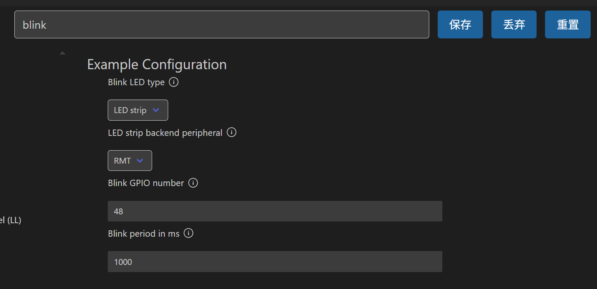
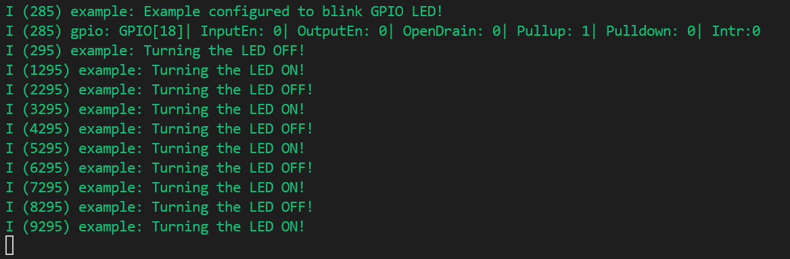
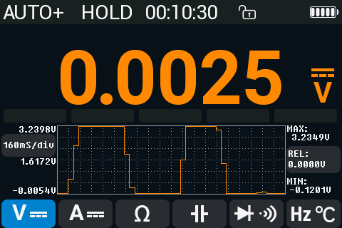
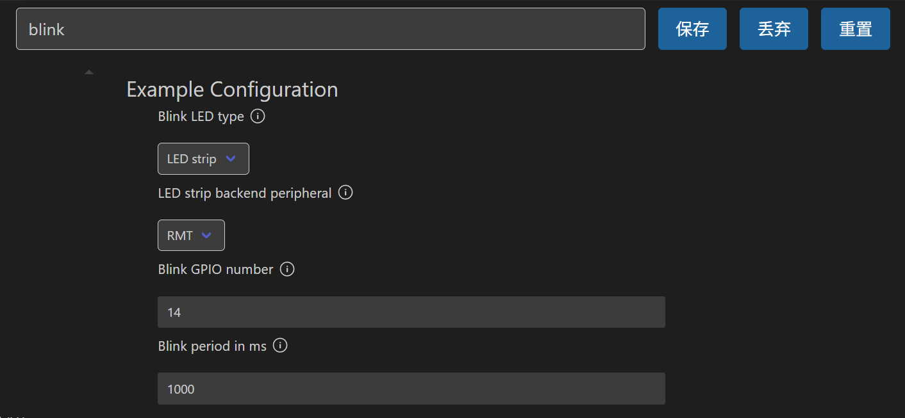
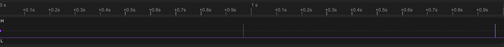
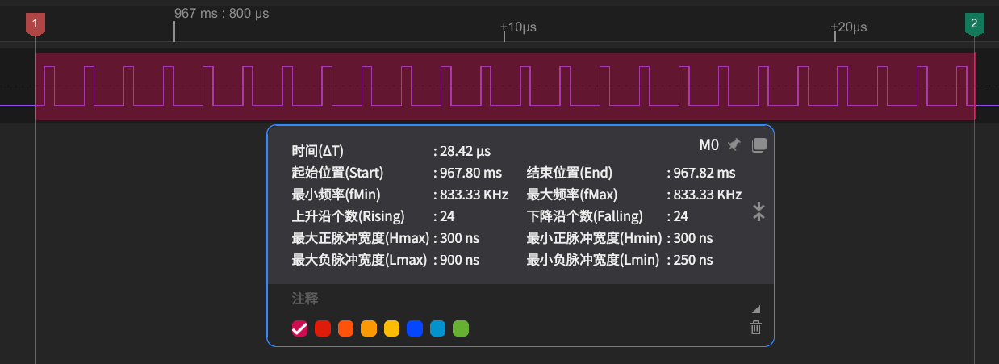
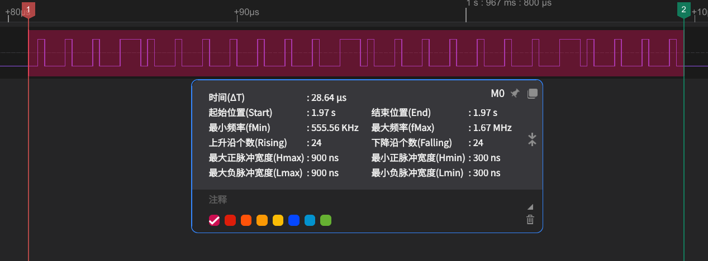

# Blink 闪烁例程

## 粗略阅读README文档

文档简介*这个例程演示怎样通过GPIO让LED灯闪烁，或者采用`led_strip`库去驱动信号驱动的LED，如WS2812。该库通过组件管理器安装*

注意事项不作解释

采用**menuconfig**配置系统

* 配置**控制方式**(GPIO/LED_strip)
* 在LED_Strip前提下，选择(RMT/SPI)
* 选择**控制引脚**
* 选择**闪烁周期**

构建、烧录、示例输出
特别注意灯的颜色可能不同
对于LED_strip函数简单说明

---

## 尝试构建、烧录、监视

> 特别说明：
> $~~$在构建过程中，由于`idf_component.yml`文件的存在，会从[组件注册表](https://docs.espressif.com/projects/vscode-esp-idf-extension/zh_CN/latest/additionalfeatures/install-esp-components.html)安装需要的组件，具体查看[构建系统](https://docs.espressif.com/projects/esp-idf/zh_CN/stable/esp32/api-guides/build-system.html#)

### GPIO方式

* 选择CMake工具
* 选择芯片（*如果报CMake错尝试把bulid文件夹删除再操作*）
* 根据README打开项目配置

* 选择GPIO和引脚（*笔者先进行GPIO的尝试*） 
* 保存配置并构建项目
* *无报错*选择端口，连接主控板
* 烧录和监视

前面的启动信息不做重复解释，窗口输出均是`ESP_LOGT`函数输出
`gpio`显示选择引脚是**GPIO18**，模式是上拉模式
程序在高低电平变化时窗口提示
* 万用表测试现象：**GPIO18**引脚高低电平变化，*0V*、*3.235V*交替变化，周期大概为1s，与配置相符


### LED_strip方式

#### RMT

* 修改项目配置如下
  
* 点击**构建、烧录和监视**
* 监视窗口其他同上，但没有GPIO显示
* 观察到闪烁现象
* 为方便监视信号，更换引脚，通过逻辑分析仪抓取信号如下




**WS2812**采用**24位信号**控制，如上，最后一张图为亮起，倒数第二张图为熄灭，其他时间全为低电平，灯不重置
* [RMT原理介绍](https://docs.espressif.com/projects/esp-idf/zh_CN/latest/esp32/api-reference/peripherals/rmt.html)

#### SPI

* 修改项目配置为SPI
* 点击**构建、烧录和监视**
* 监视窗口和波形基本同上
* *SPI怎么驱动笔者并无头绪，故不作过多说明*

---

## 代码分析

### main函数

main函数中先**对led进行配置**，然后进行**循环**，`vTaskDelay`函数延时指定时间（*设置周期除以tick转毫秒的常数*）**改变一次状态并进行一次led闪烁更改**

```c
void app_main(void)
{
    /* Configure the peripheral according to the LED type */
    configure_led();

    while (1) {
        ESP_LOGI(TAG, "Turning the LED %s!", s_led_state == true ? "ON" : "OFF");
        blink_led();
        /* Toggle the LED state */
        s_led_state = !s_led_state;
        vTaskDelay(CONFIG_BLINK_PERIOD / portTICK_PERIOD_MS);
    }
}
```

### GPIO配置

在配置中选择GPIO，`#elif CONFIG_BLINK_LED_GPIO`的条件满足，下方代码块作用

```c
#elif CONFIG_BLINK_LED_GPIO

static void blink_led(void)
{
    /* Set the GPIO level according to the state (LOW or HIGH)*/
    gpio_set_level(BLINK_GPIO, s_led_state);
}

static void configure_led(void)
{
    ESP_LOGI(TAG, "Example configured to blink GPIO LED!");
    gpio_reset_pin(BLINK_GPIO);
    /* Set the GPIO as a push/pull output */
    gpio_set_direction(BLINK_GPIO, GPIO_MODE_OUTPUT);
}

#else
#error "unsupported LED type"
#endif
```

在这段初始化中，定义了静态函数 `blink_led`**控制led灯闪烁**，定义了静态函数 `configure_led`用以**配置led_strip库的所需配置**。

* **config**配置中设置了引脚和方向
* `blink_led`中设置GPIO电平

### LED_strip配置

在配置中选择LED_strip后，最大的区别是`#ifdef CONFIG_BLINK_LED_STRIP`的**条件判断满足**了，其后的初始化代码均能运行

```c
#ifdef CONFIG_BLINK_LED_STRIP

static led_strip_handle_t led_strip;

static void blink_led(void)
{
    /* If the addressable LED is enabled */
    if (s_led_state) {
        /* Set the LED pixel using RGB from 0 (0%) to 255 (100%) for each color */
        led_strip_set_pixel(led_strip, 0, 16, 16, 16);
        /* Refresh the strip to send data */
        led_strip_refresh(led_strip);
    } else {
        /* Set all LED off to clear all pixels */
        led_strip_clear(led_strip);
    }
}

static void configure_led(void)
{
    ESP_LOGI(TAG, "Example configured to blink addressable LED!");
    /* LED strip initialization with the GPIO and pixels number*/
    led_strip_config_t strip_config = {
        .strip_gpio_num = BLINK_GPIO,
        .max_leds = 1, // at least one LED on board
    };
#if CONFIG_BLINK_LED_STRIP_BACKEND_RMT
    led_strip_rmt_config_t rmt_config = {
        .resolution_hz = 10 * 1000 * 1000, // 10MHz
        .flags.with_dma = false,
    };
    ESP_ERROR_CHECK(led_strip_new_rmt_device(&strip_config, &rmt_config, &led_strip));
#elif CONFIG_BLINK_LED_STRIP_BACKEND_SPI
    led_strip_spi_config_t spi_config = {
        .spi_bus = SPI2_HOST,
        .flags.with_dma = true,
    };
    ESP_ERROR_CHECK(led_strip_new_spi_device(&strip_config, &spi_config, &led_strip));
#else
#error "unsupported LED strip backend"
#endif
    /* Set all LED off to clear all pixels */
    led_strip_clear(led_strip);
}
```

在这段初始化中，定义了静态函数 `blink_led`**控制led灯闪烁**，定义了静态函数 `configure_led`用以**配置led_strip库的所需配置**。

* 如`led_strip_config_t`类型的config配置了GPIO口和最大灯数量
* 通过`#if`和`#elif`确认使用的是RMT模式还是SPI模式

> 注：此处笔者并未对led_strip库进行深究，算是挖一个坑，在未来对RMT和SPI进行实验后会尝试对led_strip库进行分析了解

---

## 总结

对get-started中的blink闪烁例程进行尝试，主要在于体验。这次接触了**menuconfig**的配置，接触了 `#if` 等 **条件编译** 对于程序应对多种条件选择，未来我也会去进行尝试。有些不足在于*没对库文件和外设配置进行了解*，知其然不知其所以然，挖坑待以后填。
