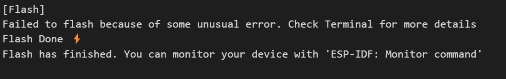
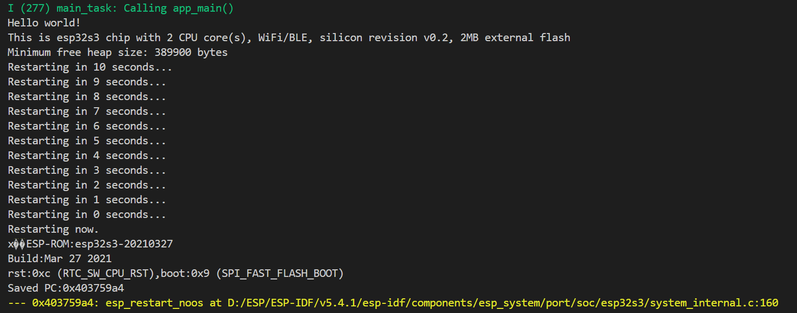

# HelloWorld 你好世界

## 粗略阅读README文档

文档简介*开始一个FREERTOS任务去打印‘Hello World’*，查看源码并无其他创建任务过程，查看[编程指南](https://docs.espressif.com/projects/esp-idf/zh_CN/stable/esp32/api-reference/system/freertos.html)说明如下：

> 笔者默认开发环境已安装妥当，除非记录问题，不然不对开发环境做特别解释

接下来查看文件结构，项目主要文件是`main`文件就夹中的`hello_world_main.c`文件，外部文件主要有`CMakeLists.txt`和一个python文件，根据注释，该文件为自动测试文件，暂不深究。

---

## 尝试编译、烧录、监视

### 构建

根据[教程]打开现有示例项目

1. 点击**导入ESP-IDF项目**
2. 选择示例项目文件夹
3. 选择新建项目文件夹(路径不要有中文，不然后续识别不到会报错)
4. 命名
5. 以该文件夹作为工作区打开
6. 选择CMake工具包（不报错就行）
7. 选择芯片型号
8. 看看有没有未解决的问题或者报错

打开`main.c`文件

点击扩展中的**构建项目**或者下方状态栏里的**构建项目**，如果环境配置没有问题的话，该项目会进行Building。

> 首次构建会进行*全面构建*，耗时较长，后续构建会*读取缓存*，耗时会减少。
> *构建项目*相关可查看[构建项目](https://docs.espressif.com/projects/vscode-esp-idf-extension/zh_CN/latest/buildproject.html)
> 构建时大概率会遇到报错，可把Fail以后的内容全部打包上网搜索，或者深度思考，一次不行就多试几次

<!--->
遇到项目**报错**：

修改项目路径无中文文件夹，删除bulid文件夹重新构建
<--->

构建完成后的命令框如下，分析命令反馈(我能看懂的)：写明了esptool的版本，芯片型号，还有内存空闲

同时完成后会自动输出内存表

### 烧录

确保esp和电脑正确连接，选择正确的端口号，点击下方状态栏中的**烧录项目**，选用UART方式烧录，显示如下消息代表烧录完成。

### 监视

确保esp和电脑正确连接，选择正确的端口号，点击下方状态栏中的**监视设备**，可以看到终端跳出一个窗口，窗口显示监视输出，方便调试。

---

## 分析输出

> 笔者对ESP的了解不算深入，借助ai分析输出，解释如有误敬请指正

最前是`boot`，即启动部分：

* 编译时间：2025年7月6日 19:09:34
* 芯片版本：v0.2
* efuse 块版本：v1.3
* 启动 SPI 速度：80MHz
* SPI 模式：DIO
* SPI 闪存大小：2MB
* 分区表
  * 分区 0：nvs，用于 WiFi 数据
  * 分区 1：phy_init，用于 RF 数据
  * 分区 2：factory，用于工厂应用
* 包含`esp_image`,*应该是内存分配信息*
* `cpu_start`是cpu启动输出信息

然后是`app_init`,即应用加载：

* CPU频率： 160MHz
* 项目名称
* 应用版本
* 编译日期
...

接下来`heap_init`,堆栈加载，即内存分配
显示了`spi_flash`,SPI闪存大小，报警告由于闪存设置不匹配，可以在sdkconfig中设置，暂时不具体写
最后`main_task`,主任务启动：

* 运行在CPU0，即核0上
* `app_main()`启动
* `Hello World!`输出
* 芯片信息(此处不具体写)
* 软件重启

---
> 由于笔者在项目配置上花了许多时间，稍微具体写了构建项目的流程
> 第一次具体学习和了解了启动信息，感觉需要理解消化
> 同时对于esp-idf的代码熟悉程度不高
> 此处不作代码分析
---

## 总结

从前尝试时只在`app_main()`函数中写`printf("Hello World!")`，看到监视窗口有`Hello World!`就算结束。

今天仔细研究了官方例程，重新进行了项目构建，头一次分析启动信息，感觉对于以后的调试有更多信心，收获满满。
