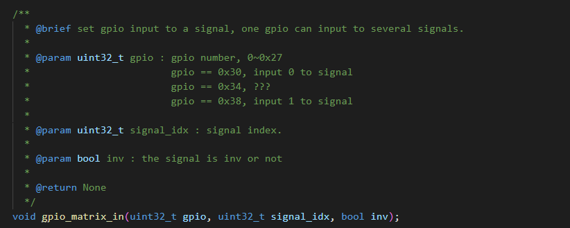

# ESP32-CAM web server ESP32-CAM web服务端

## 文档简介

本文是对于esp32-cam的ESP-IDF v4版本例程`camera_web_server`的分析理解，为后续v5版本重构做准备

## 代码分析

### part-wifi

#### 宏定义

WiFi站模式的SSID和Password，最大重试次数
WiFiAP模式的SSID和Password，最大站连接，IP地址设置，通道设置

```c
#define EXAMPLE_ESP_WIFI_SSID      CONFIG_ESP_WIFI_SSID
#define EXAMPLE_ESP_WIFI_PASS      CONFIG_ESP_WIFI_PASSWORD
#define EXAMPLE_ESP_MAXIMUM_RETRY  CONFIG_ESP_MAXIMUM_RETRY
#define EXAMPLE_ESP_WIFI_AP_SSID   CONFIG_ESP_WIFI_AP_SSID
#define EXAMPLE_ESP_WIFI_AP_PASS   CONFIG_ESP_WIFI_AP_PASSWORD
#define EXAMPLE_MAX_STA_CONN       CONFIG_MAX_STA_CONN
#define EXAMPLE_IP_ADDR            CONFIG_SERVER_IP
#define EXAMPLE_ESP_WIFI_AP_CHANNEL CONFIG_ESP_WIFI_AP_CHANNEL
```

#### 系统事件处理函数

1. 作为AP，有连接，日志打印
2. 作为AP，断开连接，日志打印
3. 作为站，启动，调用`esp_wifi_connect`连接函数
4. 作为站，获取到IP，`ip4addr_ntoa`函数将IP地址转换为ASCII字符串
5. 作为站，断开连接，如果重连次数小于最大重连次数，尝试重连。有日志打印
6. `mdns_handle_system_event` 应用程序需要从系统事件处理程序调用函数，使mDNS服务正常运行

```c
static esp_err_t event_handler(void *ctx, system_event_t *event)
{
    switch(event->event_id) {
    case SYSTEM_EVENT_AP_STACONNECTED:
        ESP_LOGI(TAG, "station:" MACSTR " join, AID=%d",
                 MAC2STR(event->event_info.sta_connected.mac),
                 event->event_info.sta_connected.aid);
        break;
    case SYSTEM_EVENT_AP_STADISCONNECTED:
        ESP_LOGI(TAG, "station:" MACSTR "leave, AID=%d",
                 MAC2STR(event->event_info.sta_disconnected.mac),
                 event->event_info.sta_disconnected.aid);
        break;
    case SYSTEM_EVENT_STA_START:
        esp_wifi_connect();
        break;
    case SYSTEM_EVENT_STA_GOT_IP:
        ESP_LOGI(TAG, "got ip:%s",
                 ip4addr_ntoa(&event->event_info.got_ip.ip_info.ip));
        s_retry_num = 0;
        break;
    case SYSTEM_EVENT_STA_DISCONNECTED:
        {
            if (s_retry_num < EXAMPLE_ESP_MAXIMUM_RETRY) {
                esp_wifi_connect();
                s_retry_num++;
                ESP_LOGI(TAG,"retry to connect to the AP");
            }
            ESP_LOGI(TAG,"connect to the AP fail");
            break;
        }
    default:
        break;
    }
    mdns_handle_system_event(ctx, event);
    return ESP_OK;
}
```

#### AP和站模式初始化函数

`wifi_init_softap`作为AP初始化

1. 如果设置IP为`"192.168.4.1"`,`sscanf`函数从字符串中读取数字并赋值给abcd
2. `IP4_ADDR`宏函数初始化IPv4地址，包括IP、网关、子网掩码
3. `tcpip_adapter_dhcps_stop` 停止DHCP服务，`tcpip_adapter_set_ip_info`设置接口的IP地址信息，`tcpip_adapter_dhcps_start`启用DHCP服务（**DHCP（动态主机配置协议**是一种网络管理协议，用于自动分配IP地址和其他网络配置参数给网络中的设备。）
4. 把设置的SSID、Password和最大连接写入WiFi配置
5. 设置连接模式为`WPA2_PSK`（目前绝大部分wifi都是这个模式）
6. 写入通道数
7. `esp_wifi_set_config`配置WiFi

`wifi_init_sta`函数中把menuconfig中的SSID和Password写入，然后调用`esp_wifi_set_config`进行配置

```c
void wifi_init_softap()
{
    if (strcmp(EXAMPLE_IP_ADDR, "192.168.4.1"))
    {
        int a, b, c, d;
        sscanf(EXAMPLE_IP_ADDR, "%d.%d.%d.%d", &a, &b, &c, &d);
        tcpip_adapter_ip_info_t ip_info;
        IP4_ADDR(&ip_info.ip, a, b, c, d);
        IP4_ADDR(&ip_info.gw, a, b, c, d);
        IP4_ADDR(&ip_info.netmask, 255, 255, 255, 0);
        ESP_ERROR_CHECK(tcpip_adapter_dhcps_stop(WIFI_IF_AP));
        ESP_ERROR_CHECK(tcpip_adapter_set_ip_info(WIFI_IF_AP, &ip_info));
        ESP_ERROR_CHECK(tcpip_adapter_dhcps_start(WIFI_IF_AP));
    }
    wifi_config_t wifi_config;
    memset(&wifi_config, 0, sizeof(wifi_config_t));
    snprintf((char*)wifi_config.ap.ssid, 32, "%s", EXAMPLE_ESP_WIFI_AP_SSID);
    wifi_config.ap.ssid_len = strlen((char*)wifi_config.ap.ssid);
    snprintf((char*)wifi_config.ap.password, 64, "%s", EXAMPLE_ESP_WIFI_AP_PASS);
    wifi_config.ap.max_connection = EXAMPLE_MAX_STA_CONN;
    wifi_config.ap.authmode = WIFI_AUTH_WPA_WPA2_PSK;
    if (strlen(EXAMPLE_ESP_WIFI_AP_PASS) == 0) {
        wifi_config.ap.authmode = WIFI_AUTH_OPEN;
    }
    if (strlen(EXAMPLE_ESP_WIFI_AP_CHANNEL)) {
        int channel;
        sscanf(EXAMPLE_ESP_WIFI_AP_CHANNEL, "%d", &channel);
        wifi_config.ap.channel = channel;
    }

    ESP_ERROR_CHECK(esp_wifi_set_config(ESP_IF_WIFI_AP, &wifi_config));

    ESP_LOGI(TAG, "wifi_init_softap finished.SSID:%s password:%s",
             EXAMPLE_ESP_WIFI_AP_SSID, EXAMPLE_ESP_WIFI_AP_PASS);
}

void wifi_init_sta()
{
    wifi_config_t wifi_config;
    memset(&wifi_config, 0, sizeof(wifi_config_t));
    snprintf((char*)wifi_config.sta.ssid, 32, "%s", EXAMPLE_ESP_WIFI_SSID);
    snprintf((char*)wifi_config.sta.password, 64, "%s", EXAMPLE_ESP_WIFI_PASS);

    ESP_ERROR_CHECK(esp_wifi_set_config(ESP_IF_WIFI_STA, &wifi_config) );

    ESP_LOGI(TAG, "wifi_init_sta finished.");
    ESP_LOGI(TAG, "connect to ap SSID:%s password:%s",
             EXAMPLE_ESP_WIFI_SSID, EXAMPLE_ESP_WIFI_PASS);
}
```

#### wifi-main函数

1. 宏函数设置WiFi默认配置
2. 设置模式为：AP和STA / AP / STA
3. nvs初始化
4. `tcpip_adapter_init`初始化底层TCP/IP堆栈
5. `esp_event_loop_init`创建系统事件任务
6. `esp_wifi_init`WiFi驱动程序安装，`esp_wifi_set_mode` 模式设置
7. `wifi_init_softap` `wifi_init_sta` 调用函数进行配置（由此发现两种配置不冲突）
8. `esp_wifi_start` 启动WiFi驱动
9. `esp_wifi_set_ps` 设置WiFi省电类型

```c
void app_wifi_main()
{
    wifi_init_config_t cfg = WIFI_INIT_CONFIG_DEFAULT();
    wifi_mode_t mode = WIFI_MODE_NULL;

    if (strlen(EXAMPLE_ESP_WIFI_AP_SSID) && strlen(EXAMPLE_ESP_WIFI_SSID)) {
        mode = WIFI_MODE_APSTA;
    } else if (strlen(EXAMPLE_ESP_WIFI_AP_SSID)) {
        mode = WIFI_MODE_AP;
    } else if (strlen(EXAMPLE_ESP_WIFI_SSID)) {
        mode = WIFI_MODE_STA;
    }

    esp_err_t ret = nvs_flash_init();
    if (ret == ESP_ERR_NVS_NO_FREE_PAGES || ret == ESP_ERR_NVS_NEW_VERSION_FOUND) {
      ESP_ERROR_CHECK(nvs_flash_erase());
      ret = nvs_flash_init();
    }
    ESP_ERROR_CHECK(ret);

    if (mode == WIFI_MODE_NULL) {
        ESP_LOGW(TAG,"Neither AP or STA have been configured. WiFi will be off.");
        return;
    }

    tcpip_adapter_init();
    ESP_ERROR_CHECK(esp_event_loop_init(event_handler, NULL));
    ESP_ERROR_CHECK(esp_wifi_init(&cfg));
    ESP_ERROR_CHECK(esp_wifi_set_mode(mode));

    if (mode & WIFI_MODE_AP) {
        wifi_init_softap();
    }

    if (mode & WIFI_MODE_STA) {
        wifi_init_sta();
    }
    ESP_ERROR_CHECK(esp_wifi_start());
    ESP_ERROR_CHECK(esp_wifi_set_ps(WIFI_PS_NONE));
}
```

#### wifi-迁移重构

经过分析和资料对比，tcpip有关函数现在被netif替代，系统事件函数也进行了更改，WiFi模式配置基本没什么变化，但可以写得更整齐一些

### part-camera

#### 结构体定义

在`sensor`头文件和源文件中，定义了传感器的抽象层。

* 为不同信号定义了宏 （NT99141、OV9650、OV7670……）
* 定义像素格式的枚举类型，即为不同像素格式设置标识符
* 定义帧尺寸的枚举类型，不同帧尺寸有各种标识
* 定义纵横比的枚举类型
* 定义增益上限的枚举类型
* 定义比例设置结构体，设置最大宽度，最大高度，起始点终点坐标，偏移量等
* 定义分辨率结构体，储存宽度、高度、纵横比
* 定义传感器ID结构体，包括制造商ID，产品ID和版本号
* 定义相机状态结构体，包括帧尺寸，缩放，亮度，对比度……
* 定义传感器结构体，包含ID，I2C从地址，像素格式，相机状态，一系列函数指针（用于具体操作传感器）

#### esp_camera.h

该文件是ESP32-CAM相机模块的驱动头文件

1. 定义相机配置结构体，包括引脚配置、XCLK频率、LEDC定时器和通道、像素格式、帧尺寸、JPEG质量等参数
2. 定义相机帧缓冲区结构体，储存捕获的图像帧数据。包括像素数据、指针、缓冲区字节数、宽度、高度、像素格式、时间戳
3. 定义错误码
4. 声明相机操作的具体函数

#### camera-main函数

1. 配置引脚13和引脚14为输入、上拉、不开中断
2. 设置ledc定时器配置`ledc_timer_config_t`
   * `duty_resolution` 占空比分辨率，即范围从0到2的n次
   * `freq_hz` 频率
   * `speed_mode` 速度模式（根据型号有限制）
   * `timer_num` 定时器选择
3. 设置ledc通道配置
   * `channel` 通道
   * `duty` 初始占空比（取决于分辨率）
   * `gpio_num` 绑定输出引脚
   * `speed_mode` 速度模式
   * `hpoint` 用于高速模式调整信号相位
   * `timer_sel` 定时选择
4. 配置ledc
5. 如果不启用LED，上述配置都不进行
6. 从头文件中导入宏定义配置`camera_config_t`
7. `esp_camera_init` 自定义函数进行初始化
8. `esp_camera_sensor_get` 自定义函数获取传感器数据
9. 对图像进行操作

```c
void app_camera_main ()
{
#if CONFIG_CAMERA_MODEL_ESP_EYE || CONFIG_CAMERA_MODEL_ESP32_CAM_BOARD
    /* IO13, IO14 is designed for JTAG by default,
     * to use it as generalized input,
     * firstly declair it as pullup input */
    gpio_config_t conf;
    conf.mode = GPIO_MODE_INPUT;
    conf.pull_up_en = GPIO_PULLUP_ENABLE;
    conf.pull_down_en = GPIO_PULLDOWN_DISABLE;
    conf.intr_type = GPIO_INTR_DISABLE;
    conf.pin_bit_mask = 1LL << 13;
    gpio_config(&conf);
    conf.pin_bit_mask = 1LL << 14;
    gpio_config(&conf);
#endif

#ifdef CONFIG_LED_ILLUMINATOR_ENABLED
    gpio_set_direction(CONFIG_LED_LEDC_PIN,GPIO_MODE_OUTPUT);
    ledc_timer_config_t ledc_timer = {
        .duty_resolution = LEDC_TIMER_8_BIT,            // resolution of PWM duty
        .freq_hz         = 1000,                        // frequency of PWM signal
        .speed_mode      = LEDC_LOW_SPEED_MODE,  // timer mode
        .timer_num       = CONFIG_LED_LEDC_TIMER        // timer index
    };
    ledc_channel_config_t ledc_channel = {
        .channel    = CONFIG_LED_LEDC_CHANNEL,
        .duty       = 0,
        .gpio_num   = CONFIG_LED_LEDC_PIN,
        .speed_mode = LEDC_LOW_SPEED_MODE,
        .hpoint     = 0,
        .timer_sel  = CONFIG_LED_LEDC_TIMER
    };
    #ifdef CONFIG_LED_LEDC_HIGH_SPEED_MODE
    ledc_timer.speed_mode = ledc_channel.speed_mode = LEDC_HIGH_SPEED_MODE;
    #endif
    switch (ledc_timer_config(&ledc_timer)) {
        case ESP_ERR_INVALID_ARG: ESP_LOGE(TAG, "ledc_timer_config() parameter error"); break;
        case ESP_FAIL: ESP_LOGE(TAG, "ledc_timer_config() Can not find a proper pre-divider number base on the given frequency and the current duty_resolution"); break;
        case ESP_OK: if (ledc_channel_config(&ledc_channel) == ESP_ERR_INVALID_ARG) {
            ESP_LOGE(TAG, "ledc_channel_config() parameter error");
          }
          break;
        default: break;
    }
#endif

    camera_config_t config;
    config.ledc_channel = LEDC_CHANNEL_0;
    config.ledc_timer = LEDC_TIMER_0;
    config.pin_d0 = Y2_GPIO_NUM;
    config.pin_d1 = Y3_GPIO_NUM;
    config.pin_d2 = Y4_GPIO_NUM;
    config.pin_d3 = Y5_GPIO_NUM;
    config.pin_d4 = Y6_GPIO_NUM;
    config.pin_d5 = Y7_GPIO_NUM;
    config.pin_d6 = Y8_GPIO_NUM;
    config.pin_d7 = Y9_GPIO_NUM;
    config.pin_xclk = XCLK_GPIO_NUM;
    config.pin_pclk = PCLK_GPIO_NUM;
    config.pin_vsync = VSYNC_GPIO_NUM;
    config.pin_href = HREF_GPIO_NUM;
    config.pin_sscb_sda = SIOD_GPIO_NUM;
    config.pin_sscb_scl = SIOC_GPIO_NUM;
    config.pin_pwdn = PWDN_GPIO_NUM;
    config.pin_reset = RESET_GPIO_NUM;
    config.xclk_freq_hz = 20000000;
    config.pixel_format = PIXFORMAT_JPEG;
    //init with high specs to pre-allocate larger buffers
    config.frame_size = FRAMESIZE_QSXGA;
    config.jpeg_quality = 10;
    config.fb_count = 2;

    // camera init
    esp_err_t err = esp_camera_init(&config);
    if (err != ESP_OK) {
        ESP_LOGE(TAG, "Camera init failed with error 0x%x", err);
        return;
    }

    sensor_t * s = esp_camera_sensor_get();
    s->set_vflip(s, 1);//flip it back
    //initial sensors are flipped vertically and colors are a bit saturated
    if (s->id.PID == OV3660_PID) {
        s->set_brightness(s, 1);//up the blightness just a bit
        s->set_saturation(s, -2);//lower the saturation
    }
    //drop down frame size for higher initial frame rate
    s->set_framesize(s, FRAMESIZE_HD);
}
```

#### SCCB[使用OV摄像头协议](https://blog.csdn.net/qq_39842609/article/details/122274827)

SCCB协议与IIC协议十分相似，不过IIC是PHILIPS的专利，所以OmnVision在IIC的基础上做了点小改动。SCCB最主要是阉割了IIC的连续读写的功能，即每读写完一个字节就主机必须发送一个NA信号。

##### 头文件和宏定义

需要注意的是，预编译中对`ARDUINO_ARCH_ESP32` 和 `CONFIG_ARDUHAL_ESP_LOG`进行了特别判断，用于不同环境下的log实现

SCCB协议的宏定义类比I2C，有频率、读写位、检查相关，还储存了从机地址

`#define LITTLETOBIG(x)          ((x<<8)|(x>>8))` 该宏函数用于将16位整数的字节数据从小端格式转换为大端格式

```c
#include <stdbool.h>
#include <freertos/FreeRTOS.h>
#include <freertos/task.h>
#include "sccb.h"
#include <stdio.h>
#include "sdkconfig.h"
#if defined(ARDUINO_ARCH_ESP32) && defined(CONFIG_ARDUHAL_ESP_LOG)
#include "esp32-hal-log.h"
#else
#include "esp_log.h"
static const char* TAG = "sccb";
#endif

#define LITTLETOBIG(x)          ((x<<8)|(x>>8))

#include "driver/i2c.h"

#define SCCB_FREQ               100000           /*!< I2C master frequency*/
#define WRITE_BIT               I2C_MASTER_WRITE /*!< I2C master write */
#define READ_BIT                I2C_MASTER_READ  /*!< I2C master read */
#define ACK_CHECK_EN            0x1              /*!< I2C master will check ack from slave*/
#define ACK_CHECK_DIS           0x0              /*!< I2C master will not check ack from slave */
#define ACK_VAL                 0x0              /*!< I2C ack value */
#define NACK_VAL                0x1              /*!< I2C nack value */
#if CONFIG_SCCB_HARDWARE_I2C_PORT1
const int SCCB_I2C_PORT         = 1;
#else
const int SCCB_I2C_PORT         = 0;
#endif
static uint8_t ESP_SLAVE_ADDR   = 0x3c;
```

##### 初始化

函数中配置i2c结构体变量，设为主机模式，开启上拉，绑定引脚

`i2c_param_config` 函数写入配置 `i2c_driver_install`安装驱动程序

该函数用于**对I2C进行初始化，配置为主机模式并开启上拉，为后续数据传输做准备**

```c
int SCCB_Init(int pin_sda, int pin_scl)
{
    ESP_LOGI(TAG, "pin_sda %d pin_scl %d\n", pin_sda, pin_scl);
    //log_i("SCCB_Init start");
    i2c_config_t conf;
    conf.mode = I2C_MODE_MASTER;
    conf.sda_io_num = pin_sda;
    conf.sda_pullup_en = GPIO_PULLUP_ENABLE;
    conf.scl_io_num = pin_scl;
    conf.scl_pullup_en = GPIO_PULLUP_ENABLE;
    conf.master.clk_speed = SCCB_FREQ;

    i2c_param_config(SCCB_I2C_PORT, &conf);
    i2c_driver_install(SCCB_I2C_PORT, conf.mode, 0, 0, 0);
    return 0;
}
```

##### 查找从机地址

1. `i2c_cmd_link_create` 创建**命令链接**
2. `i2c_master_start` 启动
3. `i2c_master_write_byte` 将“写入字节”命令排队到命令列表。参数为：命令列表，需要发送的字节，使能ACK信号（由于I2C协议的特殊性，是地址+数据）
4. 有数据写入的话，采用`i2c_master_write`函数（此处只是寻找有相应的地址，不进行操作）
5. `i2c_master_stop` 停止
6. `i2c_master_cmd_begin` 执行**命令链接**，并检查写入状态
7. `i2c_cmd_link_delete` 释放命令链接使用的资源
8. 如果有地址能写入，就储存地址并返回

该函数用于**遍历可能的I2C地址，向其中写入数据，检查哪个地址有效**

```c
uint8_t SCCB_Probe()
{
    uint8_t slave_addr = 0x0;
    while(slave_addr < 0x7f) {
        i2c_cmd_handle_t cmd = i2c_cmd_link_create();
        i2c_master_start(cmd);
        i2c_master_write_byte(cmd, ( slave_addr << 1 ) | WRITE_BIT, ACK_CHECK_EN);
        i2c_master_stop(cmd);
        esp_err_t ret = i2c_master_cmd_begin(SCCB_I2C_PORT, cmd, 1000 / portTICK_RATE_MS);
        i2c_cmd_link_delete(cmd);
        if( ret == ESP_OK) {
            ESP_SLAVE_ADDR = slave_addr;
            return ESP_SLAVE_ADDR;
        }
        slave_addr++;
    }
    return ESP_SLAVE_ADDR;
}
```

##### 读取数据

1. 发送从机地址和要读取的寄存器地址
2. 发送从机地址并进行读取
3. 每次命令链接完成后释放内存

该函数用于**读取从机某个寄存器的值，每次读取一个字节**

```c
uint8_t SCCB_Read(uint8_t slv_addr, uint8_t reg)
{
    uint8_t data=0;
    esp_err_t ret = ESP_FAIL;
    i2c_cmd_handle_t cmd = i2c_cmd_link_create();
    i2c_master_start(cmd);
    i2c_master_write_byte(cmd, ( slv_addr << 1 ) | WRITE_BIT, ACK_CHECK_EN);
    i2c_master_write_byte(cmd, reg, ACK_CHECK_EN);
    i2c_master_stop(cmd);
    ret = i2c_master_cmd_begin(SCCB_I2C_PORT, cmd, 1000 / portTICK_RATE_MS);
    i2c_cmd_link_delete(cmd);
    if(ret != ESP_OK) return -1;
    cmd = i2c_cmd_link_create();
    i2c_master_start(cmd);
    i2c_master_write_byte(cmd, ( slv_addr << 1 ) | READ_BIT, ACK_CHECK_EN);
    i2c_master_read_byte(cmd, &data, NACK_VAL);
    i2c_master_stop(cmd);
    ret = i2c_master_cmd_begin(SCCB_I2C_PORT, cmd, 1000 / portTICK_RATE_MS);
    i2c_cmd_link_delete(cmd);
    if(ret != ESP_OK) {
        ESP_LOGE(TAG, "SCCB_Read Failed addr:0x%02x, reg:0x%02x, data:0x%02x, ret:%d", slv_addr, reg, data, ret);
    }
    return data;
}
```

##### 写入数据

向命令链接中写入 从机地址、寄存器地址、写入的数据并进行发送，完成后释放内存

该函数用于**向从机某个寄存器中写入数据**

```c
uint8_t SCCB_Write(uint8_t slv_addr, uint8_t reg, uint8_t data)
{
    esp_err_t ret = ESP_FAIL;
    i2c_cmd_handle_t cmd = i2c_cmd_link_create();
    i2c_master_start(cmd);
    i2c_master_write_byte(cmd, ( slv_addr << 1 ) | WRITE_BIT, ACK_CHECK_EN);
    i2c_master_write_byte(cmd, reg, ACK_CHECK_EN);
    i2c_master_write_byte(cmd, data, ACK_CHECK_EN);
    i2c_master_stop(cmd);
    ret = i2c_master_cmd_begin(SCCB_I2C_PORT, cmd, 1000 / portTICK_RATE_MS);
    i2c_cmd_link_delete(cmd);
    if(ret != ESP_OK) {
        ESP_LOGE(TAG, "SCCB_Write Failed addr:0x%02x, reg:0x%02x, data:0x%02x, ret:%d", slv_addr, reg, data, ret);
    }
    return ret == ESP_OK ? 0 : -1;
}
```

##### 读取16位地址的数据

函数用于**读取寄存器地址为16位的数据**，并进行了大小端转换

```c
uint8_t SCCB_Read16(uint8_t slv_addr, uint16_t reg)
{
    uint8_t data=0;
    esp_err_t ret = ESP_FAIL;
    uint16_t reg_htons = LITTLETOBIG(reg);
    uint8_t *reg_u8 = (uint8_t *)&reg_htons;
    i2c_cmd_handle_t cmd = i2c_cmd_link_create();
    i2c_master_start(cmd);
    i2c_master_write_byte(cmd, ( slv_addr << 1 ) | WRITE_BIT, ACK_CHECK_EN);
    i2c_master_write_byte(cmd, reg_u8[0], ACK_CHECK_EN);
    i2c_master_write_byte(cmd, reg_u8[1], ACK_CHECK_EN);
    i2c_master_stop(cmd);
    ret = i2c_master_cmd_begin(SCCB_I2C_PORT, cmd, 1000 / portTICK_RATE_MS);
    i2c_cmd_link_delete(cmd);
    if(ret != ESP_OK) return -1;
    cmd = i2c_cmd_link_create();
    i2c_master_start(cmd);
    i2c_master_write_byte(cmd, ( slv_addr << 1 ) | READ_BIT, ACK_CHECK_EN);
    i2c_master_read_byte(cmd, &data, NACK_VAL);
    i2c_master_stop(cmd);
    ret = i2c_master_cmd_begin(SCCB_I2C_PORT, cmd, 1000 / portTICK_RATE_MS);
    i2c_cmd_link_delete(cmd);
    if(ret != ESP_OK) {
        ESP_LOGE(TAG, "W [%04x]=%02x fail\n", reg, data);
    }
    return data;
}
```

##### 写16位地址数据

```c
uint8_t SCCB_Write16(uint8_t slv_addr, uint16_t reg, uint8_t data)
{
    static uint16_t i = 0;
    esp_err_t ret = ESP_FAIL;
    uint16_t reg_htons = LITTLETOBIG(reg);
    uint8_t *reg_u8 = (uint8_t *)&reg_htons;
    i2c_cmd_handle_t cmd = i2c_cmd_link_create();
    i2c_master_start(cmd);
    i2c_master_write_byte(cmd, ( slv_addr << 1 ) | WRITE_BIT, ACK_CHECK_EN);
    i2c_master_write_byte(cmd, reg_u8[0], ACK_CHECK_EN);
    i2c_master_write_byte(cmd, reg_u8[1], ACK_CHECK_EN);
    i2c_master_write_byte(cmd, data, ACK_CHECK_EN);
    i2c_master_stop(cmd);
    ret = i2c_master_cmd_begin(SCCB_I2C_PORT, cmd, 1000 / portTICK_RATE_MS);
    i2c_cmd_link_delete(cmd);
    if(ret != ESP_OK) {
        ESP_LOGE(TAG, "W [%04x]=%02x %d fail\n", reg, data, i++);
    }
    return ret == ESP_OK ? 0 : -1;
}
```

#### XCLK(OV摄像头管脚)

XCLK是OV摄像头的外部时钟输入端口，PCLK是摄像头像素同步时钟输出信号

`xclk_timer_conf` 函数中进行了ledc定时器配置，设置为高速、分辨率为2（0-4）

`camera_enable_out_clock` 使能时钟

1. `periph_module_enable` 启用ledc外设模块（*在v5版本已弃用*）
2. `xclk_timer_conf` 调用函数进行ledc定时器配置
3. 进行通道配置，引脚绑定、模式配置、占空比设置、偏移相位

`camera_disable_out_clock` 失能时钟

该文件用于**利用ledc模块进行pwm输出向ov摄像头提供时钟信号**

```c
esp_err_t xclk_timer_conf(int ledc_timer, int xclk_freq_hz)
{
    ledc_timer_config_t timer_conf;
    timer_conf.duty_resolution = 2;
    timer_conf.freq_hz = xclk_freq_hz;
    timer_conf.speed_mode = LEDC_HIGH_SPEED_MODE;
#if ESP_IDF_VERSION_MAJOR >= 4
    timer_conf.clk_cfg = LEDC_AUTO_CLK;
#endif
    timer_conf.timer_num = (ledc_timer_t)ledc_timer;
    esp_err_t err = ledc_timer_config(&timer_conf);
    if (err != ESP_OK) {
        ESP_LOGE(TAG, "ledc_timer_config failed for freq %d, rc=%x", xclk_freq_hz, err);
    }
    return err;
}

esp_err_t camera_enable_out_clock(camera_config_t* config)
{
    periph_module_enable(PERIPH_LEDC_MODULE);

    esp_err_t err = xclk_timer_conf(config->ledc_timer, config->xclk_freq_hz);
    if (err != ESP_OK) {
        ESP_LOGE(TAG, "ledc_timer_config failed, rc=%x", err);
        return err;
    }

    ledc_channel_config_t ch_conf;
    ch_conf.gpio_num = config->pin_xclk;
    ch_conf.speed_mode = LEDC_HIGH_SPEED_MODE;
    ch_conf.channel = config->ledc_channel;
    ch_conf.intr_type = LEDC_INTR_DISABLE;
    ch_conf.timer_sel = config->ledc_timer;
    ch_conf.duty = 2;
    ch_conf.hpoint = 0;
    err = ledc_channel_config(&ch_conf);
    if (err != ESP_OK) {
        ESP_LOGE(TAG, "ledc_channel_config failed, rc=%x", err);
        return err;
    }
    return ESP_OK;
}

void camera_disable_out_clock()
{
    periph_module_disable(PERIPH_LEDC_MODULE);
}
```

#### camera源文件

##### 头文件

头文件中除esp库外的文件基本已解释，对于不同型号传感器的`ovxxx`文件，内部调用SCCB函数和抽象层传感器文件，基本不需要修改

```c
#include <stdio.h>
#include <stdlib.h>
#include <string.h>
#include "time.h"
#include "sys/time.h"
#include "freertos/FreeRTOS.h"
#include "freertos/task.h"
#include "freertos/semphr.h"
#include "soc/soc.h"
#include "soc/gpio_sig_map.h"
#include "soc/i2s_reg.h"
#include "soc/i2s_struct.h"
#include "soc/io_mux_reg.h"
#include "driver/gpio.h"
#include "driver/rtc_io.h"
#include "driver/periph_ctrl.h"
#include "esp_intr_alloc.h"
#include "esp_system.h"
#include "nvs_flash.h"
#include "nvs.h"
#include "sensor.h"
#include "sccb.h"
#include "esp_camera.h"
#include "camera_common.h"
#include "xclk.h"
#if CONFIG_OV2640_SUPPORT
#include "ov2640.h"
#endif
#if CONFIG_OV7725_SUPPORT
#include "ov7725.h"
#endif
#if CONFIG_OV3660_SUPPORT
#include "ov3660.h"
#endif
#if CONFIG_OV5640_SUPPORT
#include "ov5640.h"
#endif
#if CONFIG_NT99141_SUPPORT
#include "nt99141.h"
#endif
#if CONFIG_OV7670_SUPPORT
#include "ov7670.h"
#endif
```

##### camera-common

`rom/lldesc.h` 用于定义和管理硬件描述符，帮助开发者更高效地进行硬件数据传输管理，尤其是在DMA操作中

`dma_elem_t` 联合体定义DMA数据传输格式，可以是四字节结构体，也可以是32字节数据

`i2s_sampling_mode_t` 枚举定义了三种不同的I2S采样模式

```c
#include "esp_system.h"
#if ESP_IDF_VERSION_MAJOR >= 4 // IDF 4+
#if CONFIG_IDF_TARGET_ESP32 // ESP32/PICO-D4
#include "esp32/rom/lldesc.h"
#else 
#error Target CONFIG_IDF_TARGET is not supported
#endif
#else // ESP32 Before IDF 4.0
#include "rom/lldesc.h"
#endif

typedef union {
    struct {
        uint8_t sample2;
        uint8_t unused2;
        uint8_t sample1;
        uint8_t unused1;
    };
    uint32_t val;
} dma_elem_t;

typedef enum {
    /* camera sends byte sequence: s1, s2, s3, s4, ...
     * fifo receives: 00 s1 00 s2, 00 s2 00 s3, 00 s3 00 s4, ...
     */
    SM_0A0B_0B0C = 0,
    /* camera sends byte sequence: s1, s2, s3, s4, ...
     * fifo receives: 00 s1 00 s2, 00 s3 00 s4, ...
     */
    SM_0A0B_0C0D = 1,
    /* camera sends byte sequence: s1, s2, s3, s4, ...
     * fifo receives: 00 s1 00 00, 00 s2 00 00, 00 s3 00 00, ...
     */
    SM_0A00_0B00 = 3,
} i2s_sampling_mode_t;
```

##### 相机帧结构体

和`sensor`中结构体中类似，包含像素数据指针，数据长度、像素宽度、高度、像素格式、时间戳，包含一个指向next的指针，用于组成链表

```c
typedef struct camera_fb_s {
    uint8_t * buf;
    size_t len;
    size_t width;
    size_t height;
    pixformat_t format;
    struct timeval timestamp;
    size_t size;
    uint8_t ref;
    uint8_t bad;
    struct camera_fb_s * next;
} camera_fb_int_t;
```

#### I2S相关函数

##### 每采样数据

```c
static size_t i2s_bytes_per_sample(i2s_sampling_mode_t mode)
{
    switch(mode) {
    case SM_0A00_0B00:
        return 4;
    case SM_0A0B_0B0C:
        return 4;
    case SM_0A0B_0C0D:
        return 2;
    default:
        assert(0 && "invalid sampling mode");
        return 0;
    }
}
```

##### 重置配置

函数有`inline` 和 `IRAM_ATTR` 关键字，说明是在中断中，并且采用行内直接替代模式

1. `lc_conf_reset_flags` `conf_reset_flags` 中定义需要重置的位
   * `I2S_IN_RST_M` I2S输入复位标志
   * `I2S_AHBM_RST_M` I2S AHB 主复位标志
   * `I2S_AHBM_FIFO_RST_M` I2S AHB FIFO 复位标志
   * `I2S_RX_RESET_M` 接收器复位标志
   * `I2S_RX_FIFO_RESET_M` 接收FIFO复位标志
   * `I2S_TX_RESET_M` 发送器复位标志
   * `I2S_TX_FIFO_RESET_M` 发送FIFO复位标志
2. 直接操作寄存器进行重置
3. 循环等待重置完成（rx_fifo_reset_back位被清除代表重置完成）

```c
static inline void IRAM_ATTR i2s_conf_reset()
{
    const uint32_t lc_conf_reset_flags = I2S_IN_RST_M | I2S_AHBM_RST_M
                                         | I2S_AHBM_FIFO_RST_M;
    I2S0.lc_conf.val |= lc_conf_reset_flags;
    I2S0.lc_conf.val &= ~lc_conf_reset_flags;

    const uint32_t conf_reset_flags = I2S_RX_RESET_M | I2S_RX_FIFO_RESET_M
                                      | I2S_TX_RESET_M | I2S_TX_FIFO_RESET_M;
    I2S0.conf.val |= conf_reset_flags;
    I2S0.conf.val &= ~conf_reset_flags;
    while (I2S0.state.rx_fifo_reset_back) {
        ;
    }
}
```

##### I2S引脚初始化

1. 把需要配置的引脚写入数组
2. 设置配置结构体：输入模式、使能上拉，不开中断，位掩码（暂时为0，代表不对任何引脚操作，后续进行更改）
3. `rtc_gpio_is_valid_gpio` 确定指定的IO是否为有效的RTC GPIO
4. `rtc_gpio_deinit`先进行反初始化，再把引脚写入位掩码中
5. 全部引脚配置后，`gpio_config`进行配置

该函数用于**把相关GPIO引脚进行输入上拉无中断模式初始化**

```c
static void i2s_gpio_init(const camera_config_t* config)
{
    // Configure input GPIOs
    const gpio_num_t pins[] = {
        config->pin_d7,
        config->pin_d6,
        config->pin_d5,
        config->pin_d4,
        config->pin_d3,
        config->pin_d2,
        config->pin_d1,
        config->pin_d0,
        config->pin_vsync,
        config->pin_href,
        config->pin_pclk
    };
    gpio_config_t conf = {
        .mode = GPIO_MODE_INPUT,
        .pull_up_en = GPIO_PULLUP_ENABLE,
        .pull_down_en = GPIO_PULLDOWN_DISABLE,
        .intr_type = GPIO_INTR_DISABLE,
        .pin_bit_mask = 0LL
    };
    for (int i = 0; i < sizeof(pins) / sizeof(gpio_num_t); ++i) {
        if (rtc_gpio_is_valid_gpio(pins[i])) {
            rtc_gpio_deinit(pins[i]);
        }
        conf.pin_bit_mask |= 1LL << pins[i];
    }
    gpio_config(&conf);
}
```

##### I2S初始化

关于`gpio_matrix_in`，在`components/esp_rom/esp32/include/esp32/rom`中

1. `gpio_matrix_in` 函数把GPIO引脚和标志索引绑定，此处用于把各引脚和I2S数据端口绑定
2. `periph_module_enable` 启用I2S0外设
3. `i2s_conf_reset` 重置
4. 直接通过结构体寄存器操作I2S配置
   1. 启用外部时钟采样
   2. 启用并行模式 （并行处理数据流，用于LCD或图像传感器）
   3. 使用HSYNC（水平同步）/VSYNC（垂直同步）/HREF（水平有效信号）控制采样
   4. 配置时钟分频（分子、分母、分频系数）
   5. FIFO把数据汇到DMA启用
   6. FIFO配置 接收模式为`sampling_mode` ，接收通道模式为1，由于并行数据
   7. 清除串行模式中使用的标志
5. `esp_intr_alloc`为I2S0分配中断
    * `ETS_I2S0_INTR_SOURCE` 中断源为I2S0
    * `ESP_INTR_FLAG_INTRDISABLED` 初始化时禁用中断
    * `ESP_INTR_FLAG_LOWMED` 优先级为低或中等
    * `ESP_INTR_FLAG_IRAM` 相应程序必须放在IRAM中
    * `&i2s_isr`指向中断服务程序的指针
    * `&s_state->i2s_intr_handle` 储存中断处理程序的句柄

```c
static void i2s_init()
{
    camera_config_t* config = &s_state->config;

    // Route input GPIOs to I2S peripheral using GPIO matrix
    gpio_matrix_in(config->pin_d0, I2S0I_DATA_IN0_IDX, false);
    gpio_matrix_in(config->pin_d1, I2S0I_DATA_IN1_IDX, false);
    gpio_matrix_in(config->pin_d2, I2S0I_DATA_IN2_IDX, false);
    gpio_matrix_in(config->pin_d3, I2S0I_DATA_IN3_IDX, false);
    gpio_matrix_in(config->pin_d4, I2S0I_DATA_IN4_IDX, false);
    gpio_matrix_in(config->pin_d5, I2S0I_DATA_IN5_IDX, false);
    gpio_matrix_in(config->pin_d6, I2S0I_DATA_IN6_IDX, false);
    gpio_matrix_in(config->pin_d7, I2S0I_DATA_IN7_IDX, false);
    gpio_matrix_in(config->pin_vsync, I2S0I_V_SYNC_IDX, false);
    gpio_matrix_in(0x38, I2S0I_H_SYNC_IDX, false);
    gpio_matrix_in(config->pin_href, I2S0I_H_ENABLE_IDX, false);
    gpio_matrix_in(config->pin_pclk, I2S0I_WS_IN_IDX, false);

    // Enable and configure I2S peripheral
    periph_module_enable(PERIPH_I2S0_MODULE);
    // Toggle some reset bits in LC_CONF register
    // Toggle some reset bits in CONF register
    i2s_conf_reset();
    // Enable slave mode (sampling clock is external)
    I2S0.conf.rx_slave_mod = 1;
    // Enable parallel mode
    I2S0.conf2.lcd_en = 1;
    // Use HSYNC/VSYNC/HREF to control sampling
    I2S0.conf2.camera_en = 1;
    // Configure clock divider
    I2S0.clkm_conf.clkm_div_a = 1;
    I2S0.clkm_conf.clkm_div_b = 0;
    I2S0.clkm_conf.clkm_div_num = 2;
    // FIFO will sink data to DMA
    I2S0.fifo_conf.dscr_en = 1;
    // FIFO configuration
    I2S0.fifo_conf.rx_fifo_mod = s_state->sampling_mode;
    I2S0.fifo_conf.rx_fifo_mod_force_en = 1;
    I2S0.conf_chan.rx_chan_mod = 1;
    // Clear flags which are used in I2S serial mode
    I2S0.sample_rate_conf.rx_bits_mod = 0;
    I2S0.conf.rx_right_first = 0;
    I2S0.conf.rx_msb_right = 0;
    I2S0.conf.rx_msb_shift = 0;
    I2S0.conf.rx_mono = 0;
    I2S0.conf.rx_short_sync = 0;
    I2S0.timing.val = 0;
    I2S0.timing.rx_dsync_sw = 1;

    // Allocate I2S interrupt, keep it disabled
    ESP_ERROR_CHECK(esp_intr_alloc(ETS_I2S0_INTR_SOURCE,
                   ESP_INTR_FLAG_INTRDISABLED | ESP_INTR_FLAG_LOWMED | ESP_INTR_FLAG_IRAM,
                   &i2s_isr, NULL, &s_state->i2s_intr_handle));
}
```

##### 总线启动

关于逐行分析写在下方注释中。代码初始化了DMA传输链并配置了I2S接收器

```c
static void IRAM_ATTR i2s_start_bus()
{
    s_state->dma_desc_cur = 0;                              // 重置DMA描述符索引为0，表示从第一个描述符开始传输
    s_state->dma_received_count = 0;                        // 清零接收数据计数器
    //s_state->dma_filtered_count = 0;                      // 过滤数据计数器
    esp_intr_disable(s_state->i2s_intr_handle);             // 禁用I2S中断（句柄由初始化函数分配）
    i2s_conf_reset();                                       // 重置

    I2S0.rx_eof_num = s_state->dma_sample_count;            // 设置接收接收的样本数，决定DMA传输何时完成
    I2S0.in_link.addr = (uint32_t) &s_state->dma_desc[0];   // DAM描述符链表起始地址
    I2S0.in_link.start = 1;                                 // 启用DMA链接，开始传输数据
    I2S0.int_clr.val = I2S0.int_raw.val;                    // 清除所有挂起的中断标志
    I2S0.int_ena.val = 0;                                   // 清除中断源
    I2S0.int_ena.in_done = 1;                               // 使能DMA输入完成中断

    esp_intr_enable(s_state->i2s_intr_handle);              // 启用I2S中断
    I2S0.conf.rx_start = 1;                                 // 启动I2S接收器
    if (s_state->config.pixel_format == PIXFORMAT_JPEG) {
        vsync_intr_enable();                                // 如果是JPEG模式，额外启用VSYNC中断，用于帧同步
    }
}
```

##### I2S运行

1. 把DMA数据置0
2. `camera_fb_int_t` 自定义结构体作为循环链表的帧缓冲
3. `ref`代表占用(>0)或空闲(0)
4. 检测直到循环链表的空值，如果到末尾也没有空值，代表缓冲区已满，等待处理再次尝试
5. `esp_timer_get_time` 获取ESP定时器初始化以来经过的时间
6. 等待VSYNC（垂直同步）信号，带有超时验证
7. 启动总线

```c
static int i2s_run()
{
    for (int i = 0; i < s_state->dma_desc_count; ++i) {
        lldesc_t* d = &s_state->dma_desc[i];
        ESP_LOGV(TAG, "DMA desc %2d: %u %u %u %u %u %u %p %p",
                 i, d->length, d->size, d->offset, d->eof, d->sosf, d->owner, d->buf, d->qe.stqe_next);
        memset(s_state->dma_buf[i], 0, d->length);
    }

    // wait for frame
    camera_fb_int_t * fb = s_state->fb;
    while(s_state->config.fb_count > 1) {
        while(s_state->fb->ref && s_state->fb->next != fb) {
            s_state->fb = s_state->fb->next;
        }
        if(s_state->fb->ref == 0) {
            break;
        }
        vTaskDelay(2);
    }

    //todo: wait for vsync
    ESP_LOGV(TAG, "Waiting for negative edge on VSYNC");

    int64_t st_t = esp_timer_get_time();
    while (_gpio_get_level(s_state->config.pin_vsync) != 0) {
        if((esp_timer_get_time() - st_t) > 1000000LL){
            ESP_LOGE(TAG, "Timeout waiting for VSYNC");
            return -1;
        }
    }
    ESP_LOGV(TAG, "Got VSYNC");
    i2s_start_bus();
    return 0;
}
```

##### I2S总线停止

停止中断，失能引脚中断，I2S重置

```c
static void IRAM_ATTR i2s_stop_bus()
{
    esp_intr_disable(s_state->i2s_intr_handle);
    vsync_intr_disable();
    i2s_conf_reset();
    I2S0.conf.rx_start = 0;
}
```

##### I2S停止

当缓冲区数量为1且没有坏帧时，停止总线；或者重置计数器为0

`higher_priority_task_woken` 如果发送到队列导致任务接触阻塞，且解除阻塞的任务优先级高于当前任务，该值为pdTRUE
`xQueueSendFromISR` 数据成功发射到队列，返回pdTRUE

```c
static void IRAM_ATTR i2s_stop(bool* need_yield)
{
    if(s_state->config.fb_count == 1 && !s_state->fb->bad) {
        i2s_stop_bus();
    } else {
        s_state->dma_received_count = 0;
    }

    size_t val = SIZE_MAX;
    BaseType_t higher_priority_task_woken;
    BaseType_t ret = xQueueSendFromISR(s_state->data_ready, &val, &higher_priority_task_woken);
    if(need_yield && !*need_yield) {
        *need_yield = (ret == pdTRUE && higher_priority_task_woken == pdTRUE);
    }
}
```

##### I2S中断处理

1. 通过写入中断清除寄存器，清除已触发的中断标志位
2. 自定义函数获取DMA缓冲区数据接收，并决定是否进行任务调用
3. 如果像素格式不是JPEG，且接收数据量达到一帧，调用stop停止总线，防止数据覆盖
4. `portYIELD_FROM_ISR`在有高优先级任务就绪时进行上下文切换

```c
static void IRAM_ATTR i2s_isr(void* arg)
{
    I2S0.int_clr.val = I2S0.int_raw.val;
    bool need_yield = false;
    signal_dma_buf_received(&need_yield);
    if (s_state->config.pixel_format != PIXFORMAT_JPEG
     && s_state->dma_received_count == s_state->height * s_state->dma_per_line) {
        i2s_stop(&need_yield);
    }
    if (need_yield) {
        portYIELD_FROM_ISR();
    }
}
```

#### DMA相关函数

##### 初始化和反初始化

1. 计算每一行的大小：像素宽度，每像素字节，每信号类型字节
2. 初始设置每行一个DMA缓冲区，如果行大小超过4096，将缓冲区大小减半，每行DMA数成2，循环直到单个缓冲区字节小于4096
3. `dma_desc_count`用于双缓冲机制，一个缓冲区被处理时可以将数据填入另一个缓冲
4. 将数据存入s_state的DMA部分（软件内部DMMA传输）
5. `dma_buf` 是指向实际储存图像数据内存区域的指针数组，每个指针指向一个独立的DMA数据缓冲区
6. `dma_desc` 是描述DMA传输参数的结构体，内部可能包含指向`buf`的地址信息，数据长度，控制标准和下一个描述符的指针
7. 循环中处理：为每个`buf`指针绑定真正的内存地址，将长度和其他数据存入对应`desc`描述符中
8. 

反初始化释放内存空间，不作赘述

```c
static esp_err_t dma_desc_init()
{
    assert(s_state->width % 4 == 0);
    size_t line_size = s_state->width * s_state->in_bytes_per_pixel *
                       i2s_bytes_per_sample(s_state->sampling_mode);
    ESP_LOGD(TAG, "Line width (for DMA): %d bytes", line_size);
    size_t dma_per_line = 1;
    size_t buf_size = line_size;
    while (buf_size >= 4096) {
        buf_size /= 2;
        dma_per_line *= 2;
    }
    size_t dma_desc_count = dma_per_line * 4;
    s_state->dma_buf_width = line_size;
    s_state->dma_per_line = dma_per_line;
    s_state->dma_desc_count = dma_desc_count;
    ESP_LOGD(TAG, "DMA buffer size: %d, DMA buffers per line: %d", buf_size, dma_per_line);
    ESP_LOGD(TAG, "DMA buffer count: %d", dma_desc_count);
    ESP_LOGD(TAG, "DMA buffer total: %d bytes", buf_size * dma_desc_count);

    s_state->dma_buf = (dma_elem_t**) malloc(sizeof(dma_elem_t*) * dma_desc_count);
    if (s_state->dma_buf == NULL) {
        return ESP_ERR_NO_MEM;
    }
    s_state->dma_desc = (lldesc_t*) malloc(sizeof(lldesc_t) * dma_desc_count);
    if (s_state->dma_desc == NULL) {
        return ESP_ERR_NO_MEM;
    }
    size_t dma_sample_count = 0;
    for (int i = 0; i < dma_desc_count; ++i) {
        ESP_LOGD(TAG, "Allocating DMA buffer #%d, size=%d", i, buf_size);
        dma_elem_t* buf = (dma_elem_t*) malloc(buf_size);
        if (buf == NULL) {
            return ESP_ERR_NO_MEM;
        }
        s_state->dma_buf[i] = buf;
        ESP_LOGV(TAG, "dma_buf[%d]=%p", i, buf);

        lldesc_t* pd = &s_state->dma_desc[i];
        pd->length = buf_size;
        if (s_state->sampling_mode == SM_0A0B_0B0C &&
                (i + 1) % dma_per_line == 0) {
            pd->length -= 4;
        }
        dma_sample_count += pd->length / 4;
        pd->size = pd->length;
        pd->owner = 1;                  // DMA有此描述符
        pd->sosf = 1;                   // start of subframe 起始符
        pd->buf = (uint8_t*) buf;       // 指向分配的缓冲区
        pd->offset = 0;                 // 无偏移
        pd->empty = 0;                  // 非空
        pd->eof = 1;                    // end of frame 结束符
        pd->qe.stqe_next = &s_state->dma_desc[(i + 1) % dma_desc_count]; //指向下一个描述符。取余构成循环
    }
    s_state->dma_sample_count = dma_sample_count;
    return ESP_OK;
}

static void dma_desc_deinit()
{
    if (s_state->dma_buf) {
        for (int i = 0; i < s_state->dma_desc_count; ++i) {
            free(s_state->dma_buf[i]);
        }
    }
    free(s_state->dma_buf);
    free(s_state->dma_desc);
}
```

##### DMA数据接收标志

1. 每次加1，再取模，进行环形访问
2. `dma_received_count` 储存已处理数据
3. 将数据传入队列

```c
static void IRAM_ATTR signal_dma_buf_received(bool* need_yield)
{
    size_t dma_desc_filled = s_state->dma_desc_cur;
    s_state->dma_desc_cur = (dma_desc_filled + 1) % s_state->dma_desc_count;
    s_state->dma_received_count++;
    if(!s_state->fb->ref && s_state->fb->bad){
        *need_yield = false;
        return;
    }
    BaseType_t higher_priority_task_woken;
    BaseType_t ret = xQueueSendFromISR(s_state->data_ready, &dma_desc_filled, &higher_priority_task_woken);
    if (ret != pdTRUE) {
        if(!s_state->fb->ref) {
            s_state->fb->bad = 1;
        }
        //ESP_EARLY_LOGW(TAG, "qsf:%d", s_state->dma_received_count);
        //ets_printf("qsf:%d\n", s_state->dma_received_count);
        //ets_printf("qovf\n");
    }
    *need_yield = (ret == pdTRUE && higher_priority_task_woken == pdTRUE);
}
```

##### DMA结束帧

1. `ref`为0代表空闲
2. 如果是坏帧，清零，帧空时启用总线
3. 如果不是，先计算总长度
4. 有数据，且帧格式为JPEG
5. 从末尾进行遍历数据，直到找到0xFFD9这个JPEG结束标记
6. 设置新的缓冲长度，两个IF分别检测512字节对齐，和防止边界溢出
7. `camera_fb_done` 发送帧
8. 帧空时启用总线
9. 缓冲区满也发送帧

```c
static void IRAM_ATTR dma_finish_frame()
{
    size_t buf_len = s_state->width * s_state->fb_bytes_per_pixel / s_state->dma_per_line;

    if(!s_state->fb->ref) {
        // is the frame bad?
        if(s_state->fb->bad){
            s_state->fb->bad = 0;
            s_state->fb->len = 0;
            *((uint32_t *)s_state->fb->buf) = 0;
            if(s_state->config.fb_count == 1) {
                i2s_start_bus();
            }
            //ets_printf("bad\n");
        } else {
            s_state->fb->len = s_state->dma_filtered_count * buf_len;
            if(s_state->fb->len) {
                //find the end marker for JPEG. Data after that can be discarded
                if(s_state->fb->format == PIXFORMAT_JPEG){
                    uint8_t * dptr = &s_state->fb->buf[s_state->fb->len - 1];
                    while(dptr > s_state->fb->buf){
                        if(dptr[0] == 0xFF && dptr[1] == 0xD9 && dptr[2] == 0x00 && dptr[3] == 0x00){
                            dptr += 2;
                            s_state->fb->len = dptr - s_state->fb->buf;
                            if((s_state->fb->len & 0x1FF) == 0){
                                s_state->fb->len += 1;
                            }
                            if((s_state->fb->len % 100) == 0){
                                s_state->fb->len += 1;
                            }
                            break;
                        }
                        dptr--;
                    }
                }
                //send out the frame
                camera_fb_done();
            } else if(s_state->config.fb_count == 1){
                //frame was empty?
                i2s_start_bus();
            } else {
                //ets_printf("empty\n");
            }
        }
    } else if(s_state->fb->len) {
        camera_fb_done();
    }
    s_state->dma_filtered_count = 0;
}
```

##### 填充帧数据

1. 如果帧正在使用或为坏帧，直接返回
2. 检查`fb_size`是否有足够的空间
3. 调用函数将DMA数据转换为像素数据
4. 如果过滤器计数为0
5. 检查格式，检查该帧的数据是否正确
6. 设置宽高、格式和时间戳

```c
static void IRAM_ATTR dma_filter_buffer(size_t buf_idx)
{
    //no need to process the data if frame is in use or is bad
    if(s_state->fb->ref || s_state->fb->bad) {
        return;
    }

    //check if there is enough space in the frame buffer for the new data
    size_t buf_len = s_state->width * s_state->fb_bytes_per_pixel / s_state->dma_per_line;
    size_t fb_pos = s_state->dma_filtered_count * buf_len;
    if(fb_pos > s_state->fb_size - buf_len) {
        //size_t processed = s_state->dma_received_count * buf_len;
        //ets_printf("[%s:%u] ovf pos: %u, processed: %u\n", __FUNCTION__, __LINE__, fb_pos, processed);
        return;
    }

    //convert I2S DMA buffer to pixel data
    (*s_state->dma_filter)(s_state->dma_buf[buf_idx], &s_state->dma_desc[buf_idx], s_state->fb->buf + fb_pos);

    //first frame buffer
    if(!s_state->dma_filtered_count) {
        //check for correct JPEG header
        if(s_state->sensor.pixformat == PIXFORMAT_JPEG) {
            uint32_t sig = *((uint32_t *)s_state->fb->buf) & 0xFFFFFF;
            if(sig != 0xffd8ff) {
                ets_printf("bh 0x%08x\n", sig);
                s_state->fb->bad = 1;
                return;
            }
        }
        //set the frame properties
        s_state->fb->width = resolution[s_state->sensor.status.framesize].width;
        s_state->fb->height = resolution[s_state->sensor.status.framesize].height;
        s_state->fb->format = s_state->sensor.pixformat;

        uint64_t us = (uint64_t)esp_timer_get_time();
        s_state->fb->timestamp.tv_sec = us / 1000000UL;
        s_state->fb->timestamp.tv_usec = us % 1000000UL;
    }
    s_state->dma_filtered_count++;
}
```

##### 不同格式填充

下方函数都用于将DMA缓冲区数据转换成不同的输出格式

```c
static void IRAM_ATTR dma_filter_jpeg(const dma_elem_t* src, lldesc_t* dma_desc, uint8_t* dst)
{
    // 处理JPEG格式数据
    size_t end = dma_desc->length / sizeof(dma_elem_t) / 4;
    // manually unrolling 4 iterations of the loop here
    for (size_t i = 0; i < end; ++i) {
        dst[0] = src[0].sample1;
        dst[1] = src[1].sample1;
        dst[2] = src[2].sample1;
        dst[3] = src[3].sample1;
        src += 4;
        dst += 4;
    }
}

static void IRAM_ATTR dma_filter_grayscale(const dma_elem_t* src, lldesc_t* dma_desc, uint8_t* dst)
{
    // 处理灰度图像
    size_t end = dma_desc->length / sizeof(dma_elem_t) / 4;
    for (size_t i = 0; i < end; ++i) {
        // manually unrolling 4 iterations of the loop here
        dst[0] = src[0].sample1;
        dst[1] = src[1].sample1;
        dst[2] = src[2].sample1;
        dst[3] = src[3].sample1;
        src += 4;
        dst += 4;
    }
}

static void IRAM_ATTR dma_filter_grayscale_highspeed(const dma_elem_t* src, lldesc_t* dma_desc, uint8_t* dst)
{
    // 高速灰度模式（跳过一半样本）
    size_t end = dma_desc->length / sizeof(dma_elem_t) / 8;
    for (size_t i = 0; i < end; ++i) {
        // manually unrolling 4 iterations of the loop here
        dst[0] = src[0].sample1;
        dst[1] = src[2].sample1;
        dst[2] = src[4].sample1;
        dst[3] = src[6].sample1;
        src += 8;
        dst += 4;
    }
    // the final sample of a line in SM_0A0B_0B0C sampling mode needs special handling
    if ((dma_desc->length & 0x7) != 0) {
        dst[0] = src[0].sample1;
        dst[1] = src[2].sample1;
    }
}

static void IRAM_ATTR dma_filter_yuyv(const dma_elem_t* src, lldesc_t* dma_desc, uint8_t* dst)
{
    // 处理YUYV格式
    size_t end = dma_desc->length / sizeof(dma_elem_t) / 4;
    for (size_t i = 0; i < end; ++i) {
        dst[0] = src[0].sample1;//y0
        dst[1] = src[0].sample2;//u
        dst[2] = src[1].sample1;//y1
        dst[3] = src[1].sample2;//v

        dst[4] = src[2].sample1;//y0
        dst[5] = src[2].sample2;//u
        dst[6] = src[3].sample1;//y1
        dst[7] = src[3].sample2;//v
        src += 4;
        dst += 8;
    }
}

static void IRAM_ATTR dma_filter_yuyv_highspeed(const dma_elem_t* src, lldesc_t* dma_desc, uint8_t* dst)
{
    // 高度YUYV模式
    size_t end = dma_desc->length / sizeof(dma_elem_t) / 8;
    for (size_t i = 0; i < end; ++i) {
        dst[0] = src[0].sample1;//y0
        dst[1] = src[1].sample1;//u
        dst[2] = src[2].sample1;//y1
        dst[3] = src[3].sample1;//v

        dst[4] = src[4].sample1;//y0
        dst[5] = src[5].sample1;//u
        dst[6] = src[6].sample1;//y1
        dst[7] = src[7].sample1;//v
        src += 8;
        dst += 8;
    }
    if ((dma_desc->length & 0x7) != 0) {
        dst[0] = src[0].sample1;//y0
        dst[1] = src[1].sample1;//u
        dst[2] = src[2].sample1;//y1
        dst[3] = src[2].sample2;//v
    }
}

static void IRAM_ATTR dma_filter_rgb888(const dma_elem_t* src, lldesc_t* dma_desc, uint8_t* dst)
{
    // 处理RGB888格式
    size_t end = dma_desc->length / sizeof(dma_elem_t) / 4;
    uint8_t lb, hb;
    for (size_t i = 0; i < end; ++i) {
        hb = src[0].sample1;
        lb = src[0].sample2;
        dst[0] = (lb & 0x1F) << 3;
        dst[1] = (hb & 0x07) << 5 | (lb & 0xE0) >> 3;
        dst[2] = hb & 0xF8;

        hb = src[1].sample1;
        lb = src[1].sample2;
        dst[3] = (lb & 0x1F) << 3;
        dst[4] = (hb & 0x07) << 5 | (lb & 0xE0) >> 3;
        dst[5] = hb & 0xF8;

        hb = src[2].sample1;
        lb = src[2].sample2;
        dst[6] = (lb & 0x1F) << 3;
        dst[7] = (hb & 0x07) << 5 | (lb & 0xE0) >> 3;
        dst[8] = hb & 0xF8;

        hb = src[3].sample1;
        lb = src[3].sample2;
        dst[9] = (lb & 0x1F) << 3;
        dst[10] = (hb & 0x07) << 5 | (lb & 0xE0) >> 3;
        dst[11] = hb & 0xF8;
        src += 4;
        dst += 12;
    }
}

static void IRAM_ATTR dma_filter_rgb888_highspeed(const dma_elem_t* src, lldesc_t* dma_desc, uint8_t* dst)
{
    //高速RGB888模式
    size_t end = dma_desc->length / sizeof(dma_elem_t) / 8;
    uint8_t lb, hb;
    for (size_t i = 0; i < end; ++i) {
        hb = src[0].sample1;
        lb = src[1].sample1;
        dst[0] = (lb & 0x1F) << 3;
        dst[1] = (hb & 0x07) << 5 | (lb & 0xE0) >> 3;
        dst[2] = hb & 0xF8;

        hb = src[2].sample1;
        lb = src[3].sample1;
        dst[3] = (lb & 0x1F) << 3;
        dst[4] = (hb & 0x07) << 5 | (lb & 0xE0) >> 3;
        dst[5] = hb & 0xF8;

        hb = src[4].sample1;
        lb = src[5].sample1;
        dst[6] = (lb & 0x1F) << 3;
        dst[7] = (hb & 0x07) << 5 | (lb & 0xE0) >> 3;
        dst[8] = hb & 0xF8;

        hb = src[6].sample1;
        lb = src[7].sample1;
        dst[9] = (lb & 0x1F) << 3;
        dst[10] = (hb & 0x07) << 5 | (lb & 0xE0) >> 3;
        dst[11] = hb & 0xF8;

        src += 8;
        dst += 12;
    }
    if ((dma_desc->length & 0x7) != 0) {
        hb = src[0].sample1;
        lb = src[1].sample1;
        dst[0] = (lb & 0x1F) << 3;
        dst[1] = (hb & 0x07) << 5 | (lb & 0xE0) >> 3;
        dst[2] = hb & 0xF8;

        hb = src[2].sample1;
        lb = src[2].sample2;
        dst[3] = (lb & 0x1F) << 3;
        dst[4] = (hb & 0x07) << 5 | (lb & 0xE0) >> 3;
        dst[5] = hb & 0xF8;
    }
}
```

##### DMA填充任务

等待队列数据，如果达到最大值，进行结束帧写入，否则进行帧填充

```c
static void IRAM_ATTR dma_filter_task(void *pvParameters)
{
    s_state->dma_filtered_count = 0;
    while (true) {
        size_t buf_idx;
        if(xQueueReceive(s_state->data_ready, &buf_idx, portMAX_DELAY) == pdTRUE) {
            if (buf_idx == SIZE_MAX) {
                //this is the end of the frame
                dma_finish_frame();
            } else {
                dma_filter_buffer(buf_idx);
            }
        }
    }
}
```

#### camera相关函数

##### 扫描可用camera

1. 检查s_state状态
2. 如果设置了XCLK（外部时钟同步），启用时钟
3. 有引脚配置，进行SCCB协议引脚初始化
4. `pin_pwdn`是相机使能引脚，进行重新配置
5. `pin_reset`重新配置重启脚
6. `SCCB_Probe`查找是否有摄像头连接，没有就关闭时钟并报错
7. 根据不同型号进行测试（通过SCCB协议写入相关数据）

```c
esp_err_t camera_probe(const camera_config_t* config, camera_model_t* out_camera_model)
{
    if (s_state != NULL) {
        return ESP_ERR_INVALID_STATE;
    }

    s_state = (camera_state_t*) calloc(sizeof(*s_state), 1);
    if (!s_state) {
        return ESP_ERR_NO_MEM;
    }

    if(config->pin_xclk >= 0) {
      ESP_LOGD(TAG, "Enabling XCLK output");
      camera_enable_out_clock(config);
    }

    if (config->pin_sscb_sda != -1) {
      ESP_LOGD(TAG, "Initializing SSCB");
      SCCB_Init(config->pin_sscb_sda, config->pin_sscb_scl);
    }
	
    if(config->pin_pwdn >= 0) {
        ESP_LOGD(TAG, "Resetting camera by power down line");
        gpio_config_t conf = { 0 };
        conf.pin_bit_mask = 1LL << config->pin_pwdn;
        conf.mode = GPIO_MODE_OUTPUT;
        gpio_config(&conf);

        // carefull, logic is inverted compared to reset pin
        gpio_set_level(config->pin_pwdn, 1);
        vTaskDelay(10 / portTICK_PERIOD_MS);
        gpio_set_level(config->pin_pwdn, 0);
        vTaskDelay(10 / portTICK_PERIOD_MS);
    }

    if(config->pin_reset >= 0) {
        ESP_LOGD(TAG, "Resetting camera");
        gpio_config_t conf = { 0 };
        conf.pin_bit_mask = 1LL << config->pin_reset;
        conf.mode = GPIO_MODE_OUTPUT;
        gpio_config(&conf);

        gpio_set_level(config->pin_reset, 0);
        vTaskDelay(10 / portTICK_PERIOD_MS);
        gpio_set_level(config->pin_reset, 1);
        vTaskDelay(10 / portTICK_PERIOD_MS);
    }

    ESP_LOGD(TAG, "Searching for camera address");
    vTaskDelay(10 / portTICK_PERIOD_MS);
    uint8_t slv_addr = SCCB_Probe();
    if (slv_addr == 0) {
        *out_camera_model = CAMERA_NONE;
        camera_disable_out_clock();
        return ESP_ERR_CAMERA_NOT_DETECTED;
    }
    
    //slv_addr = 0x30;
    ESP_LOGD(TAG, "Detected camera at address=0x%02x", slv_addr);
    sensor_id_t* id = &s_state->sensor.id;

#if CONFIG_OV2640_SUPPORT
    if (slv_addr == 0x30) {
        ESP_LOGD(TAG, "Resetting OV2640");
        //camera might be OV2640. try to reset it
        SCCB_Write(0x30, 0xFF, 0x01);//bank sensor
        SCCB_Write(0x30, 0x12, 0x80);//reset
        vTaskDelay(10 / portTICK_PERIOD_MS);
        slv_addr = SCCB_Probe();
    }
#endif
#if CONFIG_NT99141_SUPPORT
   if (slv_addr == 0x2a)
    {
        ESP_LOGD(TAG, "Resetting NT99141");
        SCCB_Write16(0x2a, 0x3008, 0x01);//bank sensor
    }
#endif 

    s_state->sensor.slv_addr = slv_addr;
    s_state->sensor.xclk_freq_hz = config->xclk_freq_hz;

#if (CONFIG_OV3660_SUPPORT || CONFIG_OV5640_SUPPORT || CONFIG_NT99141_SUPPORT)
    if(s_state->sensor.slv_addr == 0x3c){
        id->PID = SCCB_Read16(s_state->sensor.slv_addr, REG16_CHIDH);
        id->VER = SCCB_Read16(s_state->sensor.slv_addr, REG16_CHIDL);
        vTaskDelay(10 / portTICK_PERIOD_MS);
        ESP_LOGD(TAG, "Camera PID=0x%02x VER=0x%02x", id->PID, id->VER);
    } else if(s_state->sensor.slv_addr == 0x2a){
        id->PID = SCCB_Read16(s_state->sensor.slv_addr, 0x3000);
        id->VER = SCCB_Read16(s_state->sensor.slv_addr, 0x3001);
        vTaskDelay(10 / portTICK_PERIOD_MS);
        ESP_LOGD(TAG, "Camera PID=0x%02x VER=0x%02x", id->PID, id->VER);
        if(config->xclk_freq_hz > 10000000)
        {
            ESP_LOGE(TAG, "NT99141: only XCLK under 10MHz is supported, and XCLK is now set to 10M");
            s_state->sensor.xclk_freq_hz = 10000000;
        }    
    } else {
#endif
        id->PID = SCCB_Read(s_state->sensor.slv_addr, REG_PID);
        id->VER = SCCB_Read(s_state->sensor.slv_addr, REG_VER);
        id->MIDL = SCCB_Read(s_state->sensor.slv_addr, REG_MIDL);
        id->MIDH = SCCB_Read(s_state->sensor.slv_addr, REG_MIDH);
        vTaskDelay(10 / portTICK_PERIOD_MS);
        ESP_LOGD(TAG, "Camera PID=0x%02x VER=0x%02x MIDL=0x%02x MIDH=0x%02x",
                 id->PID, id->VER, id->MIDH, id->MIDL);

#if (CONFIG_OV3660_SUPPORT || CONFIG_OV5640_SUPPORT || CONFIG_NT99141_SUPPORT)
    }
#endif


    switch (id->PID) {
#if CONFIG_OV2640_SUPPORT
    case OV2640_PID:
        *out_camera_model = CAMERA_OV2640;
        ov2640_init(&s_state->sensor);
        break;
#endif
#if CONFIG_OV7725_SUPPORT
    case OV7725_PID:
        *out_camera_model = CAMERA_OV7725;
        ov7725_init(&s_state->sensor);
        break;
#endif
#if CONFIG_OV3660_SUPPORT
    case OV3660_PID:
        *out_camera_model = CAMERA_OV3660;
        ov3660_init(&s_state->sensor);
        break;
#endif
#if CONFIG_OV5640_SUPPORT
    case OV5640_PID:
        *out_camera_model = CAMERA_OV5640;
        ov5640_init(&s_state->sensor);
        break;
#endif
#if CONFIG_OV7670_SUPPORT
    case OV7670_PID:
        *out_camera_model = CAMERA_OV7670;
        ov7670_init(&s_state->sensor);
        break;
#endif
#if CONFIG_NT99141_SUPPORT
        case NT99141_PID:
        *out_camera_model = CAMERA_NT99141;
        NT99141_init(&s_state->sensor);
        break;
#endif
    default:
        id->PID = 0;
        *out_camera_model = CAMERA_UNKNOWN;
        camera_disable_out_clock();
        ESP_LOGE(TAG, "Detected camera not supported.");
        return ESP_ERR_CAMERA_NOT_SUPPORTED;
    }

    ESP_LOGD(TAG, "Doing SW reset of sensor");
    s_state->sensor.reset(&s_state->sensor);

    return ESP_OK;
}
```

##### 相机初始化

1. 检查`s_state`
2. 写入配置，储存函数内变量
3. 根据帧模式和`is_hs_mode()`时钟速度是否为高速，设置采样模式和不同的函数绑定
4. `i2s_init` `dma_desc_init` `camera_fb_init` 初始化i2s,dma,相机帧
5. 创建数据队列和信号队列（信号传输根据数量决定）
6. `gpio_install_isr_service` 为单个引脚安装GPIO中断 `gpio_isr_handler_add` 为相应引脚添加中断处理程序
7. 对`sensor`传感器进行数据绑定
8. `skip_frame` 检查状态

```c
esp_err_t camera_init(const camera_config_t* config)
{
    if (!s_state) {
        return ESP_ERR_INVALID_STATE;
    }
    if (s_state->sensor.id.PID == 0) {
        return ESP_ERR_CAMERA_NOT_SUPPORTED;
    }
    memcpy(&s_state->config, config, sizeof(*config));
    esp_err_t err = ESP_OK;
    framesize_t frame_size = (framesize_t) config->frame_size;
    pixformat_t pix_format = (pixformat_t) config->pixel_format;

    switch (s_state->sensor.id.PID) {
#if CONFIG_OV2640_SUPPORT
        case OV2640_PID:
            if (frame_size > FRAMESIZE_UXGA) {
                frame_size = FRAMESIZE_UXGA;
            }
            break;
#endif
#if CONFIG_OV7725_SUPPORT
        case OV7725_PID:
            if (frame_size > FRAMESIZE_VGA) {
                frame_size = FRAMESIZE_VGA;
            }
            break;
#endif
#if CONFIG_OV3660_SUPPORT
        case OV3660_PID:
            if (frame_size > FRAMESIZE_QXGA) {
                frame_size = FRAMESIZE_QXGA;
            }
            break;
#endif
#if CONFIG_OV5640_SUPPORT
        case OV5640_PID:
            if (frame_size > FRAMESIZE_QSXGA) {
                frame_size = FRAMESIZE_QSXGA;
            }
            break;
#endif
#if CONFIG_OV7670_SUPPORT
        case OV7670_PID:
            if (frame_size > FRAMESIZE_VGA) {
                frame_size = FRAMESIZE_VGA;
            }
            break;
#endif
#if CONFIG_NT99141_SUPPORT
        case NT99141_PID:
            if (frame_size > FRAMESIZE_HD) {
                frame_size = FRAMESIZE_HD;
            }
            break;
#endif
        default:
            return ESP_ERR_CAMERA_NOT_SUPPORTED;
    }

    s_state->width = resolution[frame_size].width;
    s_state->height = resolution[frame_size].height;

    if (pix_format == PIXFORMAT_GRAYSCALE) {
        s_state->fb_size = s_state->width * s_state->height;
        if (s_state->sensor.id.PID == OV3660_PID || s_state->sensor.id.PID == OV5640_PID || s_state->sensor.id.PID == NT99141_PID) {
            if (is_hs_mode()) {
                s_state->sampling_mode = SM_0A00_0B00;
                s_state->dma_filter = &dma_filter_yuyv_highspeed;
            } else {
                s_state->sampling_mode = SM_0A0B_0C0D;
                s_state->dma_filter = &dma_filter_yuyv;
            }
            s_state->in_bytes_per_pixel = 1;       // camera sends Y8
        } else {
            if (is_hs_mode() && s_state->sensor.id.PID != OV7725_PID) {
                s_state->sampling_mode = SM_0A00_0B00;
                s_state->dma_filter = &dma_filter_grayscale_highspeed;
            } else {
                s_state->sampling_mode = SM_0A0B_0C0D;
                s_state->dma_filter = &dma_filter_grayscale;
            }
            s_state->in_bytes_per_pixel = 2;       // camera sends YU/YV
        }
        s_state->fb_bytes_per_pixel = 1;       // frame buffer stores Y8
    } else if (pix_format == PIXFORMAT_YUV422 || pix_format == PIXFORMAT_RGB565) {
            s_state->fb_size = s_state->width * s_state->height * 2;
            if (is_hs_mode() && s_state->sensor.id.PID != OV7725_PID) {
                if(s_state->sensor.id.PID == OV7670_PID) {
                    s_state->sampling_mode = SM_0A0B_0B0C;
                }else{
                    s_state->sampling_mode = SM_0A00_0B00;
                }
                s_state->dma_filter = &dma_filter_yuyv_highspeed;
            } else {
                s_state->sampling_mode = SM_0A0B_0C0D;
                s_state->dma_filter = &dma_filter_yuyv;
            }
            s_state->in_bytes_per_pixel = 2;       // camera sends YU/YV
            s_state->fb_bytes_per_pixel = 2;       // frame buffer stores YU/YV/RGB565
    } else if (pix_format == PIXFORMAT_RGB888) {
        s_state->fb_size = s_state->width * s_state->height * 3;
        if (is_hs_mode()) {
            if(s_state->sensor.id.PID == OV7670_PID) {
                s_state->sampling_mode = SM_0A0B_0B0C;
            }else{
                s_state->sampling_mode = SM_0A00_0B00;
            }
            s_state->dma_filter = &dma_filter_rgb888_highspeed;
        } else {
            s_state->sampling_mode = SM_0A0B_0C0D;
            s_state->dma_filter = &dma_filter_rgb888;
        }
        s_state->in_bytes_per_pixel = 2;       // camera sends RGB565
        s_state->fb_bytes_per_pixel = 3;       // frame buffer stores RGB888
    } else if (pix_format == PIXFORMAT_JPEG) {
        if (s_state->sensor.id.PID != OV2640_PID && s_state->sensor.id.PID != OV3660_PID && s_state->sensor.id.PID != OV5640_PID  && s_state->sensor.id.PID != NT99141_PID) {
            ESP_LOGE(TAG, "JPEG format is only supported for ov2640, ov3660 and ov5640");
            err = ESP_ERR_NOT_SUPPORTED;
            goto fail;
        }
        int qp = config->jpeg_quality;
        int compression_ratio_bound = 1;
        if (qp > 10) {
            compression_ratio_bound = 16;
        } else if (qp > 5) {
            compression_ratio_bound = 10;
        } else {
            compression_ratio_bound = 4;
        }
        (*s_state->sensor.set_quality)(&s_state->sensor, qp);
        s_state->in_bytes_per_pixel = 2;
        s_state->fb_bytes_per_pixel = 2;
        s_state->fb_size = (s_state->width * s_state->height * s_state->fb_bytes_per_pixel) / compression_ratio_bound;
        s_state->dma_filter = &dma_filter_jpeg;
        s_state->sampling_mode = SM_0A00_0B00;
    } else {
        ESP_LOGE(TAG, "Requested format is not supported");
        err = ESP_ERR_NOT_SUPPORTED;
        goto fail;
    }

    ESP_LOGD(TAG, "in_bpp: %d, fb_bpp: %d, fb_size: %d, mode: %d, width: %d height: %d",
             s_state->in_bytes_per_pixel, s_state->fb_bytes_per_pixel,
             s_state->fb_size, s_state->sampling_mode,
             s_state->width, s_state->height);

    i2s_init();

    err = dma_desc_init();
    if (err != ESP_OK) {
        ESP_LOGE(TAG, "Failed to initialize I2S and DMA");
        goto fail;
    }

    //s_state->fb_size = 75 * 1024;
    err = camera_fb_init(s_state->config.fb_count);
    if (err != ESP_OK) {
        ESP_LOGE(TAG, "Failed to allocate frame buffer");
        goto fail;
    }

    s_state->data_ready = xQueueCreate(16, sizeof(size_t));
    if (s_state->data_ready == NULL) {
        ESP_LOGE(TAG, "Failed to dma queue");
        err = ESP_ERR_NO_MEM;
        goto fail;
    }

    if(s_state->config.fb_count == 1) {
        s_state->frame_ready = xSemaphoreCreateBinary();
        if (s_state->frame_ready == NULL) {
            ESP_LOGE(TAG, "Failed to create semaphore");
            err = ESP_ERR_NO_MEM;
            goto fail;
        }
    } else {
        s_state->fb_in = xQueueCreate(s_state->config.fb_count, sizeof(camera_fb_t *));
        s_state->fb_out = xQueueCreate(1, sizeof(camera_fb_t *));
        if (s_state->fb_in == NULL || s_state->fb_out == NULL) {
            ESP_LOGE(TAG, "Failed to fb queues");
            err = ESP_ERR_NO_MEM;
            goto fail;
        }
    }

    //ToDo: core affinity?
#if CONFIG_CAMERA_CORE0
    if (!xTaskCreatePinnedToCore(&dma_filter_task, "dma_filter", 4096, NULL, 10, &s_state->dma_filter_task, 0))
#elif CONFIG_CAMERA_CORE1
    if (!xTaskCreatePinnedToCore(&dma_filter_task, "dma_filter", 4096, NULL, 10, &s_state->dma_filter_task, 1))
#else
    if (!xTaskCreate(&dma_filter_task, "dma_filter", 4096, NULL, 10, &s_state->dma_filter_task))
#endif
    {
        ESP_LOGE(TAG, "Failed to create DMA filter task");
        err = ESP_ERR_NO_MEM;
        goto fail;
    }

    vsync_intr_disable();
    err = gpio_install_isr_service(ESP_INTR_FLAG_LEVEL1 | ESP_INTR_FLAG_IRAM);
    if (err != ESP_OK) {
    	if (err != ESP_ERR_INVALID_STATE) {
    		ESP_LOGE(TAG, "gpio_install_isr_service failed (%x)", err);
        	goto fail;
    	}
    	else {
    		ESP_LOGW(TAG, "gpio_install_isr_service already installed");
    	}
    }
    err = gpio_isr_handler_add(s_state->config.pin_vsync, &vsync_isr, NULL);
    if (err != ESP_OK) {
        ESP_LOGE(TAG, "vsync_isr_handler_add failed (%x)", err);
        goto fail;
    }

    s_state->sensor.status.framesize = frame_size;
    s_state->sensor.pixformat = pix_format;
    ESP_LOGD(TAG, "Setting frame size to %dx%d", s_state->width, s_state->height);
    if (s_state->sensor.set_framesize(&s_state->sensor, frame_size) != 0) {
        ESP_LOGE(TAG, "Failed to set frame size");
        err = ESP_ERR_CAMERA_FAILED_TO_SET_FRAME_SIZE;
        goto fail;
    }
    s_state->sensor.set_pixformat(&s_state->sensor, pix_format);

    if (s_state->sensor.id.PID == OV2640_PID) {
        s_state->sensor.set_gainceiling(&s_state->sensor, GAINCEILING_2X);
        s_state->sensor.set_bpc(&s_state->sensor, false);
        s_state->sensor.set_wpc(&s_state->sensor, true);
        s_state->sensor.set_lenc(&s_state->sensor, true);
    }

    if (skip_frame()) {
        err = ESP_ERR_CAMERA_FAILED_TO_SET_OUT_FORMAT;
        goto fail;
    }
    //todo: for some reason the first set of the quality does not work.
    if (pix_format == PIXFORMAT_JPEG) {
        (*s_state->sensor.set_quality)(&s_state->sensor, config->jpeg_quality);
    }
    s_state->sensor.init_status(&s_state->sensor);
    return ESP_OK;

fail:
    esp_camera_deinit();
    return err;
}
```

##### ESP关于相机的初始化和反初始化

1. `i2s_gpio_init` i2s引脚初始化
2. `camera_probe` 检查相机扫描情况
3. 进行提示输出
4. `camera_init` 相机初始化

反初始化即释放所有分配的内存，关闭外设等

```c
esp_err_t esp_camera_init(const camera_config_t* config)
{
    camera_model_t camera_model = CAMERA_NONE;
    i2s_gpio_init(config);
    esp_err_t err = camera_probe(config, &camera_model);
    if (err != ESP_OK) {
        ESP_LOGE(TAG, "Camera probe failed with error 0x%x", err);
        goto fail;
    }
    if (camera_model == CAMERA_OV7725) {
        ESP_LOGI(TAG, "Detected OV7725 camera");
        if(config->pixel_format == PIXFORMAT_JPEG) {
            ESP_LOGE(TAG, "Camera does not support JPEG");
            err = ESP_ERR_CAMERA_NOT_SUPPORTED;
            goto fail;
        }
    } else if (camera_model == CAMERA_OV2640) {
        ESP_LOGI(TAG, "Detected OV2640 camera");
    } else if (camera_model == CAMERA_OV3660) {
        ESP_LOGI(TAG, "Detected OV3660 camera");
    } else if (camera_model == CAMERA_OV5640) {
        ESP_LOGI(TAG, "Detected OV5640 camera");
    } else if (camera_model == CAMERA_OV7670) {
        ESP_LOGI(TAG, "Detected OV7670 camera");
    } else if (camera_model == CAMERA_NT99141) {
        ESP_LOGI(TAG, "Detected NT99141 camera");
    } else {
        ESP_LOGI(TAG, "Camera not supported");
        err = ESP_ERR_CAMERA_NOT_SUPPORTED;
        goto fail;
    }
    err = camera_init(config);
    if (err != ESP_OK) {
        ESP_LOGE(TAG, "Camera init failed with error 0x%x", err);
        return err;
    }
    return ESP_OK;

fail:
    free(s_state);
    s_state = NULL;
    camera_disable_out_clock();
    return err;
}

esp_err_t esp_camera_deinit()
{
    if (s_state == NULL) {
        return ESP_ERR_INVALID_STATE;
    }
    if (s_state->dma_filter_task) {
        vTaskDelete(s_state->dma_filter_task);
    }
    if (s_state->data_ready) {
        vQueueDelete(s_state->data_ready);
    }
    if (s_state->fb_in) {
        vQueueDelete(s_state->fb_in);
    }
    if (s_state->fb_out) {
        vQueueDelete(s_state->fb_out);
    }
    if (s_state->frame_ready) {
        vSemaphoreDelete(s_state->frame_ready);
    }
    gpio_isr_handler_remove(s_state->config.pin_vsync);
    if (s_state->i2s_intr_handle) {
        esp_intr_disable(s_state->i2s_intr_handle);
        esp_intr_free(s_state->i2s_intr_handle);
    }
    dma_desc_deinit();
    camera_fb_deinit();

    if(s_state->config.pin_xclk >= 0) {
      camera_disable_out_clock();
    }
    free(s_state);
    s_state = NULL;
    periph_module_disable(PERIPH_I2S0_MODULE);
    return ESP_OK;
}
```

#### 相机帧获取相关

##### 帧获取

1. 检查`s_state`和i2s运行状态
2. 帧接收，等待信号量（或队列）
3. 接收数据，停止i2S
4. 返回数据

`esp_camera_fb_return` 将数据写入队列

```c
camera_fb_t* esp_camera_fb_get()
{
    if (s_state == NULL) {
        return NULL;
    }
    if(!I2S0.conf.rx_start) {
        if(s_state->config.fb_count > 1) {
            ESP_LOGD(TAG, "i2s_run");
        }
        if (i2s_run() != 0) {
            return NULL;
        }
    }
    bool need_yield = false;
    if (s_state->config.fb_count == 1) {
        if (xSemaphoreTake(s_state->frame_ready, FB_GET_TIMEOUT) != pdTRUE){
            i2s_stop(&need_yield);
            ESP_LOGE(TAG, "Failed to get the frame on time!");
            return NULL;
        }
        return (camera_fb_t*)s_state->fb;
    }
    camera_fb_int_t * fb = NULL;
    if(s_state->fb_out) {
        if (xQueueReceive(s_state->fb_out, &fb, FB_GET_TIMEOUT) != pdTRUE) {
            i2s_stop(&need_yield);
            ESP_LOGE(TAG, "Failed to get the frame on time!");
            return NULL;
        }
    }
    return (camera_fb_t*)fb;
}

void esp_camera_fb_return(camera_fb_t * fb)
{
    if(fb == NULL || s_state == NULL || s_state->config.fb_count == 1 || s_state->fb_in == NULL) {
        return;
    }
    xQueueSend(s_state->fb_in, &fb, portMAX_DELAY);
}
```

##### 储存到NVS

1. `nvs_open`选择分区
2. `esp_camera_sensor_get`获取数据
3. `nvs_set_blob` 为给定键值设置可变长度二进制
4. `nvs_set_u8` 写入u8类型数据
5. `nvs_close` 释放指针内存

```c
esp_err_t esp_camera_save_to_nvs(const char *key) 
{
#if ESP_IDF_VERSION_MAJOR > 3
    nvs_handle_t handle;
#else
    nvs_handle handle;
#endif
    esp_err_t ret = nvs_open(key,NVS_READWRITE,&handle);
    
    if (ret == ESP_OK) {
        sensor_t *s = esp_camera_sensor_get();
        if (s != NULL) {
            ret = nvs_set_blob(handle,CAMERA_SENSOR_NVS_KEY,&s->status,sizeof(camera_status_t));
            if (ret == ESP_OK) {
                uint8_t pf = s->pixformat;
                ret = nvs_set_u8(handle,CAMERA_PIXFORMAT_NVS_KEY,pf);
            }
            return ret;
        } else {
            return ESP_ERR_CAMERA_NOT_DETECTED; 
        }
        nvs_close(handle);
        return ret;
    } else {
        return ret;
    }
}
```

##### 从NVS中读取

1. `nvs_open`打开指定分区
2. `esp_camera_sensor_get` 获取传感器数据
3. `nvs_get_blob` 读取指定长度二进制值
4. 把`st`中的参数通过传感器函数进行配置
5. `nvs_get_u8` 获取u8类型值
6. 关闭NVS

```c
esp_err_t esp_camera_load_from_nvs(const char *key) 
{
#if ESP_IDF_VERSION_MAJOR > 3
    nvs_handle_t handle;
#else
    nvs_handle handle;
#endif
  uint8_t pf;

  esp_err_t ret = nvs_open(key,NVS_READWRITE,&handle);
  
  if (ret == ESP_OK) {
      sensor_t *s = esp_camera_sensor_get();
      camera_status_t st;
      if (s != NULL) {
        size_t size = sizeof(camera_status_t);
        ret = nvs_get_blob(handle,CAMERA_SENSOR_NVS_KEY,&st,&size);
        if (ret == ESP_OK) {
            s->set_ae_level(s,st.ae_level);
            s->set_aec2(s,st.aec2);
            s->set_aec_value(s,st.aec_value);
            s->set_agc_gain(s,st.agc_gain);
            s->set_awb_gain(s,st.awb_gain);
            s->set_bpc(s,st.bpc);
            s->set_brightness(s,st.brightness);
            s->set_colorbar(s,st.colorbar);
            s->set_contrast(s,st.contrast);
            s->set_dcw(s,st.dcw);
            s->set_denoise(s,st.denoise);
            s->set_exposure_ctrl(s,st.aec);
            s->set_framesize(s,st.framesize);
            s->set_gain_ctrl(s,st.agc);          
            s->set_gainceiling(s,st.gainceiling);
            s->set_hmirror(s,st.hmirror);
            s->set_lenc(s,st.lenc);
            s->set_quality(s,st.quality);
            s->set_raw_gma(s,st.raw_gma);
            s->set_saturation(s,st.saturation);
            s->set_sharpness(s,st.sharpness);
            s->set_special_effect(s,st.special_effect);
            s->set_vflip(s,st.vflip);
            s->set_wb_mode(s,st.wb_mode);
            s->set_whitebal(s,st.awb);
            s->set_wpc(s,st.wpc);
        }  
        ret = nvs_get_u8(handle,CAMERA_PIXFORMAT_NVS_KEY,&pf);
        if (ret == ESP_OK) {
          s->set_pixformat(s,pf);
        }
      } else {
          return ESP_ERR_CAMERA_NOT_DETECTED;
      }
      nvs_close(handle);
      return ret;
  } else {
      ESP_LOGW(TAG,"Error (%d) opening nvs key \"%s\"",ret,key);
      return ret;
  }
}
```

### part-httpd

#### http-头文件、宏定义和静态变量

各相关的内容都写在注释中

```c
#include "app_httpd.h"
#include "esp_http_server.h"
#include "esp_timer.h"
#include "esp_camera.h"
#include "img_converters.h"
#include "fb_gfx.h"             // 帧缓冲区图形处理相关
#include "driver/ledc.h"
//#include "camera_index.h"
#include "sdkconfig.h"
#include "app_mdns.h"
#include "app_camera.h"

#if defined(ARDUINO_ARCH_ESP32) && defined(CONFIG_ARDUHAL_ESP_LOG)
#include "esp32-hal-log.h"
#define TAG ""
#else
#include "esp_log.h"
static const char *TAG = "camera_httpd";
#endif

#if CONFIG_ESP_FACE_DETECT_ENABLED

#include "fd_forward.h"

#if CONFIG_ESP_FACE_RECOGNITION_ENABLED
#include "fr_forward.h"

#define ENROLL_CONFIRM_TIMES 5          // 定义人脸注册需要确认的次数
#define FACE_ID_SAVE_NUMBER 7           // 最多可保存的人脸ID数量
#endif
                                        // 定义不同演示的RGB值，用于标注显示
#define FACE_COLOR_WHITE 0x00FFFFFF
#define FACE_COLOR_BLACK 0x00000000
#define FACE_COLOR_RED 0x000000FF
#define FACE_COLOR_GREEN 0x0000FF00
#define FACE_COLOR_BLUE 0x00FF0000
#define FACE_COLOR_YELLOW (FACE_COLOR_RED | FACE_COLOR_GREEN)
#define FACE_COLOR_CYAN (FACE_COLOR_BLUE | FACE_COLOR_GREEN)
#define FACE_COLOR_PURPLE (FACE_COLOR_BLUE | FACE_COLOR_RED)
#endif

#ifdef CONFIG_LED_ILLUMINATOR_ENABLED
int led_duty = 0;                                           // led占空比
bool isStreaming = false;                                   // 流媒体状态
#ifdef CONFIG_LED_LEDC_LOW_SPEED_MODE
#define CONFIG_LED_LEDC_SPEED_MODE LEDC_LOW_SPEED_MODE      // 高速或低速
#else
#define CONFIG_LED_LEDC_SPEED_MODE LEDC_HIGH_SPEED_MODE
#endif
#endif

typedef struct                      // http分块传输的结构体
{
    httpd_req_t *req;
    size_t len;
} jpg_chunking_t;

#define PART_BOUNDARY "123456789000000000000987654321"      // 边界字符串
static const char *_STREAM_CONTENT_TYPE = "multipart/x-mixed-replace;boundary=" PART_BOUNDARY;                      // 流媒体内容格式
static const char *_STREAM_BOUNDARY = "\r\n--" PART_BOUNDARY "\r\n";
static const char *_STREAM_PART = "Content-Type: image/jpeg\r\nContent-Length: %u\r\nX-Timestamp: %d.%06d\r\n\r\n";

httpd_handle_t stream_httpd = NULL;
httpd_handle_t camera_httpd = NULL;

#if CONFIG_ESP_FACE_DETECT_ENABLED

static int8_t detection_enabled = 0;        // 人脸检测启用标志

static mtmn_config_t mtmn_config = {0};     // 人脸检测算法配置结构体

#if CONFIG_ESP_FACE_RECOGNITION_ENABLED     // 相关数据储存
static int8_t recognition_enabled = 0;
static int8_t is_enrolling = 0;
static face_id_list id_list = {0};
#endif

#endif

typedef struct
{
    size_t size;  //number of values used for filtering
    size_t index; //current value index
    size_t count; //value count
    int sum;
    int *values; //array to be filled with values
} ra_filter_t;
```

#### 帧图像处理相关

数据记录

* PER GLYPH格式存储
  * 指向位图的指针
  * 位图尺寸，宽高
  * 光标前进距离
  * 字符绘制偏移量
* FONT整体储存
  * 连续存储的字符位图
  * 字符数组（GLYPH格式）
  * ASCII范围
  * 换行距离
  * 字体基线偏移

```c
typedef struct { // Data stored PER GLYPH
        uint16_t bitmapOffset;     // Pointer into GFXfont->bitmap
        uint8_t  width, height;    // Bitmap dimensions in pixels
        uint8_t  xAdvance;         // Distance to advance cursor (x axis)
        int8_t   xOffset, yOffset; // Dist from cursor pos to UL corner
} GFXglyph;

typedef struct { // Data stored for FONT AS A WHOLE:
        uint8_t  *bitmap;      // Glyph bitmaps, concatenated
        GFXglyph *glyph;       // Glyph array
        uint8_t   first, last; // ASCII extents
        uint8_t   yAdvance;    // Newline distance (y axis)
        uint8_t   yOffset;     // Y offset of the font zero line (y axis)
} GFXfont;
```

##### 基础函数

`fb_gfx_fillRect`用于在帧缓冲区绘制矩形

* `fb_data_t *fb`指向帧缓冲区的指针
* 矩形左上角的坐标和矩形宽高
* `color` 颜色，RGB格式

1. `line_step`每一行的步长，由于切换是需要增加一行的长度，所以是（原长-宽度）* 3
2. `*data`计算得到的是矩形左上角的地址，计算类似
3. 通过位移操作保留颜色的RGB分量
4. 写入缓冲区数组

两个函数分别是绘制列和绘制行

```c
void fb_gfx_fillRect(fb_data_t *fb, int32_t x, int32_t y, int32_t w, int32_t h, uint32_t color)
{
    int32_t line_step = (fb->width - w) * 3;
    uint8_t *data = fb->data + ((x + (y * fb->width)) * 3);
    uint8_t c0 = color >> 16;
    uint8_t c1 = color >> 8;
    uint8_t c2 = color;
    for (int i=0; i<h; i++){
        for (int j=0; j<w; j++){
            data[0] = c0;
            data[1] = c1;
            data[2] = c2;
            data+=3;
        }
        data += line_step;
    }
}

void fb_gfx_drawFastHLine(fb_data_t *fb, int32_t x, int32_t y, int32_t w, uint32_t color)
{
    fb_gfx_fillRect(fb, x, y, w, 1, color);
}

void fb_gfx_drawFastVLine(fb_data_t *fb, int32_t x, int32_t y, int32_t h, uint32_t color)
{
    fb_gfx_fillRect(fb, x, y, 1, h, color);
}
```

##### 绘制字符函数（不作逐行分析）

```c
uint8_t fb_gfx_putc(fb_data_t *fb, int32_t x, int32_t y, uint32_t color, unsigned char c)
{
    uint16_t line_width;
    uint8_t  xa = 0, bit = 0, bits = 0, xx, yy;
    uint8_t  *bitmap;
    GFXglyph *glyph;

    if ((c < 32) || (c < gfxFont->first) || (c > gfxFont->last)) {
        return xa;
    }

    c -= gfxFont->first;

    glyph  = &(gfxFont->glyph[c]);
    bitmap = gfxFont->bitmap + glyph->bitmapOffset;

    xa = glyph->xAdvance;
    x += glyph->xOffset;
    y += glyph->yOffset;
    y += gfxFont->yOffset;
    line_width = 0;

    for(yy=0; yy<glyph->height; yy++) {
        for(xx=0; xx<glyph->width; xx++) {
            if(bit == 0) {
                bits = *bitmap++;
                bit  = 0x80;
            }
            if(bits & bit) {
                line_width++;
            } else if (line_width) {
                fb_gfx_drawFastHLine(fb, x+xx-line_width, y+yy, line_width, color);
                line_width=0;
            }
            bit >>= 1;
        }
        if (line_width) {
            fb_gfx_drawFastHLine(fb, x+xx-line_width, y+yy, line_width, color);
            line_width=0;
        }
    }
    return xa;
}
```

##### 长字符输出函数

```c
uint32_t fb_gfx_print(fb_data_t *fb, int x, int y, uint32_t color, const char * str)
{
    uint32_t l = 0;
    int xc = x, yc = y, lc = fb->width - gfxFont->glyph[0].xAdvance;
    uint8_t  fh = gfxFont->yAdvance;
    char c = *str++;
    while(c){
        if(c != '\r'){
            if(c == '\n'){
                yc += fh;
                xc = x;
            } else {
                if(xc > lc){
                    yc += fh;
                    xc = x;
                }
                xc += fb_gfx_putc(fb, xc, yc, color, c);
            }
        }
        l++;
        c = *str++;
    }
    return l;
}
```

##### 可变输入的实现

[c可变参数](https://www.runoob.com/cprogramming/c-variable-arguments.html)

1. 内部变量缓存
2. 使用`va_list`处理可变参数，`va_start`初始化`arg`以访问可变参数 `va_copy`创建`copy`
3. `vsnprintf` 将格式化后的字符串写入`loc_buf`，返回字符串长度（此处相当于检查）
4. 如果内存不够，则动态分配
5. 再次使用`vsnprintf`写入字符串
6. `va_end`结束访问
7. `fb_gfx_print` 调用函数进行字符输出

```c
uint32_t fb_gfx_printf(fb_data_t *fb, int32_t x, int32_t y, uint32_t color, const char *format, ...)
{
    char loc_buf[64];
    char * temp = loc_buf;
    int len;
    va_list arg;
    va_list copy;
    va_start(arg, format);
    va_copy(copy, arg);
    len = vsnprintf(loc_buf, sizeof(loc_buf), format, arg);
    va_end(copy);
    if(len >= sizeof(loc_buf)){
        temp = (char*)malloc(len+1);
        if(temp == NULL) {
            return 0;
        }
    }
    vsnprintf(temp, len+1, format, arg);
    va_end(arg);
    fb_gfx_print(fb, x, y, color, temp);
    if(len > 64){
        free(temp);
    }
    return len;
}
```