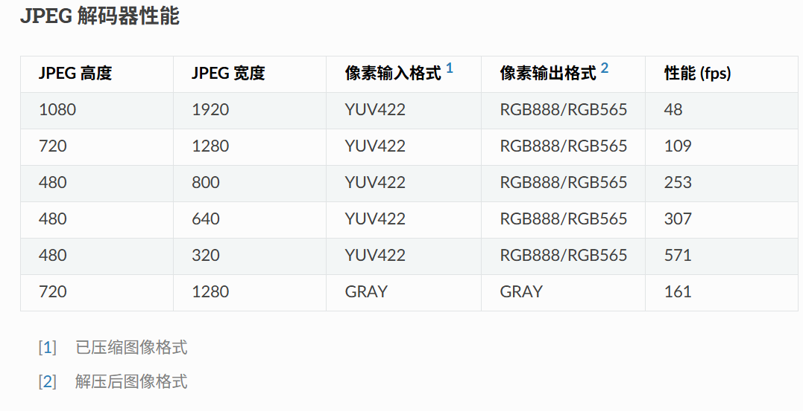
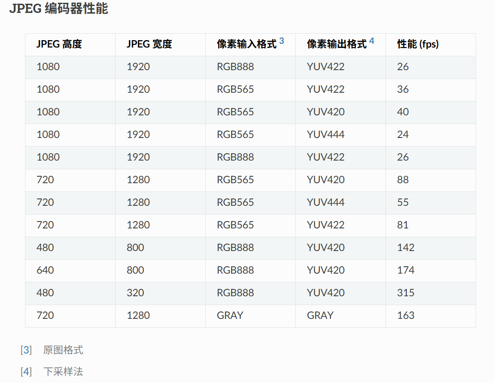
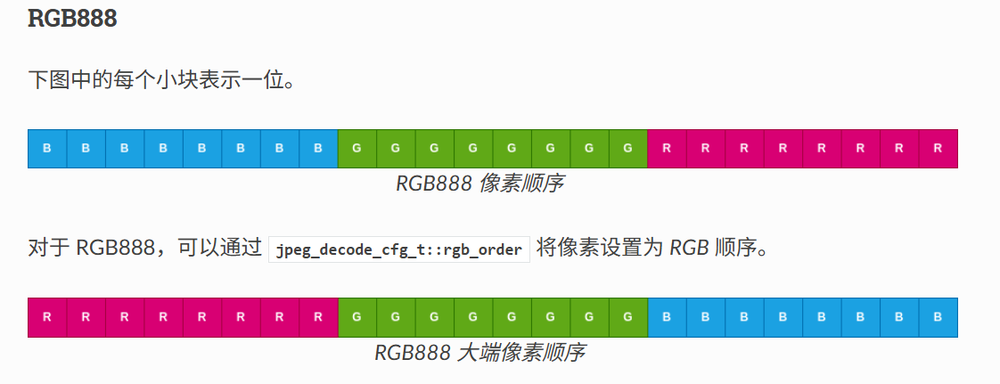
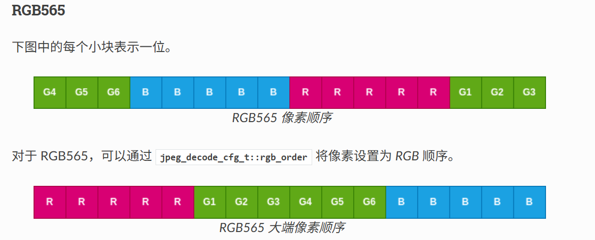

# JPEG 编解码

## 文档简介

本文档用于记录在esp-idf框架下使用组件进行jpeg编解码的过程，**jpeg编码在 {$IDF}/components/esp_driver_jpeg/ 下**，而解码需要单独载入 esp-jpeg组件

## 使用方式: esp-driver-jpeg

### 环境和导入

1. 在 CMakeLists.txt 中导入 `idf_component_register(... REQUIRES esp_driver_jpeg ...)`
2. 在文件中导入头文件 `#include "driver/jpeg_encode.h"`

### 开始使用

#### JPEG编码器

1. `jpeg_encode_engine_cfg_t` 进行编码器配置
   * `intr_priority` jpeg中断优先级，设0会代表默认优先级
   * `timeout_ms` 处理图片的超时阈值，必须大于有效解码时间（对于 30fps 解码，该值必须大于 34。-1 表示等待时间永远）
2. `jpeg_new_encoder_engine` 新建编码器，传入配置，传出句柄
3. `jpeg_encode_cfg_t` 配置编码配置
   * `height` 图像高度
   * `width` 图像宽度
   * `src_type` 原图格式，RGB565/RGB888 ； GRAY
   * `sub_sample` 下采样法，YUV444/YUV422/YUV420 ； GRAY （格式和采样法对应）
   * `image_quality` 图像质量
4. `jpeg_alloc_encoder_mem` 辅助函数，用于为jpeg编码器分配内存空间[参考指南](https://docs.espressif.com/projects/esp-idf/zh_CN/stable/esp32p4/api-reference/peripherals/jpeg.html#_CPPv422jpeg_alloc_encoder_mem6size_tPK30jpeg_encode_memory_alloc_cfg_tP6size_t)
5. `jpeg_encoder_process(encoder_engine ,encode_cfg ,encode_inbuf ,inbuf_size ,encode_outbuf ,outbuf_size ,out_size )` 传入编码配置，进行编码，传入参数可根据名称区分

```c
/*** 参考以下代码，为 1080*1920 大小的图片编码，不包括初始化 ***/
int raw_size_1080p = 0;/* Your raw image size */
jpeg_encode_cfg_t enc_config = {
    .src_type = JPEG_ENCODE_IN_FORMAT_RGB888,
    .sub_sample = JPEG_DOWN_SAMPLING_YUV422,
    .image_quality = 80,
    .width = 1920,
    .height = 1080,
};

uint8_t *raw_buf_1080p = (uint8_t*)jpeg_alloc_encoder_mem(raw_size_1080p);
if (raw_buf_1080p == NULL) {
    ESP_LOGE(TAG, "alloc 1080p tx buffer error");
    return;
}
uint8_t *jpg_buf_1080p = (uint8_t*)jpeg_alloc_encoder_mem(raw_size_1080p / 10); // Assume that compression ratio of 10 to 1
if (jpg_buf_1080p == NULL) {
    ESP_LOGE(TAG, "alloc jpg_buf_1080p error");
    return;
}

ESP_ERROR_CHECK(jpeg_encoder_process(jpeg_handle, &enc_config, raw_buf_1080p, raw_size_1080p, jpg_buf_1080p, &jpg_size_1080p););
```

#### JPEG解码器

1. `jpeg_new_decoder_engine` 安装解码器驱动（同上）
2. `jpeg_decode_cfg_t` 进行解码配置
   * `output_format` 解码器输出格式
   * `rgb_order` 解码器输出顺序
   * `conv_std` 解码器 YUV->RGB标准 （BT601/BT709）
3. `jpeg_decoder_memory_alloc_cfg_t` 配置内存 `buffer_direction` 配置为 **JPEG_DEC_ALLOC_OUTPUT_BUFFER** / **JPEG_DEC_ALLOC_INPUT_BUFFER**
4. 使用 `jpeg_alloc_decoder_men()` 分配在大小和地址都对齐的缓冲区
5. `jpeg_deocde_picture_info_t` 辅助类型，用于储存图像信息
6. `jpeg_decoder_get_info(bit_stream,stream_size,pircture_info)` **辅助函数，**传入图像缓冲buffer和图像大小，传出 `jpeg_deocde_picture_info_t`类型图像信息
7. `jpeg_decoder_process(decoder_engine, &decode_cfg_rgb, bit_stream, bit_stream_size, out_buf, &out_size)` 解码图片

```c
jpeg_decode_cfg_t decode_cfg_rgb = {
    .output_format = JPEG_DECODE_OUT_FORMAT_RGB888,
    .rgb_order = JPEG_DEC_RGB_ELEMENT_ORDER_BGR,
};

size_t tx_buffer_size;
size_t rx_buffer_size;

jpeg_decode_memory_alloc_cfg_t rx_mem_cfg = {
    .buffer_direction = JPEG_DEC_ALLOC_OUTPUT_BUFFER,
};

jpeg_decode_memory_alloc_cfg_t tx_mem_cfg = {
    .buffer_direction = JPEG_DEC_ALLOC_INPUT_BUFFER,
};

uint8_t *bit_stream = (uint8_t*)jpeg_alloc_decoder_mem(jpeg_size, &tx_mem_cfg, &tx_buffer_size);
uint8_t *out_buf = (uint8_t*)jpeg_alloc_decoder_mem(1920 * 1088 * 3, &rx_mem_cfg, &rx_buffer_size);

jpeg_decode_picture_info_t header_info;
ESP_ERROR_CHECK(jpeg_decoder_get_info(bit_stream, bit_stream_size, &header_info));
uint32_t out_size = 0;
ESP_ERROR_CHECK(jpeg_decoder_process(decoder_engine, &decode_cfg_rgb, bit_stream, bit_stream_size, out_buf, &out_size));
```


### 参数和性能 





### 有关格式

* **RGB** 代表红绿蓝三色组合成的图像颜色
* **RGB888** 实际顺序为 B G R ，分别由8个位存储，24位存储1个像素信息


* **RGB565** 代表5位红，五位绿，五位蓝，实际顺序如下，16位存储一个像素信息


* **YUV** 代表 亮度、色彩、饱和度
* **YUV444** 即为 每个像素都有独立的 Y、U、V 
* **YUV422** 即为 每个像素有独立的Y ，水平方向两个像素共享一组 UV
* **YUV420** 即为 每个像素一个Y，2x2区域共享一组UV

从 RGB 变为 YUV，即可达成较大的压缩效果