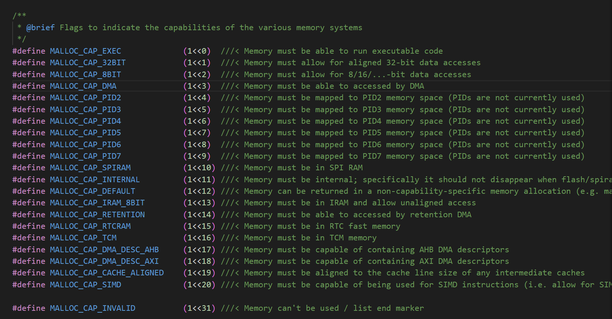

# LED Strip(SPI) LED灯带库的SPI实现

## 简介

本文档是笔者针对被大量使用的led strip库中的SPI实现原理和实际配置操作进行分析，方便理解和在其他开发板使用

## 代码分析

### led_strip_spi.h文件

> 关于去重和兼容的部分笔者不作解释

`led_strip_spi_config_t` 结构体由于储存SPI配置信息

* `clk_src` SPI时钟源
* `spi_bus` SPI总线ID
* `flags.with_dma` 是否启用DMA功能

`led_strip_new_spi_device` 创建基于SPI主机发送通道的设备

```c
/**
 * @brief LED Strip SPI specific configuration
 */
typedef struct {
    spi_clock_source_t clk_src; /*!< SPI clock source */
    spi_host_device_t spi_bus;  /*!< SPI bus ID. Which buses are available depends on the specific chip */
    struct {
        uint32_t with_dma: 1;   /*!< Use DMA to transmit data */
    } flags;                    /*!< Extra driver flags */
} led_strip_spi_config_t;

/**
 * @brief Create LED strip based on SPI MOSI channel
 * @note Although only the MOSI line is used for generating the signal, the whole SPI bus can't be used for other purposes.
 *
 * @param led_config LED strip configuration
 * @param spi_config SPI specific configuration
 * @param ret_strip Returned LED strip handle
 * @return
 *      - ESP_OK: create LED strip handle successfully
 *      - ESP_ERR_INVALID_ARG: create LED strip handle failed because of invalid argument
 *      - ESP_ERR_NOT_SUPPORTED: create LED strip handle failed because of unsupported configuration
 *      - ESP_ERR_NO_MEM: create LED strip handle failed because of out of memory
 *      - ESP_FAIL: create LED strip handle failed because some other error
 */
esp_err_t led_strip_new_spi_device(const led_strip_config_t *led_config, const led_strip_spi_config_t *spi_config, led_strip_handle_t *ret_strip);
```

### 定义和结构体

***宏定义***

* SPI默认频率为2.5MHz，即0.4us的周期。
* 默认发送队列大小为4（暂时不知道用处，先记着）
* 一个灯需要3字节，总共需要3*8bit

***灯带底层参数结构体***

* `base`结构体第一个成员，以`led_strip_t`类型作为第一个成员，使结构体可以被当作`led_strip_t`类型使用 （即可以用base作为本结构体变量，具体结合实际例子再解释）
* `spi_host` SPI主机
* `spi_device` SPI设备
* `strip_len` 灯带长度
* `bytes_per_pixel` 每像素字节，即每个灯的字节数
* `pixel_buf` 像素数组，每个像素代表灯，储存灯需要信息的数组，根据前一个参数决定分配多少数组给一个灯

***灯带结构体***

灯带配置，IO口，长度和个性化（适配不用的灯）

***灯带控制结构体***

抽象函数指针，逻辑上实现灯的颜色设置，刷新，清除颜色，和删除灯带释放内存的功能


```c
#define LED_STRIP_SPI_DEFAULT_RESOLUTION (2.5 * 1000 * 1000) // 2.5MHz resolution
#define LED_STRIP_SPI_DEFAULT_TRANS_QUEUE_SIZE 4

#define SPI_BYTES_PER_COLOR_BYTE 3
#define SPI_BITS_PER_COLOR_BYTE (SPI_BYTES_PER_COLOR_BYTE * 8)

static const char *TAG = "led_strip_spi";

typedef struct {
    led_strip_t base;
    spi_host_device_t spi_host;
    spi_device_handle_t spi_device;
    uint32_t strip_len;
    uint8_t bytes_per_pixel;
    uint8_t pixel_buf[];
} led_strip_spi_obj;

/**
 * @brief LED Strip Configuration
 */
typedef struct {
    int strip_gpio_num;      /*!< GPIO number that used by LED strip */
    uint32_t max_leds;       /*!< Maximum LEDs in a single strip */
    led_pixel_format_t led_pixel_format; /*!< LED pixel format */
    led_model_t led_model;   /*!< LED model */

    struct {
        uint32_t invert_out: 1; /*!< Invert output signal */
    } flags;                    /*!< Extra driver flags */
} led_strip_config_t;

typedef struct led_strip_t led_strip_t; /*!< Type of LED strip */

/**
 * @brief LED strip interface definition
 */
struct led_strip_t {
    /**
     * @brief Set RGB for a specific pixel
     *
     * @param strip: LED strip
     * @param index: index of pixel to set
     * @param red: red part of color
     * @param green: green part of color
     * @param blue: blue part of color
     *
     * @return
     *      - ESP_OK: Set RGB for a specific pixel successfully
     *      - ESP_ERR_INVALID_ARG: Set RGB for a specific pixel failed because of invalid parameters
     *      - ESP_FAIL: Set RGB for a specific pixel failed because other error occurred
     */
    esp_err_t (*set_pixel)(led_strip_t *strip, uint32_t index, uint32_t red, uint32_t green, uint32_t blue);

    /**
     * @brief Set RGBW for a specific pixel. Similar to `set_pixel` but also set the white component
     *
     * @param strip: LED strip
     * @param index: index of pixel to set
     * @param red: red part of color
     * @param green: green part of color
     * @param blue: blue part of color
     * @param white: separate white component
     *
     * @return
     *      - ESP_OK: Set RGBW color for a specific pixel successfully
     *      - ESP_ERR_INVALID_ARG: Set RGBW color for a specific pixel failed because of an invalid argument
     *      - ESP_FAIL: Set RGBW color for a specific pixel failed because other error occurred
     */
    esp_err_t (*set_pixel_rgbw)(led_strip_t *strip, uint32_t index, uint32_t red, uint32_t green, uint32_t blue, uint32_t white);

    /**
     * @brief Refresh memory colors to LEDs
     *
     * @param strip: LED strip
     * @param timeout_ms: timeout value for refreshing task
     *
     * @return
     *      - ESP_OK: Refresh successfully
     *      - ESP_FAIL: Refresh failed because some other error occurred
     *
     * @note:
     *      After updating the LED colors in the memory, a following invocation of this API is needed to flush colors to strip.
     */
    esp_err_t (*refresh)(led_strip_t *strip);

    /**
     * @brief Clear LED strip (turn off all LEDs)
     *
     * @param strip: LED strip
     * @param timeout_ms: timeout value for clearing task
     *
     * @return
     *      - ESP_OK: Clear LEDs successfully
     *      - ESP_FAIL: Clear LEDs failed because some other error occurred
     */
    esp_err_t (*clear)(led_strip_t *strip);

    /**
     * @brief Free LED strip resources
     *
     * @param strip: LED strip
     *
     * @return
     *      - ESP_OK: Free resources successfully
     *      - ESP_FAIL: Free resources failed because error occurred
     */
    esp_err_t (*del)(led_strip_t *strip);
};
```

### new_spi_device函数

函数参数`led_config`是LED灯参数的配置 `spi_config`是SPI的基础配置 `ret_strip`是抽象的控制结构体

1. `ON_FALSE`宏函数检查传入参数是否有效
2. 根据format的类型进行每像素自己的设置。DMA设置（挖坑，后续再填）
3. `heap_caps_calloc`分配一个具体给定的功能块，模块中初始化值为0 （内存块数量，分配大小，返回的内存类型）
4. 设置SPI，配置`spi_bus_config_t`SPI总线结构体
   * `mosi_io_num` 输出引脚绑定
   * 时钟引脚、输入引脚、写保护引脚、保持引脚均不使用
   * `max_transfer_sz` 最大灯数 x 每灯字节 x 每字节位数
5. `spi_bus_initialize` SPI总线初始化，参数为ID，配置结构体，是否启用DMA
6. `esp_rom_gpio_connect_out_signal` 配置GPIO引脚输出反转功能，专门针对LED灯带的SPI通信场景
   * `flags.invert_out` 是否需要反转输出信号
   * 第一个参数，GPIO引脚编号
   * 第二个参数，信号标识，指定输出信号 (*`spi_periph_signal`库内部的SPI信号映射数组*，`spi_host`主机ID作为索引，`spid_out`MOSI信号标识，**函数作用就是启用输出引脚的信号反转功能**)
   * 第三个参数，true/false 是否启用信号反转
   * 第四个参数 true/false 是否启用信号旁路功能（禁用时会正常通过GPIO输出，不绕过内部电路）
7. `spi_device_interface_config_t`SPI设备结构体
   * `command_bits` 命令阶段默认位数（0-16）
   * `address_bits` 地址阶段默认位数（0-64）
   * `dummy_bits` 地址和数据阶段插入的虚拟位数
   * `clock_speed_hz` SPI时钟速度
   * `mode` SPI模式（时钟极性CPOL，时钟相位CPHA）
   * `spics_io_num` 为-1代表不用CS片选
   * `queue_size` SPI事务队列长度
8. `spi_bus_add_device` 向SPI总线添加设备
9. `esp_rom_delay_us` *内部函数* 函数用于执行微秒级延时，确保设置完成
10. `spi_device_get_actual_freq` 计算特定设备的工作频率
11. ON_FLASE中判断实际频率是否和软件设置频率偏离太多
12. 把函数中每像素字节和灯带长度写入结构体，`spi_strip->base`是前面提到的抽象灯带控制结构体的指针，绑定到文件内部函数
13. 由于`spi_strip`是函数内部变量，在函数结束前传出给`ret_strip`

```c
esp_err_t led_strip_new_spi_device(const led_strip_config_t *led_config, const led_strip_spi_config_t *spi_config, led_strip_handle_t *ret_strip)
{
    led_strip_spi_obj *spi_strip = NULL;
    esp_err_t ret = ESP_OK;
    ESP_GOTO_ON_FALSE(led_config && spi_config && ret_strip, ESP_ERR_INVALID_ARG, err, TAG, "invalid argument");
    ESP_GOTO_ON_FALSE(led_config->led_pixel_format < LED_PIXEL_FORMAT_INVALID, ESP_ERR_INVALID_ARG, err, TAG, "invalid led_pixel_format");
    uint8_t bytes_per_pixel = 3;
    if (led_config->led_pixel_format == LED_PIXEL_FORMAT_GRBW) {
        bytes_per_pixel = 4;
    } else if (led_config->led_pixel_format == LED_PIXEL_FORMAT_GRB) {
        bytes_per_pixel = 3;
    } else {
        assert(false);
    }
    uint32_t mem_caps = MALLOC_CAP_DEFAULT;
    if (spi_config->flags.with_dma) {
        // DMA buffer must be placed in internal SRAM
        mem_caps |= MALLOC_CAP_INTERNAL | MALLOC_CAP_DMA;
    }
    spi_strip = heap_caps_calloc(1, sizeof(led_strip_spi_obj) + led_config->max_leds * bytes_per_pixel * SPI_BYTES_PER_COLOR_BYTE, mem_caps);

    ESP_GOTO_ON_FALSE(spi_strip, ESP_ERR_NO_MEM, err, TAG, "no mem for spi strip");

    spi_strip->spi_host = spi_config->spi_bus;
    // for backward compatibility, if the user does not set the clk_src, use the default value
    spi_clock_source_t clk_src = SPI_CLK_SRC_DEFAULT;
    if (spi_config->clk_src) {
        clk_src = spi_config->clk_src;
    }

    spi_bus_config_t spi_bus_cfg = {
        .mosi_io_num = led_config->strip_gpio_num,
        //Only use MOSI to generate the signal, set -1 when other pins are not used.
        .miso_io_num = -1,
        .sclk_io_num = -1,
        .quadwp_io_num = -1,
        .quadhd_io_num = -1,
        .max_transfer_sz = led_config->max_leds * bytes_per_pixel * SPI_BYTES_PER_COLOR_BYTE,
    };
    ESP_GOTO_ON_ERROR(spi_bus_initialize(spi_strip->spi_host, &spi_bus_cfg, spi_config->flags.with_dma ? SPI_DMA_CH_AUTO : SPI_DMA_DISABLED), err, TAG, "create SPI bus failed");

    if (led_config->flags.invert_out == true) {
        esp_rom_gpio_connect_out_signal(led_config->strip_gpio_num, spi_periph_signal[spi_strip->spi_host].spid_out, true, false);
    }

    spi_device_interface_config_t spi_dev_cfg = {
        .clock_source = clk_src,
        .command_bits = 0,
        .address_bits = 0,
        .dummy_bits = 0,
        .clock_speed_hz = LED_STRIP_SPI_DEFAULT_RESOLUTION,
        .mode = 0,
        //set -1 when CS is not used
        .spics_io_num = -1,
        .queue_size = LED_STRIP_SPI_DEFAULT_TRANS_QUEUE_SIZE,
    };

    ESP_GOTO_ON_ERROR(spi_bus_add_device(spi_strip->spi_host, &spi_dev_cfg, &spi_strip->spi_device), err, TAG, "Failed to add spi device");
    //ensure the reset time is enough
    esp_rom_delay_us(10);
    int clock_resolution_khz = 0;
    spi_device_get_actual_freq(spi_strip->spi_device, &clock_resolution_khz);
    // TODO: ideally we should decide the SPI_BYTES_PER_COLOR_BYTE by the real clock resolution
    // But now, let's fixed the resolution, the downside is, we don't support a clock source whose frequency is not multiple of LED_STRIP_SPI_DEFAULT_RESOLUTION
    // clock_resolution between 2.2MHz to 2.8MHz is supported
    ESP_GOTO_ON_FALSE((clock_resolution_khz < LED_STRIP_SPI_DEFAULT_RESOLUTION / 1000 + 300) && (clock_resolution_khz > LED_STRIP_SPI_DEFAULT_RESOLUTION / 1000 - 300), ESP_ERR_NOT_SUPPORTED, err,
                      TAG, "unsupported clock resolution:%dKHz", clock_resolution_khz);

    spi_strip->bytes_per_pixel = bytes_per_pixel;
    spi_strip->strip_len = led_config->max_leds;
    spi_strip->base.set_pixel = led_strip_spi_set_pixel;
    spi_strip->base.set_pixel_rgbw = led_strip_spi_set_pixel_rgbw;
    spi_strip->base.refresh = led_strip_spi_refresh;
    spi_strip->base.clear = led_strip_spi_clear;
    spi_strip->base.del = led_strip_spi_del;

    *ret_strip = &spi_strip->base;
    return ESP_OK;
err:
    if (spi_strip) {
        if (spi_strip->spi_device) {
            spi_bus_remove_device(spi_strip->spi_device);
        }
        if (spi_strip->spi_host) {
            spi_bus_free(spi_strip->spi_host);
        }
        free(spi_strip);
    }
    return ret;
}
```

### 具体灯带控制函数

灯带位设置函数，需要确保buf初值为0。

由前文所述，SPI频率是2.5MHz，即一位是0.4us，三位是1.2us，满足灯的时序。故注释说明，SPI的3位对应灯的1位，且以110代表灯的1，100，代表灯的0。具体原理见[WS2812解释](../../peripherals/rmt/led_strip/led_strip.md#ws2812解释)。也由此，三字节代表一个R或G或B值

位操作详解（写入顺序和具体灯控制有关，不作赘述）：

* 解释：第x位从1计，x位从0计 ；BIT(n)是内部宏定义，代表n位为1，其余为0 ；buf中数据默认为0b00000000（二进制）
* `*(buf + 2)`即**第3位**，`data&BIT(0)`是三目运算的判断，判断为0位是否为1，是则或运算0b00000110，否则或运算0b00000100,实际相当于最后三位写入110或100
* `data & BIT(1)` 判断1位并把进行或运算0b00110000 / 0b00100000 ，即在中间三位写入110或100
* `data & BIT(2)` 判断2位，但由于一个buf只有8位，故1只把最高位置1，0或0x00相当于不作操作
* `*(buf + 1)`即**第2位**，先或`BIT(0)`即把最低位置1，和上述**第3位**配合，组合三位成100或110
* `data & BIT(3)` 判断3位，是data的3位，和上接，判断后或运算 0b0x00001100 / 0b00001000
* `data & BIT(4)` 判断4位，判断写入后**第2位**的最高位为0，由于SPI的3位一组的末尾总为0，不作处理
* `*(buf + 0)`即**第1位**，判断5位后写入的是最后两位为11或10，即0b00000011 / 0b00000010
* `BIT(6)`和`BIT(7)`同上，留给读者自行分析

```c
// please make sure to zero-initialize the buf before calling this function
static void __led_strip_spi_bit(uint8_t data, uint8_t *buf)
{
    // Each color of 1 bit is represented by 3 bits of SPI, low_level:100 ,high_level:110
    // So a color byte occupies 3 bytes of SPI.
    *(buf + 2) |= data & BIT(0) ? BIT(2) | BIT(1) : BIT(2);
    *(buf + 2) |= data & BIT(1) ? BIT(5) | BIT(4) : BIT(5);
    *(buf + 2) |= data & BIT(2) ? BIT(7) : 0x00;
    *(buf + 1) |= BIT(0);
    *(buf + 1) |= data & BIT(3) ? BIT(3) | BIT(2) : BIT(3);
    *(buf + 1) |= data & BIT(4) ? BIT(6) | BIT(5) : BIT(6);
    *(buf + 0) |= data & BIT(5) ? BIT(1) | BIT(0) : BIT(1);
    *(buf + 0) |= data & BIT(6) ? BIT(4) | BIT(3) : BIT(4);
    *(buf + 0) |= data & BIT(7) ? BIT(7) | BIT(6) : BIT(7);
}
```

函数设置具体某个灯的RGB值

1. `__containerof`函数用于通过结构体成员的指针反推结构体的起始地址，`strip`成员指针，反推`led_strip_spi_obj`类型，成员名称为`base`，即通过传入的strip指针，其实传入的是base的地址，反推包含其的led_strip_spi_obj类型结构体地址。
2. `ESP_RETURN_ON_FALSE`即条件为FALS，就返回错误类型并进行日志打印
3. 设置`start`即数据中数据的起始索引，由index x 每像素字节 x 每颜色字节的SPI字节（由上分析，宏定义设置为3，和前对应）
4. `memset`设置数组初始值，起始地址为buf首地址加start，初始为0，数据长度为每像素字节 x 每颜色字节的SPI字节（即一个灯3字节，每个颜色3字节，总共归零数组中9个元素）
5. 调用函数把数据写入字节（*传入为uint32_t，而函数中为uint8_t，传入时只会处理低8位数据，即实际使用范围在0-255*）
6. 如果灯需要的每像素字节大于3，设置第四个参数为0

```c
static esp_err_t led_strip_spi_set_pixel(led_strip_t *strip, uint32_t index, uint32_t red, uint32_t green, uint32_t blue)
{
    led_strip_spi_obj *spi_strip = __containerof(strip, led_strip_spi_obj, base);
    ESP_RETURN_ON_FALSE(index < spi_strip->strip_len, ESP_ERR_INVALID_ARG, TAG, "index out of maximum number of LEDs");
    // LED_PIXEL_FORMAT_GRB takes 72bits(9bytes)
    uint32_t start = index * spi_strip->bytes_per_pixel * SPI_BYTES_PER_COLOR_BYTE;
    memset(spi_strip->pixel_buf + start, 0, spi_strip->bytes_per_pixel * SPI_BYTES_PER_COLOR_BYTE);
    __led_strip_spi_bit(green, &spi_strip->pixel_buf[start]);
    __led_strip_spi_bit(red, &spi_strip->pixel_buf[start + SPI_BYTES_PER_COLOR_BYTE]);
    __led_strip_spi_bit(blue, &spi_strip->pixel_buf[start + SPI_BYTES_PER_COLOR_BYTE * 2]);
    if (spi_strip->bytes_per_pixel > 3) {
        __led_strip_spi_bit(0, &spi_strip->pixel_buf[start + SPI_BYTES_PER_COLOR_BYTE * 3]);
    }
    return ESP_OK;
}
```

基本与上函数相同，补充上6：SK6812需要四个字节控制，还有white，根据[立创商城产品](https://item.szlcsc.com/5807150.html?lcsc_vid=TwQIU1xUQ1YPBFNWEwBaAVdeFABdXgJfTlNYUVRREVgxVlNTQVRYXlNSRFhfUzsOAxUeFF5JWAIASQYPGQZABAsLWA%3D%3D)数据手册，是关于色温设置的

由于时序没变，每颜色字节的实际SPI字节数依然是3字节

```c
static esp_err_t led_strip_spi_set_pixel_rgbw(led_strip_t *strip, uint32_t index, uint32_t red, uint32_t green, uint32_t blue, uint32_t white)
{
    led_strip_spi_obj *spi_strip = __containerof(strip, led_strip_spi_obj, base);
    ESP_RETURN_ON_FALSE(index < spi_strip->strip_len, ESP_ERR_INVALID_ARG, TAG, "index out of maximum number of LEDs");
    ESP_RETURN_ON_FALSE(spi_strip->bytes_per_pixel == 4, ESP_ERR_INVALID_ARG, TAG, "wrong LED pixel format, expected 4 bytes per pixel");
    // LED_PIXEL_FORMAT_GRBW takes 96bits(12bytes)
    uint32_t start = index * spi_strip->bytes_per_pixel * SPI_BYTES_PER_COLOR_BYTE;
    // SK6812 component order is GRBW
    memset(spi_strip->pixel_buf + start, 0, spi_strip->bytes_per_pixel * SPI_BYTES_PER_COLOR_BYTE);
    __led_strip_spi_bit(green, &spi_strip->pixel_buf[start]);
    __led_strip_spi_bit(red, &spi_strip->pixel_buf[start + SPI_BYTES_PER_COLOR_BYTE]);
    __led_strip_spi_bit(blue, &spi_strip->pixel_buf[start + SPI_BYTES_PER_COLOR_BYTE * 2]);
    __led_strip_spi_bit(white, &spi_strip->pixel_buf[start + SPI_BYTES_PER_COLOR_BYTE * 3]);

    return ESP_OK;
}
```

刷新、清除和删除放在一起说明

***删除***

获取地址，通过`spi_bus_remove_device`函数先删除总线上设备，再`spi_bus_free`释放总线驱动，最后释放分配的结构体堆空间

***刷新***

1. 获取地址
2. 初始化传输事务配置结构体初值为0
3. 配置传输长度为 灯带长度 x 每像素字节 x 每颜色字节的SPI位
4. 绑定发送字节数组为像素数组，设置无接受
5. `spi_device_transmit` 启动发送，等待完成并返回结果

***清除***

1. 获取地址
2. 初始化所有字节为0
3. 循环（灯数）次，把每个灯的数据配置为0 **灯亮度为0是发送数据在灯时序上为0，而不是在数组中为0，实际应该是100的组合**
4. 每次加`SPI_BYTES_PER_COLOR_BYTE`写下一颜色字节（3个实际字节）
5. 调用刷新函数通过SPI发送


```c
static esp_err_t led_strip_spi_refresh(led_strip_t *strip)
{
    led_strip_spi_obj *spi_strip = __containerof(strip, led_strip_spi_obj, base);
    spi_transaction_t tx_conf;
    memset(&tx_conf, 0, sizeof(tx_conf));

    tx_conf.length = spi_strip->strip_len * spi_strip->bytes_per_pixel * SPI_BITS_PER_COLOR_BYTE;
    tx_conf.tx_buffer = spi_strip->pixel_buf;
    tx_conf.rx_buffer = NULL;
    ESP_RETURN_ON_ERROR(spi_device_transmit(spi_strip->spi_device, &tx_conf), TAG, "transmit pixels by SPI failed");

    return ESP_OK;
}

static esp_err_t led_strip_spi_clear(led_strip_t *strip)
{
    led_strip_spi_obj *spi_strip = __containerof(strip, led_strip_spi_obj, base);
    //Write zero to turn off all leds
    memset(spi_strip->pixel_buf, 0, spi_strip->strip_len * spi_strip->bytes_per_pixel * SPI_BYTES_PER_COLOR_BYTE);
    uint8_t *buf = spi_strip->pixel_buf;
    for (int index = 0; index < spi_strip->strip_len * spi_strip->bytes_per_pixel; index++) {
        __led_strip_spi_bit(0, buf);
        buf += SPI_BYTES_PER_COLOR_BYTE;
    }

    return led_strip_spi_refresh(strip);
}

static esp_err_t led_strip_spi_del(led_strip_t *strip)
{
    led_strip_spi_obj *spi_strip = __containerof(strip, led_strip_spi_obj, base);

    ESP_RETURN_ON_ERROR(spi_bus_remove_device(spi_strip->spi_device), TAG, "delete spi device failed");
    ESP_RETURN_ON_ERROR(spi_bus_free(spi_strip->spi_host), TAG, "free spi bus failed");

    free(spi_strip);
    return ESP_OK;
}
```

## 总结

本例程是led_strip库中关于SPI驱动的部分，算是填坑，也为了其他单片机做准备。总结思路，把SPI频率设置为2.5MHz，以3位SPI组成1位灯数据，然后把实际数据转换成SPI数组数据，整个转换完后输出。关于SPI配置，只启用输出脚，不启用其他脚，在ESP中可以，但单片机中不一定可行。总的来说就是只用SPI的发送功能，把灯的数据以多位SPI组合的形式发送，以满足时序。关于结构体和函数绑定，在不断接触中熟悉了解，但还是比较懵，留待后续例程学习或自己编写的时候不断进化。