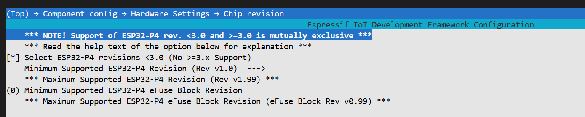
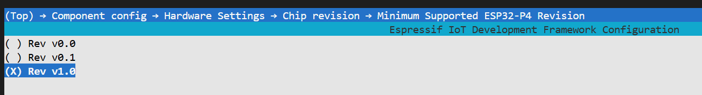
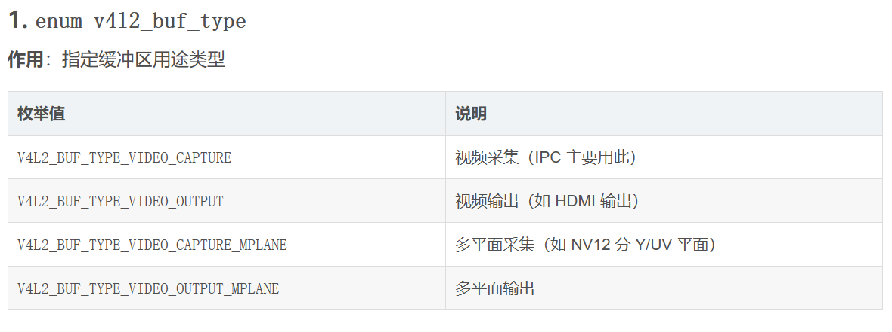
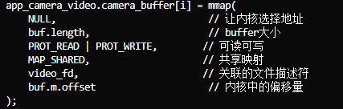
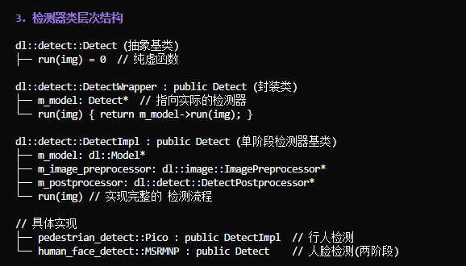

# 启明云端ESP32P4C5示例

## 简介

记录在使用启明云端esp32p4c5开发板烧录时的问题和收获

## 问题

* 编译烧录遇到问题 `requires chip revision in range [v3.1 - v3.99] (this chip is revision v1.3).`
  
1. 使用`idf.py set-target esp32p4`设置芯片型号为esp32p4
2. 通过`idf.py menuconfig`打开配置菜单
3. 进入`Component config -> Hardware Setting -> Chip revision`路径
    
4. 选中`Select ESP32-P4 revisions < 3.0 (No >= 3.x Support)`
5. 进入 `Minimum Supported ESP32-P4 Revision(Rev v1.0)`选择对应版本
   


## 解析

### ESP-Brookesia 智能交互与表情设计框架

该框架作为智能手机式UI框架，基于LVGL实现

组件层次结构：

```markdown
managed_components/espressif__esp-brookesia/src/
├── esp_brookesia.hpp              # 主头文件（包含所有模块）
├── core/                           # 核心框架
│   ├── esp_brookesia_core.hpp     # Core类（核心引擎）
│   ├── esp_brookesia_core_app.hpp  # CoreApp类（应用基类）
│   ├── esp_brookesia_core_home.hpp # Home类（桌面）
│   ├── esp_brookesia_core_manager.hpp # Manager类（管理器）
│   └── esp_brookesia_core_type.h   # 核心数据类型定义
├── systems/phone/                  # 手机系统实现
│   ├── esp_brookesia_phone.hpp     # Phone类
│   ├── esp_brookesia_phone_app.hpp # PhoneApp类
│   ├── esp_brookesia_phone_home.hpp
│   ├── esp_brookesia_phone_manager.hpp
│   ├── esp_brookesia_phone_type.h  # Phone数据类型
│   └── stylesheets/                # 样式表（不同分辨率/主题）
│       └── 1024_600/dark/         # 1024x600暗色主题
├── widgets/                        # UI组件
│   ├── status_bar/                 # 状态栏
│   ├── navigation_bar/             # 导航栏
│   ├── app_launcher/               # 应用启动器
│   ├── recents_screen/             # 最近任务屏幕
│   └── gesture/                    # 手势识别
└── assets/                         # 资源文件（图片、字体）
```

#### 组件使用方式

1. 创建基于组件库的应用类 `class MyAPP : public ESP_Brookesia_PhoneAPP`
2. 实现基于 `ESP_Brookesia_PhoneAPP` 基类，需要覆写的虚函数
3. 在源文件中具体实现
4. 在main函数中安装应用
5. `ESP_Brookesia_Phone* phone = new ESP_Brookesia_Phone();` 创建Phone
6. `phone->addStylesheet` 添加样式表
7. `phone->activeStylesheet` 激活样式表
8. `phone->bigin();` 启动Phone系统

```cpp
class MyAPP : public ESP_Brookesia_PhoneAPP{
public:
    MyAPP();
    ~MyAPP();

    bool init(void) override;
    bool run(void) override;
    bool pause(void) override;
    bool resume(void) override;
    bool back(void) override;
    bool close(void) override;
private:
    lv_obj_t* _label; // 示例：保存UI组件指针
};
```

```cpp
LV_IMG_DECLARE(img_app); // 不用写后缀

MyAPP::MyAPP():ESP_Brookesia_PhoneAPP("MyAPP",&img_app,true),_label(nullptr){};
MyAPP::~MyAPP(){};

bool MyAPP::init(void){
    ESP_LOGI("MyAPP","APP initialized");
    return true;
}

bool MyAPP::run(void){
    // 获取可视化区域
    lv_area_t area = getVisualArea();
    int width = area.x2 - area.x1;
    int height = area.y2 - area.y1;

    // 在默认屏幕上创建UI
    lv_obj_t* screen = lv_scr_act();

    // 创建标签
    _label = lv_label_create(screen);
    lv_label_set_text(_label,"Hello form MyAPP");
    lv_obj_create(_label);

    ESP_LOGI("MyAPP","App started,area: %dx%d",width,height);
    return true;
}

bool MyAPP::pause(void){
    ESP_LOGI("MyAPP","App paused");
    return true;
}

bool MyAPP::resume(void){
    ESP_LOGI("MyAPP","App resume");
    return true;
}

bool MyAPP::back(void){
    // 通知Phone系统关闭本应用
    notifyCoreClosed();
    return true;
}

bool MyAPP::close(void){
    ESP_LOGI("MyAPP","App closed");
    return true;
}

```

```cpp
// 初始化显示
lvgl_port_cfg_t lvgl_cfg = ESP_LVGL_PORT_INIT_CONFIG();
bsp_display_cfg_t cfg = {
    .lvgl_port_cfg = lvgl_cfg,
    .buffer_size = BSP_LCD_DRAW_BUFF_SIZE,
    .double_buffer = BSP_LCD_DRAW_BUFF_COUBLE,
};
bsp_diaplay_start_with_config(&cfg);
bsp_display_backlight_on();

bsp_display_lock(0);

// 创建Phone
ESP_Brookesia_Phone* phone = new ESP_Brookesia_Phone();
phone->addStylesheet(ESP_BROOKESIA_PHONE_1024_600_DRAK_STYLESHEET());
phone->activeStylesheet(ESP_BROOKESIA_PHONE_1024_600_DRAK_STYLESHEET());
phone->bigin();

// 安装新应用
phone->installApp(new MyApp());

bsp_display_unlock();

```

### 启明云端硬件抽象层 BSP

```markdown
components/wtdkp4c5_s1_board/
├── wtdkp4c5_s1_board.c     # 主要实现文件（900+行）
├── include/bsp/
│   ├── config.h            # BSP配置宏（如是否启用LVGL）
│   ├── wtdkp4c5_s1_board.h # 板级接口定义（I2C/音频/存储/USB等）
│   ├── display.h           # 显示屏接口
│   ├── touch.h            # 触摸屏接口
│   └── esp-bsp.h          # 统一头文件
└── priv_include/
    └── bsp_err_check.h     # 错误检查宏
```


|模块|初始化函数|反初始化函数|主要功能|
|:--|:-----|:-----|:-------|
|I2C|bsp_i2c_init()|bsp_i2c_deinit()|访问触摸屏、codec等I2C设备|
|Display|bsp_display_new()|bsp_display_delete()|MIPI DSI 显示屏驱动|
|Touch|bsp_touch_new()|bsp_touch_delete()|GT911触摸屏驱动|
|Audio|bsp_audio_init()||I2S音频 codec初始化|
|SD卡|bsp_sdcard_mount()|bsp_sdcard_unmount()|FATFS文件系统|
|SPIFFS|bsp_spiffs_mount()|bsp_spiffs_unmount()|Flash文件系统|
|USB|bsp_usb_host_start()|bsp_usb_host_stop()|USB Host|
|Ethernet|bsp_eth_init()|bsp_eth_deinit()|ETH网络|

#### 抽象层集成

##### I2C

* 在 `wtdkp4c5_s1_board.h`中定义I2C端口号，引脚相关宏
* 进行单次初始化(检查标志位，已有则返回)，配置`i2c_master_bus`并新建总线**句柄**
* 使用ES8311和GT911的组件库，传入总线句柄，配置结构体完成初始化

最终接口：

* `bsp_i2c_init()` 初始化I2C主机(master)总线
* `bsp_i2c_deinit()` 销毁I2C总线，并清除标志位
* `bsp_i2c_get_handle()` 获取I2C总线句柄

##### Display

显示的层次架构如图：

由应用去调用LVGL图形库，向下传递到lvgl端口，再到esp-lcd控制屏幕

```markdown
┌─────────────────────────────────────────────────────────────┐
│                     应用层 (Application)                     │
│           ESP-Brookesia / LVGL App / 用户代码                │
└─────────────────────────────┬───────────────────────────────┘
                              │ LVGL API
┌─────────────────────────────▼───────────────────────────────┐
│                   LVGL 图形库 (v8.4.0)                       │
│        lv_label_create() / lv_obj_create() / etc.           │
└─────────────────────────────┬───────────────────────────────┘
                              │ lvgl_port API
┌─────────────────────────────▼───────────────────────────────┐
│                   lvgl_port 端口层                           │
│   lvgl_port_add_disp_dsi() / lvgl_port_add_touch()          │
└─────────────────────────────┬───────────────────────────────┘
                              │ esp_lcd API
┌─────────────────────────────▼───────────────────────────────┐
│                   esp-lcd 驱动框架                           │
│  ┌──────────────┐  ┌──────────────┐  ┌──────────────┐       │
│  │  DBI接口     │  │  DSI总线      │  │  EK79007驱动 │       │
│  │ esp_lcd_panel│◄─┤ esp_lcd_dsi  │◄─┤ esp_lcd_panel│       │
│  │ _io_dbi      │  │ _bus         │  │ _ek79007     │       │
│  └──────────────┘  └──────────────┘  └──────────────┘       │
└─────────────────────────────┬───────────────────────────────┘
                              │ MIPI DSI 信号
┌─────────────────────────────▼───────────────────────────────┐
│                        硬件层                                │
│   ┌──────────────┐  ┌──────────────┐  ┌──────────────┐      │
│   │   ESP32P4    │──│  MIPI DSI    │──│   EK79007    │───►  │
│   │  DSI Host    │  │  PHY         │  │  显示控制器   │      │
│   └──────────────┘  └──────────────┘  └──────────────┘      │
└─────────────────────────────────────────────────────────────┘
```

* MIPI DSI 总线初始化 `bsp_display_new_with_handles` (`bsp_display_new`是在该函数外部封装了一层)
  1. `bsp_enable_dsi_phy_power` 使能DSI PHY电源，LDO通道3，2.5v
  2. `esp_lcd_dsi_bus_handle_t` MIPI DSI总线配置，写入`esp_lcd_dsi_bus_config_t` 结构体 ，见[MIPI DSI 接口的 LCD](https://docs.espressif.com/projects/esp-idf/zh_CN/stable/esp32p4/api-reference/peripherals/lcd/dsi_lcd.html)
      * `bus_id` **总线编号**，从0开始，指定使用的DSI主机
      * `num_date_lanes` 使用的**数据通道**，不能超过芯片支持数量
      * `phy_clk_src` 时钟源，默认`MIPI_DIS_PHY_CLK_SRC_DEFAULT`
      * `lane_bit_rate_mbps` 比特率（Mbps），**设置`1000`代表1Gbps**
  3. `esp_lcd_new_dsi_bus(config,handle)` 新建总线
  4. `esp_lcd_panel_io_handle_t` DBI接口（*DBI 接口主要用作 esp_lcd 组件中的控制 IO 层。使用该接口可读写 LCD 设备内部的配置寄存器*），通过`esp_lcd_dbi_io_config_t`结构体配置
      * `virtual_channel` 虚拟通道号，用于不同来源多路复用，**只连接一个设备设0**
      * `lcd_cmd_bits` 命令位宽，依据LCD规格书设置
      * `lcd_param_bits` 参数位宽，依据LCD规格书设置
  5. `esp_lcd_dpi_panel_config_t`创建EK7900面板驱动（LCD控制器驱动）
  6. `ek79007_vendor_config_t` 将前面创建的**句柄和配置**，写入该结构体用于后续绑定
  7. `esp_lcd_panel_dev_config_t` LCD设备最终配置
  8. `esp_lcd_new_panel_re79007` 创建LCD控制器驱动

```cpp
esp_err_t bsp_display_new_with_handles(const bsp_display_config_t *config, bsp_lcd_handles_t *ret_handles)
{
    esp_err_t ret = ESP_OK;

    ESP_RETURN_ON_ERROR(bsp_enable_dsi_phy_power(), TAG, "DSI PHY power failed");

    /* create MIPI DSI bus first, it will initialize the DSI PHY as well */
    esp_lcd_dsi_bus_handle_t mipi_dsi_bus;
    esp_lcd_dsi_bus_config_t bus_config = {
        .bus_id = 0,
        .num_data_lanes = BSP_LCD_MIPI_DSI_LANE_NUM,
        .phy_clk_src = MIPI_DSI_PHY_CLK_SRC_DEFAULT,
        .lane_bit_rate_mbps = BSP_LCD_MIPI_DSI_LANE_BITRATE_MBPS,
    };
    ESP_RETURN_ON_ERROR(esp_lcd_new_dsi_bus(&bus_config, &mipi_dsi_bus), TAG, "New DSI bus init failed");

    ESP_LOGI(TAG, "Install MIPI DSI LCD control panel");
    // we use DBI interface to send LCD commands and parameters
    esp_lcd_panel_io_handle_t io;
    esp_lcd_dbi_io_config_t dbi_config = {
        .virtual_channel = 0,
        .lcd_cmd_bits = 8,   // according to the LCD ILI9881C spec
        .lcd_param_bits = 8, // according to the LCD ILI9881C spec
    };
    ESP_GOTO_ON_ERROR(esp_lcd_new_panel_io_dbi(mipi_dsi_bus, &dbi_config, &io), err, TAG, "New panel IO failed");

    esp_lcd_panel_handle_t disp_panel = NULL;

    // create EK79007 control panel
    ESP_LOGI(TAG, "Install EK79007 LCD control panel");

#if CONFIG_BSP_LCD_COLOR_FORMAT_RGB888
    esp_lcd_dpi_panel_config_t dpi_config = EK79007_1024_600_PANEL_60HZ_CONFIG(LCD_COLOR_PIXEL_FORMAT_RGB888);
#else
    esp_lcd_dpi_panel_config_t dpi_config = EK79007_1024_600_PANEL_60HZ_CONFIG(LCD_COLOR_PIXEL_FORMAT_RGB565);
#endif
    dpi_config.num_fbs = CONFIG_BSP_LCD_DPI_BUFFER_NUMS;

    ek79007_vendor_config_t vendor_config = {
        .mipi_config = {
            .dsi_bus = mipi_dsi_bus,
            .dpi_config = &dpi_config,
        },
    };
    esp_lcd_panel_dev_config_t lcd_dev_config = {
        .bits_per_pixel = 16,
        .rgb_ele_order = BSP_LCD_COLOR_SPACE,
        .reset_gpio_num = BSP_LCD_RST,
        .vendor_config = &vendor_config,
    };
    ESP_GOTO_ON_ERROR(esp_lcd_new_panel_ek79007(io, &lcd_dev_config, &disp_panel), err, TAG, "New LCD panel EK79007 failed");
    ESP_GOTO_ON_ERROR(esp_lcd_panel_reset(disp_panel), err, TAG, "LCD panel reset failed");
    ESP_GOTO_ON_ERROR(esp_lcd_panel_init(disp_panel), err, TAG, "LCD panel init failed");

    /* Return all handles */
    ret_handles->io = io;
    ret_handles->mipi_dsi_bus = mipi_dsi_bus;
    ret_handles->panel = disp_panel;
    ret_handles->control = NULL;

    ESP_LOGI(TAG, "Display initialized");

    return ret;

err:
    if (disp_panel) {
        esp_lcd_panel_del(disp_panel);
    }
    if (io) {
        esp_lcd_panel_io_del(io);
    }
    if (mipi_dsi_bus) {
        esp_lcd_del_dsi_bus(mipi_dsi_bus);
    }
    return ret;
}
```

* LVGL端口集成 `bsp_display_lcd_init()` 
  1. `bsp_display_new_with_handles()` 写入 `bsp_display_config_t` 类型配置，传出 `bsp_lcd_handles_t` 类型句柄，用于获取显示器句柄（就是前面解释的那个函数
  2. `lvgl_port_display_cfg_t` 类型配置 [esp_lvgl_port 组件库](https://components.espressif.com/components/espressif/esp_lvgl_port/versions/2.7.2/readme)
     * `io_handle` LCD 面板IO句柄
     * `panel_handle` LCD 面板句柄
     * `buffer_size` 缓冲区大小（像素）
     * `doubel_buffer` 双缓冲标志位
     * `hres` 水平分辨率
     * `vres` 垂直分辨率
     * `monochrome` 非单色标志位
     * `rotation` 屏幕旋转默认值
       * `swap_xy` xy屏幕翻转标志位
       * `mirror_x` x轴镜像标志位
       * `mirrot_y` y轴镜像标志位
     * `flags` 标志
       * `buff_dma` LVGL缓冲区支持DMA功能
       * `buff_spiram` LVGL缓冲区将放在PSRAM中
       * `sw_rotate` 使用软件旋转
       * `diract_mode` 使用与屏幕大小匹配的缓冲区，并绘制到绝对坐标
  3. `lvgl_port_display_dsi_cfg_t` 使用内部MIPI-DSI缓冲区作为LVGL绘图缓冲避免撕裂效应，启用此选项需要两个以上LCD缓冲，并可以降低帧率
  4. `lvgl_port_add_disp_dsi(%disp_cfg,&dpi_cfg)` 添加DSI显示设备到LVGL

```c
static lv_display_t *bsp_display_lcd_init(const bsp_display_cfg_t *cfg)
{
    assert(cfg != NULL);
    BSP_ERROR_CHECK_RETURN_NULL(bsp_display_new_with_handles(&cfg->hw_cfg, &disp_handles));

    uint32_t display_hres = BSP_LCD_H_RES;
    uint32_t display_vres = BSP_LCD_V_RES;

    ESP_LOGI(TAG, "Display resolution %ldx%ld", display_hres, display_vres);

    /* Add LCD screen */
    ESP_LOGD(TAG, "Add LCD screen");
    const lvgl_port_display_cfg_t disp_cfg = {.io_handle = disp_handles.io,
                                              .panel_handle = disp_handles.panel,
                                              .control_handle = disp_handles.control,
                                              .buffer_size = cfg->buffer_size,
                                              .double_buffer = cfg->double_buffer,
                                              .hres = display_hres,
                                              .vres = display_vres,
                                              .monochrome = false,
                                              /* Rotation values must be same as used in esp_lcd for initial settings of the screen */
                                              .rotation =
                                                  {
                                                      .swap_xy = false,
                                                      .mirror_x = true,
                                                      .mirror_y = true,
                                                  },
                                              .flags = {
                                                  .buff_dma = cfg->flags.buff_dma,
                                                  .buff_spiram = cfg->flags.buff_spiram,
                                                  .sw_rotate = false, /* Avoid tearing is not supported for SW rotation */
                                                  .direct_mode = true,
                                              }};

    const lvgl_port_display_dsi_cfg_t dpi_cfg = {
        .flags =
            {
                .avoid_tearing = true,
            },
    };

    return lvgl_port_add_disp_dsi(&disp_cfg, &dpi_cfg);
}
```

* `bsp_display_brightness_init()` 由于LCD是靠背光LED提供光源，我们通过调节LED的亮度改变屏幕亮度
  1. `ledc_timer_confgi_t` 配置LEDC定时器结构体（即PWM配置）
     * `speed_mode` 速度模式，高速/低速
     * `duty_resolution` 设置占空比对应精度(1~20位)，不同精度对应不同可行的PWM波形
     * `timer_num` 通道的定时器源
     * `freq_hz` 指定定时器频率
  2. `ledc_timer_config` 传入结构体进行定时器配置
  3. `ledc_channel_config_t` LEDC通道配置
      * `gpio_num` GPIO引脚
      * `channel` 分配通道号
      * `duty` 设定初始占空比
  4. `bsp_display_brightness_set(int brightness_precent)` 自定义函数将亮度百分比转换成对应的占空比值

```c
esp_err_t bsp_display_brightness_init(void)
{
    // Setup LEDC peripheral for PWM backlight control
    const ledc_channel_config_t LCD_backlight_channel = {
        .gpio_num = BSP_LCD_BACKLIGHT,
        .speed_mode = LEDC_LOW_SPEED_MODE,
        .channel = LCD_LEDC_CH,
        .intr_type = LEDC_INTR_DISABLE,
        .timer_sel = 1,
        .duty = 0,
        .hpoint = 0,
    };
    const ledc_timer_config_t LCD_backlight_timer = {
        .speed_mode = LEDC_LOW_SPEED_MODE,
        .duty_resolution = LEDC_TIMER_10_BIT,
        .timer_num = 1,
        .freq_hz = 5000,
        .clk_cfg = LEDC_AUTO_CLK,
    };

    BSP_ERROR_CHECK_RETURN_ERR(ledc_timer_config(&LCD_backlight_timer));
    BSP_ERROR_CHECK_RETURN_ERR(ledc_channel_config(&LCD_backlight_channel));
    return ESP_OK;
}
```

* `bsp_display_indev_init` 触摸输入初始化，通过I2C协议和屏幕驱动连接，不作展开
* `bsp_display_cfg_t` LVGL缓冲区结构体配置

### Camera 摄像头使用

#### 摄像头和数据处理

* `app_vidio_set_bufs()` 设置V4L2(Video4Linux2)标准的帧缓冲设置函数
  1. 缓冲区参数校验，最多6个，最少两个（双缓冲是基本要求）
  2. `struct v4l2_requestbuffers` 结构体定义 [V4L2数据结构说明](https://blog.csdn.net/qq_43584113/article/details/156725566)
       * `count` 请求的缓冲区数量，通常设置为3-8帧
       * `type` 缓冲区类型
       * `memory` 内存类型
       * `reserved` 保留字段
  3. `memory` 类型定义为 `V4L2_MEMORY_MAP` 内核映射用户空间 / `V4L2_MEMORY_USERPTR` 用户程序自己分配，由fb参数是否为空判断
  4. `ioctl` linux内核的设备控制接口函数，写入描述符和控制协议，成功返回0 `VIDIOC_QUERYBUF` 向内核请求缓冲区，由内核分配指定数量buffer
  5. 循环处理每个缓冲区
     1. `struct v4l2_buffer buf` v4l2缓冲区结构体，具体可见前面链接说明
     2. 首先定义缓冲区的类型，内存类型，索引号
     3. 使用 `ioctl` 写入 `QUERYBUF` 查询内核分配的缓冲区信息
     4. 根据memory类型确定 `app_camrea_video` 的实际缓冲区
     5. `mmap()` 函数由驱动管理内存，
     6. 手动管理就把 `buf.m.userptr` 和 `app_camrea_video.camrea_buffer` 指定为fb的成员（*fb[i]是void*类型通用指针，被强转为不同类型，一个是直接写入地址，一个是传递指针*）
  6. `app_camera_video.camera_buf_size = buf.length;` 将两个结构体大小进行同步
  7. 通过`ioctl` 使用 `VIDIOC_QBUF` 将空buffer放入采集队列，等待被填充

```c
esp_err_t app_video_set_bufs(int video_fd, uint32_t fb_num, const void **fb)
{
    if (fb_num > MAX_BUFFER_COUNT) {
        ESP_LOGE(TAG, "buffer num is too large");
        return ESP_FAIL;
    } else if (fb_num < MIN_BUFFER_COUNT) {
        ESP_LOGE(TAG, "At least two buffers are required");
        return ESP_FAIL;
    }

    struct v4l2_requestbuffers req;
    int type = V4L2_BUF_TYPE_VIDEO_CAPTURE;

    memset(&req, 0, sizeof(req));
    req.count = fb_num;
    req.type = type;

    app_camera_video.camera_mem_mode = req.memory = fb ? V4L2_MEMORY_USERPTR : V4L2_MEMORY_MMAP;

    if (ioctl(video_fd, VIDIOC_REQBUFS, &req) != 0) {
        ESP_LOGE(TAG, "req bufs failed");
        goto errout_req_bufs;
    }
    for (int i = 0; i < fb_num; i++) {
        struct v4l2_buffer buf;
        memset(&buf, 0, sizeof(buf));
        buf.type = type;
        buf.memory = req.memory;
        buf.index = i;

        if (ioctl(video_fd, VIDIOC_QUERYBUF, &buf) != 0) {
            ESP_LOGE(TAG, "query buf failed");
            goto errout_req_bufs;
        }

        if (req.memory == V4L2_MEMORY_MMAP) {
            app_camera_video.camera_buffer[i] = mmap(NULL, buf.length, PROT_READ | PROT_WRITE, MAP_SHARED, video_fd, buf.m.offset);
            if (app_camera_video.camera_buffer[i] == NULL) {
                ESP_LOGE(TAG, "mmap failed");
                goto errout_req_bufs;
            }
        } else {
            if (!fb[i]) {
                ESP_LOGE(TAG, "frame buffer is NULL");
                goto errout_req_bufs;
            }
            buf.m.userptr = (unsigned long)fb[i];
            app_camera_video.camera_buffer[i] = (uint8_t *)fb[i];
        }

        app_camera_video.camera_buf_size = buf.length;

        if (ioctl(video_fd, VIDIOC_QBUF, &buf) != 0) {
            ESP_LOGE(TAG, "queue frame buffer failed");
            goto errout_req_bufs;
        }
    }

    return ESP_OK;

errout_req_bufs:
    close(video_fd);
    return ESP_FAIL;
}
```

* `video_stream_start` 启动视频流任务，将采集任务绑定到指定CPU核心
  1. `xEventGroupCreate` 初始化事件组并赋给 `app_camera_video.video_event_group`，判断是否存在防止重复创建，可用8个位
  2. `xEventGroupClearBits(app_camera_video.video_event_group, VIDEO_TASK_DELETE_DONE)` 清除 `VIDEO_TASK_DELETE_DONE` 宏所代表的标志位
  3. `video_stream_start` 调用自定义函数启动视频流
     1. 定义类型为 `V4L2_BUF_TYPE_VIDEO_CAPTURE` 视频采集
     2. 使用 `ioctl` 发送 `VIDIOC_STREAMON` 启用视频流，让摄像头开始采集图像
     3. `struct v4l2_format` 类型结构体，使用 `VIDIOC_G_FMT` 获取当前格式
  4. `xTaskCreatePinnedToCore` 创建并绑定任务`video_stream_task`到核心0

```c
esp_err_t app_video_stream_task_start(int video_fd, int core_id)
{
    if(app_camera_video.video_event_group == NULL) {
        app_camera_video.video_event_group = xEventGroupCreate();
    }
    xEventGroupClearBits(app_camera_video.video_event_group, VIDEO_TASK_DELETE_DONE);

    video_stream_start(video_fd);

    BaseType_t result = xTaskCreatePinnedToCore(video_stream_task, "video stream task", VIDEO_TASK_STACK_SIZE, &video_fd, VIDEO_TASK_PRIORITY, &app_camera_video.video_stream_task_handle, core_id);

    if (result != pdPASS) {
        ESP_LOGE(TAG, "failed to create video stream task");
        goto errout;
    }

    return ESP_OK;

errout:
    video_stream_stop(video_fd);
    return ESP_FAIL;
}
```

* `video_fd` 文件描述符，在Linux/Unix系统中，用于标识需要操作的文件/设备句柄，给内核使用
  1. 在 `app_video_open` 中通过open打开，将字符定义的路径，转换为文件描述符
  2. `app_video_set_bufs` 向内核传递fd，让内核知道操作哪个设备
  3. `video_stream_start` 传入后启动设备流
  4. `video_stream_task` 任务中循环使用该描述符，对设备进行操作
  5. `app_video_stream_task_stop` 停止设备
  6. `close` 释放资源

* `video_stream_task` 任务循环函数，进行取帧，处理，放回循环
  1. `video_receive_video_frame` 取帧
     1. `memset` 将缓冲区值置0，设置`type`内存类型和`memory`缓冲区类型
     2. 通过`ioctl`发送`VIDIOC_DQBUF`从采集队列取出一个已填充的缓冲区
  2. `video_operation_video_frame` 处理帧
     1. 将数据配置进行同步
     2. 调用绑定的回调函数 `user_camera_video_frame_operation_cb`
  3. `video_free_video_frame` 归还帧
     1. 通过 `ioctl` 发送 `VIDIOC_QBUF` 将空缓冲区放回队列，等待下次硬件填充
  4. `xEventGroupGetBits(app_camera_video.video_event_group) & VIDEO_TASK_DELETE)` 如果监测到事件位置为删除，就进行删除部分逻辑

```c
static void video_stream_task(void *arg)
{
    int video_fd = *((int *)arg);

    while (1) {
        ESP_ERROR_CHECK(video_receive_video_frame(video_fd));

        video_operation_video_frame(video_fd);

        ESP_ERROR_CHECK(video_free_video_frame(video_fd));

        if(xEventGroupGetBits(app_camera_video.video_event_group) & VIDEO_TASK_DELETE) {
            xEventGroupClearBits(app_camera_video.video_event_group, VIDEO_TASK_DELETE);
            ESP_ERROR_CHECK(video_stream_stop(video_fd));
            vTaskDelete(NULL);
        }
    }
    vTaskDelete(NULL);
}

static inline esp_err_t video_receive_video_frame(int video_fd)
{
    memset(&app_camera_video.v4l2_buf, 0, sizeof(app_camera_video.v4l2_buf));
    app_camera_video.v4l2_buf.type   = V4L2_BUF_TYPE_VIDEO_CAPTURE;
    app_camera_video.v4l2_buf.memory = app_camera_video.camera_mem_mode;

    int res = ioctl(video_fd, VIDIOC_DQBUF, &(app_camera_video.v4l2_buf));
    if (res != 0) {
        ESP_LOGE(TAG, "failed to receive video frame");
        goto errout;
    }

    return ESP_OK;

errout:
    return ESP_FAIL;
}

static inline void video_operation_video_frame(int video_fd)
{
    app_camera_video.v4l2_buf.m.userptr = (unsigned long)app_camera_video.camera_buffer[app_camera_video.v4l2_buf.index];
    app_camera_video.v4l2_buf.length = app_camera_video.camera_buf_size;

    uint8_t buf_index = app_camera_video.v4l2_buf.index;

    app_camera_video.user_camera_video_frame_operation_cb(
                        app_camera_video.camera_buffer[buf_index],
                        buf_index,
                        app_camera_video.camera_buf_hes,
                        app_camera_video.camera_buf_ves,
                        app_camera_video.camera_buf_size
                    );
}

static inline esp_err_t video_free_video_frame(int video_fd)
{
    if (ioctl(video_fd, VIDIOC_QBUF, &(app_camera_video.v4l2_buf)) != 0) {
        ESP_LOGE(TAG, "failed to free video frame");
        goto errout;
    }

    return ESP_OK;

errout:
    return ESP_FAIL;
}
```

* 有关Linux内核操作相关说明
  * 核心是使用 ESP-IDF 的 **VFS** 实现虚拟文件系统，在SD卡操作中也有用到
  * 使用 `esp_vfs_register` 函数进行文件系统注册，就可以正常用使用open等文件操作函数
  * 使用V4L2风格的API，适配大部分摄像头驱动代码，同时有大量参考
  * 与Linux的开源计算机视觉库兼容，只需少量修改就可以运行

* 回调函数详解 `typedef void (*app_video_frame_operation_cb_t)(uint8_t *camera buf,uint8_t camera_buf_index,uint32_t camera_buf_hes,uint32_t camera_buf_ves,size_t camera_buf_len)`
  * `*camera_buf` 帧数据指针
  * `camera_buf_index` 缓冲区索引
  * `camera_buf_hes` 宽度
  * `camera_buf_ves` 高度
  * `cameara_buf_len` 数据长度
  1. `xEventGroupWaitBits(camera_event_group, CAMERA_EVENT_TASK_RUN, pdFALSE, pdTRUE, portMAX_DELAY);` 持续等待事件组信号
       * 事件组句柄、掩码位数、是否清除位、是否等待所有位选项（只有一位，只等一位）、无限等待
  2. `xEventGroupGetBits` 获取事件组
  3. 比较判断 `bool is_detect_mode = current_bits & (CAMERA_EVENT_PED_DETECT | CAMERA_EVENT_HUMAN_DETECT);`，`CAMERA_EVENT_PED_DETECT` 代表行人检测`CAMERA_EVENT_HUMAN_DETECT` 代表人脸检测，或操作**只要有一个对应**，就开启检测模式，否则是普通摄像头画面
  4. 如果开启检测模式
  5. `camera_pipeline_buffer_element *input_element = camera_pipeline_get_queued_element(feed_pipeline);` 从 `feed_pipeline`的空闲队列中取出一个元素节点（用于**放置**后续需要处理的数据）
  6. 判断是否为空，并将传入的`camera_buf`数据指针通过 `reinterpret_cast<uint16_t*>` 强制转换成 `uint16_t*` 类型指针
  7. `camera_pipeline_done_element` 将元素标记为“已处理”，放入队列，并触发通知，让`camera_dectect_task`任务可以取用
  8. `camera_pipeline_buffer_element *detect_element = camera_pipeline_recv_element(detect_pipeline, 0);`从 `detect_pipeline` 的完成队列中取出一个包含检测结果的元素，超时时间为0，没有会返回NULl
  9. 判断如果有获取结果，使用 `clear` 清除**两个全局容器**（`static vector<vector<int>> detect_bound;`）
  10. 循环遍历 `for (const auto& res : *(detect_element->detect_results)) ` 
        * `detect_element->detect_results` 是 `std::list<dl::detect::result_t> *detect_results;` 链表指针
        * 解引用后获取到链表对象
        * `auto` 关键字，由编译器识别链表中存储的元素类型
        * `const` `&` 使用常量标志和引用，把链表中的元素采用引用的方式告诉`res`，可使用不可修改，也没有拷贝操作
  11. 获取边界框 `res.box` 包含`[x1,y1,x2,y2]`对角坐标
  12. `if (box.size() >= 4 && std::any_of(box.begin(), box.end(), [](int v) { return v != 0; }))` 判断边界有效
       * `size`大于等于4，至少有4个值
       * `any_of` 任意一个，从开始检查到结尾
       * `[](int v){return v != 0;}` **匿名函数** （Lambda 表达式） ，any_of需要传入一个函数判断是否满足
  13. `detect_bound.push_back(box);` 确认有效后将边界加入二维列表
  14. `if ((current_bits & CAMERA_EVENT_HUMAN_DETECT) && res.keypoint.size() >= 10 && std::any_of(res.keypoint.begin(), res.keypoint.end(), [](int v) { return v != 0; }))`  与判断，全部满足才进行 `detect_keypoints.push_back(res.keypoint)` 写入检测点
       * 事件组判断人脸识别标志位对应
       * `keypoint` 关键点数量大于5个(每个关键点两个坐标)
       * `any_of` 至少一个坐标非零
  15. `camera_pipeline_queue_element_index(detect_pipeline, detect_element->index);` 将检测队列中已完成的元素归还到空闲队列
  16. `uint16_t *rgb_buf = reinterpret_cast<uint16_t*>(camera_buf)` 强转为uint16_t类型指针，由于 RGB565每像素两字节
  17. 循环处理所有像素
      1. `const auto& bound` 使用引用确保原值不被修改
      2. if判断边界是否有效（同上）
      3. `draw_rectangle_rgb`画一个边界框（画布，画布宽，画布长，矩形起点x/y，矩形终点x/y，x轴偏移，y轴偏移，矩形R/G/B数值，线宽）
  18. `if ((current_bits & CAMERA_EVENT_HUMAN_DETECT) && i < detect_keypoints.size() && detect_keypoints[i].size() >= 10)` 与判断，满足进行`draw_green_points(rgb_buf, detect_keypoints[i])` 画点
       * 事件组判断人脸识别标志
       * 循环序号`i`小于`size`，即点没描完
       * 关键点数量大于等于5，坐标数大于等于10
  19. 无论是否在 `is_detect_mode` 检测模式，都判断：事件组判断当前任务没有被删除，通过互斥锁获取屏幕控制权（100ms）
  20. `ui_ImageCameraShotImage`控制句柄存在，使用`lv_canvas_set_buffer`将显示设置为缓存数据
  21. `lv_refr_now(NULL)` 立即重绘 `bsp_display_unlock`释放互斥锁
  22. FPS显示 `perfmon_start(0, "FPS", "camera")` 记录当前系统时间，并储存名称；`perfmon_end`再次获取系统时间，减去start记录的值，并进行计算

```cpp
static void camera_video_frame_operation(uint8_t *camera_buf, uint8_t camera_buf_index, 
                                       uint32_t camera_buf_hes, uint32_t camera_buf_ves, 
                                       size_t camera_buf_len)
{
    // Wait for task run event
    xEventGroupWaitBits(camera_event_group, CAMERA_EVENT_TASK_RUN, pdFALSE, pdTRUE, portMAX_DELAY);

    // Check if AI detection is needed
    EventBits_t current_bits = xEventGroupGetBits(camera_event_group);
    bool is_detect_mode = current_bits & (CAMERA_EVENT_PED_DETECT | CAMERA_EVENT_HUMAN_DETECT);
    
    if (is_detect_mode) {
        // Process input frame
        camera_pipeline_buffer_element *input_element = camera_pipeline_get_queued_element(feed_pipeline);
        if (input_element) {
            input_element->buffer = reinterpret_cast<uint16_t*>(camera_buf);
            camera_pipeline_done_element(feed_pipeline, input_element);
        }

        // Get detection results
        camera_pipeline_buffer_element *detect_element = camera_pipeline_recv_element(detect_pipeline, 0);
        if (detect_element) {
            // Process detection results
            detect_keypoints.clear();
            detect_bound.clear();
            
            for (const auto& res : *(detect_element->detect_results)) {
                const auto& box = res.box;
                // Check if bounding box is valid
                if (box.size() >= 4 && std::any_of(box.begin(), box.end(), [](int v) { return v != 0; })) {
                    detect_bound.push_back(box);

                    // Process keypoints only in face detection mode
                    if ((current_bits & CAMERA_EVENT_HUMAN_DETECT) && 
                        res.keypoint.size() >= 10 && 
                        std::any_of(res.keypoint.begin(), res.keypoint.end(), [](int v) { return v != 0; })) {
                        detect_keypoints.push_back(res.keypoint);
                    }
                }
            }

            camera_pipeline_queue_element_index(detect_pipeline, detect_element->index);
        }

        // Draw detection results
        uint16_t *rgb_buf = reinterpret_cast<uint16_t*>(camera_buf);
        for (size_t i = 0; i < detect_bound.size(); i++) {
            const auto& bound = detect_bound[i];
            // Check if current bounding box is valid
            if (bound.size() >= 4 && std::any_of(bound.begin(), bound.end(), [](int v) { return v != 0; })) {
                // Draw bounding box
                draw_rectangle_rgb(rgb_buf, camera_buf_hes, camera_buf_ves,
                                 bound[0], bound[1], bound[2], bound[3],
                                 0, 0, 255, 0, 0, 3);

                // Draw keypoints in face detection mode
                if ((current_bits & CAMERA_EVENT_HUMAN_DETECT) && 
                    i < detect_keypoints.size() && 
                    detect_keypoints[i].size() >= 10) {
                    draw_green_points(rgb_buf, detect_keypoints[i]);
                }
            }
        }
    }

    // Update display if not in delete state
    if (!(current_bits & CAMERA_EVENT_DELETE) && bsp_display_lock(100)) {
        if (ui_ImageCameraShotImage) {
            lv_canvas_set_buffer(ui_ImageCameraShotImage, camera_buf, 
                               camera_buf_hes, camera_buf_ves, 
                               LV_IMG_CF_TRUE_COLOR);
        }
        lv_refr_now(NULL);
        bsp_display_unlock();
    }

#if FPS_PRINT
    static int count = 0;
    if (count % 10 == 0) {
        perfmon_start(0, "PFS", "camera");
    } else if (count % 10 == 9) {
        perfmon_end(0, 10);
    }
    count++;
#endif
}

#if FPS_PRINT
typedef struct {
    int64_t start;
    int64_t acc;
    char str1[15];
    char str2[15];
} PerfCounter;
static PerfCounter perf_counters[1] = {0};

static void perfmon_start(int ctr, const char *fmt1, const char *fmt2, ...)
{
    va_list args;
    va_start(args, fmt2);
    vsnprintf(perf_counters[ctr].str1, sizeof(perf_counters[ctr].str1), fmt1, args);
    vsnprintf(perf_counters[ctr].str2, sizeof(perf_counters[ctr].str2), fmt2, args);
    va_end(args);

    perf_counters[ctr].start = esp_timer_get_time();
}

static void perfmon_end(int ctr, int count)
{
    int64_t time_diff = esp_timer_get_time() - perf_counters[ctr].start;
    float time_in_sec = (float)time_diff / 1000000;
    float frequency = count / time_in_sec;

    printf("Perf ctr[%d], [%15s][%15s]: %.2f FPS (%.2f ms per operation)\n",
           ctr, perf_counters[ctr].str1, perf_counters[ctr].str2, frequency, time_in_sec * 1000 / count);
}
#endif
```

#### AI检测模型推理

* `video_stream_task` 用于视频流任务，即对每帧图像进行接收、处理、释放；同时有 `camera_dectect_task` 从队列取出帧、AI推理、放回帧
* `camera_dectect_task` 任务单独运行，**循环进行**进行AI识别相关操作
  1. `xEventGroupWaitBits(camera_event_group, CAMERA_EVENT_TASK_RUN, pdFALSE, pdTRUE, portMAX_DELAY);` 等待事件组标志位，创建任务后等待`CAMERA_EVENT_TASK_RUN` 标志位指令，代表任务正常运行，不删除，等待标注位，没有标志位就持续阻塞
  2. `xEventGroupGetBits(camera_event_group) & (CAMERA_EVENT_PED_DETECT | CAMERA_EVENT_HUMAN_DETECT)` 根据事件标志位判断是否启用行人和人脸检测
  3. `camera_pipeline_buffer_element *p = camera_pipeline_recv_element(feed_pipeline, portMAX_DELAY);` 从 `feed_pipeline` 中取出一个元素，但 `portMAX_DELAY` 持续阻塞等待帧处理队列的通知
  4. 先判断取出的`p`是否无效，`if (xEventGroupGetBits(camera_event_group) & CAMERA_EVENT_PED_DETECT)` 根据事件组判断使用的是什么判断，和宏定义的位进行与操作
  5. `detect_results = app_pedestrian_detect((uint16_t *)p->buffer, app->_hor_res, app->_ver_res);` 将画布、水平像素、垂直像素传给 `app_pedestrian_detect` AI处理行人检测函数，并返回结果
  6. `detect_results = app_humanface_detect((uint16_t *)p->buffer, app->_hor_res, app->_ver_res);` 使用 `app_humanface_detect` AI处理人脸检测函数，并返回结果
  7. `camera_pipeline_queue_element_index(feed_pipeline, p->index);` 处理完成，可以将该元素舍弃
  8. `camera_pipeline_buffer_element *element = camera_pipeline_get_queued_element(detect_pipeline);` 从 `detect_pipeline` 中取出一个元素节点用于操作
  9. 判断有效后 `element->detect_results = &detect_results;` 通过地址写入，`camera_pipeline_done_element(detect_pipeline, element);` 完成操作并通知
  10. `vTaskDelay(pdMS_TO_TICKS(5))` 如果进行检测，每次循环等待5ms，没有开始检测，每次循环等待50ms
  11. ` if (xEventGroupGetBits(camera_event_group) & CAMERA_EVENT_DELETE)` 事件组判断任务删除，`delete_pedestrian_detect()` `delete_humanface_detect()` 删除并释放行人检测、人脸检测的占用 `vTaskDelete(NULL)` 删除当前任务

```cpp
void Camera::camera_dectect_task(Camera *app)
{
    int res = 0;
    while (1) {
        xEventGroupWaitBits(camera_event_group, CAMERA_EVENT_TASK_RUN, pdFALSE, pdTRUE, portMAX_DELAY);
        
        if (xEventGroupGetBits(camera_event_group) & (CAMERA_EVENT_PED_DETECT | CAMERA_EVENT_HUMAN_DETECT)) {
            camera_pipeline_buffer_element *p = camera_pipeline_recv_element(feed_pipeline, portMAX_DELAY);
            if (p) {
                if (xEventGroupGetBits(camera_event_group) & CAMERA_EVENT_PED_DETECT) {
                    detect_results = app_pedestrian_detect((uint16_t *)p->buffer, app->_hor_res, app->_ver_res);
                }  else {
                    detect_results = app_humanface_detect((uint16_t *)p->buffer, app->_hor_res, app->_ver_res);
                }

                camera_pipeline_queue_element_index(feed_pipeline, p->index);

                camera_pipeline_buffer_element *element = camera_pipeline_get_queued_element(detect_pipeline);
                if (element) {
                    element->detect_results = &detect_results;

                    camera_pipeline_done_element(detect_pipeline, element);
                }
            }
            vTaskDelay(pdMS_TO_TICKS(5));
        } else {
            vTaskDelay(pdMS_TO_TICKS(50));
        }

        if (xEventGroupGetBits(camera_event_group) & CAMERA_EVENT_DELETE) {
            delete_pedestrian_detect();
            delete_humanface_detect();

            ESP_LOGI(TAG, "Camera detect task exit");
            vTaskDelete(NULL);
        }
    }
}
```

* `app_pedestrian_detect`/`app_humanface_detect` 封装调用AI检测函数
  1. `std::list<dl::detect::result_t>` 函数返回类型 `std::list` 是C++标准库中的双向链表，内部元素类型为 `dl::detect` 命名空间下的 `result_t` 类型，该结构体**定义了单个检测目标的详细信息**
  2. `dl::image::img_t img;` 函数内初始化图片变量，并为其赋值
      * `img.data` 图像元数据
      * `img.width` 图像像素宽度
      * `img.height` 图像像素高度
      * `img.pix_type` 图像数据类型
  3. `auto &detect_results = detect->run(img);` 调用AI推理进行处理 `detect`是文件内 `PedestrianDetect` 类型变量，返回类型由 `auto` 自行判断，`&` 方式引用别名
  4. 返回引用

```cpp
std::list<dl::detect::result_t> app_pedestrian_detect(uint16_t *frame, int width, int height)
{
    dl::image::img_t img;
    img.data = frame;
    img.width = width;
    img.height = height;
    img.pix_type = dl::image::DL_IMAGE_PIX_TYPE_RGB565;

    auto &detect_results = detect->run(img);

    return detect_results;
}
```

* 

##### 行人检测——单阶段

* 行人检测头文件，使用esp-dl框架进行神经网络推理
* `dl_detect_base.hpp` esp-dl框架基础，定义基类和其他通用定义
* `dl_detect_pico_postprocessor.hpp` `pico` 指代特定的模型架构或特定的硬件优化版本，指代轻量模型；`postprocessor` 后处理器，处理模型产生的原始数据
* `namespace pedestrian_detect` 定义命名空间，在该命名空间下专有 `Pico` 类
* `class PedestrianDetect : public dl::detect::DetectWrapper` 定义专用于行人检测的类 `PedestrianDetect`，继承于 `dl::detect::DetectWrapper` 检测包装器，用于模型导入和初始化
* `PedestrianDetect` 类构造函数，如果传入路径，会从sdcard加载模型，`static_cast<model_type_t>(CONFIG_PEDESTRIAN_DETECT_MODEL_TYPE)` 使用Kconfig生成的宏，再转成`model_type_t`

```cpp
#include "dl_detect_base.hpp"
#include "dl_detect_pico_postprocessor.hpp"

namespace pedestrian_detect {
class Pico : public dl::detect::DetectImpl {
public:
    Pico(const char *model_name);
};
} // namespace pedestrian_detect

class PedestrianDetect : public dl::detect::DetectWrapper {
public:
    typedef enum { PICO_S8_V1 } model_type_t;
    PedestrianDetect(const char *sdcard_model_dir = nullptr,
                     model_type_t model_type = static_cast<model_type_t>(CONFIG_PEDESTRIAN_DETECT_MODEL_TYPE));
};
```


1. 如果模型文件保存在 FLASH RODATA 中，需要指定以下路径
    * `extern const uint8_t pedestrian_detect_espdl[] asm("_binary_pedestrian_detect_espdl_start");` 将外部文件 `pedestrian_detect.espdl` 编译的二进制文件的的起始指针传给 `pedestrian_detect_espdl` 
    * 把类型从 `uint8_t` 转换成 `char` 并传递指针
2. 如果存放在 FLASH PARTITION 中，只需要指定 `path` 为名称 （ **RODATA** 代表存放在APP分区，作为代码的一部分，开发简单、烧录慢；**PARTITION** 代表存放在独立的Data分区，作为独立文件，只在第一次或更新时烧录，开发较为复杂，但烧录快）
3. 使用 `new` 新建类变量 `m_model` 和 `m_image_preprocessor` `m_postprocessor`
      * `dl::Model` 负责加载AI模型到内存中，告知模型文件名称，`CONFIG_PEDESTRIAN_DETECT_MODEL_LOCATION` 配置的文件存储位置(RODATA/PARTITION/SD)，非SD卡模式，`path`为 前面提到的数组起始，或模型名字符串
      * `dl::image::ImagePreprocessor` 创建一个预处理器对象，通过 `m_model` 知道模型的输入需求，设置归一化参数，`DL_IMAGE_CAP_RGB565_BIG_ENDIAN` P4型号特殊参数，说明字节序是大端序 （*大小端和归一化笔者没法精简解释*）
      * `dl::detect::PicoPostprocessor` 创建后处理器，解析模型输出并转换成具体的边界，`m_model` 读取模型输出层信息，后续参数分别是：置信度阈值、NMS阈值、最大检测数量、特征层参数 （置信度超过阈值才认为可信；NMS非极大值抑制，如果两个框重合超过阈值，删除置信度低的）
4. `PedestrianDetect` 单独封装的，用于行人检测的类 构造函数，使用命名空间 `pedestrian_detect` 内的 `Pico` 函数进行初始化
5. `PICO_S8_V1`，`PICO`指代 PicoDet 算法。这是一个专为移动端和嵌入式设备设计的超轻量级目标检测模型；`S8` 指代步长为8；`V1` 代表版本
6. 如果从SD卡读取，需要拼接文件名 

```cpp
#if CONFIG_PEDESTRIAN_DETECT_MODEL_IN_FLASH_RODATA
extern const uint8_t pedestrian_detect_espdl[] asm("_binary_pedestrian_detect_espdl_start");
static const char *path = (const char *)pedestrian_detect_espdl;
#elif CONFIG_PEDESTRIAN_DETECT_MODEL_IN_FLASH_PARTITION
static const char *path = "pedestrian_det";
#endif

namespace pedestrian_detect {

Pico::Pico(const char *model_name)
{
#if !CONFIG_PEDESTRIAN_DETECT_MODEL_IN_SDCARD
    m_model = new dl::Model(
        path, model_name, static_cast<fbs::model_location_type_t>(CONFIG_PEDESTRIAN_DETECT_MODEL_LOCATION));
#else
    m_model =
        new dl::Model(model_name, static_cast<fbs::model_location_type_t>(CONFIG_PEDESTRIAN_DETECT_MODEL_LOCATION));
#endif
#if CONFIG_IDF_TARGET_ESP32P4
    m_image_preprocessor =
        new dl::image::ImagePreprocessor(m_model, {0, 0, 0}, {1, 1, 1}, DL_IMAGE_CAP_RGB565_BIG_ENDIAN);
#else
    m_image_preprocessor = new dl::image::ImagePreprocessor(m_model, {0, 0, 0}, {1, 1, 1});
#endif
    m_postprocessor =
        new dl::detect::PicoPostprocessor(m_model, 0.5, 0.5, 10, {{8, 8, 4, 4}, {16, 16, 8, 8}, {32, 32, 16, 16}});
}

} // namespace pedestrian_detect

PedestrianDetect::PedestrianDetect(const char *sdcard_model_dir, model_type_t model_type)
{
    switch (model_type) {
    case model_type_t::PICO_S8_V1:
#if CONFIG_PEDESTRIAN_DETECT_PICO_S8_V1
#if !CONFIG_PEDESTRIAN_DETECT_MODEL_IN_SDCARD
        m_model = new pedestrian_detect::Pico("pedestrian_detect_pico_s8_v1.espdl");
#else
        if (sdcard_model_dir) {
            char pico_dir[128];
            snprintf(pico_dir, sizeof(pico_dir), "%s/pedestrian_detect_pico_s8_v1.espdl", sdcard_model_dir);
            m_model = new pedestrian_detect::Pico(pico_dir);
        } else {
            ESP_LOGE("human_face_detect", "please pass sdcard mount point as parameter.");
        }
#endif
#else
        ESP_LOGE("pedestrian_detect", "pedestrian_detect_s8_v1 is not selected in menuconfig.");
#endif
        break;
    }
}
```

> 有关 eps-dl的具体实现，暂时不作了解，毕竟图像处理和神经网络的知识也非常多

##### 人脸检测——两阶段

* 人脸检测头文件，使用MSR+MNP两阶段进行人脸检测
* 定义 `human_face_detect` 人脸检测命名空间，MSR类防止冲突 （MSR 多尺度视网膜算法）
* 定义 MNP类 （MNP 多节点并行），模型相关私有变量，公共构造函数和运行函数
* 定义MSRMNP类，继承 `dl::detect::Detect` 抽象基类，有MSR 、MNP两个私有类指针，公共构造函数和运行函数
* 定义人脸检测专用类，继承 `dl::detect::DetectWrapper` 检测包装器，用于模型导入和初始化

```cpp
#include "dl_detect_base.hpp"
#include "dl_detect_mnp_postprocessor.hpp"
#include "dl_detect_msr_postprocessor.hpp"

namespace human_face_detect {
class MSR : public dl::detect::DetectImpl {
public:
    MSR(const char *model_name);
};

class MNP {
private:
    dl::Model *m_model;
    dl::image::ImagePreprocessor *m_image_preprocessor;
    dl::detect::MNPPostprocessor *m_postprocessor;

public:
    MNP(const char *model_name);
    ~MNP();
    std::list<dl::detect::result_t> &run(const dl::image::img_t &img, std::list<dl::detect::result_t> &candidates);
};

class MSRMNP : public dl::detect::Detect {
private:
    MSR *m_msr;
    MNP *m_mnp;

public:
    MSRMNP(const char *msr_model_name, const char *mnp_model_name) :
        m_msr(new MSR(msr_model_name)), m_mnp(new MNP(mnp_model_name)) {};
    ~MSRMNP();
    std::list<dl::detect::result_t> &run(const dl::image::img_t &img) override;
};

} // namespace human_face_detect

class HumanFaceDetect : public dl::detect::DetectWrapper {
public:
    typedef enum { MSRMNP_S8_V1 } model_type_t;
    HumanFaceDetect(const char *sdcard_model_dir = nullptr,
                    model_type_t model_type = static_cast<model_type_t>(CONFIG_HUMAN_FACE_DETECT_MODEL_TYPE));
};

```

* 有关 `MSR` `MNP` 两个类的初始化，包括 `Model` 模型导入，`ImagePreprocessor`预处理器，`Postprocessor`后处理器，和前面[行人检测](#行人检测单阶段)部分一致，不作重复说明
* 本文件中还有 `~MNP` 析构函数，将上述三种工具进行删除和内存释放
* `MSRMNP`的构造函数在头文件中实现，调用 `MSR` `MNP` 类的构造函数进行初始化，不作其他额外操作
* `MSRMNP`的析构函数，删除两个类并将类指针写为 `nullptr`
* `namespace`设定的命名空间，包括 `MSR` `MNP` `MSRMNP` 三个类

```cpp

#if CONFIG_HUMAN_FACE_DETECT_MODEL_IN_FLASH_RODATA
extern const uint8_t human_face_detect_espdl[] asm("_binary_human_face_detect_espdl_start");
static const char *path = (const char *)human_face_detect_espdl;
#elif CONFIG_HUMAN_FACE_DETECT_MODEL_IN_FLASH_PARTITION
static const char *path = "human_face_det";
#endif

MSR::MSR(const char *model_name)
{
#if !CONFIG_HUMAN_FACE_DETECT_MODEL_IN_SDCARD
    m_model = new dl::Model(
        path, model_name, static_cast<fbs::model_location_type_t>(CONFIG_HUMAN_FACE_DETECT_MODEL_LOCATION));
#else
    m_model =
        new dl::Model(model_name, static_cast<fbs::model_location_type_t>(CONFIG_HUMAN_FACE_DETECT_MODEL_LOCATION));
#endif
#if CONFIG_IDF_TARGET_ESP32P4
    m_image_preprocessor = new dl::image::ImagePreprocessor(
        m_model, {0, 0, 0}, {1, 1, 1}, DL_IMAGE_CAP_RGB_SWAP | DL_IMAGE_CAP_RGB565_BIG_ENDIAN);
#else
    m_image_preprocessor = new dl::image::ImagePreprocessor(m_model, {0, 0, 0}, {1, 1, 1}, DL_IMAGE_CAP_RGB_SWAP);
#endif
    m_postprocessor = new dl::detect::MSRPostprocessor(
        m_model, 0.5, 0.5, 10, {{8, 8, 9, 9, {{16, 16}, {32, 32}}}, {16, 16, 9, 9, {{64, 64}, {128, 128}}}});
}


MNP::MNP(const char *model_name)
{
#if !CONFIG_HUMAN_FACE_DETECT_MODEL_IN_SDCARD
    m_model = new dl::Model(
        path, model_name, static_cast<fbs::model_location_type_t>(CONFIG_HUMAN_FACE_DETECT_MODEL_LOCATION));
#else
    m_model =
        new dl::Model(model_name, static_cast<fbs::model_location_type_t>(CONFIG_HUMAN_FACE_DETECT_MODEL_LOCATION));
#endif
#if CONFIG_IDF_TARGET_ESP32P4
    m_image_preprocessor = new dl::image::ImagePreprocessor(
        m_model, {0, 0, 0}, {1, 1, 1}, DL_IMAGE_CAP_RGB_SWAP | DL_IMAGE_CAP_RGB565_BIG_ENDIAN);
#else
    m_image_preprocessor = new dl::image::ImagePreprocessor(m_model, {0, 0, 0}, {1, 1, 1}, DL_IMAGE_CAP_RGB_SWAP);
#endif
    m_postprocessor = new dl::detect::MNPPostprocessor(m_model, 0.5, 0.5, 10, {{1, 1, 0, 0, {{48, 48}}}});
}

MNP::~MNP()
{
    if (m_model) {
        delete m_model;
        m_model = nullptr;
    }
    if (m_image_preprocessor) {
        delete m_image_preprocessor;
        m_image_preprocessor = nullptr;
    }
    if (m_postprocessor) {
        delete m_postprocessor;
        m_postprocessor = nullptr;
    }
};
```

* `std::list<dl::detect::result_t> &MNP::run(const dl::image::img_t &img, std::list<dl::detect::result_t> &candidates)` MNP运行函数，返回检测结果列表的**引用**，传入完整图像和 MSR 输出的候选区域列表
  1. `dl::tool::Latency latency[3] = {dl::tool::Latency(10), dl::tool::Latency(10), dl::tool::Latency(10)};` 创建一个3元素的Latency数组，用于测量预处理、推理、后处理三个阶段耗时，内部变量是`dl::tool::Latency(10)`，作为一个性能分析工具
  2. `m_postprocessor->clear_result();` 清除上一帧的结果
  3. `for (auto &candidate : candidates)` 循环遍历候选区域，`auto` 和 `&`引用快速提取
  4. `int center_x = (candidate.box[0] + candidate.box[2]) >> 1;` **box** 中存放四个坐标，x1,y1,x2,y2，采用相加右移1位（相当于除2）用于取平均，从而计算出中心x点
  5. `int side = DL_MAX(candidate.box[2] - candidate.box[0], candidate.box[3] - candidate.box[1]);` 取x和y轴的更大值，用于后续转换成正方形（扩展）
  6. 将**box**四个边界重新赋值，采用中心点上下左右扩展的方式确定
  7. `candidate.limit_box(img.width, img.height);` 根据传入图像的大小限制box边界，防止超出图像
  8. `latency[0].start();` `latency[0].end();` 说明开始和结束，由工具自己计算性能，后续也一样
  9. `m_image_preprocessor->preprocess(img, candidate.box);` 根据给定的坐标，裁切原图并进行预处理，包括缩放、归一、量化（*具体原理暂不解释*）
  10. `m_model->run()` 调用模型进行推理，需要处理的**图像数据由 `preprocess`处理后直接写入模型的输入buffer**，无传参
  11. `m_postprocessor`的几个set函数，将预处理时计算的缩放比例和裁剪偏移量传给后处理器进行设置
  12. `m_posrprocessor->postprocessor` 执行后处理
  13. `m_postprocessor->nms();` 运行nms，进行*非极大值抑制*去除重叠的重复检测
  14. `std::list<dl::detect::result_t> &result = m_postprocessor->get_result(img.width, img.height);` 获取结果，保持原图的宽高，也即size大小
  15. `if (candidates.size() > 0)` 如果本帧有像素，打印处理的性能数据

```cpp
std::list<dl::detect::result_t> &MNP::run(const dl::image::img_t &img, std::list<dl::detect::result_t> &candidates)
{
    dl::tool::Latency latency[3] = {dl::tool::Latency(10), dl::tool::Latency(10), dl::tool::Latency(10)};
    m_postprocessor->clear_result();
    for (auto &candidate : candidates) {
        int center_x = (candidate.box[0] + candidate.box[2]) >> 1;
        int center_y = (candidate.box[1] + candidate.box[3]) >> 1;
        int side = DL_MAX(candidate.box[2] - candidate.box[0], candidate.box[3] - candidate.box[1]);
        candidate.box[0] = center_x - (side >> 1);
        candidate.box[1] = center_y - (side >> 1);
        candidate.box[2] = candidate.box[0] + side;
        candidate.box[3] = candidate.box[1] + side;
        candidate.limit_box(img.width, img.height);

        latency[0].start();
        m_image_preprocessor->preprocess(img, candidate.box);
        latency[0].end();

        latency[1].start();
        m_model->run();
        latency[1].end();

        latency[2].start();
        m_postprocessor->set_resize_scale_x(m_image_preprocessor->get_resize_scale_x());
        m_postprocessor->set_resize_scale_y(m_image_preprocessor->get_resize_scale_y());
        m_postprocessor->set_top_left_x(m_image_preprocessor->get_top_left_x());
        m_postprocessor->set_top_left_y(m_image_preprocessor->get_top_left_y());
        m_postprocessor->postprocess();
        latency[2].end();
    }
    m_postprocessor->nms();
    std::list<dl::detect::result_t> &result = m_postprocessor->get_result(img.width, img.height);
    if (candidates.size() > 0) {
        latency[0].print("detect", "preprocess");
        latency[1].print("detect", "forward");
        latency[2].print("detect", "postprocess");
    }
    return result;
}
```

* `MSRMNP`类的run函数，先调用 MSR 类的 run ，再调用 MNP类的run，完成两阶段推理流程

```cpp
std::list<dl::detect::result_t> &MSRMNP::run(const dl::image::img_t &img)
{
    std::list<dl::detect::result_t> &candidates = m_msr->run(img);
    return m_mnp->run(img, candidates);
}
```

* `HumanFaceDetect` 构造函数和前面类似，这里是调用`MSRMNP`类构造函数，分别对SD卡启动和FLASH启动进行不同的初始化

```cpp
HumanFaceDetect::HumanFaceDetect(const char *sdcard_model_dir, model_type_t model_type)
{
    switch (model_type) {
    case model_type_t::MSRMNP_S8_V1: {
#if CONFIG_HUMAN_FACE_DETECT_MSRMNP_S8_V1
#if !CONFIG_HUMAN_FACE_DETECT_MODEL_IN_SDCARD
        m_model =
            new human_face_detect::MSRMNP("human_face_detect_msr_s8_v1.espdl", "human_face_detect_mnp_s8_v1.espdl");
#else
        if (sdcard_model_dir) {
            char msr_dir[128];
            snprintf(msr_dir, sizeof(msr_dir), "%s/human_face_detect_msr_s8_v1.espdl", sdcard_model_dir);
            char mnp_dir[128];
            snprintf(mnp_dir, sizeof(mnp_dir), "%s/human_face_detect_mnp_s8_v1.espdl", sdcard_model_dir);
            m_model = new human_face_detect::MSRMNP(msr_dir, mnp_dir);
        } else {
            ESP_LOGE("human_face_detect", "please pass sdcard mount point as parameter.");
        }
#endif
#else
        ESP_LOGE("human_face_detect", "human_face_detect_msrmnp_s8_v1 is not selected in menuconfig.");
#endif
        break;
    }
    }
}
```
 
##### 代码移植

> 对于一个新建ESP-IDF的ESP32-P4的项目，该怎么移植示例中的人脸识别？笔者会记录一些移植方式和思路

1. 将示例中的人脸识别组件`(components/human_face_detect/)`
2. 修改[分区表](https://docs.espressif.com/projects/esp-idf/zh_CN/v6.0/esp32/api-guides/partition-tables.html)，添加 `human_face_det`分区，`human_face_det,data, , ,256k` ，分别对应名称(name)，类型(Type)，子类型(SubType)，偏移量(Offset)，大小(Size) ，只设置类型为 `data` ，不设置子类型和偏移，由框架自动分配
3. 在`CMakeLists.txt`中添加组件依赖，添加config配置
4. 在任务中添加摄像头图像获取和帧处理逻辑


### main入口统一整合

1. NVS初始化，使用 `nvs_flash_init` 函数，如果返回状态是 `NO_FREE` 分区已满，或 `NEW_VERSION` 新的版本，进行 `nvs_flash_rease` 擦除分区重新初始化
2. 使用 `ESP_LVGL_PORT_INIT_CONFIG` 获取默认配置，修改 `task_stack` 任务栈大小增加到32KB，以支持[FreeType](https://blog.csdn.net/m0_74712453/article/details/139316507)渲染
3. `bsp_display_cfg_t` 启明云端封装的屏幕配置，具体配置参考代码，后使用`bsp_display_start_with_config`进行显示配置
4. `bsp_display_backlight_on` 打开显示屏背光，使屏幕可见
5. `bsp_dispaly_lock(0)` 获取到LVGL操作锁，放置其他任务操作导致进程错误
6. `ESP_Brookesia_Phone *phone = new ESP_Brookesia_Phone();` 使用 new 新建 `ESP_Brookesia_Phone` 类，用于后续屏幕相关逻辑操作
7. `ESP_Brookesia_PhoneStylesheet_t *phone_stylesheet = new ESP_Brookesia_PhoneStylesheet_t ESP_BROOKESIA_PHONE_1024_600_DARK_STYLESHEET();` 新建 `ESP_Brookesia_PhoneStylesheet_t` 样式表，使用1024*600的分辨率
8. `phone->addStylesheet(*phone_stylesheet)` 为应用添加样式表，并激活 `phone->activateStylesheet(*phone_stylesheet)`
9. `phone->begin()` 调用`begin`初始化`phone`
10. 为 `ESP_Brookesia_Phone` 类添加应用
    1.  通过 new 方式 新建四个应用类
    2.  `phone->installAPP` 安装应用
    3.  APP 类必须实现的函数：`run` `back` ，分别对应应用入口点，返回按钮处理
11. `bsp_display_unlock` 释放锁
12. 主循环中进行内存监控 ，使用 `heap_casp_get_free_size` `heap_casp_get_total_size` 函数获取 `MALLOC_CAP_INTERNAL` `MALLOC_CAP_SPIRAM` 分别对应片上 SRAM / PSRAM

### 总结

至此我认为对示例有了较为详细的了解，主要包括详细的屏幕显示和交互，视频流和AI识别