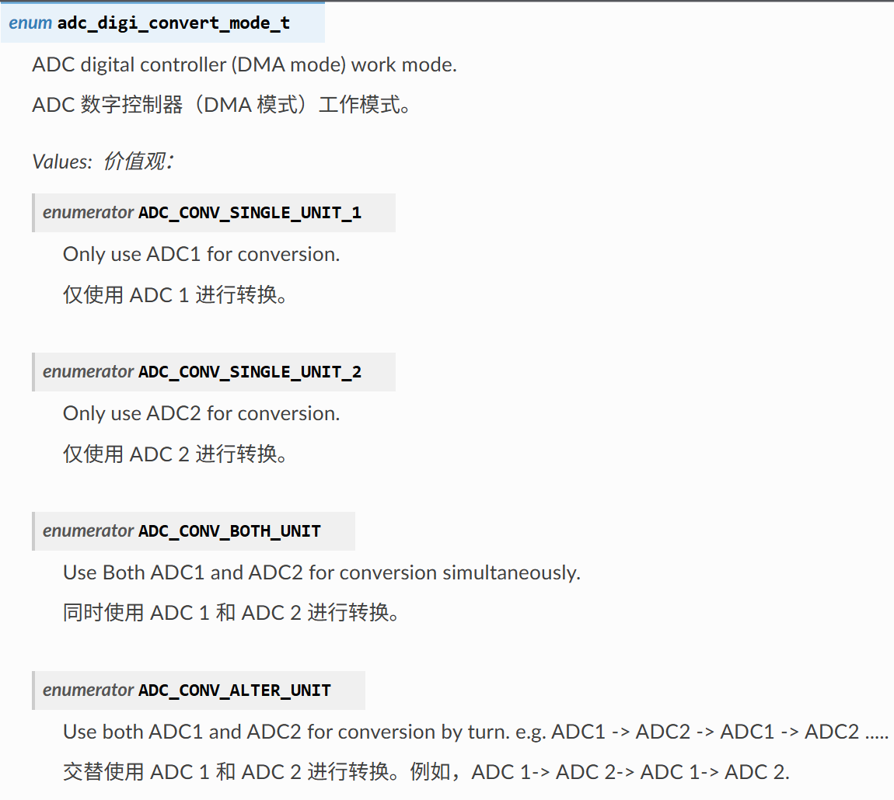
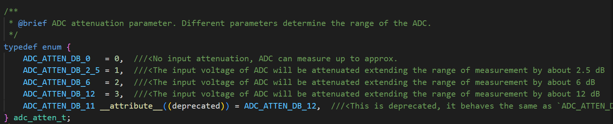

# ADC DMA 采用DMA的ADC持续检测

## 粗略阅读README文档

文档简介示例演示如何使用ADC连续读取模式（DMA模式）从GPIO引脚读取

配置、构建烧录和示例输出

## 代码分析

> 由于笔者也不进行某个引脚的特别实验，此处先进行代码分析如果特别需要再进行实际操作

### 头文件和宏定义

头文件中定义关于ADC连续读取的函数、结构体等。

宏定义中特别需要说明，本例采用宏定义的方式，把很多不变的数据读取和结构参数内化为本地使用

```c
// 头文件相比单次读取来说，连续读取模式只有这一个头文件
#include "esp_adc/adc_continuous.h"

#define EXAMPLE_ADC_UNIT                    ADC_UNIT_1
#define _EXAMPLE_ADC_UNIT_STR(unit)         #unit
#define EXAMPLE_ADC_UNIT_STR(unit)          _EXAMPLE_ADC_UNIT_STR(unit)
#define EXAMPLE_ADC_CONV_MODE               ADC_CONV_SINGLE_UNIT_1
#define EXAMPLE_ADC_ATTEN                   ADC_ATTEN_DB_0
#define EXAMPLE_ADC_BIT_WIDTH               SOC_ADC_DIGI_MAX_BITWIDTH

#if CONFIG_IDF_TARGET_ESP32 || CONFIG_IDF_TARGET_ESP32S2
#define EXAMPLE_ADC_OUTPUT_TYPE             ADC_DIGI_OUTPUT_FORMAT_TYPE1
#define EXAMPLE_ADC_GET_CHANNEL(p_data)     ((p_data)->type1.channel)
#define EXAMPLE_ADC_GET_DATA(p_data)        ((p_data)->type1.data)
#else
#define EXAMPLE_ADC_OUTPUT_TYPE             ADC_DIGI_OUTPUT_FORMAT_TYPE2
#define EXAMPLE_ADC_GET_CHANNEL(p_data)     ((p_data)->type2.channel)
#define EXAMPLE_ADC_GET_DATA(p_data)        ((p_data)->type2.data)
#endif

#define EXAMPLE_READ_LEN                    256

#if CONFIG_IDF_TARGET_ESP32
static adc_channel_t channel[2] = {ADC_CHANNEL_6, ADC_CHANNEL_7};
#else
static adc_channel_t channel[2] = {ADC_CHANNEL_2, ADC_CHANNEL_3};
#endif
```

### app_main函数

1. 初始化结果数组为`0xcc`
2. `xTaskGetCurrentTaskHandle`获取当前任务的句柄
3. `continuous_adc_init`自定义函数进行初始化
4. `adc_continuous_evt_cbs_t` 结构体绑定回调函数
   * `on_conv_done` 当一个转换帧完成时调用
   * `on_pool_ovf` 内部池已满时进行调用
5. `adc_continuous_register_event_callbacks` 连续模式回调函数注册
6. `adc_continuous_start` 开始连续检测
7. `ulTaskNotifyTake`等待任务通知到本任务(*即等待回调函数触发代表有数据获取*)
8. `EXAMPLE_ADC_UNIT_STR` 内部宏函数，将ADC单元编号转换为对应字符串表示（即把0/1转换为“ADC1”，“ADC2”，可能）
9. `adc_continuous_read` 函数获取ADC通道的转换结果。参数包括：ADC句柄，数组缓冲区，预期长度，返回的真实长度，等待时间
10. 返回正常先进行日志打印
11. 循环对每个字节进行处理 见[一个转换结果包含多个字节](https://docs.espressif.com/projects/esp-idf/zh_CN/stable/esp32/api-reference/peripherals/adc_continuous.html#id2)
12. 先把普通的32位类型数据转换成`adc_digi_output_data_t`结构体类型
13. `EXAMPLE_ADC_GET_CHANNEL` `EXAMPLE_ADC_GET_DATA` 宏定义获取通道和数据
14. `if` 判断通道号是否有效
15. 延时处理，根据注释，本例由于打印较慢而程序运行较快，放在在打印时启动下一次读取导致读取超时进行延时
16. 外部循环确保任务一直在ADC读取任务中，内部循环持续进行ADC读取，直到读取超时代表暂时没有可用数据，直到下一个信号
17. 任务结束停止读取并反初始化释放资源
 
```c
void app_main(void)
{
    esp_err_t ret;
    uint32_t ret_num = 0;
    uint8_t result[EXAMPLE_READ_LEN] = {0};
    memset(result, 0xcc, EXAMPLE_READ_LEN);

    s_task_handle = xTaskGetCurrentTaskHandle();

    adc_continuous_handle_t handle = NULL;
    continuous_adc_init(channel, sizeof(channel) / sizeof(adc_channel_t), &handle);

    adc_continuous_evt_cbs_t cbs = {
        .on_conv_done = s_conv_done_cb,
    };
    ESP_ERROR_CHECK(adc_continuous_register_event_callbacks(handle, &cbs, NULL));
    ESP_ERROR_CHECK(adc_continuous_start(handle));

    while (1) {

        /**
         * This is to show you the way to use the ADC continuous mode driver event callback.
         * This `ulTaskNotifyTake` will block when the data processing in the task is fast.
         * However in this example, the data processing (print) is slow, so you barely block here.
         *
         * Without using this event callback (to notify this task), you can still just call
         * `adc_continuous_read()` here in a loop, with/without a certain block timeout.
         */
        ulTaskNotifyTake(pdTRUE, portMAX_DELAY);

        char unit[] = EXAMPLE_ADC_UNIT_STR(EXAMPLE_ADC_UNIT);

        while (1) {
            ret = adc_continuous_read(handle, result, EXAMPLE_READ_LEN, &ret_num, 0);
            if (ret == ESP_OK) {
                ESP_LOGI("TASK", "ret is %x, ret_num is %"PRIu32" bytes", ret, ret_num);
                for (int i = 0; i < ret_num; i += SOC_ADC_DIGI_RESULT_BYTES) {
                    adc_digi_output_data_t *p = (adc_digi_output_data_t*)&result[i];
                    uint32_t chan_num = EXAMPLE_ADC_GET_CHANNEL(p);
                    uint32_t data = EXAMPLE_ADC_GET_DATA(p);
                    /* Check the channel number validation, the data is invalid if the channel num exceed the maximum channel */
                    if (chan_num < SOC_ADC_CHANNEL_NUM(EXAMPLE_ADC_UNIT)) {
                        ESP_LOGI(TAG, "Unit: %s, Channel: %"PRIu32", Value: %"PRIx32, unit, chan_num, data);
                    } else {
                        ESP_LOGW(TAG, "Invalid data [%s_%"PRIu32"_%"PRIx32"]", unit, chan_num, data);
                    }
                }
                /**
                 * Because printing is slow, so every time you call `ulTaskNotifyTake`, it will immediately return.
                 * To avoid a task watchdog timeout, add a delay here. When you replace the way you process the data,
                 * usually you don't need this delay (as this task will block for a while).
                 */
                vTaskDelay(1);
            } else if (ret == ESP_ERR_TIMEOUT) {
                //We try to read `EXAMPLE_READ_LEN` until API returns timeout, which means there's no available data
                break;
            }
        }
    }

    ESP_ERROR_CHECK(adc_continuous_stop(handle));
    ESP_ERROR_CHECK(adc_continuous_deinit(handle));
}
```

### 初始化函数和回调函数

回调函数非常简单，`IRAM_ATTR`标志储存在中断区中，内部只进行给予事件通知，**尽可能减少中断中的处理和资源占用**

```c
static bool IRAM_ATTR s_conv_done_cb(adc_continuous_handle_t handle, const adc_continuous_evt_data_t *edata, void *user_data)
{
    BaseType_t mustYield = pdFALSE;
    //Notify that ADC continuous driver has done enough number of conversions
    vTaskNotifyGiveFromISR(s_task_handle, &mustYield);

    return (mustYield == pdTRUE);
}
```

1. `adc_continuous_handle_cfg_t` 结构体进行连续转换模式驱动配置
   * `max_store_buf_size` 以字节为单位设置最大缓冲池大小
   * `conv_frame_size` 以字节为单位设置ADC帧转换大小
   * `flags.flush_pool` 决定缓冲池满时清空旧数据再写入
2. `adc_continuous_new_handle`函数创建新的驱动并返回句柄
3. `adc_continuous_config_t` 配置ADC IO
   * `sample_freq_hz`期望ADC采样频率
   * `conv_mode` 连续转换模式 
   * `format` 输出数据格式，具体见[官方编程指南](https://docs.espressif.com/projects/esp-idf/zh_CN/stable/esp32/api-reference/peripherals/adc_oneshot.html#_CPPv422adc_digi_output_data_t)本例中在宏定义中引入示例格式
   * `pattern_num` 要使用的ADC通道数量
   * `adc_pattern` 每个要使用的ADC配置列表，在下循环中配置，在配置完后进行绑定
4. 配置`adc_digi_pattern_config_t`，为多个通道循环配置
   * `atten` ADC衰减，即调整电压衰减并提高测量范围 
   * `channel` IO对应的ADC通道
   * `unit` IO所属的ADC单元
   * `bit_width`原始转换结果的位宽
5. `adc_continuous_config` 写入配置，绑定句柄

```c
static void continuous_adc_init(adc_channel_t *channel, uint8_t channel_num, adc_continuous_handle_t *out_handle)
{
    adc_continuous_handle_t handle = NULL;

    adc_continuous_handle_cfg_t adc_config = {
        .max_store_buf_size = 1024,
        .conv_frame_size = EXAMPLE_READ_LEN,
    };
    ESP_ERROR_CHECK(adc_continuous_new_handle(&adc_config, &handle));

    adc_continuous_config_t dig_cfg = {
        .sample_freq_hz = 20 * 1000,
        .conv_mode = EXAMPLE_ADC_CONV_MODE,
        .format = EXAMPLE_ADC_OUTPUT_TYPE,
    };

    adc_digi_pattern_config_t adc_pattern[SOC_ADC_PATT_LEN_MAX] = {0};
    dig_cfg.pattern_num = channel_num;
    for (int i = 0; i < channel_num; i++) {
        adc_pattern[i].atten = EXAMPLE_ADC_ATTEN;
        adc_pattern[i].channel = channel[i] & 0x7;
        adc_pattern[i].unit = EXAMPLE_ADC_UNIT;
        adc_pattern[i].bit_width = EXAMPLE_ADC_BIT_WIDTH;

        ESP_LOGI(TAG, "adc_pattern[%d].atten is :%"PRIx8, i, adc_pattern[i].atten);
        ESP_LOGI(TAG, "adc_pattern[%d].channel is :%"PRIx8, i, adc_pattern[i].channel);
        ESP_LOGI(TAG, "adc_pattern[%d].unit is :%"PRIx8, i, adc_pattern[i].unit);
    }
    dig_cfg.adc_pattern = adc_pattern;
    ESP_ERROR_CHECK(adc_continuous_config(handle, &dig_cfg));

    *out_handle = handle;
}
```

## 总结

连续ADC采样模式的使用比单次采样更加简单，只需要按照示例进行配置即可，需要注意的是可能使用时最需要关注的是采样频率，数据，通道等配置，但其他相关配置还是需要有所了解，知道ADC能用来做什么。同时本例没有校准，猜测是因为采样频率太高校准不过来，或者可以直接采用平均的方式进行，就不做配置，具体可以在自己使用的时候尝试。（写到这发现好像该模组自带DMA传输，不用自行配置，其他外设也是，只要配置项启用就行）