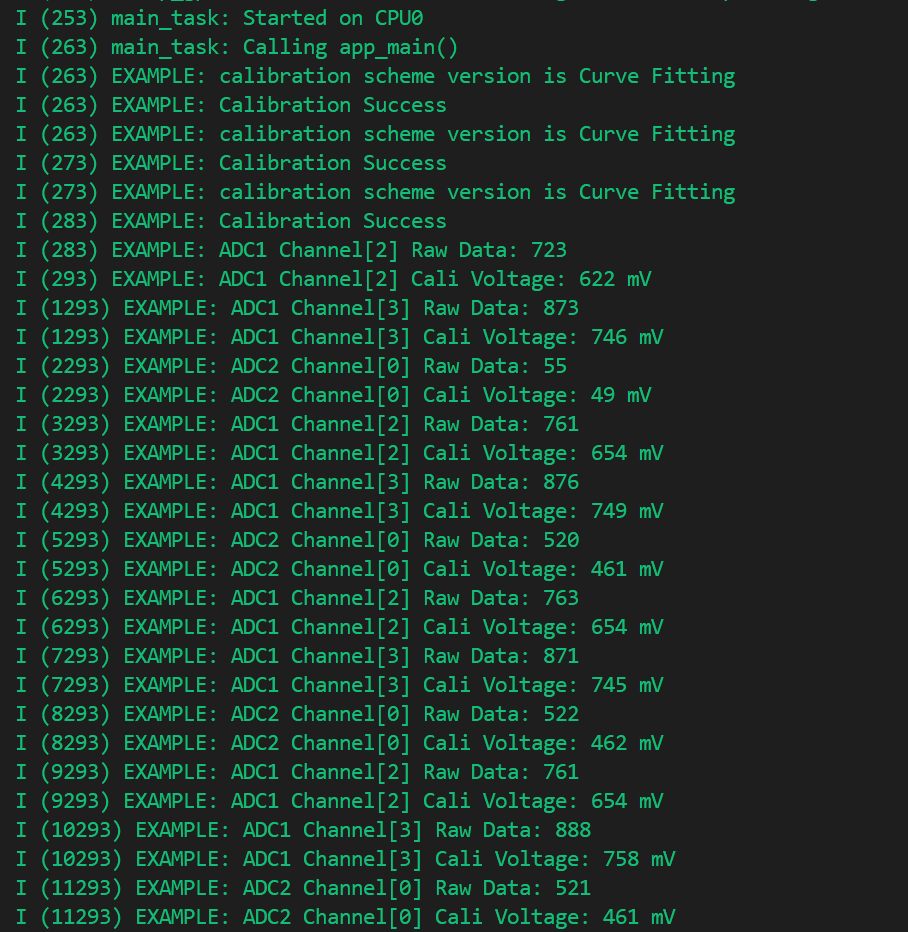
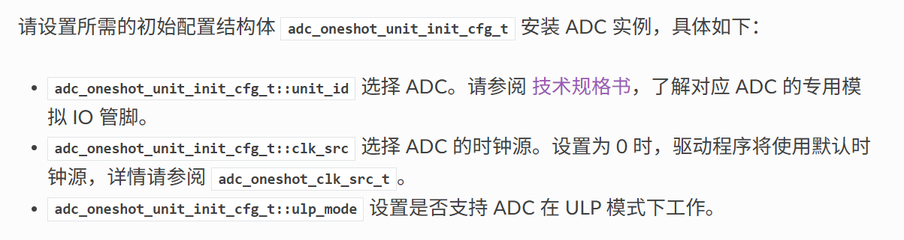
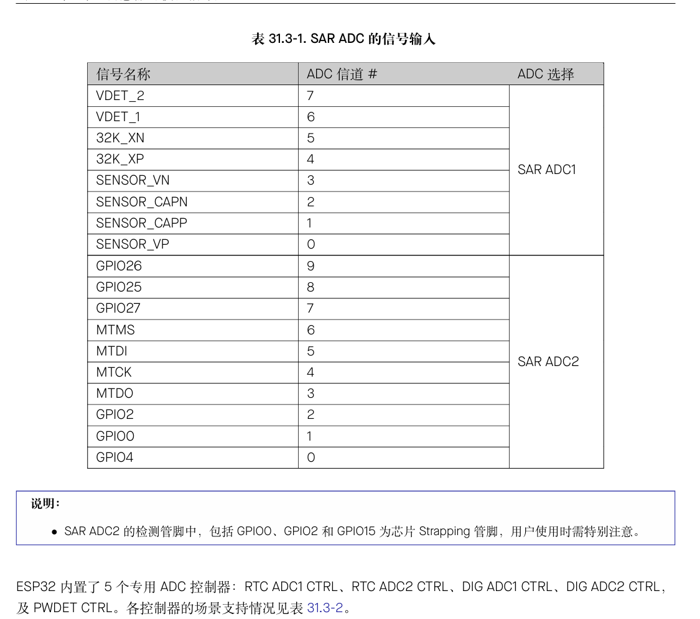

# ADC Single Read ADC单次读取

## 粗略阅读READ文件

文档简介示例演示如何使用oneshot ADC模式驱动器从GPIO引脚获取ADC读数，并演示如何使用ADC校准功能获取精准校准结果（mv）

如何使用，示例输出

## 构建、烧录和监视

* 选择芯片型号
* 选择端口号
* 选择烧录方式
* 点击**构建、烧录和监视**
  
  窗口输出了各ADC通道的原始数据（raw data）和校准电压（cali voltage）

## 代码分析

### 头文件和宏定义

头文件的具体作用见注释

宏定义中把库内部定义引入程序代码根据不用型号进行不同定义

```c
#include <stdio.h>
#include <stdlib.h>
#include <string.h>
#include "freertos/FreeRTOS.h"
#include "freertos/task.h"
#include "soc/soc_caps.h" //Soc能力定义，包含ADC相关硬件限制，如通道，分辨率位数等
#include "esp_log.h"
#include "esp_adc/adc_oneshot.h" //单次读取模式核心API，提供接口和定义结构体
#include "esp_adc/adc_cali.h"   //ADC校准通用接口
#include "esp_adc/adc_cali_scheme.h"    //ADC校准的算法实现，定义不同的校准方案

const static char *TAG = "EXAMPLE";

/*---------------------------------------------------------------
        ADC General Macros
---------------------------------------------------------------*/
//ADC1 Channels
#if CONFIG_IDF_TARGET_ESP32
#define EXAMPLE_ADC1_CHAN0          ADC_CHANNEL_4
#define EXAMPLE_ADC1_CHAN1          ADC_CHANNEL_5
#else
#define EXAMPLE_ADC1_CHAN0          ADC_CHANNEL_2
#define EXAMPLE_ADC1_CHAN1          ADC_CHANNEL_3
#endif

#if (SOC_ADC_PERIPH_NUM >= 2) && !CONFIG_IDF_TARGET_ESP32C3
/**
 * On ESP32C3, ADC2 is no longer supported, due to its HW limitation.
 * Search for errata on espressif website for more details.
 */
#define EXAMPLE_USE_ADC2            1
#endif

#if EXAMPLE_USE_ADC2
//ADC2 Channels
#if CONFIG_IDF_TARGET_ESP32
#define EXAMPLE_ADC2_CHAN0          ADC_CHANNEL_0
#else
#define EXAMPLE_ADC2_CHAN0          ADC_CHANNEL_0
#endif
#endif  //#if EXAMPLE_USE_ADC2

#define EXAMPLE_ADC_ATTEN           ADC_ATTEN_DB_12
```

### app_main函数

[单次转换驱动模式](https://docs.espressif.com/projects/esp-idf/zh_CN/stable/esp32/api-reference/peripherals/adc_oneshot.html#adc)

1. `adc_oneshot_unit_handle_t` ADC实例变量
2. `adc_oneshot_unit_init_cfg_t` 结构体变量
   * `unit_id` 选择ADC *ESP32 内置了2个12位的SARADC，由5个专用转换器控制器管理，可测量来自18个管脚的模拟信号*
    
3. `adc_oneshot_new_unit` 写入配置，分配成功返回句柄
4. `adc_oneshot_chan_cfg_t` 配置ADC IO
   * `atten` ADC衰减
   * `bitwidth` 原始转换结果的位宽
5. `adc_oneshot_config_channel` 传入ADC实例、设置通道（多次调用配置不同通道）
6. `adc_cali_handle_t` ADC校准句柄 [校准方案](https://docs.espressif.com/projects/esp-idf/zh_CN/stable/esp32/api-reference/peripherals/adc_calibration.html#adc-calibration-scheme-creation)
7. `example_adc_calibration_init` 自定义函数进行校准初始化
8. 如果设置ADC2，则进行更多的初始化
9. 主循环操作，`adc_oneshot_read` 获取通道原始转换结果 `adc_cali_raw_to_voltage` 讲原始结果转换为校准结果，以mv为单位
10. 循环中进行两个通道的数据采集和日志打印
11. 如果启用ADC2，再进行一次ADC2的操作
12. `adc_oneshot_del_unit` 回收ADC实例，相关硬件和软件资源也会回收
13. `example_adc_calibration_deinit` 自定义函数的反初始化

```c
void app_main(void)
{
    //-------------ADC1 Init---------------//
    adc_oneshot_unit_handle_t adc1_handle;
    adc_oneshot_unit_init_cfg_t init_config1 = {
        .unit_id = ADC_UNIT_1,
    };
    ESP_ERROR_CHECK(adc_oneshot_new_unit(&init_config1, &adc1_handle));

    //-------------ADC1 Config---------------//
    adc_oneshot_chan_cfg_t config = {
        .atten = EXAMPLE_ADC_ATTEN,
        .bitwidth = ADC_BITWIDTH_DEFAULT,
    };
    ESP_ERROR_CHECK(adc_oneshot_config_channel(adc1_handle, EXAMPLE_ADC1_CHAN0, &config));
    ESP_ERROR_CHECK(adc_oneshot_config_channel(adc1_handle, EXAMPLE_ADC1_CHAN1, &config));

    //-------------ADC1 Calibration Init---------------//
    adc_cali_handle_t adc1_cali_chan0_handle = NULL;
    adc_cali_handle_t adc1_cali_chan1_handle = NULL;
    bool do_calibration1_chan0 = example_adc_calibration_init(ADC_UNIT_1, EXAMPLE_ADC1_CHAN0, EXAMPLE_ADC_ATTEN, &adc1_cali_chan0_handle);
    bool do_calibration1_chan1 = example_adc_calibration_init(ADC_UNIT_1, EXAMPLE_ADC1_CHAN1, EXAMPLE_ADC_ATTEN, &adc1_cali_chan1_handle);

#if EXAMPLE_USE_ADC2
    //-------------ADC2 Init---------------//
    adc_oneshot_unit_handle_t adc2_handle;
    adc_oneshot_unit_init_cfg_t init_config2 = {
        .unit_id = ADC_UNIT_2,
        .ulp_mode = ADC_ULP_MODE_DISABLE,
    };
    ESP_ERROR_CHECK(adc_oneshot_new_unit(&init_config2, &adc2_handle));

    //-------------ADC2 Calibration Init---------------//
    adc_cali_handle_t adc2_cali_handle = NULL;
    bool do_calibration2 = example_adc_calibration_init(ADC_UNIT_2, EXAMPLE_ADC2_CHAN0, EXAMPLE_ADC_ATTEN, &adc2_cali_handle);

    //-------------ADC2 Config---------------//
    ESP_ERROR_CHECK(adc_oneshot_config_channel(adc2_handle, EXAMPLE_ADC2_CHAN0, &config));
#endif  //#if EXAMPLE_USE_ADC2

    while (1) {
        ESP_ERROR_CHECK(adc_oneshot_read(adc1_handle, EXAMPLE_ADC1_CHAN0, &adc_raw[0][0]));
        ESP_LOGI(TAG, "ADC%d Channel[%d] Raw Data: %d", ADC_UNIT_1 + 1, EXAMPLE_ADC1_CHAN0, adc_raw[0][0]);
        if (do_calibration1_chan0) {
            ESP_ERROR_CHECK(adc_cali_raw_to_voltage(adc1_cali_chan0_handle, adc_raw[0][0], &voltage[0][0]));
            ESP_LOGI(TAG, "ADC%d Channel[%d] Cali Voltage: %d mV", ADC_UNIT_1 + 1, EXAMPLE_ADC1_CHAN0, voltage[0][0]);
        }
        vTaskDelay(pdMS_TO_TICKS(1000));

        ESP_ERROR_CHECK(adc_oneshot_read(adc1_handle, EXAMPLE_ADC1_CHAN1, &adc_raw[0][1]));
        ESP_LOGI(TAG, "ADC%d Channel[%d] Raw Data: %d", ADC_UNIT_1 + 1, EXAMPLE_ADC1_CHAN1, adc_raw[0][1]);
        if (do_calibration1_chan1) {
            ESP_ERROR_CHECK(adc_cali_raw_to_voltage(adc1_cali_chan1_handle, adc_raw[0][1], &voltage[0][1]));
            ESP_LOGI(TAG, "ADC%d Channel[%d] Cali Voltage: %d mV", ADC_UNIT_1 + 1, EXAMPLE_ADC1_CHAN1, voltage[0][1]);
        }
        vTaskDelay(pdMS_TO_TICKS(1000));

#if EXAMPLE_USE_ADC2
        ESP_ERROR_CHECK(adc_oneshot_read(adc2_handle, EXAMPLE_ADC2_CHAN0, &adc_raw[1][0]));
        ESP_LOGI(TAG, "ADC%d Channel[%d] Raw Data: %d", ADC_UNIT_2 + 1, EXAMPLE_ADC2_CHAN0, adc_raw[1][0]);
        if (do_calibration2) {
            ESP_ERROR_CHECK(adc_cali_raw_to_voltage(adc2_cali_handle, adc_raw[1][0], &voltage[1][0]));
            ESP_LOGI(TAG, "ADC%d Channel[%d] Cali Voltage: %d mV", ADC_UNIT_2 + 1, EXAMPLE_ADC2_CHAN0, voltage[1][0]);
        }
        vTaskDelay(pdMS_TO_TICKS(1000));
#endif  //#if EXAMPLE_USE_ADC2
    }

    //Tear Down
    ESP_ERROR_CHECK(adc_oneshot_del_unit(adc1_handle));
    if (do_calibration1_chan0) {
        example_adc_calibration_deinit(adc1_cali_chan0_handle);
    }
    if (do_calibration1_chan1) {
        example_adc_calibration_deinit(adc1_cali_chan1_handle);
    }

#if EXAMPLE_USE_ADC2
    ESP_ERROR_CHECK(adc_oneshot_del_unit(adc2_handle));
    if (do_calibration2) {
        example_adc_calibration_deinit(adc2_cali_handle);
    }
#endif //#if EXAMPLE_USE_ADC2
}
```

特别的，例程定义了两个二维数组，可以存放ADC1和2中所有数据

```c
static int adc_raw[2][10];
static int voltage[2][10];
```

### ADC校准函数

1. 变量创建不作赘述
2. `#if`判断采用`ADC_CALI_SCHEME_CURVE_FITTING_SUPPORTED`曲线拟合校准 或者 `ADC_CALI_SCHEME_LINE_FITTING_SUPPORTED`线性拟合校准
3. `adc_cali_curve_fitting_config_t`曲线校准配置
   * `unit_id`ADC IO绑定
   * `chan` 通道绑定 （曲线校准更加精确，对每个通道有独立的误差模型，而线性校准假设所有通道可以用同样的线性方程修正）
   * `atten` ADC原始结果衰减程度
   * `bitwidth` ADC原始结构位宽
4. `adc_cali_create_scheme_curve_fitting` 创建曲线拟合标准方案并返回句柄
5. 线性校准配置基本相同，只是不需要进行通道配置
6. 传出结果，日志打印

```c
static bool example_adc_calibration_init(adc_unit_t unit, adc_channel_t channel, adc_atten_t atten, adc_cali_handle_t *out_handle)
{
    adc_cali_handle_t handle = NULL;
    esp_err_t ret = ESP_FAIL;
    bool calibrated = false;

#if ADC_CALI_SCHEME_CURVE_FITTING_SUPPORTED
    if (!calibrated) {
        ESP_LOGI(TAG, "calibration scheme version is %s", "Curve Fitting");
        adc_cali_curve_fitting_config_t cali_config = {
            .unit_id = unit,
            .chan = channel,
            .atten = atten,
            .bitwidth = ADC_BITWIDTH_DEFAULT,
        };
        ret = adc_cali_create_scheme_curve_fitting(&cali_config, &handle);
        if (ret == ESP_OK) {
            calibrated = true;
        }
    }
#endif

#if ADC_CALI_SCHEME_LINE_FITTING_SUPPORTED
    if (!calibrated) {
        ESP_LOGI(TAG, "calibration scheme version is %s", "Line Fitting");
        adc_cali_line_fitting_config_t cali_config = {
            .unit_id = unit,
            .atten = atten,
            .bitwidth = ADC_BITWIDTH_DEFAULT,
        };
        ret = adc_cali_create_scheme_line_fitting(&cali_config, &handle);
        if (ret == ESP_OK) {
            calibrated = true;
        }
    }
#endif

    *out_handle = handle;
    if (ret == ESP_OK) {
        ESP_LOGI(TAG, "Calibration Success");
    } else if (ret == ESP_ERR_NOT_SUPPORTED || !calibrated) {
        ESP_LOGW(TAG, "eFuse not burnt, skip software calibration");
    } else {
        ESP_LOGE(TAG, "Invalid arg or no memory");
    }

    return calibrated;
}
```

反初始化就是调用`adc_cali_delete_scheme_curve_fitting` 和 `adc_cali_delete_scheme_line_fitting` 进行删除

```c
static void example_adc_calibration_deinit(adc_cali_handle_t handle)
{
#if ADC_CALI_SCHEME_CURVE_FITTING_SUPPORTED
    ESP_LOGI(TAG, "deregister %s calibration scheme", "Curve Fitting");
    ESP_ERROR_CHECK(adc_cali_delete_scheme_curve_fitting(handle));

#elif ADC_CALI_SCHEME_LINE_FITTING_SUPPORTED
    ESP_LOGI(TAG, "deregister %s calibration scheme", "Line Fitting");
    ESP_ERROR_CHECK(adc_cali_delete_scheme_line_fitting(handle));
#endif
}
```

## 总结

本例程进行了ADC单次读取的示例尝试，API封装后已经非常方便，甚至校准也有专门的功能函数，直接使用即可。总体就是配置参数，然后使用，非常方便。