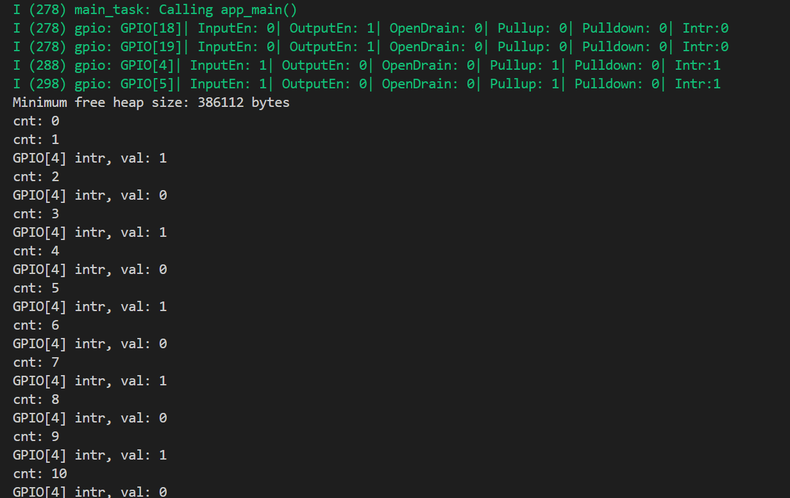
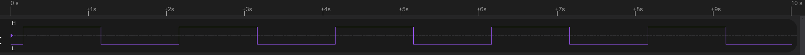
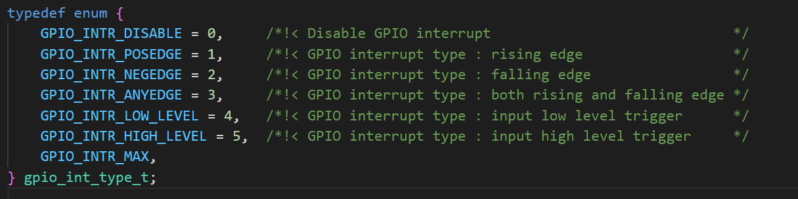
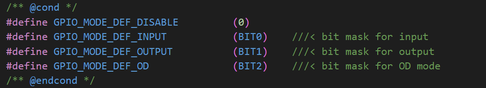

# generic GPIO 通用GPIO

## 粗略阅读README文件

文档简介示例演示如何配置GPIO和通过中断使用GPIO

介绍示例采用一个GPIO输出到另一GPIO触发中断，同时介绍配置引脚

介绍注意事项，构建烧录和示例输出

## 构建烧录和监视

* 选择芯片型号
* 选择端口号
* 配置项目
* 根据配置连接引脚（笔者这是18连4，另一组不做）
* 点击 **构建、烧录和监视**

可以看到，监视输出首先说明了 `gpio` 的引脚配置, **GPIO18** 、**GPIO19**是输出，**GPIO4**、**GPIO5**是输入，输入开启了**内部上拉**，开启了**中断**
下方是输出窗口，`cnt` 进行计数，`val` 代表输出GPIO的电平
* 逻辑分析仪显示

**GPIO18**的输出如上，可以看到电平以2秒的周期在跳变

## 代码分析

### 头文件和宏定义

> stdio.h：提供标准输入输出函数（如printf、scanf），用于调试或日志打印。
> string.h：内存操作和字符串处理（如memcpy、strlen）。
> stdlib.h：通用工具函数（如malloc、free、atoi）。
> inttypes.h：定义跨平台的整数类型（如uint32_t、PRIu32），确保可移植性。
> driver/gpio.h: esp-idf提供的gpio库文件
> freertos的头文件不做说明

宏定义中，通过对`GPIO_INPUT_PIN_SEL`进行操作，最终得到一串由01组成的数据 `0000000000000000000011000000000000000000` 和 `0000000000000000000000000000000000110000` 数据中的每一位代表一个端口，0代表不启用，1代表启用。分别定义在 **GPIO_OUTPUT_PIN_SEL** 和 **GPIO_INPUT_PIN_SEL**两个宏中

```c
#include <stdio.h>
#include <string.h>
#include <stdlib.h>
#include <inttypes.h>
#include "freertos/FreeRTOS.h"
#include "freertos/task.h"
#include "freertos/queue.h"
#include "driver/gpio.h"

/**
 * Brief:
 * This test code shows how to configure gpio and how to use gpio interrupt.
 *
 * GPIO status:
 * GPIO18: output (ESP32C2/ESP32H2 uses GPIO8 as the second output pin)
 * GPIO19: output (ESP32C2/ESP32H2 uses GPIO9 as the second output pin)
 * GPIO4:  input, pulled up, interrupt from rising edge and falling edge
 * GPIO5:  input, pulled up, interrupt from rising edge.
 *
 * Note. These are the default GPIO pins to be used in the example. You can
 * change IO pins in menuconfig.
 *
 * Test:
 * Connect GPIO18(8) with GPIO4
 * Connect GPIO19(9) with GPIO5
 * Generate pulses on GPIO18(8)/19(9), that triggers interrupt on GPIO4/5
 *
 */

#define GPIO_OUTPUT_IO_0    CONFIG_GPIO_OUTPUT_0
#define GPIO_OUTPUT_IO_1    CONFIG_GPIO_OUTPUT_1
#define GPIO_OUTPUT_PIN_SEL  ((1ULL<<GPIO_OUTPUT_IO_0) | (1ULL<<GPIO_OUTPUT_IO_1))
/*
 * Let's say, GPIO_OUTPUT_IO_0=18, GPIO_OUTPUT_IO_1=19
 * In binary representation,
 * 1ULL<<GPIO_OUTPUT_IO_0 is equal to 0000000000000000000001000000000000000000 and
 * 1ULL<<GPIO_OUTPUT_IO_1 is equal to 0000000000000000000010000000000000000000
 * GPIO_OUTPUT_PIN_SEL                0000000000000000000011000000000000000000
 * */
#define GPIO_INPUT_IO_0     CONFIG_GPIO_INPUT_0
#define GPIO_INPUT_IO_1     CONFIG_GPIO_INPUT_1
#define GPIO_INPUT_PIN_SEL  ((1ULL<<GPIO_INPUT_IO_0) | (1ULL<<GPIO_INPUT_IO_1))
/*
 * Let's say, GPIO_INPUT_IO_0=4, GPIO_INPUT_IO_1=5
 * In binary representation,
 * 1ULL<<GPIO_INPUT_IO_0 is equal to 0000000000000000000000000000000000010000 and
 * 1ULL<<GPIO_INPUT_IO_1 is equal to 0000000000000000000000000000000000100000
 * GPIO_INPUT_PIN_SEL                0000000000000000000000000000000000110000
 * */
#define ESP_INTR_FLAG_DEFAULT 0
```

### app_main()函数

1. 首先进行gpio配置的定义(*对于输入输出分别配置,且不作为全局变量*)：

   * [GPIO配置API 官方编程指南](https://docs.espressif.com/projects/esp-idf/zh_CN/stable/esp32/api-reference/peripherals/gpio.html#_CPPv411gpio_configPK13gpio_config_t)
   * `gpio_config_t io_conf = {};` 定义配置结构体的变量
   * `intr_type` 配置为**不启用/上升沿**
   
   * `mode` 配置为 **OUTPUT/INPUT**
   
   * `pin_bit_mask` 通过前面宏定义的01数据串**配置目标引脚**
   * `pull_down_en` 和 `pull_up_en` 分别代表启用**下拉/上拉**
   * `gpio_config(配置结构体变量)` **写入和启用配置**

2. 演示单独中断配置 `gpio_set_intr_type(GPIO_INPUT_IO_0, GPIO_INTR_ANYEDGE);` 修改前面设置 `IO0` 的中断配置为**任意边沿**，即上升下降沿都触发中断。
3. 创建freertos队列。`xQueueCreate(10, sizeof(uint32_t))` 创建内部数据大小为 `uint32_t` 的10数据队列
4. 创建freertos任务。`xTaskCreate(gpio_task_example, "gpio_task_example", 2048, NULL, 10, NULL)` 任务函数为`gpio_task_example`，任务名为**gpio_task_example**，分配内存为**2048**，优先级为**10**(*越大优先级越高*)，无传入参数，无对应句柄，此函数无指定核。
5. 注册中断：
   * [GPIO中断API](https://docs.espressif.com/projects/esp-idf/zh_CN/stable/esp32/api-reference/peripherals/gpio.html#_CPPv411gpio_configPK13gpio_config_t)
   * `gpio_install_isr_service(ESP_INTR_FLAG_DEFAULT)` 该服务允许每个引脚单独的中断函数
   * `gpio_isr_handler_add`为相应的引脚添加服务程序(*需要在前服务函数注册后使用*)
   * 演示删除相应服务程序
6. 输出提示
7. 主循环：
   * 延时**1000ms**，即1s。`vTaskDelay` 通过 **(1000/portTICK_PERIOD_MS)** 操作转换成对应tick值
   * 将两输出引脚设置电平进行变化，由于是`%2`所以结果为 **0** 或 **1** 。电平进行高低跳变

```c
void app_main(void)
{
    //zero-initialize the config structure.
    gpio_config_t io_conf = {};
    //disable interrupt
    io_conf.intr_type = GPIO_INTR_DISABLE;
    //set as output mode
    io_conf.mode = GPIO_MODE_OUTPUT;
    //bit mask of the pins that you want to set,e.g.GPIO18/19
    io_conf.pin_bit_mask = GPIO_OUTPUT_PIN_SEL;
    //disable pull-down mode
    io_conf.pull_down_en = 0;
    //disable pull-up mode
    io_conf.pull_up_en = 0;
    //configure GPIO with the given settings
    gpio_config(&io_conf);

    //interrupt of rising edge
    io_conf.intr_type = GPIO_INTR_POSEDGE;
    //bit mask of the pins, use GPIO4/5 here
    io_conf.pin_bit_mask = GPIO_INPUT_PIN_SEL;
    //set as input mode
    io_conf.mode = GPIO_MODE_INPUT;
    //enable pull-up mode
    io_conf.pull_up_en = 1;
    gpio_config(&io_conf);

    //change gpio interrupt type for one pin
    gpio_set_intr_type(GPIO_INPUT_IO_0, GPIO_INTR_ANYEDGE);

    //create a queue to handle gpio event from isr
    gpio_evt_queue = xQueueCreate(10, sizeof(uint32_t));
    //start gpio task
    xTaskCreate(gpio_task_example, "gpio_task_example", 2048, NULL, 10, NULL);

    //install gpio isr service
    gpio_install_isr_service(ESP_INTR_FLAG_DEFAULT);
    //hook isr handler for specific gpio pin
    gpio_isr_handler_add(GPIO_INPUT_IO_0, gpio_isr_handler, (void*) GPIO_INPUT_IO_0);
    //hook isr handler for specific gpio pin
    gpio_isr_handler_add(GPIO_INPUT_IO_1, gpio_isr_handler, (void*) GPIO_INPUT_IO_1);

    //remove isr handler for gpio number.
    gpio_isr_handler_remove(GPIO_INPUT_IO_0);
    //hook isr handler for specific gpio pin again
    gpio_isr_handler_add(GPIO_INPUT_IO_0, gpio_isr_handler, (void*) GPIO_INPUT_IO_0);

    printf("Minimum free heap size: %"PRIu32" bytes\n", esp_get_minimum_free_heap_size());

    int cnt = 0;
    while (1) {
        printf("cnt: %d\n", cnt++);
        vTaskDelay(1000 / portTICK_PERIOD_MS);
        gpio_set_level(GPIO_OUTPUT_IO_0, cnt % 2);
        gpio_set_level(GPIO_OUTPUT_IO_1, cnt % 2);
    }
}
```

### 任务函数

中断函数加特殊标识`TRAM_ATTR`，然后才能在中断中正常使用。函数中往队列内写入触发中断的函数编号。
GPIO任务函数在无限循环，大部分时间处于休眠状态，当接发现队列有数据后(*即外部中断触发，中断函数写入*)接收数据并打印输出

```c
static QueueHandle_t gpio_evt_queue = NULL;

static void IRAM_ATTR gpio_isr_handler(void* arg)
{
    uint32_t gpio_num = (uint32_t) arg;
    xQueueSendFromISR(gpio_evt_queue, &gpio_num, NULL);
}

static void gpio_task_example(void* arg)
{
    uint32_t io_num;
    for (;;) {
        if (xQueueReceive(gpio_evt_queue, &io_num, portMAX_DELAY)) {
            printf("GPIO[%"PRIu32"] intr, val: %d\n", io_num, gpio_get_level(io_num));
        }
    }
}
```

## 总结

对于esp-idf的GPIO外设，进行了逐行逐代码分析，感觉外设**基本思路与其他单片机基本相同**，都是配置和使用。但esp中加入了**freertos的队列数据传递**，还有**isr_srevice的服务配置** 不用在中断中去判断谁触发的中断再进行操作，更方便。同时rtos系统让系统更有同步性和响应的感觉，而不是原先的死等待和判断。
