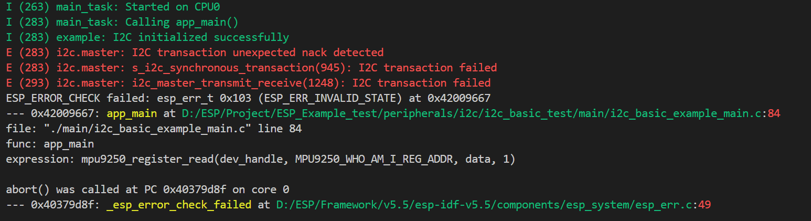
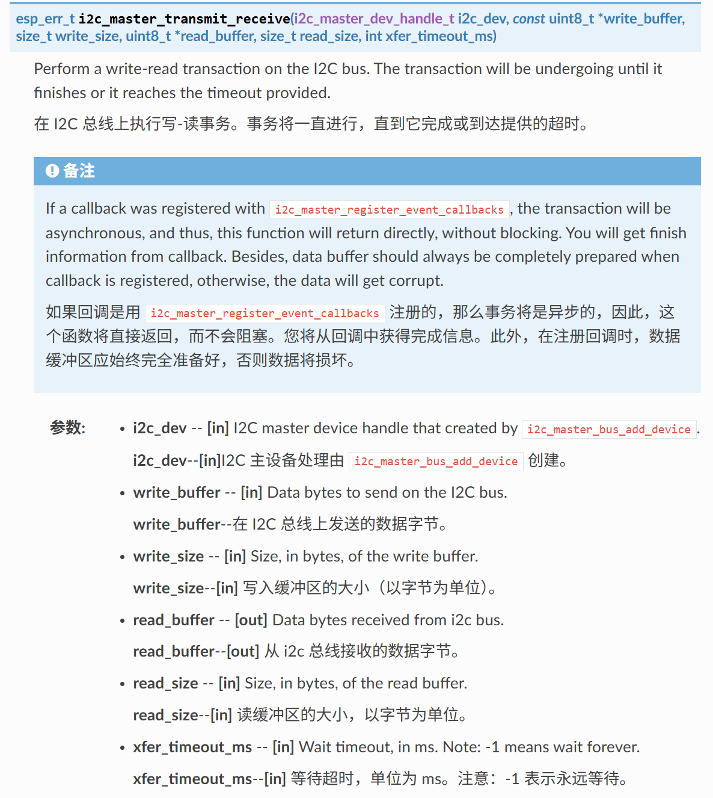

# Basic I2C Master 基本I2C主机

## 文档简介

文档简介示例演示I2C驱动程序的基本用法

硬件需要和硬件连接

构建烧录和示例输出

## 构建烧录和监视

* 选择目标芯片
* 选择端口号
* 配置项目
* 点击**构建、烧录和监视**
* 监视窗口


## 分析代码

### 宏定义

本例没有单独定义结构体，宏定义用于I2C配置

```c
#define I2C_MASTER_SCL_IO           CONFIG_I2C_MASTER_SCL       /*!< GPIO number used for I2C master clock */
#define I2C_MASTER_SDA_IO           CONFIG_I2C_MASTER_SDA       /*!< GPIO number used for I2C master data  */
#define I2C_MASTER_NUM              I2C_NUM_0                   /*!< I2C port number for master dev */
#define I2C_MASTER_FREQ_HZ          CONFIG_I2C_MASTER_FREQUENCY /*!< I2C master clock frequency */
#define I2C_MASTER_TX_BUF_DISABLE   0                           /*!< I2C master doesn't need buffer */
#define I2C_MASTER_RX_BUF_DISABLE   0                           /*!< I2C master doesn't need buffer */
#define I2C_MASTER_TIMEOUT_MS       1000

#define MPU9250_SENSOR_ADDR         0x68        /*!< Address of the MPU9250 sensor */
#define MPU9250_WHO_AM_I_REG_ADDR   0x75        /*!< Register addresses of the "who am I" register */
#define MPU9250_PWR_MGMT_1_REG_ADDR 0x6B        /*!< Register addresses of the power management register */
#define MPU9250_RESET_BIT           7
```

### app_main函数

1. `i2c_master_bus_handle_t` 表示I2C主机总线句柄 `i2c_master_dev_handle_t` 表示I2C主总线设备句柄
2. `i2c_master_init` 自定义函数进行I2C初始化
3. `mpu9250_register_read` 、 `mpu9250_register_write_byte` 自定义函数，用于和mpu9250进行通信和数据采集
4. `i2c_master_bus_rm_device` 卸载I2C设备 ， `i2c_del_master_bus` 卸载I2C总线

```c
void app_main(void)
{
    uint8_t data[2];
    i2c_master_bus_handle_t bus_handle;
    i2c_master_dev_handle_t dev_handle;
    i2c_master_init(&bus_handle, &dev_handle);
    ESP_LOGI(TAG, "I2C initialized successfully");

    /* Read the MPU9250 WHO_AM_I register, on power up the register should have the value 0x71 */
    ESP_ERROR_CHECK(mpu9250_register_read(dev_handle, MPU9250_WHO_AM_I_REG_ADDR, data, 1));
    ESP_LOGI(TAG, "WHO_AM_I = %X", data[0]);

    /* Demonstrate writing by resetting the MPU9250 */
    ESP_ERROR_CHECK(mpu9250_register_write_byte(dev_handle, MPU9250_PWR_MGMT_1_REG_ADDR, 1 << MPU9250_RESET_BIT));

    ESP_ERROR_CHECK(i2c_master_bus_rm_device(dev_handle));
    ESP_ERROR_CHECK(i2c_del_master_bus(bus_handle));
    ESP_LOGI(TAG, "I2C de-initialized successfully");
}
```

### 自定义函数

I2C初始化函数，进行总线和设备的添加

1. `i2c_master_bus_config_t` I2C总线特定配置
   * `i2c_port` I2C端口号
   * `sda_io_num` SDA引脚
   * `scl_io_num` SCL引脚
   * `clk_source` 主总线时钟源
   * `glitch_ignore_cnt` 如果线路上的毛刺周期小于此值，则可将其滤除，通常值为 7（单位：I2C 模块时钟周期）
   * `flags.enable_internal_pullup` 启用内部上拉
2. `i2c_new_master_bus` 新建总线驱动并给出句柄
3. `i2c_device_config_t` I2C设备配置
   * `dev_addr_length` 从设备地址长度
   * `device_address` I2C 设备原始地址。*( 7/10 位地址，无读/写位)。宏 I2C_DEVICE_ADDRESS_NOT_USED（0xFFFF）代表跳过驱动程序内部的地址配置。*
   * `scl_speed_hz` SCL线路频率
4. `i2c_master_bus_add_device` 分配I2C设备实例并将设备挂载到总线上

```c
/**
 * @brief i2c master initialization
 */
static void i2c_master_init(i2c_master_bus_handle_t *bus_handle, i2c_master_dev_handle_t *dev_handle)
{
    i2c_master_bus_config_t bus_config = {
        .i2c_port = I2C_MASTER_NUM,
        .sda_io_num = I2C_MASTER_SDA_IO,
        .scl_io_num = I2C_MASTER_SCL_IO,
        .clk_source = I2C_CLK_SRC_DEFAULT,
        .glitch_ignore_cnt = 7,
        .flags.enable_internal_pullup = true,
    };
    ESP_ERROR_CHECK(i2c_new_master_bus(&bus_config, bus_handle));

    i2c_device_config_t dev_config = {
        .dev_addr_length = I2C_ADDR_BIT_LEN_7,
        .device_address = MPU9250_SENSOR_ADDR,
        .scl_speed_hz = I2C_MASTER_FREQ_HZ,
    };
    ESP_ERROR_CHECK(i2c_master_bus_add_device(*bus_handle, &dev_config, dev_handle));
}
```

[立创文档 I2C协议](https://wiki.lckfb.com/zh-hans/tjx-tms320f28p550/beginner/i2c.html)
笔者总结为，I2C以连续的多次数据发送和应答进行一种操作
I2C设备读取前需要进行写入配置，参考[原理解释](https://docs.espressif.com/projects/esp-idf/zh_CN/stable/esp32/api-reference/peripherals/i2c.html#id14)，故自定义函数的读取采用的是`i2c_master_transmit_receive`函数
`i2c_master_transmit` 函数向从机进行写入操作，写入时需要发送写入寄存器地址，再发送写入数据，才能正常完成写入

```c
/**
 * @brief Read a sequence of bytes from a MPU9250 sensor registers
 */
static esp_err_t mpu9250_register_read(i2c_master_dev_handle_t dev_handle, uint8_t reg_addr, uint8_t *data, size_t len)
{
    return i2c_master_transmit_receive(dev_handle, &reg_addr, 1, data, len, I2C_MASTER_TIMEOUT_MS / portTICK_PERIOD_MS);
}

/**
 * @brief Write a byte to a MPU9250 sensor register
 */
static esp_err_t mpu9250_register_write_byte(i2c_master_dev_handle_t dev_handle, uint8_t reg_addr, uint8_t data)
{
    uint8_t write_buf[2] = {reg_addr, data};
    return i2c_master_transmit(dev_handle, write_buf, sizeof(write_buf), I2C_MASTER_TIMEOUT_MS / portTICK_PERIOD_MS);
}
```

## 总结

通过本例进行了I2C基础的通信演示，基本原则还是配置以后调用API，关于地址获取部分本例没有具体了解，但对传输的原理和使用进行了了解。
