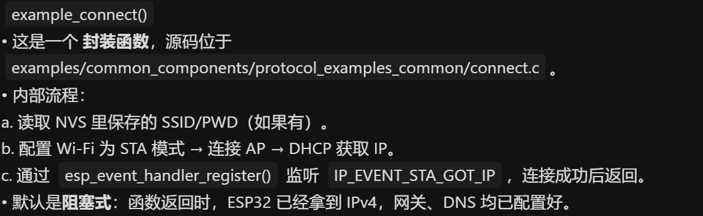
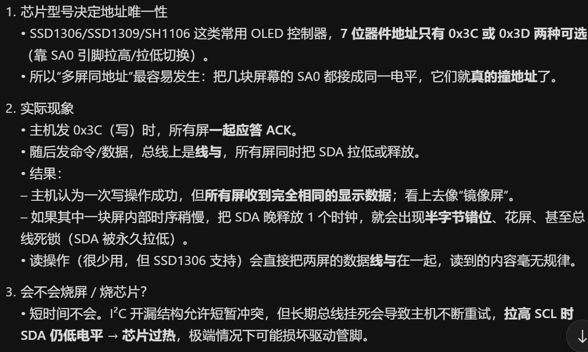
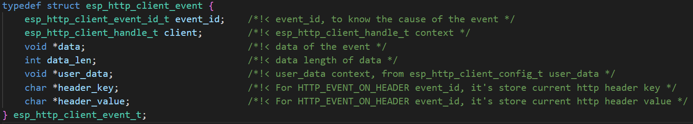

# I2C slave I2C从机

## 粗略阅读README文档

文档简介示例演示把设备作为I2C从属网络传感器，其从github获取数据，并通过I2C进行传输

硬件连接和命令设置

编译烧录和示例输出

## 构建项目

* 选择CMake工具
* 选择目标芯片
* 配置项目
* 构建项目

## 代码分析

### 结构体和枚举定义

`i2c_slave_github_context_t` 类型结构体

* `json_buffer` 以字符串数组形式储存的json数据
* `json_size` json数据的长度
* `tmp_buffer_*` 四个数组是解析/打包时的临时数据空间，用四字节存基本信息，100字节存descriptions描述，避免频繁malloc
* `event_queue` 事件队列，用于后续任务配合
* `command_data` 主机向从机发送的命令储存，从机根据不同命令进行不同操作
* `handle` 从机驱动的句柄

`i2c_slave_event_t` 类型枚举，以变量代替数字，方便阅读，更符合逻辑

```c
typedef struct {
    char *json_buffer;
    int json_size;
    uint8_t tmp_buffer_stars[sizeof(int)];
    uint8_t tmp_buffer_forks[sizeof(int)];
    uint8_t tmp_buffer_open_issues[sizeof(int)];
    uint8_t tmp_buffer_descriptions[100];
    QueueHandle_t event_queue;
    uint8_t command_data;
    i2c_slave_dev_handle_t handle;
} i2c_slave_github_context_t;

typedef enum {
    I2C_SLAVE_EVT_RX,
    I2C_SLAVE_EVT_TX
} i2c_slave_event_t;
```

### app_main函数

1. `nvs_flash_init` 函数初始化NVS，非易失性储存
2. `esp_netif_init` 和 `esp_event_loop_create_default` 参考[WiFi初始化一般阶段](https://docs.espressif.com/projects/esp-idf/zh_CN/stable/esp32/api-guides/wifi.html#esp32-wi-fi-station)在进行WiFi初始化
3. 
4. 新建队列并绑定，队列中数据类型为自定义枚举类型，即队列信息只可能为RX/TX
5. `i2c_slave_config_t` I2C从机配置
   * `i2c_port` 配置从机使用的I2C端口
   * `clk_source` 时钟源
   * `scl_io_num` SCL的GPIO编号
   * `sda_io_num` SDA的GPIO编号
   * `slave_addr` 设置从机地址 (*总线上地址重复在通信上是不被允许的，会导致数据故障，在实际使用是确保总线上的地址唯一*)
   * `send_buf_depth` 设置发送软件buffer的长度
   * `receive_buf_depth` 设置接收软件buffer的长度 (*该参数在源码中有，但在文档中并未介绍，笔者根据上下文和文档介绍写的用途*)
6. `i2c_new_slave_device` 分配和初始化总线
7. `i2c_slave_event_callbacks_t` 结构体绑定回调函数 `on_receive` 为请求事件绑定函数，`on_request` 为接收事件绑定函数，`i2c_slave_register_event_callbacks` 注册回调函数
8. `xTaskCreate` 创建任务，两任务传入参数均为`i2c_slave_github_context_t`类型结构体

```c
void app_main(void)
{
    static i2c_slave_github_context_t context = {0};

    ESP_ERROR_CHECK(nvs_flash_init());
    ESP_ERROR_CHECK(esp_netif_init());
    ESP_ERROR_CHECK(esp_event_loop_create_default());
    ESP_ERROR_CHECK(example_connect());

    context.event_queue = xQueueCreate(16, sizeof(i2c_slave_event_t));
    if (!context.event_queue) {
        ESP_LOGE(TAG, "Creating queue failed");
        return;
    }

    i2c_slave_config_t i2c_slv_config = {
        .i2c_port = I2C_SLAVE_NUM,
        .clk_source = I2C_CLK_SRC_DEFAULT,
        .scl_io_num = I2C_SLAVE_SCL_IO,
        .sda_io_num = I2C_SLAVE_SDA_IO,
        .slave_addr = ESP_SLAVE_ADDR,
        .send_buf_depth = 100,
        .receive_buf_depth = 100,
    };

    ESP_ERROR_CHECK(i2c_new_slave_device(&i2c_slv_config, &context.handle));
    i2c_slave_event_callbacks_t cbs = {
        .on_receive = i2c_slave_receive_cb,
        .on_request = i2c_slave_request_cb,
    };
    ESP_ERROR_CHECK(i2c_slave_register_event_callbacks(context.handle, &cbs, &context));

    xTaskCreate(http_get_task, "http_get_task", 4096, &context, 20, NULL);
    xTaskCreate(i2c_slave_task, "i2c_slave_task", 1024 * 4, &context, 10, NULL);
}
```

### 任务函数

#### i2c_slave_task

1. 任务函数接收传入的参数，并储存到任务内变量
2. 初始化局部变量
3. 主循环先进行判断，只有队列中有值，即RX/TX命令状态才操作
4. 如果队列读取到的值为TX，根据命令不同，指定不同的发送数据
5. 循环调用`i2c_slave_write`，由于json数据一般很长，一次发送不完，所以**data_buffer + total_written**为这次要发送的数据地址，**buffer_size - total_written**为发送的数据长度，可能发送不完。**write_len**是返回参数，返回这次传输的数据大小

```c
static void i2c_slave_task(void *arg)
{
    i2c_slave_github_context_t *context = (i2c_slave_github_context_t *)arg;
    i2c_slave_dev_handle_t handle = (i2c_slave_dev_handle_t)context->handle;

    uint8_t zero_buffer[32] = {}; // Use this buffer to clear the fifo.
    uint32_t write_len, total_written;
    uint32_t buffer_size = 0;

    while (true) {
        i2c_slave_event_t evt;
        if (xQueueReceive(context->event_queue, &evt, 10) == pdTRUE) {
            if (evt == I2C_SLAVE_EVT_TX) {
                uint8_t *data_buffer;
                switch (context->command_data) {
                case STARS_COMMAND:
                    data_buffer = context->tmp_buffer_stars;
                    buffer_size = sizeof(context->tmp_buffer_stars);
                    break;
                case FORKS_COMMAND:
                    data_buffer = context->tmp_buffer_forks;
                    buffer_size = sizeof(context->tmp_buffer_forks);
                    break;
                case OPENISSUES_COMMAND:
                    data_buffer = context->tmp_buffer_open_issues;
                    buffer_size = sizeof(context->tmp_buffer_open_issues);
                    break;
                case DESCRIPTIONS_COMMAND:
                    data_buffer = context->tmp_buffer_descriptions;
                    buffer_size = sizeof(context->tmp_buffer_descriptions);
                    break;
                default:
                    ESP_LOGE(TAG, "Invalid command");
                    data_buffer = zero_buffer;
                    buffer_size = sizeof(zero_buffer);
                    break;
                }

                total_written = 0;
                while (total_written < buffer_size) {
                    ESP_ERROR_CHECK(i2c_slave_write(handle, data_buffer + total_written, buffer_size - total_written, &write_len, 1000));
                    if (write_len == 0) {
                        ESP_LOGE(TAG, "Write error or timeout");
                        break;
                    }
                    total_written += write_len;
                }
            }
        }
    }
    vTaskDelete(NULL);
}
```

#### http_get_task

1. 接收结构体参数传入变量中
2. `esp_http_client_config_t` 配置esp-http客户端 [ESP-HTTP客户端](https://docs.espressif.com/projects/esp-idf/zh_CN/stable/esp32/api-reference/protocols/esp_http_client.html#esp-http)
   * `url` HTTP URL，关于 URL 的信息是最重要的，它覆盖其他相关字段
   * `event_handler` HTTP事件句柄
   * `method` HTTP方法
   * `buffer_size` HTTP接收缓冲区大小
   * `user_data` HTTP用户数据上下文
3. 循环中先`esp_http_client_init`创建实例 ，`esp_http_client_perform` 执行*esp_http_client*的所有操作。（*包括打开连接、交换数据、关闭连接（如需要），同时在当前任务完成前**阻塞**该任务。所有相关的事件（在 esp_http_client_config_t 中指定）将通过事件处理程序被调用。*）
4. 如果访问成功,`esp_http_client_get_status_code` 获取连接的HTTP状态，`esp_http_client_get_content_length` 获取http响应内容长度
5. `esp_http_client_cleanup`关闭连接并释放所有分配给HTTP客户端实例的内存

```c
void http_get_task(void *pvParameters)
{
    i2c_slave_github_context_t *context = (i2c_slave_github_context_t *)pvParameters;

    esp_http_client_config_t config = {
        .url = GITHUB_API_URL,
        .event_handler = _http_event_handler,
        .method = HTTP_METHOD_GET,
        .buffer_size = 2048,
        .user_data = context,
    };

    while (1) {
        esp_http_client_handle_t client = esp_http_client_init(&config);
        esp_err_t err = esp_http_client_perform(client);
        if (err == ESP_OK) {
            ESP_LOGI("HTTP_CLIENT", "HTTP GET Status = %d, content_length = %lld",
                     esp_http_client_get_status_code(client),
                     esp_http_client_get_content_length(client));
        } else {
            ESP_LOGE("HTTP_CLIENT", "HTTP GET request failed: %s", esp_err_to_name(err));
        }
        esp_http_client_cleanup(client);
        vTaskDelay(30 * 60 * 1000 / portTICK_PERIOD_MS);
    }
    vTaskDelete(NULL);
}
```

#### _http_event_handler事件句柄函数

ESP HTTP 客户端支持事件处理，发生相关事件时会触发相应的事件处理程序

参数为系统给予，具体内容如上，`user_data` 来自`esp_http_client_config_t`中的`user_data`参数

1. 接收参数给本地结构体变量
2. 判断触发的事件 [事件处理](https://docs.espressif.com/projects/esp-idf/zh_CN/stable/esp32/api-reference/protocols/esp_http_client.html#id7)
3. **HTTP_EVENT_ON_DATA**事件大概是连接到数据，进行数据有效判断并接收
   1. 为json_buffer初始分配内存，额外加一用于结尾'\0'
   2. 如果有数据，重新分配内存，`realloc` 会自动复制内存到信内存区域
   3. 分配失败报错并退出
   4. `memcpy` 进行数据拷贝，`context->json_buffer + context->json_size`指向当前数据末尾
   5. 进行数据大小更新并追加'\0'作为字符串结束
4. **HTTP_EVENT_ON_FINISH**事件代表传输完成，进行数据处理
   1. 缓存区数据不为空
   2. `cJSON_Parse`将json字符串解析为cJSON对象结构，返回指向该对象的指针
   3. 从解析的对象*root*中提取`"stargazers_count"` 字段给对应指针
   4. 如果指针不为空，即有该数据段，从`valueint`获取从json字段中解析出的整数值
   5. 通过`memcpy`将值转换成二进制储存(*分配了4字节，可存2^64次的数值*)
   6. 后续操作基本相同，`valuestring`为json中解析出的字符串，进行打印和复制储存
   7. `cJSON_Delete` 删除解析的数据并释放内存 同时释放`json_buffer`中的内存并清空

> valueint 整数型 、 valuestring 字符串型 、valuedouble 浮点型

```c
static esp_err_t _http_event_handler(esp_http_client_event_t *evt)
{
    i2c_slave_github_context_t *context = (i2c_slave_github_context_t *)evt->user_data;
    int star_count = 0, forks_count = 0, open_issues_count = 0;

    switch (evt->event_id) {
    case HTTP_EVENT_ON_DATA:
        if (evt->data_len > 0) {
            if (context->json_buffer == NULL) {
                context->json_buffer = malloc(evt->data_len + 1);
            } else {
                context->json_buffer = realloc(context->json_buffer, context->json_size + evt->data_len + 1);
            }
            if (context->json_buffer == NULL) {
                ESP_LOGE("HTTP_CLIENT", "Failed to allocate memory for data json_buffer");
                return ESP_FAIL;
            }
            memcpy(context->json_buffer + context->json_size, evt->data, evt->data_len);
            context->json_size += evt->data_len;
            context->json_buffer[context->json_size] = '\0';  // Null-terminate the string
        }
        break;
    case HTTP_EVENT_ON_FINISH:
        if (context->json_buffer != NULL) {
            // Process received data
            cJSON *root = cJSON_Parse(context->json_buffer);
            cJSON *stars = cJSON_GetObjectItem(root, "stargazers_count");

            if (stars != NULL) {
                star_count = stars->valueint;
                printf("Star count: %d\n", star_count);
                memcpy(context->tmp_buffer_stars, &star_count, sizeof(int));
            }
            cJSON *forks = cJSON_GetObjectItem(root, "forks_count");
            if (forks != NULL) {
                forks_count = forks->valueint;
                printf("Forks count: %d\n", forks_count);
                memcpy(context->tmp_buffer_forks, &forks_count, sizeof(int));
            }
            cJSON *open_issues = cJSON_GetObjectItem(root, "open_issues_count");
            if (open_issues != NULL) {
                open_issues_count = open_issues->valueint;
                printf("issue count: %d\n", open_issues_count);
                memcpy(context->tmp_buffer_open_issues, &open_issues_count, sizeof(int));
            }
            cJSON *descriptions = cJSON_GetObjectItem(root, "description");
            if (descriptions != NULL) {
                printf("the description is: %s\n", descriptions->valuestring);
                memcpy(context->tmp_buffer_descriptions, descriptions->valuestring, strlen(descriptions->valuestring));
            }
            cJSON_Delete(root);
            free(context->json_buffer);
            context->json_buffer = NULL;
            context->json_size = 0;
        }
        break;
    default:
        break;
    }

    return ESP_OK;
}
```

### 回调函数

这部分回调函数是I2C事件绑定的回调函数，在`i2c_slave_register_event_callbacks`传入参数

`i2c_slave_request_cb` 是请求事件的回调函数，即I2C总线收到数据请求，函数中获取传入的参数并给本地变量，并向队列中写入TX，代表需要进行发送

`i2c_slave_receive_cb` 是接收事件的回调函数，即I2C总线传来数据，函数中获取传入的参数并给本地变量，`i2c_slave_rx_done_event_data_t`获取数据及长度，(*由于发送的只是命令码，只进行储存*)，向队列中写入RX，代表接收到数据

结合前面的I2C从机任务，进行**获取队列值**，无论RX/TX都进行读出，但RX的数据在回调函数中以及进行接收，所有任务中只对TX发送进行操作

```c
static bool i2c_slave_request_cb(i2c_slave_dev_handle_t i2c_slave, const i2c_slave_request_event_data_t *evt_data, void *arg)
{
    i2c_slave_github_context_t *context = (i2c_slave_github_context_t *)arg;
    i2c_slave_event_t evt = I2C_SLAVE_EVT_TX;
    BaseType_t xTaskWoken = 0;
    xQueueSendFromISR(context->event_queue, &evt, &xTaskWoken);
    return xTaskWoken;
}

static bool i2c_slave_receive_cb(i2c_slave_dev_handle_t i2c_slave, const i2c_slave_rx_done_event_data_t *evt_data, void *arg)
{
    i2c_slave_github_context_t *context = (i2c_slave_github_context_t *)arg;
    i2c_slave_event_t evt = I2C_SLAVE_EVT_RX;
    BaseType_t xTaskWoken = 0;
    // Command only contains one byte, so just save one bytes here.
    context->command_data = *evt_data->buffer;
    xQueueSendFromISR(context->event_queue, &evt, &xTaskWoken);
    return xTaskWoken;
}
```

## 总结

本例收获很多，了解了I2C从机的配置，了解了WIFI的快速配置，进行了ESP-HTTP客户端的尝试和分析，了解了c语言怎么对JSON格式数据进行处理。还头一次在例程中看到了有别于repl的任务创建和配合。
对于I2C从机配置，数据接收，HTTP的获取和处理，都是可以直接用的，需要掌握原理，会改。
