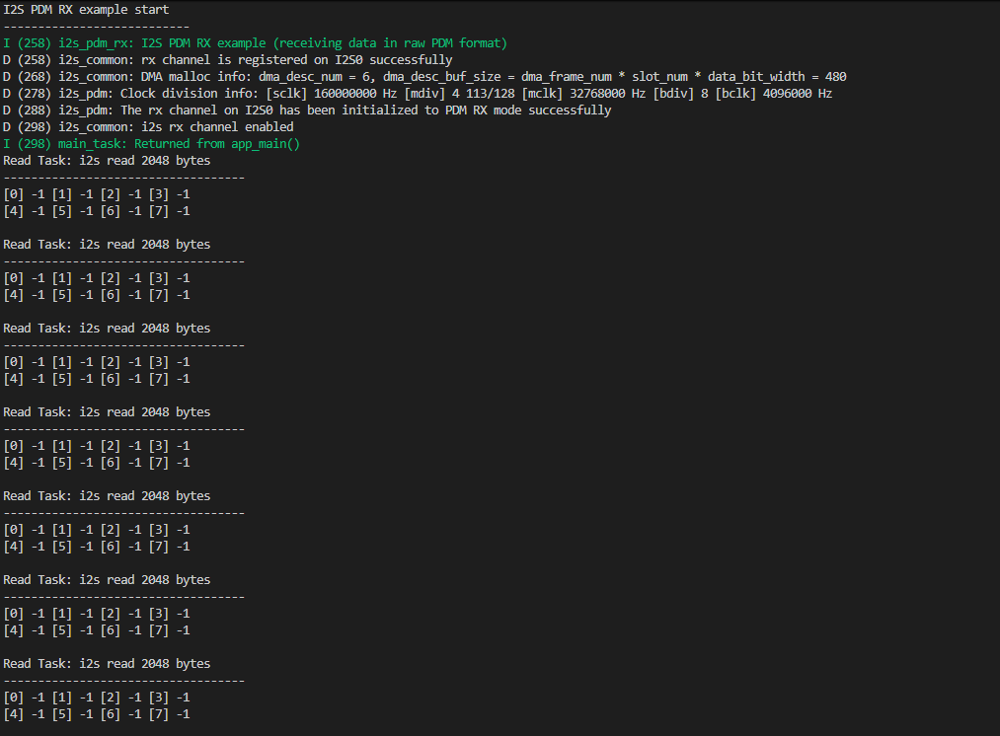

# I2S PDM Mode I2S 脉冲密度调试示例

## 粗略阅读README文档

文档简介该示例用于展示如何使用PDM的TX和RX功能
硬件连接,配置编译烧录，示例输出

## 构建、烧录和输出

> 由于笔者esp-idf的vscode插件在wsl中莫名其妙地不正常工作，此次采用命令行的方式
> 如果用的是windows和vscode，还是按照原来的步骤进行

* 设置`IDF_TOOLS_PATH` `export IDF_TOOLS_PATH='$HOME/esp/framework/v5.5/.espressif'
* 启动虚拟环境 `. $HOME/esp/framework/v5.5/esp-idf-v5.5/export.sh'
* 设置芯片型号 `idf.py set-target esp32c3`
* 配置config `idf.py menuconfig`
* 修改引脚
* 构建项目 `idf.py build`
* 烧录(wsl环境通过usbipd映射) `idf.py -p /dev/ttyACM0 flash`
* 监视 `idf.py -p /dev/ttyACM0/ monitor`

显然这样的数据显示是不合适的，在问询AI后发现，使用的INMP441是I2S麦克风，不是PDM麦克风，需要设置I2S为STD标准模式，而不是PDM模式
本篇例程记录暂时到这，等有PDM麦克风再继续