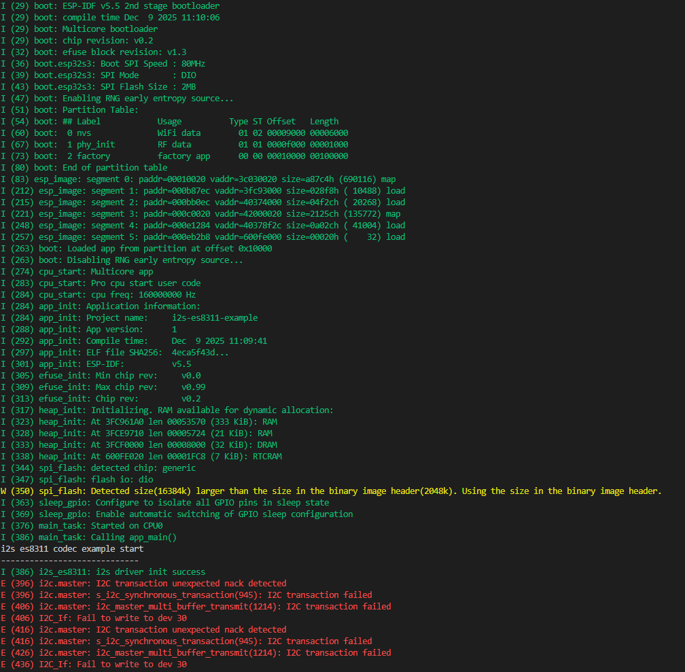
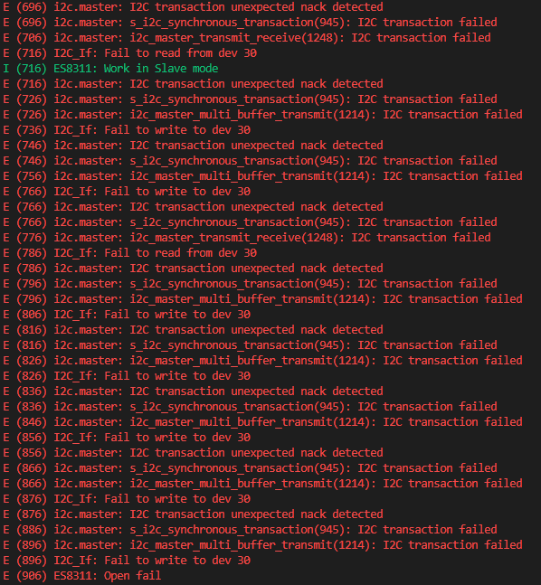

# i2s_es8311 I2S连接ES8311音频编解码芯片

## 粗略阅读README文档

文档简介该示例可选择音乐模式和回声模式，音乐模式将会播放指定音乐；回声模式可以听到自己的声音

ES8311简介：
低功耗单声道音频编解码器

* I2S/PCM串行数据端口
* I2C接口进行配置
* 24bitADC，8-96kHz采样率 100dB信噪比（越大越好，背景底噪越微弱）
* ADC：-93dB THD+N（总谐波失真+噪声）（越小越好，代表声音越干净）
* 24bitDAC，8-96kHz采样率，110dB信噪比，-80dB THD+N

硬件线路连接、外部库依赖、构建烧录和示例输出，自定义音频输出，可能的故障

## 构建烧录和监视

> 由于笔者采用的是核心板，并没有进行Codec的连接，所以主要看一下初始化的输出，后续进行代码分析

* 选择idf版本
* 选择芯片型号
* 确定端口号和烧录方式
* 点击**构建、烧录和监视**



日志的前半部分包括软硬件的基础信息，包括版本号，型号，内存分区，软件包名称、时间等
在正式进入app_main函数后，在初始化时发生故障，没有接收到信号传输；后尝试运行从机模式，也没有（因为根本没接）。
最后报错直接由assert结束

## 代码分析

### config.h文件

本示例对于用到的宏定义专门新建了一个config头文件

1. 头文件导入`sdkconfig.h`用于获取在其中配置的变量
2. `EXAMPLE_RECV_BUF_SIZE` 定义录音数据大小
3. `EXAMPLE_SAMPLE_RATE` 定义采样率
4. `EXAMPLE_MCLK_MULTIPLE` MCLK和采样率之间的倍数 384 = 24 x 16 ；十六位 16x16=256
5. `EXAMPLE_MCLK_FREQ_HZ` MCLK的实际频率
6. `EXAMPLE_VOICE_VOLUME` 音量设置
7. `CONFIG_EXAMPLE_MODE_ECHO` 如果有该设置，启用增益`EXAMPLE_MIC_GAIN`
8. 后续宏定义都是I2C和I2S的引脚号和驱动号，不作具体解释

```c
/*
 * SPDX-FileCopyrightText: 2021-2025 Espressif Systems (Shanghai) CO LTD
 *
 * SPDX-License-Identifier: CC0-1.0
 */

#pragma once

#include "sdkconfig.h"

/* Example configurations */
#define EXAMPLE_RECV_BUF_SIZE   (2400)
#define EXAMPLE_SAMPLE_RATE     (16000)
#define EXAMPLE_MCLK_MULTIPLE   (384) // If not using 24-bit data width, 256 should be enough
#define EXAMPLE_MCLK_FREQ_HZ    (EXAMPLE_SAMPLE_RATE * EXAMPLE_MCLK_MULTIPLE)
#define EXAMPLE_VOICE_VOLUME    CONFIG_EXAMPLE_VOICE_VOLUME
#define EXAMPLE_PA_CTRL_IO      CONFIG_EXAMPLE_PA_CTRL_IO
#if CONFIG_EXAMPLE_MODE_ECHO
#define EXAMPLE_MIC_GAIN        CONFIG_EXAMPLE_MIC_GAIN
#endif

/* I2C port and GPIOs */
#define I2C_NUM         (0)
#define I2C_SCL_IO      CONFIG_EXAMPLE_I2C_SCL_IO
#define I2C_SDA_IO      CONFIG_EXAMPLE_I2C_SDA_IO

/* I2S port and GPIOs */
#define I2S_NUM         (0)
#define I2S_MCK_IO      CONFIG_EXAMPLE_I2S_MCLK_IO
#define I2S_BCK_IO      CONFIG_EXAMPLE_I2S_BCLK_IO
#define I2S_WS_IO       CONFIG_EXAMPLE_I2S_WS_IO
#define I2S_DO_IO       CONFIG_EXAMPLE_I2S_DOUT_IO
#define I2S_DI_IO       CONFIG_EXAMPLE_I2S_DIN_IO
```

### app_main函数

1. 打印提示程序开始
2. 自定义函数初始化i2s
3. 自定义函数初始化es8311（通过i2c通信）
4. 根据不同的配置进行不同的任务函数创建 `i2s_music` 和 `i2s_echo`(播放分配字节4096，回声分配字节8192)

```c
void app_main(void)
{
    printf("i2s es8311 codec example start\n-----------------------------\n");
    /* Initialize i2s peripheral */
    if (i2s_driver_init() != ESP_OK) {
        ESP_LOGE(TAG, "i2s driver init failed");
        abort();
    } else {
        ESP_LOGI(TAG, "i2s driver init success");
    }
    /* Initialize i2c peripheral and config es8311 codec by i2c */
    if (es8311_codec_init() != ESP_OK) {
        ESP_LOGE(TAG, "es8311 codec init failed");
        abort();
    } else {
        ESP_LOGI(TAG, "es8311 codec init success");
    }

#if CONFIG_EXAMPLE_MODE_MUSIC
    /* Play a piece of music in music mode */
    xTaskCreate(i2s_music, "i2s_music", 4096, NULL, 5, NULL);
#else
    /* Echo the sound from MIC in echo mode */
    xTaskCreate(i2s_echo, "i2s_echo", 8192, NULL, 5, NULL);
#endif
}
```

### i2s驱动

1. `I2S_CHANNEL_DEFAULT_CONFIG`宏函数创建默认i2s通道配置
2. `auto_clear` 参数用于在执行完回调函数后，自动清楚旧数据
3. `i2s_new_channel` 新建i2s通道，写入配置，初始化tx和rx通道
4. `i2s_std_config_t` 配置std模式的相关
   * `clk_cfg` 标准模式时钟配置，通过`I2S_STD_CLK_DEFAULT_CONFIG`宏设置采样率生成
   * `slot_cfg` 标准模式插槽配置，通过不同的宏函数进行PHILIPS/MSB/PCM[I2S数据格式](https://blog.csdn.net/weixin_33914255/article/details/112707246#:~:text=%E6%9C%AC%E6%96%87%E8%AF%A6%E7%BB%86%E4%BB%8B%E7%BB%8D%E4%BA%86I2S%E6%95%B0%E6%8D%AE%E6%A0%BC%E5%BC%8F%E4%B8%AD%E7%9A%84Philips%E6%A0%87%E5%87%86%EF%BC%8C%E4%BB%A5%E5%8F%8A%E5%B7%A6%E5%AF%B9%E9%BD%90%20%28MSB%29%E5%92%8C%E5%8F%B3%E5%AF%B9%E9%BD%90,%28LSB%29%E4%B8%A4%E7%A7%8D%E5%B8%B8%E8%A7%81%E6%A0%87%E5%87%86%E3%80%82%20%E5%9C%A8Philips%E6%A0%87%E5%87%86%E4%B8%AD%EF%BC%8C%E6%95%B0%E6%8D%AE%E4%BC%A0%E8%BE%93%E4%B8%8ELRCLK%E5%90%8C%E6%AD%A5%EF%BC%9B%E5%B7%A6%E5%AF%B9%E9%BD%90%E6%A8%A1%E5%BC%8F%E4%B8%8B%EF%BC%8CLRCLK%E7%BF%BB%E8%BD%AC%E6%97%B6%E5%BC%80%E5%A7%8B%E4%BC%A0%E8%BE%93%E6%95%B0%E6%8D%AE%EF%BC%8C%E5%B7%A6%E5%A3%B0%E9%81%93%E4%B8%8EPhilips%E6%A0%87%E5%87%86%E7%9B%B8%E5%8F%8D%EF%BC%9B%E5%8F%B3%E5%AF%B9%E9%BD%90%E6%A8%A1%E5%BC%8F%E5%88%99%E5%9C%A8LRCLK%E7%AC%AC%E4%BA%8C%E6%AC%A1%E7%BF%BB%E8%BD%AC%E6%97%B6%E5%AE%8C%E6%88%90LSB%E4%BC%A0%E8%BE%93%EF%BC%8C%E5%90%8C%E6%A0%B7%E5%B7%A6%E5%A3%B0%E9%81%93%E6%95%B0%E6%8D%AE%E4%B8%8EPhilips%E6%A0%87%E5%87%86%E7%9B%B8%E5%8F%8D%E3%80%82)
   * `gpio_cfg` 标准模式GPIO配置，`invert_flags` 引脚反相标志，是否反相输出
5. 设置`mclk_multiple`倍数
6. `i2s_channel_init_std_mode` 通道std模式初始化 `i2s_channel_enable` 使能通道

```c
static esp_err_t i2s_driver_init(void)
{
    i2s_chan_config_t chan_cfg = I2S_CHANNEL_DEFAULT_CONFIG(I2S_NUM, I2S_ROLE_MASTER);
    chan_cfg.auto_clear = true; // Auto clear the legacy data in the DMA buffer
    ESP_ERROR_CHECK(i2s_new_channel(&chan_cfg, &tx_handle, &rx_handle));
    i2s_std_config_t std_cfg = {
        .clk_cfg = I2S_STD_CLK_DEFAULT_CONFIG(EXAMPLE_SAMPLE_RATE),
        .slot_cfg = I2S_STD_PHILIPS_SLOT_DEFAULT_CONFIG(I2S_DATA_BIT_WIDTH_16BIT, I2S_SLOT_MODE_STEREO),
        .gpio_cfg = {
            .mclk = I2S_MCK_IO,
            .bclk = I2S_BCK_IO,
            .ws = I2S_WS_IO,
            .dout = I2S_DO_IO,
            .din = I2S_DI_IO,
            .invert_flags = {
                .mclk_inv = false,
                .bclk_inv = false,
                .ws_inv = false,
            },
        },
    };
    std_cfg.clk_cfg.mclk_multiple = EXAMPLE_MCLK_MULTIPLE;

    ESP_ERROR_CHECK(i2s_channel_init_std_mode(tx_handle, &std_cfg));
    ESP_ERROR_CHECK(i2s_channel_init_std_mode(rx_handle, &std_cfg));
    ESP_ERROR_CHECK(i2s_channel_enable(tx_handle));
    ESP_ERROR_CHECK(i2s_channel_enable(rx_handle));
    return ESP_OK;
}
```

### es8311初始化

1. 主模式总线配置，包括I2C驱动序号，IO口序号，默认时钟，内部上拉
2. `glitch_ignore_cnt` 如果线路上故障周期小于该值，可以滤除
3. `i2c_new_master_bus` 写入配置初始化总线
4. `audio_codec_i2c_cfg_t` 外部组件Codec结构体**i2c**配置，写入I2C序号，设备地址，总线句柄
5. `audio_codec_new_i2c_ctrl` 新建codec**控制句柄**并判断是否新建成功
6. `audio_codec_i2s_cfg_t` 外部组件Codec结构体**i2s**配置，写入I2S序号，tx和rx通道句柄
7. `audio_codec_new_i2s_data` 新建codec**数据句柄**并判断是否新建成功
8. `audio_codec_new_gpio` 调用函数新建codec**gpio句柄**并判断
9. 对于`es8311`，定义结构体进行配置
    * `ctrl_if` 控制句柄
    * `gpio_if` gpio句柄
    * `codec_mode` 编解码器模式
    * `master_mode` 编解码器i2c主从模式
    * `use_mclk` 根据是否有配置IO口判断
    * `pa_pin` 射频功率放大器（PA）控制引脚
    * `pa_reverted` PA控制信号，false为高电平有效，true为低电平有效
    * `hw_gain` 硬件增益
    * `mclk_dev` mclk放大倍数
10. `es8311_codec_new` 函数创建新的Codec句柄并检查
11. `esp_codec_dev_cfg_t` esp关于code从控制的结构体
    * `dev_type` 设备类型，输入/输出，双向输入输出
    * `codec_if` Codec设备句柄
    * `data_if` 数据控制句柄
12. `esp_codec_dev_new` 创建顶层codec接口指针
13. `esp_codec_dev_sample_info_t` 编解码器音频样本通道配置
    * `bits_per_sample` 单个通道数据位数
    * `channel` 样本通道数
    * `channel_mask` 通道掩码，指示选择的通道数
    * `sample_rate` 样本采样率
14. `esp_codec_dev_open` 传入顶层Codec接口和样本通道配置，启动设备
15. `esp_codec_dev_set_out_vol` 设置播放音量
16. `esp_codec_dev_set_in_gain` 设置增益（如果启用配置）

```c
static esp_err_t es8311_codec_init(void)
{
    /* Initialize I2C peripheral */
    i2c_master_bus_handle_t i2c_bus_handle = NULL;
    i2c_master_bus_config_t i2c_mst_cfg = {
        .i2c_port = I2C_NUM,
        .sda_io_num = I2C_SDA_IO,
        .scl_io_num = I2C_SCL_IO,
        .clk_source = I2C_CLK_SRC_DEFAULT,
        .glitch_ignore_cnt = 7,
        /* Pull-up internally for no external pull-up case.
        Suggest to use external pull-up to ensure a strong enough pull-up. */
        .flags.enable_internal_pullup = true,
    };
    ESP_ERROR_CHECK(i2c_new_master_bus(&i2c_mst_cfg, &i2c_bus_handle));

    /* Create control interface with I2C bus handle */
    audio_codec_i2c_cfg_t i2c_cfg = {
        .port = I2C_NUM,
        .addr = ES8311_CODEC_DEFAULT_ADDR,
        .bus_handle = i2c_bus_handle,
    };
    const audio_codec_ctrl_if_t *ctrl_if = audio_codec_new_i2c_ctrl(&i2c_cfg);
    assert(ctrl_if);

    /* Create data interface with I2S bus handle */
    audio_codec_i2s_cfg_t i2s_cfg = {
        .port = I2S_NUM,
        .rx_handle = rx_handle,
        .tx_handle = tx_handle,
    };
    const audio_codec_data_if_t *data_if = audio_codec_new_i2s_data(&i2s_cfg);
    assert(data_if);

    /* Create ES8311 interface handle */
    const audio_codec_gpio_if_t *gpio_if = audio_codec_new_gpio();
    assert(gpio_if);
    es8311_codec_cfg_t es8311_cfg = {
        .ctrl_if = ctrl_if,
        .gpio_if = gpio_if,
        .codec_mode = ESP_CODEC_DEV_WORK_MODE_BOTH,
        .master_mode = false,
        .use_mclk = I2S_MCK_IO >= 0,
        .pa_pin = EXAMPLE_PA_CTRL_IO,
        .pa_reverted = false,
        .hw_gain = {
            .pa_voltage = 5.0,
            .codec_dac_voltage = 3.3,
        },
        .mclk_div = EXAMPLE_MCLK_MULTIPLE,
    };
    const audio_codec_if_t *es8311_if = es8311_codec_new(&es8311_cfg);
    assert(es8311_if);

    /* Create the top codec handle with ES8311 interface handle and data interface */
    esp_codec_dev_cfg_t dev_cfg = {
        .dev_type = ESP_CODEC_DEV_TYPE_IN_OUT,
        .codec_if = es8311_if,
        .data_if = data_if,
    };
    esp_codec_dev_handle_t codec_handle = esp_codec_dev_new(&dev_cfg);
    assert(codec_handle);

    /* Specify the sample configurations and open the device */
    esp_codec_dev_sample_info_t sample_cfg = {
        .bits_per_sample = I2S_DATA_BIT_WIDTH_16BIT,
        .channel = 2,
        .channel_mask = 0x03,
        .sample_rate = EXAMPLE_SAMPLE_RATE,
    };
    if (esp_codec_dev_open(codec_handle, &sample_cfg) != ESP_CODEC_DEV_OK) {
        ESP_LOGE(TAG, "Open codec device failed");
        return ESP_FAIL;
    }

    /* Set the initial volume and gain */
    if (esp_codec_dev_set_out_vol(codec_handle, EXAMPLE_VOICE_VOLUME) != ESP_CODEC_DEV_OK) {
        ESP_LOGE(TAG, "set output volume failed");
        return ESP_FAIL;
    }
#if CONFIG_EXAMPLE_MODE_ECHO
    if (esp_codec_dev_set_in_gain(codec_handle, EXAMPLE_MIC_GAIN) != ESP_CODEC_DEV_OK) {
        ESP_LOGE(TAG, "set input gain failed");
        return ESP_FAIL;
    }
#endif
    return ESP_OK;
}
```

有关Codec的操作见[组件README](./README_CN.md)

### 有关本次报错和崩溃的原因

1. 在app_main函数中完成i2s驱动的初始化
2. 进入Codec初始化函数
3. 在`i2c_new_master_bus` 新建总线启动流程是i2c未应答，产生报错
4. 在`audio_codec_new_i2c_ctrl` 新建控制句柄时调用i2c写入函数，未成功写入报错
5. 由于整个流程初始化有多次写入操作，所以产生多次报错（后续有关i2c.master的报错应该不是新建，而是写入尝试是调用相关函数，可能第一个也不是）
6. assert结束

### i2s_music music模式函数

1. 失能i2s的tx通道
2. `i2s_channel_preload_data`预加载音频到i2s内部缓存参数为：tx句柄，数据指针，数据长度，返回加载长度
3. 使能tx通道
4. 循环中进行:
   1. `i2s_channel_write`写入i2s数据（多次播放），该函数为阻塞函数
   2. 判断是否播放成功
   3. 重新把数据帧放到音频数据开头
   4. 延时1s
5. `vTaskDelete`任务结束时释放内存

```c

/* Import music file as buffer */
#if CONFIG_EXAMPLE_MODE_MUSIC
extern const uint8_t music_pcm_start[] asm("_binary_canon_pcm_start");
extern const uint8_t music_pcm_end[]   asm("_binary_canon_pcm_end");
#endif

static void i2s_music(void *args)
{
    esp_err_t ret = ESP_OK;
    size_t bytes_write = 0;
    uint8_t *data_ptr = (uint8_t *)music_pcm_start;

    /* (Optional) Disable TX channel and preload the data before enabling the TX channel,
     * so that the valid data can be transmitted immediately */
    ESP_ERROR_CHECK(i2s_channel_disable(tx_handle));
    ESP_ERROR_CHECK(i2s_channel_preload_data(tx_handle, data_ptr, music_pcm_end - data_ptr, &bytes_write));
    data_ptr += bytes_write;  // Move forward the data pointer

    /* Enable the TX channel */
    ESP_ERROR_CHECK(i2s_channel_enable(tx_handle));
    while (1) {
        /* Write music to earphone */
        ret = i2s_channel_write(tx_handle, data_ptr, music_pcm_end - data_ptr, &bytes_write, portMAX_DELAY);
        if (ret != ESP_OK) {
            /* Since we set timeout to 'portMAX_DELAY' in 'i2s_channel_write'
               so you won't reach here unless you set other timeout value,
               if timeout detected, it means write operation failed. */
            ESP_LOGE(TAG, "[music] i2s write failed, %s", err_reason[ret == ESP_ERR_TIMEOUT]);
            abort();
        }
        if (bytes_write > 0) {
            ESP_LOGI(TAG, "[music] i2s music played, %d bytes are written.", bytes_write);
        } else {
            ESP_LOGE(TAG, "[music] i2s music play failed.");
            abort();
        }
        data_ptr = (uint8_t *)music_pcm_start;
        vTaskDelay(1000 / portTICK_PERIOD_MS);
    }
    vTaskDelete(NULL);
}
```

### i2s_echo函数

1. 动态分配麦克风数据空间
2. 循环中进行`i2s_channel_read` 读取数据 `i2s_channel_write` 写入数据
3. 通过该方式进行的数据采集和播放，有延时，但由于两者是tx和rx同时工作，所以如果不是传输问题，不会有数据缺失

```c
static void i2s_echo(void *args)
{
    int *mic_data = malloc(EXAMPLE_RECV_BUF_SIZE);
    if (!mic_data) {
        ESP_LOGE(TAG, "[echo] No memory for read data buffer");
        abort();
    }
    esp_err_t ret = ESP_OK;
    size_t bytes_read = 0;
    size_t bytes_write = 0;
    ESP_LOGI(TAG, "[echo] Echo start");

    while (1) {
        memset(mic_data, 0, EXAMPLE_RECV_BUF_SIZE);
        /* Read sample data from mic */
        ret = i2s_channel_read(rx_handle, mic_data, EXAMPLE_RECV_BUF_SIZE, &bytes_read, 1000);
        if (ret != ESP_OK) {
            ESP_LOGE(TAG, "[echo] i2s read failed, %s", err_reason[ret == ESP_ERR_TIMEOUT]);
            abort();
        }
        /* Write sample data to earphone */
        ret = i2s_channel_write(tx_handle, mic_data, EXAMPLE_RECV_BUF_SIZE, &bytes_write, 1000);
        if (ret != ESP_OK) {
            ESP_LOGE(TAG, "[echo] i2s write failed, %s", err_reason[ret == ESP_ERR_TIMEOUT]);
            abort();
        }
        if (bytes_read != bytes_write) {
            ESP_LOGW(TAG, "[echo] %d bytes read but only %d bytes are written", bytes_read, bytes_write);
        }
    }
    vTaskDelete(NULL);
}
```

## 总结

在学习的过程中不得不感叹esp32组件的丰富，同时也大量锻炼了笔者的文档阅读能力，在这个组件的查看和学习过程中，我再一次认识到想要制作一个传播广泛，被许多人认可的组件，或者说库，是非常不容易的事。这次我看到了文档中对于框图、软硬件架构，特别是软件部分的直观和便于理解，后续也想要进行尝试。

有关本示例，多次报错原因在上文中指出，idf封装了非常多完备的组件，编程时逻辑严密，方便调试。整个控制过程重点在于**调用组件**进行codec的相关配置，在完成后音频的传输主要就是通过i2s进行操作。
