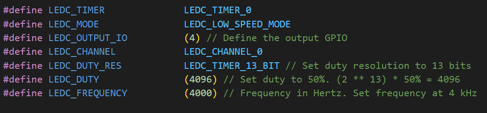
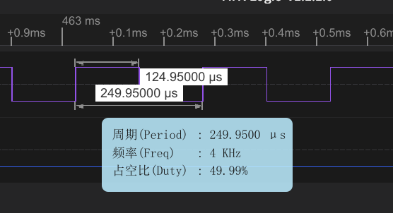
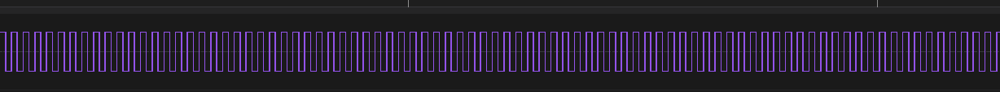
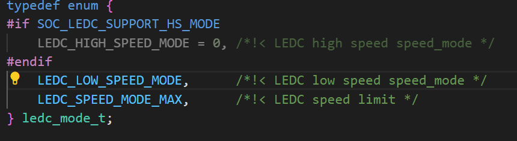
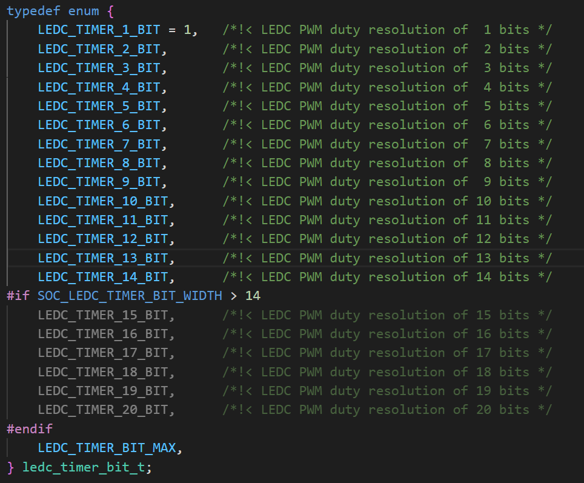
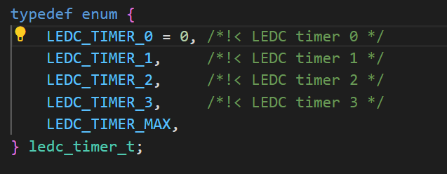
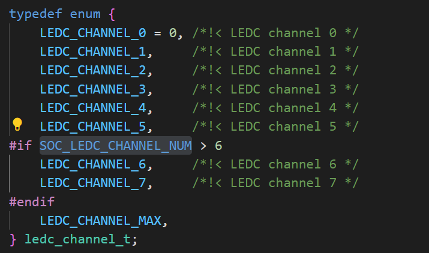
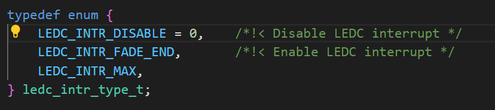

# ledc basic LEDC基础

> ledc是ESP中pwm输出的特定外设，因为pwm最基础的用法即为LEDcontrol

## 粗略阅读README文档

文档简介示例演示使用LEDC在低速模式下生成PWM信号

硬件连接

项目配置以及频率占空比修改

编译构建烧录和示例输出

## 构建烧录和输出

* 选择芯片信号
* 选择端口号
* 配置项目(*本例没有menuconfig配置，在宏定义中设置。也可自己设置Kconfig*)

* 点击 **构建、烧录和监视**
* 采用示波器/逻辑分析仪监视数据


可以看到，**PWM波在持续输出**，**频率和占空比**和配置一致
* 笔者尝试调整占空比，得到良好响应。尝试调整频率至1MHz，触发报错，需要改换高速和改变位数，本例不作尝试
* ESP和别的单片机不一样的地方在于，**配置硬件资源不一定需要和引脚对应**，只需要考虑**资源配置**。如本例中配置使用`TIMER0`，`CHANNEL0`，但原使用是`GPIO5`，笔者改为`GPIO4`，依然能**正常使用**

## 代码分析

### 宏定义

示例宏定义了**定时器**，**模式**，**输出引脚**，**通道**，**占空比分辨率**，**设置占空比**，**频率**

```c
#define LEDC_TIMER              LEDC_TIMER_0
#define LEDC_MODE               LEDC_LOW_SPEED_MODE
#define LEDC_OUTPUT_IO          (4) // Define the output GPIO
#define LEDC_CHANNEL            LEDC_CHANNEL_0
#define LEDC_DUTY_RES           LEDC_TIMER_13_BIT // Set duty resolution to 13 bits
#define LEDC_DUTY               (4096) // Set duty to 50%. (2 ** 13) * 50% = 4096
#define LEDC_FREQUENCY          (4000) // Frequency in Hertz. Set frequency at 4 kHz
```

### app_main()

main函数中调用了自定义函数`example_ledc_init` 进行ledc或者说PWM的初始化配置。然后进行占空比(`duty`)的设置和更新

```c
void app_main(void)
{
    // Set the LEDC peripheral configuration
    example_ledc_init();
    // Set duty to 50%
    ESP_ERROR_CHECK(ledc_set_duty(LEDC_MODE, LEDC_CHANNEL, LEDC_DUTY));
    // Update duty to apply the new value
    ESP_ERROR_CHECK(ledc_update_duty(LEDC_MODE, LEDC_CHANNEL));
}
```

### 自定义初始化函数

函数主要进行了两个配置，一个是**定时器**，一个是**通道**
[LEDC 官方编程指南](https://docs.espressif.com/projects/esp-idf/zh_CN/stable/esp32/api-reference/peripherals/ledc.html)
定时器配置如下

* `speed_mode` 速度模式，见上面宏定义，设置为低速

* `duty_resolution` 占空比分辨率为13位，即范围从0~2^13。(官方示例中指出，越高的频率只能使用越低的分辨率)

* `timer_num` 定时器，根据宏这里选择的是TIMER0，可选项为0-3

* `freq_hz` 频率设置
* `clk_cfg` 时钟设置，自动设置时钟

通道配置如下

* `speed_mode` 速度模式 (*笔者不清楚如果定时器设置低速，通道设置成高速是否能正常运行，但建议还是保持一致*)
* `channel` 通道数，每个定时器有8路通道

* `timer_sel` 定时器选择
* `intr_type` 中断启用，本例不启用

* `gpio_num` 输出引脚
* `duty` 占空比设置
* `hpoint` hpoint用于高速模式pwm调整信号相位

> 引用AI输出
>
> 在 `ledc_channel_config_t` 里有两个看起来都和“占空比”有关的参数：`hpoint` 和 `duty`，但它们的职责并不相同，不能混淆。
>
>1. duty（16 bit，范围 0 … 2**duty_resolution – 1）
这是“真正决定占空比的值”。  
>       * 在单次/普通 PWM 模式下，它等于“一个周期内高电平持续多少个计数器 tick”。  
>       * 在硬件淡入淡出（LEDC 的硬件 fade 功能）时，它又是“目标占空比”——fade 会由当前占空比逐渐变到 duty。  
>
>       换句话说，duty 才是“灯有多亮”的直接控制量。
>
>2. hpoint（20 bit，范围 0 … 2**timer_bit – 1）
它实际上只是“相位偏移”(phase shift) 参数。  
>
>       * 当同一个定时器驱动多个通道，且希望在时间上错开它们的边沿时，给不同通道设不同的 hpoint 即可。  
>
>       * 如果不需要相位差，把它设成 0 即可，对占空比本身没有影响。  
>       从波形角度看：  
>       计数器从 0 数到 2**timer_bit – 1；  
>       当计数器值 == hpoint 时，PWM 输出翻转为高；  
>       当计数器值 == (hpoint + duty) % 2**timer_bit 时，PWM 输出翻转为低。  
>       这样 duty 仍是高电平持续的时间宽度，而 hpoint 只是把这一段高电平整体平移了。
>
>一句话总结  
>duty 管“宽度”（占空比），hpoint 管“位置”（相位）。

分别调用`ledc_timer_config` 和 `ledc_channel_config` 写入配置文件，完成配置

```c
static void example_ledc_init(void)
{
    // Prepare and then apply the LEDC PWM timer configuration
    ledc_timer_config_t ledc_timer = {
        .speed_mode       = LEDC_MODE,
        .duty_resolution  = LEDC_DUTY_RES,
        .timer_num        = LEDC_TIMER,
        .freq_hz          = LEDC_FREQUENCY,  // Set output frequency at 4 kHz
        .clk_cfg          = LEDC_AUTO_CLK
    };
    ESP_ERROR_CHECK(ledc_timer_config(&ledc_timer));

    // Prepare and then apply the LEDC PWM channel configuration
    ledc_channel_config_t ledc_channel = {
        .speed_mode     = LEDC_MODE,
        .channel        = LEDC_CHANNEL,
        .timer_sel      = LEDC_TIMER,
        .intr_type      = LEDC_INTR_DISABLE,
        .gpio_num       = LEDC_OUTPUT_IO,
        .duty           = 0, // Set duty to 0%
        .hpoint         = 0
    };
    ESP_ERROR_CHECK(ledc_channel_config(&ledc_channel));
}
```

## 总结

本例进行了最基础的ledc，或者说PWM功能的演示。笔者较为基础但全面地了解了各项配置，尝试修改了占空比，频率等参数。在接下来的示例中进行更为深入的研究和尝试。
