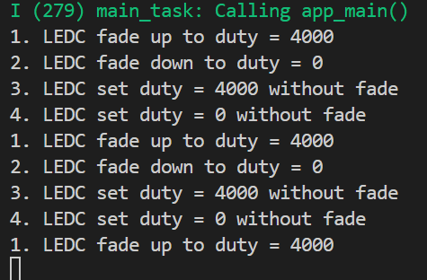
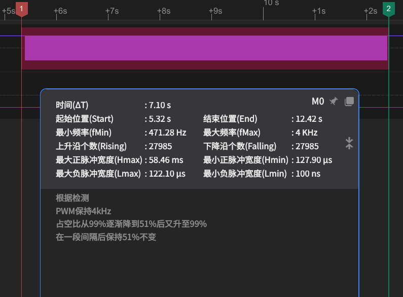
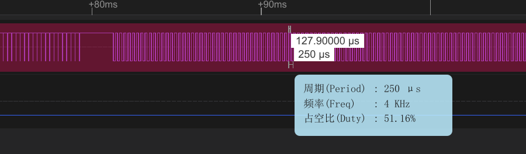
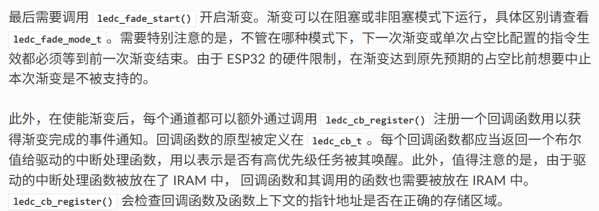

# LEDC fade 渐变PWM

## 粗略阅读README文档

文档简介示例演示使用**板载硬件控制模块**控制LED强度，即PWM。

硬件连接

构建烧录和示例输出

## 构建烧录和输出

* 选择芯片型号
* 选择端口号
* 配置项目(*由于4和18笔者设计的PCB都有使用，不作修改*)
* 点击**构建、烧录和监视**

* 通过逻辑分析仪显示


* 经过笔者搜集资料，**ESP32S3**不支持高速模式，无法进行高速实验

## 分析代码

### 头文件和宏定义

头文件导入了FREERTOS的任务和信号量模块，根据宏判断，只有ESP32会**定义高速通道**，其他只**定义低速定时器和通道**。**LEDC_TEST_DUTY** 定义了占空比；**LEDC_TEST_FADE_TIME**定义了一次淡入淡出需要的时间

```c
#include <stdio.h>
#include "freertos/FreeRTOS.h"
#include "freertos/task.h"
#include "freertos/semphr.h"
#include "driver/ledc.h"
#include "esp_err.h"

#if CONFIG_IDF_TARGET_ESP32
#define LEDC_HS_TIMER          LEDC_TIMER_0
#define LEDC_HS_MODE           LEDC_HIGH_SPEED_MODE
#define LEDC_HS_CH0_GPIO       (18)
#define LEDC_HS_CH0_CHANNEL    LEDC_CHANNEL_0
#define LEDC_HS_CH1_GPIO       (19)
#define LEDC_HS_CH1_CHANNEL    LEDC_CHANNEL_1
#endif
#define LEDC_LS_TIMER          LEDC_TIMER_1
#define LEDC_LS_MODE           LEDC_LOW_SPEED_MODE
#if !CONFIG_IDF_TARGET_ESP32
#define LEDC_LS_CH0_GPIO       (8)
#define LEDC_LS_CH0_CHANNEL    LEDC_CHANNEL_0
#define LEDC_LS_CH1_GPIO       (9)
#define LEDC_LS_CH1_CHANNEL    LEDC_CHANNEL_1
#endif
#define LEDC_LS_CH2_GPIO       (4)
#define LEDC_LS_CH2_CHANNEL    LEDC_CHANNEL_2
#define LEDC_LS_CH3_GPIO       (5)
#define LEDC_LS_CH3_CHANNEL    LEDC_CHANNEL_3

#define LEDC_TEST_CH_NUM       (4)
#define LEDC_TEST_DUTY         (4000)
#define LEDC_TEST_FADE_TIME    (3000)
```

### app_main()函数

main函数中进行了ledc定时器和通道的配置，fade模式的使用

1. 配置`ledc_timer` 结构体(*在basic中说明，此处不作详细介绍*)
2. 如果是ESP32，重新配置高速
3. 通过结构体数组配置多个通道 `.flags.output_invert` 使能(1)/禁用(0)输出反相。(*该成员带有嵌套*)
4. 循环配置四个输出
5. 使用硬件改变占空比
   * `ledc_fade_func_install` 使能渐变，参数0代表不分配中断标志
   * 配置 `ledc_cbs_t` 结构体，设置回调函数
   * 创建计数信号量示例
   * 为每个通道注册回调函数，通过信号量触发
   * `ledc_set_fade_with_time` 设置渐变
   * `ledc_fade_start` 开始渐变
   * 等待四次信号量获取，确保四个通道都完成
   * 再次渐变并等待完成
   * 直接写入并延时

```c
void app_main(void)
{
    int ch;

    /*
     * Prepare and set configuration of timers
     * that will be used by LED Controller
     */
    ledc_timer_config_t ledc_timer = {
        .duty_resolution = LEDC_TIMER_13_BIT, // resolution of PWM duty
        .freq_hz = 4000,                      // frequency of PWM signal
        .speed_mode = LEDC_LS_MODE,           // timer mode
        .timer_num = LEDC_LS_TIMER,            // timer index
        .clk_cfg = LEDC_AUTO_CLK,              // Auto select the source clock
    };
    // Set configuration of timer0 for high speed channels
    ledc_timer_config(&ledc_timer);
#ifdef CONFIG_IDF_TARGET_ESP32
    // Prepare and set configuration of timer1 for low speed channels
    ledc_timer.speed_mode = LEDC_HS_MODE;
    ledc_timer.timer_num = LEDC_HS_TIMER;
    ledc_timer_config(&ledc_timer);
#endif
    /*
     * Prepare individual configuration
     * for each channel of LED Controller
     * by selecting:
     * - controller's channel number
     * - output duty cycle, set initially to 0
     * - GPIO number where LED is connected to
     * - speed mode, either high or low
     * - timer servicing selected channel
     *   Note: if different channels use one timer,
     *         then frequency and bit_num of these channels
     *         will be the same
     */
    ledc_channel_config_t ledc_channel[LEDC_TEST_CH_NUM] = {
#if CONFIG_IDF_TARGET_ESP32
        {
            .channel    = LEDC_HS_CH0_CHANNEL,
            .duty       = 0,
            .gpio_num   = LEDC_HS_CH0_GPIO,
            .speed_mode = LEDC_HS_MODE,
            .hpoint     = 0,
            .timer_sel  = LEDC_HS_TIMER,
            .flags.output_invert = 0
        },
        {
            .channel    = LEDC_HS_CH1_CHANNEL,
            .duty       = 0,
            .gpio_num   = LEDC_HS_CH1_GPIO,
            .speed_mode = LEDC_HS_MODE,
            .hpoint     = 0,
            .timer_sel  = LEDC_HS_TIMER,
            .flags.output_invert = 0
        },
#else
        {
            .channel    = LEDC_LS_CH0_CHANNEL,
            .duty       = 0,
            .gpio_num   = LEDC_LS_CH0_GPIO,
            .speed_mode = LEDC_LS_MODE,
            .hpoint     = 0,
            .timer_sel  = LEDC_LS_TIMER,
            .flags.output_invert = 0
        },
        {
            .channel    = LEDC_LS_CH1_CHANNEL,
            .duty       = 0,
            .gpio_num   = LEDC_LS_CH1_GPIO,
            .speed_mode = LEDC_LS_MODE,
            .hpoint     = 0,
            .timer_sel  = LEDC_LS_TIMER,
            .flags.output_invert = 0
        },
#endif
        {
            .channel    = LEDC_LS_CH2_CHANNEL,
            .duty       = 0,
            .gpio_num   = LEDC_LS_CH2_GPIO,
            .speed_mode = LEDC_LS_MODE,
            .hpoint     = 0,
            .timer_sel  = LEDC_LS_TIMER,
            .flags.output_invert = 1
        },
        {
            .channel    = LEDC_LS_CH3_CHANNEL,
            .duty       = 0,
            .gpio_num   = LEDC_LS_CH3_GPIO,
            .speed_mode = LEDC_LS_MODE,
            .hpoint     = 0,
            .timer_sel  = LEDC_LS_TIMER,
            .flags.output_invert = 1
        },
    };

    // Set LED Controller with previously prepared configuration
    for (ch = 0; ch < LEDC_TEST_CH_NUM; ch++) {
        ledc_channel_config(&ledc_channel[ch]);
    }

    // Initialize fade service.
    ledc_fade_func_install(0);
    ledc_cbs_t callbacks = {
        .fade_cb = cb_ledc_fade_end_event
    };
    SemaphoreHandle_t counting_sem = xSemaphoreCreateCounting(LEDC_TEST_CH_NUM, 0);

    for (ch = 0; ch < LEDC_TEST_CH_NUM; ch++) {
        ledc_cb_register(ledc_channel[ch].speed_mode, ledc_channel[ch].channel, &callbacks, (void *) counting_sem);
    }

    while (1) {
        printf("1. LEDC fade up to duty = %d\n", LEDC_TEST_DUTY);
        for (ch = 0; ch < LEDC_TEST_CH_NUM; ch++) {
            ledc_set_fade_with_time(ledc_channel[ch].speed_mode,
                                    ledc_channel[ch].channel, LEDC_TEST_DUTY, LEDC_TEST_FADE_TIME);
            ledc_fade_start(ledc_channel[ch].speed_mode,
                            ledc_channel[ch].channel, LEDC_FADE_NO_WAIT);
        }

        for (int i = 0; i < LEDC_TEST_CH_NUM; i++) {
            xSemaphoreTake(counting_sem, portMAX_DELAY);
        }

        printf("2. LEDC fade down to duty = 0\n");
        for (ch = 0; ch < LEDC_TEST_CH_NUM; ch++) {
            ledc_set_fade_with_time(ledc_channel[ch].speed_mode,
                                    ledc_channel[ch].channel, 0, LEDC_TEST_FADE_TIME);
            ledc_fade_start(ledc_channel[ch].speed_mode,
                            ledc_channel[ch].channel, LEDC_FADE_NO_WAIT);
        }

        for (int i = 0; i < LEDC_TEST_CH_NUM; i++) {
            xSemaphoreTake(counting_sem, portMAX_DELAY);
        }

        printf("3. LEDC set duty = %d without fade\n", LEDC_TEST_DUTY);
        for (ch = 0; ch < LEDC_TEST_CH_NUM; ch++) {
            ledc_set_duty(ledc_channel[ch].speed_mode, ledc_channel[ch].channel, LEDC_TEST_DUTY);
            ledc_update_duty(ledc_channel[ch].speed_mode, ledc_channel[ch].channel);
        }
        vTaskDelay(1000 / portTICK_PERIOD_MS);

        printf("4. LEDC set duty = 0 without fade\n");
        for (ch = 0; ch < LEDC_TEST_CH_NUM; ch++) {
            ledc_set_duty(ledc_channel[ch].speed_mode, ledc_channel[ch].channel, 0);
            ledc_update_duty(ledc_channel[ch].speed_mode, ledc_channel[ch].channel);
        }
        vTaskDelay(1000 / portTICK_PERIOD_MS);
    }
}
```

### 回调函数

> 回调过程解释如下
> 

渐变完成事件通知会触发回调函数，该函数需要被放置在IARM中。触发函数后进行判断是FADE END事件，就进行**SemaphoreGive** 该信号量会加一并把 `taskAwoken`赋值为**pdTrue**

```c
static IRAM_ATTR bool cb_ledc_fade_end_event(const ledc_cb_param_t *param, void *user_arg)
{
    BaseType_t taskAwoken = pdFALSE;

    if (param->event == LEDC_FADE_END_EVT) {
        SemaphoreHandle_t counting_sem = (SemaphoreHandle_t) user_arg;
        xSemaphoreGiveFromISR(counting_sem, &taskAwoken);
    }

    return (taskAwoken == pdTRUE);
}
```

### 信号量流程分析

计数信号量创建**初始为0**，**最大为4**。
在每个FADE完成后调用回调，把信号量**加一**，全部完成后信号量为4。循环四次等待，**xSemaphoreTake** 每次读取大于0的信号量并对信号量**减一**，只有当4次均完成，才能完成循环，不然该函数会等待指定时间。
通过信号量的写入和读出，进行**任务间的配合**。同时设置合适的最大值，确保所有需要配合的任务都包含。

## 总结

进行了硬件控制PWM占空比的尝试，体会了信号量的使用和传递，还有回调函数的作用，通过信号量进行延时和配合。了解了fade模式的使用，还有高低速在硬件中的配置和对应宏定义，库文件的严谨。
