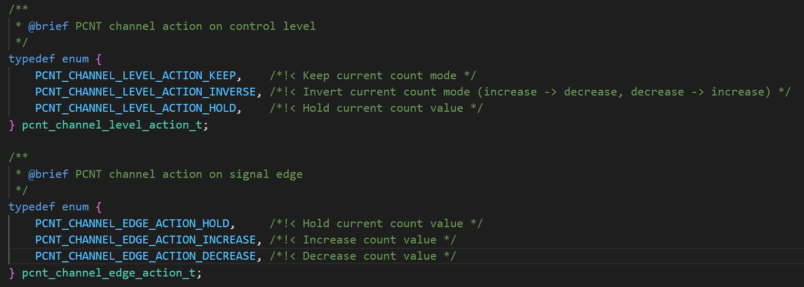
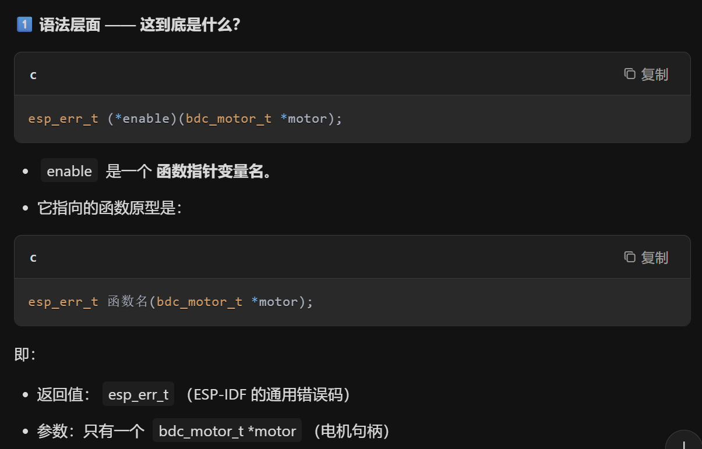
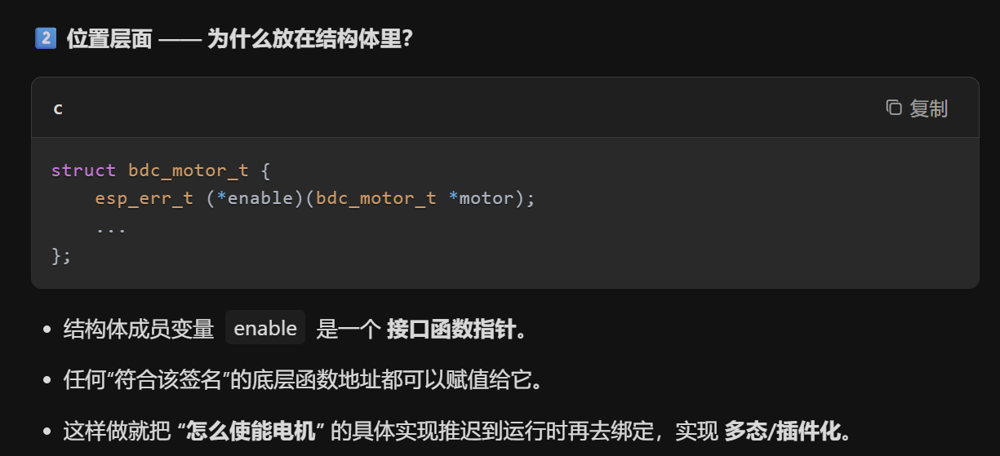
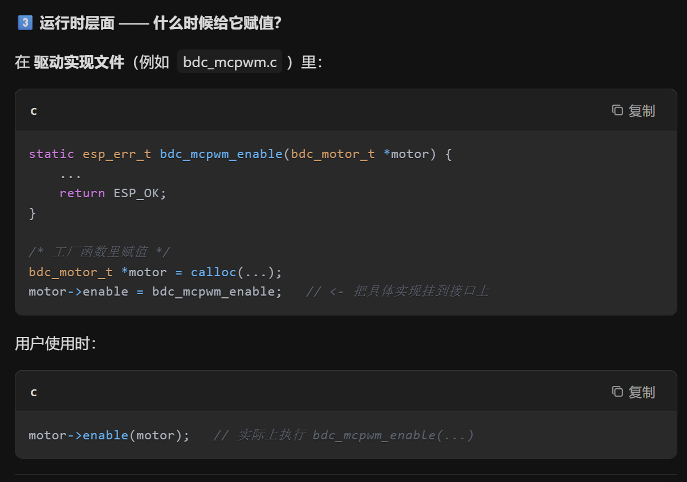

# MCPWM Brushed DC Motor MCPWM驱动有刷直流电机

> 本例程需要外接编码器和电机电路，但笔者手边没有相应设备，故本例主要对代码和思路进行理解和分析记录
> 笔者有做过带编码器的有刷直流电机实验和驱动，不是一点了解都没有凭空想象

## 粗略阅读README文档

文档简介示例主要通过两个特定的PWM信号驱动有刷电机，采用了bdc电机的组件和PID算法的组件。其他关于电机驱动的介绍笔者不作赘述。

硬件连接，构建烧录和示例输出

## 构建项目

> 笔者不打算进行实际烧录，但组件需要，进行项目构建，后续代码分析会去研究一下组件中对于功能的实现

* 选择芯片
* 点击**构建项目**

## 代码分析

### 头文件、结构体和宏定义

`"driver/pulse_cnt.h"` 是脉冲计数器的头文件，用于解码由旋转编码器产生的差分信号。`"bdc_motor.h"` 和 `"pid_ctrl.h"`分别是有刷直流电机驱动和PID控制的组件头文件。
宏定义及其作用 :

* **SERIAL_STUDIO_DEBUG** 用于后续调试的 `#if` 预操作
* **BDC_MCPWM_TIMER_RESOLUTION_HZ** 定义定时器频率(*ESP32 系列 MCPWM 时钟源 80 MHz，除 8 得 10 MHz，是常用且安全的分频*)
* **BDC_MCPWM_FREQ_HZ** PWM最终输出频率，即电机输入频率
* **BDC_MCPWM_DUTY_TICK_MAX** PWM最大占空比，限制输出
* **GPIO**相关宏 定义PWM和编码器的输入输出引脚
* **BDC_ENCODER_PCNT_HIGH_LIMIT** , **BDC_ENCODER_PCNT_LOW_LIMIT** (*ESP32 PCNT（脉冲计数器）的上下阈值，用来触发“限位/清 0/中断”*)
* **BDC_PID_LOOP_PERIOD_MS** 循环定时器的周期，用于检测和控制 (*100 Hz 控制环，电机机械时间常数远大于 10 ms，既快又不吃 CPU*)
* **BDC_PID_EXPECT_SPEED** 目标速度 (*单位是“每 10 ms 的编码器脉冲数”*)

**motor_control_context_t** 结构体统一电机控制的组件和变量

```c
#include <stdio.h>
#include "sdkconfig.h"
#include "freertos/FreeRTOS.h"
#include "freertos/task.h"
#include "freertos/queue.h"
#include "esp_log.h"
#include "esp_timer.h"
#include "driver/pulse_cnt.h"
#include "bdc_motor.h"
#include "pid_ctrl.h"

static const char *TAG = "example";

// Enable this config,  we will print debug formated string, which in return can be captured and parsed by Serial-Studio
#define SERIAL_STUDIO_DEBUG           CONFIG_SERIAL_STUDIO_DEBUG

#define BDC_MCPWM_TIMER_RESOLUTION_HZ 10000000 // 10MHz, 1 tick = 0.1us
#define BDC_MCPWM_FREQ_HZ             25000    // 25KHz PWM
#define BDC_MCPWM_DUTY_TICK_MAX       (BDC_MCPWM_TIMER_RESOLUTION_HZ / BDC_MCPWM_FREQ_HZ) // maximum value we can set for the duty cycle, in ticks
#define BDC_MCPWM_GPIO_A              7
#define BDC_MCPWM_GPIO_B              15

#define BDC_ENCODER_GPIO_A            36
#define BDC_ENCODER_GPIO_B            35
#define BDC_ENCODER_PCNT_HIGH_LIMIT   1000
#define BDC_ENCODER_PCNT_LOW_LIMIT    -1000

#define BDC_PID_LOOP_PERIOD_MS        10   // calculate the motor speed every 10ms
#define BDC_PID_EXPECT_SPEED          400  // expected motor speed, in the pulses counted by the rotary encoder

typedef struct {
    bdc_motor_handle_t motor;
    pcnt_unit_handle_t pcnt_encoder;
    pid_ctrl_block_handle_t pid_ctrl;
    int report_pulses;
} motor_control_context_t;
```

### app_main()函数

> 下述分析带有笔者主观理解，不是按行分析

1. 为后续使用初始化**motor_control_context_t**结构体变量`motor_ctrl_ctx`
2. 初始化`bdc_motor`即电机控制组件
   1. 设置pwm输出配置，包括**输出频率**，**输出引脚**
   2. 设置pwm使用[mcpwm](https://docs.espressif.com/projects/esp-idf/zh_CN/stable/esp32/api-reference/peripherals/mcpwm.html)组配置 `group_id`指定组**ID**，`resolution_hz`指定**tick分辨率**
   3. `bdc_motor_new_mcpwm_device` **写入配置创建实例**并**绑定句柄**写入`motor_ctrl_ctx.motor`结构体指定位置
3. 初始化`pcnt` [脉冲计数器](https://docs.espressif.com/projects/esp-idf/zh_CN/stable/esp32/api-reference/peripherals/pcnt.html)实例
   1. 配置脉冲计数值**上下阈值**，`.flags.accum_count = true` 启用累加功能(*软件在硬件计数值溢出的时候进行累加保存*)
   2. `pcnt_new_unit` 分配pcnt单元并初始化
   3. `pcnt_unit_set_glitch_filter` 配置**毛刺滤波器**并使能 (*`max_glitch_ns` 参数设置了最大的毛刺宽度，单位为纳秒。如果一个信号脉冲的宽度小于该数值，则该信号会被认定为噪声而不会触发计数器操作。*)
   4. `pcnt_new_channel` 安装**pcnt通道**，分别安装A通道和B通道，用来读取正交编码器AB相。`edge_gpio_num`用于指定**边沿信号对应的引脚**，`level_gpio_num`用于指定**电平信号对应引脚**。(*以`pcnt_chan_a`为例，其监测GPIO_A的跳变，读取GPIO_B的电平。即edge是触发脚，在上下边均可以触发；level是检测脚，在触发时检测判断计数加或者减*)
   5. `pcnt_channel_set_edge_action` 和 `pcnt_channel_set_level_action` 进行通道信号设置操作。两函数参数分别为 **对上升沿/高电平的操作**，**对下降沿/低电平的操作**借用AI分析的表格进行分析，在边沿函数中只考虑**加一或者减一**，在电平函数中只考虑**保持或者取反**，该操作针对边沿函数的加减。(*对于HOLD参数，意义为只要触发某个情况，就直接冻结计数器*)

        | A 相跳变 | 此时 B 电平 | 规则组合        | 结果            |
        | ----- | ------- | ----------- | ------------- |
        | 上升沿   | 高       | 上升沿=-1，高=保持 | **-1**        |
        | 上升沿   | 低       | 上升沿=-1，低=取反 | **+1**（-1 取反） |
        | 下降沿   | 高       | 下降沿=+1，高=保持 | **+1**        |
        | 下降沿   | 低       | 下降沿=+1，低=取反 | **-1**（+1 取反） |

        | B 相跳变 | 此时 A 电平 | 规则组合        | 结果     |
        | ----- | ------- | ----------- | ------ |
        | 上升沿   | 高       | 上升沿=+1，高=保持 | **+1** |
        | 上升沿   | 低       | 上升沿=+1，低=取反 | **-1** |
        | 下降沿   | 高       | 下降沿=-1，高=保持 | **-1** |
        | 下降沿   | 低       | 下降沿=-1，低=取反 | **+1** |

   6. `pcnt_unit_add_watch_point` 添加**观察点**，当计数器到达观察点时会**触发事件**，可以注册回调函数。(*常用观察点包括零点，最大最小值，或者其他阈值，观察点有限*)
4. 对**pcnt** 使能，计数清零，启动
5. `pid_runtime_param` 作为PID参数配置
   * `kp`,`ki`,`kd` 作为系数参数
   * `cal_type` 选择PID类型。**PID_CAL_TYPE_INCREMENTAL** 为增量式 `du(k) = (e(k)-e(k-1))*Kp + (e(k)-2*e(k-1)+e(k-2))*Kd + e(k)*Ki ; u(k) = du(k) + u(k-1)`，**PID_CAL_TYPE_POSITIONAL** 为位置式 `u(k) = e(k)*Kp + (e(k)-e(k-1))*Kd + integral*Ki`
   * `max_output` 和 `min_output` 指定**输出最大和最小限幅**
   * `max_integral` 和 `min_integral` 指定**积分最大和最小限幅**
6. `pid_new_control_block` 导入配置，指定句柄，新建组件实例
7. 创建[ESP软件定时器](https://docs.espressif.com/projects/esp-idf/zh_CN/stable/esp32/api-reference/system/esp_timer.html) `esp_timer_create_args_t`  结构体中
   * `callback` 指定定时器超时调用的回调函数
   * `arg` 作为传入参数
   * `name` *计时器名称，用于 esp_timer_dump（） 函数。*
8. `esp_timer_create` 创建定时器 ， `esp_timer_start_periodic` 启动周期性定时器(*第二个参数默认单位为微秒*)
9. `bdc_motor_enable` 使能电机驱动 `bdc_motor_forward`设置方向为正转

10. 主循环不进行工作，在宏被置位时输出调试信息

```c
void app_main(void)
{
    static motor_control_context_t motor_ctrl_ctx = {
        .pcnt_encoder = NULL,
    };

    ESP_LOGI(TAG, "Create DC motor");
    bdc_motor_config_t motor_config = {
        .pwm_freq_hz = BDC_MCPWM_FREQ_HZ,
        .pwma_gpio_num = BDC_MCPWM_GPIO_A,
        .pwmb_gpio_num = BDC_MCPWM_GPIO_B,
    };
    bdc_motor_mcpwm_config_t mcpwm_config = {
        .group_id = 0,
        .resolution_hz = BDC_MCPWM_TIMER_RESOLUTION_HZ,
    };
    bdc_motor_handle_t motor = NULL;
    ESP_ERROR_CHECK(bdc_motor_new_mcpwm_device(&motor_config, &mcpwm_config, &motor));
    motor_ctrl_ctx.motor = motor;

    ESP_LOGI(TAG, "Init pcnt driver to decode rotary signal");
    pcnt_unit_config_t unit_config = {
        .high_limit = BDC_ENCODER_PCNT_HIGH_LIMIT,
        .low_limit = BDC_ENCODER_PCNT_LOW_LIMIT,
        .flags.accum_count = true, // enable counter accumulation
    };
    pcnt_unit_handle_t pcnt_unit = NULL;
    ESP_ERROR_CHECK(pcnt_new_unit(&unit_config, &pcnt_unit));
    pcnt_glitch_filter_config_t filter_config = {
        .max_glitch_ns = 1000,
    };
    ESP_ERROR_CHECK(pcnt_unit_set_glitch_filter(pcnt_unit, &filter_config));
    pcnt_chan_config_t chan_a_config = {
        .edge_gpio_num = BDC_ENCODER_GPIO_A,
        .level_gpio_num = BDC_ENCODER_GPIO_B,
    };
    pcnt_channel_handle_t pcnt_chan_a = NULL;
    ESP_ERROR_CHECK(pcnt_new_channel(pcnt_unit, &chan_a_config, &pcnt_chan_a));
    pcnt_chan_config_t chan_b_config = {
        .edge_gpio_num = BDC_ENCODER_GPIO_B,
        .level_gpio_num = BDC_ENCODER_GPIO_A,
    };
    pcnt_channel_handle_t pcnt_chan_b = NULL;
    ESP_ERROR_CHECK(pcnt_new_channel(pcnt_unit, &chan_b_config, &pcnt_chan_b));
    ESP_ERROR_CHECK(pcnt_channel_set_edge_action(pcnt_chan_a, PCNT_CHANNEL_EDGE_ACTION_DECREASE, PCNT_CHANNEL_EDGE_ACTION_INCREASE));
    ESP_ERROR_CHECK(pcnt_channel_set_level_action(pcnt_chan_a, PCNT_CHANNEL_LEVEL_ACTION_KEEP, PCNT_CHANNEL_LEVEL_ACTION_INVERSE));
    ESP_ERROR_CHECK(pcnt_channel_set_edge_action(pcnt_chan_b, PCNT_CHANNEL_EDGE_ACTION_INCREASE, PCNT_CHANNEL_EDGE_ACTION_DECREASE));
    ESP_ERROR_CHECK(pcnt_channel_set_level_action(pcnt_chan_b, PCNT_CHANNEL_LEVEL_ACTION_KEEP, PCNT_CHANNEL_LEVEL_ACTION_INVERSE));
    ESP_ERROR_CHECK(pcnt_unit_add_watch_point(pcnt_unit, BDC_ENCODER_PCNT_HIGH_LIMIT));
    ESP_ERROR_CHECK(pcnt_unit_add_watch_point(pcnt_unit, BDC_ENCODER_PCNT_LOW_LIMIT));
    ESP_ERROR_CHECK(pcnt_unit_enable(pcnt_unit));
    ESP_ERROR_CHECK(pcnt_unit_clear_count(pcnt_unit));
    ESP_ERROR_CHECK(pcnt_unit_start(pcnt_unit));
    motor_ctrl_ctx.pcnt_encoder = pcnt_unit;

    ESP_LOGI(TAG, "Create PID control block");
    pid_ctrl_parameter_t pid_runtime_param = {
        .kp = 0.6,
        .ki = 0.4,
        .kd = 0.2,
        .cal_type = PID_CAL_TYPE_INCREMENTAL,
        .max_output   = BDC_MCPWM_DUTY_TICK_MAX - 1,
        .min_output   = 0,
        .max_integral = 1000,
        .min_integral = -1000,
    };
    pid_ctrl_block_handle_t pid_ctrl = NULL;
    pid_ctrl_config_t pid_config = {
        .init_param = pid_runtime_param,
    };
    ESP_ERROR_CHECK(pid_new_control_block(&pid_config, &pid_ctrl));
    motor_ctrl_ctx.pid_ctrl = pid_ctrl;

    ESP_LOGI(TAG, "Create a timer to do PID calculation periodically");
    const esp_timer_create_args_t periodic_timer_args = {
        .callback = pid_loop_cb,
        .arg = &motor_ctrl_ctx,
        .name = "pid_loop"
    };
    esp_timer_handle_t pid_loop_timer = NULL;
    ESP_ERROR_CHECK(esp_timer_create(&periodic_timer_args, &pid_loop_timer));

    ESP_LOGI(TAG, "Enable motor");
    ESP_ERROR_CHECK(bdc_motor_enable(motor));
    ESP_LOGI(TAG, "Forward motor");
    ESP_ERROR_CHECK(bdc_motor_forward(motor));

    ESP_LOGI(TAG, "Start motor speed loop");
    ESP_ERROR_CHECK(esp_timer_start_periodic(pid_loop_timer, BDC_PID_LOOP_PERIOD_MS * 1000));

    while (1) {
        vTaskDelay(pdMS_TO_TICKS(100));
        // the following logging format is according to the requirement of serial-studio frame format
        // also see the dashboard config file `serial-studio-dashboard.json` for more information
#if SERIAL_STUDIO_DEBUG
        printf("/*%d*/\r\n", motor_ctrl_ctx.report_pulses);
#endif
    }
}
```

### 定时器周期回调函数

回调函数先通过参数拿到储存信息的结构体，并**解析其中指针**。通过`pcnt_unit_get_count`获取**计数器值**，**相减**得到**真正该检测周期内的值**。存入`ctx->report_pulses`用于监视输出，并用于计算误差。调用`pid_compute`进行PID计算得到**new_speed**，`bdc_motor_set_speed`设置**new_speed**给电机

```c
static void pid_loop_cb(void *args)
{
    static int last_pulse_count = 0; 
    // 编译器会把这句话转换成一次性初始化，即last_pulse_count只在第一次被赋值为0，后续储存在静态static区域的均为上一次的值
    motor_control_context_t *ctx = (motor_control_context_t *)args;
    pcnt_unit_handle_t pcnt_unit = ctx->pcnt_encoder;
    pid_ctrl_block_handle_t pid_ctrl = ctx->pid_ctrl;
    bdc_motor_handle_t motor = ctx->motor;

    // get the result from rotary encoder
    int cur_pulse_count = 0;
    pcnt_unit_get_count(pcnt_unit, &cur_pulse_count);
    int real_pulses = cur_pulse_count - last_pulse_count;
    last_pulse_count = cur_pulse_count;
    ctx->report_pulses = real_pulses;

    // calculate the speed error
    float error = BDC_PID_EXPECT_SPEED - real_pulses;
    float new_speed = 0;

    // set the new speed
    pid_compute(pid_ctrl, error, &new_speed);
    bdc_motor_set_speed(motor, (uint32_t)new_speed);
}
```

### 组件函数简单解释

#### PID控制组件

函数使用基本都在头文件中有介绍，笔者精力有限，不作逐块解释。和esp-idf一贯风格相似，需要**创建实例和对应句柄**，通过**句柄为各参数导入配置和信息**，并**共同进行修改**，核心函数为`pid_compute`负责具体的计算。其他关于结构体和调用不作具体解释

#### BDC_Motor 控制组件

笔者先吐槽一句，这组件封装的是真 ** 好，笔者向AI多次询问，才终于看懂了函数的调用方法。具体见[bdc_motor函数](#app_main函数)。总而言之， **组件在结构体中定义了函数指针和传入参数，只要调用方式正确，调用结构体成员就是调用函数** ，然后把结构体内的函数指针绑定到具体硬件操作层面的自定义函数中。如本例就是mcpwm外设的相关操作。
[mcpwm相关操作](https://docs.espressif.com/projects/esp-idf/zh_CN/stable/esp32/api-reference/peripherals/mcpwm.html)
该组件暴露的外部函数主要有**使/失能**，**设置速度**，**设置方向**，**关闭** 等。具体实现等后续示例，笔者进行研究以后再作解释

## 总结

本示例采用组件的方式展示了mcpwm控制电机和pid算法的速度控制，由于笔者有过类似的实践，算是见猎心喜。本例主要学习到了pcnt脉冲计数器的使用，再次了解了PID算法，熟悉了函数调用，结构体函数封装的操作，感受了mcpwm复杂而强大的功能。后续例程继续对其应用和配置进行深入了解。