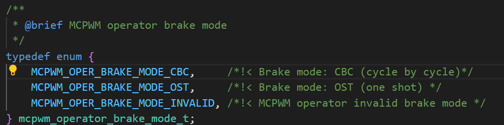

# MCPWM BLDC Motor Control with HALL Sensor 带HALL传感器的MCPWM无刷直流电机控制

> 笔者实验环境有限，故例程学习重点放在代码分析

## 粗略阅读README文档

文档简介MCPWM外围设备可以通过模块间时间子模块产出多对互补PWM，适用于无刷电机应用。

硬件连接、构建烧录和示例输出

## 构建、烧录和监视

* 选择目标芯片
* 选择端口号
* 配置引脚
* 电机**构建、烧录和监视**
* 由于并未连接传感器，无法获取霍尔传感器的值，无法正常演示

## 代码分析

### 头文件和宏定义

`"driver/mcpwm_prelude.h"` 头文件，*是 ESP-IDF 中 MCPWM（Motor Control Pulse-Width Modulator）外设的“前置头”*，把mcpwm需要的接口统一导入，还定义了其他结构体
`BLDC_MCPWM_TIMER_RESOLUTION_HZ` 规定**mcpwm定时器频率**，`BLDC_MCPWM_PERIOD` 定义**一个周期500个tick**，即输出频率20kHz，是典型的BLDC开关频率，`BLDC_SPIN_DIRECTION_CCW` 定义**选择方向**，`BLDC_SPEED_UPDATE_PERIOD_US` 定义控制周期。
后续宏定义和引脚有关，包括芯片使能，故障中断，三相各两路pwm输出，三路霍尔传感器检测输入。
mcpwm的**operator**操作器分配，**generator**生成器分配

```c
#include <stdio.h>
#include "freertos/FreeRTOS.h"
#include "freertos/task.h"
#include "esp_attr.h"
#include "esp_log.h"
#include "esp_timer.h"
#include "driver/mcpwm_prelude.h"
#include "driver/gpio.h"

#define BLDC_MCPWM_TIMER_RESOLUTION_HZ 10000000 // 10MHz, 1 tick = 0.1us
#define BLDC_MCPWM_PERIOD              500      // 50us, 20KHz
#define BLDC_SPIN_DIRECTION_CCW        false    // define the spin direction
#define BLDC_SPEED_UPDATE_PERIOD_US    200000   // 200ms

#define BLDC_DRV_EN_GPIO          46
#define BLDC_DRV_FAULT_GPIO       10
#define BLDC_PWM_UH_GPIO          47
#define BLDC_PWM_UL_GPIO          21
#define BLDC_PWM_VH_GPIO          14
#define BLDC_PWM_VL_GPIO          13
#define BLDC_PWM_WH_GPIO          12
#define BLDC_PWM_WL_GPIO          11
#define HALL_CAP_U_GPIO           4
#define HALL_CAP_V_GPIO           5
#define HALL_CAP_W_GPIO           6

#define BLDC_MCPWM_OP_INDEX_U     0
#define BLDC_MCPWM_OP_INDEX_V     1
#define BLDC_MCPWM_OP_INDEX_W     2
#define BLDC_MCPWM_GEN_INDEX_HIGH 0
#define BLDC_MCPWM_GEN_INDEX_LOW  1
```

### app_main()函数

函数完整演示了mcpwm配置的过程，和其与GPIO绑定操作。

1. `gpio_config` 进行GPIO配置，`pin_bit_mask` 通过**指定‘1’位确定对哪个引脚进行控制**，`gpio_set_level` 初始化引脚为低电平
2. 配置`mcpwm_timer_config_t`类型结构体
   * `group_id` 设置使用**mcpwm组ID**
   * `clk_src` 设置**时钟源**
   * `resolution_hz` 设置**定时器预期分辨率**
   * `count_mode` 设置**定时器计数模式**，向上/向下，向上和向下
   * `period_ticks` 设置**定时器周期**
3. `mcpwm_new_timer` 新建**定时器实例** [MCPWM定时器](https://docs.espressif.com/projects/esp-idf/zh_CN/stable/esp32/api-reference/peripherals/mcpwm.html#id3)
4. `mcpwm_new_operator` 新建**操作器实例**，不作特殊配置，只指定mcpwm组ID为0，句柄储存在**operators**数组中 [MCPWM操作器](https://docs.espressif.com/projects/esp-idf/zh_CN/stable/esp32/api-reference/peripherals/mcpwm.html#id5)
5. `mcpwm_operator_connect_timer` **连接**分配的 MCPWM **定时器**和 MCPWM **操作器**。连接后，操作器即可将定时器作为时基，生成所需的 PWM 波形(*需注意，MCPWM 定时器和操作器必须位于同一个组中。否则，将返回 ESP_ERR_INVALID_ARG 错误。*)
6. `mcpwm_new_comparator` 为操作器**分配比较器**，`.flags.update_cmp_on_tez` 设置当定时器计数为零时是否更新比较阈值
7. `mcpwm_comparator_set_compare_value` 设置比较值初始为0，由于*电平输出取决于计数值和比较值的大小*，比较值设为0代表PWM输出使用不变化
8. `mcpwm_gpio_fault_config_t` 配置专门的故障引脚 [MCPWM故障](https://docs.espressif.com/projects/esp-idf/zh_CN/stable/esp32/api-reference/peripherals/mcpwm.html#id11)
   * `gpio_num` **引脚**编号
   * `group_id` 属于哪个**mcpwm组**
   * `.flags.active_level` 什么**信号**被视为**有效**
   * `.flags.pull_up` 是否开启**内部上拉**
9. `mcpwm_new_gpio_fault` 创建故障配置
10. `mcpwm_brake_config_t` 配置故障时操作器的制动 [故障制动](https://docs.espressif.com/projects/esp-idf/zh_CN/stable/esp32/api-reference/peripherals/mcpwm.html#mcpwm-faults-and-brake-actions)
    * `brake_mode` **故障模式** CBC模式会在故障消失后自行恢复，OST需要手动进行恢复
    
    * `fault` 设置响应的故障类型(*绑定配置的**故障器***)
    * `.flags.cbc_recover_on_tez` 为**true**，代表故障会在每个周期结束自动解除
11. `mcpwm_operator_set_brake_on_fault` 循环中将同一套故障配置分配给三个操作器
12. `mcpwm_new_generator` 创建**生成器实例**储存在 `generators` 二维数组中，`gen_gpio_num` 决定生成器对应的GPIO编号  [MCPWM生成器](https://docs.espressif.com/projects/esp-idf/zh_CN/stable/esp32/api-reference/peripherals/mcpwm.html#id9)
13. 具体配置生成器 `mcpwm_generator_set_action_on_xxx` (*BLDC_MCPWM_GEN_INDEX_HIGH 和 BLDC_MCPWM_GEN_INDEX_LOW 值分别为 0 和 1，用于二维数组索引*)
    * `on_timer_event` **定时器操作**事件，具体事件由**MCPWM_GEN_TIMER_EVENT_ACTION**宏改造，该行作用为一个计数周期结束后把PWM输出拉高
    * `on_compare_event`  **比较器操作**事件，**MCPWM_GEN_COMPARE_EVENT_ACTION** 定义向上到达比较值后输出拉低
    * `on_brake_event` **故障**事件， **MCPWM_GEN_COMPARE_EVENT_ACTION** 设置故障后制动电平为低
    * 一个循环中对同一操作器的两个引脚进行相同配置，后续可以进行反相等操作 (*笔者直接复制的源代码，故障事件似乎重复定义了*)
14. `mcpwm_generator_set_dead_time` 设置**死区时间** [死区](https://docs.espressif.com/projects/esp-idf/zh_CN/stable/esp32/api-reference/peripherals/mcpwm.html#mcpwm-dead-time)
    * `posedge_delay_ticks` 对高通道设置**PWM上升沿延时**
    * `negedge_delay_ticks = 5` 对低通道设置**PWM下降沿延时**
    * `.flags.invert_output` 对低通道进行**取反**操作
15. `mcpwm_generator_set_force_level` 软件**强制决定生成器电平**，最后一个参数 **hold_on** 为true，代表需要操作手动移除强制电平
16. `mcpwm_new_capture_timer`新建**捕获定时器**，用于霍尔传感器  [MCPWM捕获定时](https://docs.espressif.com/projects/esp-idf/zh_CN/stable/esp32/api-reference/peripherals/mcpwm.html#id15)
17. `cap_channel_config` 进行捕获配置
    * `prescale` 设置输入**信号预分频** 等于1代表不分频，每0.1us都采样
    * `.flags.pull_up` 为 true ，启用**内部上拉**
    * `.flags.neg_edge` **捕获上升沿** ； `.flags.pos_edge` **捕获下降沿**
18. `mcpwm_new_capture_channel` 新建捕获通道，`gpio_num` 绑定引脚
19. `TaskHandle_t task_to_notify = xTaskGetCurrentTaskHandle();` 获得**当前运行任务**的句柄 (*当前任务指执行到这行代码时正在运行的那个任务，本例就代表app_main所在任务*)
20. `mcpwm_capture_channel_register_event_callbacks` 为捕获定时器注册回调函数
21. `mcpwm_capture_channel_enable` 使能捕获通道 ；`mcpwm_capture_timer_enable` 使能捕获定时器 ； `mcpwm_capture_timer_start` 启动捕获定时器 (*捕获定时器模块是独立子模块，不依赖于 MCPWM 操作器工作。捕获模块包括一个专用的定时器和几个独立的通道，每个通道都与 GPIO 相连。GPIO 上的脉冲触发捕获定时器以存储时间基准值，随后通过中断进行通知。此模块有助于更加精准地测量脉宽。此外，捕获定时器也可以通过 MCPWM 同步子模块进行同步。*)
22. `esp_timer_create` 设置软件定时器并绑定回调函数，`esp_timer_start_periodic` 以宏定义周期执行一次回调函数，进行速度更新
23. `mcpwm_timer_enable` 使能mcpwm定时器，`mcpwm_timer_start_stop` 立即启用定时器
24. 主循环中进行霍尔状态和换向的操作
    * `hall_sensor_value` 保存当前霍尔状态（1~6 代表 6 个有效扇区，0/7 为非法）
    * `s_hall_actions`  执行特定的换区函数
    * `ulTaskNotifyTake(pdTRUE, portMAX_DELAY);` 以始终阻塞的状态等待任务通知，等待过程中任务休眠 (*获取的task_to_notify即为本任务的句柄，用于其他地方发送任务通知*)

```c
void app_main(void)
{
    ESP_LOGI(TAG, "Disable MOSFET gate");
    gpio_config_t drv_en_config = {
        .mode = GPIO_MODE_OUTPUT,
        .pin_bit_mask = 1ULL << BLDC_DRV_EN_GPIO,
    };
    ESP_ERROR_CHECK(gpio_config(&drv_en_config));
    gpio_set_level(BLDC_DRV_EN_GPIO, 0);

    ESP_LOGI(TAG, "Create MCPWM timer");
    mcpwm_timer_handle_t timer = NULL;
    mcpwm_timer_config_t timer_config = {
        .group_id = 0,
        .clk_src = MCPWM_TIMER_CLK_SRC_DEFAULT,
        .resolution_hz = BLDC_MCPWM_TIMER_RESOLUTION_HZ,
        .count_mode = MCPWM_TIMER_COUNT_MODE_UP,
        .period_ticks = BLDC_MCPWM_PERIOD,
    };
    ESP_ERROR_CHECK(mcpwm_new_timer(&timer_config, &timer));

    ESP_LOGI(TAG, "Create MCPWM operator");
    mcpwm_oper_handle_t operators[3];
    mcpwm_operator_config_t operator_config = {
        .group_id = 0,
    };
    for (int i = 0; i < 3; i++) {
        ESP_ERROR_CHECK(mcpwm_new_operator(&operator_config, &operators[i]));
    }

    ESP_LOGI(TAG, "Connect operators to the same timer");
    for (int i = 0; i < 3; i++) {
        ESP_ERROR_CHECK(mcpwm_operator_connect_timer(operators[i], timer));
    }

    ESP_LOGI(TAG, "Create comparators");
    mcpwm_cmpr_handle_t comparators[3];
    mcpwm_comparator_config_t compare_config = {
        .flags.update_cmp_on_tez = true,
    };
    for (int i = 0; i < 3; i++) {
        ESP_ERROR_CHECK(mcpwm_new_comparator(operators[i], &compare_config, &comparators[i]));
        // set compare value to 0, we will adjust the speed in a period timer callback
        ESP_ERROR_CHECK(mcpwm_comparator_set_compare_value(comparators[i], 0));
    }

    ESP_LOGI(TAG, "Create over current fault detector");
    mcpwm_fault_handle_t over_cur_fault = NULL;
    mcpwm_gpio_fault_config_t gpio_fault_config = {
        .gpio_num = BLDC_DRV_FAULT_GPIO,
        .group_id = 0,
        .flags.active_level = 0, // low level means fault, refer to DRV8302 datasheet
        .flags.pull_up = true,   // internally pull up
    };
    ESP_ERROR_CHECK(mcpwm_new_gpio_fault(&gpio_fault_config, &over_cur_fault));

    ESP_LOGI(TAG, "Set brake mode on the fault event");
    mcpwm_brake_config_t brake_config = {
        .brake_mode = MCPWM_OPER_BRAKE_MODE_CBC,
        .fault = over_cur_fault,
        .flags.cbc_recover_on_tez = true,
    };
    for (int i = 0; i < 3; i++) {
        ESP_ERROR_CHECK(mcpwm_operator_set_brake_on_fault(operators[i], &brake_config));
    }

    ESP_LOGI(TAG, "Create PWM generators");
    mcpwm_gen_handle_t generators[3][2] = {};
    mcpwm_generator_config_t gen_config = {};
    const int gen_gpios[3][2] = {
        {BLDC_PWM_UH_GPIO, BLDC_PWM_UL_GPIO},
        {BLDC_PWM_VH_GPIO, BLDC_PWM_VL_GPIO},
        {BLDC_PWM_WH_GPIO, BLDC_PWM_WL_GPIO},
    };
    for (int i = 0; i < 3; i++) {
        for (int j = 0; j < 2; j++) {
            gen_config.gen_gpio_num = gen_gpios[i][j];
            ESP_ERROR_CHECK(mcpwm_new_generator(operators[i], &gen_config, &generators[i][j]));
        }
    }

    ESP_LOGI(TAG, "Set generator actions");
    // gen_high and gen_low output the same waveform after the following configuration
    // we will use the dead time module to add edge delay, also make gen_high and gen_low complementary
    for (int i = 0; i < 3; i++) {
        ESP_ERROR_CHECK(mcpwm_generator_set_action_on_timer_event(generators[i][BLDC_MCPWM_GEN_INDEX_HIGH],
                                                                  MCPWM_GEN_TIMER_EVENT_ACTION(MCPWM_TIMER_DIRECTION_UP, MCPWM_TIMER_EVENT_EMPTY, MCPWM_GEN_ACTION_HIGH)));
        ESP_ERROR_CHECK(mcpwm_generator_set_action_on_compare_event(generators[i][BLDC_MCPWM_GEN_INDEX_HIGH],
                                                                    MCPWM_GEN_COMPARE_EVENT_ACTION(MCPWM_TIMER_DIRECTION_UP, comparators[i], MCPWM_GEN_ACTION_LOW)));
        ESP_ERROR_CHECK(mcpwm_generator_set_action_on_brake_event(generators[i][BLDC_MCPWM_GEN_INDEX_HIGH],
                                                                  MCPWM_GEN_BRAKE_EVENT_ACTION(MCPWM_TIMER_DIRECTION_UP, MCPWM_OPER_BRAKE_MODE_CBC, MCPWM_GEN_ACTION_LOW)));
        ESP_ERROR_CHECK(mcpwm_generator_set_action_on_brake_event(generators[i][BLDC_MCPWM_GEN_INDEX_HIGH],
                                                                  MCPWM_GEN_BRAKE_EVENT_ACTION(MCPWM_TIMER_DIRECTION_UP, MCPWM_OPER_BRAKE_MODE_CBC, MCPWM_GEN_ACTION_LOW)));

        ESP_ERROR_CHECK(mcpwm_generator_set_action_on_timer_event(generators[i][BLDC_MCPWM_GEN_INDEX_LOW],
                                                                  MCPWM_GEN_TIMER_EVENT_ACTION(MCPWM_TIMER_DIRECTION_UP, MCPWM_TIMER_EVENT_EMPTY, MCPWM_GEN_ACTION_HIGH)));
        ESP_ERROR_CHECK(mcpwm_generator_set_action_on_compare_event(generators[i][BLDC_MCPWM_GEN_INDEX_LOW],
                                                                    MCPWM_GEN_COMPARE_EVENT_ACTION(MCPWM_TIMER_DIRECTION_UP, comparators[i], MCPWM_GEN_ACTION_LOW)));
        ESP_ERROR_CHECK(mcpwm_generator_set_action_on_brake_event(generators[i][BLDC_MCPWM_GEN_INDEX_LOW],
                                                                  MCPWM_GEN_BRAKE_EVENT_ACTION(MCPWM_TIMER_DIRECTION_UP, MCPWM_OPER_BRAKE_MODE_CBC, MCPWM_GEN_ACTION_LOW)));
        ESP_ERROR_CHECK(mcpwm_generator_set_action_on_brake_event(generators[i][BLDC_MCPWM_GEN_INDEX_LOW],
                                                                  MCPWM_GEN_BRAKE_EVENT_ACTION(MCPWM_TIMER_DIRECTION_UP, MCPWM_OPER_BRAKE_MODE_CBC, MCPWM_GEN_ACTION_LOW)));
    }

    ESP_LOGI(TAG, "Setup deadtime");
    mcpwm_dead_time_config_t dt_config = {
        .posedge_delay_ticks = 5,
    };
    for (int i = 0; i < 3; i++) {
        ESP_ERROR_CHECK(mcpwm_generator_set_dead_time(generators[i][BLDC_MCPWM_GEN_INDEX_HIGH], generators[i][BLDC_MCPWM_GEN_INDEX_HIGH], &dt_config));
    }
    dt_config = (mcpwm_dead_time_config_t) {
        .negedge_delay_ticks = 5,
        .flags.invert_output = true,
    };
    for (int i = 0; i < 3; i++) {
        ESP_ERROR_CHECK(mcpwm_generator_set_dead_time(generators[i][BLDC_MCPWM_GEN_INDEX_LOW], generators[i][BLDC_MCPWM_GEN_INDEX_LOW], &dt_config));
    }

    ESP_LOGI(TAG, "Turn off all the gates");
    for (int i = 0; i < 3; i++) {
        ESP_ERROR_CHECK(mcpwm_generator_set_force_level(generators[i][BLDC_MCPWM_GEN_INDEX_HIGH], 0, true));
        // because gen_low is inverted by dead time module, so we need to set force level to 1
        ESP_ERROR_CHECK(mcpwm_generator_set_force_level(generators[i][BLDC_MCPWM_GEN_INDEX_LOW], 1, true));
    }

    ESP_LOGI(TAG, "Create Hall sensor capture channels");
    mcpwm_cap_timer_handle_t cap_timer = NULL;
    mcpwm_capture_timer_config_t cap_timer_config = {
        .group_id = 0,
        .clk_src = MCPWM_CAPTURE_CLK_SRC_DEFAULT,
    };
    ESP_ERROR_CHECK(mcpwm_new_capture_timer(&cap_timer_config, &cap_timer));
    mcpwm_cap_channel_handle_t cap_channels[3];
    mcpwm_capture_channel_config_t cap_channel_config = {
        .prescale = 1,
        .flags.pull_up = true,
        .flags.neg_edge = true,
        .flags.pos_edge = true,
    };
    const int cap_chan_gpios[3] = {HALL_CAP_U_GPIO, HALL_CAP_V_GPIO, HALL_CAP_W_GPIO};
    for (int i = 0; i < 3; i++) {
        cap_channel_config.gpio_num = cap_chan_gpios[i];
        ESP_ERROR_CHECK(mcpwm_new_capture_channel(cap_timer, &cap_channel_config, &cap_channels[i]));
    }

    ESP_LOGI(TAG, "Register event callback for capture channels");
    TaskHandle_t task_to_notify = xTaskGetCurrentTaskHandle();
    for (int i = 0; i < 3; i++) {
        mcpwm_capture_event_callbacks_t cbs = {
            .on_cap = bldc_hall_updated,
        };
        ESP_ERROR_CHECK(mcpwm_capture_channel_register_event_callbacks(cap_channels[i], &cbs, task_to_notify));
    }

    ESP_LOGI(TAG, "Enable capture channels");
    for (int i = 0; i < 3; i++) {
        ESP_ERROR_CHECK(mcpwm_capture_channel_enable(cap_channels[i]));
    }

    ESP_LOGI(TAG, "Enable and start capture timer");
    ESP_ERROR_CHECK(mcpwm_capture_timer_enable(cap_timer));
    ESP_ERROR_CHECK(mcpwm_capture_timer_start(cap_timer));

    ESP_LOGI(TAG, "Start a timer to adjust motor speed periodically");
    esp_timer_handle_t periodic_timer = NULL;
    const esp_timer_create_args_t periodic_timer_args = {
        .callback = update_motor_speed_callback,
        .arg = comparators,
    };
    ESP_ERROR_CHECK(esp_timer_create(&periodic_timer_args, &periodic_timer));
    ESP_ERROR_CHECK(esp_timer_start_periodic(periodic_timer, BLDC_SPEED_UPDATE_PERIOD_US));

    ESP_LOGI(TAG, "Enable MOSFET gate");
    gpio_set_level(BLDC_DRV_EN_GPIO, 1);

    ESP_LOGI(TAG, "Start the MCPWM timer");
    ESP_ERROR_CHECK(mcpwm_timer_enable(timer));
    ESP_ERROR_CHECK(mcpwm_timer_start_stop(timer, MCPWM_TIMER_START_NO_STOP));

    uint32_t hall_sensor_value = 0;
    while (1) {
        // The rotation direction is controlled by inverting the hall sensor value
        hall_sensor_value = bldc_get_hall_sensor_value(BLDC_SPIN_DIRECTION_CCW);
        if (hall_sensor_value >= 1 && hall_sensor_value <= 6) {
            s_hall_actions[hall_sensor_value](generators);
        } else {
            ESP_LOGE(TAG, "invalid bldc phase, wrong hall sensor value:%"PRIu32, hall_sensor_value);
        }
        ulTaskNotifyTake(pdTRUE, portMAX_DELAY);
    }
}
```

### 六路换向函数

> 换向函数的内容基本一致，笔者此处只粘贴一个为例。由于笔者没有实际使用过三相电机，不对U、V、W具体含义进行解释，只分析逻辑和mcpwm操作。

函数中对 U、V、W 三相进行强制输出，其中参数为-1的一相输出重新交给事件控制，其他两相电平强制输出。
`s_hall_actions` 定义了函数映射，*把不同扇区需要的函数进行绑定* 采用[n]的形式直接占位绑定

```c
// U+V-
static void bldc_set_phase_up_vm(mcpwm_gen_handle_t (*gens)[2])
{
    // U+ = PWM, U- = _PWM_
    mcpwm_generator_set_force_level(gens[BLDC_MCPWM_OP_INDEX_U][BLDC_MCPWM_GEN_INDEX_HIGH], -1, true);
    mcpwm_generator_set_force_level(gens[BLDC_MCPWM_OP_INDEX_U][BLDC_MCPWM_GEN_INDEX_LOW], -1, true);

    // V+ = 0, V- = 1  --[because gen_low is inverted by dead time]--> V+ = 0, V- = 0
    mcpwm_generator_set_force_level(gens[BLDC_MCPWM_OP_INDEX_V][BLDC_MCPWM_GEN_INDEX_HIGH], 0, true);
    mcpwm_generator_set_force_level(gens[BLDC_MCPWM_OP_INDEX_V][BLDC_MCPWM_GEN_INDEX_LOW], 0, true);

    // W+ = 0, W- = 0  --[because gen_low is inverted by dead time]--> W+ = 0, W- = 1
    mcpwm_generator_set_force_level(gens[BLDC_MCPWM_OP_INDEX_W][BLDC_MCPWM_GEN_INDEX_HIGH], 0, true);
    mcpwm_generator_set_force_level(gens[BLDC_MCPWM_OP_INDEX_W][BLDC_MCPWM_GEN_INDEX_LOW], 1, true);
}


static const bldc_hall_phase_action_t s_hall_actions[] = {
    [2] = bldc_set_phase_up_vm,
    [6] = bldc_set_phase_wp_vm,
    [4] = bldc_set_phase_wp_um,
    [5] = bldc_set_phase_vp_um,
    [1] = bldc_set_phase_vp_wm,
    [3] = bldc_set_phase_up_wm,
};
```

### 回调和周期函数

**typedef** 定义无返回函数指针类型名称为`(*bldc_hall_phase_action_t)`，同时此类函数具有`(mcpwm_gen_handle_t (*gens)[2])`的参数，具体见上函数映射数组。
**inline** 让“读取霍尔值”这个极短函数在编译期直接展开成机器码，运行更快，代码体积却几乎不增加。(*尽量把这段函数体原地展开成几条指令，而不是真正生成一次函数调用。*)
`bldc_get_hall_sensor_value` 函数读取霍尔信息，并进行计算，具体作用笔者不太清楚，不作猜测
`bldc_hall_updated` 函数被放在中断内存区域，函数只进任务通知的给予，相当于唤醒目标任务。函数被绑定在捕获定时器，即有霍尔触发就会调用函数
`update_motor_speed_callback` 函数是周期定时器的回调函数，AI给出解释如下，笔者暂时挖个坑，实际尝试一下三相电机，后续可能会填(*这段逻辑让占空比以 20 为步长在 0~300 之间来回扫动，形成“加速→减速→反向加速→减速”的周期性速度循环，常用于测试电机软启动/软制动或演示效果*)

```c
typedef void (*bldc_hall_phase_action_t)(mcpwm_gen_handle_t (*gens)[2]);

static inline uint32_t bldc_get_hall_sensor_value(bool ccw)
{
    uint32_t hall_val = gpio_get_level(HALL_CAP_U_GPIO) * 4 + gpio_get_level(HALL_CAP_V_GPIO) * 2 + gpio_get_level(HALL_CAP_W_GPIO) * 1;
    return ccw ? hall_val ^ (0x07) : hall_val;
}

static bool IRAM_ATTR bldc_hall_updated(mcpwm_cap_channel_handle_t cap_channel, const mcpwm_capture_event_data_t *edata, void *user_data)
{
    TaskHandle_t task_to_notify = (TaskHandle_t)user_data;
    BaseType_t high_task_wakeup = pdFALSE;
    vTaskNotifyGiveFromISR(task_to_notify, &high_task_wakeup);
    return high_task_wakeup == pdTRUE;
}

static void update_motor_speed_callback(void *arg)
{
    static int step = 20;
    static int cur_speed = 0;
    if ((cur_speed + step) > 300 || (cur_speed + step) < 0) {
        step *= -1;
    }
    cur_speed += step;

    mcpwm_cmpr_handle_t *cmprs = (mcpwm_cmpr_handle_t *)arg;
    for (int i = 0; i < 3; i++) {
        ESP_ERROR_CHECK(mcpwm_comparator_set_compare_value(cmprs[i], cur_speed));
    }
}
```

## MCPWM使用

MCPWM的使用包括初始化mcpwm的**定时器**，**操作器**，**比较器**，**生成器**，另外还有确定**故障**。**捕获定时器**是单独子模块，需要单独启用。

* 定时器初始化，确定组ID、分辨率、源时钟、计数方向和回调周期
* 操作器初始化，需要几组PWM就开几个操作器，互相配合为一组。只需要初始化组ID然后和定时绑定 (*组ID需要一致*)
* 比较器只需要初始化实例和设置初值
* 故障指的是外部信号代表的故障，需要指定引脚和触发电平，同样需要配置组ID，可以采用上拉下拉。故障需要和操作器绑定
* 生成器是最终输出的关键，生成器需要绑定引脚，然后指定其在到达溢出值，到达比较值，发生故障等情况下对输出电平的精确控制。生成器还可以配置死区，由死区来对同组的pwm进行精细操作。还可以强制输出电平
* 如果需要用到捕获，捕获先配置定时器，包括组ID和源时钟；然后配置分频、上下拉和触发方式；绑定通道和引脚，分配回调函数；启用和启动
* 在上述配置完成后对定时器进行启用和启动(*本例中没有对别的模块事件注册回调函数，故没有介绍该环节*)
* 对于不同信号，编程指南提供了[典型PWM波形生成器配置](https://docs.espressif.com/projects/esp-idf/zh_CN/stable/esp32/api-reference/peripherals/mcpwm.html#pwm)

## 总结

本例从头到尾梳理了MCPWM的配置过程，了解了MCPWM的作用。对FREERTOE的任务通知有了了解，还更深刻体会了rtos配合的精髓(等待和发送,或者说“通知”)。本例程的体会不算完成，等有条件会真正接上三相电机进行尝试。