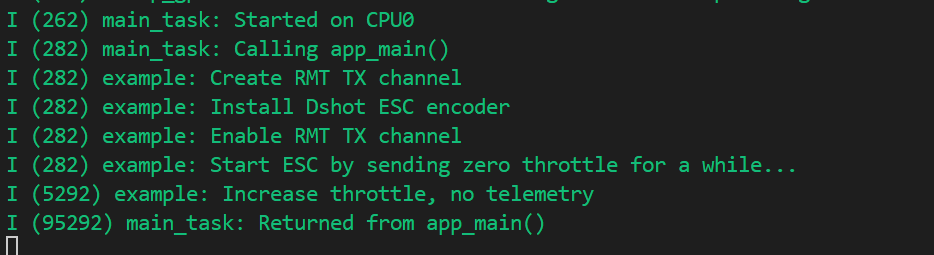

# Dshot ESC (Electronic Speed Controller) 电子速度控制器

## 粗略阅读README文档

文档简介本例发送Dshot信号，Dshot协议要求将信息编码为不同持续时间的脉冲，并定期发送 [Dshot协议讲解](https://blog.csdn.net/zhengningwei/article/details/79815281)

硬件连接，构建烧录和示例输出

## 构建烧录和监视

* 选择目标芯片
* 选择端口号
* 配置项目
* 点击**构建、烧录和监视**



可以看到输出了16位编码信号，具体编码符合由于协议不同有所差别，可以自行修改

## 代码分析

### 头文件和结构体

#### main.c

文件定义了RMT时钟分辨率，GPIO引脚，头文件不作赘述

```c
#if CONFIG_IDF_TARGET_ESP32H2
#define DSHOT_ESC_RESOLUTION_HZ 32000000 // 32MHz resolution, DSHot protocol needs a relative high resolution
#else
#define DSHOT_ESC_RESOLUTION_HZ 40000000 // 40MHz resolution, DSHot protocol needs a relative high resolution
#endif
#define DSHOT_ESC_GPIO_NUM      4
```

#### dshot_esc_encoder.c

`union` 是联合体的定义，所有成员共享一块内存。匿名结构体内使用了冒号定义位域，即**crc占4位**，**teltmetry占1位**，**throttle占11位**，符合协议要求。访问时直接通过`dshot_esc_frame_t`类型即可访问
(*位域的布局依赖编译器实现（通常是小端模式）,在不同编译器/架构中可能对齐方式不同*)

`rmt_dshot_esc_encoder_t`类型定义与灯带例程中类似

* `base` **继承接口**，必须作为第一个参数，使结构体可以作为`rmt_encoder_t*`类型使用
* `bytes_encoder` **字节编码器**，用于把字节流转换成RMT硬件编码
* `copy_encoder` **复制编码器**，用于把数据输送到缓冲区
* `dshot_delay_symbol` 单独设置**特殊用处编码**
* `state` 状态指示

`#ifndef __cplusplus` 如果未定义C++，即在C环境中，进行`sizeof`验证，确保`dshot_esc_frame_t`结构体定义是16位

```c
/**
 * @brief Type of Dshot ESC frame
 */
typedef union {
    struct {
        uint16_t crc: 4;       /*!< CRC checksum */
        uint16_t telemetry: 1; /*!< Telemetry request */
        uint16_t throttle: 11; /*!< Throttle value */
    };
    uint16_t val;
} dshot_esc_frame_t;

#ifndef __cplusplus
_Static_assert(sizeof(dshot_esc_frame_t) == 0x02, "Invalid size of dshot_esc_frame_t structure");
#endif

typedef struct {
    rmt_encoder_t base;
    rmt_encoder_t *bytes_encoder;
    rmt_encoder_t *copy_encoder;
    rmt_symbol_word_t dshot_delay_symbol;
    int state;
} rmt_dshot_esc_encoder_t;
```

#### dshot_esc_encoder.h

> 防止重复、兼容C++的内容不多次解释

`dshot_esc_throttle_t` 结构体储存命令，由`throttle`油门值和`telemetry_req` 是否要求回传遥测标志位组成
`dshot_esc_encoder_config_t` 结构体储存协议编码的编码器参数。`resolution` 是定时器分辨率，`baud_rate` 指定线路比特率，`post_delay_us` 指定帧间隔

```c
/**
 * @brief Throttle representation in DShot protocol
 */
typedef struct {
    uint16_t throttle;  /*!< Throttle value */
    bool telemetry_req; /*!< Telemetry request */
} dshot_esc_throttle_t;

/**
 * @brief Type of Dshot ESC encoder configuration
 */
typedef struct {
    uint32_t resolution;    /*!< Encoder resolution, in Hz */
    uint32_t baud_rate;     /*!< Dshot protocol runs at several different baud rates, e.g. DSHOT300 = 300k baud rate */
    uint32_t post_delay_us; /*!< Delay time after one Dshot frame, in microseconds */
} dshot_esc_encoder_config_t;
```

### app_main()函数

1. **创建RMT TX通道**(*笔者短期第三次分析，故本次不作逐参数解释*)
2. `dshot_esc_encoder_config_t` **自定义编码器参数配置**，包括时钟分辨率、线路比特率、发送间隔
3. `rmt_new_dshot_esc_encoder` 自定义函数规定**具体协议**、创建**字节编码器**和**复制编码器**
4. **启动RMT**
5. `rmt_transmit` 发送数据，`loop_count`为-1，无限发送
6. 循环中设置发送数据变换，并通过重新启用更新数据(*前一个输出在无限循环，需要关闭再启用以写入数据*)

```c
void app_main(void)
{
    ESP_LOGI(TAG, "Create RMT TX channel");
    rmt_channel_handle_t esc_chan = NULL;
    rmt_tx_channel_config_t tx_chan_config = {
        .clk_src = RMT_CLK_SRC_DEFAULT, // select a clock that can provide needed resolution
        .gpio_num = DSHOT_ESC_GPIO_NUM,
        .mem_block_symbols = 64,
        .resolution_hz = DSHOT_ESC_RESOLUTION_HZ,
        .trans_queue_depth = 10, // set the number of transactions that can be pending in the background
    };
    ESP_ERROR_CHECK(rmt_new_tx_channel(&tx_chan_config, &esc_chan));

    ESP_LOGI(TAG, "Install Dshot ESC encoder");
    rmt_encoder_handle_t dshot_encoder = NULL;
    dshot_esc_encoder_config_t encoder_config = {
        .resolution = DSHOT_ESC_RESOLUTION_HZ,
        .baud_rate = 300000, // DSHOT300 protocol
        .post_delay_us = 50, // extra delay between each frame
    };
    ESP_ERROR_CHECK(rmt_new_dshot_esc_encoder(&encoder_config, &dshot_encoder));

    ESP_LOGI(TAG, "Enable RMT TX channel");
    ESP_ERROR_CHECK(rmt_enable(esc_chan));

    rmt_transmit_config_t tx_config = {
        .loop_count = -1, // infinite loop
    };
    dshot_esc_throttle_t throttle = {
        .throttle = 0,
        .telemetry_req = false, // telemetry is not supported in this example
    };

    ESP_LOGI(TAG, "Start ESC by sending zero throttle for a while...");
    ESP_ERROR_CHECK(rmt_transmit(esc_chan, dshot_encoder, &throttle, sizeof(throttle), &tx_config));
    vTaskDelay(pdMS_TO_TICKS(5000));

    ESP_LOGI(TAG, "Increase throttle, no telemetry");
    for (uint16_t thro = 100; thro < 1000; thro += 10) {
        throttle.throttle = thro;
        ESP_ERROR_CHECK(rmt_transmit(esc_chan, dshot_encoder, &throttle, sizeof(throttle), &tx_config));
        // the previous loop transfer is till undergoing, we need to stop it and restart,
        // so that the new throttle can be updated on the output
        ESP_ERROR_CHECK(rmt_disable(esc_chan));
        ESP_ERROR_CHECK(rmt_enable(esc_chan));
        vTaskDelay(pdMS_TO_TICKS(1000));
    }
}
```

### 编码器创建函数

1. 非空判断
2. `rmt_alloc_encoder_mem` 为rmt编码器分配指定内存
3. 绑定 `base` 到具体函数 (*base为**rmt_encoder_t**类型，有`encode`、`reset`、`del`三个参数，分别绑定数据流编码函数，重启编码器函数，删除编码器函数*)
4. `config->resolution / 1e6 * config->post_delay_us` 把延时由微秒转为ticks，`config->resolution / 1e6`结果为1tick对应多少微秒，再乘微秒延时为实际tick延时
5. `dshot_delay_symbol` 定义**协议特殊帧**
6. 将Dshot**协议脉冲参数转换为实际tick**
   * `period_ticks` 先计算 一个协议帧对应多少tick
   * `t1h_ticks` 逻辑1的高电平时间 ； `t1l_ticks` 逻辑1的低电平时间
   * `t0h_ticks` 逻辑0的高电平时间 ； `t0l_ticks` 逻辑0的低电平时间
7. `rmt_bytes_encoder_config_t` 类型结构体定义**协议逻辑01码**
8. `rmt_new_bytes_encoder` 新建**字节编码器**
9. `rmt_new_copy_encoder` 新建**复制编码器**
10. 返回整个编码器`ret_encoder`

```c
esp_err_t rmt_new_dshot_esc_encoder(const dshot_esc_encoder_config_t *config, rmt_encoder_handle_t *ret_encoder)
{
    esp_err_t ret = ESP_OK;
    rmt_dshot_esc_encoder_t *dshot_encoder = NULL;
    ESP_GOTO_ON_FALSE(config && ret_encoder, ESP_ERR_INVALID_ARG, err, TAG, "invalid argument");
    dshot_encoder = rmt_alloc_encoder_mem(sizeof(rmt_dshot_esc_encoder_t));
    ESP_GOTO_ON_FALSE(dshot_encoder, ESP_ERR_NO_MEM, err, TAG, "no mem for musical score encoder");
    dshot_encoder->base.encode = rmt_encode_dshot_esc;
    dshot_encoder->base.del = rmt_del_dshot_encoder;
    dshot_encoder->base.reset = rmt_dshot_encoder_reset;
    uint32_t delay_ticks = config->resolution / 1e6 * config->post_delay_us;
    rmt_symbol_word_t dshot_delay_symbol = {
        .level0 = 0,
        .duration0 = delay_ticks / 2,
        .level1 = 0,
        .duration1 = delay_ticks / 2,
    };
    dshot_encoder->dshot_delay_symbol = dshot_delay_symbol;
    // different dshot protocol have its own timing requirements,
    float period_ticks = (float)config->resolution / config->baud_rate;
    // 1 and 0 is represented by a 74.850% and 37.425% duty cycle respectively
    unsigned int t1h_ticks = (unsigned int)(period_ticks * 0.7485);
    unsigned int t1l_ticks = (unsigned int)(period_ticks - t1h_ticks);
    unsigned int t0h_ticks = (unsigned int)(period_ticks * 0.37425);
    unsigned int t0l_ticks = (unsigned int)(period_ticks - t0h_ticks);
    rmt_bytes_encoder_config_t bytes_encoder_config = {
        .bit0 = {
            .level0 = 1,
            .duration0 = t0h_ticks,
            .level1 = 0,
            .duration1 = t0l_ticks,
        },
        .bit1 = {
            .level0 = 1,
            .duration0 = t1h_ticks,
            .level1 = 0,
            .duration1 = t1l_ticks,
        },
        .flags.msb_first = 1,
    };
    ESP_GOTO_ON_ERROR(rmt_new_bytes_encoder(&bytes_encoder_config, &dshot_encoder->bytes_encoder), err, TAG, "create bytes encoder failed");
    rmt_copy_encoder_config_t copy_encoder_config = {};
    ESP_GOTO_ON_ERROR(rmt_new_copy_encoder(&copy_encoder_config, &dshot_encoder->copy_encoder), err, TAG, "create copy encoder failed");
    *ret_encoder = &dshot_encoder->base;
    return ESP_OK;
err:
    if (dshot_encoder) {
        if (dshot_encoder->bytes_encoder) {
            rmt_del_encoder(dshot_encoder->bytes_encoder);
        }
        if (dshot_encoder->copy_encoder) {
            rmt_del_encoder(dshot_encoder->copy_encoder);
        }
        free(dshot_encoder);
    }
    return ret;
}
```

### encoder函数

`make_dshot_frame` 用于进行每一帧的编码，自行计算CRC校验值，由于联合体共享内存，笔者对具体调用稍作解释

1. 将实际的油门值和标志位写入联合体
2. 以**uint16_t类型**读取**写入后的联合体值**为val
3. 用读取的值进行**计算crc校验码**
4. 写入crc值并重新读取整个值为val
5. 以赋值val整个写入并根据前面读取的val进行数据处理，确保高位在前

`rmt_encode_dshot_esc` 绑定`rmt_encoder_t`类型中的`encoder`函数指针。

1. 解析数据和编码器
2. 调用函数进行帧编码
3. 根据状态位进行数据发送 (*具体使用以后参考例程照搬，笔者不作详细讲解*)

```c
static void make_dshot_frame(dshot_esc_frame_t *frame, uint16_t throttle, bool telemetry)
{
    frame->throttle = throttle;
    frame->telemetry = telemetry;
    uint16_t val = frame->val;
    uint8_t crc = ((val ^ (val >> 4) ^ (val >> 8)) & 0xF0) >> 4;;
    frame->crc = crc;
    val = frame->val;
    // change the endian
    frame->val = ((val & 0xFF) << 8) | ((val & 0xFF00) >> 8);
}

static size_t rmt_encode_dshot_esc(rmt_encoder_t *encoder, rmt_channel_handle_t channel,
                                   const void *primary_data, size_t data_size, rmt_encode_state_t *ret_state)
{
    rmt_dshot_esc_encoder_t *dshot_encoder = __containerof(encoder, rmt_dshot_esc_encoder_t, base);
    rmt_encoder_handle_t bytes_encoder = dshot_encoder->bytes_encoder;
    rmt_encoder_handle_t copy_encoder = dshot_encoder->copy_encoder;
    rmt_encode_state_t session_state = RMT_ENCODING_RESET;
    rmt_encode_state_t state = RMT_ENCODING_RESET;
    size_t encoded_symbols = 0;

    // convert user data into dshot frame
    dshot_esc_throttle_t *throttle = (dshot_esc_throttle_t *)primary_data;
    dshot_esc_frame_t frame = {};
    make_dshot_frame(&frame, throttle->throttle, throttle->telemetry_req);

    switch (dshot_encoder->state) {
    case 0: // send the dshot frame
        encoded_symbols += bytes_encoder->encode(bytes_encoder, channel, &frame, sizeof(frame), &session_state);
        if (session_state & RMT_ENCODING_COMPLETE) {
            dshot_encoder->state = 1; // switch to next state when current encoding session finished
        }
        if (session_state & RMT_ENCODING_MEM_FULL) {
            state |= RMT_ENCODING_MEM_FULL;
            goto out; // yield if there's no free space for encoding artifacts
        }
    // fall-through
    case 1:
        encoded_symbols += copy_encoder->encode(copy_encoder, channel, &dshot_encoder->dshot_delay_symbol,
                                                sizeof(rmt_symbol_word_t), &session_state);
        if (session_state & RMT_ENCODING_COMPLETE) {
            state |= RMT_ENCODING_COMPLETE;
            dshot_encoder->state = RMT_ENCODING_RESET; // switch to next state when current encoding session finished
        }
        if (session_state & RMT_ENCODING_MEM_FULL) {
            state |= RMT_ENCODING_MEM_FULL;
            goto out; // yield if there's no free space for encoding artifacts
        }
    }
out:
    *ret_state = state;
    return encoded_symbols;
}
```

## 总结

本例使用RMT的TX功能演示了无限循环发送，且展示了全新的编码方式-Dshot。基本使用和LED灯带的例程相似，再次熟悉了RMT配置的过程，和需要根据编码修改的内容。