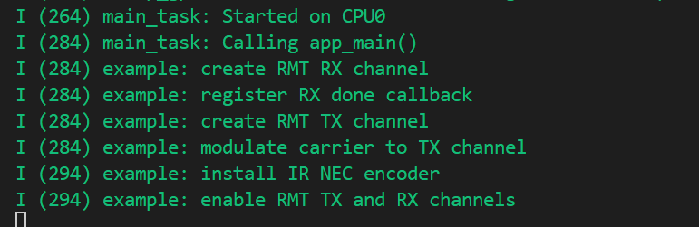
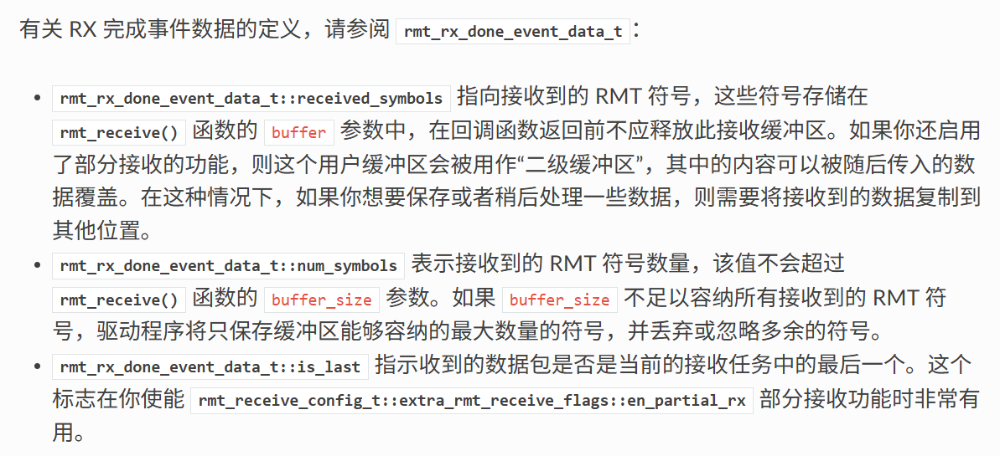

# IR NEC Encoding and Decoding 红外遥控NEC协议编解码

> 笔者并没有红外遥控设备，故本例重点放在代码分析

## 粗略阅读README文档

文档简介示例创建TX信道定期发送NEC信号，RX信道接收信号并解码

硬件连接，需要把TX和RX脚分别接红外发送器和接收器

构建烧录示例输出

## 构建烧录和监视

* 选择目标芯片
* 选择端口号
* 配置项目
* 点击**构建、烧录和监视**

由于没有实际发送，监视窗口没有实际数值

## 分析代码

### 头文件、宏定义和结构体

#### main.c

头文件导入的驱动库的RMT的TX和RX其他不做解释

宏定义时钟分辨率，输入输出引脚 ，`EXAMPLE_IR_NEC_DECODE_MARGIN` 给定时钟容差，*即使发送端晶振或接收头略有偏差，只要测量值落在期望值 ±200 µs 范围内，仍被判定为合法*
关于NEC时钟的具体定义写在代码注释

```c
#include "freertos/FreeRTOS.h"
#include "freertos/task.h"
#include "freertos/queue.h"
#include "esp_log.h"
#include "driver/rmt_tx.h"
#include "driver/rmt_rx.h"
#include "ir_nec_encoder.h"

#define EXAMPLE_IR_RESOLUTION_HZ     1000000 // 1MHz resolution, 1 tick = 1us
#define EXAMPLE_IR_TX_GPIO_NUM       18
#define EXAMPLE_IR_RX_GPIO_NUM       4
#define EXAMPLE_IR_NEC_DECODE_MARGIN 200     // Tolerance for parsing RMT symbols into bit stream

/**
 * @brief NEC timing spec
 */
#define NEC_LEADING_CODE_DURATION_0  9000   // NEC一帧起始引导码 高9ms
#define NEC_LEADING_CODE_DURATION_1  4500   // NEC一帧起始引导码 低4.5ms
#define NEC_PAYLOAD_ZERO_DURATION_0  560    // NEC逻辑0脉冲对 560us高
#define NEC_PAYLOAD_ZERO_DURATION_1  560    // NEC逻辑0脉冲对 560us低
#define NEC_PAYLOAD_ONE_DURATION_0   560    // NEC逻辑1脉冲对 560us高
#define NEC_PAYLOAD_ONE_DURATION_1   1690   // NEC逻辑1脉冲对 1690us低
#define NEC_REPEAT_CODE_DURATION_0   9000   // NEC连发码 高9ms
#define NEC_REPEAT_CODE_DURATION_1   2250   // NEC连发码 低2.25ms
```

#### ir_nec_encoder.h

反正重复和C++兼容不作赘述

`ir_nec_scan_code_t` 结构体定义NEC码，包括地址和命令
`ir_nec_encoder_config_t` 结构体定义使用编码器的参数，时钟分辨率

```c
/**
 * @brief IR NEC scan code representation
 */
typedef struct {
    uint16_t address;
    uint16_t command;
} ir_nec_scan_code_t;

/**
 * @brief Type of IR NEC encoder configuration
 */
typedef struct {
    uint32_t resolution; /*!< Encoder resolution, in Hz */
} ir_nec_encoder_config_t;
```

#### ir_nec_encoder.c

配置针对NEC的结构体编码器，笔者此处不作赘述 [其他文档中解释](../led_strip/led_strip.md#led_strip_encoderc)

```c
typedef struct {
    rmt_encoder_t base;           // the base "class", declares the standard encoder interface
    rmt_encoder_t *copy_encoder;  // use the copy_encoder to encode the leading and ending pulse
    rmt_encoder_t *bytes_encoder; // use the bytes_encoder to encode the address and command data
    rmt_symbol_word_t nec_leading_symbol; // NEC leading code with RMT representation
    rmt_symbol_word_t nec_ending_symbol;  // NEC ending code with RMT representation
    int state;
} rmt_ir_nec_encoder_t;
```

### app_main 函数

> 关于NEC信号的具体解释详见[文章](https://blog.csdn.net/Ivan804638781/article/details/111225949)

1. 创建RMT[RX通道](https://docs.espressif.com/projects/esp-idf/zh_CN/stable/esp32/api-reference/peripherals/rmt.html#rmt-rx)，配置与TX通道基本一致
2. 新建**队列**储存RX通道数据 `rmt_rx_done_event_data_t` 为RX接收数据内部定义结构体

3. `rmt_rx_register_event_callbacks` 注册**回调函数**
4. 创建TX通道，配置不作分析
5. `rmt_apply_carrier` 函数进行[载波调制](https://docs.espressif.com/projects/esp-idf/zh_CN/stable/esp32/api-reference/peripherals/rmt.html#rmt-carrier-modulation-and-demodulation)
6. `rmt_new_ir_nec_encoder` 函数进行**自定义编码器创建和配置**
7. **使能RMT的RX和TX通道**
8. `raw_symbols` 数组储存一个完整的NEC帧 ，`rx_data` 作为接收数据结构体
9. `rmt_receive` 配置并第一次启动接收 ，`receive_config` 作为噪声或者毛刺配置，小于、大于某值的信号被视作噪声
10. 主循环中以1s为等待读取队列数据，有接收的话进行解码并重新启用RX接收，没有的话发送一帧数据

```c
void app_main(void)
{
    ESP_LOGI(TAG, "create RMT RX channel");
    rmt_rx_channel_config_t rx_channel_cfg = {
        .clk_src = RMT_CLK_SRC_DEFAULT,
        .resolution_hz = EXAMPLE_IR_RESOLUTION_HZ,
        .mem_block_symbols = 64, // amount of RMT symbols that the channel can store at a time
        .gpio_num = EXAMPLE_IR_RX_GPIO_NUM,
    };
    rmt_channel_handle_t rx_channel = NULL;
    ESP_ERROR_CHECK(rmt_new_rx_channel(&rx_channel_cfg, &rx_channel));

    ESP_LOGI(TAG, "register RX done callback");
    QueueHandle_t receive_queue = xQueueCreate(1, sizeof(rmt_rx_done_event_data_t));
    assert(receive_queue);
    rmt_rx_event_callbacks_t cbs = {
        .on_recv_done = example_rmt_rx_done_callback,
    };
    ESP_ERROR_CHECK(rmt_rx_register_event_callbacks(rx_channel, &cbs, receive_queue));

    // the following timing requirement is based on NEC protocol
    rmt_receive_config_t receive_config = {
        .signal_range_min_ns = 1250,     // the shortest duration for NEC signal is 560us, 1250ns < 560us, valid signal won't be treated as noise
        .signal_range_max_ns = 12000000, // the longest duration for NEC signal is 9000us, 12000000ns > 9000us, the receive won't stop early
    };

    ESP_LOGI(TAG, "create RMT TX channel");
    rmt_tx_channel_config_t tx_channel_cfg = {
        .clk_src = RMT_CLK_SRC_DEFAULT,
        .resolution_hz = EXAMPLE_IR_RESOLUTION_HZ,
        .mem_block_symbols = 64, // amount of RMT symbols that the channel can store at a time
        .trans_queue_depth = 4,  // number of transactions that allowed to pending in the background, this example won't queue multiple transactions, so queue depth > 1 is sufficient
        .gpio_num = EXAMPLE_IR_TX_GPIO_NUM,
    };
    rmt_channel_handle_t tx_channel = NULL;
    ESP_ERROR_CHECK(rmt_new_tx_channel(&tx_channel_cfg, &tx_channel));

    ESP_LOGI(TAG, "modulate carrier to TX channel");
    rmt_carrier_config_t carrier_cfg = {
        .duty_cycle = 0.33,
        .frequency_hz = 38000, // 38KHz
    };
    ESP_ERROR_CHECK(rmt_apply_carrier(tx_channel, &carrier_cfg));

    // this example won't send NEC frames in a loop
    rmt_transmit_config_t transmit_config = {
        .loop_count = 0, // no loop
    };

    ESP_LOGI(TAG, "install IR NEC encoder");
    ir_nec_encoder_config_t nec_encoder_cfg = {
        .resolution = EXAMPLE_IR_RESOLUTION_HZ,
    };
    rmt_encoder_handle_t nec_encoder = NULL;
    ESP_ERROR_CHECK(rmt_new_ir_nec_encoder(&nec_encoder_cfg, &nec_encoder));

    ESP_LOGI(TAG, "enable RMT TX and RX channels");
    ESP_ERROR_CHECK(rmt_enable(tx_channel));
    ESP_ERROR_CHECK(rmt_enable(rx_channel));

    // save the received RMT symbols
    rmt_symbol_word_t raw_symbols[64]; // 64 symbols should be sufficient for a standard NEC frame
    rmt_rx_done_event_data_t rx_data;
    // ready to receive
    ESP_ERROR_CHECK(rmt_receive(rx_channel, raw_symbols, sizeof(raw_symbols), &receive_config));
    while (1) {
        // wait for RX done signal
        if (xQueueReceive(receive_queue, &rx_data, pdMS_TO_TICKS(1000)) == pdPASS) {
            // parse the receive symbols and print the result
            example_parse_nec_frame(rx_data.received_symbols, rx_data.num_symbols);
            // start receive again
            ESP_ERROR_CHECK(rmt_receive(rx_channel, raw_symbols, sizeof(raw_symbols), &receive_config));
        } else {
            // timeout, transmit predefined IR NEC packets
            const ir_nec_scan_code_t scan_code = {
                .address = 0x0440,
                .command = 0x3003,
            };
            ESP_ERROR_CHECK(rmt_transmit(tx_channel, nec_encoder, &scan_code, sizeof(scan_code), &transmit_config));
        }
    }
}
```

### 自定义编码器函数

1. 分配内存、非空判断，不作具体解释
2. 绑定函数至**base**指针
3. `rmt_new_copy_encoder` 新建**拷贝编码器**
4. 配置**NEC协议特殊帧**，`nec_leading_symbol` 引导帧 ； `nec_ending_symbol` 结束帧
5. `rmt_bytes_encoder_config_t` **字节编码器**配置，规定0码和1码，然后`rmt_new_bytes_encoder` 新建字节编码器
6. 绑定句柄

```c
esp_err_t rmt_new_ir_nec_encoder(const ir_nec_encoder_config_t *config, rmt_encoder_handle_t *ret_encoder)
{
    esp_err_t ret = ESP_OK;
    rmt_ir_nec_encoder_t *nec_encoder = NULL;
    ESP_GOTO_ON_FALSE(config && ret_encoder, ESP_ERR_INVALID_ARG, err, TAG, "invalid argument");
    nec_encoder = rmt_alloc_encoder_mem(sizeof(rmt_ir_nec_encoder_t));
    ESP_GOTO_ON_FALSE(nec_encoder, ESP_ERR_NO_MEM, err, TAG, "no mem for ir nec encoder");
    nec_encoder->base.encode = rmt_encode_ir_nec;
    nec_encoder->base.del = rmt_del_ir_nec_encoder;
    nec_encoder->base.reset = rmt_ir_nec_encoder_reset;

    rmt_copy_encoder_config_t copy_encoder_config = {};
    ESP_GOTO_ON_ERROR(rmt_new_copy_encoder(&copy_encoder_config, &nec_encoder->copy_encoder), err, TAG, "create copy encoder failed");

    // construct the leading code and ending code with RMT symbol format
    nec_encoder->nec_leading_symbol = (rmt_symbol_word_t) {
        .level0 = 1,
        .duration0 = 9000ULL * config->resolution / 1000000,
        .level1 = 0,
        .duration1 = 4500ULL * config->resolution / 1000000,
    };
    nec_encoder->nec_ending_symbol = (rmt_symbol_word_t) {
        .level0 = 1,
        .duration0 = 560 * config->resolution / 1000000,
        .level1 = 0,
        .duration1 = 0x7FFF,
    };

    rmt_bytes_encoder_config_t bytes_encoder_config = {
        .bit0 = {
            .level0 = 1,
            .duration0 = 560 * config->resolution / 1000000, // T0H=560us
            .level1 = 0,
            .duration1 = 560 * config->resolution / 1000000, // T0L=560us
        },
        .bit1 = {
            .level0 = 1,
            .duration0 = 560 * config->resolution / 1000000,  // T1H=560us
            .level1 = 0,
            .duration1 = 1690 * config->resolution / 1000000, // T1L=1690us
        },
    };
    ESP_GOTO_ON_ERROR(rmt_new_bytes_encoder(&bytes_encoder_config, &nec_encoder->bytes_encoder), err, TAG, "create bytes encoder failed");

    *ret_encoder = &nec_encoder->base;
    return ESP_OK;
err:
    if (nec_encoder) {
        if (nec_encoder->bytes_encoder) {
            rmt_del_encoder(nec_encoder->bytes_encoder);
        }
        if (nec_encoder->copy_encoder) {
            rmt_del_encoder(nec_encoder->copy_encoder);
        }
        free(nec_encoder);
    }
    return ret;
}
```

### encoder编码函数

1. 解码数据和函数存入局部变量
2. switch判断**state**状态码 (*case中没有带break，如果完成代码会顺序执行，有错误会通过goto转到错误处理*)
   * state为0，发送引导码
   * state为1，发送地址
   * state为2，发送命令
   * state为3，发送结束码

```c
static size_t rmt_encode_ir_nec(rmt_encoder_t *encoder, rmt_channel_handle_t channel, const void *primary_data, size_t data_size, rmt_encode_state_t *ret_state)
{
    rmt_ir_nec_encoder_t *nec_encoder = __containerof(encoder, rmt_ir_nec_encoder_t, base);
    rmt_encode_state_t session_state = RMT_ENCODING_RESET;
    rmt_encode_state_t state = RMT_ENCODING_RESET;
    size_t encoded_symbols = 0;
    ir_nec_scan_code_t *scan_code = (ir_nec_scan_code_t *)primary_data;
    rmt_encoder_handle_t copy_encoder = nec_encoder->copy_encoder;
    rmt_encoder_handle_t bytes_encoder = nec_encoder->bytes_encoder;
    switch (nec_encoder->state) {
    case 0: // send leading code
        encoded_symbols += copy_encoder->encode(copy_encoder, channel, &nec_encoder->nec_leading_symbol,
                                                sizeof(rmt_symbol_word_t), &session_state);
        if (session_state & RMT_ENCODING_COMPLETE) {
            nec_encoder->state = 1; // we can only switch to next state when current encoder finished
        }
        if (session_state & RMT_ENCODING_MEM_FULL) {
            state |= RMT_ENCODING_MEM_FULL;
            goto out; // yield if there's no free space to put other encoding artifacts
        }
    // fall-through
    case 1: // send address
        encoded_symbols += bytes_encoder->encode(bytes_encoder, channel, &scan_code->address, sizeof(uint16_t), &session_state);
        if (session_state & RMT_ENCODING_COMPLETE) {
            nec_encoder->state = 2; // we can only switch to next state when current encoder finished
        }
        if (session_state & RMT_ENCODING_MEM_FULL) {
            state |= RMT_ENCODING_MEM_FULL;
            goto out; // yield if there's no free space to put other encoding artifacts
        }
    // fall-through
    case 2: // send command
        encoded_symbols += bytes_encoder->encode(bytes_encoder, channel, &scan_code->command, sizeof(uint16_t), &session_state);
        if (session_state & RMT_ENCODING_COMPLETE) {
            nec_encoder->state = 3; // we can only switch to next state when current encoder finished
        }
        if (session_state & RMT_ENCODING_MEM_FULL) {
            state |= RMT_ENCODING_MEM_FULL;
            goto out; // yield if there's no free space to put other encoding artifacts
        }
    // fall-through
    case 3: // send ending code
        encoded_symbols += copy_encoder->encode(copy_encoder, channel, &nec_encoder->nec_ending_symbol,
                                                sizeof(rmt_symbol_word_t), &session_state);
        if (session_state & RMT_ENCODING_COMPLETE) {
            nec_encoder->state = RMT_ENCODING_RESET; // back to the initial encoding session
            state |= RMT_ENCODING_COMPLETE;
        }
        if (session_state & RMT_ENCODING_MEM_FULL) {
            state |= RMT_ENCODING_MEM_FULL;
            goto out; // yield if there's no free space to put other encoding artifacts
        }
    }
out:
    *ret_state = state;
    return encoded_symbols;
}
```

### 其他函数

> 有关编码器的重启和删除函数笔者不作赘述

`nec_check_in_range` 是基础函数，用于**判断接收信号宽度**是否在给定的`EXAMPLE_IR_NEC_DECODE_MARGIN`容差内

`nec_parse_logic0` 和 `nec_parse_logic0` **判断**接收到的**电平信号**是否代表NEC中的**逻辑0或1**。*以实际数值和宏定义数值比较，考虑容差*

`nec_parse_frame` 解析一个**完整的数据帧**

1. 判断是否有符合要求的**引导码** ，有的话进行加一，不解析引导码
2. 第一个循环判断每一个RMT字符，分别为0或1，通过与或非还有位移操作，写入address变量中 *一个标准的NEC数据帧包括8位地址码和8位地址反码*
3. 第二个循环判断每个RMT字符的0或1，写入commend变量中 *一个标准的NEC数据帧包括8位命令码和8位命令反码*

`nec_parse_frame_repeat` 用于判断是否为**重复码**

`example_parse_nec_frame` 在RX读取到数据后进行处理

1. 循环输出所有位的高低电平和持续实际，方便观察和调试
2. 判断位数，34位 (1+16+16+1) 为正常NEC数据帧，调用正常判断函数
3. 判断只有两位，进行重复码判断(*接收端识别到重复码后，会理解为“继续执行上一条命令”，从而实现如音量持续增加、频道连续切换等长按功能*)
4. 其他位数均为无法识别

`example_rmt_rx_done_callback` 回调函数中进行队列数据发送，用于和主循环中的读取配合。函数注册在RX接收中，获取驱动程序在 edata 中填充的特定事件数据，即RX数据，并存入队列中。

```c
/**
 * @brief Check whether a duration is within expected range
 */
static inline bool nec_check_in_range(uint32_t signal_duration, uint32_t spec_duration)
{
    return (signal_duration < (spec_duration + EXAMPLE_IR_NEC_DECODE_MARGIN)) &&
           (signal_duration > (spec_duration - EXAMPLE_IR_NEC_DECODE_MARGIN));
}

/**
 * @brief Check whether a RMT symbol represents NEC logic zero
 */
static bool nec_parse_logic0(rmt_symbol_word_t *rmt_nec_symbols)
{
    return nec_check_in_range(rmt_nec_symbols->duration0, NEC_PAYLOAD_ZERO_DURATION_0) &&
           nec_check_in_range(rmt_nec_symbols->duration1, NEC_PAYLOAD_ZERO_DURATION_1);
}

/**
 * @brief Check whether a RMT symbol represents NEC logic one
 */
static bool nec_parse_logic1(rmt_symbol_word_t *rmt_nec_symbols)
{
    return nec_check_in_range(rmt_nec_symbols->duration0, NEC_PAYLOAD_ONE_DURATION_0) &&
           nec_check_in_range(rmt_nec_symbols->duration1, NEC_PAYLOAD_ONE_DURATION_1);
}

/**
 * @brief Decode RMT symbols into NEC address and command
 */
static bool nec_parse_frame(rmt_symbol_word_t *rmt_nec_symbols)
{
    rmt_symbol_word_t *cur = rmt_nec_symbols;
    uint16_t address = 0;
    uint16_t command = 0;
    bool valid_leading_code = nec_check_in_range(cur->duration0, NEC_LEADING_CODE_DURATION_0) &&
                              nec_check_in_range(cur->duration1, NEC_LEADING_CODE_DURATION_1);
    if (!valid_leading_code) {
        return false;
    }
    cur++;
    for (int i = 0; i < 16; i++) {
        if (nec_parse_logic1(cur)) {
            address |= 1 << i;
        } else if (nec_parse_logic0(cur)) {
            address &= ~(1 << i);
        } else {
            return false;
        }
        cur++;
    }
    for (int i = 0; i < 16; i++) {
        if (nec_parse_logic1(cur)) {
            command |= 1 << i;
        } else if (nec_parse_logic0(cur)) {
            command &= ~(1 << i);
        } else {
            return false;
        }
        cur++;
    }
    // save address and command
    s_nec_code_address = address;
    s_nec_code_command = command;
    return true;
}

/**
 * @brief Check whether the RMT symbols represent NEC repeat code
 */
static bool nec_parse_frame_repeat(rmt_symbol_word_t *rmt_nec_symbols)
{
    return nec_check_in_range(rmt_nec_symbols->duration0, NEC_REPEAT_CODE_DURATION_0) &&
           nec_check_in_range(rmt_nec_symbols->duration1, NEC_REPEAT_CODE_DURATION_1);
}

/**
 * @brief Decode RMT symbols into NEC scan code and print the result
 */
static void example_parse_nec_frame(rmt_symbol_word_t *rmt_nec_symbols, size_t symbol_num)
{
    printf("NEC frame start---\r\n");
    for (size_t i = 0; i < symbol_num; i++) {
        printf("{%d:%d},{%d:%d}\r\n", rmt_nec_symbols[i].level0, rmt_nec_symbols[i].duration0,
               rmt_nec_symbols[i].level1, rmt_nec_symbols[i].duration1);
    }
    printf("---NEC frame end: ");
    // decode RMT symbols
    switch (symbol_num) {
    case 34: // NEC normal frame
        if (nec_parse_frame(rmt_nec_symbols)) {
            printf("Address=%04X, Command=%04X\r\n\r\n", s_nec_code_address, s_nec_code_command);
        }
        break;
    case 2: // NEC repeat frame
        if (nec_parse_frame_repeat(rmt_nec_symbols)) {
            printf("Address=%04X, Command=%04X, repeat\r\n\r\n", s_nec_code_address, s_nec_code_command);
        }
        break;
    default:
        printf("Unknown NEC frame\r\n\r\n");
        break;
    }
}

static bool example_rmt_rx_done_callback(rmt_channel_handle_t channel, const rmt_rx_done_event_data_t *edata, void *user_data)
{
    BaseType_t high_task_wakeup = pdFALSE;
    QueueHandle_t receive_queue = (QueueHandle_t)user_data;
    // send the received RMT symbols to the parser task
    xQueueSendFromISR(receive_queue, edata, &high_task_wakeup);
    return high_task_wakeup == pdTRUE;
}
```

## 总结

本例进行了RMT收发的配置，对笔者来说主要是接收流程，发送流程在前面几个例程实验已经比较熟悉。接收流程有队列配合，有回调函数注册，还有关于NEC协议解码的具体操作，了解了NEC编码，体验了整个的配合。