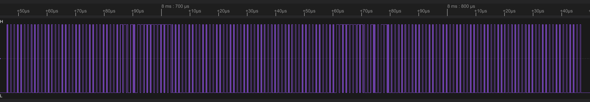
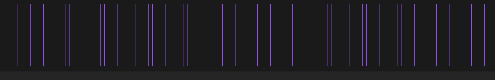
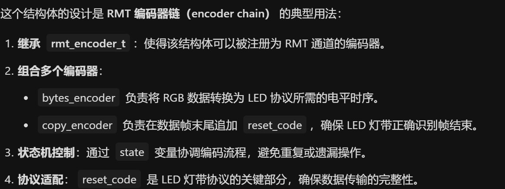

# RMT Transmit Example -- LED Strip  RMT传输实例-LED灯带

> 笔者填坑，在get-started中blink示例有控制ws2812闪烁，本例较为具体解释RMT原理，后续SPI原理等下次填

## 粗略阅读README文档

文档简介*只要实现了适当的编码器，RMT外围设备几乎可以生成任何波形*，本示例演示驱动可寻址LED灯带WS2812

硬件连接，配置宏定义

构建烧录和示例输出

## 构建、烧录和监视

* 选择目标芯片
* 选择端口号
* 配置项目：引脚和灯数
* 点击**构建、烧录和监视**
  
  
  
  
  可以看到每间隔10ms对灯带进行重新编码，编码由ws2812规定的0码和1码组成

## WS2812解释

> WS2812是一种智能集成LED光源，通过简单的外部接口和特有的级联方案，便于利用MCU完成多个LED控制，极大简化了LED控制接口。相比于传统的单片机LED IO口复用控制方案，使用WS2812更加简洁。
>
> 工作原理
WS2812的工作电压范围在3.5V到5.3V之间，输入信号电压在工作电压VDD±0.5V范围内。每个RGB灯都有256亮度级别，可以形成16777216种颜色，刷新频率不低于400Hz。
WS2812的级联控制协议非常简单，通过一根信号线进行串行异步信号发送。不同高低电平脉冲表示数据0和1编码。每组24bit对应的GRB编码，发送颜色顺序为GRB，字节的高位在前。
>
> 控制协议
>WS2812的控制协议包括以下几个关键参数：
>
>* T0H: 0码，高电平时间为0.4us，误差±150ns。
>* T1H: 1码，高电平时间为0.85us，误差±150ns。
>* T0L: 0码，低电平时间为0.85us，误差±150ns。
>* T1L: 1码，低电平时间为0.4us，误差±150ns。
>* RES: 低电平时间超过50us。

简单来说就是通过发送一长串满足控制协议的编码去控制多个灯珠，但由于一个码的长度约为1.25us，要求很高的输出速度。
每个灯珠由24位码控制，每8位控制RGB一种颜色，进而组合成各种颜色

## 代码分析

### 头文件和结构体定义

#### led_strip_encoder.h

文件导入了`<stdint.h>`用于uint32_t等类型初始化，导入esp的rmt驱动文件。定义了**led_strip_encoder_config_t**结构体，方便维护和扩展。

```c
#pragma once

#include <stdint.h>
#include "driver/rmt_encoder.h"

#ifdef __cplusplus
extern "C" {
#endif

/**
 * @brief Type of led strip encoder configuration
 */
typedef struct {
    uint32_t resolution; /*!< Encoder resolution, in Hz */
} led_strip_encoder_config_t;

/**
 * @brief Create RMT encoder for encoding LED strip pixels into RMT symbols
 *
 * @param[in] config Encoder configuration
 * @param[out] ret_encoder Returned encoder handle
 * @return
 *      - ESP_ERR_INVALID_ARG for any invalid arguments
 *      - ESP_ERR_NO_MEM out of memory when creating led strip encoder
 *      - ESP_OK if creating encoder successfully
 */
esp_err_t rmt_new_led_strip_encoder(const led_strip_encoder_config_t *config, rmt_encoder_handle_t *ret_encoder);

#ifdef __cplusplus
}
#endif
```

#### led_strip_encoder.c

文件导入`esp_check.h`用于*CHECK*宏使用，定义**rmt_led_strip_encoder_t**结构体

* `base` *继承自 RMT 的通用编码器接口，**必须作为第一个成员**，使得该结构体可以被当作 rmt_encoder_t\* 使用，符合面向对象的设计模式。*
* `bytes_encoder` **指向一个“字节编码器”**，用于将原始的字节数据（如 RGB 值）编码为 RMT 符号序列。通常是一个内置的 rmt_bytes_encoder 实例。
* `copy_encoder` **指向一个“复制编码器”**，用于将已有的 RMT 符号序列复制到输出缓冲区，常用于发送重复的复位码或填充码。通常是一个内置的 rmt_copy_encoder 实例
* `state` 状态码
* `reset_code` 复位码


```c
#include "esp_check.h"
#include "led_strip_encoder.h"

static const char *TAG = "led_encoder";

typedef struct {
    rmt_encoder_t base;
    rmt_encoder_t *bytes_encoder;
    rmt_encoder_t *copy_encoder;
    int state;
    rmt_symbol_word_t reset_code;
} rmt_led_strip_encoder_t;
```

#### main.c

main文件中导入了需要的驱动，宏定义了灯带时钟分辨率，引脚，数量和变化间隔时间

```c
#include <string.h>
#include "freertos/FreeRTOS.h"
#include "freertos/task.h"
#include "esp_log.h"
#include "driver/rmt_tx.h"
#include "led_strip_encoder.h"

#define RMT_LED_STRIP_RESOLUTION_HZ 10000000 // 10MHz resolution, 1 tick = 0.1us (led strip needs a high resolution)
#define RMT_LED_STRIP_GPIO_NUM      4 //14 

#define EXAMPLE_LED_NUMBERS         7
#define EXAMPLE_CHASE_SPEED_MS      10

static const char *TAG = "example";

static uint8_t led_strip_pixels[EXAMPLE_LED_NUMBERS * 3];
```

### app_main()函数

1. 变量定义不作赘述
2. 配置`tx_chan_config` **结构体** [安装RMT输出通道](https://docs.espressif.com/projects/esp-idf/zh_CN/stable/esp32/api-reference/peripherals/rmt.html#rmt-tx)
   * `clk_src` 时钟源
   * `gpio_num` 输出引脚
   * `mem_block_symbols` 专用控制字节块的大小(*未启用DMA情况*)
   * `resolution_hz` 内部滴答定时器的分辨率
   * `trans_queue_depth` 内部事务队列深度，队列越深可处理事件越多
3. `rmt_new_led_strip_encoder`自定义函数去**配置LED灯带编码**
4. `rmt_enable` **使能RMT**
5. 主循环中进行灯的闪烁和颜色变化
   1. 先在一个循环中把灯的颜色写入`led_strip_pixels`
   2. `rmt_transmit` **启动TX事务**  配置`loop_count`为0，代表不循环发送，其中传入`led_encoder`配置完的RMT编码器句柄，原始参数及其大小
   3. `rmt_tx_wait_all_done` 用于**确保TX事务发送完成**
   4. `memset(led_strip_pixels, 0, sizeof(led_strip_pixels));` 把全部数据置0
   5. 后续重新进行TX事务发送，将灯**熄灭**
6. *这段代码通过分组控制+色相偏移实现了LED彩虹追逐效果，结合了颜色渐变和动态闪烁，是智能灯带常见的视觉特效实现方式。*

```c
void app_main(void)
{
    uint32_t red = 0;
    uint32_t green = 0;
    uint32_t blue = 0;
    uint16_t hue = 0;
    uint16_t start_rgb = 0;

    ESP_LOGI(TAG, "Create RMT TX channel");
    rmt_channel_handle_t led_chan = NULL;
    rmt_tx_channel_config_t tx_chan_config = {
        .clk_src = RMT_CLK_SRC_DEFAULT, // select source clock
        .gpio_num = RMT_LED_STRIP_GPIO_NUM,
        .mem_block_symbols = 64, // increase the block size can make the LED less flickering
        .resolution_hz = RMT_LED_STRIP_RESOLUTION_HZ,
        .trans_queue_depth = 4, // set the number of transactions that can be pending in the background
    };
    ESP_ERROR_CHECK(rmt_new_tx_channel(&tx_chan_config, &led_chan));

    ESP_LOGI(TAG, "Install led strip encoder");
    rmt_encoder_handle_t led_encoder = NULL;
    led_strip_encoder_config_t encoder_config = {
        .resolution = RMT_LED_STRIP_RESOLUTION_HZ,
    };
    ESP_ERROR_CHECK(rmt_new_led_strip_encoder(&encoder_config, &led_encoder));

    ESP_LOGI(TAG, "Enable RMT TX channel");
    ESP_ERROR_CHECK(rmt_enable(led_chan));

    ESP_LOGI(TAG, "Start LED rainbow chase");
    rmt_transmit_config_t tx_config = {
        .loop_count = 0, // no transfer loop
    };
    while (1) {
        for (int i = 0; i < 3; i++) {
            for (int j = i; j < EXAMPLE_LED_NUMBERS; j += 3) {
                // Build RGB pixels
                hue = j * 360 / EXAMPLE_LED_NUMBERS + start_rgb;
                led_strip_hsv2rgb(hue, 100, 100, &red, &green, &blue);
                led_strip_pixels[j * 3 + 0] = green;
                led_strip_pixels[j * 3 + 1] = blue;
                led_strip_pixels[j * 3 + 2] = red;
            }
            // Flush RGB values to LEDs
            ESP_ERROR_CHECK(rmt_transmit(led_chan, led_encoder, led_strip_pixels, sizeof(led_strip_pixels), &tx_config));
            ESP_ERROR_CHECK(rmt_tx_wait_all_done(led_chan, portMAX_DELAY));
            vTaskDelay(pdMS_TO_TICKS(EXAMPLE_CHASE_SPEED_MS));
            memset(led_strip_pixels, 0, sizeof(led_strip_pixels));
            ESP_ERROR_CHECK(rmt_transmit(led_chan, led_encoder, led_strip_pixels, sizeof(led_strip_pixels), &tx_config));
            ESP_ERROR_CHECK(rmt_tx_wait_all_done(led_chan, portMAX_DELAY));
            vTaskDelay(pdMS_TO_TICKS(EXAMPLE_CHASE_SPEED_MS));
        }
        start_rgb += 60;
    }
}
```

> main.c文件中有一个自定义函数用于HSV编码转成RBG，基本就是算法的使用，且笔者对编码没什么研究，就不作解释

### RMT编码相关自定义函数

#### 新建编码器函数

1. 变量初始化和非空检测不作赘述
2. `rmt_alloc_encoder_mem` 为一个RMT编码器**分配**适当的**内存**
3. 绑定函数 （ *`rmt_encoder_t`类型的内部定义笔者不作展示，和mcpwm的驱动库类似，结构体内部定义参数为接受变量的函数指针* ）将自定义函数绑定到对应函数指针
4. `rmt_bytes_encoder_config_t` **定义符合ws2812的编码**，分别为0码和1码定义**周期内高低电平的顺序和持续时间**  [编码配置](https://docs.espressif.com/projects/esp-idf/zh_CN/stable/esp32/api-reference/peripherals/rmt.html#_CPPv426rmt_bytes_encoder_config_t)
5. `rmt_new_bytes_encoder` **新建字节编码器**，*将用户空间的字节流动态转化成 RMT 符号，即该编码器用于把变量中的01编程为实际硬件协议的01码* `.flags.msb_first = 1`代表高位在前
6. `rmt_new_copy_encoder` **新建拷贝编码器**  将 RMT 符号从用户空间复制到驱动程序层,其中`copy_encoder_config`配置暂时无具体功能，为空
7. 定义RESET复位码的具体硬件信息
8. 出错进行删除和释放空间 (*ret在每次CHECK或ERROR宏中变化*)

```c
esp_err_t rmt_new_led_strip_encoder(const led_strip_encoder_config_t *config, rmt_encoder_handle_t *ret_encoder)
{
    esp_err_t ret = ESP_OK;
    rmt_led_strip_encoder_t *led_encoder = NULL;
    ESP_GOTO_ON_FALSE(config && ret_encoder, ESP_ERR_INVALID_ARG, err, TAG, "invalid argument");
    led_encoder = rmt_alloc_encoder_mem(sizeof(rmt_led_strip_encoder_t));
    ESP_GOTO_ON_FALSE(led_encoder, ESP_ERR_NO_MEM, err, TAG, "no mem for led strip encoder");
    led_encoder->base.encode = rmt_encode_led_strip;
    led_encoder->base.del = rmt_del_led_strip_encoder;
    led_encoder->base.reset = rmt_led_strip_encoder_reset;
    // different led strip might have its own timing requirements, following parameter is for WS2812
    rmt_bytes_encoder_config_t bytes_encoder_config = {
        .bit0 = {
            .level0 = 1,
            .duration0 = 0.3 * config->resolution / 1000000, // T0H=0.3us
            .level1 = 0,
            .duration1 = 0.9 * config->resolution / 1000000, // T0L=0.9us
        },
        .bit1 = {
            .level0 = 1,
            .duration0 = 0.9 * config->resolution / 1000000, // T1H=0.9us
            .level1 = 0,
            .duration1 = 0.3 * config->resolution / 1000000, // T1L=0.3us
        },
        .flags.msb_first = 1 // WS2812 transfer bit order: G7...G0R7...R0B7...B0
    };
    ESP_GOTO_ON_ERROR(rmt_new_bytes_encoder(&bytes_encoder_config, &led_encoder->bytes_encoder), err, TAG, "create bytes encoder failed");
    rmt_copy_encoder_config_t copy_encoder_config = {};
    ESP_GOTO_ON_ERROR(rmt_new_copy_encoder(&copy_encoder_config, &led_encoder->copy_encoder), err, TAG, "create copy encoder failed");

    uint32_t reset_ticks = config->resolution / 1000000 * 50 / 2; // reset code duration defaults to 50us
    led_encoder->reset_code = (rmt_symbol_word_t) {
        .level0 = 0,
        .duration0 = reset_ticks,
        .level1 = 0,
        .duration1 = reset_ticks,
    };
    *ret_encoder = &led_encoder->base;
    return ESP_OK;
err:
    if (led_encoder) {
        if (led_encoder->bytes_encoder) {
            rmt_del_encoder(led_encoder->bytes_encoder);
        }
        if (led_encoder->copy_encoder) {
            rmt_del_encoder(led_encoder->copy_encoder);
        }
        free(led_encoder);
    }
    return ret;
}
```

#### 其他rmt自定义函数

`rmt_encode_led_strip()` 是一个 RMT 编码器的核心回调函数，它的职责是：将用户提供的 RGB 字节流，逐步转换成 RMT 硬件所需的符号序列（高低电平时序）

1. 将用户参数转换成为函数变量
2. `session_state` 作为RMT的状态参数，随函数运行变化；`state` 是记录参数，用于报错调试
3. switch判断数据发送并把数据转成编码存入**encoded_symbols**中
4. 确保发送完成或进入报错

> 说实话笔者对于结构体函数的调用还是一头雾水，所以解释可能也不是很能让人看懂

`rmt_del_led_strip_encoder` 函数调用`rmt_del_encoder`对配置的字节编码器和拷贝编码器进行删除和空间释放

`rmt_led_strip_encoder_reset` 函数调用`rmt_encoder_reset`对编码器进行重置(*重启，不用重新配置参数*)

```c
static size_t rmt_encode_led_strip(rmt_encoder_t *encoder, rmt_channel_handle_t channel, const void *primary_data, size_t data_size, rmt_encode_state_t *ret_state)
{
    rmt_led_strip_encoder_t *led_encoder = __containerof(encoder, rmt_led_strip_encoder_t, base);
    rmt_encoder_handle_t bytes_encoder = led_encoder->bytes_encoder;
    rmt_encoder_handle_t copy_encoder = led_encoder->copy_encoder;
    rmt_encode_state_t session_state = RMT_ENCODING_RESET;
    rmt_encode_state_t state = RMT_ENCODING_RESET;
    size_t encoded_symbols = 0;
    switch (led_encoder->state) {
    case 0: // send RGB data
        encoded_symbols += bytes_encoder->encode(bytes_encoder, channel, primary_data, data_size, &session_state);
        if (session_state & RMT_ENCODING_COMPLETE) {
            led_encoder->state = 1; // switch to next state when current encoding session finished
        }
        if (session_state & RMT_ENCODING_MEM_FULL) {
            state |= RMT_ENCODING_MEM_FULL;
            goto out; // yield if there's no free space for encoding artifacts
        }
    // fall-through
    case 1: // send reset code
        encoded_symbols += copy_encoder->encode(copy_encoder, channel, &led_encoder->reset_code,
                                                sizeof(led_encoder->reset_code), &session_state);
        if (session_state & RMT_ENCODING_COMPLETE) {
            led_encoder->state = RMT_ENCODING_RESET; // back to the initial encoding session
            state |= RMT_ENCODING_COMPLETE;
        }
        if (session_state & RMT_ENCODING_MEM_FULL) {
            state |= RMT_ENCODING_MEM_FULL;
            goto out; // yield if there's no free space for encoding artifacts
        }
    }
out:
    *ret_state = state;
    return encoded_symbols;
}

static esp_err_t rmt_del_led_strip_encoder(rmt_encoder_t *encoder)
{
    rmt_led_strip_encoder_t *led_encoder = __containerof(encoder, rmt_led_strip_encoder_t, base);
    rmt_del_encoder(led_encoder->bytes_encoder);
    rmt_del_encoder(led_encoder->copy_encoder);
    free(led_encoder);
    return ESP_OK;
}

static esp_err_t rmt_led_strip_encoder_reset(rmt_encoder_t *encoder)
{
    rmt_led_strip_encoder_t *led_encoder = __containerof(encoder, rmt_led_strip_encoder_t, base);
    rmt_encoder_reset(led_encoder->bytes_encoder);
    rmt_encoder_reset(led_encoder->copy_encoder);
    led_encoder->state = RMT_ENCODING_RESET;
    return ESP_OK;
}
```

## RMT编码的使用

经过笔者对代码的分析，RMT自定义编码的使用主要在**rmt_bytes_encoder_config_t**类型结构体配置中，需要正确配置符合协议的01码，其他基本可以照搬本例(*其实是笔者不太看得懂其他可以改什么*)

## 总结

本例尝试了RMT编码输出WS2812的灯带编码,感受到了编码器的强大作用，了解了自定义编码的使用。但对于结构体中函数的定义、绑定和调用还不是很熟悉，需要继续加强。