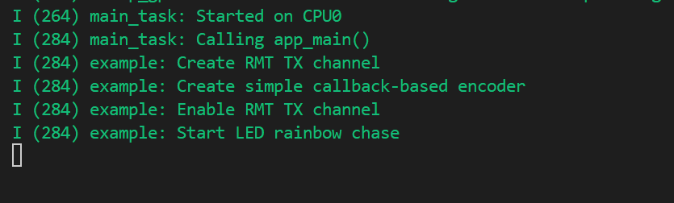
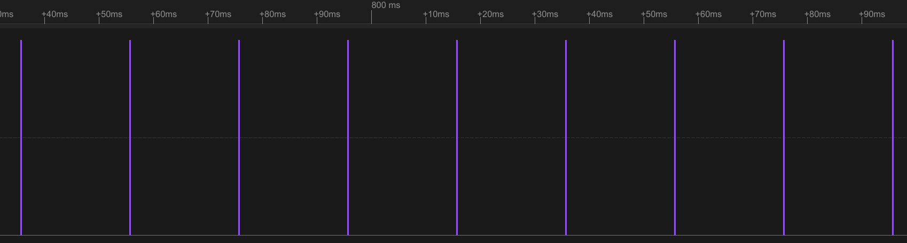
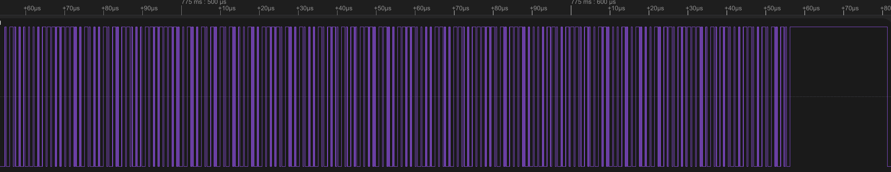
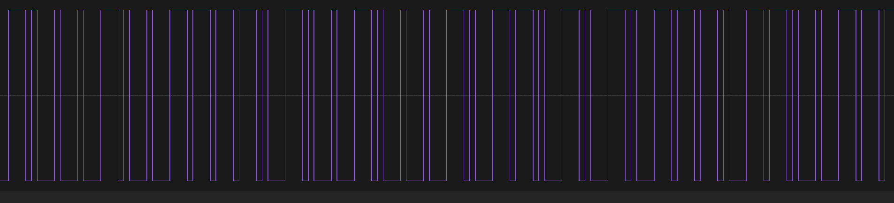

# RMT Transmit Example -- LED Strip RMT传输实例-LED灯带

## 粗略阅读README文档

文档简介本例采用回调RMT编码器使用的回调函数驱动WS2812

硬件连接、构建烧录和示例输出

## 构建、烧录和监视

* 选择目标芯片
* 选择端口号
* 配置项目
* 点击**构建、烧录和监视**




观察灯带，呈现渐变彩灯效果，非常漂亮，笔者会对该代码进行仔细研究

## 分析代码

### 头文件和宏定义

头文件导入`<math.h>`用于数学变量函数计算，`"driver/rmt_tx.h"`用于RMT发送。宏定义`RMT_LED_STRIP_RESOLUTION_HZ`RMT滴答定时器分辨率，GPIO引脚，LED灯珠数量，**EXAMPLE_FRAME_DURATION_MS** 定义变化间隔， **EXAMPLE_ANGLE_INC_FRAME** 定义角度增量每帧差0.02弧度 ，**EXAMPLE_ANGLE_INC_LED**定义角度增量每灯差0.3弧度

```c
#include <string.h>
#include <math.h>
#include "freertos/FreeRTOS.h"
#include "freertos/task.h"
#include "esp_log.h"
#include "driver/rmt_tx.h"

#define RMT_LED_STRIP_RESOLUTION_HZ 10000000 // 10MHz resolution, 1 tick = 0.1us (led strip needs a high resolution)
#define RMT_LED_STRIP_GPIO_NUM      4

#define EXAMPLE_LED_NUMBERS         7

#define EXAMPLE_FRAME_DURATION_MS   20
#define EXAMPLE_ANGLE_INC_FRAME     0.02
#define EXAMPLE_ANGLE_INC_LED       0.3
```

### app_main()函数

1. 配置`rmt_tx_channel_config_t` 类型RMT TX**结构体**
   * `clk_src` 时钟源
   * `gpio_num` 绑定引脚
   * `mem_block_symbols` 通道专用内存块大小，至少64(不适用DMA情况下)
   * `resolution_hz` 通道时基分辨率
   * `trans_queue_depth` 内部队列事务深度
2. `rmt_new_tx_channel` **新建TX通道**
3. `rmt_new_simple_encoder` 创建[简易回调编码器](https://docs.espressif.com/projects/esp-idf/zh_CN/stable/esp32/api-reference/peripherals/rmt.html#id18)绑定一个特殊作用的回调函数
4. **使能TX通道**
5. 主循环中先进行颜色计算和写入 
   1. 分别为每个灯配置颜色
   2. `angle = offset + (led * EXAMPLE_ANGLE_INC_LED);` **offset**每次加**EXAMPLE_FRAME_DURATION_MS** ，代表曲线在时间轴上的偏移量；循环中**led** 乘 **EXAMPLE_ANGLE_INC_LED** 是每个灯的偏移量
   3. `color_off` 被赋值为120°，采用乘法的方式将红绿蓝天然分开
   4. 写入数组时将数映射到0-255范围内

   | led | angle (rad) | R 值 | G 值 | B 值 | 写入下标 (RGB)  |
    | --- | ----------- | --- | --- | --- | ----------- |
    | 0   | 0.000       | 255 | 18  | 11  | \[0,1,2]    |
    | 1   | 0.300       | 254 | 55  | 49  | \[3,4,5]    |
    | 2   | 0.600       | 246 | 115 | 108 | \[6,7,8]    |
    | 3   | 0.900       | 229 | 174 | 167 | \[9,10,11]  |
    | 4   | 1.200       | 201 | 216 | 210 | \[12,13,14] |

    表格演示R值减小，G和B值增加，在周期内会有R最强，G最强，B最强的时候，并循环。(*由于sin函数是个周期函数，一个周期是360°，所以乘120°的倍数在数学上三个值不会有交集，且颜色呈现渐变的效果*)
6. `rmt_transmit` 传输数据，**loop_count**为0代表只传输一次，**simple_encoder**是简易函数创建的编码器
7. `rmt_tx_wait_all_done` 等待传输完成
8. 延时；累加；重置减小计算量，防止过大

```c
void app_main(void)
{
    ESP_LOGI(TAG, "Create RMT TX channel");
    rmt_channel_handle_t led_chan = NULL;
    rmt_tx_channel_config_t tx_chan_config = {
        .clk_src = RMT_CLK_SRC_DEFAULT, // select source clock
        .gpio_num = RMT_LED_STRIP_GPIO_NUM,
        .mem_block_symbols = 64, // increase the block size can make the LED less flickering
        .resolution_hz = RMT_LED_STRIP_RESOLUTION_HZ,
        .trans_queue_depth = 4, // set the number of transactions that can be pending in the background
    };
    ESP_ERROR_CHECK(rmt_new_tx_channel(&tx_chan_config, &led_chan));

    ESP_LOGI(TAG, "Create simple callback-based encoder");
    rmt_encoder_handle_t simple_encoder = NULL;
    const rmt_simple_encoder_config_t simple_encoder_cfg = {
        .callback = encoder_callback
        //Note we don't set min_chunk_size here as the default of 64 is good enough.
    };
    ESP_ERROR_CHECK(rmt_new_simple_encoder(&simple_encoder_cfg, &simple_encoder));

    ESP_LOGI(TAG, "Enable RMT TX channel");
    ESP_ERROR_CHECK(rmt_enable(led_chan));

    ESP_LOGI(TAG, "Start LED rainbow chase");
    rmt_transmit_config_t tx_config = {
        .loop_count = 0, // no transfer loop
    };
    float offset = 0;
    while (1) {
        for (int led = 0; led < EXAMPLE_LED_NUMBERS; led++) {
            // Build RGB pixels. Each color is an offset sine, which gives a
            // hue-like effect.
            float angle = offset + (led * EXAMPLE_ANGLE_INC_LED);
            const float color_off = (M_PI * 2) / 3;
            led_strip_pixels[led * 3 + 0] = sin(angle + color_off * 0) * 127 + 128;
            led_strip_pixels[led * 3 + 1] = sin(angle + color_off * 1) * 127 + 128;
            led_strip_pixels[led * 3 + 2] = sin(angle + color_off * 2) * 117 + 128; // 参数为117 人为降低蓝色值，色调会偏暖
        }
        // Flush RGB values to LEDs
        ESP_ERROR_CHECK(rmt_transmit(led_chan, simple_encoder, led_strip_pixels, sizeof(led_strip_pixels), &tx_config));
        ESP_ERROR_CHECK(rmt_tx_wait_all_done(led_chan, portMAX_DELAY));
        vTaskDelay(pdMS_TO_TICKS(EXAMPLE_FRAME_DURATION_MS));
        //Increase offset to shift pattern
        offset += EXAMPLE_ANGLE_INC_FRAME;
        if (offset > 2 * M_PI) {
            offset -= 2 * M_PI;
        }
    }
}
```

### callback[回调函数](https://docs.espressif.com/projects/esp-idf/zh_CN/stable/esp32/api-reference/peripherals/rmt.html#_CPPv422rmt_encode_simple_cb_t) 

回调函数将指定数据流变换为硬件信号，参数如下

传参过程在 `rmt_transmit` 中，由它传入原始数据(data)和数据长度(data_size)。`symbols_written` 和 `symbols_free` 由系统自动读取，其他参数为传出参数，`symbols` 即为最终发送给RMT的符号

1. `symbols_free < 8` ws2812一个数据位需要一个字节，**空间不足直接返回**
2. `data_pos` 计算下一发送字节(*symbols_written*为已发送符合数，除8即为下一字节序号)
3. 判断**是否发完**，发完在结果**加上复位符**，并把`done`置1**通知RMT已完成**，返回发送的字节数（symbol_pos或1）
4. 循环填入，检测每一位的0或1，往**symbols**中填入对应的ws2812的01码
5. 返回发送的字节数

```c
static size_t encoder_callback(const void *data, size_t data_size,
                               size_t symbols_written, size_t symbols_free,
                               rmt_symbol_word_t *symbols, bool *done, void *arg)
{
    // We need a minimum of 8 symbol spaces to encode a byte. We only
    // need one to encode a reset, but it's simpler to simply demand that
    // there are 8 symbol spaces free to write anything.
    if (symbols_free < 8) {
        return 0;
    }

    // We can calculate where in the data we are from the symbol pos.
    // Alternatively, we could use some counter referenced by the arg
    // parameter to keep track of this.
    size_t data_pos = symbols_written / 8;
    uint8_t *data_bytes = (uint8_t*)data;
    if (data_pos < data_size) {
        // Encode a byte
        size_t symbol_pos = 0;
        for (int bitmask = 0x80; bitmask != 0; bitmask >>= 1) {
            if (data_bytes[data_pos]&bitmask) {
                symbols[symbol_pos++] = ws2812_one;
            } else {
                symbols[symbol_pos++] = ws2812_zero;
            }
        }
        // We're done; we should have written 8 symbols.
        return symbol_pos;
    } else {
        //All bytes already are encoded.
        //Encode the reset, and we're done.
        symbols[0] = ws2812_reset;
        *done = 1; //Indicate end of the transaction.
        return 1; //we only wrote one symbol
    }
}
```

### 协议对应编码

编码均为`rmt_symbol_word_t`类型结构体，用于配置**符合协议的硬件码** (*RMT 帧的最小数据单元称为 RMT 符号，在驱动程序中以 rmt_symbol_word_t 表示。*)

* `level0` 代表**一帧中先发送的电平**
* `duration0` 代表先发送电平的**持续时间**
* `level1` 代表**一帧中后发送的电平**
* `duration1` 代表后发送电平的**持续时间**

复位码始终是0电平，且持续时间需50us以上，故定义如下

```c
static const rmt_symbol_word_t ws2812_zero = {
    .level0 = 1,
    .duration0 = 0.3 * RMT_LED_STRIP_RESOLUTION_HZ / 1000000, // T0H=0.3us
    .level1 = 0,
    .duration1 = 0.9 * RMT_LED_STRIP_RESOLUTION_HZ / 1000000, // T0L=0.9us
};

static const rmt_symbol_word_t ws2812_one = {
    .level0 = 1,
    .duration0 = 0.9 * RMT_LED_STRIP_RESOLUTION_HZ / 1000000, // T1H=0.9us
    .level1 = 0,
    .duration1 = 0.3 * RMT_LED_STRIP_RESOLUTION_HZ / 1000000, // T1L=0.3us
};

//reset defaults to 50uS
static const rmt_symbol_word_t ws2812_reset = {
    .level0 = 1,
    .duration0 = RMT_LED_STRIP_RESOLUTION_HZ / 1000000 * 50 / 2,
    .level1 = 0,
    .duration1 = RMT_LED_STRIP_RESOLUTION_HZ / 1000000 * 50 / 2,
};
```

## 总结

本例程采用了较为简单的方法，即编写回调函数写入RMT编码的方式驱动LED灯带。没有各种的嵌套和绑定，较为简介明了。对于笔者以后使用RMT进行特殊协议的编码，有新的思路和方法。复杂方法有更多的配置，简单方法更加简便，后续的使用需要自行判断。