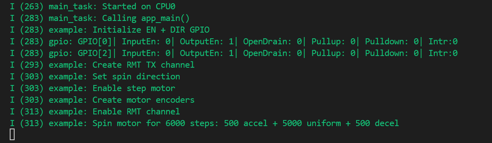
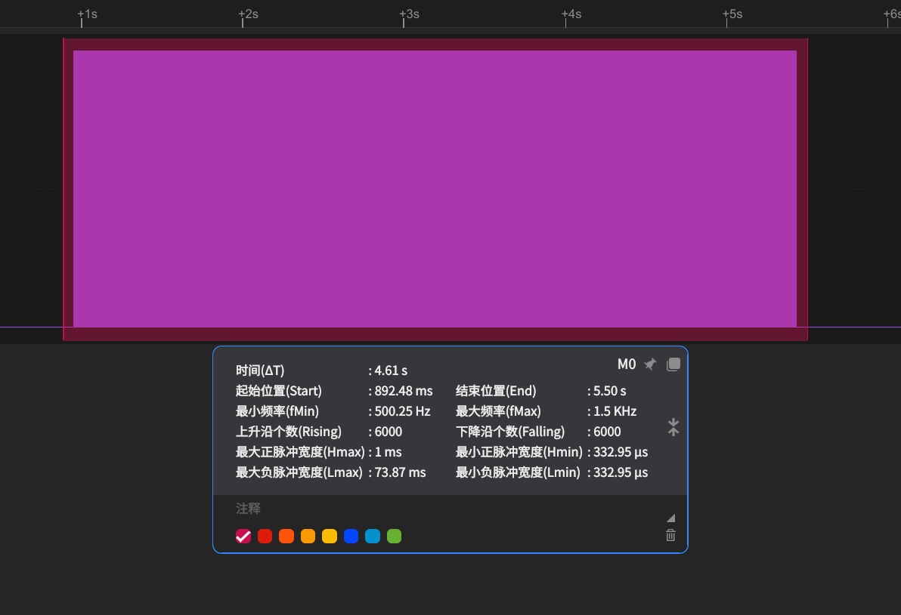
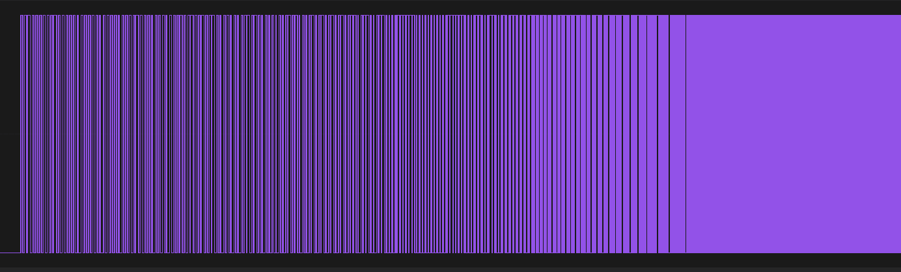
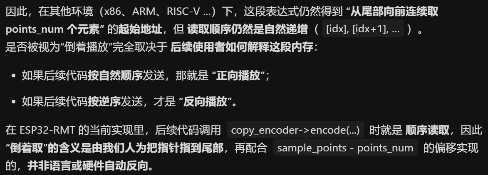

# RMT Based Stepper Motor Smooth Controller 基于RMT的步进电机控制

## 粗略阅读README文档

文档简介本例展示RMT控制步进电机驱动模块驱动步进电机，包括加速、匀速、减速 (*查询文档，一个RMT有8个通道，每个通道都可单独控制一个电机*)

硬件连接、构建烧录和示例输出

## 构建、烧录和监视

* 选择目标芯片
* 选择端口
* 配置项目
* 点击**构建、烧录和监视**



根据逻辑分析仪观察，波形占空比一直维持在50%，周期由2ms逐渐降低至666us，并保持一定时间，再逐渐升高至2ms

## 分析代码

### 结构体和宏定义

#### main.c文件

宏定义电机驱动的使能引脚，方向引脚，信号输出引脚；使能电平，方向（顺时针/逆时针）

```c
///////////////////////////////Change the following configurations according to your board//////////////////////////////
#define STEP_MOTOR_GPIO_EN       0
#define STEP_MOTOR_GPIO_DIR      2
#define STEP_MOTOR_GPIO_STEP     4
#define STEP_MOTOR_ENABLE_LEVEL  0 // DRV8825 is enabled on low level
#define STEP_MOTOR_SPIN_DIR_CLOCKWISE 0
#define STEP_MOTOR_SPIN_DIR_COUNTERCLOCKWISE !STEP_MOTOR_SPIN_DIR_CLOCKWISE

#define STEP_MOTOR_RESOLUTION_HZ 1000000 // 1MHz resolution
```

#### stepper_motor_encoder.h

`stepper_motor_uniform_encoder_config_t` 只定义定时器频率，用于匀速时避免冗杂参数占用RAM

`stepper_motor_curve_encoder_config_t` 梯形加减速结构体

* `resolution` 定时器频率
* `sample_points` 速度变换阶段采样点个数
* `start_freq_hz`变化起始频率
* `end_freq_hz` 变换结束频率

通过改变起始和结束频率改变加减速过程，采用点个数需小于频率变换，采样点越多变换越平滑，但会增大计算量

```c
/**
 * @brief Stepper motor curve encoder configuration
 */
typedef struct {
    uint32_t resolution;    // Encoder resolution, in Hz
    uint32_t sample_points; // Sample points used for deceleration phase. Note: |end_freq_hz - start_freq_hz| >= sample_points
    uint32_t start_freq_hz; // Start frequency on the curve, in Hz
    uint32_t end_freq_hz;   // End frequency on the curve, in Hz
} stepper_motor_curve_encoder_config_t;

/**
 * @brief Stepper motor uniform encoder configuration
 */
typedef struct {
    uint32_t resolution; // Encoder resolution, in Hz
} stepper_motor_uniform_encoder_config_t;
```

#### stepper_motor_encoder.c

`rmt_stepper_curve_encoder_t`自定义rmt编码器结构体，参数和协议编码有所变化

* `base`用于继承，必须放在第一位，确保结构体类型为`rmt_encoder_t`
* `copy_encoder` 是复制编码器的指针
* `sample_points` 是速度变换的采样点
* `flags.is_accel_curve` 标志位，指定占用1位
* `curve_table` 边长数组，储存预生成的RMT符号序列，即加减速的不同速度对应频率波形

`rmt_stepper_uniform_encoder_t` 自定义编码器，用于匀速，只有分辨率作为基础参数

```c
typedef struct {
    rmt_encoder_t base;
    rmt_encoder_handle_t copy_encoder;
    uint32_t sample_points;
    struct {
        uint32_t is_accel_curve: 1;
    } flags;
    rmt_symbol_word_t curve_table[];
} rmt_stepper_curve_encoder_t;

typedef struct {
    rmt_encoder_t base;
    rmt_encoder_handle_t copy_encoder;
    uint32_t resolution;
} rmt_stepper_uniform_encoder_t;

```

### app_main()函数

1. 配置GPIO结构体，将**指定引脚配置为无中断输出**模式
2. 配置**RMT的TX通道**(*具体参数笔者不作解释*) [RMT的TX通道](https://docs.espressif.com/projects/esp-idf/zh_CN/stable/esp32/api-reference/peripherals/rmt.html#rmt-tx)
3. 根据配置**设置GPIO引脚**，以配置驱动模块
4. 配置**加速结构体** `accel_encoder_config` 并调用函数`rmt_new_stepper_motor_curve_encoder`编码
5. 配置**匀速结构体** `uniform_encoder_config` 并调用函数`rmt_new_stepper_motor_uniform_encoder`编码
6. 配置**减速结构体** `decel_encoder_config` 并调用函数`rmt_new_stepper_motor_curve_encoder`编码
7. *RMT 外设本身就是“硬件定时器 + FIFO + DMA”的组合体，所有脉冲间隔和持续时间已经被编码成定时符号，由硬件精确输出；CPU 只需要一次性把符号表交给 RMT，之后就可以去做别的事*
8. **const**常量定义加速采样点(`accel_samples`)、匀速频率(`uniform_speed_hz`)、减速采样点(`decel_samples`)
9. 主循环中RMT输出，由于加减速采样点均为500，即各输出500个脉冲，匀速配置`loop_count`为5000，即输出5000个脉冲，总脉冲数为6000，并能够及时停止

```c
void app_main(void)
{
    ESP_LOGI(TAG, "Initialize EN + DIR GPIO");
    gpio_config_t en_dir_gpio_config = {
        .mode = GPIO_MODE_OUTPUT,
        .intr_type = GPIO_INTR_DISABLE,
        .pin_bit_mask = 1ULL << STEP_MOTOR_GPIO_DIR | 1ULL << STEP_MOTOR_GPIO_EN,
    };
    ESP_ERROR_CHECK(gpio_config(&en_dir_gpio_config));

    ESP_LOGI(TAG, "Create RMT TX channel");
    rmt_channel_handle_t motor_chan = NULL;
    rmt_tx_channel_config_t tx_chan_config = {
        .clk_src = RMT_CLK_SRC_DEFAULT, // select clock source
        .gpio_num = STEP_MOTOR_GPIO_STEP,
        .mem_block_symbols = 64,
        .resolution_hz = STEP_MOTOR_RESOLUTION_HZ,
        .trans_queue_depth = 10, // set the number of transactions that can be pending in the background
    };
    ESP_ERROR_CHECK(rmt_new_tx_channel(&tx_chan_config, &motor_chan));

    ESP_LOGI(TAG, "Set spin direction");
    gpio_set_level(STEP_MOTOR_GPIO_DIR, STEP_MOTOR_SPIN_DIR_CLOCKWISE);
    ESP_LOGI(TAG, "Enable step motor");
    gpio_set_level(STEP_MOTOR_GPIO_EN, STEP_MOTOR_ENABLE_LEVEL);

    ESP_LOGI(TAG, "Create motor encoders");
    stepper_motor_curve_encoder_config_t accel_encoder_config = {
        .resolution = STEP_MOTOR_RESOLUTION_HZ,
        .sample_points = 500,
        .start_freq_hz = 500,
        .end_freq_hz = 1500,
    };
    rmt_encoder_handle_t accel_motor_encoder = NULL;
    ESP_ERROR_CHECK(rmt_new_stepper_motor_curve_encoder(&accel_encoder_config, &accel_motor_encoder));

    stepper_motor_uniform_encoder_config_t uniform_encoder_config = {
        .resolution = STEP_MOTOR_RESOLUTION_HZ,
    };
    rmt_encoder_handle_t uniform_motor_encoder = NULL;
    ESP_ERROR_CHECK(rmt_new_stepper_motor_uniform_encoder(&uniform_encoder_config, &uniform_motor_encoder));

    stepper_motor_curve_encoder_config_t decel_encoder_config = {
        .resolution = STEP_MOTOR_RESOLUTION_HZ,
        .sample_points = 500,
        .start_freq_hz = 1500,
        .end_freq_hz = 500,
    };
    rmt_encoder_handle_t decel_motor_encoder = NULL;
    ESP_ERROR_CHECK(rmt_new_stepper_motor_curve_encoder(&decel_encoder_config, &decel_motor_encoder));

    ESP_LOGI(TAG, "Enable RMT channel");
    ESP_ERROR_CHECK(rmt_enable(motor_chan));

    ESP_LOGI(TAG, "Spin motor for 6000 steps: 500 accel + 5000 uniform + 500 decel");
    rmt_transmit_config_t tx_config = {
        .loop_count = 0,
    };

    const static uint32_t accel_samples = 500;
    const static uint32_t uniform_speed_hz = 1500;
    const static uint32_t decel_samples = 500;

    while (1) {
        // acceleration phase
        tx_config.loop_count = 0;
        ESP_ERROR_CHECK(rmt_transmit(motor_chan, accel_motor_encoder, &accel_samples, sizeof(accel_samples), &tx_config));

        // uniform phase
        tx_config.loop_count = 5000;
        ESP_ERROR_CHECK(rmt_transmit(motor_chan, uniform_motor_encoder, &uniform_speed_hz, sizeof(uniform_speed_hz), &tx_config));

        // deceleration phase
        tx_config.loop_count = 0;
        ESP_ERROR_CHECK(rmt_transmit(motor_chan, decel_motor_encoder, &decel_samples, sizeof(decel_samples), &tx_config));
        // wait all transactions finished
        ESP_ERROR_CHECK(rmt_tx_wait_all_done(motor_chan, -1));

        vTaskDelay(pdMS_TO_TICKS(1000));
    }
}
```

> 笔者对于例程参数进行改动，1000分频的电机300转每分，即频率5000HZ，完全能够正常运行，且能自由调整加速步数、减速步数和匀速步数

### 自定义加减速和匀速编码器函数

`rmt_new_stepper_motor_curve_encoder` 是加减速状态编码函数

1. 非空检测不作解释
2. `rmt_alloc_encoder_mem`分频内存空间 *由于内部有不定长数组，分配空间为基础`rmt_stepper_curve_encoder_t`+采样点个数乘`rmt_symbol_word_t`RMT符号大小*
3. `rmt_new_copy_encoder` 新建复制编码器
4. `is_accel_curve` 判断加速或者减速
5. `curve_step` 变量储存步长(*频率变换除以采样数*)，并在循环中调用函数进行S形加减速计算存入`smooth_freq`中
6. 将计算值写入输出数组中
7. 减速阶段数组反向填充
8. 宏判断`curve_step`步数是否为0，即数组是否全部填充完成
9. 把配置好的数据存入`step_encoder`并返回

`rmt_new_stepper_motor_uniform_encoder` 是匀速状态编码函数

1. 非空检测，只分配`rmt_stepper_uniform_encoder_t`主体内存
2. 新建复制编码器，配置基本参数

```c
esp_err_t rmt_new_stepper_motor_curve_encoder(const stepper_motor_curve_encoder_config_t *config, rmt_encoder_handle_t *ret_encoder)
{
    esp_err_t ret = ESP_OK;
    rmt_stepper_curve_encoder_t *step_encoder = NULL;
    float smooth_freq;
    uint32_t symbol_duration;
    ESP_GOTO_ON_FALSE(config && ret_encoder, ESP_ERR_INVALID_ARG, err, TAG, "invalid arguments");
    ESP_GOTO_ON_FALSE(config->sample_points, ESP_ERR_INVALID_ARG, err, TAG, "sample points number can't be zero");
    ESP_GOTO_ON_FALSE(config->start_freq_hz != config->end_freq_hz, ESP_ERR_INVALID_ARG, err, TAG, "start freq can't equal to end freq");
    step_encoder = rmt_alloc_encoder_mem(sizeof(rmt_stepper_curve_encoder_t) + config->sample_points * sizeof(rmt_symbol_word_t));
    ESP_GOTO_ON_FALSE(step_encoder, ESP_ERR_NO_MEM, err, TAG, "no mem for stepper curve encoder");
    rmt_copy_encoder_config_t copy_encoder_config = {};
    ESP_GOTO_ON_ERROR(rmt_new_copy_encoder(&copy_encoder_config, &step_encoder->copy_encoder), err, TAG, "create copy encoder failed");
    bool is_accel_curve = config->start_freq_hz < config->end_freq_hz;

    // prepare the curve table, in RMT symbol format
    uint32_t curve_step = 0;
    if (is_accel_curve) {
        curve_step = (config->end_freq_hz - config->start_freq_hz) / (config->sample_points - 1);
        for (uint32_t i = 0; i < config->sample_points; i++) {
            smooth_freq = convert_to_smooth_freq(config->start_freq_hz, config->end_freq_hz, config->start_freq_hz + curve_step * i);
            symbol_duration = config->resolution / smooth_freq / 2;
            step_encoder->curve_table[i].level0 = 0;
            step_encoder->curve_table[i].duration0 = symbol_duration;
            step_encoder->curve_table[i].level1 = 1;
            step_encoder->curve_table[i].duration1 = symbol_duration;
        }
    } else {
        curve_step = (config->start_freq_hz - config->end_freq_hz) / (config->sample_points - 1);
        for (uint32_t i = 0; i < config->sample_points; i++) {
            smooth_freq = convert_to_smooth_freq(config->end_freq_hz, config->start_freq_hz, config->end_freq_hz + curve_step * i);
            symbol_duration = config->resolution / smooth_freq / 2;
            step_encoder->curve_table[config->sample_points - i - 1].level0 = 0;
            step_encoder->curve_table[config->sample_points - i - 1].duration0 = symbol_duration;
            step_encoder->curve_table[config->sample_points - i - 1].level1 = 1;
            step_encoder->curve_table[config->sample_points - i - 1].duration1 = symbol_duration;
        }
    }
    ESP_GOTO_ON_FALSE(curve_step > 0, ESP_ERR_INVALID_ARG, err, TAG, "|end_freq_hz - start_freq_hz| can't be smaller than sample_points");

    step_encoder->sample_points = config->sample_points;
    step_encoder->flags.is_accel_curve = is_accel_curve;
    step_encoder->base.del = rmt_del_stepper_motor_curve_encoder;
    step_encoder->base.encode = rmt_encode_stepper_motor_curve;
    step_encoder->base.reset = rmt_reset_stepper_motor_curve_encoder;
    *ret_encoder = &(step_encoder->base);
    return ESP_OK;
err:
    if (step_encoder) {
        if (step_encoder->copy_encoder) {
            rmt_del_encoder(step_encoder->copy_encoder);
        }
        free(step_encoder);
    }
    return ret;
}

esp_err_t rmt_new_stepper_motor_uniform_encoder(const stepper_motor_uniform_encoder_config_t *config, rmt_encoder_handle_t *ret_encoder)
{
    esp_err_t ret = ESP_OK;
    rmt_stepper_uniform_encoder_t *step_encoder = NULL;
    ESP_GOTO_ON_FALSE(config && ret_encoder, ESP_ERR_INVALID_ARG, err, TAG, "invalid arguments");
    step_encoder = rmt_alloc_encoder_mem(sizeof(rmt_stepper_uniform_encoder_t));
    ESP_GOTO_ON_FALSE(step_encoder, ESP_ERR_NO_MEM, err, TAG, "no mem for stepper uniform encoder");
    rmt_copy_encoder_config_t copy_encoder_config = {};
    ESP_GOTO_ON_ERROR(rmt_new_copy_encoder(&copy_encoder_config, &step_encoder->copy_encoder), err, TAG, "create copy encoder failed");

    step_encoder->resolution = config->resolution;
    step_encoder->base.del = rmt_del_stepper_motor_uniform_encoder;
    step_encoder->base.encode = rmt_encode_stepper_motor_uniform;
    step_encoder->base.reset = rmt_reset_stepper_motor_uniform;
    *ret_encoder = &(step_encoder->base);
    return ESP_OK;
err:
    if (step_encoder) {
        if (step_encoder->copy_encoder) {
            rmt_del_encoder(step_encoder->copy_encoder);
        }
        free(step_encoder);
    }
    return ret;
}
```

### base内部绑定函数

> reset函数和del函数由于加减速和匀速的结构体类型不同，各写了两个自定义函数，笔者不作解释，用的时候直接照搬就行

`rmt_encode_stepper_motor_curve` 是加减速时的数据流转硬件输出，由main中传入的data是采样点个数

1. 数据解码并存入局部变量，`points_num` 储存采样数
2. `encoded_symbols` 储存发送字符
3. 判断加速，直接调用copy复制编码器，把`curve_table`从前往后`points_num`个RMT符号传给硬件使用
4. 判断减速，反向传输，把`curve_table`从第`sample_points`个偏移值开始向前计数`points_num`个数传给硬件使用


`rmt_encode_stepper_motor_uniform` 是匀速时进行的函数，传入参数是匀速时的频率

1. 数据解码并存入局部变量，`target_freq_hz` 储存频率
2. `symbol_duration` 计算每个电机波多少tick并写入 `freq_sample` 这一符号中
3. 传入参数确定发送波形，次数由**loop_count**重复次数决定

```c
static size_t rmt_encode_stepper_motor_curve(rmt_encoder_t *encoder, rmt_channel_handle_t channel, const void *primary_data, size_t data_size, rmt_encode_state_t *ret_state)
{
    rmt_stepper_curve_encoder_t *motor_encoder = __containerof(encoder, rmt_stepper_curve_encoder_t, base);
    rmt_encoder_handle_t copy_encoder = motor_encoder->copy_encoder;
    rmt_encode_state_t session_state = RMT_ENCODING_RESET;
    uint32_t points_num = *(uint32_t *)primary_data;
    size_t encoded_symbols = 0;
    if (motor_encoder->flags.is_accel_curve) {
        encoded_symbols = copy_encoder->encode(copy_encoder, channel, &motor_encoder->curve_table[0],
                                               points_num * sizeof(rmt_symbol_word_t), &session_state);
    } else {
        encoded_symbols = copy_encoder->encode(copy_encoder, channel, &motor_encoder->curve_table[0] + motor_encoder->sample_points - points_num,
                                               points_num * sizeof(rmt_symbol_word_t), &session_state);
    }
    *ret_state = session_state;
    return encoded_symbols;
}

static size_t rmt_encode_stepper_motor_uniform(rmt_encoder_t *encoder, rmt_channel_handle_t channel, const void *primary_data, size_t data_size, rmt_encode_state_t *ret_state)
{
    rmt_stepper_uniform_encoder_t *motor_encoder = __containerof(encoder, rmt_stepper_uniform_encoder_t, base);
    rmt_encoder_handle_t copy_encoder = motor_encoder->copy_encoder;
    rmt_encode_state_t session_state = RMT_ENCODING_RESET;
    uint32_t target_freq_hz = *(uint32_t *)primary_data;
    uint32_t symbol_duration = motor_encoder->resolution / target_freq_hz / 2;
    rmt_symbol_word_t freq_sample = {
        .level0 = 0,
        .duration0 = symbol_duration,
        .level1 = 1,
        .duration1 = symbol_duration,
    };
    size_t encoded_symbols = copy_encoder->encode(copy_encoder, channel, &freq_sample, sizeof(freq_sample), &session_state);
    *ret_state = session_state;
    return encoded_symbols;
}
```

### RMT类型辨别

`rmt_symbol_word_t` 代表一个RMT符号，相当于一个直接写入硬件的数据

`rmt_bytes_encoder_config_t` 是一个结构体，内部由 **bit0** 和 **bit1** 用于配置字节编码器 `bytes_encoder`

若有特殊的协议码，或者直接发送的数据，采用`rmt_symbol_word_t`格式；只有在配置字节编码器，配置协议码时使用`rmt_bytes_encoder_config_t`

笔者去查看了复制编码器的`encoder`源码，绑定在esp内部默认函数中，该函数中将传入数据data强制转换为 **rmt_symbol_word_t** 类型，故使用时传入参数必须一致才能正常工作。而字节编码器的`encoder`源码，也绑定在内部函数中，该函数强制转换类型为 **const uint8_T** 故传入时可以传入正常数据

### 加减速算法

> 笔者注，本例程采用的是[smoothstrp函数](https://www.jianshu.com/p/66035ae91bfd)，取用函数对应值用于变换值

函数传入参数为最低频率，最高频率，实际频率(*频率单调*)

1. 先将实际值进行归一化，并确定函数变量范围[0,1]
2. 将值代入函数中计算对应值
3. 把对应值反归一化为实际频率值

```c
static float convert_to_smooth_freq(uint32_t freq1, uint32_t freq2, uint32_t freqx)
{
    float normalize_x = ((float)(freqx - freq1)) / (freq2 - freq1);
    // third-order "smoothstep" function: https://en.wikipedia.org/wiki/Smoothstep
    float smooth_x = normalize_x * normalize_x * (3 - 2 * normalize_x);
    return smooth_x * (freq2 - freq1) + freq1;
}
```

笔者对于梯形加减速有过实验和尝试，在本例中有些想法。
由于有了起始速度和结束速度，即起始频率和结束频率，参考本例的采样点，只要把频率间隔均分，然后建立直线方程，或者直接写入即可。

$$ finalfreq = lowfreq + (highfreq-lowfreq) * i $$

上述公式中$i$取值范围从0到采样数，可以在数组中填满加速过程中频率的值，但笔者并未修改代码尝试，只是理论可行

## 总结

本例采用RMT的方式控制步进电机加减速，笔者记录的时候非常兴奋，因为笔者曾经自己用stm32编写加减速代码效果并不算特别好。在这笔者见识到了一种全新的方法，非常兴奋，效果非常好，也见识了RMT的另一种使用思路。同时RMT写入以后内部自己有时序控制，不需要自行编写程序，非常方便。也更深入了解了RMT的调用和各种类型的配合。