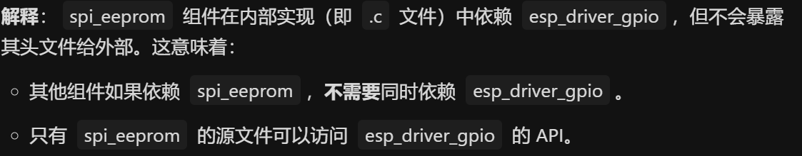
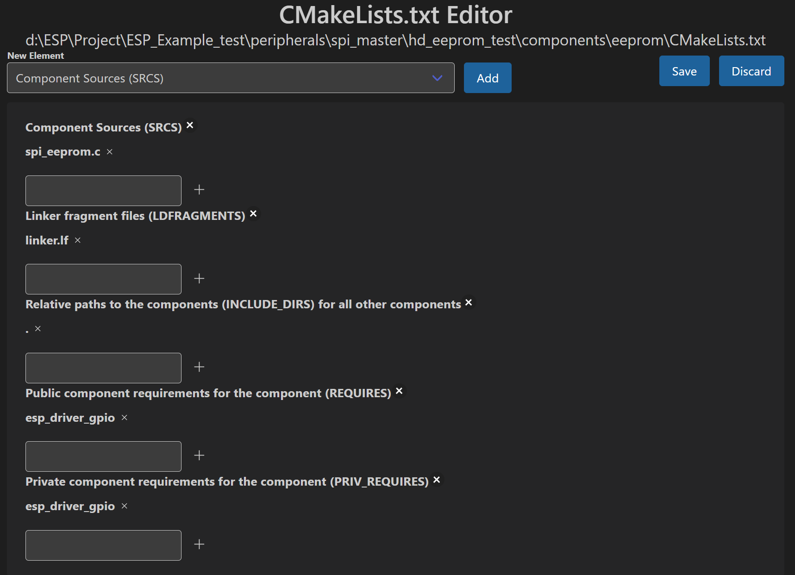

# SPI master half duplex EEPROM 半双工与EEPROM传输

## 粗略阅读README文档

文档极短，简介本例采用SPI半双工模式进行芯片读写

连接和注意事项

## 代码分析

> 由于笔者并没有对应的EEPROM芯片，故直接进行代码分析
> 本例采用了组件，对多文件编程非常重要，笔者会单独进行记录

### 头文件和宏定义

头文件都是基础头文件，`"spi_eeprom.h"`应该是自己创建的组件[组件配置](https://docs.espressif.com/projects/esp-idf/zh_CN/stable/esp32/api-guides/build-system.html#component-configuration)。[自定义组件教程](https://www.bilibili.com/video/BV182ftYHEox?spm_id_from=333.788.videopod.sections&vd_source=d39eb1c9b3e81d6e121f09fe248dfe02) esp-idf的项目有严格的架构和依赖，因此请不要自己创建文件夹当作依赖，请采用esp-idf提供的指定等，并完成CMake文件配置

宏定义采用`#if`进行判断， 根据目标芯片不同进行不同的定义

```c
#include <stdio.h>
#include <stdlib.h>
#include <string.h>
#include "freertos/FreeRTOS.h"
#include "freertos/task.h"
#include "driver/spi_master.h"
#include "driver/gpio.h"

#include "sdkconfig.h"
#include "esp_log.h"
#include "spi_eeprom.h"

/*
 This code demonstrates how to use the SPI master half duplex mode to read/write a AT932C46D EEPROM (8-bit mode).
*/

//////////////////////////////////////////////////////////////////////////////////////////////////////////
////////////// Please update the following configuration according to your HardWare spec /////////////////
//////////////////////////////////////////////////////////////////////////////////////////////////////////
#if CONFIG_IDF_TARGET_ESP32
#  if CONFIG_EXAMPLE_USE_SPI1_PINS
#   define EEPROM_HOST      SPI1_HOST
// Use default pins, same as the flash chip.
#   define PIN_NUM_MISO     7
#   define PIN_NUM_MOSI     8
#   define PIN_NUM_CLK      6
#  else
#   define EEPROM_HOST      SPI2_HOST
#   define PIN_NUM_MISO     18
#   define PIN_NUM_MOSI     23
#   define PIN_NUM_CLK      19
#  endif
#  define PIN_NUM_CS        13
#else
#  define EEPROM_HOST       SPI2_HOST
#  define PIN_NUM_MISO      13
#  define PIN_NUM_MOSI      12
#  define PIN_NUM_CLK       11
#  define PIN_NUM_CS        10
#endif
```

### app_main函数

主函数中很多采用自定义组件中的函数，此处只根据函数字面意思作分析

1. 初始化SPI总线 [SPI主机驱动编程指南](https://docs.espressif.com/projects/esp-idf/zh_CN/stable/esp32/api-reference/peripherals/spi_master.html)
2. eeprom的参数结构体配置和初始化
3. 安装GPIO中断驱动程序(*可为每个引脚单独分配中断*)
4. 初始化eeprom
5. 写使能
6. 尝试写入
7. 读取

```c
void app_main(void)
{
    esp_err_t ret;
#ifndef CONFIG_EXAMPLE_USE_SPI1_PINS
    ESP_LOGI(TAG, "Initializing bus SPI%d...", EEPROM_HOST + 1);
    spi_bus_config_t buscfg = {
        .miso_io_num = PIN_NUM_MISO,
        .mosi_io_num = PIN_NUM_MOSI,
        .sclk_io_num = PIN_NUM_CLK,
        .quadwp_io_num = -1,
        .quadhd_io_num = -1,
        .max_transfer_sz = 32,
    };
    //Initialize the SPI bus
    ret = spi_bus_initialize(EEPROM_HOST, &buscfg, SPI_DMA_CH_AUTO);
    ESP_ERROR_CHECK(ret);
#else
    ESP_LOGI(TAG, "Attach to main flash bus...");
#endif

    eeprom_config_t eeprom_config = {
        .cs_io = PIN_NUM_CS,
        .host = EEPROM_HOST,
        .miso_io = PIN_NUM_MISO,
    };
#ifdef CONFIG_EXAMPLE_INTR_USED
    eeprom_config.intr_used = true;
    gpio_install_isr_service(0);
#endif

    eeprom_handle_t eeprom_handle;

    ESP_LOGI(TAG, "Initializing device...");
    ret = spi_eeprom_init(&eeprom_config, &eeprom_handle);
    ESP_ERROR_CHECK(ret);

    ret = spi_eeprom_write_enable(eeprom_handle);
    ESP_ERROR_CHECK(ret);

    const char test_str[] = "Hello World!";
    ESP_LOGI(TAG, "Write: %s", test_str);
    for (int i = 0; i < sizeof(test_str); i++) {
        // No need for this EEPROM to erase before write.
        ret = spi_eeprom_write(eeprom_handle, i, test_str[i]);
        ESP_ERROR_CHECK(ret);
    }

    uint8_t test_buf[32] = "";
    for (int i = 0; i < sizeof(test_str); i++) {
        ret = spi_eeprom_read(eeprom_handle, i, &test_buf[i]);
        ESP_ERROR_CHECK(ret);
    }
    ESP_LOGI(TAG, "Read: %s", test_buf);
    ESP_LOGI(TAG, "Example finished.");

    while (1) {
        // Add your main loop handling code here.
        vTaskDelay(100);
    }
}
```

### 组件分析

#### 组件结构

* CMakeLists.txt  文件是CMake配置文件，保存相关配置，可对文件右键选择`CMakeLists.txt 编辑器`打开esp-idf框架自带编辑器配置，也可稍微学习CMake语法，自行配置
* linker.lf  文件是一个链接器片段文件（Linker Fragment），用于ESP-IDF框架中。包含对某些文件的映射规则，主要用于为链接器提供额外的段放置规则，控制代码和数据在内存中的布局。文件需要在CMake中引入，且是ESP-IDF特有文件，让开发者可以更简单地进行一些配置(**该文件笔者没找到具体文档，暂时也没具体需求，暂时不作分析)
* spi_eeprom.c 源文件，写有内部宏定义、结构体和具体函数实现
* spi_eeprom.h 头文件，写有外部使用结构体定义，函数声明和说明(*笔者注，需要给别人用的就在头文件声明，其他写在源文件*)

#### CMake文件

下方两种表示方式都是CMake文件，一个为源码，一个在esp-idf的专门编辑器中打开。

* `idf_component_register`源文件中该行为ESP-IDF提供的CMake宏，用于组件注册。编辑器中不作显示。
* `SRCS` 关键字，声明源文件，
* `LDFRAGMENTS` 指定链接器脚本
* `INCLUDE_DIRS` 指定头文件搜索路径，本例中代表在当前目录搜索文件
* `PRIV_REQUIRES` 声明私有依赖
* `REQUIRES` 公共依赖，即任何依赖该文件的组件必须同时依赖**esp_driver_spi**

笔者对比的时候发现idf的编辑器好像有误，建议具体配置参考[组件CMake文件](https://docs.espressif.com/projects/esp-idf/zh_CN/stable/esp32/api-guides/build-system.html#component-directories)

```cmake
idf_component_register(SRCS "spi_eeprom.c"
                    LDFRAGMENTS "linker.lf"
                    INCLUDE_DIRS "."
                    PRIV_REQUIRES esp_driver_gpio
                    REQUIRES esp_driver_spi)
```



#### 头文件结构体

以结构体作为eeprom的使用参数，更方便规范也更符合逻辑。参数包括spi主机编号，引脚号码，是否采用中断

```c
/// Configurations of the spi_eeprom
typedef struct {
    spi_host_device_t host; ///< The SPI host used, set before calling `spi_eeprom_init()`
    gpio_num_t cs_io;       ///< CS gpio number, set before calling `spi_eeprom_init()`
    gpio_num_t miso_io;     ///< MISO gpio number, set before calling `spi_eeprom_init()`
    bool intr_used;         ///< Whether to use polling or interrupt when waiting for write to be done. Set before calling `spi_eeprom_init()`.
} eeprom_config_t;
```

#### 源文件部分代码分析

> 由于源文件代码较多，且笔者对ROM没什么研究，暂时也没有研究的打算，故只对数据传输和SPI使用部分进行分析

内部使用结构体，包括spi句柄，信号量和eeprom参数

```c
/// Context (config and data) of the spi_eeprom
struct eeprom_context_t {
    eeprom_config_t cfg;        ///< Configuration by the caller.
    spi_device_handle_t spi;    ///< SPI device handle
    SemaphoreHandle_t ready_sem; ///< Semaphore for ready signal
};
```

初始化和反初始化，反初始化清除了总线，去除信号量和释放内存。

初始化过程分析

1. 内存初始化，一些前置判断不作赘述
2. 绑定参数
3. `spi_device_interface_config_t` 配置连接到总线的SPI设备 [结构体解释](https://docs.espressif.com/projects/esp-idf/zh_CN/stable/esp32/api-reference/peripherals/spi_master.html#_CPPv429spi_device_interface_config_t)
   * `command_bits` 命令阶段默认位数
   * `address_bits` 地址阶段默认位数(*本例未使用*)
   * `clock_speed_hz` SPI时钟速度
   * `mode` SPI模式，代表一对（CPOL、CPHA）配置，即时钟极性和时钟相位组合
   * `spics_io_num` 设备CS引脚，-1代表未使用
   * `queue_size` 队列事务大小
   * `pre_cb` 、 `post_cb` 分别是传输开始前和传输完成后采用的回调
   * `input_delay_ns` 从机最大数据有效时间
4. `spi_bus_add_device`注册连接到总线的设备。确保用参数配置设备可能需要的任何时序要求。完成上述操作后可获得设备句柄
5. `BIT64(x)` 即把x转换成只有第x位为1的64位位掩码
6. 配置GPIO引脚
7. 中断配置，包括信号量创建，配置中断触发方式，绑定回调函数，最后为了**防止误触发和资源浪费**暂时先关闭中断

```c
esp_err_t spi_eeprom_deinit(eeprom_context_t* ctx)
{
    spi_bus_remove_device(ctx->spi);
    if (ctx->cfg.intr_used) {
        vSemaphoreDelete(ctx->ready_sem);
    }
    free(ctx);
    return ESP_OK;
}

esp_err_t spi_eeprom_init(const eeprom_config_t *cfg, eeprom_context_t** out_ctx)
{
    esp_err_t err = ESP_OK;
    if (cfg->intr_used && cfg->host == SPI1_HOST) {
        ESP_LOGE(TAG, "interrupt cannot be used on SPI1 host.");
        return ESP_ERR_INVALID_ARG;
    }

    eeprom_context_t* ctx = (eeprom_context_t*)malloc(sizeof(eeprom_context_t));
    if (!ctx) {
        return ESP_ERR_NO_MEM;
    }

    *ctx = (eeprom_context_t) {
        .cfg = *cfg,
    };

    spi_device_interface_config_t devcfg = {
        .command_bits = 10,
        .clock_speed_hz = EEPROM_CLK_FREQ,
        .mode = 0,          //SPI mode 0
        /*
         * The timing requirements to read the busy signal from the EEPROM cannot be easily emulated
         * by SPI transactions. We need to control CS pin by SW to check the busy signal manually.
         */
        .spics_io_num = -1,
        .queue_size = 1,
        .flags = SPI_DEVICE_HALFDUPLEX | SPI_DEVICE_POSITIVE_CS,
        .pre_cb = cs_high,
        .post_cb = cs_low,
        .input_delay_ns = EEPROM_INPUT_DELAY_NS,  //the EEPROM output the data half a SPI clock behind.
    };
    //Attach the EEPROM to the SPI bus
    err = spi_bus_add_device(ctx->cfg.host, &devcfg, &ctx->spi);
    if (err != ESP_OK) {
        goto cleanup;
    }

    gpio_set_level(ctx->cfg.cs_io, 0);
    gpio_config_t cs_cfg = {
        .pin_bit_mask = BIT64(ctx->cfg.cs_io),
        .mode = GPIO_MODE_OUTPUT,
    };
    gpio_config(&cs_cfg);

    if (ctx->cfg.intr_used) {
        ctx->ready_sem = xSemaphoreCreateBinary();
        if (ctx->ready_sem == NULL) {
            err = ESP_ERR_NO_MEM;
            goto cleanup;
        }

        gpio_set_intr_type(ctx->cfg.miso_io, GPIO_INTR_POSEDGE);
        err = gpio_isr_handler_add(ctx->cfg.miso_io, ready_rising_isr, ctx);
        if (err != ESP_OK) {
            goto cleanup;
        }
        gpio_intr_disable(ctx->cfg.miso_io);
    }
    *out_ctx = ctx;
    return ESP_OK;

cleanup:
    if (ctx->spi) {
        spi_bus_remove_device(ctx->spi);
        ctx->spi = NULL;
    }
    if (ctx->ready_sem) {
        vSemaphoreDelete(ctx->ready_sem);
        ctx->ready_sem = NULL;
    }
    free(ctx);
    return err;
}
```

下方代码块为通信函数，包括读取、发送等。流程类似，单独进行结构体配置，然后发送数据。
`spi_device_acquire_bus`和`spi_device_release_bus`组合使用，向设备发送背对背传输事务

```c
esp_err_t spi_eeprom_read(eeprom_context_t* ctx, uint8_t addr, uint8_t* out_data)
{
    spi_transaction_t t = {
        .cmd = CMD_READ | (addr & ADDR_MASK),
        .rxlength = 8,
        .flags = SPI_TRANS_USE_RXDATA,
        .user = ctx,
    };
    esp_err_t err = spi_device_polling_transmit(ctx->spi, &t);
    if (err != ESP_OK) {
        return err;
    }

    *out_data = t.rx_data[0];
    return ESP_OK;
}

esp_err_t spi_eeprom_erase(eeprom_context_t* ctx, uint8_t addr)
{
    esp_err_t err;
    err = spi_device_acquire_bus(ctx->spi, portMAX_DELAY);
    if (err != ESP_OK) {
        return err;
    }

    err = eeprom_simple_cmd(ctx, CMD_ERASE | (addr & ADDR_MASK));

    if (err == ESP_OK) {
        err = eeprom_wait_done(ctx);
    }

    spi_device_release_bus(ctx->spi);
    return err;
}

esp_err_t spi_eeprom_write(eeprom_context_t* ctx, uint8_t addr, uint8_t data)
{
    esp_err_t err;
    err = spi_device_acquire_bus(ctx->spi, portMAX_DELAY);
    if (err != ESP_OK) {
        return err;
    }

    spi_transaction_t t = {
        .cmd = CMD_WRITE | (addr & ADDR_MASK),
        .length = 8,
        .flags = SPI_TRANS_USE_TXDATA,
        .tx_data = {data},
        .user = ctx,
    };
    err = spi_device_polling_transmit(ctx->spi, &t);

    if (err == ESP_OK) {
        err = eeprom_wait_done(ctx);
    }

    spi_device_release_bus(ctx->spi);
    return err;
}
```

## 总结

本例中再次熟悉了SPI主机发送的相关api，SPI主要用来和别的设备进行通信，所以根据不同的手册编写驱动程序或使用驱动程序是最重要的。关于esp的spi其他还有很多注意事项，但笔者水平有限，暂时用不到，就不作过多分析