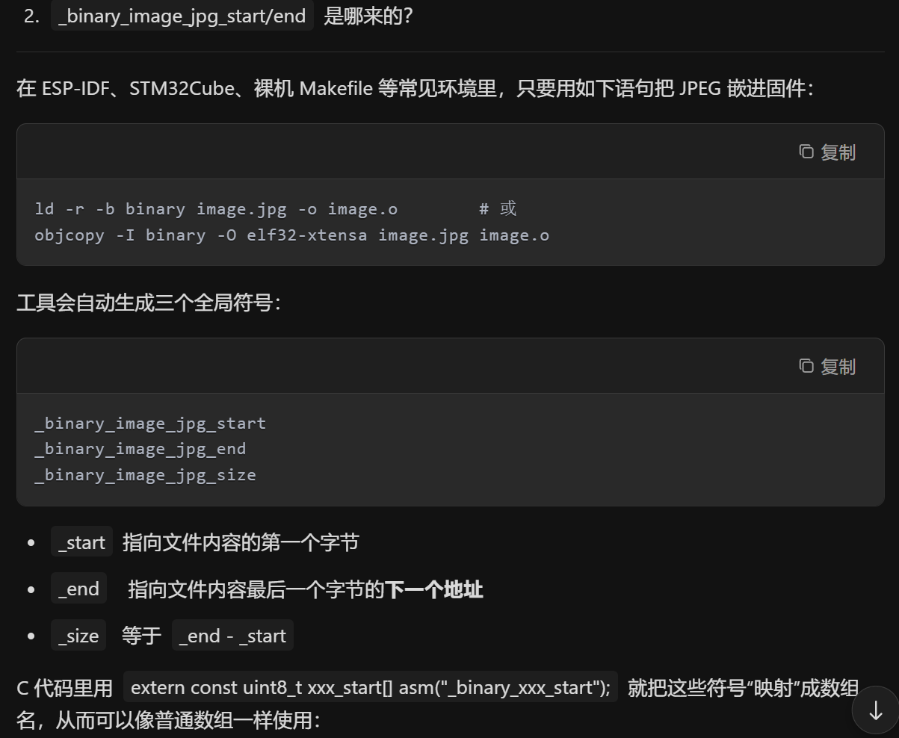
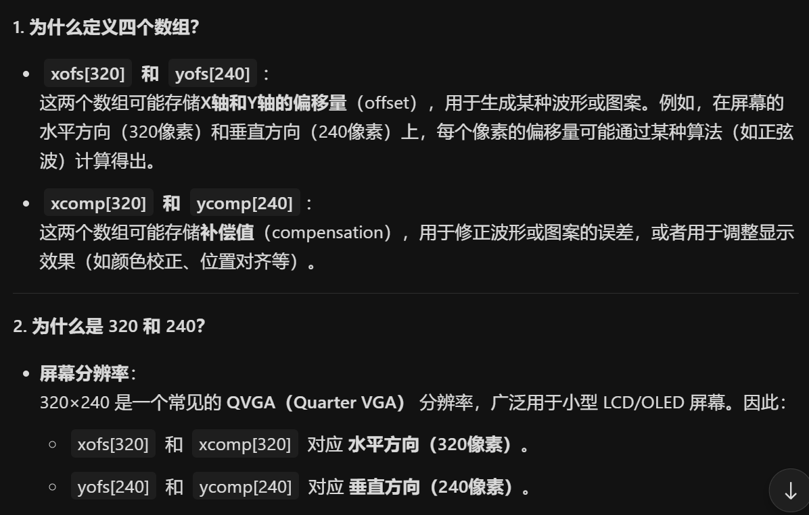
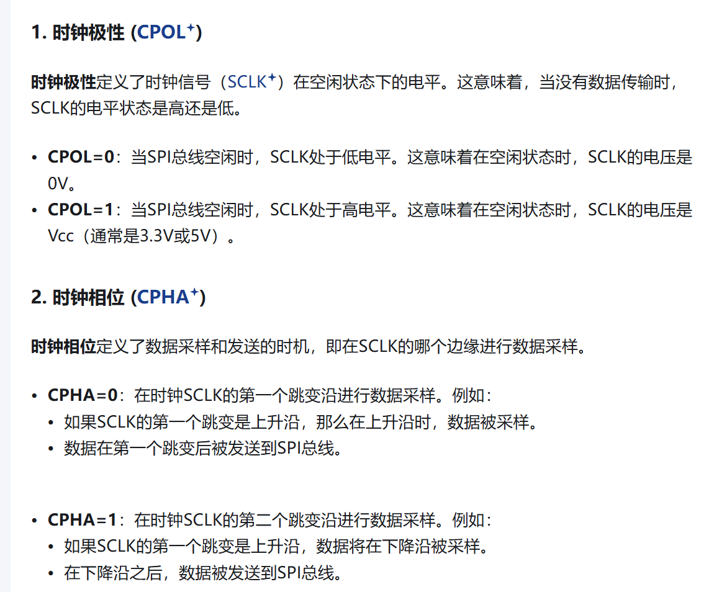

# SPI Host Driver SPI主机驱动LCD

> 笔者注，从这个文件开始，实验示例采用v5.5版本
> 本例由于笔者并无可供实验用的LCD，故编译后直接进行代码分析

## 粗略阅读README文档

文档简介示例旨在展示如何使用SPI主机驱动程序API，即主要演示API的使用。

硬件需要，构建烧录和示例输出

## 代码分析

> 本示例导入了外部组件库，笔者会酌情进行解读

### 全局/局部变量解读

#### main.c文件

`lcd_init_cmd_t` 结构体储存lcd指定数据。包括**命令寄存器地址**、**发送的命令**、特殊作用位(*bit6~0: 真正有效的参数个数;bit7: 置 1 表示发完这条命令后需要延时;特殊值 0xFF 表示整个初始化列表到此结束)

`type_lcd_t` 枚举用于后续使用时指定驱动芯片，1即ILI9341驱动，2即ST7789驱动

**DRAM_ATTR**关键字强制把这些表数据放入DMA可访问的DRAM中，数组中每个元素对应一个`lcd_init_cmd_t`类型指令。两个数组针对两种不同驱动的初始化

```c
/*
 The LCD needs a bunch of command/argument values to be initialized. They are stored in this struct.
*/
typedef struct {
    uint8_t cmd;
    uint8_t data[16];
    uint8_t databytes; //No of data in data; bit 7 = delay after set; 0xFF = end of cmds.
} lcd_init_cmd_t;

typedef enum {
    LCD_TYPE_ILI = 1,
    LCD_TYPE_ST,
    LCD_TYPE_MAX,
} type_lcd_t;

//Place data into DRAM. Constant data gets placed into DROM by default, which is not accessible by DMA.
DRAM_ATTR static const lcd_init_cmd_t st_init_cmds[] = {
    /* Memory Data Access Control, MX=MV=1, MY=ML=MH=0, RGB=0 */
    {0x36, {(1 << 5) | (1 << 6)}, 1},
    /* Interface Pixel Format, 16bits/pixel for RGB/MCU interface */
    {0x3A, {0x55}, 1},
    /* Porch Setting */
    {0xB2, {0x0c, 0x0c, 0x00, 0x33, 0x33}, 5},
    /* Gate Control, Vgh=13.65V, Vgl=-10.43V */
    {0xB7, {0x45}, 1},
    /* VCOM Setting, VCOM=1.175V */
    {0xBB, {0x2B}, 1},
    /* LCM Control, XOR: BGR, MX, MH */
    {0xC0, {0x2C}, 1},
    /* VDV and VRH Command Enable, enable=1 */
    {0xC2, {0x01, 0xff}, 2},
    /* VRH Set, Vap=4.4+... */
    {0xC3, {0x11}, 1},
    /* VDV Set, VDV=0 */
    {0xC4, {0x20}, 1},
    /* Frame Rate Control, 60Hz, inversion=0 */
    {0xC6, {0x0f}, 1},
    /* Power Control 1, AVDD=6.8V, AVCL=-4.8V, VDDS=2.3V */
    {0xD0, {0xA4, 0xA1}, 2},
    /* Positive Voltage Gamma Control */
    {0xE0, {0xD0, 0x00, 0x05, 0x0E, 0x15, 0x0D, 0x37, 0x43, 0x47, 0x09, 0x15, 0x12, 0x16, 0x19}, 14},
    /* Negative Voltage Gamma Control */
    {0xE1, {0xD0, 0x00, 0x05, 0x0D, 0x0C, 0x06, 0x2D, 0x44, 0x40, 0x0E, 0x1C, 0x18, 0x16, 0x19}, 14},
    /* Sleep Out */
    {0x11, {0}, 0x80},
    /* Display On */
    {0x29, {0}, 0x80},
    {0, {0}, 0xff}
};

DRAM_ATTR static const lcd_init_cmd_t ili_init_cmds[] = {
    /* Power control B, power control = 0, DC_ENA = 1 */
    {0xCF, {0x00, 0x83, 0X30}, 3},
    /* Power on sequence control,
     * cp1 keeps 1 frame, 1st frame enable
     * vcl = 0, ddvdh=3, vgh=1, vgl=2
     * DDVDH_ENH=1
     */
    {0xED, {0x64, 0x03, 0X12, 0X81}, 4},
    /* Driver timing control A,
     * non-overlap=default +1
     * EQ=default - 1, CR=default
     * pre-charge=default - 1
     */
    {0xE8, {0x85, 0x01, 0x79}, 3},
    /* Power control A, Vcore=1.6V, DDVDH=5.6V */
    {0xCB, {0x39, 0x2C, 0x00, 0x34, 0x02}, 5},
    /* Pump ratio control, DDVDH=2xVCl */
    {0xF7, {0x20}, 1},
    /* Driver timing control, all=0 unit */
    {0xEA, {0x00, 0x00}, 2},
    /* Power control 1, GVDD=4.75V */
    {0xC0, {0x26}, 1},
    /* Power control 2, DDVDH=VCl*2, VGH=VCl*7, VGL=-VCl*3 */
    {0xC1, {0x11}, 1},
    /* VCOM control 1, VCOMH=4.025V, VCOML=-0.950V */
    {0xC5, {0x35, 0x3E}, 2},
    /* VCOM control 2, VCOMH=VMH-2, VCOML=VML-2 */
    {0xC7, {0xBE}, 1},
    /* Memory access control, MX=MY=0, MV=1, ML=0, BGR=1, MH=0 */
    {0x36, {0x28}, 1},
    /* Pixel format, 16bits/pixel for RGB/MCU interface */
    {0x3A, {0x55}, 1},
    /* Frame rate control, f=fosc, 70Hz fps */
    {0xB1, {0x00, 0x1B}, 2},
    /* Enable 3G, disabled */
    {0xF2, {0x08}, 1},
    /* Gamma set, curve 1 */
    {0x26, {0x01}, 1},
    /* Positive gamma correction */
    {0xE0, {0x1F, 0x1A, 0x18, 0x0A, 0x0F, 0x06, 0x45, 0X87, 0x32, 0x0A, 0x07, 0x02, 0x07, 0x05, 0x00}, 15},
    /* Negative gamma correction */
    {0XE1, {0x00, 0x25, 0x27, 0x05, 0x10, 0x09, 0x3A, 0x78, 0x4D, 0x05, 0x18, 0x0D, 0x38, 0x3A, 0x1F}, 15},
    /* Column address set, SC=0, EC=0xEF */
    {0x2A, {0x00, 0x00, 0x00, 0xEF}, 4},
    /* Page address set, SP=0, EP=0x013F */
    {0x2B, {0x00, 0x00, 0x01, 0x3f}, 4},
    /* Memory write */
    {0x2C, {0}, 0},
    /* Entry mode set, Low vol detect disabled, normal display */
    {0xB7, {0x07}, 1},
    /* Display function control */
    {0xB6, {0x0A, 0x82, 0x27, 0x00}, 4},
    /* Sleep out */
    {0x11, {0}, 0x80},
    /* Display on */
    {0x29, {0}, 0x80},
    {0, {0}, 0xff},
};
```

#### decode_image.c

**asm**：GCC 的 “asm label” 扩展：把 C 标识符 和 汇编层面/链接器层面的符号名 强行绑定在一起。
换句话说，C 里叫 image_jpg_start，但在 .o 文件和最终 ELF 里实际引用的是 _binary_image_jpg_start 这个符号



```c
//Reference the binary-included jpeg file
extern const uint8_t image_jpg_start[] asm("_binary_image_jpg_start");
extern const uint8_t image_jpg_end[] asm("_binary_image_jpg_end");
//Define the height and width of the jpeg file. Make sure this matches the actual jpeg
//dimensions.
```

#### pretty_effect.c

`int8_t` 偏移范围-127~128 ；数组个数320和240与LCD实际像素数一致，对应每一行/列。在实际驱动中，数组用于预储存一行/列的数据。


```c
//Instead of calculating the offsets for each pixel we grab, we pre-calculate the valueswhenever a frame changes, then re-use
//these as we go through all the pixels in the frame. This is much, much faster.
static int8_t xofs[320], yofs[240];
static int8_t xcomp[320], ycomp[240];
```

### app_main()函数

1. 初始化配置变量
2. `spi_bus_config_t` 总线配置[结构体](https://docs.espressif.com/projects/esp-idf/zh_CN/stable/esp32/api-reference/peripherals/spi_master.html#_CPPv416spi_bus_config_t)
   * `miso_io_num` **主机输入从机输出**引脚
   * `mosi_io_num` **主机输出从机输入**引脚
   * `sclk_io_num` SPI用于**时钟输出引脚**，如果不使用配置为-1
   * `quadwp_io_num` 用于**写保护信号的GPIO引脚**，不使用配置为-1
   * `quadhd_io_num` 用于**保持信号的GPIO引脚**，不使用配置为-1
   * `max_transfer_sz`最大传输大小
3. `spi_device_interface_config_t` 设备配置[结构体](https://docs.espressif.com/projects/esp-idf/zh_CN/stable/esp32/api-reference/peripherals/spi_master.html#_CPPv429spi_device_interface_config_t)
   * `clock_speed_hz` SPI时钟速度
   * `mode` SPI 模式，代表一对（CPOL、CPHA）配置
    
   * `spics_io_num` **设备的CS引脚**
   * `queue_size` 队列事务的大小
   * `pre_cb` **传输开始前调用的回调**
4. `spi_bus_initialize` 函数**初始化SPI总线**
5. `spi_bus_add_device` 注册**连接到总线的设备**
6. 自定义函数进行初始化和初始启动LCD

```c
void app_main(void)
{
    esp_err_t ret;
    spi_device_handle_t spi;
    spi_bus_config_t buscfg = {
        .miso_io_num = PIN_NUM_MISO,
        .mosi_io_num = PIN_NUM_MOSI,
        .sclk_io_num = PIN_NUM_CLK,
        .quadwp_io_num = -1,
        .quadhd_io_num = -1,
        .max_transfer_sz = PARALLEL_LINES * 320 * 2 + 8
    };
    spi_device_interface_config_t devcfg = {
#ifdef CONFIG_LCD_OVERCLOCK
        .clock_speed_hz = 26 * 1000 * 1000,     //Clock out at 26 MHz
#else
        .clock_speed_hz = 10 * 1000 * 1000,     //Clock out at 10 MHz
#endif
        .mode = 0,                              //SPI mode 0
        .spics_io_num = PIN_NUM_CS,             //CS pin
        .queue_size = 7,                        //We want to be able to queue 7 transactions at a time
        .pre_cb = lcd_spi_pre_transfer_callback, //Specify pre-transfer callback to handle D/C line
    };
    //Initialize the SPI bus
    ret = spi_bus_initialize(LCD_HOST, &buscfg, SPI_DMA_CH_AUTO);
    ESP_ERROR_CHECK(ret);
    //Attach the LCD to the SPI bus
    ret = spi_bus_add_device(LCD_HOST, &devcfg, &spi);
    ESP_ERROR_CHECK(ret);
    //Initialize the LCD
    lcd_init(spi);
    //Initialize the effect displayed
    ret = pretty_effect_init();
    ESP_ERROR_CHECK(ret);

    //Go do nice stuff.
    display_pretty_colors(spi);
}
```

### LCD初始化函数

1. GPIO初始化配置，将DC(数据/命令选择)，RST(复位)，BCKL(背光控制)对应引脚配置为上拉输出模式
2. 设置GPIO引脚初始电平并等待完成
3. `lcd_get_id` 自定义函数获取lcd的型号判断(0/1)
4. 根据ID确定驱动型号
5. **CONFIG**起始的宏定义一般在项目配置，即menuconfig中配置，不同配置对应不同代码操作
6. while循环发送数组配置的不同驱动的初始化，即一串地址加命令(*根据驱动的要求，完成初始化*)
7. 启动背光

```c
//Initialize the display
void lcd_init(spi_device_handle_t spi)
{
    int cmd = 0;
    const lcd_init_cmd_t* lcd_init_cmds;

    //Initialize non-SPI GPIOs
    gpio_config_t io_conf = {};
    io_conf.pin_bit_mask = ((1ULL << PIN_NUM_DC) | (1ULL << PIN_NUM_RST) | (1ULL << PIN_NUM_BCKL));
    io_conf.mode = GPIO_MODE_OUTPUT;
    io_conf.pull_up_en = true;
    gpio_config(&io_conf);

    //Reset the display
    gpio_set_level(PIN_NUM_RST, 0);
    vTaskDelay(100 / portTICK_PERIOD_MS);
    gpio_set_level(PIN_NUM_RST, 1);
    vTaskDelay(100 / portTICK_PERIOD_MS);

    //detect LCD type
    uint32_t lcd_id = lcd_get_id(spi);
    int lcd_detected_type = 0;
    int lcd_type;

    printf("LCD ID: %08"PRIx32"\n", lcd_id);
    if (lcd_id == 0) {
        //zero, ili
        lcd_detected_type = LCD_TYPE_ILI;
        printf("ILI9341 detected.\n");
    } else {
        // none-zero, ST
        lcd_detected_type = LCD_TYPE_ST;
        printf("ST7789V detected.\n");
    }

#ifdef CONFIG_LCD_TYPE_AUTO
    lcd_type = lcd_detected_type;
#elif defined( CONFIG_LCD_TYPE_ST7789V )
    printf("kconfig: force CONFIG_LCD_TYPE_ST7789V.\n");
    lcd_type = LCD_TYPE_ST;
#elif defined( CONFIG_LCD_TYPE_ILI9341 )
    printf("kconfig: force CONFIG_LCD_TYPE_ILI9341.\n");
    lcd_type = LCD_TYPE_ILI;
#endif
    if (lcd_type == LCD_TYPE_ST) {
        printf("LCD ST7789V initialization.\n");
        lcd_init_cmds = st_init_cmds;
    } else {
        printf("LCD ILI9341 initialization.\n");
        lcd_init_cmds = ili_init_cmds;
    }

    //Send all the commands
    while (lcd_init_cmds[cmd].databytes != 0xff) {
        lcd_cmd(spi, lcd_init_cmds[cmd].cmd, false);
        lcd_data(spi, lcd_init_cmds[cmd].data, lcd_init_cmds[cmd].databytes & 0x1F);
        if (lcd_init_cmds[cmd].databytes & 0x80) {
            vTaskDelay(100 / portTICK_PERIOD_MS);
        }
        cmd++;
    }

    ///Enable backlight
    gpio_set_level(PIN_NUM_BCKL, LCD_BK_LIGHT_ON_LEVEL);
}
```

### lcd相关函数

`lcd_cmd` 函数采用轮询，即直接发送的方式发送cmd控制命令(*对于采用协议驱动的模块，一般有数据码和命令码两种*)

1. memset设置t中所有数据为0
2. 设置t中发送的数据，此函数只发送命令码
3. 采用轮询方式发送
4. 确保发送完成

`lcd_data` 函数采用轮询，即直接发送的方式发送data数据码，具体实现过程与上一代码基本相同

`lcd_spi_pre_transfer_callback` 函数作用在传输开始前，用于配置DC脚

`lcd_get_id` 

1. `spi_device_acquire_bus` 函数占用总线，用于连续发送或其他，此时与其他设备的传输处于待处理状态
2. `lcd_cmd` 发送命令码
3. 发送数据码并获取接收值(*spi的发送也会进行一次读取*)
4. 释放总线
5. 返回接收值

```c
/* Send a command to the LCD. Uses spi_device_polling_transmit, which waits
 * until the transfer is complete.
 *
 * Since command transactions are usually small, they are handled in polling
 * mode for higher speed. The overhead of interrupt transactions is more than
 * just waiting for the transaction to complete.
 */
void lcd_cmd(spi_device_handle_t spi, const uint8_t cmd, bool keep_cs_active)
{
    esp_err_t ret;
    spi_transaction_t t;
    memset(&t, 0, sizeof(t));       //Zero out the transaction
    t.length = 8;                   //Command is 8 bits
    t.tx_buffer = &cmd;             //The data is the cmd itself
    t.user = (void*)0;              //D/C needs to be set to 0
    if (keep_cs_active) {
        t.flags = SPI_TRANS_CS_KEEP_ACTIVE;   //Keep CS active after data transfer
    }
    ret = spi_device_polling_transmit(spi, &t); //Transmit!
    assert(ret == ESP_OK);          //Should have had no issues.
}

/* Send data to the LCD. Uses spi_device_polling_transmit, which waits until the
 * transfer is complete.
 *
 * Since data transactions are usually small, they are handled in polling
 * mode for higher speed. The overhead of interrupt transactions is more than
 * just waiting for the transaction to complete.
 */
void lcd_data(spi_device_handle_t spi, const uint8_t *data, int len)
{
    esp_err_t ret;
    spi_transaction_t t;
    if (len == 0) {
        return;    //no need to send anything
    }
    memset(&t, 0, sizeof(t));       //Zero out the transaction
    t.length = len * 8;             //Len is in bytes, transaction length is in bits.
    t.tx_buffer = data;             //Data
    t.user = (void*)1;              //D/C needs to be set to 1
    ret = spi_device_polling_transmit(spi, &t); //Transmit!
    assert(ret == ESP_OK);          //Should have had no issues.
}

//This function is called (in irq context!) just before a transmission starts. It will
//set the D/C line to the value indicated in the user field.
void lcd_spi_pre_transfer_callback(spi_transaction_t *t)
{
    int dc = (int)t->user;
    gpio_set_level(PIN_NUM_DC, dc);
}

uint32_t lcd_get_id(spi_device_handle_t spi)
{
    // When using SPI_TRANS_CS_KEEP_ACTIVE, bus must be locked/acquired
    spi_device_acquire_bus(spi, portMAX_DELAY);

    //get_id cmd
    lcd_cmd(spi, 0x04, true);

    spi_transaction_t t;
    memset(&t, 0, sizeof(t));
    t.length = 8 * 3;
    t.flags = SPI_TRANS_USE_RXDATA;
    t.user = (void*)1;

    esp_err_t ret = spi_device_polling_transmit(spi, &t);
    assert(ret == ESP_OK);

    // Release bus
    spi_device_release_bus(spi);

    return *(uint32_t*)t.rx_data;
}
```