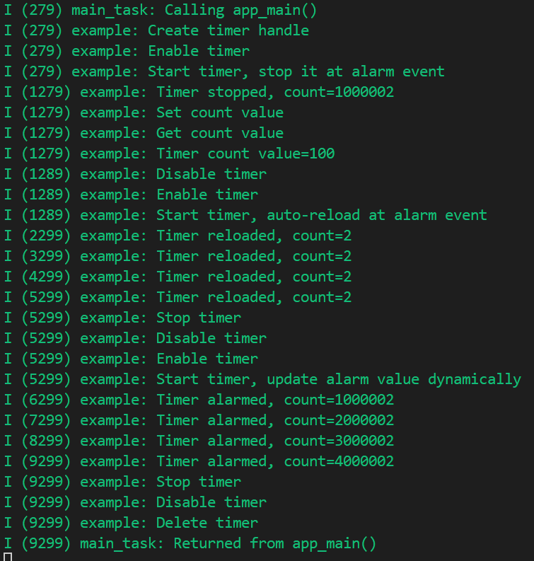

# General Purpose Timer 通用定时器

## 粗略阅读README文档

文档简介示例演示采用gptimer API生成周期性定时事件及操作

示例演示，构建烧录和示例输出

## 构建烧录和监视

* 选择目标芯片
* 选择端口号
* 点击 **构建、烧录和监视**

该输出均是 `example` 示例发出的提示输出。包括定时器的创建、启动、几种模式的转换等。

## 分析代码

### 头文件和变量定义

头文件使用了队列(`queue`) 自定义了 `example_queue_element_t` 结构体用于后续使用。

```c
#include <stdio.h>
#include "freertos/FreeRTOS.h"
#include "freertos/task.h"
#include "freertos/queue.h"
#include "driver/gptimer.h"
#include "esp_log.h"

static const char *TAG = "example";

typedef struct {
    uint64_t event_count;
} example_queue_element_t;
```

### app_main()函数

函数进行了队列、定时器等的配置创建和函数注册等

> 笔者不进行**ESP_LOGE**函数及其提示的具体解释说明 、
> [通用定时器编程指南](https://docs.espressif.com/projects/esp-idf/zh_CN/stable/esp32/api-reference/peripherals/gptimer.html)

1. 创建队列 `xQueueCreate(10, sizeof(example_queue_element_t))` 队列中可容纳元素数量为10，元素类型为前面定义的结构体 **example_queue_element_t**
2. 配置`gptimer_config_t`结构体参数
   * `clk_src` **时钟源** 默认时钟源
   * `direction` **方向** 向上计数模式
   * `resolution_hz` **分辨率/频率**
3. `gptimer_new_timer` 初始化定时器，`gptimer`作为定时器句柄
4. `gptimer_alarm_config_t` 通用定时器警报配置，`alarm_count` 设置触发警报事件的目标计数值
5. `gptimer_event_callbacks_t` 类型结构体定义回调函数
6. `gptimer_register_event_callbacks(gptimer, &cbs, queue)` 注册回调函数  参数分别为： **定时器句柄**，**回调函数组**，**传入回调函数的参数**
7. `gptimer_enable(gptimer)` 使能定时器
8. `gptimer_set_alarm_action(gptimer, &alarm_config1)` 使警报事件生效(*警报值已设置且定时器超过该值，则会立即触发警报。*)
9. `gptimer_start(gptimer)` 启动定时器
10. 检测队列数据并最多等待2000毫秒，根据不同情况进行输出
11. `gptimer_set_raw_count(gptimer, 100)` 直接写入定时器计数值
12. `(gptimer_get_raw_count(gptimer, &count)` 获取定时器计数值存入`count`变量
13. 禁用定时器，更换回调函数，再启用
14. 更换定时器警报配置，
    * `reload_count` 警报重新加载计数值
    * `alarm_count`  警报目标计数值
    * `.flags.auto_reload_on_alarm` 配置为**true**是重新加载计数值有效 (*顾名思义，开启后警报才会重复触发，不然就只会触发一次*)
15. 写入警报事件(使警报事件生效)
16. 启动定时器
17. 循环中等待警报产生4次
18. 停止定时器、禁用定时器，更换回调函数，启用定时器
19. 更换警报配置，不自动重加载，计数值100000不变
20. 等待四次警报事件
21. 停止、禁用、删除定时器
22. 删除队列

结合代码和示例演示输出，**定时器周期**事件需要配置**警报**，警报中配置**回调函数**。警报不启用自动重载时计数器会不断累加。启用自动重载后计数器在每次警报后会从设定的重载值进行累加。

```c
void app_main(void)
{
    example_queue_element_t ele;
    QueueHandle_t queue = xQueueCreate(10, sizeof(example_queue_element_t));
    if (!queue) {
        ESP_LOGE(TAG, "Creating queue failed");
        return;
    }

    ESP_LOGI(TAG, "Create timer handle");
    gptimer_handle_t gptimer = NULL;
    gptimer_config_t timer_config = {
        .clk_src = GPTIMER_CLK_SRC_DEFAULT,
        .direction = GPTIMER_COUNT_UP,
        .resolution_hz = 1000000, // 1MHz, 1 tick=1us
    };
    ESP_ERROR_CHECK(gptimer_new_timer(&timer_config, &gptimer));

    gptimer_event_callbacks_t cbs = {
        .on_alarm = example_timer_on_alarm_cb_v1,
    };
    ESP_ERROR_CHECK(gptimer_register_event_callbacks(gptimer, &cbs, queue));

    ESP_LOGI(TAG, "Enable timer");
    ESP_ERROR_CHECK(gptimer_enable(gptimer));

    ESP_LOGI(TAG, "Start timer, stop it at alarm event");
    gptimer_alarm_config_t alarm_config1 = {
        .alarm_count = 1000000, // period = 1s
    };
    ESP_ERROR_CHECK(gptimer_set_alarm_action(gptimer, &alarm_config1));
    ESP_ERROR_CHECK(gptimer_start(gptimer));
    if (xQueueReceive(queue, &ele, pdMS_TO_TICKS(2000))) {
        ESP_LOGI(TAG, "Timer stopped, count=%llu", ele.event_count);
    } else {
        ESP_LOGW(TAG, "Missed one count event");
    }

    ESP_LOGI(TAG, "Set count value");
    ESP_ERROR_CHECK(gptimer_set_raw_count(gptimer, 100));
    ESP_LOGI(TAG, "Get count value");
    uint64_t count;
    ESP_ERROR_CHECK(gptimer_get_raw_count(gptimer, &count));
    ESP_LOGI(TAG, "Timer count value=%llu", count);

    // before updating the alarm callback, we should make sure the timer is not in the enable state
    ESP_LOGI(TAG, "Disable timer");
    ESP_ERROR_CHECK(gptimer_disable(gptimer));
    // set a new callback function
    cbs.on_alarm = example_timer_on_alarm_cb_v2;
    ESP_ERROR_CHECK(gptimer_register_event_callbacks(gptimer, &cbs, queue));
    ESP_LOGI(TAG, "Enable timer");
    ESP_ERROR_CHECK(gptimer_enable(gptimer));

    ESP_LOGI(TAG, "Start timer, auto-reload at alarm event");
    gptimer_alarm_config_t alarm_config2 = {
        .reload_count = 0,
        .alarm_count = 1000000, // period = 1s
        .flags.auto_reload_on_alarm = true,
    };
    ESP_ERROR_CHECK(gptimer_set_alarm_action(gptimer, &alarm_config2));
    ESP_ERROR_CHECK(gptimer_start(gptimer));
    int record = 4;
    while (record) {
        if (xQueueReceive(queue, &ele, pdMS_TO_TICKS(2000))) {
            ESP_LOGI(TAG, "Timer reloaded, count=%llu", ele.event_count);
            record--;
        } else {
            ESP_LOGW(TAG, "Missed one count event");
        }
    }
    ESP_LOGI(TAG, "Stop timer");
    ESP_ERROR_CHECK(gptimer_stop(gptimer));

    ESP_LOGI(TAG, "Disable timer");
    ESP_ERROR_CHECK(gptimer_disable(gptimer));
    cbs.on_alarm = example_timer_on_alarm_cb_v3;
    ESP_ERROR_CHECK(gptimer_register_event_callbacks(gptimer, &cbs, queue));
    ESP_LOGI(TAG, "Enable timer");
    ESP_ERROR_CHECK(gptimer_enable(gptimer));

    ESP_LOGI(TAG, "Start timer, update alarm value dynamically");
    gptimer_alarm_config_t alarm_config3 = {
        .alarm_count = 1000000, // period = 1s
    };
    ESP_ERROR_CHECK(gptimer_set_alarm_action(gptimer, &alarm_config3));
    ESP_ERROR_CHECK(gptimer_start(gptimer));
    record = 4;
    while (record) {
        if (xQueueReceive(queue, &ele, pdMS_TO_TICKS(2000))) {
            ESP_LOGI(TAG, "Timer alarmed, count=%llu", ele.event_count);
            record--;
        } else {
            ESP_LOGW(TAG, "Missed one count event");
        }
    }

    ESP_LOGI(TAG, "Stop timer");
    ESP_ERROR_CHECK(gptimer_stop(gptimer));
    ESP_LOGI(TAG, "Disable timer");
    ESP_ERROR_CHECK(gptimer_disable(gptimer));
    ESP_LOGI(TAG, "Delete timer");
    ESP_ERROR_CHECK(gptimer_del_timer(gptimer));

    vQueueDelete(queue);
}
```

### 回调函数

三种回调函数都放在**IRAM_ATTR**中

* `example_timer_on_alarm_cb_v1` 参数中的**timer**代表触发中断的定时器句柄；**edata** 包含触发警报时的事件数据；**user_data** 是回调函数注册是的参数，本例中是`queue`。
  * 中断函数中停止了定时器
  * 然后把警报事件获取的计数值写入自定义的结构体数据
  * 把数据写入数组中，成功后`high_task_awoken` 被写为 **pdTRUE**
* `example_timer_on_alarm_cb_v2` 参数不作重复解释
  * 函数逻辑和第一个函数相同
  * 函数不停止定时器
* `example_timer_on_alarm_cb_v3` 参数不作重复解释
  * 函数不停止定时器
  * 函数会进行写入队列数据
  * 函数重新配置警报函数，把触发警报值加1000000，即后移1s(*进行下一次警报事件的计数值配置*)

```c
static bool IRAM_ATTR example_timer_on_alarm_cb_v1(gptimer_handle_t timer, const gptimer_alarm_event_data_t *edata, void *user_data)
{
    BaseType_t high_task_awoken = pdFALSE;
    QueueHandle_t queue = (QueueHandle_t)user_data;
    // stop timer immediately
    gptimer_stop(timer);
    // Retrieve count value and send to queue
    example_queue_element_t ele = {
        .event_count = edata->count_value
    };
    xQueueSendFromISR(queue, &ele, &high_task_awoken);
    // return whether we need to yield at the end of ISR
    return (high_task_awoken == pdTRUE);
}

static bool IRAM_ATTR example_timer_on_alarm_cb_v2(gptimer_handle_t timer, const gptimer_alarm_event_data_t *edata, void *user_data)
{
    BaseType_t high_task_awoken = pdFALSE;
    QueueHandle_t queue = (QueueHandle_t)user_data;
    // Retrieve count value and send to queue
    example_queue_element_t ele = {
        .event_count = edata->count_value
    };
    xQueueSendFromISR(queue, &ele, &high_task_awoken);
    // return whether we need to yield at the end of ISR
    return (high_task_awoken == pdTRUE);
}

static bool IRAM_ATTR example_timer_on_alarm_cb_v3(gptimer_handle_t timer, const gptimer_alarm_event_data_t *edata, void *user_data)
{
    BaseType_t high_task_awoken = pdFALSE;
    QueueHandle_t queue = (QueueHandle_t)user_data;
    // Retrieve count value and send to queue
    example_queue_element_t ele = {
        .event_count = edata->count_value
    };
    xQueueSendFromISR(queue, &ele, &high_task_awoken);
    // reconfigure alarm value
    gptimer_alarm_config_t alarm_config = {
        .alarm_count = edata->alarm_value + 1000000, // alarm in next 1s
    };
    gptimer_set_alarm_action(timer, &alarm_config);
    // return whether we need to yield at the end of ISR
    return (high_task_awoken == pdTRUE);
}
```

## 定时器和队列使用操作

### 定时器

为了实现周期触发(或者单次触发)的功能，需要先进行**定时器**的配置，然后进行**警报**的配置，警报函数需要配合**回调函数**使用。如果是**单次触发**，警报不用自动重载，回调函数中可以停止定时器。
**多次触发**有两种方式，一是警报开启自动重载，回调函数中不用其他操作；一是不用自动重载，回调函数中重新注册下一警报，每次警报计数值加一个需要的周期。

### 队列

队列的使用和信号量一致，但创建时会留有一定余量。`xQueueSend`负责向队列内发送数据，在中断中使用需要加上ISR，`xQueueReceive` 负责从队列内读取数据，与LEDC示例相同，都采用**循环读取**的方式，等待或者确保各程序之间的配合。在事件回调函数中进行写入，代表事件完成。

## 总结

本例进行了通用定时器周期任务的尝试，认识了定时器及警报的配合和功能，了解了ESP周期性事件的操作方法，了解了队列的使用方式。
