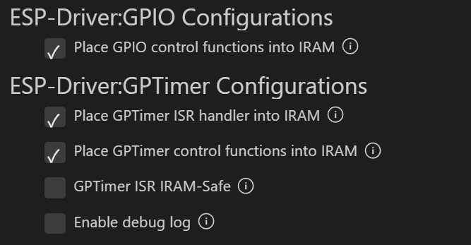
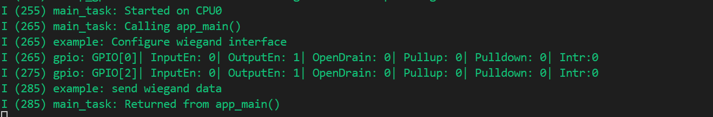
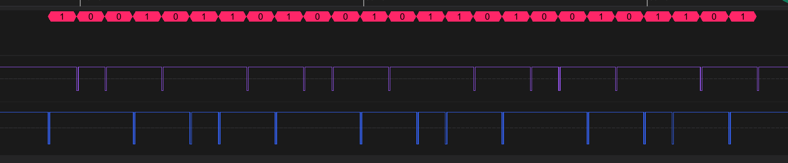
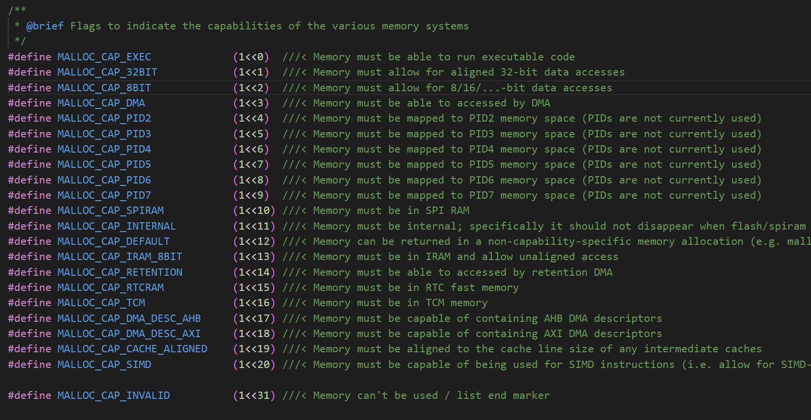

# Wiegand Interface 韦根协议[^韦根协议]

## 粗略阅读README文档

文档简介示例采用通用定时器和GPIO驱动模拟韦根接口。采用两个定时器触发中断，在中断更改GPIO状态。
(*由于韦根协议的严格时序要求，gpio控制功能、定时器控制功能和定时器isr句柄应放置在IRAM中。这避免了在执行闪存中的功能时因缓存未命中/无效而导致的时序变化。*)

硬件连接，编译烧录和示例输出，附有逻辑分析仪监视。

## 构建、烧录和监视

* 确定目标芯片
* 确定端口号
* 配置项目，使能三个选项

* 电机**构建、烧录和监视**



## 韦根协议简要说明

韦根协议用两条线来代表0和1，两条线的高电平是显性电平，低电平是隐性电平，即低电平是触发电平。通过两条线的分别分时间拉低来传输二进制数据。

## 代码分析

### 头文件和结构体定义

#### main.c文件

文件导入了自定义的`"wiegand_io.h"`头文件，导入`<inttypes.h>`文件(*`inttypes.h` 是 C 语言标准库中的一个头文件，主要用于定义可移植的整数类型，并提供相应的格式化输出和输入宏*)
宏定义了两条DATA线对应的GPIO引脚

```c
#include <stdio.h>
#include <inttypes.h>
#include "esp_log.h"
#include "freertos/FreeRTOS.h"
#include "freertos/task.h"
#include "wiegand_io.h"

#define DATA_PIN0_GPIO      GPIO_NUM_4
#define DATA_PIN1_GPIO      GPIO_NUM_18

static const char *TAG = "example";
uint64_t wiegand_data = 0x5a5a5a5a;
```

#### wiegand_io.h 头文件

`#pragma once` 用于防止同名头文件重复定义，`#ifdef __cplusplus`和`extern "C" {`用于在C++环境下运行文件。
`wiegand_io_config_t` 作为自定义的结构体，储存两个`gpio_num_t` 类型的成员作为输出引脚，`pulse_width_us` 储存每次负脉冲宽度，即拉低信号的持续时间，`interval_width_us` 储存数据间隔，或者说波特率。
重定义了结构体指针`wiegand_io_handle_t`
声明了两个函数，创建和发送

```c
#pragma once

#include <stdint.h>
#include <stdbool.h>
#include "driver/gpio.h"
#include "driver/gptimer.h"

#ifdef __cplusplus
extern "C" {
#endif

/**
 * @brief Wiegand interface configuration
 */
typedef struct {
    gpio_num_t data_pin0;        /*!< Pin of Data0 */
    gpio_num_t data_pin1;        /*!< Pin of Data1 */
    uint8_t pulse_width_us;      /*!< Negative pulse width, in microseconds */
    uint16_t interval_width_us;  /*!< Wiegand data interval, a.k.a. period, in microseconds */
} wiegand_io_config_t;

/**
 * @brief Type of Wiegand interface handle
 */
typedef struct wiegand_interface_t *wiegand_io_handle_t;

/**
 * @brief Create a new wiegand interface io, and return the handle
 *
 * @param[in] config Wiegand interface configuration
 * @param[out] ret_handle Returned wiegand interface handle
 * @return
 *      - ESP_ERR_INVALID_ARG for any invalid arguments
 *      - ESP_ERR_NO_MEM out of memory when creating wiegand interface
 *      - ESP_OK if creating wiegand interface successfully
 */
esp_err_t wiegand_new_io(const wiegand_io_config_t *config, wiegand_io_handle_t *ret_handle);

/**
 * @brief Send data via created wiegand interface io
 *
 * @param[in] wiegand_io Wiegand interface io handle
 * @param[in] data Wiegand data
 * @param[in] num_of_bits The bits number of wiegand data
 * @return
 *      - ESP_ERR_INVALID_STATE if previous data has not sent completely
 *      - ESP_OK if start sending data successfully
 */
esp_err_t wiegand_io_send(wiegand_io_handle_t wiegand_io, void *data, uint8_t num_of_bits);

#ifdef __cplusplus
}
#endif
```

#### wiegand_io.c 文件

`"esp_check.h"` 错误检查 ；`"esp_attr.h"` 给函数/变量“贴标签”，指导链接器把它们放到指定段或指定 RAM/Flash 区域 ; `"esp_heap_caps.h"` 按“能力”申请/释放/检查堆内存（heap）其他头文件不作介绍
`wiegand_interface_t` 结构体定义韦根协议内部调用资源和信息

* `sem` 信号量
* `interval_timer` 间隔定时器 (*韦根信号数据间隔*)
* `pulse_timer` 脉冲定时器 (*韦根信号低脉冲宽度*)
* `data_pin0` 、 `data_pin1` 数据0和数据1对应引脚
* `pulse_width_us` 脉冲宽度，微秒；`interval_width_us` 数据宽度，微秒
* `bit_mask` 单比特掩码，用于指向发送的是哪一位
* `current_data` 实际完整数据指针

```c
#include "esp_check.h"
#include "esp_attr.h"
#include "esp_heap_caps.h"
#include "freertos/FreeRTOS.h"
#include "freertos/semphr.h"
#include "wiegand_io.h"

static const char *TAG = "wiegand_io";

typedef struct wiegand_interface_t {
    SemaphoreHandle_t sem;
    gptimer_handle_t interval_timer;
    gptimer_handle_t pulse_timer;
    gpio_num_t data_pin0;
    gpio_num_t data_pin1;
    uint8_t pulse_width_us;
    uint16_t interval_width_us;
    uint64_t bit_mask;
    uint64_t *current_data;
} wiegand_interface_t;
```

### app_main()函数

函数初始化一个 `wiegand_io_handle_t` 类型句柄，配置韦根协议发送相关参数。然后调用自定义函数 `wiegand_new_io` 创建一个实例，`wiegand_io_send` 设置发送数据。

```c
void app_main(void)
{
    wiegand_io_handle_t wiegand_io_handle = NULL;
    wiegand_io_config_t wiegand_io_config = {
        .data_pin0 = DATA_PIN0_GPIO,
        .data_pin1 = DATA_PIN1_GPIO,
        .pulse_width_us = 50,
        .interval_width_us = 1000,
    };

    ESP_LOGI(TAG, "Configure wiegand interface");
    ESP_ERROR_CHECK(wiegand_new_io(&wiegand_io_config, &wiegand_io_handle));

    ESP_LOGI(TAG, "send wiegand data");
    ESP_ERROR_CHECK(wiegand_io_send(wiegand_io_handle, &wiegand_data, 26));
}
```

### 实例和发送函数

**wiegand_new_io**函数创建实例

1. `esp_err_t ret = ESP_OK;` 记录函数运行状态
2. 创建结构体指针
3. `ESP_RETURN_ON_FALSE` 宏判断，`config` 和 `ret_handle` 非空，才会继续执行。如果判断不满足，就返回错误码 `ESP_ERR_INVALID_ARG` 并打印后续内容。
4. 动态分配内存至结构体指针 `wiegand_io` (*用 heap_caps_\* 保证内存落在 内部 RAM，且字节可寻址（DMA、中断都能用）*) 后续参数指示返回的内存类型 [函数介绍](https://docs.espressif.com/projects/esp-idf/zh_CN/stable/esp32/api-reference/system/mem_alloc.html#_CPPv416heap_caps_calloc6size_t6size_t8uint32_t)

5. 非空判断(*后续不作解释*)
6. 结构体内容写入，包括信号量初始化，引脚，间隔等
7. GPIO配置
8. `ESP_GOTO_ON_ERROR`宏判断，若配置失败就跳转到`err`代码块并打印报错
9. 设置信号线初始电平为1
10. 配置定时器，绑定回调函数和间隔，确认是否开启自动重载(*该函数为自定义函数*)
11. 确定返回句柄，给予一次信号量

**wiegand_io_send**函数写入数据

1. 先进行非空和超限判断
2. 等待信号量
3. 确认数据和掩码。(num_of_bits为数据长度，该掩码作用确保一位一位发送，所以一开始为100000...0，同时由于掩码数据长度限制，传入数据长度也限制)
4. 设置定时器计数值，参数为定时器和值
5. 启动定时器

```c
esp_err_t wiegand_new_io(const wiegand_io_config_t *config, wiegand_io_handle_t *ret_handle)
{
    esp_err_t ret = ESP_OK;
    wiegand_interface_t *wiegand_io = NULL;
    ESP_RETURN_ON_FALSE(config && ret_handle, ESP_ERR_INVALID_ARG, TAG, "invalid argument");

    wiegand_io = heap_caps_calloc(1, sizeof(wiegand_interface_t), MALLOC_CAP_8BIT | MALLOC_CAP_INTERNAL);
    ESP_RETURN_ON_FALSE(wiegand_io, ESP_ERR_NO_MEM, TAG, "no mem for wiegand_io");

    wiegand_io->sem = xSemaphoreCreateBinaryWithCaps(MALLOC_CAP_8BIT | MALLOC_CAP_INTERNAL);
    wiegand_io->data_pin0 = config->data_pin0;
    wiegand_io->data_pin1 = config->data_pin1;
    wiegand_io->pulse_width_us = config->pulse_width_us;
    wiegand_io->interval_width_us = config->interval_width_us;

    gpio_config_t io_conf = {
        .mode = GPIO_MODE_OUTPUT,
        .pin_bit_mask = (1ULL << wiegand_io->data_pin0) | (1ULL << wiegand_io->data_pin1),
    };
    ESP_GOTO_ON_ERROR(gpio_config(&io_conf), err, TAG, "gpio config failed!");

    // data pins are high by default
    gpio_set_level(wiegand_io->data_pin0, 1);
    gpio_set_level(wiegand_io->data_pin1, 1);

    // Setup the pulse timer
    ESP_GOTO_ON_ERROR(setup_timer(&wiegand_io->pulse_timer, pulse_timer_cb, wiegand_io, wiegand_io->pulse_width_us, false), err, TAG, "setup pulse timer failed!");
    // Setup the interval timer
    ESP_GOTO_ON_ERROR(setup_timer(&wiegand_io->interval_timer, interval_timer_cb, wiegand_io, wiegand_io->interval_width_us, true), err, TAG, "setup interval timer failed!");

    // return handle
    *ret_handle = wiegand_io;
    xSemaphoreGive(wiegand_io->sem);

    return ESP_OK;

err:
    if (wiegand_io->pulse_timer) {
        gptimer_disable(wiegand_io->pulse_timer);
        gptimer_del_timer(wiegand_io->pulse_timer);
    }
    if (wiegand_io->interval_timer) {
        gptimer_disable(wiegand_io->interval_timer);
        gptimer_del_timer(wiegand_io->interval_timer);
    }
    if (wiegand_io) {
        free(wiegand_io);
    }
    return ret;

}

esp_err_t wiegand_io_send(wiegand_io_handle_t wiegand_io, void *data, uint8_t num_of_bits)
{
    ESP_RETURN_ON_FALSE(wiegand_io && num_of_bits && data, ESP_ERR_INVALID_ARG, TAG, "invalid argument");
    ESP_RETURN_ON_FALSE(num_of_bits > 0 && num_of_bits <= 64, ESP_ERR_INVALID_ARG, TAG, "bits is out of range [1,64]");

    xSemaphoreTake(wiegand_io->sem, portMAX_DELAY);
    wiegand_io->current_data = (uint64_t *)data;
    wiegand_io->bit_mask = 1ULL << (num_of_bits - 1);

    ESP_RETURN_ON_ERROR(gptimer_set_raw_count(wiegand_io->interval_timer, 0), TAG, "set timer raw count failed!");
    ESP_RETURN_ON_ERROR(gptimer_start(wiegand_io->interval_timer), TAG, "start timer failed!");

    return ESP_OK;
}
```

### 回调函数及自定义函数

**interval_timer_cb**作为周期性定时器的回调函数。周期性定时器确保了数据间隔。函数传入了韦根协议的参数和数据，在函数中开启决定脉冲宽度的定时器，并进行拉低处理。
**pulse_timer_cb** 函数触发在脉冲定时器到指定值，即满足指定脉冲宽度后。函数重新将信号量拉高，返回默认状态，同时关闭定时器，确保单次触发。
在周期性定时器函数中，若检测到`bit_mask == 1`，即发送的是最后一位数据，函数会关闭定时器。
在脉冲定时器函数中，若满足`!(wiegand_io->bit_mask >>= 1)`，代表发送的是最后一位数据(*如果bit_mask中的1不在最后一位，右移后仍不为0*)
该信号量表示这一帧数据发送完毕

自定义函数中`set_alarm_action`用于进行警报配置。`setup_timer`负责整个定时器的配置，回调函数注册，还调用`set_alarm_action`函数配置警报，最后启用定时器。

```c
static bool IRAM_ATTR interval_timer_cb(gptimer_handle_t timer, const gptimer_alarm_event_data_t *edata, void *user_data)
{
    wiegand_io_handle_t wiegand_io = (wiegand_io_handle_t)user_data;
    if (wiegand_io->bit_mask == 1) {
        gptimer_stop(timer);
    }

    gptimer_set_raw_count(wiegand_io->pulse_timer, 0);
    gptimer_start(wiegand_io->pulse_timer);

    if (*wiegand_io->current_data & wiegand_io->bit_mask) {
        gpio_set_level(wiegand_io->data_pin1, 0);
    } else {
        gpio_set_level(wiegand_io->data_pin0, 0);
    }

    return false;
}

static bool IRAM_ATTR pulse_timer_cb(gptimer_handle_t timer, const gptimer_alarm_event_data_t *edata, void *user_data)
{
    BaseType_t task_woken = pdFALSE;
    wiegand_io_handle_t wiegand_io = (wiegand_io_handle_t)user_data;
    gpio_set_level(wiegand_io->data_pin0, 1);
    gpio_set_level(wiegand_io->data_pin1, 1);

    gptimer_stop(timer);

    if (!(wiegand_io->bit_mask >>= 1)) {
        xSemaphoreGiveFromISR(wiegand_io->sem, &task_woken);
    }

    return task_woken == pdTRUE;
}

static esp_err_t set_alarm_action(gptimer_handle_t timer, uint64_t count, bool reload)
{
    gptimer_alarm_config_t alarm_config  = {
        .reload_count = 0,
        .alarm_count = count,
        .flags.auto_reload_on_alarm = reload,
    };
    ESP_RETURN_ON_ERROR(gptimer_set_alarm_action(timer, &alarm_config), TAG, "set alarm action failed!");

    return ESP_OK;
}

static esp_err_t setup_timer(gptimer_handle_t *timer, gptimer_alarm_cb_t alarm_cb, wiegand_io_handle_t wiegand_io, uint64_t count, bool reload)
{
    esp_err_t ret = ESP_OK;
    gptimer_config_t timer_config  = {
        .clk_src = GPTIMER_CLK_SRC_DEFAULT,
        .direction = GPTIMER_COUNT_UP,
        .resolution_hz = 1000000, // 1 tick = 1us
    };
    ESP_RETURN_ON_ERROR(gptimer_new_timer(&timer_config, timer), TAG, "add new timer failed!");

    gptimer_event_callbacks_t cbs = {
        .on_alarm = alarm_cb,
    };
    ESP_GOTO_ON_ERROR(gptimer_register_event_callbacks(*timer, &cbs, wiegand_io), err, TAG, "register callbacks failed!");
    ESP_GOTO_ON_ERROR(set_alarm_action(*timer, count, reload), err, TAG, "set alarm action failed!");
    ESP_GOTO_ON_ERROR(gptimer_enable(*timer), err, TAG, "enable timer failed!");

    return ESP_OK;

err:
    if (*timer) {
        gptimer_del_timer(*timer);
    }
    return ret;
}
```

## 总结

本例采用定时器和GPIO配合进行通信协议的输出，第二次看到例程采用多文件编程，熟悉了信号量起配合和互斥的作用，还有自定义结构体和函数的使用。

[^韦根协议]:韦根（Wiegand协议）是国际上统一的标准，是由摩托罗拉公司制定的一种通讯协议。
韦根（Wiegand）协议又称韦根码，通俗来说是一种通信工具，用于读卡器（读头）到门禁控制器。当读卡器识别到有效卡后，将卡片的钥匙信息以韦根协议的方式传输，再而转换成数据发送给控制器，控制器验证钥匙信息有效后打开门。
简而言之，韦根协议相当于一种“传声筒”，控制器无法直接读取读头发送的信息，所以需要韦根协议进行通信，才能完成读头到控制器数据的完整传输。 值得注意的是，韦根协议只能做到单向传输，读头向控制器传输信息为单向，控制器无法给读卡器发送信号，控制器做出反馈还需借助其他工具（例如LED灯）。
韦根协议并没有定义通讯的波特率、也没有定义数据长度。韦根格式主要定义是数据传输方式:Data0 和 Data1 两根数据线分别传输 0 和 1.现在应用最多的是 26bit,34bit，36bit，44bit 等等。Wiegand接口通常由3根线组成，它们是： DATA0，DATA1和 GND 。韦根码在数据的传输中只需两条数据线，一条为DATA0（通常为绿色导线），另一条为DATA1（通常为白色导线）。
韦根协议虽然安全性极差，但因其简单、通用、对接容易，与IC卡的完美配合，所以总的来说使用场景还是很多，例如酒店客房、办公室、小区，几乎所有非接触式IC卡门禁系统的门禁控制器与读卡器进行通信使用的都是韦根协议。韦根可以通过其他方式进行加密，或是通过其他接线进行功能叠加，所以目前还有很大一部分门禁系统会使用韦根，使用概率极高。
————————————————
版权声明：本文为博主原创文章，遵循 CC 4.0 BY-SA 版权协议，转载请附上原文出处链接和本声明。
原文链接：https://blog.csdn.net/yangguoyu8023/article/details/111547043


