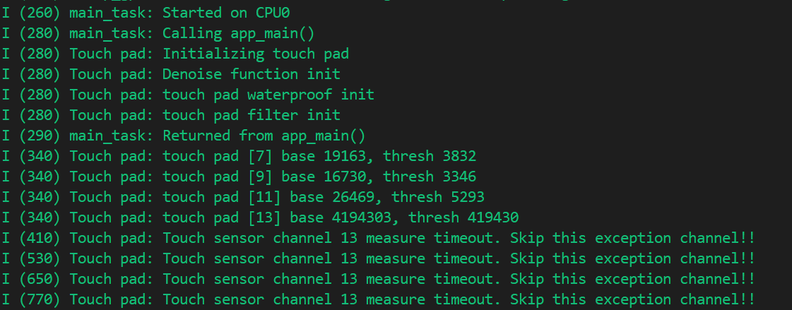
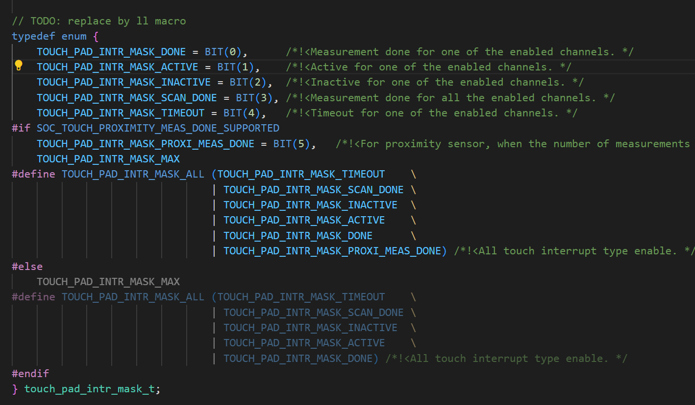

# Touch Pad Interrupt 触摸传感器中断

## 粗略阅读README文档

文档简介示例演示设置ESP32s3的触摸板功能并在中断触发，可进行一定的配置

硬件配置，编译烧录和示例输出

## 构建、烧录和监视

* 设置目标芯片
* 设置端口号和烧录方式
* 配置项目
* 点击**构建、烧录和监视**


> 由于配置中并没有笔者能用的引脚，故现象不明显，但笔者主要分析代码逻辑，不作重复验证

## 代码分析

### 宏定义、结构体、变量

`touch_event_t` 结构体定义触摸参数

* `touch_pad_intr_mask_t`类型变量 储存**位掩码**
* `pad_num` 储存编号
* `pad_status` 储存状态
* `pad_val` 储存值

宏定义触摸通道数量，和三个预编译位

`button`数组定义触发的通道，注释中设定情境 ; `button_threshold` 设置触摸阈值，阈值不同灵敏度不同

```c
static QueueHandle_t que_touch = NULL;
typedef struct touch_msg {
    touch_pad_intr_mask_t intr_mask;
    uint32_t pad_num;
    uint32_t pad_status;
    uint32_t pad_val;
} touch_event_t;

#define TOUCH_BUTTON_NUM    4
#define TOUCH_BUTTON_WATERPROOF_ENABLE 1
#define TOUCH_BUTTON_DENOISE_ENABLE    1
#define TOUCH_CHANGE_CONFIG            0

static const touch_pad_t button[TOUCH_BUTTON_NUM] = {
    TOUCH_PAD_NUM7,     // 'SELECT' button.
    TOUCH_PAD_NUM9,     // 'MENU' button.
    TOUCH_PAD_NUM11,    // 'BACK' button.
    TOUCH_PAD_NUM13,    // Guard ring for waterproof design.
    // If this pad be touched, other pads no response.
};

/*
 * Touch threshold. The threshold determines the sensitivity of the touch.
 * This threshold is derived by testing changes in readings from different touch channels.
 * If (raw_data - benchmark) > benchmark * threshold, the pad be activated.
 * If (raw_data - benchmark) < benchmark * threshold, the pad be inactivated.
 */
static const float button_threshold[TOUCH_BUTTON_NUM] = {
    0.2, // 20%.
    0.2, // 20%.
    0.2, // 20%.
    0.1, // 10%.
};
```

### app_main()函数

1. 创建队列，队列数与通道数一致，储存数据为**touch_event_t**类型
2. 初始化触摸传感器驱动，并对每个通道进行配置
3. 第一个`#if`中的代码与read中相同，设置两次测量间隔、设置固定充放电次数、设置电压参考低和高、设置空闲状态下通道连接类型、为每个焊盘配置充放电速度 [参考解释](../touch_pad_read/touch_pad_read.md#app_main函数)
4. 第二个`#if`中代码与read相同，配置和启动降噪
5. `touch_pad_waterproof_set_config`设置防水功能参数，`touch_pad_waterproof_enable` 启动**防水功能**
6. `touchsensor_filter_set`自定义函数**配置滤波**
7. `touch_pad_timeout_set`启用超时阈值并产生超时中断(v4.3+)
8. `touch_pad_isr_register`配置**中断** (*本例参数为函数，参数，位掩码；但位掩码在v5.4版本被取消，参数只有前两个*)
9. `touch_pad_intr_enable` 启用中断 (*本例参数为位掩码；在v5.4版本无参数*)
10. `touch_pad_set_fsm_mode` 选择测量模式由硬件定时器自动启动或软件自动启动
11. `touch_pad_fsm_start`设置fsm**启动**(v4.3+)

```c
void app_main(void)
{
    if (que_touch == NULL) {
        que_touch = xQueueCreate(TOUCH_BUTTON_NUM, sizeof(touch_event_t));
    }
    // Initialize touch pad peripheral, it will start a timer to run a filter
    ESP_LOGI(TAG, "Initializing touch pad");
    /* Initialize touch pad peripheral. */
    touch_pad_init();
    for (int i = 0; i < TOUCH_BUTTON_NUM; i++) {
        touch_pad_config(button[i]);
    }

#if TOUCH_CHANGE_CONFIG
    /* If you want change the touch sensor default setting, please write here(after initialize). There are examples: */
    touch_pad_set_measurement_interval(TOUCH_PAD_SLEEP_CYCLE_DEFAULT);
    touch_pad_set_charge_discharge_times(TOUCH_PAD_MEASURE_CYCLE_DEFAULT);
    touch_pad_set_voltage(TOUCH_PAD_HIGH_VOLTAGE_THRESHOLD, TOUCH_PAD_LOW_VOLTAGE_THRESHOLD, TOUCH_PAD_ATTEN_VOLTAGE_THRESHOLD);
    touch_pad_set_idle_channel_connect(TOUCH_PAD_IDLE_CH_CONNECT_DEFAULT);
    for (int i = 0; i < TOUCH_BUTTON_NUM; i++) {
        touch_pad_set_cnt_mode(button[i], TOUCH_PAD_SLOPE_DEFAULT, TOUCH_PAD_TIE_OPT_DEFAULT);
    }
#endif

#if TOUCH_BUTTON_DENOISE_ENABLE
    /* Denoise setting at TouchSensor 0. */
    touch_pad_denoise_t denoise = {
        /* The bits to be cancelled are determined according to the noise level. */
        .grade = TOUCH_PAD_DENOISE_BIT4,
        /* By adjusting the parameters, the reading of T0 should be approximated to the reading of the measured channel. */
        .cap_level = TOUCH_PAD_DENOISE_CAP_L4,
    };
    touch_pad_denoise_set_config(&denoise);
    touch_pad_denoise_enable();
    ESP_LOGI(TAG, "Denoise function init");
#endif

#if TOUCH_BUTTON_WATERPROOF_ENABLE
    /* Waterproof function */
    touch_pad_waterproof_t waterproof = {
        .guard_ring_pad = button[3],   // If no ring pad, set 0;
        /* It depends on the number of the parasitic capacitance of the shield pad.
           Based on the touch readings of T14 and T0, estimate the size of the parasitic capacitance on T14
           and set the parameters of the appropriate hardware. */
        .shield_driver = TOUCH_PAD_SHIELD_DRV_L2,
    };
    touch_pad_waterproof_set_config(&waterproof);
    touch_pad_waterproof_enable();
    ESP_LOGI(TAG, "touch pad waterproof init");
#endif

    /* Filter setting */
    touchsensor_filter_set(TOUCH_PAD_FILTER_IIR_16);
    touch_pad_timeout_set(true, TOUCH_PAD_THRESHOLD_MAX);
    /* Register touch interrupt ISR, enable intr type. */
    touch_pad_isr_register(touchsensor_interrupt_cb, NULL, TOUCH_PAD_INTR_MASK_ALL);
    /* If you have other touch algorithm, you can get the measured value after the `TOUCH_PAD_INTR_MASK_SCAN_DONE` interrupt is generated. */
    touch_pad_intr_enable(TOUCH_PAD_INTR_MASK_ACTIVE | TOUCH_PAD_INTR_MASK_INACTIVE | TOUCH_PAD_INTR_MASK_TIMEOUT);

    /* Enable touch sensor clock. Work mode is "timer trigger". */
    touch_pad_set_fsm_mode(TOUCH_FSM_MODE_TIMER);
    touch_pad_fsm_start();

    // Start a task to show what pads have been touched
    xTaskCreate(&tp_example_read_task, "touch_pad_read_task", 4096, NULL, 5, NULL);
}
```

### 任务函数

1. 初始化和等待初始化完成
2. `tp_example_set_thresholds` 自定义函数**设置阈值**，即把数组中定义的阈值写入通道
3. 主循环采用多个if判断，处理不同情况
4. 以最长等待时间读取队列，等待过程中任务休眠
   
5. **TOUCH_PAD_INTR_MASK_ACTIVE**为触摸激活中断，根据触发引脚判断进入保护模式或记录日志
6. **TOUCH_PAD_INTR_MASK_INACTIVE**为触摸释放中断，行为相同
7. **TOUCH_PAD_INTR_MASK_SCAN_DONE**为扫描完成中断，传感器组扫描测量完成触发
8. **TOUCH_PAD_INTR_MASK_TIMEOUT**为超时中断，超时进行信息输出，并调用`touch_pad_timeout_resume`恢复并指向下一个测量的通道(*即跳过当前通道，将读取指针指向下一个测量通道*)

```c
static void tp_example_read_task(void *pvParameter)
{
    touch_event_t evt = {0};
    static uint8_t guard_mode_flag = 0;
    /* Wait touch sensor init done */
    vTaskDelay(50 / portTICK_PERIOD_MS);
    tp_example_set_thresholds();

    while (1) {
        int ret = xQueueReceive(que_touch, &evt, (TickType_t)portMAX_DELAY);
        if (ret != pdTRUE) {
            continue;
        }
        if (evt.intr_mask & TOUCH_PAD_INTR_MASK_ACTIVE) {
            /* if guard pad be touched, other pads no response. */
            if (evt.pad_num == button[3]) {
                guard_mode_flag = 1;
                ESP_LOGW(TAG, "TouchSensor [%"PRIu32"] be activated, enter guard mode", evt.pad_num);
            } else {
                if (guard_mode_flag == 0) {
                    ESP_LOGI(TAG, "TouchSensor [%"PRIu32"] be activated, status mask 0x%"PRIu32"", evt.pad_num, evt.pad_status);
                } else {
                    ESP_LOGW(TAG, "In guard mode. No response");
                }
            }
        }
        if (evt.intr_mask & TOUCH_PAD_INTR_MASK_INACTIVE) {
            /* if guard pad be touched, other pads no response. */
            if (evt.pad_num == button[3]) {
                guard_mode_flag = 0;
                ESP_LOGW(TAG, "TouchSensor [%"PRIu32"] be inactivated, exit guard mode", evt.pad_num);
            } else {
                if (guard_mode_flag == 0) {
                    ESP_LOGI(TAG, "TouchSensor [%"PRIu32"] be inactivated, status mask 0x%"PRIu32, evt.pad_num, evt.pad_status);
                }
            }
        }
        if (evt.intr_mask & TOUCH_PAD_INTR_MASK_SCAN_DONE) {
            ESP_LOGI(TAG, "The touch sensor group measurement is done [%"PRIu32"].", evt.pad_num);
        }
        if (evt.intr_mask & TOUCH_PAD_INTR_MASK_TIMEOUT) {
            /* Add your exception handling in here. */
            ESP_LOGI(TAG, "Touch sensor channel %"PRIu32" measure timeout. Skip this exception channel!!", evt.pad_num);
            touch_pad_timeout_resume(); // Point on the next channel to measure.
        }
    }
}
```

### 其他自定义函数和回调函数

`touchsensor_interrupt_cb`中断回调函数。函数先进行初始化，然后获取**中断状态位掩码**、**通道活动状态**、**当前测量通道**。中断中向队列传输数据 (*portYIELD_FROM_ISR似乎是触发上下文切换的，但笔者不是特别理解*)

`tp_example_set_thresholds`阈值设置函数。`touch_pad_read_benchmark` 获取阈值，`touch_pad_set_thresh` 切换阈值 (*v4.3+*)

`touchsensor_filter_set`配置滤波器和启动，v5.4版本操作见[新版本v5.4优化采样](https://docs.espressif.com/projects/esp-idf/zh_CN/v5.4.2/esp32/api-reference/peripherals/touch_pad.html#id9)

```c
/*
  Handle an interrupt triggered when a pad is touched.
  Recognize what pad has been touched and save it in a table.
 */
static void touchsensor_interrupt_cb(void *arg)
{
    int task_awoken = pdFALSE;
    touch_event_t evt;

    evt.intr_mask = touch_pad_read_intr_status_mask();
    evt.pad_status = touch_pad_get_status();
    evt.pad_num = touch_pad_get_current_meas_channel();

    xQueueSendFromISR(que_touch, &evt, &task_awoken);
    if (task_awoken == pdTRUE) {
        portYIELD_FROM_ISR();
    }
}

static void tp_example_set_thresholds(void)
{
    uint32_t touch_value;
    for (int i = 0; i < TOUCH_BUTTON_NUM; i++) {
        //read benchmark value
        touch_pad_read_benchmark(button[i], &touch_value);
        //set interrupt threshold.
        touch_pad_set_thresh(button[i], touch_value * button_threshold[i]);
        ESP_LOGI(TAG, "touch pad [%d] base %"PRIu32", thresh %"PRIu32, \
                 button[i], touch_value, (uint32_t)(touch_value * button_threshold[i]));
    }
}

static void touchsensor_filter_set(touch_filter_mode_t mode)
{
    /* Filter function */
    touch_filter_config_t filter_info = {
        .mode = mode,           // Test jitter and filter 1/4.
        .debounce_cnt = 1,      // 1 time count.
        .noise_thr = 0,         // 50%
        .jitter_step = 4,       // use for jitter mode.
        .smh_lvl = TOUCH_PAD_SMOOTH_IIR_2,
    };
    touch_pad_filter_set_config(&filter_info);
    touch_pad_filter_enable();
    ESP_LOGI(TAG, "touch pad filter init");
}
```

## 关于防水功能使用的硬件连接

>User: 具体使用时该怎么进行硬件连接
>Kimi: 要把 ESP32-S3（或 S2）触摸防水功能真正用起来，硬件上需要把“三根线”接好：
>
>1) 普通按键电极（Touch PAD）；2) 保护环/保护电极（Guard）；3) 屏蔽网格/屏蔽电极>（Shield）。下面给出可直接照抄的连接方法和注意点。
>
>
>1. 管脚对应关系  
>
>       * 普通按键：TOUCH1 ~ TOUCH13（GPIO1~13，任选）  
>       * 保护电极：任选一个空闲 TOUCHx（软件里配置为 `guard_chan`，官方示例常用 >TOUCH0→GPIO0，也可换）  
>       * 屏蔽电极：只能用 TOUCH14（GPIO14），因为它内部有专用驱动器，软件里配置为 >`shield_chan`。
>
>2. 原理图怎么画  
>
>       ```xml
>                        ┌---------┐
>          手指按键      │         │
>       TOUCHx ---R1---+──┤  PAD    │   （按键电极）
>                      │  │         │
>                      │  │  ESP32  │
>                      │  │         │
>       TOUCHy ----R2──+──┤ GUARD   │   （保护环）
>                      │  │         │
>       TOUCH14---R3──+──┤ SHIELD  │   （屏蔽网格）
>                        └---------┘
>       ```
>
>       * R1/R2/R3：靠近芯片放 470 Ω~2 kΩ，推荐 510 Ω，减小 EMI 与 ESD。  
>       * 按键电极：做成 8~15 mm 圆形/椭圆形铜箔，背面留空或铺网格地。  
>       * 保护环：2 mm 宽，做成“跑道形”或“回字形”把按键围起来，与按键间距 1 mm，只在顶层或底>层留铜即可。  
>       * 屏蔽网格：  
>          * 顶层：7 mil 线宽 / 45 mil 网格（≈ 25 % 铜）  
>          * 底层：7 mil 线宽 / 70 mil 网格（≈ 17 % 铜）  
>          网格全部接到 TOUCH14，不要接地。  
>       * 所有走线尽量短（≤ 30 cm）、线宽 ≤ 7 mil、走线远离射频天线。
>
>3. 软件配置一句话  
>
>       ```c
>       touch_waterproof_config_t w = {
>           .guard_chan      = TOUCH_PAD_NUM0,   // 保护通道
>           .shield_chan     = TOUCH_PAD_NUM14,  // 屏蔽通道
>           .shield_drv      = TOUCH_PAD_SHIELD_DRV_L2,  // 驱动能力
>           .immersion_proof = true              // 打开浸没检测
>       };
>       touch_sensor_config_waterproof(&w);
>       ```
>
>4. 快速 checklist  
>
>       ☑ 按键电极、保护环、屏蔽网格三者的 PCB 区域已完成。  
>       ☑ 保护环包围所有按键，且与按键间距 1 mm。  
>       ☑ 屏蔽网格只连 TOUCH14，不接地。  
>       ☑ 每个通道串 510 Ω，靠近芯片。  
>       ☑ 触摸走线远离射频、晶振，包地。  
>       ☑ 软件里把 TOUCH14 设为 shield_chan，任意 TOUCHx 设为guard_chan。  
>
>照此连接即可在潮湿、有水滴甚至短暂浸没场景下稳定工作。

## 总结

本例进行了触摸传感器中断的相关实验，了解了触摸传感器的各种配置，和中断回调函数的绑定，传参等操作，但比较遗憾函数使用很多仍然是v4版本。不过能感觉到兼容做的很好，同名函数没有报错。但有些函数的使用在文档中不够准确，笔者建议在使用是结合文档、搜索引擎和源函数使用。
