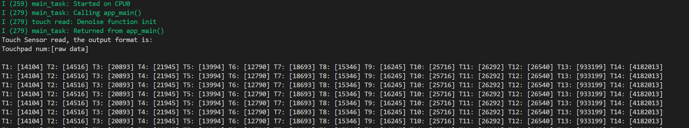
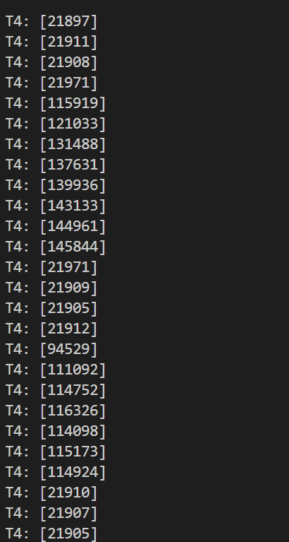

# Touch Pad Read 触摸板读取

## 粗略阅读README文件

文档简介了传感器原理，数据读取，*ESP32S3硬件集成了边缘检测算法，可以通过配置适当的参数实现检测触摸动作*

硬件需要，构建烧录示例输出

## 构建、烧录和监视

* 选择芯片信号
* 选择端口号
* 配置项目 (*不改动配置*)
* 点击**构建、烧录和监视**

* 修改代码，由于笔者只用了GPIO4，查询得到对应代码为NUM4，故只输出一个通道

可以看到读取数据有明显变化

## 代码分析

> 笔者注，官方编程文件一直在更新，请找自己使用的对应版本进行查询。笔者今天找函数没找到，发现自己的版本是v5.4.1，看的是v5.5版本文档
> 针对学习实验，笔者暂时不会更新开发版本，但在以后进行项目开发记录时，笔者会采用全新版本

### 宏定义和全局变量

第一个宏定义为通道数，ESP32S3有14个通道，分别从GPIO0到GPIO13。
第二个宏为预编译配置，后续再进行解释

```c
#define TOUCH_BUTTON_NUM    14
#define TOUCH_CHANGE_CONFIG 0

static const char *TAG = "touch read";
static const touch_pad_t button[TOUCH_BUTTON_NUM] = {
    TOUCH_PAD_NUM1,
    TOUCH_PAD_NUM2,
    TOUCH_PAD_NUM3,
    TOUCH_PAD_NUM4,
    TOUCH_PAD_NUM5,
    TOUCH_PAD_NUM6,
    TOUCH_PAD_NUM7,
    TOUCH_PAD_NUM8,
    TOUCH_PAD_NUM9,
    TOUCH_PAD_NUM10,
    TOUCH_PAD_NUM11,
    TOUCH_PAD_NUM12,
    TOUCH_PAD_NUM13,
    TOUCH_PAD_NUM14
};
```

### app_main()函数

> 笔者为了方便观察现象，把循环进行注释，只保留GPIO4，也即前面数组中的NUM4位
> 且由于本版本为v5.4，在v5.5中对触摸驱动进行了修改，故不对代码参数进行详尽分析

[触摸传感器配置](https://docs.espressif.com/projects/esp-idf/zh_CN/v5.4.2/esp32/api-reference/peripherals/touch_pad.html#id1)

1. 初始化配置传感器驱动程序，使能通道触摸功能(*循环使能所有通道*)
2. 假设**TOUCH_CHANGE_CONFIG**不为0 ，运行中间代码
3. `touch_pad_set_measurement_interval` 函数设置两次测量间隔(*触摸传感器会统计固定充放电次数所需的时间（即所需时钟周期数），其结果即为原始数据*)
4. `touch_pad_set_charge_discharge_times` 设置固定充放电次数
5. `touch_pad_set_voltage`设置电压参考低和参考高
6. 
7. `touch_pad_set_cnt_mode` *为每个焊盘设置触摸传感器充电/放电速度。如果斜率为0，则计数器将始终为零。如果斜率为1，则充电和放电将相应地变慢。如果斜率设置为7，即最大值，则充电和放电将很快*
8. 后方代码笔者搜索半天没找到来源，询问AI得知是v4.3和v4.4版本使用代码，已不作更新和维护
9. `touch_pad_denoise_set_config` 配置降噪 `touch_pad_denoise_enable` 使能降噪
10. `touch_pad_set_fsm_mode`设置启动模式，软件启动/硬件启动 `touch_pad_fsm_start` 启动
11. 创建任务，指定任务名，分配内存，无参数，5级优先级，无句柄

```c
void app_main(void)
{
    /* Initialize touch pad peripheral. */
    touch_pad_init();
    //for (int i = 0; i < TOUCH_BUTTON_NUM; i++) {
        touch_pad_config(button[3]);
    //}
#if TOUCH_CHANGE_CONFIG
    /* If you want change the touch sensor default setting, please write here(after initialize). There are examples: */
    touch_pad_set_measurement_interval(TOUCH_PAD_SLEEP_CYCLE_DEFAULT);
    touch_pad_set_charge_discharge_times(TOUCH_PAD_MEASURE_CYCLE_DEFAULT);
    touch_pad_set_voltage(TOUCH_PAD_HIGH_VOLTAGE_THRESHOLD, TOUCH_PAD_LOW_VOLTAGE_THRESHOLD, TOUCH_PAD_ATTEN_VOLTAGE_THRESHOLD);
    touch_pad_set_idle_channel_connect(TOUCH_PAD_IDLE_CH_CONNECT_DEFAULT);
    for (int i = 0; i < TOUCH_BUTTON_NUM; i++) {
        touch_pad_set_cnt_mode(button[i], TOUCH_PAD_SLOPE_DEFAULT, TOUCH_PAD_TIE_OPT_DEFAULT);
    }
#endif
    /* Denoise setting at TouchSensor 0. */
    touch_pad_denoise_t denoise = {
        /* The bits to be cancelled are determined according to the noise level. */
        .grade = TOUCH_PAD_DENOISE_BIT4,
        .cap_level = TOUCH_PAD_DENOISE_CAP_L4,
    };
    touch_pad_denoise_set_config(&denoise);
    touch_pad_denoise_enable();
    ESP_LOGI(TAG, "Denoise function init");

    /* Enable touch sensor clock. Work mode is "timer trigger". */
    touch_pad_set_fsm_mode(TOUCH_FSM_MODE_TIMER);
    touch_pad_fsm_start();

    /* Start task to read values by pads. */
    xTaskCreate(&tp_example_read_task, "touch_pad_read_task", 4096, NULL, 5, NULL);
}
```

### 任务函数

1. 新建任务等待100ms初始化完成
2. 发送提示语句
3. 主循环进行读取通道数据并发送到输出 (*原有内部循环读取全部通道并发送*)
4. 主循环每200ms进行一次

```c
/*
  Read values sensed at all available touch pads.
 Print out values in a loop on a serial monitor.
 */
static void tp_example_read_task(void *pvParameter)
{
    uint32_t touch_value;

    /* Wait touch sensor init done */
    vTaskDelay(100 / portTICK_PERIOD_MS);
    printf("Touch Sensor read, the output format is: \nTouchpad num:[raw data]\n\n");

    while (1) {
        //for (int i = 0; i < TOUCH_BUTTON_NUM; i++) {
            touch_pad_read_raw_data(button[3], &touch_value);    // read raw data.
            printf("T%d: [%4"PRIu32"] ", button[3], touch_value);
        //}
        printf("\n");
        vTaskDelay(200 / portTICK_PERIOD_MS);
    }
}
```

## 总结

触摸示例对笔者来说是一个契机，让笔者又花了大量的时间去了解了esp-idf框架的版本以及周围的知识，并重新安装了最新稳定版本，做了版本隔离等工作。体验了轮询读取的示例，感受了触摸传感器的作用。
