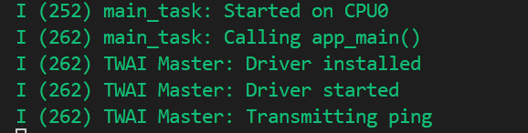
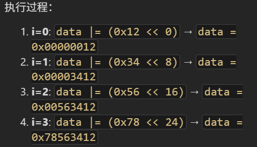
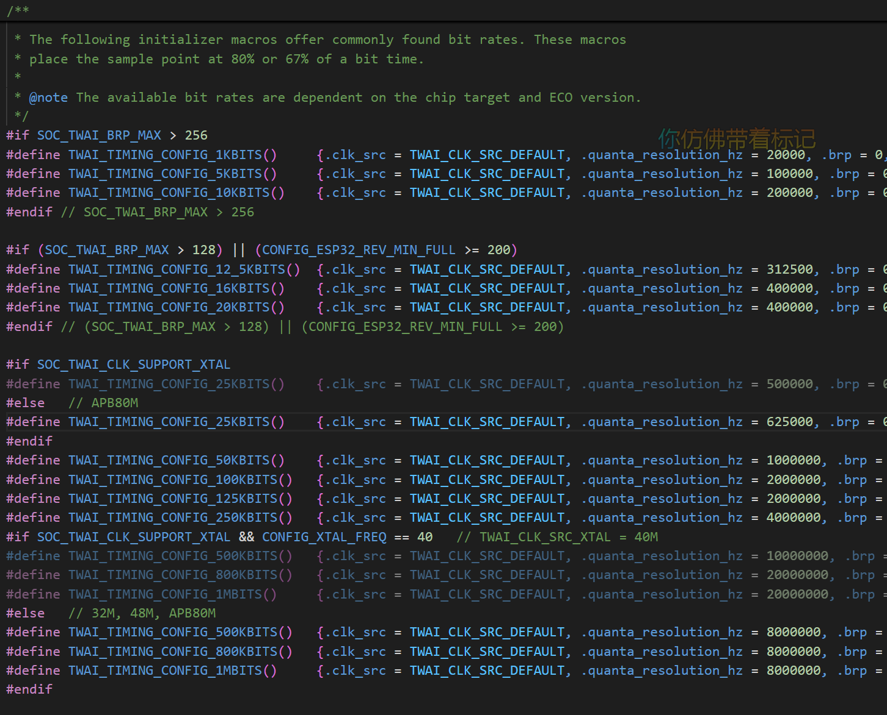
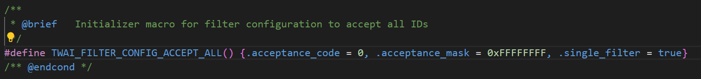
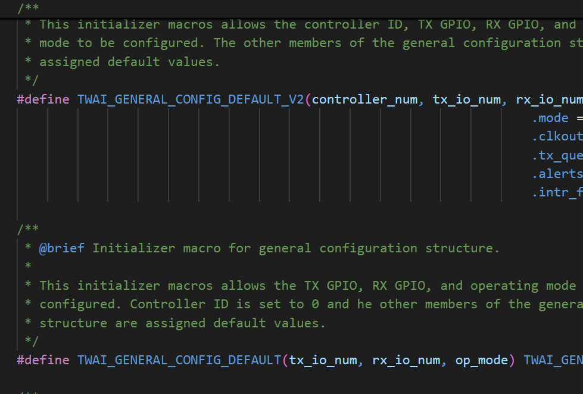

# TWAI network master TWAI网络的主机

## 文档简介


## 构建、烧录和监视

* 选择目标芯片
* 选择端口号
* 配置项目
* 点击**构建、烧录和监视**


## 代码分析

### 宏定义和静态变量

部分宏定义和[TWAI自检](../twai_self_test/twai_self_test.md/#宏定义和静态变量)相同

* **PING_PERIOD_MS** 等待毫秒周期
* **ITER_DELAY_MS** 中断延迟毫秒
* 其他宏定义是是命令和地址定义

两个枚举类型用于选择的指令定义(笔者注，枚举类型的实际意义在于规范和可读性)

采用三个宏函数进行初始化配置

[编程指南](https://docs.espressif.com/projects/esp-idf/zh_CN/v5.4.2/esp32/api-reference/peripherals/twai.html#_CPPv414twai_message_t)

`twai_message_t` v5.4

* `extd` 是否扩展帧
* `rtr` 是否远程帧
* `ss` 单次发送而不用于接收
* `self` 自接收请求
* `dlc_non_comp` 数据代码长度大于8
* `identifier` 设备ID，11位或29位设备码
* `data_length_code` 数据长度代码
* `data` 数据字节

RTOS的队列、信号量初始化

```c
/* --------------------- Definitions and static variables ------------------ */
//Example Configuration
#define PING_PERIOD_MS          250
#define NO_OF_DATA_MSGS         50
#define NO_OF_ITERS             3
#define ITER_DELAY_MS           1000
#define RX_TASK_PRIO            8
#define TX_TASK_PRIO            9
#define CTRL_TSK_PRIO           10
#define TX_GPIO_NUM             CONFIG_EXAMPLE_TX_GPIO_NUM
#define RX_GPIO_NUM             CONFIG_EXAMPLE_RX_GPIO_NUM
#define EXAMPLE_TAG             "TWAI Master"

#define ID_MASTER_STOP_CMD      0x0A0
#define ID_MASTER_START_CMD     0x0A1
#define ID_MASTER_PING          0x0A2
#define ID_SLAVE_STOP_RESP      0x0B0
#define ID_SLAVE_DATA           0x0B1
#define ID_SLAVE_PING_RESP      0x0B2

typedef enum {
    TX_SEND_PINGS,
    TX_SEND_START_CMD,
    TX_SEND_STOP_CMD,
    TX_TASK_EXIT,
} tx_task_action_t;

typedef enum {
    RX_RECEIVE_PING_RESP,
    RX_RECEIVE_DATA,
    RX_RECEIVE_STOP_RESP,
    RX_TASK_EXIT,
} rx_task_action_t;

static const twai_timing_config_t t_config = TWAI_TIMING_CONFIG_25KBITS();
static const twai_filter_config_t f_config = TWAI_FILTER_CONFIG_ACCEPT_ALL();
static const twai_general_config_t g_config = TWAI_GENERAL_CONFIG_DEFAULT(TX_GPIO_NUM, RX_GPIO_NUM, TWAI_MODE_NORMAL);

static const twai_message_t ping_message = {
    // Message type and format settings
    .extd = 0,              // Standard Format message (11-bit ID)
    .rtr = 0,               // Send a data frame
    .ss = 1,                // Is single shot (won't retry on error or NACK)
    .self = 0,              // Not a self reception request
    .dlc_non_comp = 0,      // DLC is less than 8
    // Message ID and payload
    .identifier = ID_MASTER_PING,
    .data_length_code = 0,
    .data = {0},
};

static const twai_message_t start_message = {
    // Message type and format settings
    .extd = 0,              // Standard Format message (11-bit ID)
    .rtr = 0,               // Send a data frame
    .ss = 0,                // Not single shot
    .self = 0,              // Not a self reception request
    .dlc_non_comp = 0,      // DLC is less than 8
    // Message ID and payload
    .identifier = ID_MASTER_START_CMD,
    .data_length_code = 0,
    .data = {0},
};

static const twai_message_t stop_message = {
    // Message type and format settings
    .extd = 0,              // Standard Format message (11-bit ID)
    .rtr = 0,               // Send a data frame
    .ss = 0,                // Not single shot
    .self = 0,              // Not a self reception request
    .dlc_non_comp = 0,      // DLC is less than 8
    // Message ID and payload
    .identifier = ID_MASTER_STOP_CMD,
    .data_length_code = 0,
    .data = {0},
};

static QueueHandle_t tx_task_queue;
static QueueHandle_t rx_task_queue;
static SemaphoreHandle_t stop_ping_sem;
static SemaphoreHandle_t ctrl_task_sem;
static SemaphoreHandle_t done_sem;
```

### app_main函数

1. 队列初始化、信号量初始化、任务创建
2. `twai_driver_install` twai驱动安装，本例参数为宏函数定义
3. 信号量给予，开启任务
4. 信号量获取，结束流程
5. 删除变量并释放内存

```c
void app_main(void)
{
    //Create tasks, queues, and semaphores
    rx_task_queue = xQueueCreate(1, sizeof(rx_task_action_t));
    tx_task_queue = xQueueCreate(1, sizeof(tx_task_action_t));
    ctrl_task_sem = xSemaphoreCreateBinary();
    stop_ping_sem = xSemaphoreCreateBinary();
    done_sem = xSemaphoreCreateBinary();
    xTaskCreatePinnedToCore(twai_receive_task, "TWAI_rx", 4096, NULL, RX_TASK_PRIO, NULL, tskNO_AFFINITY);
    xTaskCreatePinnedToCore(twai_transmit_task, "TWAI_tx", 4096, NULL, TX_TASK_PRIO, NULL, tskNO_AFFINITY);
    xTaskCreatePinnedToCore(twai_control_task, "TWAI_ctrl", 4096, NULL, CTRL_TSK_PRIO, NULL, tskNO_AFFINITY);

    //Install TWAI driver
    ESP_ERROR_CHECK(twai_driver_install(&g_config, &t_config, &f_config));
    ESP_LOGI(EXAMPLE_TAG, "Driver installed");

    xSemaphoreGive(ctrl_task_sem);              //Start control task
    xSemaphoreTake(done_sem, portMAX_DELAY);    //Wait for completion

    //Uninstall TWAI driver
    ESP_ERROR_CHECK(twai_driver_uninstall());
    ESP_LOGI(EXAMPLE_TAG, "Driver uninstalled");

    //Cleanup
    vQueueDelete(rx_task_queue);
    vQueueDelete(tx_task_queue);
    vSemaphoreDelete(ctrl_task_sem);
    vSemaphoreDelete(stop_ping_sem);
    vSemaphoreDelete(done_sem);
}
```

### twai_receive_task

1. 循环初始化，获取队列信息
2. 判断接收为*监听从机*，进入内层循环等待指定ID消息，得到后给信号量，跳出内层循环
3. 接收为*接收从机数据*，进入内层循环获取指定长度数据。`data |= (rx_msg.data[i] << (i * 8))` 将每个数据进行移位并或操作，。给信号量
4. 接收为*从机结束响应*，进入内存循环等待停止信号，给信号量。
5. 最后接收到任务结束，退出循环，删除任务释放内存

```c
static void twai_receive_task(void *arg)
{
    while (1) {
        rx_task_action_t action;
        xQueueReceive(rx_task_queue, &action, portMAX_DELAY);

        if (action == RX_RECEIVE_PING_RESP) {
            //Listen for ping response from slave
            while (1) {
                twai_message_t rx_msg;
                twai_receive(&rx_msg, portMAX_DELAY);
                if (rx_msg.identifier == ID_SLAVE_PING_RESP) {
                    xSemaphoreGive(stop_ping_sem);
                    xSemaphoreGive(ctrl_task_sem);
                    break;
                }
            }
        } else if (action == RX_RECEIVE_DATA) {
            //Receive data messages from slave
            uint32_t data_msgs_rec = 0;
            while (data_msgs_rec < NO_OF_DATA_MSGS) {
                twai_message_t rx_msg;
                twai_receive(&rx_msg, portMAX_DELAY);
                if (rx_msg.identifier == ID_SLAVE_DATA) {
                    uint32_t data = 0;
                    for (int i = 0; i < rx_msg.data_length_code; i++) {
                        data |= (rx_msg.data[i] << (i * 8));
                    }
                    ESP_LOGI(EXAMPLE_TAG, "Received data value %"PRIu32, data);
                    data_msgs_rec ++;
                }
            }
            xSemaphoreGive(ctrl_task_sem);
        } else if (action == RX_RECEIVE_STOP_RESP) {
            //Listen for stop response from slave
            while (1) {
                twai_message_t rx_msg;
                twai_receive(&rx_msg, portMAX_DELAY);
                if (rx_msg.identifier == ID_SLAVE_STOP_RESP) {
                    xSemaphoreGive(ctrl_task_sem);
                    break;
                }
            }
        } else if (action == RX_TASK_EXIT) {
            break;
        }
    }
    vTaskDelete(NULL);
}
```

### twai_transmit_task

1. 初始化变量，获取队列变量
2. 判断接收到*发送信号*，进入内层循环等待信号量，发送数据(静态定义)，等待周期
3. 接收到*开始发送命令*，发送开始命令，等待周期
4. 接收到*停止命令*，发送停止信号
5. 等待任务结束，跳出循环，删除任务释放内存

```c
static void twai_transmit_task(void *arg)
{
    while (1) {
        tx_task_action_t action;
        xQueueReceive(tx_task_queue, &action, portMAX_DELAY);

        if (action == TX_SEND_PINGS) {
            //Repeatedly transmit pings
            ESP_LOGI(EXAMPLE_TAG, "Transmitting ping");
            while (xSemaphoreTake(stop_ping_sem, 0) != pdTRUE) {
                twai_transmit(&ping_message, portMAX_DELAY);
                vTaskDelay(pdMS_TO_TICKS(PING_PERIOD_MS));
            }
        } else if (action == TX_SEND_START_CMD) {
            //Transmit start command to slave
            twai_transmit(&start_message, portMAX_DELAY);
            ESP_LOGI(EXAMPLE_TAG, "Transmitted start command");
        } else if (action == TX_SEND_STOP_CMD) {
            //Transmit stop command to slave
            twai_transmit(&stop_message, portMAX_DELAY);
            ESP_LOGI(EXAMPLE_TAG, "Transmitted stop command");
        } else if (action == TX_TASK_EXIT) {
            break;
        }
    }
    vTaskDelete(NULL);
}
```

### twai_control_task

主控制任务

1. 获取控制信号量。初始化发送和接收的变量
2. 循环流程，首先`twai_start`启动驱动程序，流程为示例演示流程，具体可自行调整
3. 设置TX_SEND 和 RX_RECEIVE 写入队列让任务从休眠状态启动
4. 等待控制信号量(由接收任务给)
5. 设置TX和RX状态，并写入队列以开始任务
6. 重复3-5流程直到最后一次，`twai_stop`停止驱动程序
7. 将RX和TX都设置为EXIT，用于退出任务和释放内存
8. 给信号量代表流程结束
9. 删除当前任务

```c
static void twai_control_task(void *arg)
{
    xSemaphoreTake(ctrl_task_sem, portMAX_DELAY);
    tx_task_action_t tx_action;
    rx_task_action_t rx_action;

    for (int iter = 0; iter < NO_OF_ITERS; iter++) {
        ESP_ERROR_CHECK(twai_start());
        ESP_LOGI(EXAMPLE_TAG, "Driver started");

        //Start transmitting pings, and listen for ping response
        tx_action = TX_SEND_PINGS;
        rx_action = RX_RECEIVE_PING_RESP;
        xQueueSend(tx_task_queue, &tx_action, portMAX_DELAY);
        xQueueSend(rx_task_queue, &rx_action, portMAX_DELAY);

        //Send Start command to slave, and receive data messages
        xSemaphoreTake(ctrl_task_sem, portMAX_DELAY);
        tx_action = TX_SEND_START_CMD;
        rx_action = RX_RECEIVE_DATA;
        xQueueSend(tx_task_queue, &tx_action, portMAX_DELAY);
        xQueueSend(rx_task_queue, &rx_action, portMAX_DELAY);

        //Send Stop command to slave when enough data messages have been received. Wait for stop response
        xSemaphoreTake(ctrl_task_sem, portMAX_DELAY);
        tx_action = TX_SEND_STOP_CMD;
        rx_action = RX_RECEIVE_STOP_RESP;
        xQueueSend(tx_task_queue, &tx_action, portMAX_DELAY);
        xQueueSend(rx_task_queue, &rx_action, portMAX_DELAY);

        xSemaphoreTake(ctrl_task_sem, portMAX_DELAY);
        ESP_ERROR_CHECK(twai_stop());
        ESP_LOGI(EXAMPLE_TAG, "Driver stopped");
        vTaskDelay(pdMS_TO_TICKS(ITER_DELAY_MS));
    }
    //Stop TX and RX tasks
    tx_action = TX_TASK_EXIT;
    rx_action = RX_TASK_EXIT;
    xQueueSend(tx_task_queue, &tx_action, portMAX_DELAY);
    xQueueSend(rx_task_queue, &rx_action, portMAX_DELAY);

    //Delete Control task
    xSemaphoreGive(done_sem);
    vTaskDelete(NULL);
}
```

### TWAI（CAN）数据交换相关

在v5.4版本(其他应该也差不多)，最主要的是配置，关于协议配置可用默认和宏配置，具体可查看编程指南

其他需要对发送和接收结构体进行配置，包括作用，数据长度，数据内容，需要按照要求配置和调用

## 总结

本例通过任务间的配合进行TWAI主机的配置，演示了接收和发送数据，以及控制流程，加深了对信号的理解，对TWAI发送的流程熟悉。
