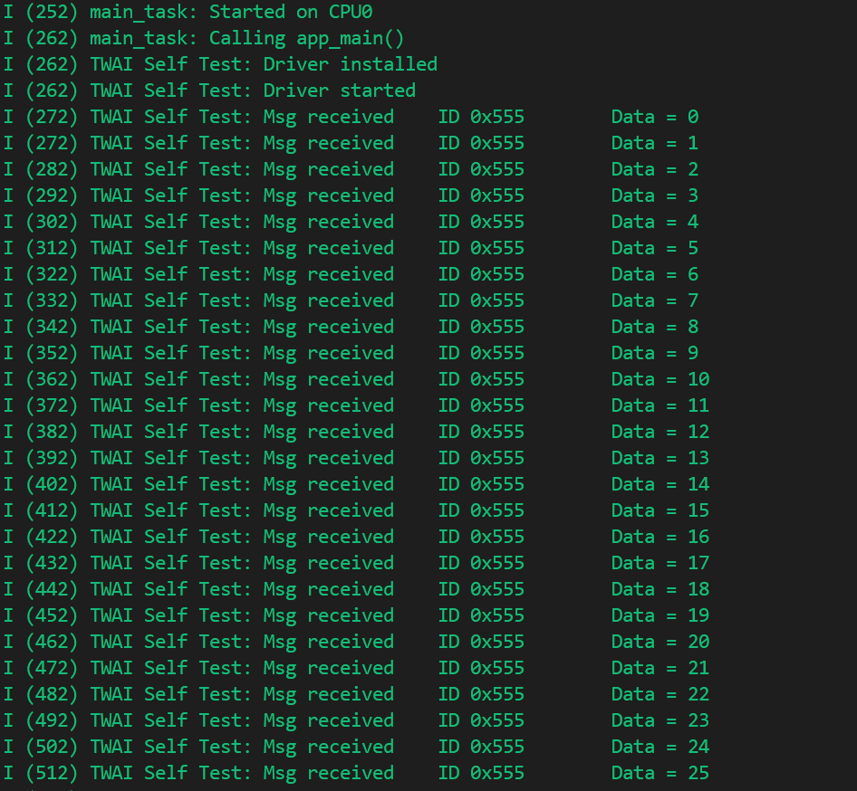
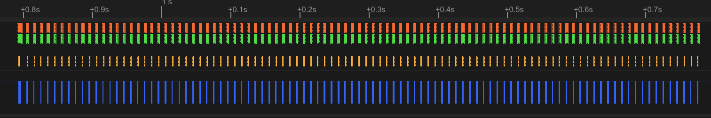
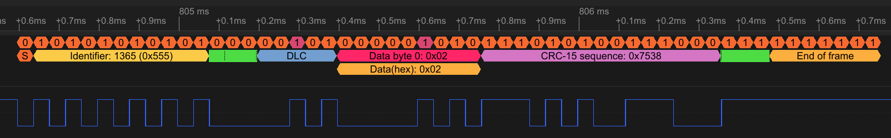
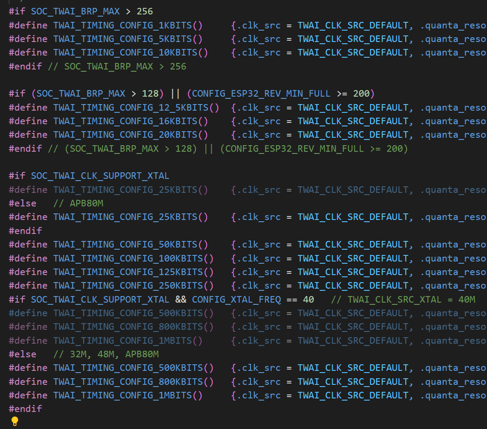
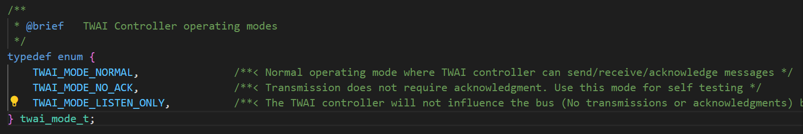
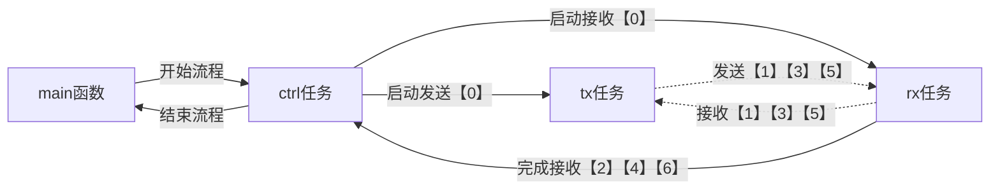

# TWAI Self Test TWAI自检

## 粗略阅读README文档

文档简介示例演示节点使用TWAI驱动程序的"无确认"和自我接收请求向自身传输消息。

自检示例可作为测试运行，确定控制器**是否正确连接到工作的外部收发器**

（可采用跳线进行自己的连接）

配置项目,构建烧录和示例输出

## 构建、烧录和监视

* 选择目标芯片
* 选择端口号和烧录方式
* 配置项目
* 点击**构建、烧录和监视**

在连接CAN模块后连接逻辑分析仪可看得数据如下

可以看到正常发送了CAN协议数据

## 代码分析

### 宏定义和静态变量

* **NO_OF_MSGS** 用于后续测试一次发送报文数量
* **NO_OF_ITERS** 用于指定测试共几轮
* **TX_GPIO_NUM**和**RX_GPIO_NUM** 用于把配置中的引脚显式储存在宏定义中
* **TX_TASK_PRIO**、**RX_TASK_PRIO**、**CTRL_TSK_PRIO**用于在宏定义中配置任务优先级
* **MSG_ID** 设置CAN ID，此处是11位标准ID
* **EXAMPLE_TAG** ESP-IDF统一的日志TAG（前缀）

[官方编程指南v5.5](https://docs.espressif.com/projects/esp-idf/zh_CN/stable/esp32/api-reference/peripherals/twai.html#twai)

`twai_timing_config_t` 类型配置**CAN通信参数**，包括时钟源、每个定时量子分辨率、预分频、各信号定时量子数、调节参数等。具体CAN协议可见[江科协CAN协议](https://www.bilibili.com/video/BV1vu4m1F7Gt/?spm_id_from=333.337.search-card.all.click&vd_source=d39eb1c9b3e81d6e121f09fe248dfe02)
IDF提供了多种默认的频率参数，可供使用


`twai_filter_config_t` 类型配置**CAN过滤器**(*该类型在在v5.4版本使用，在v5.5版本更换*)

* `acceptance_code` 32位接收码数据，以配置接收地址
* `acceptance_mask` 32位掩码数据，以配置哪些码有效
* `single_filter` 参数用于单过滤器和双过滤器模式的[过滤器配置](https://docs.espressif.com/projects/esp-idf/zh_CN/v5.4.2/esp32/api-reference/peripherals/twai.html#id11)

v5.5版本把双过滤器模式配置更加明确，不再需要额外进行32位数据拆分

`twai_general_config_t` 是驱动配置[结构体介绍](https://docs.espressif.com/projects/esp-idf/zh_CN/v5.4.2/esp32/api-reference/peripherals/twai.html#_CPPv421twai_general_config_t)
`TWAI_GENERAL_CONFIG_DEFAULT` 是CAN配置初始化宏，参数为发送GPIO引脚，接收GPIO引脚，通信模式（有正常模式、无应答模式、监听模式）

* 正常模式正常发送，接收，检测，影响总线
* 无应答模式进行发送和接收，但不进行检测，影响总线
* 监听模式不进行发送，但进行接收，不影响总线
* 如果想查看自己发送的数据，示例建议采用无应答模式，并把TX和RX引脚连接

四个静态信号量变量，用于确认信号状态，任务间配合

```c
//Example Configurations
#define NO_OF_MSGS              100
#define NO_OF_ITERS             3
#define TX_GPIO_NUM             CONFIG_EXAMPLE_TX_GPIO_NUM
#define RX_GPIO_NUM             CONFIG_EXAMPLE_RX_GPIO_NUM
#define TX_TASK_PRIO            8       //Sending task priority
#define RX_TASK_PRIO            9       //Receiving task priority
#define CTRL_TSK_PRIO           10      //Control task priority
#define MSG_ID                  0x555   //11 bit standard format ID
#define EXAMPLE_TAG             "TWAI Self Test"

static const twai_timing_config_t t_config = TWAI_TIMING_CONFIG_25KBITS();
//Filter all other IDs except MSG_ID
static const twai_filter_config_t f_config = {.acceptance_code = (MSG_ID << 21),
                                              .acceptance_mask = ~(TWAI_STD_ID_MASK << 21),
                                              .single_filter = true
                                             };
//Set to NO_ACK mode due to self testing with single module
static const twai_general_config_t g_config = TWAI_GENERAL_CONFIG_DEFAULT(TX_GPIO_NUM, RX_GPIO_NUM, TWAI_MODE_NO_ACK);

static SemaphoreHandle_t tx_sem;
static SemaphoreHandle_t rx_sem;
static SemaphoreHandle_t ctrl_sem;
static SemaphoreHandle_t done_sem;
```

### app_main函数

1. 创建四个信号量并赋给静态变量
2. 创建三个任务，有任务函数、任务名、分配内存、优先级、有系统自动分配核；没有*传入参数*和*任务指针*
3. `twai_driver_install` 安装TWAI驱动
4. 给控制任务信号量，启动控制任务。等待完成任务信号量
5. `twai_driver_uninstall` 卸载驱动
6. 删除信号量(**根据源码定义，两删除函数在功能上等同，在编程时建议不出歧义**)

```c
void app_main(void)
{
    //Create tasks and synchronization primitives
    tx_sem = xSemaphoreCreateBinary();
    rx_sem = xSemaphoreCreateBinary();
    ctrl_sem = xSemaphoreCreateBinary();
    done_sem = xSemaphoreCreateBinary();

    xTaskCreatePinnedToCore(twai_control_task, "TWAI_ctrl", 4096, NULL, CTRL_TSK_PRIO, NULL, tskNO_AFFINITY);
    xTaskCreatePinnedToCore(twai_receive_task, "TWAI_rx", 4096, NULL, RX_TASK_PRIO, NULL, tskNO_AFFINITY);
    xTaskCreatePinnedToCore(twai_transmit_task, "TWAI_tx", 4096, NULL, TX_TASK_PRIO, NULL, tskNO_AFFINITY);

    //Install TWAI driver
    ESP_ERROR_CHECK(twai_driver_install(&g_config, &t_config, &f_config));
    ESP_LOGI(EXAMPLE_TAG, "Driver installed");

    //Start control task
    xSemaphoreGive(ctrl_sem);
    //Wait for all iterations and tasks to complete running
    xSemaphoreTake(done_sem, portMAX_DELAY);

    //Uninstall TWAI driver
    ESP_ERROR_CHECK(twai_driver_uninstall());
    ESP_LOGI(EXAMPLE_TAG, "Driver uninstalled");

    //Cleanup
    vSemaphoreDelete(tx_sem);
    vSemaphoreDelete(rx_sem);
    vSemaphoreDelete(ctrl_sem);
    vQueueDelete(done_sem);
}
```

### 任务函数

#### twai_transmit_task

1. 任务创建 `twai_message_t`结构体创建(v5.4)
   * `extd` 扩展帧格式，由于使用的是标准帧，置0
   * `rtr` 消息是远程帧（否）
   * `ss`  作为单次发送。未用于接收（否）
   * `self` 作为自接收请求发送。未用于接收 （是）
   * `dlc_non_comp` 消息数据长度大于8（否）
   * `identifier` 11或29位标识码
   * `data_length_code` 数据长度
   * `data` 数据字节，用于储存数据
2. 循环发送（循环条件见宏定义）
   1. 获取发送信号量，代表允许发送
   2. 循环发送数据，数据写入`data`,采用`twai_transmit`函数发送
3. `vTaskDelete(NULL)`删除调用这个函数的任务本身

```c
static void twai_transmit_task(void *arg)
{
    twai_message_t tx_msg = {
        // Message type and format settings
        .extd = 0,              // Standard Format message (11-bit ID)
        .rtr = 0,               // Send a data frame
        .ss = 0,                // Not single shot
        .self = 1,              // Message is a self reception request (loopback)
        .dlc_non_comp = 0,      // DLC is less than 8
        // Message ID and payload
        .identifier = MSG_ID,
        .data_length_code = 1,
        .data = {0},
    };

    for (int iter = 0; iter < NO_OF_ITERS; iter++) {
        xSemaphoreTake(tx_sem, portMAX_DELAY);
        for (int i = 0; i < NO_OF_MSGS; i++) {
            //Transmit messages using self reception request
            tx_msg.data[0] = i;
            ESP_ERROR_CHECK(twai_transmit(&tx_msg, portMAX_DELAY));
            vTaskDelay(pdMS_TO_TICKS(10));
        }
    }
    vTaskDelete(NULL);
}
```

#### twai_receive_task

1. 创建接收数据变量
2. 循环接收
   1. 获取接收信号量，代表需要接收
   2. 循环接收（由于是自检，接收数据长度和发送一致，已知）
   3. 给控制信号量，代表此次接收完成
3. 删除任务

```c
static void twai_receive_task(void *arg)
{
    twai_message_t rx_message;

    for (int iter = 0; iter < NO_OF_ITERS; iter++) {
        xSemaphoreTake(rx_sem, portMAX_DELAY);
        for (int i = 0; i < NO_OF_MSGS; i++) {
            //Receive message and print message data
            ESP_ERROR_CHECK(twai_receive(&rx_message, portMAX_DELAY));
            ESP_LOGI(EXAMPLE_TAG, "Msg received\tID 0x%lx\tData = %d", rx_message.identifier, rx_message.data[0]);
        }
        //Indicate to control task all messages received for this iteration
        xSemaphoreGive(ctrl_sem);
    }
    vTaskDelete(NULL);
}
```

#### twai_control_task

1. 获取控制信号量，开始控制
2. 循环发送接收流程
   1. `twai_start`启动驱动程序
   2. 给接收、发送信号量
   3. 等待控制信号量，由接收任务给，代表接收完成，即一次流程完成
   4. `twai_stop` 停止驱动程序
3. 给done信号量，代表整个流程完成
4. 删除任务

```c
static void twai_control_task(void *arg)
{
    xSemaphoreTake(ctrl_sem, portMAX_DELAY);
    for (int iter = 0; iter < NO_OF_ITERS; iter++) {
        //Start TWAI Driver for this iteration
        ESP_ERROR_CHECK(twai_start());
        ESP_LOGI(EXAMPLE_TAG, "Driver started");

        //Trigger TX and RX tasks to start transmitting/receiving
        xSemaphoreGive(rx_sem);
        xSemaphoreGive(tx_sem);
        xSemaphoreTake(ctrl_sem, portMAX_DELAY);    //Wait for TX and RX tasks to finish iteration

        ESP_ERROR_CHECK(twai_stop());               //Stop the TWAI Driver
        ESP_LOGI(EXAMPLE_TAG, "Driver stopped");
        vTaskDelay(pdMS_TO_TICKS(100));             //Delay then start next iteration
    }
    xSemaphoreGive(done_sem);
    vTaskDelete(NULL);
}
```

### 流程分析

整体任务配合流程如下：



## 总结

本例程进行了TWAI，即CAN通信的示例尝试，了解了CAN通信的配置方式，进行了发送和接收，并再次看到了多任务和信号配合。但在v5.5版本大部分函数都有变化，所以本示例还是学一下流程和思路，具体使用以文档为主
