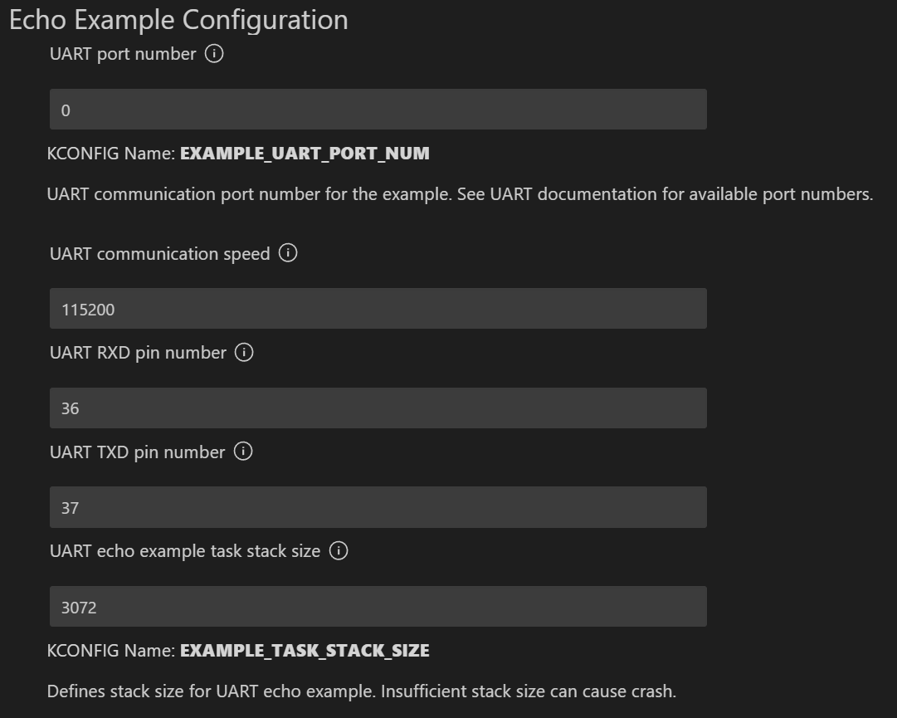
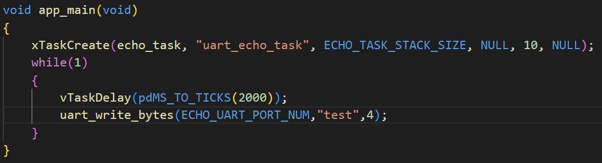
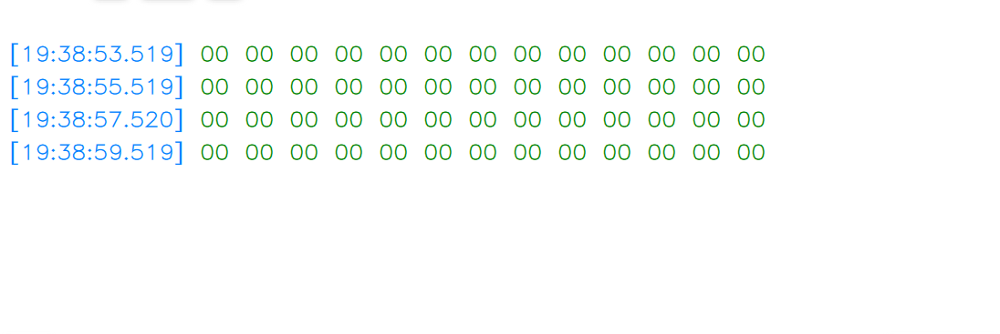
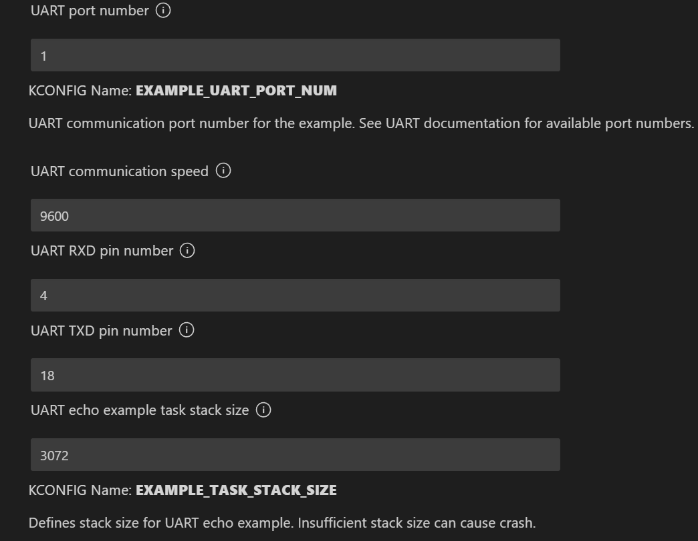
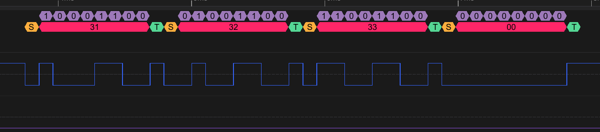
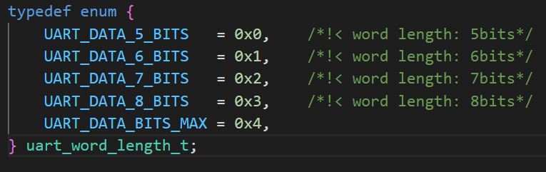
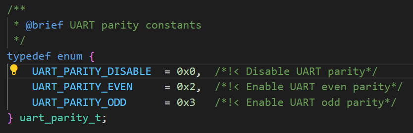
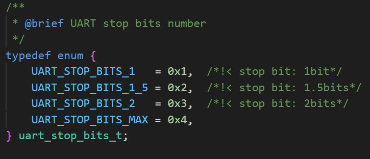
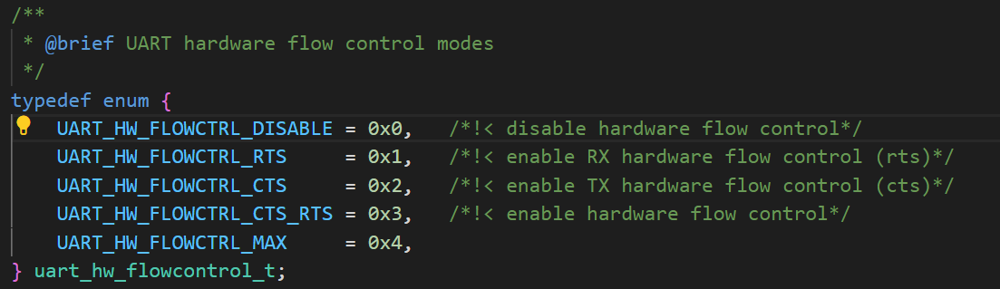
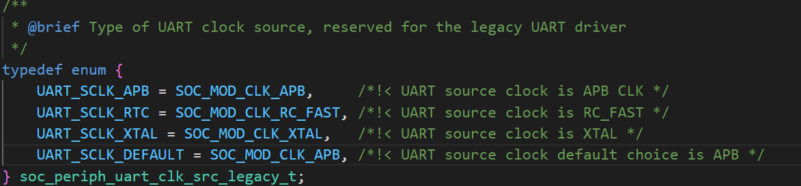

# UART echo UART回应

## 粗略阅读README文档

文档简介此示例演示把接收到的uart数据返回发送方

硬件设置，由于笔者自己设计的PCB上有自带串口模块，故不采用USB转TTL的模块，直接使用。
注意事项笔者暂时没什么头绪，实验后再进行解释

配置，构建烧录和示例输出

## 构建、烧录和监视

* 选择芯片型号
* 选择端口号
* 配置项目(*参考笔者自己设计的电路板*)

* 点击 **构建、烧录和监视**

> * 由于笔者没有USB转TTL的工具，也没有多余串口可以调试，笔者修改主循环中代码，在主循环中发送数据，以验证UART正常工作
> 
> * 监视窗口没有多余输出，采用串口助手查看，可以看到每隔2秒有数据发送
> 
> * 由于监视和发送都在一个串口，会产生矛盾，笔者先尝试用别的引脚，只做输出功能的实验

* 新配置如下

* 配置后通过逻辑分析仪进行读取和解码

需要说明的是此时串口发送代码为`uart_write_bytes(ECHO_UART_PORT_NUM,(char*)"123",4);`,由于双引号的字符串在c语言中末尾会默认加\0,长度为4，如果长度小于4最终输出会如上监视图，全为0。

ASCII码解码演示如上图

## 代码分析

### 头文件和宏定义

* 头文件导入了`driver` 下的 `uart` 和 `gpio` (*gpio库并没有用到*)。还有`sdkconfig.h`该头文件包含esp-idf的各种系统配置(*对比前面的例程实验，该头文件似乎是默认包含，可写可不写*)
* 宏定义把**配置文件导入定义**为可用宏，还定义了缓存大小

```c
#include <stdio.h>
#include "freertos/FreeRTOS.h"
#include "freertos/task.h"
#include "driver/uart.h"
#include "driver/gpio.h"
#include "sdkconfig.h"
#include "esp_log.h"

/**
 * This is an example which echos any data it receives on configured UART back to the sender,
 * with hardware flow control turned off. It does not use UART driver event queue.
 *
 * - Port: configured UART
 * - Receive (Rx) buffer: on
 * - Transmit (Tx) buffer: off
 * - Flow control: off
 * - Event queue: off
 * - Pin assignment: see defines below (See Kconfig)
 */

#define ECHO_TEST_TXD (CONFIG_EXAMPLE_UART_TXD)
#define ECHO_TEST_RXD (CONFIG_EXAMPLE_UART_RXD)
#define ECHO_TEST_RTS (UART_PIN_NO_CHANGE)
#define ECHO_TEST_CTS (UART_PIN_NO_CHANGE)

#define ECHO_UART_PORT_NUM      (CONFIG_EXAMPLE_UART_PORT_NUM)
#define ECHO_UART_BAUD_RATE     (CONFIG_EXAMPLE_UART_BAUD_RATE)
#define ECHO_TASK_STACK_SIZE    (CONFIG_EXAMPLE_TASK_STACK_SIZE)

static const char *TAG = "UART TEST";

#define BUF_SIZE (1024)
```

### app_main()函数

函数中的**while循环为笔者添加**，用于**发送数据**。函数只用于进行任务创建

```c
void app_main(void)
{
    xTaskCreate(echo_task, "uart_echo_task", ECHO_TASK_STACK_SIZE, NULL, 10, NULL);
    while(1)
    {
        vTaskDelay(pdMS_TO_TICKS(2000));
        uart_write_bytes(ECHO_UART_PORT_NUM,(char*)"Hello World!",13);
    }
}
```

### 任务函数

[UART 官方编程指南](https://docs.espressif.com/projects/esp-idf/zh_CN/stable/esp32/api-reference/peripherals/uart.html)

1. 函数先进行uart配置设置
   * `baud_rate` 波特率 配置中设置9600
   * `data_bits` 数据位 设置为8位
    
   * `parity` 校验位 无校验 (可有奇偶校验位)
  
   * `stop_bits` 停止位 1位
  
   * `flow_ctrl` 硬件流控制 不启用
  
   * `source_clk` 时钟源 默认时钟源
  
2. 设置中断标识
3. 安装UART驱动程序
4. 传入结构体配置参数
5. 设置通信引脚
6. 具体运行过程见官方指南，笔者不作具体研究
7. while循环中实时检测UART是否有接收到数据，有的话储存到data内部，并再次输出，同时通过监视窗口输出(*由于没有转换模块，此处现象并没有实际观察到*)

```c
static void echo_task(void *arg)
{
    /* Configure parameters of an UART driver,
     * communication pins and install the driver */
    uart_config_t uart_config = {
        .baud_rate = ECHO_UART_BAUD_RATE,
        .data_bits = UART_DATA_8_BITS,
        .parity    = UART_PARITY_DISABLE,
        .stop_bits = UART_STOP_BITS_1,
        .flow_ctrl = UART_HW_FLOWCTRL_DISABLE,
        .source_clk = UART_SCLK_DEFAULT,
    };
    int intr_alloc_flags = 0;

#if CONFIG_UART_ISR_IN_IRAM
    intr_alloc_flags = ESP_INTR_FLAG_IRAM;
#endif

    ESP_ERROR_CHECK(uart_driver_install(ECHO_UART_PORT_NUM, BUF_SIZE * 2, 0, 0, NULL, intr_alloc_flags));
    ESP_ERROR_CHECK(uart_param_config(ECHO_UART_PORT_NUM, &uart_config));
    ESP_ERROR_CHECK(uart_set_pin(ECHO_UART_PORT_NUM, ECHO_TEST_TXD, ECHO_TEST_RXD, ECHO_TEST_RTS, ECHO_TEST_CTS));

    // Configure a temporary buffer for the incoming data
    uint8_t *data = (uint8_t *) malloc(BUF_SIZE);

    while (1) {
        // Read data from the UART
        int len = uart_read_bytes(ECHO_UART_PORT_NUM, data, (BUF_SIZE - 1), 20 / portTICK_PERIOD_MS);
        // Write data back to the UART
        uart_write_bytes(ECHO_UART_PORT_NUM, (const char *) data, len);
        if (len) {
            data[len] = '\0';
            ESP_LOGI(TAG, "Recv str: %s", (char *) data);
        }
    }
}
```

## 总结

由于笔者实验环境条件有限，暂时没有串口转换模块，后续串口实验暂时搁置。就本例而言，笔者熟悉了串口配置和启动的流程，进行了发送数据的实验，并在逻辑分析仪中观察到数据。968N1是较为常见和通用的串口配置，其他配置由笔者后续自行尝试，不在此记录。
