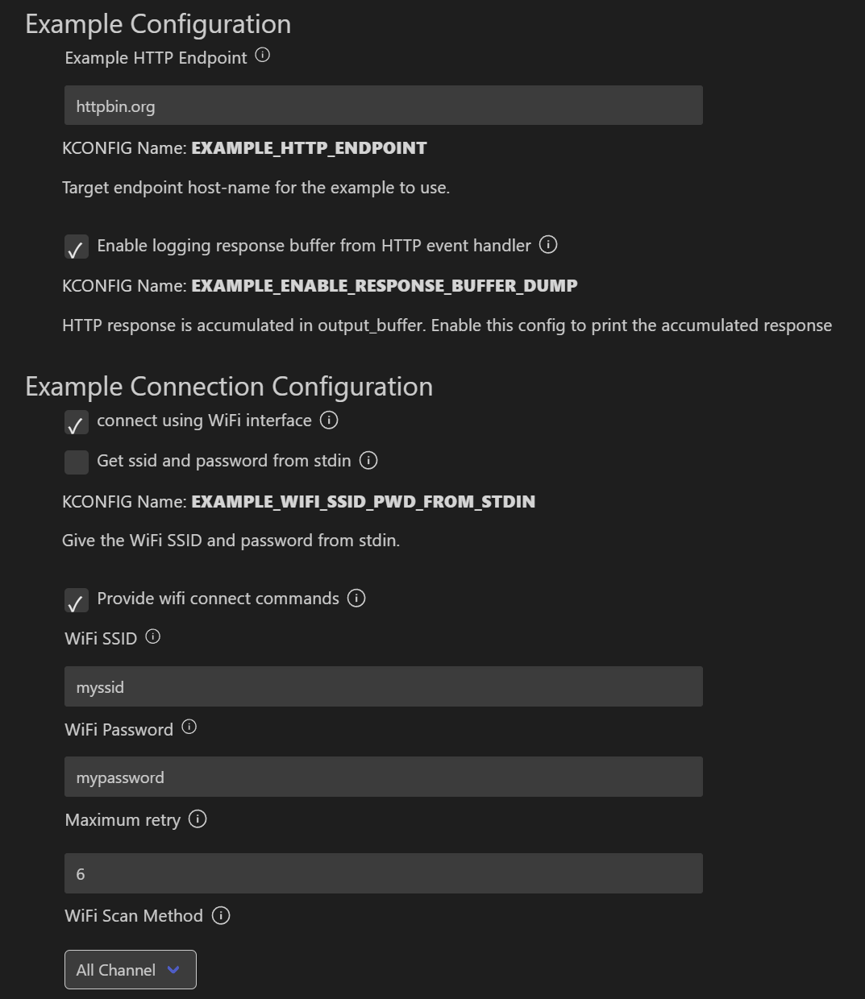
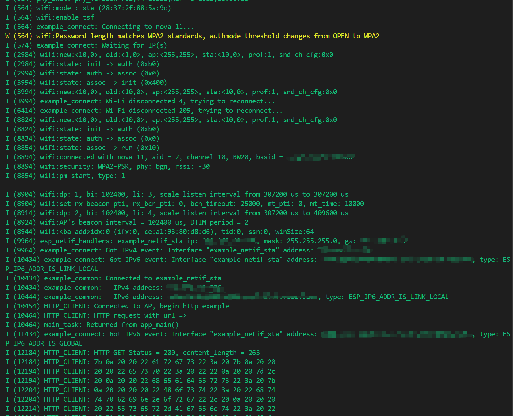
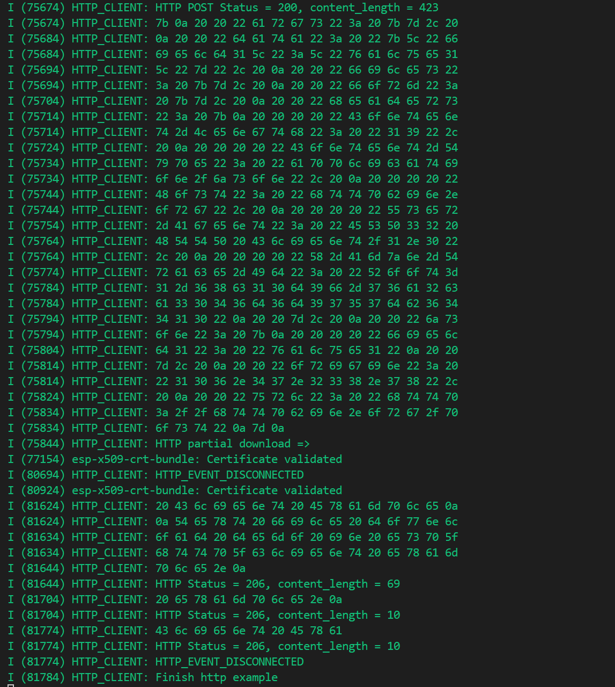
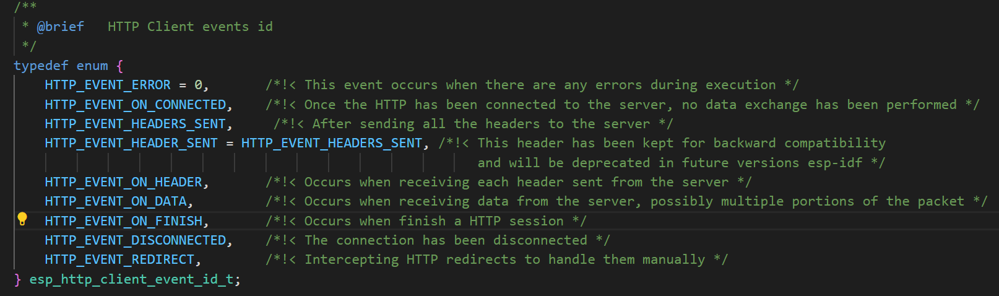
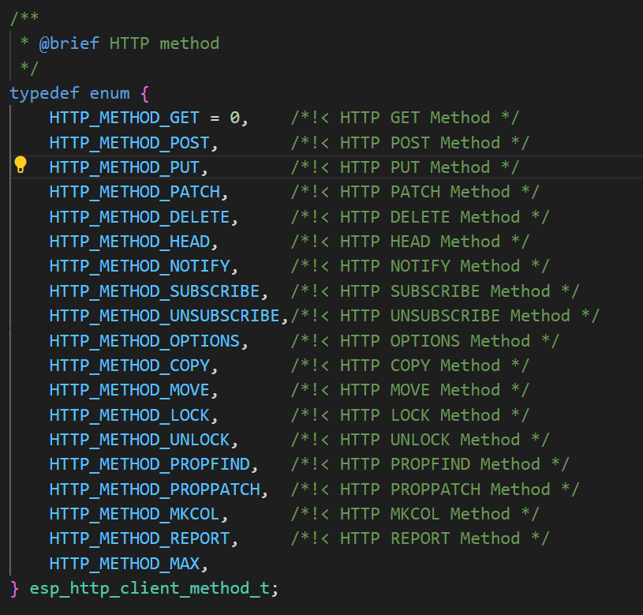

# ESP HTTP Client esp-http-客户端

## 文档简介

由于示例的README文件可以说没有，参照[编程指南](https://docs.espressif.com/projects/esp-idf/zh_CN/stable/esp32/api-reference/protocols/esp_http_client.html#esp-http)示例用于从ESP-IDF应用程序中发起HTTP/S请求。

## 构建、烧录和监视

* 选择目标芯片
* 选择端口号
* 选择烧录方式
* 配置项目
* 点击**构建、烧录和监视**
  
* 监视输出-失败分析
  * 和`version`有关的版本说明不作解释
  * WiFi驱动详细信息`wifi driver task: `
  * NVS flash（非易失行存储）使能
  * nano格式化禁用
  * 动态RX buffer数：32，静态rx mgmt buffer数：5
  * buffer有关的初始化不作解释（毕竟暂时看不懂）
  * 初始化网络协议相关的信息（挖坑，网络协议会专门进行记录）
  * 中断相关选项使能（IRAM OP enabled）
  * 物理层版本，编译日期（可能）
  * WiFi模式为站模式，使能**TSF**(Time Sync Function)，时间戳功能
  * 根据密码长度调整mode为WPA2
  * 尝试连接，等待获取到IP地址
  * 连续失败（失败码为201），多次尝试失败后报错，ESP重启
* 监视输出-成功分析
  * 等待获取到IP地址
  * wifi提示：
    * `new:<10,0>`新分配的IP地址。 10.0.x.x是常见的私有IP地址范围
    * `old:<1,0>`旧的IP地址。1.0.x.x是初始的特殊值
    * `ap:<255,255>`接入点的IP地址。255.255.x.x通常表示无效或未设置
    * `sta:<10,0>`站模式下的IP地址，与new相同。说明设备使用此IP
    * `prof:1`WiFi配置文件编号为1
    * `snd_ch_cfg:0x0`发送通道配置为0x0。表示使用默认配置
  * wifi状态(state) ：`init`初始化， `auth`认证， `assoc`关联， `run`运行
  * 说明状态，监视中显示进行了状态反复和重试
  * 成功连接，连接设备 2，通道 10
  * 使用加密方式为WPA2-PSK，物理层协议，信号强度（dBm）
  * 状态输出（有超时，有状态码，但笔者不清楚具体含义，留待代码分析时查看）
  * netif句柄显示，本站IP为：xxxxxx，子网掩码为：xxxxxxx，网关为：xxxxx
  * 获取到IPv4地址和IPv6地址
* HTTP客户端进行请求
* 请求状态码 200，请求成功，监视窗口输出返回数据
* 后续尝试下载和断开连接
* 完成客户端示例演示

## 代码分析

### 头文件、宏定义和常量

头文件相关内容写在下方注释中

```c
#include <string.h>                     // c库头文件，提供字符串处理函数
#include <sys/param.h>                  // 系统参数头文件，包括系统常量和类型定义，以及网络相关常量
#include <stdlib.h>                     // c库头文件，提供通用工具函数，如内存分配，随机数生成，字符串转换
#include <ctype.h>                      // 字符处理头文件，提供字符检查和转换函数
#include "esp_log.h"
#include "nvs_flash.h"
#include "esp_event.h"                  // 事件循环头文件，提供事件循环管理功能
#include "esp_netif.h"                  // 网络接口头文件，提供网络接口管理功能
#include "protocol_examples_common.h"   // 协议示例通用头文件，提供通用完了协议示例辅助函数和宏定义
#include "protocol_examples_utils.h"    // 协议示例工具头文件，提供URL解析，证书处理等工具函数
#include "esp_tls.h"                    // TLS/SSL安全连接头文件，提供安全网络通信功能，用于实现HTTPS等安全协议
#if CONFIG_MBEDTLS_CERTIFICATE_BUNDLE   // 条件编译宏，判断是否启用mbedTLS证书捆绑功能
#include "esp_crt_bundle.h"             // 证书捆绑头文件，提供预加载的CA证书捆绑包，用于验证服务器证书
#endif

#include "freertos/FreeRTOS.h"
#include "freertos/task.h"
#include "esp_system.h"

#include "esp_http_client.h"

#define MAX_HTTP_RECV_BUFFER 512
#define MAX_HTTP_OUTPUT_BUFFER 2048
static const char *TAG = "HTTP_CLIENT";

/* Root cert for howsmyssl.com, taken from howsmyssl_com_root_cert.pem

   The PEM file was extracted from the output of this command:
   openssl s_client -showcerts -connect www.howsmyssl.com:443 </dev/null

   The CA root cert is the last cert given in the chain of certs.

   To embed it in the app binary, the PEM file is named
   in the component.mk COMPONENT_EMBED_TXTFILES variable.
*/
extern const char howsmyssl_com_root_cert_pem_start[] asm("_binary_howsmyssl_com_root_cert_pem_start");     // 声明howsmyssl.com的根证书PEM文件的起始地址，用于安全连接验证。
extern const char howsmyssl_com_root_cert_pem_end[]   asm("_binary_howsmyssl_com_root_cert_pem_end");       // 声明howsmyssl.com的根证书PEM文件的结束地址

extern const char postman_root_cert_pem_start[] asm("_binary_postman_root_cert_pem_start");                 // 声明Postman的根证书PEM文件的起始地址。
extern const char postman_root_cert_pem_end[]   asm("_binary_postman_root_cert_pem_end");                   // 声明Postman的根证书PEM文件的结束地址。
```

### app_main和示例演示任务函数

`test_task`演示函数中依次对各个函数进行测试

`main`函数中

1. 进行NVS初始化
2. 根据WiFi驱动中的顺序进行LwIP初始化
3. 创建系统事件任务
4. `example_connect`调用示例组件中的函数进行辅助网络连接
5. 创建任务

```c
static void http_test_task(void *pvParameters)
{
    http_rest_with_url();
    http_rest_with_hostname_path();
#if CONFIG_ESP_HTTP_CLIENT_ENABLE_BASIC_AUTH
    http_auth_basic();
    http_auth_basic_redirect();
#endif
#if CONFIG_ESP_HTTP_CLIENT_ENABLE_DIGEST_AUTH
    http_auth_digest_md5();
    http_auth_digest_sha256();
#endif
    http_encoded_query();
    http_relative_redirect();
    http_absolute_redirect();
    http_absolute_redirect_manual();
#if CONFIG_MBEDTLS_CERTIFICATE_BUNDLE
    https_with_url();
#endif
    https_with_hostname_path();
    http_redirect_to_https();
    http_download_chunk();
    http_perform_as_stream_reader();
    https_async();
    https_with_invalid_url();
    http_native_request();
#if CONFIG_MBEDTLS_CERTIFICATE_BUNDLE
    http_partial_download();
#endif

    ESP_LOGI(TAG, "Finish http example");
#if !CONFIG_IDF_TARGET_LINUX
    vTaskDelete(NULL);
#endif
}

void app_main(void)
{
    esp_err_t ret = nvs_flash_init();
    if (ret == ESP_ERR_NVS_NO_FREE_PAGES || ret == ESP_ERR_NVS_NEW_VERSION_FOUND) {
      ESP_ERROR_CHECK(nvs_flash_erase());
      ret = nvs_flash_init();
    }
    ESP_ERROR_CHECK(ret);

    ESP_ERROR_CHECK(esp_netif_init());
    ESP_ERROR_CHECK(esp_event_loop_create_default());

    /* This helper function configures Wi-Fi or Ethernet, as selected in menuconfig.
     * Read "Establishing Wi-Fi or Ethernet Connection" section in
     * examples/protocols/README.md for more information about this function.
     */
    ESP_ERROR_CHECK(example_connect());
    ESP_LOGI(TAG, "Connected to AP, begin http example");

#if CONFIG_IDF_TARGET_LINUX
    http_test_task(NULL);
#else
    xTaskCreate(&http_test_task, "http_test_task", 8192, NULL, 5, NULL);
#endif
}
```

***辅助函数***

下方函数根据嵌套进行排列，`example_connect`辅助进行网络相关连接，本例只用wifi，故只看WiFi相关

`example_wifi_connect` 函数进行wifi连接。首先调用`example_wifi_start`完成创建驱动，模式配置和WiFi启动。然后根据预编译的模式设置所连接WiFi的ssid和password是从*内部获取*还是*程序配置*。

在配置完成后调用`example_wifi_sta_do_connect`进行网络连接

1. `xSemaphoreCreateBinary` 创建信号量用于等待或者同步
2. `esp_event_handler_register` 为WiFi事件绑定函数
3. `esp_wifi_set_config`写入配置，`esp_wifi_connect` 进行WiFi连接
4. `xSemaphoreTake`阻塞等待连接完成 `vSemaphoreDelete` 清除信号量
5. 如果超时，返回**ESP_FAIL**

```c
esp_err_t example_connect(void)
{
#if CONFIG_EXAMPLE_CONNECT_ETHERNET
    if (example_ethernet_connect() != ESP_OK) {
        return ESP_FAIL;
    }
    ESP_ERROR_CHECK(esp_register_shutdown_handler(&example_ethernet_shutdown));
#endif
#if CONFIG_EXAMPLE_CONNECT_WIFI
    if (example_wifi_connect() != ESP_OK) {
        return ESP_FAIL;
    }
    ESP_ERROR_CHECK(esp_register_shutdown_handler(&example_wifi_shutdown));
#endif
#if CONFIG_EXAMPLE_CONNECT_THREAD
    if (example_thread_connect() != ESP_OK) {
        return ESP_FAIL;
    }
    ESP_ERROR_CHECK(esp_register_shutdown_handler(&example_thread_shutdown));
#endif
#if CONFIG_EXAMPLE_CONNECT_PPP
    if (example_ppp_connect() != ESP_OK) {
        return ESP_FAIL;
    }
    ESP_ERROR_CHECK(esp_register_shutdown_handler(&example_ppp_shutdown));
#endif

#if CONFIG_EXAMPLE_CONNECT_ETHERNET
    example_print_all_netif_ips(EXAMPLE_NETIF_DESC_ETH);
#endif

#if CONFIG_EXAMPLE_CONNECT_WIFI
    example_print_all_netif_ips(EXAMPLE_NETIF_DESC_STA);
#endif

#if CONFIG_EXAMPLE_CONNECT_THREAD
    example_print_all_netif_ips(EXAMPLE_NETIF_DESC_THREAD);
#endif

#if CONFIG_EXAMPLE_CONNECT_PPP
    example_print_all_netif_ips(EXAMPLE_NETIF_DESC_PPP);
#endif

    return ESP_OK;
}
esp_err_t example_wifi_connect(void)
{
    ESP_LOGI(TAG, "Start example_connect.");
    example_wifi_start();
    wifi_config_t wifi_config = {
        .sta = {
#if !CONFIG_EXAMPLE_WIFI_SSID_PWD_FROM_STDIN
            .ssid = CONFIG_EXAMPLE_WIFI_SSID,
            .password = CONFIG_EXAMPLE_WIFI_PASSWORD,
#endif
            .scan_method = EXAMPLE_WIFI_SCAN_METHOD,
            .sort_method = EXAMPLE_WIFI_CONNECT_AP_SORT_METHOD,
            .threshold.rssi = CONFIG_EXAMPLE_WIFI_SCAN_RSSI_THRESHOLD,
            .threshold.authmode = EXAMPLE_WIFI_SCAN_AUTH_MODE_THRESHOLD,
        },
    };
#if CONFIG_EXAMPLE_WIFI_SSID_PWD_FROM_STDIN
    example_configure_stdin_stdout();
    char buf[sizeof(wifi_config.sta.ssid)+sizeof(wifi_config.sta.password)+2] = {0};
    ESP_LOGI(TAG, "Please input ssid password:");
    fgets(buf, sizeof(buf), stdin);
    int len = strlen(buf);
    buf[len-1] = '\0'; /* removes '\n' */
    memset(wifi_config.sta.ssid, 0, sizeof(wifi_config.sta.ssid));

    char *rest = NULL;
    char *temp = strtok_r(buf, " ", &rest);
    strncpy((char*)wifi_config.sta.ssid, temp, sizeof(wifi_config.sta.ssid));
    memset(wifi_config.sta.password, 0, sizeof(wifi_config.sta.password));
    temp = strtok_r(NULL, " ", &rest);
    if (temp) {
        strncpy((char*)wifi_config.sta.password, temp, sizeof(wifi_config.sta.password));
    } else {
        wifi_config.sta.threshold.authmode = WIFI_AUTH_OPEN;
    }
#endif
    return example_wifi_sta_do_connect(wifi_config, true);
}
void example_wifi_start(void)
{
    wifi_init_config_t cfg = WIFI_INIT_CONFIG_DEFAULT();
    ESP_ERROR_CHECK(esp_wifi_init(&cfg));

    esp_netif_inherent_config_t esp_netif_config = ESP_NETIF_INHERENT_DEFAULT_WIFI_STA();
    // Warning: the interface desc is used in tests to capture actual connection details (IP, gw, mask)
    esp_netif_config.if_desc = EXAMPLE_NETIF_DESC_STA;
    esp_netif_config.route_prio = 128;
    s_example_sta_netif = esp_netif_create_wifi(WIFI_IF_STA, &esp_netif_config);
    esp_wifi_set_default_wifi_sta_handlers();

    ESP_ERROR_CHECK(esp_wifi_set_storage(WIFI_STORAGE_RAM));
    ESP_ERROR_CHECK(esp_wifi_set_mode(WIFI_MODE_STA));
    ESP_ERROR_CHECK(esp_wifi_start());
}
esp_err_t example_wifi_sta_do_connect(wifi_config_t wifi_config, bool wait)
{
    if (wait) {
        s_semph_get_ip_addrs = xSemaphoreCreateBinary();
        if (s_semph_get_ip_addrs == NULL) {
            return ESP_ERR_NO_MEM;
        }
#if CONFIG_EXAMPLE_CONNECT_IPV6
        s_semph_get_ip6_addrs = xSemaphoreCreateBinary();
        if (s_semph_get_ip6_addrs == NULL) {
            vSemaphoreDelete(s_semph_get_ip_addrs);
            return ESP_ERR_NO_MEM;
        }
#endif
    }
    s_retry_num = 0;
    ESP_ERROR_CHECK(esp_event_handler_register(WIFI_EVENT, WIFI_EVENT_STA_DISCONNECTED, &example_handler_on_wifi_disconnect, NULL));
    ESP_ERROR_CHECK(esp_event_handler_register(IP_EVENT, IP_EVENT_STA_GOT_IP, &example_handler_on_sta_got_ip, NULL));
    ESP_ERROR_CHECK(esp_event_handler_register(WIFI_EVENT, WIFI_EVENT_STA_CONNECTED, &example_handler_on_wifi_connect, s_example_sta_netif));
#if CONFIG_EXAMPLE_CONNECT_IPV6
    ESP_ERROR_CHECK(esp_event_handler_register(IP_EVENT, IP_EVENT_GOT_IP6, &example_handler_on_sta_got_ipv6, NULL));
#endif

    ESP_LOGI(TAG, "Connecting to %s...", wifi_config.sta.ssid);
    ESP_ERROR_CHECK(esp_wifi_set_config(WIFI_IF_STA, &wifi_config));
    esp_err_t ret = esp_wifi_connect();
    if (ret != ESP_OK) {
        ESP_LOGE(TAG, "WiFi connect failed! ret:%x", ret);
        return ret;
    }
    if (wait) {
        ESP_LOGI(TAG, "Waiting for IP(s)");
#if CONFIG_EXAMPLE_CONNECT_IPV4
        xSemaphoreTake(s_semph_get_ip_addrs, portMAX_DELAY);
        vSemaphoreDelete(s_semph_get_ip_addrs);
        s_semph_get_ip_addrs = NULL;
#endif
#if CONFIG_EXAMPLE_CONNECT_IPV6
        xSemaphoreTake(s_semph_get_ip6_addrs, portMAX_DELAY);
        vSemaphoreDelete(s_semph_get_ip6_addrs);
        s_semph_get_ip6_addrs = NULL;
#endif
        if (s_retry_num > CONFIG_EXAMPLE_WIFI_CONN_MAX_RETRY) {
            return ESP_FAIL;
        }
    }
    return ESP_OK;
}
```

### HTTP事件处理函数



case中对于**HTTP_EVENT_ON_DATA**（从服务端接收到数据）

1. 如果没有待输出的字符，清空缓存区
2. `esp_http_client_is_chunked_response`检查相应数据是否分块
3. 如果不分块，有缓冲区就把数据拷贝到缓冲区（取小是为了防止在缓冲区空间不足时产生越界）
4. 没有缓冲区就储存在内部，`esp_http_client_get_content_length`获取http相应内容长度，数据存入`output_buffer`中

case中对于**HTTP_EVENT_ON_FINISH**（完成HTTP会话）。如果有接收到消息并储存在`output_buffer`，把数据转换成十六进制输出，并释放内存

case中对于**HTTP_EVENT_DISCONNECTED**（断开连接）`esp_tls_get_and_clear_last_error`返回 esp_tls 中的最后一个错误以及详细的 mbedtls 相关错误代码。错误信息在返回时在内部清除。并清空内部输出缓冲

case中对于**HTTP_EVENT_REDIRECT**（重定向）。`esp_http_client_set_header`重新设置请求头,`esp_http_client_set_redirection`设置重定向URL

```c
esp_err_t _http_event_handler(esp_http_client_event_t *evt)
{
    static char *output_buffer;  // Buffer to store response of http request from event handler
    static int output_len;       // Stores number of bytes read
    switch(evt->event_id) {
        case HTTP_EVENT_ERROR:
            ESP_LOGD(TAG, "HTTP_EVENT_ERROR");
            break;
        case HTTP_EVENT_ON_CONNECTED:
            ESP_LOGD(TAG, "HTTP_EVENT_ON_CONNECTED");
            break;
        case HTTP_EVENT_HEADER_SENT:
            ESP_LOGD(TAG, "HTTP_EVENT_HEADER_SENT");
            break;
        case HTTP_EVENT_ON_HEADER:
            ESP_LOGD(TAG, "HTTP_EVENT_ON_HEADER, key=%s, value=%s", evt->header_key, evt->header_value);
            break;
        case HTTP_EVENT_ON_DATA:
            ESP_LOGD(TAG, "HTTP_EVENT_ON_DATA, len=%d", evt->data_len);
            // Clean the buffer in case of a new request
            if (output_len == 0 && evt->user_data) {
                // we are just starting to copy the output data into the use
                memset(evt->user_data, 0, MAX_HTTP_OUTPUT_BUFFER);
            }
            /*
             *  Check for chunked encoding is added as the URL for chunked encoding used in this example returns binary data.
             *  However, event handler can also be used in case chunked encoding is used.
             */
            if (!esp_http_client_is_chunked_response(evt->client)) {
                // If user_data buffer is configured, copy the response into the buffer
                int copy_len = 0;
                if (evt->user_data) {
                    // The last byte in evt->user_data is kept for the NULL character in case of out-of-bound access.
                    copy_len = MIN(evt->data_len, (MAX_HTTP_OUTPUT_BUFFER - output_len));
                    if (copy_len) {
                        memcpy(evt->user_data + output_len, evt->data, copy_len);
                    }
                } else {
                    int content_len = esp_http_client_get_content_length(evt->client);
                    if (output_buffer == NULL) {
                        // We initialize output_buffer with 0 because it is used by strlen() and similar functions therefore should be null terminated.
                        output_buffer = (char *) calloc(content_len + 1, sizeof(char));
                        output_len = 0;
                        if (output_buffer == NULL) {
                            ESP_LOGE(TAG, "Failed to allocate memory for output buffer");
                            return ESP_FAIL;
                        }
                    }
                    copy_len = MIN(evt->data_len, (content_len - output_len));
                    if (copy_len) {
                        memcpy(output_buffer + output_len, evt->data, copy_len);
                    }
                }
                output_len += copy_len;
            }

            break;
        case HTTP_EVENT_ON_FINISH:
            ESP_LOGD(TAG, "HTTP_EVENT_ON_FINISH");
            if (output_buffer != NULL) {
#if CONFIG_EXAMPLE_ENABLE_RESPONSE_BUFFER_DUMP
                ESP_LOG_BUFFER_HEX(TAG, output_buffer, output_len);
#endif
                free(output_buffer);
                output_buffer = NULL;
            }
            output_len = 0;
            break;
        case HTTP_EVENT_DISCONNECTED:
            ESP_LOGI(TAG, "HTTP_EVENT_DISCONNECTED");
            int mbedtls_err = 0;
            esp_err_t err = esp_tls_get_and_clear_last_error((esp_tls_error_handle_t)evt->data, &mbedtls_err, NULL);
            if (err != 0) {
                ESP_LOGI(TAG, "Last esp error code: 0x%x", err);
                ESP_LOGI(TAG, "Last mbedtls failure: 0x%x", mbedtls_err);
            }
            if (output_buffer != NULL) {
                free(output_buffer);
                output_buffer = NULL;
            }
            output_len = 0;
            break;
        case HTTP_EVENT_REDIRECT:
            ESP_LOGD(TAG, "HTTP_EVENT_REDIRECT");
            esp_http_client_set_header(evt->client, "From", "user@example.com");
            esp_http_client_set_header(evt->client, "Accept", "text/html");
            esp_http_client_set_redirection(evt->client);
            break;
    }
    return ESP_OK;
}
```

### HTTP客户请求操作

1. 初始化输出缓冲
2. `esp_http_client_config_t` 进行客户端配置
   * `host` 域名或IP作为字符串
   * `path` HTTP路径，默认为`/`
   * `query` HTTP查询
   * `event_handler` HTTP事件句柄
   * `user_data` 用户上下文数据（传递本地缓冲地址以获取响应）
   * `disable_auto_redirect` 禁用HTTP自动重定向
3. `esp_http_client_init` 给予配置创建HTTP客户端句柄
4. `esp_http_client_perform` 执行客户端的所有操作，包括打开连接、交换数据、关闭连接（如需要），在任务完成前阻塞任务
5. 在操作执行完成后，`esp_http_client_get_status_code`用于获取http响应状态码，`esp_http_client_get_content_length`获取http响应内容长度
6. `esp_http_client_set_url` 为客户端设置url（替换）
7. `esp_http_client_set_method` 设置http请求方法，常用为**GET**、**POST**、**PUT**
8. `esp_http_client_set_post_field` 设置POST方法传出的数据
9. `esp_http_client_perform`执行操作，后续基本相同
10. PATCH请求中，请求体不包含数据，设为NULL和0 `esp_http_client_set_post_field(client, NULL, 0)`
11. `esp_http_client_cleanup` 关闭连接并释放分配给HTTP客户端实例的内存

```c
static void http_rest_with_url(void)
{
    // Declare local_response_buffer with size (MAX_HTTP_OUTPUT_BUFFER + 1) to prevent out of bound access when
    // it is used by functions like strlen(). The buffer should only be used upto size MAX_HTTP_OUTPUT_BUFFER
    char local_response_buffer[MAX_HTTP_OUTPUT_BUFFER + 1] = {0};
    /**
     * NOTE: All the configuration parameters for http_client must be specified either in URL or as host and path parameters.
     * If host and path parameters are not set, query parameter will be ignored. In such cases,
     * query parameter should be specified in URL.
     *
     * If URL as well as host and path parameters are specified, values of host and path will be considered.
     */
    esp_http_client_config_t config = {
        .host = CONFIG_EXAMPLE_HTTP_ENDPOINT,
        .path = "/get",
        .query = "esp",
        .event_handler = _http_event_handler,
        .user_data = local_response_buffer,        // Pass address of local buffer to get response
        .disable_auto_redirect = true,
    };
    ESP_LOGI(TAG, "HTTP request with url =>");
    esp_http_client_handle_t client = esp_http_client_init(&config);

    // GET
    esp_err_t err = esp_http_client_perform(client);
    if (err == ESP_OK) {
        ESP_LOGI(TAG, "HTTP GET Status = %d, content_length = %"PRId64,
                esp_http_client_get_status_code(client),
                esp_http_client_get_content_length(client));
    } else {
        ESP_LOGE(TAG, "HTTP GET request failed: %s", esp_err_to_name(err));
    }
    ESP_LOG_BUFFER_HEX(TAG, local_response_buffer, strlen(local_response_buffer));

    // POST
    const char *post_data = "{\"field1\":\"value1\"}";
    esp_http_client_set_url(client, "http://"CONFIG_EXAMPLE_HTTP_ENDPOINT"/post");
    esp_http_client_set_method(client, HTTP_METHOD_POST);
    esp_http_client_set_header(client, "Content-Type", "application/json");
    esp_http_client_set_post_field(client, post_data, strlen(post_data));
    err = esp_http_client_perform(client);
    if (err == ESP_OK) {
        ESP_LOGI(TAG, "HTTP POST Status = %d, content_length = %"PRId64,
                esp_http_client_get_status_code(client),
                esp_http_client_get_content_length(client));
    } else {
        ESP_LOGE(TAG, "HTTP POST request failed: %s", esp_err_to_name(err));
    }

    //PUT
    esp_http_client_set_url(client, "http://"CONFIG_EXAMPLE_HTTP_ENDPOINT"/put");
    esp_http_client_set_method(client, HTTP_METHOD_PUT);
    err = esp_http_client_perform(client);
    if (err == ESP_OK) {
        ESP_LOGI(TAG, "HTTP PUT Status = %d, content_length = %"PRId64,
                esp_http_client_get_status_code(client),
                esp_http_client_get_content_length(client));
    } else {
        ESP_LOGE(TAG, "HTTP PUT request failed: %s", esp_err_to_name(err));
    }

    //PATCH
    esp_http_client_set_url(client, "http://"CONFIG_EXAMPLE_HTTP_ENDPOINT"/patch");
    esp_http_client_set_method(client, HTTP_METHOD_PATCH);
    esp_http_client_set_post_field(client, NULL, 0);
    err = esp_http_client_perform(client);
    if (err == ESP_OK) {
        ESP_LOGI(TAG, "HTTP PATCH Status = %d, content_length = %"PRId64,
                esp_http_client_get_status_code(client),
                esp_http_client_get_content_length(client));
    } else {
        ESP_LOGE(TAG, "HTTP PATCH request failed: %s", esp_err_to_name(err));
    }

    //DELETE
    esp_http_client_set_url(client, "http://"CONFIG_EXAMPLE_HTTP_ENDPOINT"/delete");
    esp_http_client_set_method(client, HTTP_METHOD_DELETE);
    err = esp_http_client_perform(client);
    if (err == ESP_OK) {
        ESP_LOGI(TAG, "HTTP DELETE Status = %d, content_length = %"PRId64,
                esp_http_client_get_status_code(client),
                esp_http_client_get_content_length(client));
    } else {
        ESP_LOGE(TAG, "HTTP DELETE request failed: %s", esp_err_to_name(err));
    }

    //HEAD
    esp_http_client_set_url(client, "http://"CONFIG_EXAMPLE_HTTP_ENDPOINT"/get");
    esp_http_client_set_method(client, HTTP_METHOD_HEAD);
    err = esp_http_client_perform(client);
    if (err == ESP_OK) {
        ESP_LOGI(TAG, "HTTP HEAD Status = %d, content_length = %"PRId64,
                esp_http_client_get_status_code(client),
                esp_http_client_get_content_length(client));
    } else {
        ESP_LOGE(TAG, "HTTP HEAD request failed: %s", esp_err_to_name(err));
    }

    esp_http_client_cleanup(client);
}
```

***特殊情况***

set_url中设置相对路径，会进行拼接，实际路径为(`http://CONFIG_EXAMPLE_HTTP_ENDPOINT/post`)参考前一个函数。

[客户端配置](https://docs.espressif.com/projects/esp-idf/zh_CN/stable/esp32/api-reference/protocols/esp_http_client.html#_CPPv424esp_http_client_config_t)中有非常多可配置元素。

对于示例中关于客户端请求的各个函数，最重要的区别就是`esp_http_client_config_t`结构体配置不同

* `url` 设置HTTP URL，最重要，会覆盖重复字段
* `host` 域名或IP作为字符串
* `path` HTTP路径
* `event_handler` HTTP事件处理函数
* `transport_type` HTTP传输类型
* `auth_type` HTTP身份验证类型
* `max_authorization_retries` 收到HTTP未授权状态码时最大重连次数，-1时禁用重连
* `buffer_size_tx` HTTP传输缓冲区大小
* `crt_bundle_attach` 指向`esp_crt_bundle_attach`的函数指针，运行证书包进行服务器验证，需启用
* `cert_pem` SSL服务器认证，用于[HTTPS请求](https://docs.espressif.com/projects/esp-idf/zh_CN/stable/esp32/api-reference/protocols/esp_http_client.html#https)
* `disable_auto_redirect`禁用自动重定向

```c
esp_http_client_set_url(client, "/post"); 

esp_http_client_config_t config = {
    .host = CONFIG_EXAMPLE_HTTP_ENDPOINT,
    .path = "/get",
    .transport_type = HTTP_TRANSPORT_OVER_TCP,
    .event_handler = _http_event_handler,
};

esp_http_client_config_t config = {
    .url = "http://user:passwd@"CONFIG_EXAMPLE_HTTP_ENDPOINT"/basic-auth/user/passwd",
    .event_handler = _http_event_handler,
    .auth_type = HTTP_AUTH_TYPE_BASIC,
    .max_authorization_retries = -1,
};

esp_http_client_config_t config = {
    .url = "http://user:passwd@"CONFIG_EXAMPLE_HTTP_ENDPOINT"/basic-auth/user/passwd",
    .event_handler = _http_event_handler,
};

esp_http_client_config_t config = {
    .url = "http://user:passwd@"CONFIG_EXAMPLE_HTTP_ENDPOINT"/digest-auth/auth/user/passwd/SHA-256/never",
    .event_handler = _http_event_handler,
    .buffer_size_tx = 1024, // Increase buffer size as header size will increase as it contains SHA-256.
};

esp_http_client_config_t config = {
    .url = "https://www.howsmyssl.com",
    .event_handler = _http_event_handler,
    .crt_bundle_attach = esp_crt_bundle_attach,
};

esp_http_client_config_t config = {
    .host = "www.howsmyssl.com",
    .path = "/",
    .transport_type = HTTP_TRANSPORT_OVER_SSL,
    .event_handler = _http_event_handler,
    .cert_pem = howsmyssl_com_root_cert_pem_start,
};

esp_http_client_config_t config = {
    .url = "http://"CONFIG_EXAMPLE_HTTP_ENDPOINT"/absolute-redirect/3",
    .event_handler = _http_event_handler,
    .disable_auto_redirect = true,
};

esp_http_client_config_t config = {
    .url = "http://"CONFIG_EXAMPLE_HTTP_ENDPOINT"/redirect-to?url=https://www.howsmyssl.com",
    .event_handler = _http_event_handler,
    .cert_pem = howsmyssl_com_root_cert_pem_start,
};

```

### HTTP客户端连接

1. 配置部分略过
2. `esp_http_client_open` 用`write_len`（参数为需要写入服务器的内容长度，等于0为只读）打开HTTP连接
3. `esp_http_client_fetch_headers` 在发送完请求头和服务器数据（如有）后，读取HTTP服务的响应头，返回content-length
4. `esp_http_client_read`读取HTTP流
5. 获取状态码，数据长度
6. `esp_http_client_close`关闭连接
7. `esp_http_client_cleanup`释放分配的资源，`free`释放内存

```c
static void http_perform_as_stream_reader(void)
{
    char *buffer = malloc(MAX_HTTP_RECV_BUFFER + 1);
    if (buffer == NULL) {
        ESP_LOGE(TAG, "Cannot malloc http receive buffer");
        return;
    }
    esp_http_client_config_t config = {
        .url = "http://"CONFIG_EXAMPLE_HTTP_ENDPOINT"/get",
    };
    ESP_LOGI(TAG, "HTTP Stream reader request =>");
    esp_http_client_handle_t client = esp_http_client_init(&config);
    esp_err_t err;
    if ((err = esp_http_client_open(client, 0)) != ESP_OK) {
        ESP_LOGE(TAG, "Failed to open HTTP connection: %s", esp_err_to_name(err));
        free(buffer);
        return;
    }
    int content_length =  esp_http_client_fetch_headers(client);
    int total_read_len = 0, read_len;
    if (total_read_len < content_length && content_length <= MAX_HTTP_RECV_BUFFER) {
        read_len = esp_http_client_read(client, buffer, content_length);
        if (read_len <= 0) {
            ESP_LOGE(TAG, "Error read data");
        }
        buffer[read_len] = 0;
        ESP_LOGD(TAG, "read_len = %d", read_len);
    }
    ESP_LOGI(TAG, "HTTP Stream reader Status = %d, content_length = %"PRId64,
                    esp_http_client_get_status_code(client),
                    esp_http_client_get_content_length(client));
    esp_http_client_close(client);
    esp_http_client_cleanup(client);
    free(buffer);
}
```

下方代码为异步模式设置测试

1. 配置中`is_async` 为 `true` ；`timeout_ms`设置超时事件
2. 创建客户端并设置方法
3. `esp_http_client_perform`异步模式下函数会立即返回，但请求未完成时返回**ESP_ERR_HTTP_EAGAIN**代表请求仍在进行
4. 等待请求完成或一直错误超时，异步的优势在于程序能在等待请求完成同时执行其他任务或调整请求
5. 获取状态码和返回长度
6. 释放内存

```c
// Test HTTP_METHOD_HEAD with is_async enabled
config.url = "https://"CONFIG_EXAMPLE_HTTP_ENDPOINT"/get";
config.event_handler = _http_event_handler;
config.crt_bundle_attach = esp_crt_bundle_attach;
config.is_async = true;
config.timeout_ms = 5000;

client = esp_http_client_init(&config);
esp_http_client_set_method(client, HTTP_METHOD_HEAD);

while (1) {
    err = esp_http_client_perform(client);
    if (err != ESP_ERR_HTTP_EAGAIN) {
        break;
    }
}
if (err == ESP_OK) {
    ESP_LOGI(TAG, "HTTPS Status = %d, content_length = %"PRId64,
            esp_http_client_get_status_code(client),
            esp_http_client_get_content_length(client));
} else {
    ESP_LOGE(TAG, "Error perform http request %s", esp_err_to_name(err));
}
esp_http_client_cleanup(client);
```

***其他函数***

`esp_http_client_read_response` API内部多次调用`esp_http_client_read`读取数据，知道数据结束或缓冲区满

`esp_http_client_write(client, post_data, strlen(post_data))` 向服务器写入数据，最大长度为 `esp_http_client_open()` 函数中的 `write_len` 值

`esp_http_client_set_header` 设置http请求头

## 总结

本示例非常丰富而全面地展示了ESP作为http客户端的各种功能，包括请求，连接，甚至写数据。也突出了重点，主要是client结构体的参数配置，然后调用各种函数进行http请求的交互。
