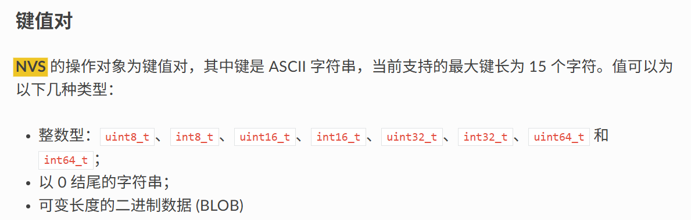

# Non-Volatile Storage (NVS) Read and Write NVS读写

## 粗略阅读README文档

文档简介示例演示如何使用NVS在模块重启之间读写整数值和BLOB（二进制大对象）。同时还展示了操作是否成功的诊断

## 代码分析

### 示例结构体

示例创建了一个结构体以假设较大对象的存储

```c
/* Test data structure to demonstrate different data types in blob */
typedef struct {
    uint8_t id;
    char name[32];
    float values[2];
    uint32_t flags;
    int16_t counts[2];
    bool active;
} test_data_t;
```

### app_main函数

1. 进行NVS初始化，所有NVS操作前完成
2. `ESP_ERR_NVS_NO_FREE_PAGES` 没有空闲页面 `ESP_ERR_NVS_NEW_VERSION_FOUND` 发现NVS分区包含新格式数据
3. `nvs_flash_erase` 擦除NVS分区的所有内容，后重新初始化
4. 调用和函数演示操作，后续单独分析

```c
void app_main(void)
{
    // Initialize NVS
    esp_err_t err = nvs_flash_init();
    if (err == ESP_ERR_NVS_NO_FREE_PAGES || err == ESP_ERR_NVS_NEW_VERSION_FOUND) {
        ESP_ERROR_CHECK(nvs_flash_erase());
        err = nvs_flash_init();
    }
    ESP_ERROR_CHECK(err);

    // Save new test data
    err = save_test_data();
    if (err != ESP_OK) {
        ESP_LOGE(TAG, "Error (%s) saving test data!", esp_err_to_name(err));
    }

    // Save new array data
    err = save_array_data();
    if (err != ESP_OK) {
        ESP_LOGE(TAG, "Error (%s) saving array data!", esp_err_to_name(err));
    }

    // Read updated data
    ESP_LOGI(TAG, "\nReading updated blob data:");
    err = read_stored_blobs();
    if (err != ESP_OK) {
        ESP_LOGE(TAG, "Error (%s) reading updated data!", esp_err_to_name(err));
    }

    ESP_LOGI(TAG, "\nBlob operations completed.");
}
```

### 保存数据

1. 创建nvs指针变量和函数状态变量
2. 测试数据写入
3. `nvs_open` 从默认的NVS分区打开有指定名称`STORAGE_NAMESPACE`的空间，`NVS_READWRITE`代表允许读写，`NVS_READONLY`代表只读，同时返回句柄，后续对该空间操作都依赖句柄
4. `nvs_set_blob` 为给定键`"test_data"`写入可变长度的值，最后一个参数为数据长度
5. `nvs_commit` 将更改写入NVS中
6. `nvs_close` 关闭连接（NVS数据已提交，不受影响）

```c
/* Save test data as a blob in NVS */
esp_err_t save_test_data(void)
{
    nvs_handle_t my_handle;
    esp_err_t err;

    // Create sample test data
    test_data_t test_data = {
        .id = 123,
        .name = "Test Sample",
        .values = {3.14f, 2.718f},
        .flags = 0xABCD1234,
        .counts = {-100, 100},
        .active = true
    };

    // Open NVS handle
    err = nvs_open(STORAGE_NAMESPACE, NVS_READWRITE, &my_handle);
    if (err != ESP_OK) {
        ESP_LOGE(TAG, "Error (%s) opening NVS handle!", esp_err_to_name(err));
        return err;
    }

    // Write blob
    ESP_LOGI(TAG, "Saving test data blob...");
    err = nvs_set_blob(my_handle, "test_data", &test_data, sizeof(test_data_t));
    if (err != ESP_OK) {
        ESP_LOGE(TAG, "Failed to write test data blob!");
        nvs_close(my_handle);
        return err;
    }

    // Commit
    err = nvs_commit(my_handle);
    if (err != ESP_OK) {
        ESP_LOGE(TAG, "Failed to commit data");
    }

    nvs_close(my_handle);
    return err;
}
```

1. 创建函数内变量和打开NVS分区（同一程序的分区名最好一致，读写更方便）
2. 打开指定命名空间的分区（在读写模式下，如果没有该名称的空间会自动新建）
3. `nvs_get_blob` 获取blob类型存储的`"array_data"`数组数据
4. `ESP_ERR_NVS_NOT_FOUND`代表没有该键对应的数据，后续可以自动创建
5. 重新分配更大的数组内存（用于演示，只是增加一个u32类型的值）
6. 获取原数组的所有值，在末尾写入新值
7. `nvs_set_blob`把增添后的数组写入nvs作为`"array_data"`的值
8. `nvs_commit` 提交数据 `nvs_close` 关闭连接

```c
/* Example of storing and appending array data as a blob */ 
/* 示例演示 储存和增加数组数据 作为BLOB */
esp_err_t save_array_data(void)
{
    nvs_handle_t my_handle;
    esp_err_t err;

    // Open
    err = nvs_open(STORAGE_NAMESPACE, NVS_READWRITE, &my_handle);
    if (err != ESP_OK) return err;

    // First, get the size of existing data (if any)
    size_t required_size = 0;
    err = nvs_get_blob(my_handle, "array_data", NULL, &required_size);
    if (err != ESP_OK && err != ESP_ERR_NVS_NOT_FOUND) {
        ESP_LOGE(TAG, "Error (%s) reading array size!", esp_err_to_name(err));
        nvs_close(my_handle);
        return err;
    }

    // Allocate memory and read existing data
    uint32_t* array_data = malloc(required_size + sizeof(uint32_t));
    if (required_size > 0) {
        err = nvs_get_blob(my_handle, "array_data", array_data, &required_size);
        if (err != ESP_OK) {
            ESP_LOGE(TAG, "Error (%s) reading array data!", esp_err_to_name(err));
            free(array_data);
            nvs_close(my_handle);
            return err;
        }
    }

    // Append new value
    required_size += sizeof(uint32_t);
    array_data[required_size / sizeof(uint32_t) - 1] = xTaskGetTickCount() * portTICK_PERIOD_MS;

    // Save updated array
    err = nvs_set_blob(my_handle, "array_data", array_data, required_size);
    if (err != ESP_OK) {
        ESP_LOGE(TAG, "Error (%s) saving array data!", esp_err_to_name(err));
    }

    free(array_data);

    // Commit
    err = nvs_commit(my_handle);
    if (err != ESP_OK) {
        ESP_LOGE(TAG, "Error (%s) committing data!", esp_err_to_name(err));
    }

    nvs_close(my_handle);
    return err;
}
```

### 读取数据

1. `nvs_open`打开命名空间并获取句柄
2. `nvs_get_blob(my_handle, "test_data", &test_data, &test_data_size)`读取二进制值并写入函数变量，由于变量类型为示例结构体，相当于对二进制的值进行解释
3. 打印所有数据
4. `ESP_ERR_NVS_NOT_FOUND`没有数据时的处理
5. 对`array_data` 第一遍读取用`NULL`作为接收，只读出数组数据长度。 第二遍读取获取数据
6. 操作完成后`nvs_close`关闭nvs连接

```c
/* Read and display all saved blobs */
esp_err_t read_stored_blobs(void)
{
    nvs_handle_t my_handle;
    esp_err_t err;

    err = nvs_open(STORAGE_NAMESPACE, NVS_READONLY, &my_handle);
    if (err != ESP_OK) return err;

    // 1. Read test data blob
    ESP_LOGI(TAG, "Reading test data blob:");
    test_data_t test_data;
    size_t test_data_size = sizeof(test_data_t);
    err = nvs_get_blob(my_handle, "test_data", &test_data, &test_data_size);
    if (err == ESP_OK) {
        ESP_LOGI(TAG, "ID: %d", test_data.id);
        ESP_LOGI(TAG, "Name: %s", test_data.name);
        ESP_LOGI(TAG, "Values: %.3f, %.3f, %.3f, %.3f",
                 test_data.values[0], test_data.values[1],
                 test_data.values[2], test_data.values[3]);
        ESP_LOGI(TAG, "Flags: 0x%08" PRIX32, test_data.flags);
        ESP_LOGI(TAG, "Counts: %d, %d", test_data.counts[0], test_data.counts[1]);
        ESP_LOGI(TAG, "Active: %s", test_data.active ? "true" : "false");
    } else if (err == ESP_ERR_NVS_NOT_FOUND) {
        ESP_LOGW(TAG, "Test data not found!");
    }

    // 2. Read array data blob
    ESP_LOGI(TAG, "\nReading array data blob:");
    size_t required_size = 0;
    err = nvs_get_blob(my_handle, "array_data", NULL, &required_size);
    if (err == ESP_OK) {
        uint32_t* array_data = malloc(required_size);
        err = nvs_get_blob(my_handle, "array_data", array_data, &required_size);
        if (err == ESP_OK) {
            for (int i = 0; i < required_size / sizeof(uint32_t); i++) {
                ESP_LOGI(TAG, "Array[%d] = %" PRIu32, i, array_data[i]);
            }
        }
        free(array_data);
    } else if (err == ESP_ERR_NVS_NOT_FOUND) {
        ESP_LOGW(TAG, "Array data not found!");
    }

    nvs_close(my_handle);
    return ESP_OK;
}
```

## 其他

根据官方编程指南[非易失性存储库](https://docs.espressif.com/projects/esp-idf/zh_CN/stable/esp32/api-reference/storage/nvs_flash.html#)，支持下列类型

## 总结

NVS的存入和读取就像一组表，在最开始的初始化后，打开某一张表（没有的话会新建一张表），进行操作，操作完后写入数据，然后把表放回去。
