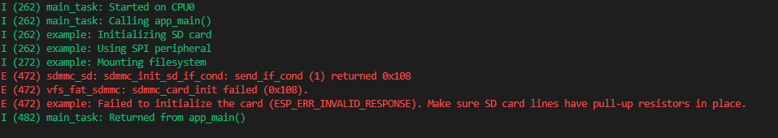
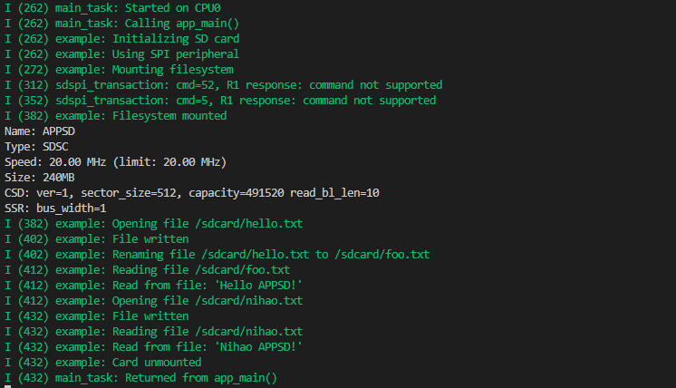

# SD Card example (SDSPI) 以 SDSPI 方式使用 SD 卡

> 笔者注：在使用过程中发现，默认文件名需要遵循8.3格式限制，即基础名8个字符，扩展后缀3个字符，否则会导致文件无法打开，产生报错

## 粗略阅读 README 文档

**警告**：此示例可能会从 SD 卡中删除所有数据（进行格式化操作）。请提前备份

本示例演示了如何用 ESP 通过 SPI 接口控制 SD 卡。
采用一体式函数完成初始化操作，并打印有关卡的信息，创建文件，写入文件，重命名文件，读取文件，可选进行格式化
示例支持 SD（SDSC、SDHC、SDXC）卡

硬件连接和引脚推荐，各型号注意事项

构建烧录和示例输出

可能的问题指导

## 构建、烧录和监视

- 选择 IDF 版本
- 选择烧录方式
- 选择芯片型号（笔者用的是 ESP32C3，自己外接的 SD 卡座）
- 修改 menuconfig（可以用图形界面也可以用命令）
- 点击**构建、烧录和监视**
- 
- 
  前面的系统和编译相关内容就省略了，直接从 main_task 启用开始
  日志提示先进行驱动安装，包括 SD 卡驱动、SPI 外设驱动、文件系统安装
  然后会检测是否有卡插入，两个日志分别是没有卡和插入卡的情况
  最后程序结束

## 代码分析

### 头文件和宏定义

各头文件的具体功能更如下，主要是文件系统操作和 sd/mmc 驱动

```c
#include <string.h>
#include <sys/unistd.h>         // 提供POSIX标准的系统调用接口，比如删除文件，重命名等，用于FAT文件操作系统
#include <sys/stat.h>           // 提供文件状态相关功能，包括文件大小，权限
#include "esp_vfs_fat.h"        // idf提供的fat文件系统与vfs（虚拟文件系统）对接的头文件
#include "sdmmc_cmd.h"          // idf的SD/MMC驱动核心头文件，封装初始化，命令控制，读写等底层功能
#include "sd_test_io.h"         // 测试文件，用于引脚检查功能的函数实现
#if SOC_SDMMC_IO_POWER_EXTERNAL
#include "sd_pwr_ctrl_by_on_chip_ldo.h" // 控制芯片内部LDO给SD卡供电的头文件
#endif
```

宏定义部分其他不进行解释，见下方注释

- `MOUNT_POINT` 定义了一个**路径字符串**，后续读写文件是，实际路径为`/sdcard/文件名.后缀`
- 条件编译中的内容主要是为引脚检查功能进行结构体定义

```c
#define EXAMPLE_MAX_CHAR_SIZE    64  // 最大字节大小

static const char *TAG = "example";  // 日志提示字符

#define MOUNT_POINT "/sdcard"

#ifdef CONFIG_EXAMPLE_DEBUG_PIN_CONNECTIONS
const char* names[] = {"CLK ", "MOSI", "MISO", "CS  "};
const int pins[] = {CONFIG_EXAMPLE_PIN_CLK,
                    CONFIG_EXAMPLE_PIN_MOSI,
                    CONFIG_EXAMPLE_PIN_MISO,
                    CONFIG_EXAMPLE_PIN_CS};

const int pin_count = sizeof(pins)/sizeof(pins[0]);
#if CONFIG_EXAMPLE_ENABLE_ADC_FEATURE
const int adc_channels[] = {CONFIG_EXAMPLE_ADC_PIN_CLK,
                            CONFIG_EXAMPLE_ADC_PIN_MOSI,
                            CONFIG_EXAMPLE_ADC_PIN_MISO,
                            CONFIG_EXAMPLE_ADC_PIN_CS};
#endif //CONFIG_EXAMPLE_ENABLE_ADC_FEATURE

pin_configuration_t config = {
    .names = names,
    .pins = pins,
#if CONFIG_EXAMPLE_ENABLE_ADC_FEATURE
    .adc_channels = adc_channels,
#endif
};
#endif //CONFIG_EXAMPLE_DEBUG_PIN_CONNECTIONS
// SPI通信的相关引脚
// Pin assignments can be set in menuconfig, see "SD SPI Example Configuration" menu.
// You can also change the pin assignments here by changing the following 4 lines.
#define PIN_NUM_MISO  CONFIG_EXAMPLE_PIN_MISO
#define PIN_NUM_MOSI  CONFIG_EXAMPLE_PIN_MOSI
#define PIN_NUM_CLK   CONFIG_EXAMPLE_PIN_CLK
#define PIN_NUM_CS    CONFIG_EXAMPLE_PIN_CS
```

### app_main 函数

1. 新建`esp_vfs_fat_sdmmc_mount_config_t`配置结构体
   - `format_if_mount_failed` 布尔项，为真时会在 FAT 文件系统未安装时进行格式化
   - `max_files` 最多同时打开文件数
   - `allocation_unit_size` 格式化时文件分配单元大小，以字节为单位，必须是 512 的整数倍（_单元越大读写更快，但容易浪费空间，一个很小的文件也需要占一个单元，常用 4096_）
   - `disk_status_check_enable` 布尔值，是否启动 SD 卡状态检测
   - `use_one_fat` 布尔值，格式化时只用一个 FAT 表，会导致这个表损坏无法恢复文件
2. 新建`sdmmc_card_t*`类型变量
3. 读取宏定义的字符串到函数内变量
4. 日志打印，提示开始初始化
5. 使用`SDSPI_HOST_DEFAULT`宏函数进行`sdmmc`主机结构体的默认配置
6. 有关使用内部 LDO 供电的配置
   1. 配置内部 LDO 通道，特定引脚对应特定 IO
   2. `sd_pwr_ctrl_new_on_chip_ldo`调用函数，初始化内部 LDO 并给出控制句柄
   3. 检查是否成功
   4. `host.pwr_ctrl_handle = pwr_ctrl_handle`将句柄绑定到 sdmmc 主机控制结构体，后续会自动控制
7. 初始化 SPI 总线，包括分配引脚和安装总线，使用的**SPI 号和 sdmmc 要一致**
8. `SDSPI_DEVICE_CONFIG_DEFAULT`宏函数初始化 sdspi 的设备结构体
9. 单独对`host_id`和`gpio_cs`，即 SPI 号和片选引脚进行配置（其他如果卡支持，可以配置，基本不需要）
10. `esp_vfs_fat_sdspi_mount(mount_point, &host, &slot_config, &mount_config, &card)` 传入路径字符，主机结构体句柄，设备结构体配置，最前面的安装结构体，输出`sdmmc_card_t`类型的 card 句柄（**此时路径字符已被注册到VFS,后续的文件操作自动转发给FAT驱动，不需要传卡句柄**）
11. 判断是否成功，如果失败，进行引脚检查，从而分辨是卡的问题还是硬件连接问题
12. `sdmmc_card_print_info(stdout, card)` 把 sd 卡的详细信息打印到串口
13. 创建并写入"hello.txt"
    1. 构造文件路径
    2. 格式化字符串，写入字符数组
    3. 调用自定义函数`s_example_write_file`把字符写入文件
14. 重命名文件
    1. 新建文件路径（C语言支持字符串字面量自动拼接）
    2. 新建`struct stat`类型变量，是 POSIX 标准中用于描述文件状态的结构体，包含各种文件信息
    3. `stat`函数获取指定路径文件信息并存入结构体，返回0代表成功，-1代表失败
    4. 如果成功，即文件存在，`unlink(文件路径)`删除文件（*在很多嵌入式 FAT 实现（包括 ESP-IDF 使用的 FatFs）中，rename() 不允许覆盖已存在的目标文件*）
    5. 日志提示文件名变换，`rename`函数传入原来文件路径和现在文件路径进行重命名（**完整路径**）
15. 条件编译启用格式化，`esp_vfs_fat_sdcard_format`传入挂载点路径，卡句柄。格式化整张卡，这里挂载点只是用于识别sd卡的标识
16. 再次进行写入和读取数据尝试
17. `esp_vfs_fat_sdcard_unmount(mount_point, card)`卸载卡，释放句柄
18. `spi_bus_free(host.slot);` 释放SPI总线
19. 如果启用了，删除内部LDO的控制

```c
void app_main(void)
{
    esp_err_t ret;

    // Options for mounting the filesystem.
    // If format_if_mount_failed is set to true, SD card will be partitioned and
    // formatted in case when mounting fails.
    esp_vfs_fat_sdmmc_mount_config_t mount_config = {
#ifdef CONFIG_EXAMPLE_FORMAT_IF_MOUNT_FAILED
        .format_if_mount_failed = true,
#else
        .format_if_mount_failed = false,
#endif // EXAMPLE_FORMAT_IF_MOUNT_FAILED
        .max_files = 5,
        .allocation_unit_size = 16 * 1024
    };
    sdmmc_card_t *card;
    const char mount_point[] = MOUNT_POINT;
    ESP_LOGI(TAG, "Initializing SD card");

    // Use settings defined above to initialize SD card and mount FAT filesystem.
    // Note: esp_vfs_fat_sdmmc/sdspi_mount is all-in-one convenience functions.
    // Please check its source code and implement error recovery when developing
    // production applications.
    ESP_LOGI(TAG, "Using SPI peripheral");

    // By default, SD card frequency is initialized to SDMMC_FREQ_DEFAULT (20MHz)
    // For setting a specific frequency, use host.max_freq_khz (range 400kHz - 20MHz for SDSPI)
    // Example: for fixed frequency of 10MHz, use host.max_freq_khz = 10000;
    sdmmc_host_t host = SDSPI_HOST_DEFAULT();

    // For SoCs where the SD power can be supplied both via an internal or external (e.g. on-board LDO) power supply.
    // When using specific IO pins (which can be used for ultra high-speed SDMMC) to connect to the SD card
    // and the internal LDO power supply, we need to initialize the power supply first.
#if CONFIG_EXAMPLE_SD_PWR_CTRL_LDO_INTERNAL_IO
    sd_pwr_ctrl_ldo_config_t ldo_config = {
        .ldo_chan_id = CONFIG_EXAMPLE_SD_PWR_CTRL_LDO_IO_ID,
    };
    sd_pwr_ctrl_handle_t pwr_ctrl_handle = NULL;

    ret = sd_pwr_ctrl_new_on_chip_ldo(&ldo_config, &pwr_ctrl_handle);
    if (ret != ESP_OK) {
        ESP_LOGE(TAG, "Failed to create a new on-chip LDO power control driver");
        return;
    }
    host.pwr_ctrl_handle = pwr_ctrl_handle;
#endif

    spi_bus_config_t bus_cfg = {
        .mosi_io_num = PIN_NUM_MOSI,
        .miso_io_num = PIN_NUM_MISO,
        .sclk_io_num = PIN_NUM_CLK,
        .quadwp_io_num = -1,
        .quadhd_io_num = -1,
        .max_transfer_sz = 4000,
    };

    ret = spi_bus_initialize(host.slot, &bus_cfg, SDSPI_DEFAULT_DMA);
    if (ret != ESP_OK) {
        ESP_LOGE(TAG, "Failed to initialize bus.");
        return;
    }

    // This initializes the slot without card detect (CD) and write protect (WP) signals.
    // Modify slot_config.gpio_cd and slot_config.gpio_wp if your board has these signals.
    sdspi_device_config_t slot_config = SDSPI_DEVICE_CONFIG_DEFAULT();
    slot_config.gpio_cs = PIN_NUM_CS;
    slot_config.host_id = host.slot;

    ESP_LOGI(TAG, "Mounting filesystem");
    ret = esp_vfs_fat_sdspi_mount(mount_point, &host, &slot_config, &mount_config, &card);

    if (ret != ESP_OK) {
        if (ret == ESP_FAIL) {
            ESP_LOGE(TAG, "Failed to mount filesystem. "
                     "If you want the card to be formatted, set the CONFIG_EXAMPLE_FORMAT_IF_MOUNT_FAILED menuconfig option.");
        } else {
            ESP_LOGE(TAG, "Failed to initialize the card (%s). "
                     "Make sure SD card lines have pull-up resistors in place.", esp_err_to_name(ret));
#ifdef CONFIG_EXAMPLE_DEBUG_PIN_CONNECTIONS
            check_sd_card_pins(&config, pin_count);
#endif
        }
        return;
    }
    ESP_LOGI(TAG, "Filesystem mounted");

    // Card has been initialized, print its properties
    sdmmc_card_print_info(stdout, card);

    // Use POSIX and C standard library functions to work with files.

    // First create a file.
    const char *file_hello = MOUNT_POINT"/hello.txt";
    char data[EXAMPLE_MAX_CHAR_SIZE];
    snprintf(data, EXAMPLE_MAX_CHAR_SIZE, "%s %s!\n", "Hello", card->cid.name);
    ret = s_example_write_file(file_hello, data);
    if (ret != ESP_OK) {
        return;
    }

    const char *file_foo = MOUNT_POINT"/foo.txt";

    // Check if destination file exists before renaming
    struct stat st;
    if (stat(file_foo, &st) == 0) {
        // Delete it if it exists
        unlink(file_foo);
    }

    // Rename original file
    ESP_LOGI(TAG, "Renaming file %s to %s", file_hello, file_foo);
    if (rename(file_hello, file_foo) != 0) {
        ESP_LOGE(TAG, "Rename failed");
        return;
    }

    ret = s_example_read_file(file_foo);
    if (ret != ESP_OK) {
        return;
    }

    // Format FATFS
#ifdef CONFIG_EXAMPLE_FORMAT_SD_CARD
    ret = esp_vfs_fat_sdcard_format(mount_point, card);
    if (ret != ESP_OK) {
        ESP_LOGE(TAG, "Failed to format FATFS (%s)", esp_err_to_name(ret));
        return;
    }

    if (stat(file_foo, &st) == 0) {
        ESP_LOGI(TAG, "file still exists");
        return;
    } else {
        ESP_LOGI(TAG, "file doesn't exist, formatting done");
    }
#endif // CONFIG_EXAMPLE_FORMAT_SD_CARD

    const char *file_nihao = MOUNT_POINT"/nihao.txt";
    memset(data, 0, EXAMPLE_MAX_CHAR_SIZE);
    snprintf(data, EXAMPLE_MAX_CHAR_SIZE, "%s %s!\n", "Nihao", card->cid.name);
    ret = s_example_write_file(file_nihao, data);
    if (ret != ESP_OK) {
        return;
    }

    //Open file for reading
    ret = s_example_read_file(file_nihao);
    if (ret != ESP_OK) {
        return;
    }

    // All done, unmount partition and disable SPI peripheral
    esp_vfs_fat_sdcard_unmount(mount_point, card);
    ESP_LOGI(TAG, "Card unmounted");

    //deinitialize the bus after all devices are removed
    spi_bus_free(host.slot);

    // Deinitialize the power control driver if it was used
#if CONFIG_EXAMPLE_SD_PWR_CTRL_LDO_INTERNAL_IO
    ret = sd_pwr_ctrl_del_on_chip_ldo(pwr_ctrl_handle);
    if (ret != ESP_OK) {
        ESP_LOGE(TAG, "Failed to delete the on-chip LDO power control driver");
        return;
    }
#endif
}
```

### 自定义读取和写入函数

写函数，核心是字符操作

1. `fopen`打开文件，指针指向文件开头
2. 把字符数据写入文件内
3. 关闭文件，**必须调用**

```c
static esp_err_t s_example_write_file(const char *path, char *data)
{
    ESP_LOGI(TAG, "Opening file %s", path);
    FILE *f = fopen(path, "w");
    if (f == NULL) {
        ESP_LOGE(TAG, "Failed to open file for writing");
        return ESP_FAIL;
    }
    fprintf(f, data);
    fclose(f);
    ESP_LOGI(TAG, "File written");

    return ESP_OK;
}
```

读函数，核心也是字符处理

1. 打开文件，指针指向文件开头
2. 创建缓存变量
3. 从文件中读取最多sizeof(line)-1的字符，存入line
   * 读到 \n 会停止
   * 会保留读到的换行符 \n（如果该行以 \n 结尾）
   * 自动在末尾添加字符串结束符 \0
   * 如果文件内容不足一行或到达 EOF，也能正确处理
4. 关闭文件，释放缓存数据并释放资源
5. `char *pos = strchr(line, '\n')`查找第一个`\n`的位置，返回指针
6. 找到后替换为`\0`，代表字符串结束，方便后续显示

```c
static esp_err_t s_example_read_file(const char *path)
{
    ESP_LOGI(TAG, "Reading file %s", path);
    FILE *f = fopen(path, "r");
    if (f == NULL) {
        ESP_LOGE(TAG, "Failed to open file for reading");
        return ESP_FAIL;
    }
    char line[EXAMPLE_MAX_CHAR_SIZE];
    fgets(line, sizeof(line), f);
    fclose(f);

    // strip newline
    char *pos = strchr(line, '\n');
    if (pos) {
        *pos = '\0';
    }
    ESP_LOGI(TAG, "Read from file: '%s'", line);

    return ESP_OK;
}
```

## 总结

在该例程中，采用idf封装好的esp_vfs_fat_sdspi_mount方便快速地进行sd卡中的文件操作。关于sd卡，采用FAT文件系统，类似电脑插U盘，或者外接机械硬盘，SSD都差不多，会有个**盘符**，代表盘的身份，这里也一样，只是可能`"/sdcard"`这个名称容易理解成一个文件夹，但实际它就是最上层的包。

有关文件操作的部分，实际的文件操作就可以看作是非常长的字符数据处理，通过一定的算法和约定可以存储各种各样的数据。总之，通过sd卡存储嵌入式系统过程中产生的数据，是非常好的一种选择
