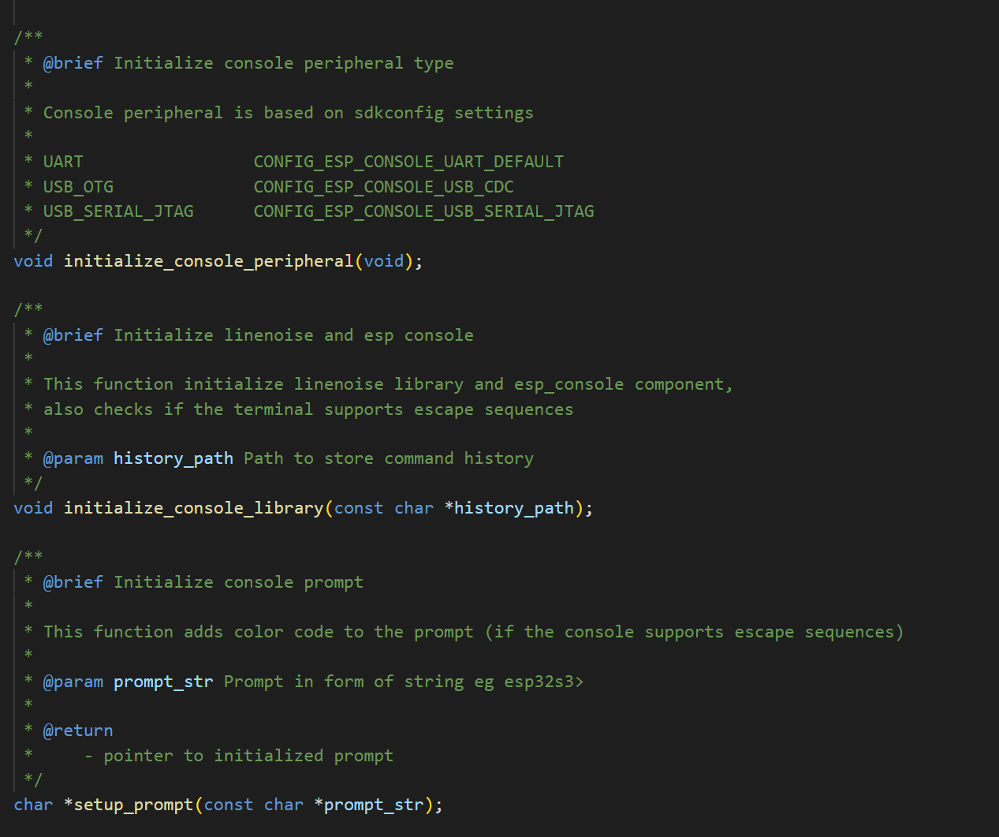
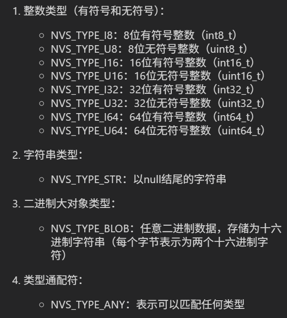
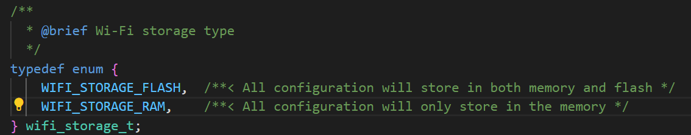
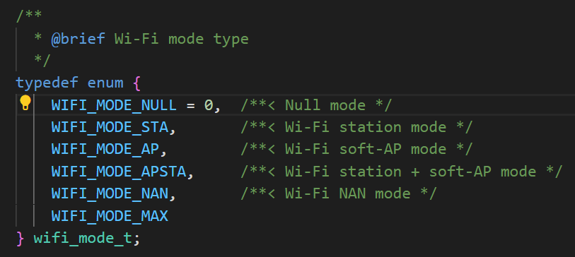
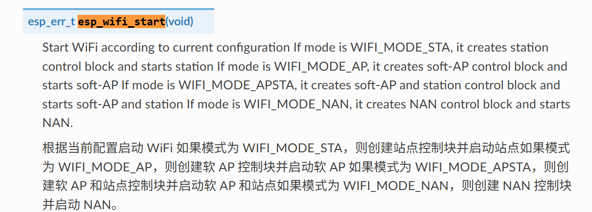
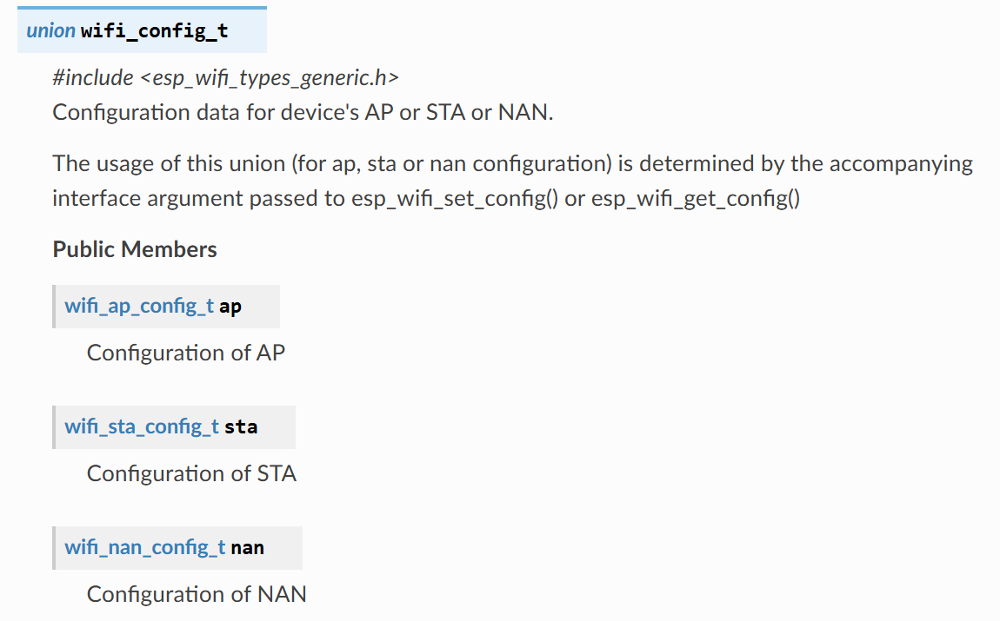

# Console 控制台

## 粗略阅读README文档

文档简介示例演示如何使用console组件在ESP芯片上创建交互控制台

如何使用USB、UART等工具

配置项目，构建和烧录，示例输出

故障排除（由于笔者对控制台不太熟悉，所以对故障的原理和排查，不作分析）

## 代码分析

> 监视窗口的使用和示例输出挖坑，以后再说

### part-main

#### main-头文件

头文件的具体作用见下方注释。主要意义在于把组件的具体实现放在其他文件中，main中只进行功能逻辑实现。有了解即可

```c
#include <stdio.h>
#include <string.h>
#include <unistd.h>                 // POSIX标准API，进行文件操作
#include "esp_system.h"             // ESP32系统接口，进行重启、复位、等
#include "esp_log.h"
#include "esp_console.h"            // ESP32控制台组件的核心头文件，提供REPL功能
#include "linenoise/linenoise.h"    // 轻量级命令行编辑库
#include "argtable3/argtable3.h"    // 命令行参数解析库，支持结构化参数解析
#include "esp_vfs_fat.h"            // FAT文件系统和VFS的集成，支持SD卡等存储设备的文件操作
#include "nvs.h"                    // 非易失性存储（NVS）接口，用于存储键值对数据
#include "nvs_flash.h"              // NVS的底层Flash存储实现，管理NVS在Flash中的存储
#include "soc/soc_caps.h"           // SOC能力定义头文件，定义芯片特定功能支持宏
#include "cmd_system.h"             // 系统相关命令实现
#include "cmd_wifi.h"               // WiFi相关命令实现
#include "cmd_nvs.h"                // NVS相关命令实现
#include "console_settings.h"       // 控制台设置头文件导入

// console_settings.c
#include <fcntl.h>                  // POSIX文件控制
#include "driver/uart_vfs.h"        // UART虚拟文件系统驱动
#include "driver/uart.h"            // UART驱动API
#include "driver/usb_serial_jtag.h" // USB串口/JTAG驱动
#include "driver/usb_serial_jtag_vfs.h"// USB串口/JTAG虚拟文件系统驱动
#include "esp_vfs_cdcacm.h"         // USB CDC-ACM虚拟文件系统驱动
```

#### app_main函数

1. 如果启用历史记录配置就调用自定义函数进行文件配置初始化,函数分析见[文件初始化配置](../basic/basic.md/#头文件和宏定义)
2. 自定义函数进行控制台外设、控制台历史记录初始化
3. `setup_prompt` 自定义函数，设置控制台提示
4. `esp_console_register_help_command`函数注册help命令到已注册命令列表
5. `register_system_common`函数注册系统常用功能
6. 如果启用配置，进行轻度睡眠和深度睡眠模式注册
7. WiFi命令注册和NVS命令注册
8. `linenoiseIsDumbMode`判断当前模式是否为*DumbMode* (“是”，提示中会显示*终端应用程序不支持转义序列，行编辑和历史记录功能禁用，windows中请尝试使用终端*)
9. 在**主循环**中，`linenoise`获取输入的一行
10. 如果启用了忽略空行，就继续，否则退出循环
11. 如果不是空行，调用函数`linenoiseHistoryAdd`添加到历史记录中
12. 如果启用了历史记录保持，`linenoiseHistorySave`函数将历史记录保存到本地
13. `esp_console_run`函数尝试启用控制台，并根据不同的状态进行不同的日志打印(`esp_err_to_name`函数将错误码转换成设置的字符描述)
14. `linenoiseFree`释放内存
15. `esp_console_deinit` 退出循环后调用函数进行反初始化

```c
void app_main(void)
{
    initialize_nvs();

#if CONFIG_CONSOLE_STORE_HISTORY
    initialize_filesystem();
    ESP_LOGI(TAG, "Command history enabled");
#else
    ESP_LOGI(TAG, "Command history disabled");
#endif

    /* Initialize console output periheral (UART, USB_OTG, USB_JTAG) */
    initialize_console_peripheral();

    /* Initialize linenoise library and esp_console*/
    initialize_console_library(HISTORY_PATH);

    /* Prompt to be printed before each line.
     * This can be customized, made dynamic, etc.
     */
    const char *prompt = setup_prompt(PROMPT_STR ">");

    /* Register commands */
    esp_console_register_help_command();
    register_system_common();
#if SOC_LIGHT_SLEEP_SUPPORTED
    register_system_light_sleep();
#endif
#if SOC_DEEP_SLEEP_SUPPORTED
    register_system_deep_sleep();
#endif
#if (CONFIG_ESP_WIFI_ENABLED || CONFIG_ESP_HOST_WIFI_ENABLED)
    register_wifi();
#endif
    register_nvs();

    printf("\n"
           "This is an example of ESP-IDF console component.\n"
           "Type 'help' to get the list of commands.\n"
           "Use UP/DOWN arrows to navigate through command history.\n"
           "Press TAB when typing command name to auto-complete.\n"
           "Ctrl+C will terminate the console environment.\n");

    if (linenoiseIsDumbMode()) {
        printf("\n"
               "Your terminal application does not support escape sequences.\n"
               "Line editing and history features are disabled.\n"
               "On Windows, try using Windows Terminal or Putty instead.\n");
    }

    /* Main loop */
    while(true) {
        /* Get a line using linenoise.
         * The line is returned when ENTER is pressed.
         */
        char* line = linenoise(prompt);

#if CONFIG_CONSOLE_IGNORE_EMPTY_LINES
        if (line == NULL) { /* Ignore empty lines */
            continue;;
        }
#else
        if (line == NULL) { /* Break on EOF or error */
            break;
        }
#endif // CONFIG_CONSOLE_IGNORE_EMPTY_LINES

        /* Add the command to the history if not empty*/
        if (strlen(line) > 0) {
            linenoiseHistoryAdd(line);
#if CONFIG_CONSOLE_STORE_HISTORY
            /* Save command history to filesystem */
            linenoiseHistorySave(HISTORY_PATH);
#endif // CONFIG_CONSOLE_STORE_HISTORY
        }

        /* Try to run the command */
        int ret;
        esp_err_t err = esp_console_run(line, &ret);
        if (err == ESP_ERR_NOT_FOUND) {
            printf("Unrecognized command\n");
        } else if (err == ESP_ERR_INVALID_ARG) {
            // command was empty
        } else if (err == ESP_OK && ret != ESP_OK) {
            printf("Command returned non-zero error code: 0x%x (%s)\n", ret, esp_err_to_name(ret));
        } else if (err != ESP_OK) {
            printf("Internal error: %s\n", esp_err_to_name(err));
        }
        /* linenoise allocates line buffer on the heap, so need to free it */
        linenoiseFree(line);
    }

    ESP_LOGE(TAG, "Error or end-of-input, terminating console");
    esp_console_deinit();
}
```

#### console_settings

头文件中对函数进行定义和说明


`initialize_console_peripheral`控制台外设配置函数

1. `fflush`刷新标准输出流的缓冲区
2. `fsync(fileno(stdout))`强制将文件描述符关联的数据同步到物理设备。`fileno`获取文件描述符 `fsync` 强制将缓冲数据写入硬件
3. 上述双重刷新机制清空缓冲
4. `uart_vfs_dev_port_set_rx_line_endings` 设置当回车符按下时，接收到的是`ESP_LINE_ENDINGS_CR`(大概率是'\r')
5. `uart_vfs_dev_port_set_tx_line_endings` 设置ESP控制台换行时，发送`ESP_LINE_ENDINGS_CRLF`(应该是'\r\n')
6. `uart_config_t` uart结构体配置
   * `baud_rate`波特率
   * `data_bits` 数据位数
   * `parity` 奇偶校验模式
   * `stop_bits` 停止位
   * `source_clk` 时钟源
7. `uart_driver_install` 函数安装驱动程序
8. `uart_param_config` 配置通信参数
9. `uart_vfs_dev_use_driver` 将 VFS 设置为使用 UART 驱动程序进行阅读和写入
10. `fcntl(fileno(stdout), F_SETFL, 0);``fcntl(fileno(stdin), F_SETFL, 0);` 用于将标准输出和标准输入设置为阻塞模式（*当使用USB CDC或USB Serial/JTAG作为控制台接口时，这两行确保I/O操作是阻塞的*）
11. `setvbuf(stdin, NULL, _IONBF, 0);`禁用标准输入的缓冲区，输入的字符立刻被读取。


```c
void initialize_console_peripheral(void)
{
    /* Drain stdout before reconfiguring it */
    fflush(stdout);
    fsync(fileno(stdout));

#if defined(CONFIG_ESP_CONSOLE_UART_DEFAULT) || defined(CONFIG_ESP_CONSOLE_UART_CUSTOM)
    /* Minicom, screen, idf_monitor send CR when ENTER key is pressed */
    uart_vfs_dev_port_set_rx_line_endings(CONFIG_ESP_CONSOLE_UART_NUM, ESP_LINE_ENDINGS_CR);
    /* Move the caret to the beginning of the next line on '\n' */
    uart_vfs_dev_port_set_tx_line_endings(CONFIG_ESP_CONSOLE_UART_NUM, ESP_LINE_ENDINGS_CRLF);

    /* Configure UART. Note that REF_TICK is used so that the baud rate remains
     * correct while APB frequency is changing in light sleep mode.
     */
    const uart_config_t uart_config = {
            .baud_rate = CONFIG_ESP_CONSOLE_UART_BAUDRATE,
            .data_bits = UART_DATA_8_BITS,
            .parity = UART_PARITY_DISABLE,
            .stop_bits = UART_STOP_BITS_1,
#if SOC_UART_SUPPORT_REF_TICK
            .source_clk = UART_SCLK_REF_TICK,
#elif SOC_UART_SUPPORT_XTAL_CLK
            .source_clk = UART_SCLK_XTAL,
#endif
    };
    /* Install UART driver for interrupt-driven reads and writes */
    ESP_ERROR_CHECK( uart_driver_install(CONFIG_ESP_CONSOLE_UART_NUM, 256, 0, 0, NULL, 0) );
    ESP_ERROR_CHECK( uart_param_config(CONFIG_ESP_CONSOLE_UART_NUM, &uart_config) );

    /* Tell VFS to use UART driver */
    uart_vfs_dev_use_driver(CONFIG_ESP_CONSOLE_UART_NUM);

#elif defined(CONFIG_ESP_CONSOLE_USB_CDC)
    /* Minicom, screen, idf_monitor send CR when ENTER key is pressed */
    esp_vfs_dev_cdcacm_set_rx_line_endings(ESP_LINE_ENDINGS_CR);
    /* Move the caret to the beginning of the next line on '\n' */
    esp_vfs_dev_cdcacm_set_tx_line_endings(ESP_LINE_ENDINGS_CRLF);

    /* Enable blocking mode on stdin and stdout */
    fcntl(fileno(stdout), F_SETFL, 0);
    fcntl(fileno(stdin), F_SETFL, 0);

#elif defined(CONFIG_ESP_CONSOLE_USB_SERIAL_JTAG)
    /* Minicom, screen, idf_monitor send CR when ENTER key is pressed */
    usb_serial_jtag_vfs_set_rx_line_endings(ESP_LINE_ENDINGS_CR);
    /* Move the caret to the beginning of the next line on '\n' */
    usb_serial_jtag_vfs_set_tx_line_endings(ESP_LINE_ENDINGS_CRLF);

    /* Enable blocking mode on stdin and stdout */
    fcntl(fileno(stdout), F_SETFL, 0);
    fcntl(fileno(stdin), F_SETFL, 0);

    usb_serial_jtag_driver_config_t jtag_config = {
        .tx_buffer_size = 256,
        .rx_buffer_size = 256,
    };

    /* Install USB-SERIAL-JTAG driver for interrupt-driven reads and writes */
    ESP_ERROR_CHECK( usb_serial_jtag_driver_install(&jtag_config));

    /* Tell vfs to use usb-serial-jtag driver */
    usb_serial_jtag_vfs_use_driver();

#else
#error Unsupported console type
#endif

    /* Disable buffering on stdin */
    setvbuf(stdin, NULL, _IONBF, 0);
}
```

> 后续part的头文件都只进行了函数的声明，不作赘述

### part-nvs

#### nvs相关变量

`type_str_pair_t`结构体把库内部`nvs_type_t`类型变量和`str`字符串进行绑定，储存在`type_str_pair`数组中

1. `arg_str` 命令行参数解析 包括 头结构，匹配的命令行参数，解析的参数数组
2. `arg_end` 命令行参数解析 包括 头结构，遇到的错误数，错误代码数组，指向问题arg_xxx结构的指针数组，指向问题字符串的指针数组
3. 设置了多个结构体（*由于笔者没怎么配置过NVS，看不明白，挖坑待后填*）

```c
typedef struct {
    nvs_type_t type;
    const char *str;
} type_str_pair_t;

static const type_str_pair_t type_str_pair[] = {
    { NVS_TYPE_I8, "i8" },
    { NVS_TYPE_U8, "u8" },
    { NVS_TYPE_U16, "u16" },
    { NVS_TYPE_I16, "i16" },
    { NVS_TYPE_U32, "u32" },
    { NVS_TYPE_I32, "i32" },
    { NVS_TYPE_U64, "u64" },
    { NVS_TYPE_I64, "i64" },
    { NVS_TYPE_STR, "str" },
    { NVS_TYPE_BLOB, "blob" },
    { NVS_TYPE_ANY, "any" },
};

static const size_t TYPE_STR_PAIR_SIZE = sizeof(type_str_pair) / sizeof(type_str_pair[0]);
static const char *ARG_TYPE_STR = "type can be: i8, u8, i16, u16 i32, u32 i64, u64, str, blob";
static char current_namespace[16] = "storage";
static const char *TAG = "cmd_nvs";

static struct {
    struct arg_str *key;
    struct arg_str *type;
    struct arg_str *value;
    struct arg_end *end;
} set_args;

static struct {
    struct arg_str *key;
    struct arg_str *type;
    struct arg_end *end;
} get_args;

static struct {
    struct arg_str *key;
    struct arg_end *end;
} erase_args;

static struct {
    struct arg_str *namespace;
    struct arg_end *end;
} erase_all_args;

static struct {
    struct arg_str *namespace;
    struct arg_end *end;
} namespace_args;

static struct {
    struct arg_str *partition;
    struct arg_str *namespace;
    struct arg_str *type;
    struct arg_end *end;
} list_args;
```

#### nvs相关函数

下方两函数是NVS类型和字符串相互转换，即在循环中进行比较，满足的输出

```c
static nvs_type_t str_to_type(const char *type)
{
    for (int i = 0; i < TYPE_STR_PAIR_SIZE; i++) {
        const type_str_pair_t *p = &type_str_pair[i];
        if (strcmp(type, p->str) == 0) {
            return  p->type;
        }
    }

    return NVS_TYPE_ANY;
}

static const char *type_to_str(nvs_type_t type)
{
    for (int i = 0; i < TYPE_STR_PAIR_SIZE; i++) {
        const type_str_pair_t *p = &type_str_pair[i];
        if (p->type == type) {
            return  p->str;
        }
    }

    return "Unknown";
}
```

BLOB(Binary Large Object)数据是以十六进制字符串形式存储的二进制数据，因此长度必须是偶数。

NVS是ESP-IDF中用于Flash存储设备上存储键值对的非易失性存储系统。

1. 对所有的字符，将其通过ASCII码进行重新排序，0-9，A-F，a-f（大小写的A和a占用同一位置）
2. 设置BLOB并释放空间
3. `nvs_commit` 将任何挂起的更改写入非易失性存储。

输出BOLB

```c
static esp_err_t store_blob(nvs_handle_t nvs, const char *key, const char *str_values)
{
    uint8_t value;
    size_t str_len = strlen(str_values);
    size_t blob_len = str_len / 2;

    if (str_len % 2) {
        ESP_LOGE(TAG, "Blob data must contain even number of characters");
        return ESP_ERR_NVS_TYPE_MISMATCH;
    }

    char *blob = (char *)malloc(blob_len);
    if (blob == NULL) {
        return ESP_ERR_NO_MEM;
    }

    for (int i = 0, j = 0; i < str_len; i++) {
        char ch = str_values[i];
        if (ch >= '0' && ch <= '9') {
            value = ch - '0';
        } else if (ch >= 'A' && ch <= 'F') {
            value = ch - 'A' + 10;
        } else if (ch >= 'a' && ch <= 'f') {
            value = ch - 'a' + 10;
        } else {
            ESP_LOGE(TAG, "Blob data contain invalid character");
            free(blob);
            return ESP_ERR_NVS_TYPE_MISMATCH;
        }

        if (i & 1) {
            blob[j++] += value;
        } else {
            blob[j] = value << 4;
        }
    }

    esp_err_t err = nvs_set_blob(nvs, key, blob, blob_len);
    free(blob);

    if (err == ESP_OK) {
        err = nvs_commit(nvs);
    }

    return err;
}

static void print_blob(const char *blob, size_t len)
{
    for (int i = 0; i < len; i++) {
        printf("%02x", blob[i]);
    }
    printf("\n");
}
```

`set_value_in_nvs` 向NVS写入值

1. 将字符串转换成NVS类型
2. 未定义类型日志打印无法识别
3. `nvs_open`API选择使用带有NVS标签的分区
4. `strtol`将字符串转换成长整数`strtoul`将字符串转换成无符号长整数
5. 根据不同类型进判断，不符合就报错，符合采用`nvs_set_xx`函数进行写入
6. STR和BLOB类型直接写入
7. `nvs_commit` 将挂起的更改写入NVS
8. `nvs_close`关闭储存句柄并释放已分配资源

`get_value_from_nvs` 从NVS获取值，基本操作和上函数相反

```c
static esp_err_t set_value_in_nvs(const char *key, const char *str_type, const char *str_value)
{
    esp_err_t err;
    nvs_handle_t nvs;
    bool range_error = false;

    nvs_type_t type = str_to_type(str_type);

    if (type == NVS_TYPE_ANY) {
        ESP_LOGE(TAG, "Type '%s' is undefined", str_type);
        return ESP_ERR_NVS_TYPE_MISMATCH;
    }

    err = nvs_open(current_namespace, NVS_READWRITE, &nvs);
    if (err != ESP_OK) {
        return err;
    }

    if (type == NVS_TYPE_I8) {
        int32_t value = strtol(str_value, NULL, 0);
        if (value < INT8_MIN || value > INT8_MAX || errno == ERANGE) {
            range_error = true;
        } else {
            err = nvs_set_i8(nvs, key, (int8_t)value);
        }
    } else if (type == NVS_TYPE_U8) {
        uint32_t value = strtoul(str_value, NULL, 0);
        if (value > UINT8_MAX || errno == ERANGE) {
            range_error = true;
        } else {
            err = nvs_set_u8(nvs, key, (uint8_t)value);
        }
    } else if (type == NVS_TYPE_I16) {
        int32_t value = strtol(str_value, NULL, 0);
        if (value < INT16_MIN || value > INT16_MAX || errno == ERANGE) {
            range_error = true;
        } else {
            err = nvs_set_i16(nvs, key, (int16_t)value);
        }
    } else if (type == NVS_TYPE_U16) {
        uint32_t value = strtoul(str_value, NULL, 0);
        if (value > UINT16_MAX || errno == ERANGE) {
            range_error = true;
        } else {
            err = nvs_set_u16(nvs, key, (uint16_t)value);
        }
    } else if (type == NVS_TYPE_I32) {
        int32_t value = strtol(str_value, NULL, 0);
        if (errno != ERANGE) {
            err = nvs_set_i32(nvs, key, value);
        }
    } else if (type == NVS_TYPE_U32) {
        uint32_t value = strtoul(str_value, NULL, 0);
        if (errno != ERANGE) {
            err = nvs_set_u32(nvs, key, value);
        }
    } else if (type == NVS_TYPE_I64) {
        int64_t value = strtoll(str_value, NULL, 0);
        if (errno != ERANGE) {
            err = nvs_set_i64(nvs, key, value);
        }
    } else if (type == NVS_TYPE_U64) {
        uint64_t value = strtoull(str_value, NULL, 0);
        if (errno != ERANGE) {
            err = nvs_set_u64(nvs, key, value);
        }
    } else if (type == NVS_TYPE_STR) {
        err = nvs_set_str(nvs, key, str_value);
    } else if (type == NVS_TYPE_BLOB) {
        err = store_blob(nvs, key, str_value);
    }

    if (range_error || errno == ERANGE) {
        nvs_close(nvs);
        return ESP_ERR_NVS_VALUE_TOO_LONG;
    }

    if (err == ESP_OK) {
        err = nvs_commit(nvs);
        if (err == ESP_OK) {
            ESP_LOGI(TAG, "Value stored under key '%s'", key);
        }
    }

    nvs_close(nvs);
    return err;
}

static esp_err_t get_value_from_nvs(const char *key, const char *str_type)
{
    nvs_handle_t nvs;
    esp_err_t err;

    nvs_type_t type = str_to_type(str_type);

    if (type == NVS_TYPE_ANY) {
        ESP_LOGE(TAG, "Type '%s' is undefined", str_type);
        return ESP_ERR_NVS_TYPE_MISMATCH;
    }

    err = nvs_open(current_namespace, NVS_READONLY, &nvs);
    if (err != ESP_OK) {
        return err;
    }

    if (type == NVS_TYPE_I8) {
        int8_t value;
        err = nvs_get_i8(nvs, key, &value);
        if (err == ESP_OK) {
            printf("%d\n", value);
        }
    } else if (type == NVS_TYPE_U8) {
        uint8_t value;
        err = nvs_get_u8(nvs, key, &value);
        if (err == ESP_OK) {
            printf("%u\n", value);
        }
    } else if (type == NVS_TYPE_I16) {
        int16_t value;
        err = nvs_get_i16(nvs, key, &value);
        if (err == ESP_OK) {
            printf("%u\n", value);
        }
    } else if (type == NVS_TYPE_U16) {
        uint16_t value;
        if ((err = nvs_get_u16(nvs, key, &value)) == ESP_OK) {
            printf("%u\n", value);
        }
    } else if (type == NVS_TYPE_I32) {
        int32_t value;
        if ((err = nvs_get_i32(nvs, key, &value)) == ESP_OK) {
            printf("%"PRIi32"\n", value);
        }
    } else if (type == NVS_TYPE_U32) {
        uint32_t value;
        if ((err = nvs_get_u32(nvs, key, &value)) == ESP_OK) {
            printf("%"PRIu32"\n", value);
        }
    } else if (type == NVS_TYPE_I64) {
        int64_t value;
        if ((err = nvs_get_i64(nvs, key, &value)) == ESP_OK) {
            printf("%lld\n", value);
        }
    } else if (type == NVS_TYPE_U64) {
        uint64_t value;
        if ( (err = nvs_get_u64(nvs, key, &value)) == ESP_OK) {
            printf("%llu\n", value);
        }
    } else if (type == NVS_TYPE_STR) {
        size_t len;
        if ( (err = nvs_get_str(nvs, key, NULL, &len)) == ESP_OK) {
            char *str = (char *)malloc(len);
            if ( (err = nvs_get_str(nvs, key, str, &len)) == ESP_OK) {
                printf("%s\n", str);
            }
            free(str);
        }
    } else if (type == NVS_TYPE_BLOB) {
        size_t len;
        if ( (err = nvs_get_blob(nvs, key, NULL, &len)) == ESP_OK) {
            char *blob = (char *)malloc(len);
            if ( (err = nvs_get_blob(nvs, key, blob, &len)) == ESP_OK) {
                print_blob(blob, len);
            }
            free(blob);
        }
    }

    nvs_close(nvs);
    return err;
}
```

1. `nvs_open`API 选择使用带有NVS标签的分区
2. `nvs_erase_key` 擦除具有给定名称的键值对 `nvs_erase_all` 擦除所有键值对
3. `nvs_commit` 提交更改
4. `nvs_close` 关闭句柄并释放资源（**函数只是删除句柄和句柄相关资源，不会对NVS内部数据产生影响**）

```c
static esp_err_t erase(const char *key)
{
    nvs_handle_t nvs;

    esp_err_t err = nvs_open(current_namespace, NVS_READWRITE, &nvs);
    if (err == ESP_OK) {
        err = nvs_erase_key(nvs, key);
        if (err == ESP_OK) {
            err = nvs_commit(nvs);
            if (err == ESP_OK) {
                ESP_LOGI(TAG, "Value with key '%s' erased", key);
            }
        }
        nvs_close(nvs);
    }

    return err;
}

static esp_err_t erase_all(const char *name)
{
    nvs_handle_t nvs;

    esp_err_t err = nvs_open(name, NVS_READWRITE, &nvs);
    if (err == ESP_OK) {
        err = nvs_erase_all(nvs);
        if (err == ESP_OK) {
            err = nvs_commit(nvs);
        }
    }

    ESP_LOGI(TAG, "Namespace '%s' was %s erased", name, (err == ESP_OK) ? "" : "not");

    nvs_close(nvs);
    return ESP_OK;
}
```

1. `nvs_entry_find` 创建一个迭代器的不透明句柄，根据参数遍历NVS条目，传出参数`nvs_iterator_t`类型，设置为有效的迭代器以枚举找到的所有条目。
2. `nvs_entry_info` 返回每个键值对的信息
3. `nvs_entry_next` 让迭代器指向下一个键值对
4. 在循环中进行，遍历每一个找到的键值对
5. 错误信息不再赘述

```c
static int list(const char *part, const char *name, const char *str_type)
{
    nvs_type_t type = str_to_type(str_type);

    nvs_iterator_t it = NULL;
    esp_err_t result = nvs_entry_find(part, NULL, type, &it);
    if (result == ESP_ERR_NVS_NOT_FOUND) {
        ESP_LOGE(TAG, "No such entry was found");
        return 1;
    }

    if (result != ESP_OK) {
        ESP_LOGE(TAG, "NVS error: %s", esp_err_to_name(result));
        return 1;
    }

    do {
        nvs_entry_info_t info;
        nvs_entry_info(it, &info);
        result = nvs_entry_next(&it);

        printf("namespace '%s', key '%s', type '%s' \n",
               info.namespace_name, info.key, type_to_str(info.type));
    } while (result == ESP_OK);

    if (result != ESP_ERR_NVS_NOT_FOUND) { // the last iteration ran into an internal error
        ESP_LOGE(TAG, "NVS error %s at current iteration, stopping.", esp_err_to_name(result));
        return 1;
    }

    return 0;
}
```

1. `arg_parse(命令行参数数量、命令行参数数组、指向期望参数结构体数组的指针)`即根据已定义的规则解析命令行参数，返回解析过程中发现的参数数量
2. `arg_print_errors(stderr, set_args.end, argv[0]);`打印解析过程中发现的错误数量
3. 把结构体中的数据导出，调用自定义函数写入NVS

```c
static int set_value(int argc, char **argv)
{
    int nerrors = arg_parse(argc, argv, (void **) &set_args);
    if (nerrors != 0) {
        arg_print_errors(stderr, set_args.end, argv[0]);
        return 1;
    }

    const char *key = set_args.key->sval[0];
    const char *type = set_args.type->sval[0];
    const char *values = set_args.value->sval[0];

    esp_err_t err = set_value_in_nvs(key, type, values);

    if (err != ESP_OK) {
        ESP_LOGE(TAG, "%s", esp_err_to_name(err));
        return 1;
    }

    return 0;
}
```

> 笔者注，后续的操作函数基本都差不多，就不作全部解释

#### 控制台注册函数

* `arg_str1` 是 `argtable3` 库中的宏函数，返回一个指向`arg_str`结构体的指针，保存了用户输入的字符串值
* `arg_end` 定义参数结构体数组的结束，并指定最大允许的额外错误数量（本例中是2）

1. 通过宏函数将需要的字符串写入命令行结构体
2. `esp_console_cmd_t` 类型结构体配置
   * `command` 命令名字
   * `help` 帮助文档
   * `hint` 可选的提示文本
   * `func` 绑定命令函数
   * `argtable` 指向 arg_xxx 结构的指针的数组或结构(用于在hint设置为NULL是生成提示文本)
3. 为各命令设置结构体
4. `esp_console_cmd_register` 函数进行命令注册

```c
void register_nvs(void)
{
    set_args.key = arg_str1(NULL, NULL, "<key>", "key of the value to be set");
    set_args.type = arg_str1(NULL, NULL, "<type>", ARG_TYPE_STR);

    set_args.value = arg_str1("v", "value", "<value>", "value to be stored");
    set_args.end = arg_end(2);

    get_args.key = arg_str1(NULL, NULL, "<key>", "key of the value to be read");
    get_args.type = arg_str1(NULL, NULL, "<type>", ARG_TYPE_STR);
    get_args.end = arg_end(2);

    erase_args.key = arg_str1(NULL, NULL, "<key>", "key of the value to be erased");
    erase_args.end = arg_end(2);

    erase_all_args.namespace = arg_str1(NULL, NULL, "<namespace>", "namespace to be erased");
    erase_all_args.end = arg_end(2);

    namespace_args.namespace = arg_str1(NULL, NULL, "<namespace>", "namespace of the partition to be selected");
    namespace_args.end = arg_end(2);

    list_args.partition = arg_str1(NULL, NULL, "<partition>", "partition name");
    list_args.namespace = arg_str0("n", "namespace", "<namespace>", "namespace name");
    list_args.type = arg_str0("t", "type", "<type>", ARG_TYPE_STR);
    list_args.end = arg_end(2);

    const esp_console_cmd_t set_cmd = {
        .command = "nvs_set",
        .help = "Set key-value pair in selected namespace.\n"
        "Examples:\n"
        " nvs_set VarName i32 -v 123 \n"
        " nvs_set VarName str -v YourString \n"
        " nvs_set VarName blob -v 0123456789abcdef \n",
        .hint = NULL,
        .func = &set_value,
        .argtable = &set_args
    };

    const esp_console_cmd_t get_cmd = {
        .command = "nvs_get",
        .help = "Get key-value pair from selected namespace. \n"
        "Example: nvs_get VarName i32",
        .hint = NULL,
        .func = &get_value,
        .argtable = &get_args
    };

    const esp_console_cmd_t erase_cmd = {
        .command = "nvs_erase",
        .help = "Erase key-value pair from current namespace",
        .hint = NULL,
        .func = &erase_value,
        .argtable = &erase_args
    };

    const esp_console_cmd_t erase_namespace_cmd = {
        .command = "nvs_erase_namespace",
        .help = "Erases specified namespace",
        .hint = NULL,
        .func = &erase_namespace,
        .argtable = &erase_all_args
    };

    const esp_console_cmd_t namespace_cmd = {
        .command = "nvs_namespace",
        .help = "Set current namespace",
        .hint = NULL,
        .func = &set_namespace,
        .argtable = &namespace_args
    };

    const esp_console_cmd_t list_entries_cmd = {
        .command = "nvs_list",
        .help = "List stored key-value pairs stored in NVS."
        "Namespace and type can be specified to print only those key-value pairs.\n"
        "Following command list variables stored inside 'nvs' partition, under namespace 'storage' with type uint32_t"
        "Example: nvs_list nvs -n storage -t u32 \n",
        .hint = NULL,
        .func = &list_entries,
        .argtable = &list_args
    };

    ESP_ERROR_CHECK(esp_console_cmd_register(&set_cmd));
    ESP_ERROR_CHECK(esp_console_cmd_register(&get_cmd));
    ESP_ERROR_CHECK(esp_console_cmd_register(&erase_cmd));
    ESP_ERROR_CHECK(esp_console_cmd_register(&namespace_cmd));
    ESP_ERROR_CHECK(esp_console_cmd_register(&list_entries_cmd));
    ESP_ERROR_CHECK(esp_console_cmd_register(&erase_namespace_cmd));
}
```

### part-system

该函数是整合的注册函数，根据宏定义配置决定哪些命令需要注册

```c
void register_system(void)
{
    register_system_common();

#if SOC_LIGHT_SLEEP_SUPPORTED
    register_system_light_sleep();
#endif

#if SOC_DEEP_SLEEP_SUPPORTED
    register_system_deep_sleep();
#endif
}
```

#### system-sleep

***深度休眠命令结构体***

结构体参数为`arg_int`命令行参数类型

```c
#if SOC_DEEP_SLEEP_SUPPORTED
/** 'deep_sleep' command puts the chip into deep sleep mode */
static struct {
    struct arg_int *wakeup_time;
#if SOC_PM_SUPPORT_EXT0_WAKEUP || SOC_PM_SUPPORT_EXT1_WAKEUP
    struct arg_int *wakeup_gpio_num;
    struct arg_int *wakeup_gpio_level;
#endif
    struct arg_end *end;
} deep_sleep_args;
```

***深度休眠函数和函数注册***

`deep_sleep` 深度睡眠配置函数

1. `arg_parse`解析命令行参数，`arg_print_errors`打印解析过程中出现的错误
2. 根据解析的命令行参数进行计算，`1000ULL`是C语言中表示无符号长整形1000，此处用于微秒转换
3. `esp_sleep_enable_timer_wakeup` 启用定时器唤醒睡眠模式
4. `esp_sleep_is_valid_wakeup_gpio` 如果GPIO编号可用作唤醒源，则返回true
5. `esp_sleep_enable_ext1_wakeup_io` 增加ext1唤醒IO（掩码），并设置唤醒电平
6. `rtc_gpio_isolate`函数用于隔离管脚以避免额外的电流消耗
7. `esp_deep_sleep_start` 进入深度睡眠模式[睡眠模式介绍](https://docs.espressif.com/projects/esp-idf/zh_CN/stable/esp32/api-reference/system/sleep_modes.html#id1)

`register_system_deep_sleep` 注册命令函数

1. `arg_int0` 设置`arg_int`结构体的命令行参数
2. 注册命令，包括：命令、帮助文档、提示函数绑定、*指向 arg_xxx 结构的指针的数组或结构(用于在hint设置为NULL是生成提示文本)*
3. `esp_console_cmd_register` 注册命令


```c
static int deep_sleep(int argc, char **argv)
{
    int nerrors = arg_parse(argc, argv, (void **) &deep_sleep_args);
    if (nerrors != 0) {
        arg_print_errors(stderr, deep_sleep_args.end, argv[0]);
        return 1;
    }
    if (deep_sleep_args.wakeup_time->count) {
        uint64_t timeout = 1000ULL * deep_sleep_args.wakeup_time->ival[0];
        ESP_LOGI(TAG, "Enabling timer wakeup, timeout=%lluus", timeout);
        ESP_ERROR_CHECK( esp_sleep_enable_timer_wakeup(timeout) );
    }

#if SOC_PM_SUPPORT_EXT1_WAKEUP
    if (deep_sleep_args.wakeup_gpio_num->count) {
        int io_num = deep_sleep_args.wakeup_gpio_num->ival[0];
        if (!esp_sleep_is_valid_wakeup_gpio(io_num)) {
            ESP_LOGE(TAG, "GPIO %d is not an RTC IO", io_num);
            return 1;
        }
        int level = 0;
        if (deep_sleep_args.wakeup_gpio_level->count) {
            level = deep_sleep_args.wakeup_gpio_level->ival[0];
            if (level != 0 && level != 1) {
                ESP_LOGE(TAG, "Invalid wakeup level: %d", level);
                return 1;
            }
        }
        ESP_LOGI(TAG, "Enabling wakeup on GPIO%d, wakeup on %s level",
                 io_num, level ? "HIGH" : "LOW");

        ESP_ERROR_CHECK( esp_sleep_enable_ext1_wakeup_io(1ULL << io_num, level) );
        ESP_LOGE(TAG, "GPIO wakeup from deep sleep currently unsupported on ESP32-C3");
    }
#endif // SOC_PM_SUPPORT_EXT1_WAKEUP

#if CONFIG_IDF_TARGET_ESP32
    rtc_gpio_isolate(GPIO_NUM_12);
#endif //CONFIG_IDF_TARGET_ESP32
    esp_deep_sleep_start();
    return 1;
}

void register_system_deep_sleep(void)
{
    int num_args = 1;
    deep_sleep_args.wakeup_time =
        arg_int0("t", "time", "<t>", "Wake up time, ms");
#if SOC_PM_SUPPORT_EXT0_WAKEUP || SOC_PM_SUPPORT_EXT1_WAKEUP
    deep_sleep_args.wakeup_gpio_num =
        arg_int0(NULL, "io", "<n>",
                 "If specified, wakeup using GPIO with given number");
    deep_sleep_args.wakeup_gpio_level =
        arg_int0(NULL, "io_level", "<0|1>", "GPIO level to trigger wakeup");
    num_args += 2;
#endif
    deep_sleep_args.end = arg_end(num_args);

    const esp_console_cmd_t cmd = {
        .command = "deep_sleep",
        .help = "Enter deep sleep mode. "
#if SOC_PM_SUPPORT_EXT0_WAKEUP || SOC_PM_SUPPORT_EXT1_WAKEUP
        "Two wakeup modes are supported: timer and GPIO. "
#else
        "Timer wakeup mode is supported. "
#endif
        "If no wakeup option is specified, will sleep indefinitely.",
        .hint = NULL,
        .func = &deep_sleep,
        .argtable = &deep_sleep_args
    };
    ESP_ERROR_CHECK( esp_console_cmd_register(&cmd) );
}
#endif // SOC_DEEP_SLEEP_SUPPORTED
```

#### system-common

***命令注册函数***

进行统一的命令注册，后续有添加也可加入

```c
void register_system_common(void)
{
    register_free();
    register_heap();
    register_version();
    register_restart();
#if WITH_TASKS_INFO
    register_tasks();
#endif
    register_log_level();
}
```

1. `esp_chip_info` 获取esp芯片的信息并存入`info`
2. 根据不同型号设置函数内部`model`
3. `esp_flash_get_size`根据闪存ID检测闪存大小
4. `esp_get_idf_version`获取idf版本号
5. 根据一系列与操作判断功能
6. 命令注册

```c
/* 'version' command */
static int get_version(int argc, char **argv)
{
    const char *model;
    esp_chip_info_t info;
    uint32_t flash_size;
    esp_chip_info(&info);

    switch(info.model) {
        case CHIP_ESP32:
            model = "ESP32";
            break;
        case CHIP_ESP32S2:
            model = "ESP32-S2";
            break;
        case CHIP_ESP32S3:
            model = "ESP32-S3";
            break;
        case CHIP_ESP32C3:
            model = "ESP32-C3";
            break;
        case CHIP_ESP32H2:
            model = "ESP32-H2";
            break;
        case CHIP_ESP32C2:
            model = "ESP32-C2";
            break;
        case CHIP_ESP32P4:
            model = "ESP32-P4";
            break;
        case CHIP_ESP32C5:
            model = "ESP32-C5";
            break;
        default:
            model = "Unknown";
            break;
    }

    if(esp_flash_get_size(NULL, &flash_size) != ESP_OK) {
        printf("Get flash size failed");
        return 1;
    }
    printf("IDF Version:%s\r\n", esp_get_idf_version());
    printf("Chip info:\r\n");
    printf("\tmodel:%s\r\n", model);
    printf("\tcores:%d\r\n", info.cores);
    printf("\tfeature:%s%s%s%s%"PRIu32"%s\r\n",
           info.features & CHIP_FEATURE_WIFI_BGN ? "/802.11bgn" : "",
           info.features & CHIP_FEATURE_BLE ? "/BLE" : "",
           info.features & CHIP_FEATURE_BT ? "/BT" : "",
           info.features & CHIP_FEATURE_EMB_FLASH ? "/Embedded-Flash:" : "/External-Flash:",
           flash_size / (1024 * 1024), " MB");
    printf("\trevision number:%d\r\n", info.revision);
    return 0;
}
static void register_version(void)
{
    const esp_console_cmd_t cmd = {
        .command = "version",
        .help = "Get version of chip and SDK",
        .hint = NULL,
        .func = &get_version,
    };
    ESP_ERROR_CHECK( esp_console_cmd_register(&cmd) );
}
```

重启，直接调用并注册函数

```c
/** 'restart' command restarts the program */

static int restart(int argc, char **argv)
{
    ESP_LOGI(TAG, "Restarting");
    esp_restart();
}

static void register_restart(void)
{
    const esp_console_cmd_t cmd = {
        .command = "restart",
        .help = "Software reset of the chip",
        .hint = NULL,
        .func = &restart,
    };
    ESP_ERROR_CHECK( esp_console_cmd_register(&cmd) );
}
````

释放内存，直接调用`esp_get_free_heap_size`释放堆内存

```c
/** 'free' command prints available heap memory */

static int free_mem(int argc, char **argv)
{
    printf("%"PRIu32"\n", esp_get_free_heap_size());
    return 0;
}

static void register_free(void)
{
    const esp_console_cmd_t cmd = {
        .command = "free",
        .help = "Get the current size of free heap memory",
        .hint = NULL,
        .func = &free_mem,
    };
    ESP_ERROR_CHECK( esp_console_cmd_register(&cmd) );
}
```

`heap_caps_get_minimum_free_size` 获取具有给定功能的所有区域的最小可用内存总量

```c
/* 'heap' command prints minimum heap size */
static int heap_size(int argc, char **argv)
{
    uint32_t heap_size = heap_caps_get_minimum_free_size(MALLOC_CAP_DEFAULT);
    printf("min heap size: %"PRIu32"\n", heap_size);
    return 0;
}

static void register_heap(void)
{
    const esp_console_cmd_t heap_cmd = {
        .command = "heap",
        .help = "Get minimum size of free heap memory that was available during program execution",
        .hint = NULL,
        .func = &heap_size,
    };
    ESP_ERROR_CHECK( esp_console_cmd_register(&heap_cmd) );

}
```

1. `uxTaskGetNumberOfTasks`获取内核正在管理的任务数，乘以每任务占用字节
2. `fputs`函数将字符串写入指定的文件流
3. `vTaskList`列出当前所有任务 [函数介绍和注意事项](https://docs.espressif.com/projects/esp-idf/zh_CN/stable/esp32/api-reference/system/freertos_idf.html#_CPPv49vTaskListPc)
4. 命令注册

```c
/** 'tasks' command prints the list of tasks and related information */
#if WITH_TASKS_INFO

static int tasks_info(int argc, char **argv)
{
    const size_t bytes_per_task = 40; /* see vTaskList description */
    char *task_list_buffer = malloc(uxTaskGetNumberOfTasks() * bytes_per_task);
    if (task_list_buffer == NULL) {
        ESP_LOGE(TAG, "failed to allocate buffer for vTaskList output");
        return 1;
    }
    fputs("Task Name\tStatus\tPrio\tHWM\tTask#", stdout);
#ifdef CONFIG_FREERTOS_VTASKLIST_INCLUDE_COREID
    fputs("\tAffinity", stdout);
#endif
    fputs("\n", stdout);
    vTaskList(task_list_buffer);
    fputs(task_list_buffer, stdout);
    free(task_list_buffer);
    return 0;
}

static void register_tasks(void)
{
    const esp_console_cmd_t cmd = {
        .command = "tasks",
        .help = "Get information about running tasks",
        .hint = NULL,
        .func = &tasks_info,
    };
    ESP_ERROR_CHECK( esp_console_cmd_register(&cmd) );
}
```

1. 获取并解析命令行参数
2. 把字符进行拼接
3. `esp_log_level_set`设置给定标记的日志级别
4. 注册函数

```c
/** log_level command changes log level via esp_log_level_set */

static struct {
    struct arg_str *tag;
    struct arg_str *level;
    struct arg_end *end;
} log_level_args;

static const char* s_log_level_names[] = {
    "none",
    "error",
    "warn",
    "info",
    "debug",
    "verbose"
};

static int log_level(int argc, char **argv)
{
    int nerrors = arg_parse(argc, argv, (void **) &log_level_args);
    if (nerrors != 0) {
        arg_print_errors(stderr, log_level_args.end, argv[0]);
        return 1;
    }
    assert(log_level_args.tag->count == 1);
    assert(log_level_args.level->count == 1);
    const char* tag = log_level_args.tag->sval[0];
    const char* level_str = log_level_args.level->sval[0];
    esp_log_level_t level;
    size_t level_len = strlen(level_str);
    for (level = ESP_LOG_NONE; level <= ESP_LOG_VERBOSE; level++) {
        if (memcmp(level_str, s_log_level_names[level], level_len) == 0) {
            break;
        }
    }
    if (level > ESP_LOG_VERBOSE) {
        printf("Invalid log level '%s', choose from none|error|warn|info|debug|verbose\n", level_str);
        return 1;
    }
    if (level > CONFIG_LOG_MAXIMUM_LEVEL) {
        printf("Can't set log level to %s, max level limited in menuconfig to %s. "
               "Please increase CONFIG_LOG_MAXIMUM_LEVEL in menuconfig.\n",
               s_log_level_names[level], s_log_level_names[CONFIG_LOG_MAXIMUM_LEVEL]);
        return 1;
    }
    esp_log_level_set(tag, level);
    return 0;
}

static void register_log_level(void)
{
    log_level_args.tag = arg_str1(NULL, NULL, "<tag|*>", "Log tag to set the level for, or * to set for all tags");
    log_level_args.level = arg_str1(NULL, NULL, "<none|error|warn|info|debug|verbose>", "Log level to set. Abbreviated words are accepted.");
    log_level_args.end = arg_end(2);

    const esp_console_cmd_t cmd = {
        .command = "log_level",
        .help = "Set log level for all tags or a specific tag.",
        .hint = NULL,
        .func = &log_level,
        .argtable = &log_level_args
    };
    ESP_ERROR_CHECK( esp_console_cmd_register(&cmd) );
}
```

> 笔者注，由于上很多系统功能没有用到，故代码分析比较简陋

### part_wifi

#### 初始化

1. 给定wifi日志级别为警告
2. `esp_netif_init`函数创建一个LwIP核心任务，并初始化相关工作【1.1】
3. `xEventGroupCreate` FreeRTOS创建事件组
4. `esp_event_loop_create_default` 创建系统事件任务，并初始化相应回调函数【1.2】
5. `esp_netif_create_default_wifi_ap`、`esp_netif_create_default_wifi_sta` 创建有TCP/IP堆栈的默认网络接口实例绑定AP/station【1.3】
6. `WIFI_INIT_CONFIG_DEFAULT`宏函数获取WiFi默认配置并调用`esp_wifi_init`进行WiFi初始化【1.4】（至此初始完成）
7. `esp_event_handler_register` 注册事件（第一个参数建议不动，第二个事件触发参见函数库，第三个为触发后的回调函数，最后一项为额外数据）
8. `esp_wifi_set_storage` 函数设置WiFi API配置存储类型，只在内存储存
9. `esp_wifi_set_mode` 设置WiFi操作模式，无模式，留待后续更改
10. `esp_wifi_start` 根据当前模式配置启用WiFi
11. 标记初始化完成

```c
static void initialise_wifi(void)
{
    esp_log_level_set("wifi", ESP_LOG_WARN);
    static bool initialized = false;
    if (initialized) {
        return;
    }
    ESP_ERROR_CHECK(esp_netif_init());
    wifi_event_group = xEventGroupCreate();
    ESP_ERROR_CHECK(esp_event_loop_create_default());
    esp_netif_t *ap_netif = esp_netif_create_default_wifi_ap();
    assert(ap_netif);
    esp_netif_t *sta_netif = esp_netif_create_default_wifi_sta();
    assert(sta_netif);
    wifi_init_config_t cfg = WIFI_INIT_CONFIG_DEFAULT();
    ESP_ERROR_CHECK( esp_wifi_init(&cfg) );
    ESP_ERROR_CHECK( esp_event_handler_register(WIFI_EVENT, WIFI_EVENT_STA_DISCONNECTED, &event_handler, NULL) );
    ESP_ERROR_CHECK( esp_event_handler_register(IP_EVENT, IP_EVENT_STA_GOT_IP, &event_handler, NULL) );
    ESP_ERROR_CHECK( esp_wifi_set_storage(WIFI_STORAGE_RAM) );
    ESP_ERROR_CHECK( esp_wifi_set_mode(WIFI_MODE_NULL) );
    ESP_ERROR_CHECK( esp_wifi_start() );
    initialized = true;
}
```

#### 连接WiFi

1. 调用函数进行WiFi初始化
2. 将传入的ssid和password参数储存到`wifi_config_t`类型结构体中该结构体整合了不同模式的配置
3. `esp_wifi_set_mode` 设置WiFi为站模式
4. `esp_wifi_set_config`配置WiFi细节参数
5. `esp_wifi_connect` 连接目标AP
6. 等待事件位被置1，代表连接成功

```c
static bool wifi_join(const char *ssid, const char *pass, int timeout_ms)
{
    initialise_wifi();
    wifi_config_t wifi_config = { 0 };
    strlcpy((char *) wifi_config.sta.ssid, ssid, sizeof(wifi_config.sta.ssid));
    if (pass) {
        strlcpy((char *) wifi_config.sta.password, pass, sizeof(wifi_config.sta.password));
    }

    ESP_ERROR_CHECK( esp_wifi_set_mode(WIFI_MODE_STA) );
    ESP_ERROR_CHECK( esp_wifi_set_config(WIFI_IF_STA, &wifi_config) );
    esp_wifi_connect();

    int bits = xEventGroupWaitBits(wifi_event_group, CONNECTED_BIT,
                                   pdFALSE, pdTRUE, timeout_ms / portTICK_PERIOD_MS);
    return (bits & CONNECTED_BIT) != 0;
}
```

结构体整合命令行参数和WiFi需要参数

1. 解析命令行输入参数
2. 调用函数`wifi_join`连接WiFi

```c
/** Arguments used by 'join' function */
static struct {
    struct arg_int *timeout;
    struct arg_str *ssid;
    struct arg_str *password;
    struct arg_end *end;
} join_args;

static int connect(int argc, char **argv)
{
    int nerrors = arg_parse(argc, argv, (void **) &join_args);
    if (nerrors != 0) {
        arg_print_errors(stderr, join_args.end, argv[0]);
        return 1;
    }
    ESP_LOGI(__func__, "Connecting to '%s'",
             join_args.ssid->sval[0]);

    /* set default value*/
    if (join_args.timeout->count == 0) {
        join_args.timeout->ival[0] = JOIN_TIMEOUT_MS;
    }

    bool connected = wifi_join(join_args.ssid->sval[0],
                               join_args.password->sval[0],
                               join_args.timeout->ival[0]);
    if (!connected) {
        ESP_LOGW(__func__, "Connection timed out");
        return 1;
    }
    ESP_LOGI(__func__, "Connected");
    return 0;
}
```

#### 事件处理函数

当触发事件为WiFi并且事件ID为`WIFI_EVENT_STA_DISCONNECTED`站连接断开时，重新进行wifi连接（不更改配置），清除事件位。

当触发事件为IP并且事件ID位`IP_EVENT_STA_GOT_IP`获取到站IP时，代表连接成功，标记事件位

```c
static void event_handler(void* arg, esp_event_base_t event_base,
                                int32_t event_id, void* event_data)
{
    if (event_base == WIFI_EVENT && event_id == WIFI_EVENT_STA_DISCONNECTED) {
        esp_wifi_connect();
        xEventGroupClearBits(wifi_event_group, CONNECTED_BIT);
    } else if (event_base == IP_EVENT && event_id == IP_EVENT_STA_GOT_IP) {
        xEventGroupSetBits(wifi_event_group, CONNECTED_BIT);
    }
}
```

#### 命令注册函数

基本和上相同，命令，帮助文档，无提示，绑定函数，配置命令行结构体以替代提示。最后进行函数注册

```c
void register_wifi(void)
{
    join_args.timeout = arg_int0(NULL, "timeout", "<t>", "Connection timeout, ms");
    join_args.ssid = arg_str1(NULL, NULL, "<ssid>", "SSID of AP");
    join_args.password = arg_str0(NULL, NULL, "<pass>", "PSK of AP");
    join_args.end = arg_end(2);

    const esp_console_cmd_t join_cmd = {
        .command = "join",
        .help = "Join WiFi AP as a station",
        .hint = NULL,
        .func = &connect,
        .argtable = &join_args
    };

    ESP_ERROR_CHECK( esp_console_cmd_register(&join_cmd) );
}
```

## 总结

这个例程很长，涉及了nvs，系统配置，wifi配置，导致笔者耽搁了好几天。但说实话，在使用时大部分都是直接copy示例，学习的过程在于知道哪里可以修改，哪里应该修改，哪里修改后会有什么效果，而后再去考虑如果我从头开始需要怎么写。本示例的东西很多，很杂，但至此，关于外设、系统部分就告一段落，接下来笔者会专心研究网络部分，网络才是ESP系列最大的特点，也是我选择esp的理由。共勉！
