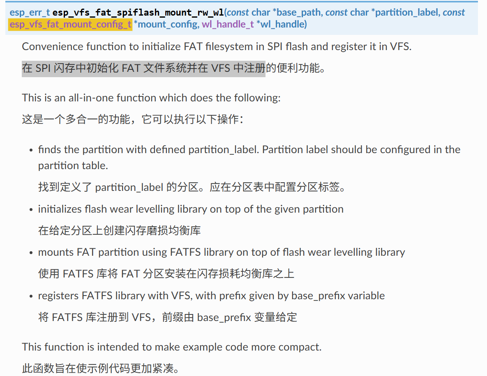

# Basic Console 基本控制台

## 粗略阅读README文档

文档简介本示例演示控制台组件的REPL API的使用，在ESP芯片上进行交互式终端操作，示例支持UART和USB接口

使用示例的一些注意事项，包括使用JTAG的时候，使用USB时的配置

构建烧录和示例输出以及注意事项

## 代码分析

> 笔者注，在freertos的示例中有用到repl组件功能，有过分析和基础了解
> 且监视窗口的功能是ESP的一些配置，更需要深度了解，故直接进行代码分析

### 头文件和宏定义

本例中特殊头文件的功能如下注释

宏定义中对辅助串行控制台的启用进行警告。如果启用了历史记录功能，进行文件配置

1. `wl_handle_t` 作为[磨损均衡API](https://docs.espressif.com/projects/esp-idf/zh_CN/stable/esp32/api-reference/storage/wear-levelling.html#api)中定义的类型，用于充分发挥ESP性能，延长使用寿命，具体见文档。
2. `esp_vfs_fat_mount_config_t` 结构体配置FAT文件系统
   * `max_files`最大打开文件数
   * `format_if_mount_failed`如果 FAT 分区无法挂载，并且此参数为 true，请创建分区表并格式化文件系统
   * 其他参数见[编程指南](https://docs.espressif.com/projects/esp-idf/zh_CN/stable/esp32/api-reference/storage/fatfs.html#_CPPv426esp_vfs_fat_mount_config_t)
3. `esp_vfs_fat_spiflash_mount_rw_wl` 函数实现在 SPI 闪存中初始化 FAT 文件系统并在 VFS 中注册

```c
#include <stdio.h>
#include <string.h>
#include "esp_system.h"
#include "esp_log.h"
#include "esp_console.h"    // ESP32控制台组件的核心头文件，提供REPL功能
#include "esp_vfs_dev.h"    // 虚拟文件系统（VFS）设备驱动支持
#include "esp_vfs_fat.h"    // FAT文件系统和VFS的集成，支持SD卡等储存设备的文件操作
#include "nvs.h"            // 非易失性存储（NVS）接口，用于存储键值对数据
#include "nvs_flash.h"      // NVS的底层Flash存储实现，管理NVS在Flash中的存储
#include "cmd_system.h"     // 系统相关命令实现
#include "cmd_wifi.h"       // WiFi相关命令实现
#include "cmd_nvs.h"        // NVS相关命令实现

/*
 * We warn if a secondary serial console is enabled. A secondary serial console is always output-only and
 * hence not very useful for interactive console applications. If you encounter this warning, consider disabling
 * the secondary serial console in menuconfig unless you know what you are doing.
 */
#if SOC_USB_SERIAL_JTAG_SUPPORTED
#if !CONFIG_ESP_CONSOLE_SECONDARY_NONE
#warning "A secondary serial console is not useful when using the console component. Please disable it in menuconfig."
#endif
#endif

static const char* TAG = "example";
#define PROMPT_STR CONFIG_IDF_TARGET

/* Console command history can be stored to and loaded from a file.
 * The easiest way to do this is to use FATFS filesystem on top of
 * wear_levelling library.
 */
#if CONFIG_CONSOLE_STORE_HISTORY

#define MOUNT_PATH "/data"
#define HISTORY_PATH MOUNT_PATH "/history.txt" //字符串拼接宏定义，定义HISTORY_PATH为/data/history.txt

static void initialize_filesystem(void)
{
    static wl_handle_t wl_handle;
    const esp_vfs_fat_mount_config_t mount_config = {
            .max_files = 4,
            .format_if_mount_failed = true
    };
    esp_err_t err = esp_vfs_fat_spiflash_mount_rw_wl(MOUNT_PATH, "storage", &mount_config, &wl_handle);
    if (err != ESP_OK) {
        ESP_LOGE(TAG, "Failed to mount FATFS (%s)", esp_err_to_name(err));
        return;
    }
}
#endif // CONFIG_STORE_HISTORY
```

### app_main函数

1. `ESP_CONSOLE_REPL_CONFIG_DEFAULT`对REPL使用默认配置
2. 设置`prompt`提示和`max_cmdline_length`最大命令长度
3. `initialize_nvs` 自定义函数初始化NVS
4. 如果启用历史文件，进行文件系统初始化，并设置文件目录【1】
5. `esp_console_register_help_command`将*help*命令添加到已注册命令列表中【2】
6. `register_system_common` 函数注册系统常用功能，如版本(version)，重启(restart)，释放(free)，堆(heap)，任务(tasks)【3】
7. 根据配置注册轻度休眠和深度休眠命令【4】
8. 注册WiFi和NVS命令【5】
9. `ESP_CONSOLE_DEV_UART_CONFIG_DEFAULT` 注册默认console的UART配置
10. `esp_console_new_repl_uart` 函数进行初始化好构建在 UART 基础上的 REPL 环境（包括安装 UART 驱动，基本的 console 配置，创建一个新的线程来执行 REPL 任务，注册一些基本的命令）
11. 后续两个功能例程中没有启用，在README文件中也有说明，具体可见[USB 串行/JTAG 控制器控制台](https://docs.espressif.com/projects/esp-idf/zh_CN/v5.5.1/esp32s3/api-guides/usb-serial-jtag-console.html#usb-jtag)和[USB OTG 控制台](https://docs.espressif.com/projects/esp-idf/zh_CN/v5.5.1/esp32s3/api-guides/usb-otg-console.html#usb-otg)。但笔者暂时不作查看和解释
12. `esp_console_start_repl` 初始化完成后调用函数进行启用
13. 从【1】到【5】的初始化和命令注册函数，在`advanced`的模组中定义，后续进行详细分析

```c
void app_main(void)
{
    esp_console_repl_t *repl = NULL;
    esp_console_repl_config_t repl_config = ESP_CONSOLE_REPL_CONFIG_DEFAULT();
    /* Prompt to be printed before each line.
     * This can be customized, made dynamic, etc.
     */
    repl_config.prompt = PROMPT_STR ">";
    repl_config.max_cmdline_length = CONFIG_CONSOLE_MAX_COMMAND_LINE_LENGTH;

    initialize_nvs();

#if CONFIG_CONSOLE_STORE_HISTORY
    initialize_filesystem();
    repl_config.history_save_path = HISTORY_PATH;
    ESP_LOGI(TAG, "Command history enabled");
#else
    ESP_LOGI(TAG, "Command history disabled");
#endif

    /* Register commands */
    esp_console_register_help_command();
    register_system_common();
#if SOC_LIGHT_SLEEP_SUPPORTED
    register_system_light_sleep();
#endif
#if SOC_DEEP_SLEEP_SUPPORTED
    register_system_deep_sleep();
#endif
#if (CONFIG_ESP_WIFI_ENABLED || CONFIG_ESP_HOST_WIFI_ENABLED)
    register_wifi();
#endif
    register_nvs();

#if defined(CONFIG_ESP_CONSOLE_UART_DEFAULT) || defined(CONFIG_ESP_CONSOLE_UART_CUSTOM)
    esp_console_dev_uart_config_t hw_config = ESP_CONSOLE_DEV_UART_CONFIG_DEFAULT();
    ESP_ERROR_CHECK(esp_console_new_repl_uart(&hw_config, &repl_config, &repl));

#elif defined(CONFIG_ESP_CONSOLE_USB_CDC)
    esp_console_dev_usb_cdc_config_t hw_config = ESP_CONSOLE_DEV_CDC_CONFIG_DEFAULT();
    ESP_ERROR_CHECK(esp_console_new_repl_usb_cdc(&hw_config, &repl_config, &repl));

#elif defined(CONFIG_ESP_CONSOLE_USB_SERIAL_JTAG)
    esp_console_dev_usb_serial_jtag_config_t hw_config = ESP_CONSOLE_DEV_USB_SERIAL_JTAG_CONFIG_DEFAULT();
    ESP_ERROR_CHECK(esp_console_new_repl_usb_serial_jtag(&hw_config, &repl_config, &repl));

#else
#error Unsupported console type
#endif

    ESP_ERROR_CHECK(esp_console_start_repl(repl));
}
```

### NVS初始化

初始化中遇到指定错误：

* `ESP_ERR_NVS_NO_FREE_PAGES`没有多余空页（如果NVS分区被截断，则可能会发生这种情况。擦除整个分区并再次调用nvs_flash_init。）
* `ESP_ERR_NVS_NEW_VERSION_FOUND`发现新的版本（NVS分区包含新格式的数据，此版本的代码无法识别）

尝试`nvs_flash_erase`重新配置默认NVS分区

```c
static void initialize_nvs(void)
{
    esp_err_t err = nvs_flash_init();
    if (err == ESP_ERR_NVS_NO_FREE_PAGES || err == ESP_ERR_NVS_NEW_VERSION_FOUND) {
        ESP_ERROR_CHECK( nvs_flash_erase() );
        err = nvs_flash_init();
    }
    ESP_ERROR_CHECK(err);
}
```

## 总结

本示例作为basic，确实只包含一些基础功能，演示了文件配置，使用默认配置进行REPL初始化，需要进行命令注册。其他更加深入的留待下一个示例进行详细分析。
