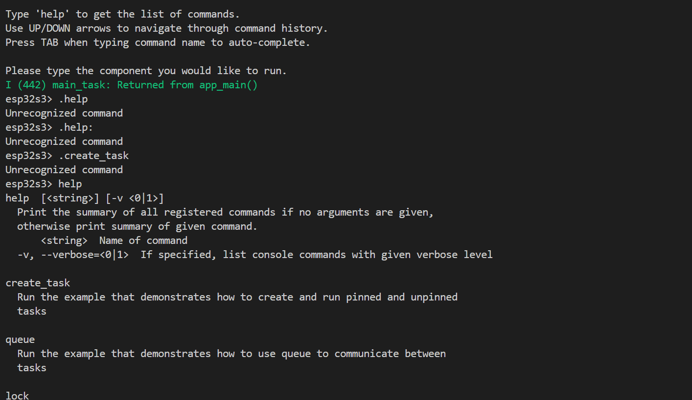
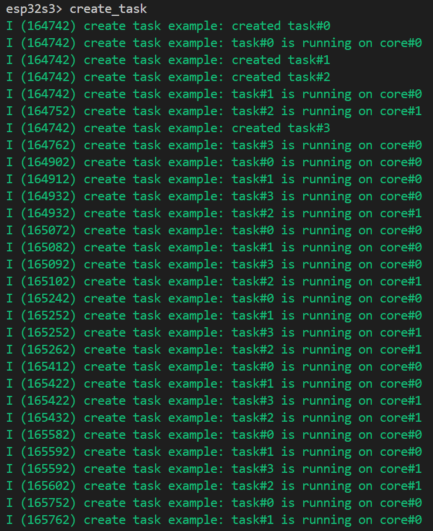
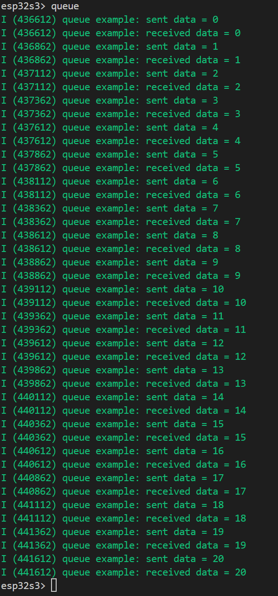
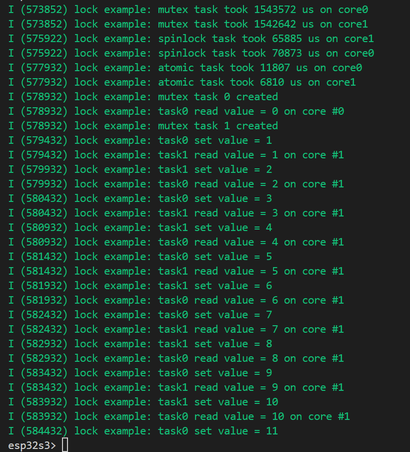
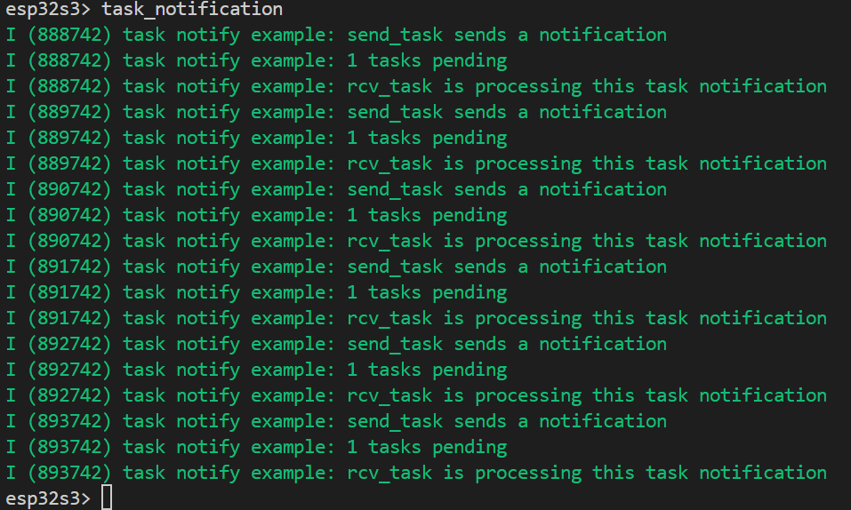
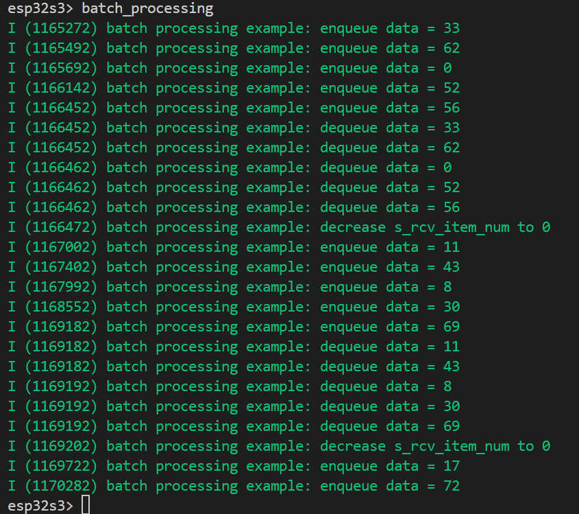
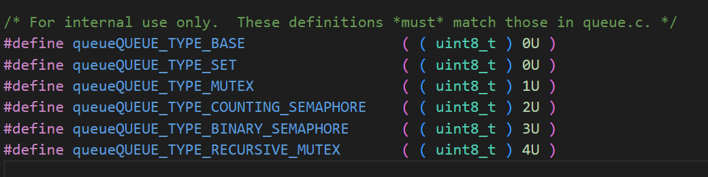

# FreeRTOS basic API FREERTOS基础API

## 粗略阅读README文档

文档简介例程演示了FREERTOS在SMP架构中一些有用的API，包括任务创建、队列、互斥锁、任务标记等。

简要介绍文档结构

简单介绍 **任务创建**及示例输出，**通过队列数据传输**及示例输出，**互斥锁、自旋锁、原子操作**的比较和示例输出，**任务通知**通信及示例输出，前几种方式**集成示例**及输出

> 如何使用此示例
> 此示例使用了一个交互式控制台组件，以便您可以选择要通过终端运行的部分。您可以键入'help'以获取命令列表，使用UPDOWN arows浏览命令历史记录；键入命令名时按TAB键自动完成。有关交互式控制台组件的更多信息，请参阅控制台。支持的命令包括：
> .help：获取命令列表
> .create_task：运行创建任务示例
> .queue：运行队列示例
> .lock：运行locks示例
> .task_notiation：运行任务通知示例
> .batch_processing：运行批处理示例
> 一旦组件开始运行，它将在大约5秒内停止运行。如果希望延长运行时间，请修改headerfilinc.h.中宏COMP_LOOP_PERIOD的值。

## 构建烧录和监视

* 选择目标芯片
* 选择端口号
* 点击**构建、烧录和监视**
* 监视输出，似乎是在芯片内搭建了一个系统


### 任务创建

在窗口中输入 `create_task`。从窗口输出可以看到，提示我们任务被创建，然后提示我们任务在核0或核1上运行
 
  
### 队列数据

在窗口中输入 `queue`。从窗口数据结果可以看到队列数据有发送，有接收


### 锁相关

在窗口中输入 `lock` 。首先是 **互斥锁(mutex)** 的输出提示，然后是**自旋锁(spinlock)** 的输出提示，然后是 **原子信号(atomic)** 的输出提示。接着创建了两个互斥任务，分别去设置和读取同一个value，可以感觉到 **同一个value不会同时被两个任务访问** 。


### 任务通知

在窗口中输入 `task_notification` 。提示我们一个任务发送任务通知，一个任务等待，然后其处理任务通知。多次循环，说明**一次发送只有一次处理。**


### 集成示例

在窗口中输入 `batch_processing` 。首先队列中加入了一组数据，然后读取出一组数据，从提示中可以看到，满足 **队列先进先出(FIFO)** 。然后提示队列中数据为0。

> 文档示例说明
> 在最后一部分中，提供了一个实际演示，其中队列、互斥体和任务通知被集成在一起以实现一个真实的工作流程，从而展示了它们在现实世界场景中的实用性。
> 名为 **rcv数据任务** 的任务模拟接收不规则到达的数据。每次接收到一个数据项时，它都会被推入队列，接收到的项目编号会增加1；一旦任务收集了5个数据项，它就会向 **proc数据任务** 发送任务通知，以处理队列中的这批数据。当后一个任务完成处理时，它将把接收到的项目编号减少5。因为这两个任务都可以修改这个全局编号，所以修改操作受到互斥体的保护。



## 代码分析

> 代码分析借助AI，帮助理解，会有错误

### app_main()

**app_main** 中只调用了 `config_console`函数，该函数*把一个 串口终端（REPL） 搭起来，让用户可以在运行时通过命令行交互式地启动 FreeRTOS 示例的各个子模块。一句话：它把“示例菜单”做成了串口命令。*
具体注释写在代码旁边

```c
static void config_console(void)
{
    esp_console_repl_t *repl = NULL; //运行期控制台实例句柄 REPL
    esp_console_repl_config_t repl_config = ESP_CONSOLE_REPL_CONFIG_DEFAULT(); //采用默认REPL配置
    /* Prompt to be printed before each line. 每行前提示打印
     * This can be customized, made dynamic, etc. 这可以定制，动态化
     */
    repl_config.prompt = PROMPT_STR ">"; //定制提示符
    repl_config.max_cmdline_length = 1024; //单行命令最长1024字节
    esp_console_dev_uart_config_t uart_config = ESP_CONSOLE_DEV_UART_CONFIG_DEFAULT(); //串口底层数据配置，如波特率，引脚等
    ESP_ERROR_CHECK(esp_console_new_repl_uart(&uart_config, &repl_config, &repl)); //把串口驱动与 REPL 绑定，生成 repl 实例

    esp_console_register_help_command(); //注册内建help指令，用户输入help就能看到所以已注册命令

    // register entry functions for each component
    // 注册各命令实例
    register_creating_task();
    register_queue();
    register_lock();
    register_task_notification();
    register_batch_proc_example();

    ESP_ERROR_CHECK(esp_console_start_repl(repl)); //启动
    printf("\n"
           "Please type the component you would like to run.\n");
}

void app_main(void)
{
    config_console();
}
```

### 宏定义和register函数

在 **头文件(.h)** 中 `CONFIG_IDF_TARGET` 是esp-idf构建系统时生成的宏，代表当前芯片型号。后定义任务优先级、循环周期、错误提示字符串。
声明各命令注册的实际函数 (*该头文件在后续各单独文件中有引用，此处统一注册函数* )

```c
#define PROMPT_STR CONFIG_IDF_TARGET 
#define TASK_PRIO_3         3
#define TASK_PRIO_2         2
#define COMP_LOOP_PERIOD    5000
#define SEM_CREATE_ERR_STR                "semaphore creation failed"
#define QUEUE_CREATE_ERR_STR              "queue creation failed"

int comp_creating_task_entry_func(int argc, char **argv);
int comp_queue_entry_func(int argc, char **argv);
int comp_lock_entry_func(int argc, char **argv);
int comp_task_notification_entry_func(int argc, char **argv);
int comp_batch_proc_example_entry_func(int argc, char **argv);
```

注册函数的写法基本相同，`.command` 确定 **启动指令** ；`.help` 确定该命令的 **帮助文本** ; `hint` 确定该命令的 **提示文本** ；`func` 确定该命令对应的 **调用函数** 。最后采用 `esp_console_cmd_register` **进行注册** 。

```c
static void register_creating_task(void)
{
    const esp_console_cmd_t creating_task_cmd = {
        .command = "create_task",
        .help = "Run the example that demonstrates how to create and run pinned and unpinned tasks",
        .hint = NULL,
        .func = &comp_creating_task_entry_func,
    };
    ESP_ERROR_CHECK(esp_console_cmd_register(&creating_task_cmd));
}

static void register_queue(void)
{
    const esp_console_cmd_t queue_cmd = {
        .command = "queue",
        .help = "Run the example that demonstrates how to use queue to communicate between tasks",
        .hint = NULL,
        .func = &comp_queue_entry_func,
    };
    ESP_ERROR_CHECK(esp_console_cmd_register(&queue_cmd));
}

static void register_lock(void)
{
    const esp_console_cmd_t lock_cmd = {
        .command = "lock",
        .help = "Run the example that demonstrates how to use mutex and spinlock to protect a shared resource",
        .hint = NULL,
        .func = &comp_lock_entry_func,
    };
    ESP_ERROR_CHECK(esp_console_cmd_register(&lock_cmd));
}

static void register_task_notification(void)
{
    const esp_console_cmd_t task_notification_cmd = {
        .command = "task_notification",
        .help = "Run the example that demonstrates how to use task notifications to synchronize tasks",
        .hint = NULL,
        .func = &comp_task_notification_entry_func,
    };
    ESP_ERROR_CHECK(esp_console_cmd_register(&task_notification_cmd));
}

static void register_batch_proc_example(void)
{
    const esp_console_cmd_t batch_proc_example_cmd = {
        .command = "batch_processing",
        .help = "Run the example that combines queue, mutex, task notification together",
        .hint = NULL,
        .func = &comp_batch_proc_example_entry_func,
    };
    ESP_ERROR_CHECK(esp_console_cmd_register(&batch_proc_example_cmd));
}
```

### create_task 创建任务

#### 头文件和宏定义

特别注意调用 **"basic_freertos_smp_usage.h"** 因为 **函数声明** 在该头文件中。
宏定义 `SPIN_ITER` 次数为350000，定义核0和核1

```c
#include "freertos/FreeRTOS.h"
#include "esp_log.h"
#include "basic_freertos_smp_usage.h"


#define SPIN_ITER   350000  //actual CPU cycles consumed will depend on compiler optimization
#define CORE0       0
// only define xCoreID CORE1 as 1 if this is a multiple core processor target, else define it as tskNO_AFFINITY
#define CORE1       ((CONFIG_FREERTOS_NUMBER_OF_CORES > 1) ? 1 : tskNO_AFFINITY)
```

#### 创建任务-命令任务函数

该函数实现任务创建，把两个任务创建在核0上，一个任务创建在核1上，还有一个任务不指定核，进行延时一段时间，观察两个的使用情况。
`xTaskCreatePinnedToCore(任务函数，任务名称，分配内存，传入任务的参数，优先级，任务句柄，指定核)`  [FREERTOS附加功能](https://docs.espressif.com/projects/esp-idf/zh_CN/stable/esp32/api-reference/system/freertos_additions.html#_CPPv429xTaskCreateStaticPinnedToCore14TaskFunction_tPCKcK8uint32_tPCv11UBaseType_tPC11StackType_tPC12StaticTask_tK10BaseType_t)

```c
// Creating task example: show how to create pinned and unpinned tasks on CPU cores
int comp_creating_task_entry_func(int argc, char **argv)
{
    timed_out = false;
    // pin 2 tasks on same core and observe in-turn execution,
    // and pin another task on the other core to observe "simultaneous" execution
    int task_id0 = 0, task_id1 = 1, task_id2 = 2, task_id3 = 3;
    xTaskCreatePinnedToCore(spin_task, "pinned_task0_core0", 4096, (void*)task_id0, TASK_PRIO_3, NULL, CORE0);
    xTaskCreatePinnedToCore(spin_task, "pinned_task1_core0", 4096, (void*)task_id1, TASK_PRIO_3, NULL, CORE0);
    xTaskCreatePinnedToCore(spin_task, "pinned_task2_core1", 4096, (void*)task_id2, TASK_PRIO_3, NULL, CORE1);
    // Create a unpinned task with xCoreID = tskNO_AFFINITY, which can be scheduled on any core, hopefully it can be observed that the scheduler moves the task between the different cores according to the workload
    xTaskCreatePinnedToCore(spin_task, "unpinned_task", 4096, (void*)task_id3, TASK_PRIO_2, NULL, tskNO_AFFINITY);

    // time out and stop running after 5 seconds
    vTaskDelay(pdMS_TO_TICKS(COMP_LOOP_PERIOD));
    timed_out = true;
    // delay to let tasks finish the last loop
    vTaskDelay(500 / portTICK_PERIOD_MS);
    return 0;
}
```

#### 创建任务-实际任务函数

内联汇编指令 `__asm__ __volatile__("NOP")`，表示执行一条空操作指令（NOP）。*NOP 指令不会改变任何寄存器或内存状态，但会消耗 CPU 周期*
`spin_task` 函数用作提示性输出，`spin_iteration` 内部执行空操作，占用CPU

```c
static void spin_iteration(int spin_iter_num)
{
    for (int i = 0; i < spin_iter_num; i++) {
        __asm__ __volatile__("NOP");
    }
}

static void spin_task(void *arg)
{
    // convert arg pointer from void type to int type then dereference it
    int task_id = (int)arg; //获取参数，强制转为int，获取任务编号
    ESP_LOGI(TAG, "created task#%d", task_id);
    while (!timed_out) {
        int core_id = esp_cpu_get_core_id();
        ESP_LOGI(TAG, "task#%d is running on core#%d", task_id, core_id);
        // consume some CPU cycles to keep Core#0 a little busy, so task3 has opportunity to be scheduled on Core#1
        spin_iteration(SPIN_ITER);
        vTaskDelay(pdMS_TO_TICKS(150));
    }

    vTaskDelete(NULL); //删除当前任务，释放任务资源
}
```

### queue 队列

#### 头文件和变量定义

限制队列长度为40，其他不作特别解释

```c
#include "freertos/FreeRTOS.h"
#include "esp_log.h"
#include "basic_freertos_smp_usage.h"


static QueueHandle_t msg_queue;
static const uint8_t msg_queue_len = 40;
static volatile bool timed_out;
const static char *TAG = "queue example";
```

#### 队列-命令任务函数

函数进行队列创建，核任务创建，并延时让核运行。
`queueQUEUE_TYPE_SET` 代表普通类型队列 *该函数为SMP架构下的库函数，笔者未找到官方介绍，建议直接查看源文件*

```c
// Queue example: illustrate how queues can be used to synchronize between tasks
int comp_queue_entry_func(int argc, char **argv)
{
    timed_out = false;

    msg_queue = xQueueGenericCreate(msg_queue_len, sizeof(int), queueQUEUE_TYPE_SET); //队列长度，队列中消息类型，队列类型
    if (msg_queue == NULL) {
        ESP_LOGE(TAG, QUEUE_CREATE_ERR_STR);
        return 1;
    }
    xTaskCreatePinnedToCore(print_q_msg, "print_q_msg", 4096, NULL, TASK_PRIO_3, NULL, tskNO_AFFINITY);
    xTaskCreatePinnedToCore(send_q_msg, "send_q_msg", 4096, NULL, TASK_PRIO_3, NULL, tskNO_AFFINITY);

    // time out and stop running after 5 seconds
    vTaskDelay(pdMS_TO_TICKS(COMP_LOOP_PERIOD));
    timed_out = true;
    // delay to let tasks finish the last loop
    vTaskDelay(500 / portTICK_PERIOD_MS);
    return 0;
}
```



#### 队列-实际任务函数

两个函数函数分别是队列发送和接收，并附带有提示信息。
`xQueueGenericSend(队列，指针，阻塞时间，位置)` [发送函数](https://docs.espressif.com/projects/esp-idf/zh_CN/stable/esp32/api-reference/system/freertos_idf.html#_CPPv417xQueueGenericSend13QueueHandle_tPCKv10TickType_tK10BaseType_t) `xQueueReceive(队列，指针 阻塞时间)` [接收函数](https://docs.espressif.com/projects/esp-idf/zh_CN/stable/esp32/api-reference/system/freertos_idf.html#_CPPv413xQueueReceive13QueueHandle_tPCv10TickType_t)

```c
static void print_q_msg(void *arg)
{
    int data;  // data type should be same as queue item type
    int to_wait_ms = 1000;  // the maximal blocking waiting time of millisecond
    const TickType_t xTicksToWait = pdMS_TO_TICKS(to_wait_ms);

    while (!timed_out) {
        if (xQueueReceive(msg_queue, (void *)&data, xTicksToWait) == pdTRUE) {
            ESP_LOGI(TAG, "received data = %d", data);
        } else {
            ESP_LOGI(TAG, "Did not received data in the past %d ms", to_wait_ms);
        }
    }

    vTaskDelete(NULL);
}

static void send_q_msg(void *arg)
{
    int sent_num  = 0;

    while (!timed_out) {
        // Try to add item to queue, fail immediately if queue is full
        if (xQueueGenericSend(msg_queue, (void *)&sent_num, portMAX_DELAY, queueSEND_TO_BACK) != pdTRUE) {
            ESP_LOGI(TAG, "Queue full\n");
        }
        ESP_LOGI(TAG, "sent data = %d", sent_num);
        sent_num++;

        // send an item for every 250ms
        vTaskDelay(250 / portTICK_PERIOD_MS);
    }

    vTaskDelete(NULL);
}
```

### lock 锁

#### 头文件、宏定义和变量

`<stdatomic.h>` 此头文件支持原子操作，用于处理**多线程环境下**的数据同步和一致性。`SHARE_RES_THREAD_NUM`定义参与共享资源的**线程数**，`ITERATION_NUMBER`定义每个任务对资源的**访问次数**。

```c
#include <stdatomic.h>
#include "freertos/FreeRTOS.h"
#include "esp_log.h"
#include "esp_timer.h"
#include "basic_freertos_smp_usage.h"

#define SHARE_RES_THREAD_NUM     2
#define ITERATION_NUMBER         100000


// declare a static global integer as a protected shared resource that is accessible to multiple tasks
static volatile int s_global_num = 0; //共享读取值
static atomic_int s_atomic_global_num; //原子变量
static SemaphoreHandle_t s_mutex; //互斥信号，不能在中断中使用
static portMUX_TYPE s_spinlock = portMUX_INITIALIZER_UNLOCKED; //ESP-IDF提供的自旋锁
static volatile bool timed_out;
const static char *TAG = "lock example";
```

#### 锁-命令任务函数

>锁示例：展示如何使用互斥锁和自旋锁来保护共享资源
>
>首先，共享资源 's_global_num' 受到互斥锁的保护，有 2 个任务，
其任务功能为 'inc_num_mutex_iter' 的，轮流访问和增加此数字。
一旦数字值达到 100000，则从开始运行到
当前时间被测量和记录，那么这两个任务都将被删除。
>
>接下来，重置 's_global_num' 并有另外 2 个 task，调用 task function
'inc_num_spinlock_iter'，则访问并增加此共享资源，直到达到
100000，在 spinlock 的保护下。预期结果是这两个任务将具有
与前 2 个任务相比，时间开销更少，因为它们涉及的上下文更少
switch 执行任务。
>
>之后，创建另外 2 个任务以完成相同的任务
addition 作业，但共享资源是原子类型的整数。它应该有一个较短的
运行时间比 SpinLock 任务多，因为 atomic operation 是一种免看的实现
并且它节省了进入和退出关键部分的时间。
>
>注意：如果此示例在单个内核上运行，则每种类型只会创建 1 个 task。
>
>最后，它说明了共享资源“s_global_num”受互斥锁保护
反过来由多个任务访问。

```c
/* Lock example: show how to use mutex and spinlock to protect shared resources

Firstly, a shared resource `s_global_num` is protected by a mutex and there are 2 tasks,
whose task function is `inc_num_mutex_iter`, take turns to access and increase this number.
Once the number value reaches 100000, the time duration from starting running till the
current time is measured and recorded, then both these 2 tasks will be deleted.

Next, `s_global_num` is reset and there are another 2 tasks, calling task function
`inc_num_spinlock_iter`, that access and increase this shared resource until it reaches
100000, under the protection of a spinlock. The expected result is these 2 tasks will have
less time overhead in comparison with the previous 2 tasks because they involve less context
switching for task execution.

After that, another 2 tasks are create to complete the same
addition job, but the shared resource is an atomic type integer. It should have a shorter
running time than the spinlock tasks, because atomic operation is a kind of look-free implementation
and it saves the time of entering and exiting the critical section.

Note: if this example runs on single core, only 1 task of each type will be created.

Finally, it illustrates show the shared resource `s_global_num` is protected by a mutex
and in turn accessed by multiple tasks. */
```

```c
int comp_lock_entry_func(int argc, char **argv)
{
    s_global_num = 0;
    int thread_id;
    int core_id;

    timed_out = false;

    // create mutex
    s_mutex = xSemaphoreCreateMutex();  //创建互斥锁
    if (s_mutex == NULL) {
        ESP_LOGE(TAG, SEM_CREATE_ERR_STR);
        return 1;
    }

    // create 2 tasks accessing a shared resource protected by mutex
    //在核上创建任务，验证互斥锁
    for (core_id = 0; core_id < CONFIG_FREERTOS_NUMBER_OF_CORES; core_id++) {
        xTaskCreatePinnedToCore(inc_num_mutex_iter, NULL, 4096, NULL, TASK_PRIO_3, NULL, core_id);
    }

    // reset s_global_num
    vTaskDelay(2000 / portTICK_PERIOD_MS);
    s_global_num = 0; //清零，为下一组实验作准备
    // create 2 tasks accessing a shared resource protected by spinlock
    //在核上创建任务，验证自旋锁
    for (core_id = 0; core_id < CONFIG_FREERTOS_NUMBER_OF_CORES; core_id++) {
        xTaskCreatePinnedToCore(inc_num_spinlock_iter, NULL, 4096, NULL, TASK_PRIO_3, NULL, core_id);
    }

    vTaskDelay(2000 / portTICK_PERIOD_MS);
    // create 2 tasks accessing an atomic shared resource
    atomic_init(&s_atomic_global_num, 0); //初始化原子变量
    //创建任务，验证原子命令如何代替锁
    for (core_id = 0; core_id < CONFIG_FREERTOS_NUMBER_OF_CORES; core_id++) {
        xTaskCreatePinnedToCore(inc_num_atomic_iter, NULL, 4096, NULL, TASK_PRIO_3, NULL, core_id);
    }

    // reset s_global_num
    vTaskDelay(1000 / portTICK_PERIOD_MS);
    s_global_num = 0;
    // create 2 tasks to increase a shared number in turn
    //不指定核，以互斥锁演示系统调度
    for (thread_id = 0; thread_id < SHARE_RES_THREAD_NUM; thread_id++) {
        xTaskCreatePinnedToCore(inc_num_mutex, NULL, 4096, (void *)thread_id, TASK_PRIO_3, NULL, tskNO_AFFINITY);
    }

    // time out and stop running after 5 seconds
    vTaskDelay(pdMS_TO_TICKS(COMP_LOOP_PERIOD));
    timed_out = true;
    // delay to let tasks finish the last loop
    vTaskDelay(1500 / portTICK_PERIOD_MS);
    return 0;
}
```

#### 锁-实际任务函数

前三个函数结构基本相同，获取 **CPU内核信息** 和 **时间信息** ，然后在 `ITERATION_NUMBER` 指定的时间内进行操作，接着获取并计算 **时间信息** ，最后 **提示输出** ，**删除任务** 。具体不同写在下方循环内

```c

// Take a mutex to protect the shared resource. If mutex is already taken, this task will be blocked until it is available;
// when the mutex is available, FreeRTOS will reschedule this task and this task can further access the shared resource
static void inc_num_mutex_iter(void *arg)
{
    int core_id = esp_cpu_get_core_id();
    int64_t start_time, end_time, duration = 0;
    start_time = esp_timer_get_time();
    while (s_global_num < ITERATION_NUMBER) {
        // 获取互斥锁的值，然后释放
        if (xSemaphoreTake(s_mutex, portMAX_DELAY) == pdTRUE) {
            s_global_num++;
            xSemaphoreGive(s_mutex);
        }
    }
    end_time = esp_timer_get_time();
    duration = end_time - start_time;
    ESP_LOGI(TAG, "mutex task took %lld us on core%d", duration, core_id);

    vTaskDelete(NULL);
}

// Enter a critical section and take a spinlock to protect the shared resource. If the spinlock is already taken, this task busy-wait here until it is available.
// In contrast to the mutex, when in a critical section interrupts are disabled, which means nothing will interrupt the task and the freertos scheduler will never run
// and reschedule the task.
static void inc_num_spinlock_iter(void *arg)
{
    int core_id = esp_cpu_get_core_id();
    int64_t start_time, end_time, duration = 0;
    start_time = esp_timer_get_time();
    while (s_global_num < ITERATION_NUMBER) {
        //函数会把CPU中断关掉并加自旋锁
        portENTER_CRITICAL(&s_spinlock);
        s_global_num++;
        portEXIT_CRITICAL(&s_spinlock);
    }
    end_time = esp_timer_get_time();
    duration = end_time - start_time;
    ESP_LOGI(TAG, "spinlock task took %lld us on core%d", duration, core_id);

    vTaskDelete(NULL);
}

static void inc_num_atomic_iter(void *arg)
{
    int core_id = esp_cpu_get_core_id();
    int64_t start_time, end_time, duration = 0;
    start_time = esp_timer_get_time();
    while (atomic_load(&s_atomic_global_num) < ITERATION_NUMBER) {
        //通过原子算法，采用fetch_add直接对变量操作
        //原子操作本身存在内存屏障
        atomic_fetch_add(&s_atomic_global_num, 1);
    }
    end_time = esp_timer_get_time();
    duration = end_time - start_time;
    ESP_LOGI(TAG, "atomic task took %lld us on core%d", duration, core_id);

    vTaskDelete(NULL);
}

static void inc_num_mutex(void *arg)
{
    int task_index = (int)arg;
    ESP_LOGI(TAG, "mutex task %d created", task_index);

    while (!timed_out) {
        //演示互斥锁的互斥和任务切换 两个任务轮流持有锁
        xSemaphoreTake(s_mutex, portMAX_DELAY); // == pdTRUE

        int core_id = esp_cpu_get_core_id();
        ESP_LOGI(TAG, "task%d read value = %d on core #%d", task_index, s_global_num, core_id);
        s_global_num++;
        // delay for 500 ms
        vTaskDelay(pdMS_TO_TICKS(500));
        xSemaphoreGive(s_mutex);
        ESP_LOGI(TAG, "task%d set value = %d", task_index, s_global_num);
    }

    vTaskDelete(NULL);
}
```

### task_notify 任务通知

> 头文件没什么特别，不作说明

#### 任务通知-命令任务函数

函数创建了任务同时发送和接收两个任务，然后延时保证运行

```c
int comp_task_notification_entry_func(int argc, char **argv)
{
    timed_out = false;
    TaskHandle_t rcv_task_hdl;
    xTaskCreatePinnedToCore(notification_rcv_func, NULL, 8192, NULL, TASK_PRIO_3, &rcv_task_hdl, tskNO_AFFINITY);
    xTaskCreatePinnedToCore(notification_send_func, NULL, 8192, rcv_task_hdl, TASK_PRIO_3, NULL, tskNO_AFFINITY);

    // time out and stop running after 5 seconds
    vTaskDelay(pdMS_TO_TICKS(COMP_LOOP_PERIOD));
    timed_out = true;
    // delay to let tasks finish the last loop
    vTaskDelay(500 / portTICK_PERIOD_MS);
    return 0;
}
```

#### 任务通知-实际任务函数

函数用于增加任务通知值，处理接收到的任务通知。任务通知相比队列信号量的区别是**不需要额外创建** [任务通知相关介绍](https://docs.espressif.com/projects/esp-idf/zh_CN/stable/esp32/api-reference/system/freertos_idf.html#c.xTaskNotifyGiveIndexed)

```c
static void notification_rcv_func(void *arg)
{
    int pending_notification_task_num;
    while (!timed_out) {
        pending_notification_task_num = ulTaskNotifyTake(pdTRUE, portMAX_DELAY); //获取一次性接收的通知数
        {
            ESP_LOGI(TAG, "%d tasks pending", pending_notification_task_num);
            while (pending_notification_task_num > 0) { //处理收到的通知
                // do something to process the received notification
                ESP_LOGI(TAG, "rcv_task is processing this task notification");
                pending_notification_task_num--;
            }
        }
    }

    vTaskDelete(NULL);
}

static void notification_send_func(void *arg)
{
    TaskHandle_t rcv_task_hdl = (TaskHandle_t)arg;
    // send a task notification every 1000 ms
    while (!timed_out) {
        xTaskNotifyGive(rcv_task_hdl); //把目标任务的通知值加一
        ESP_LOGI(TAG, "send_task sends a notification");
        vTaskDelay(1000 / portTICK_PERIOD_MS);
    }

    vTaskDelete(NULL);
}
```

### batch 集成示例

> 示例中主要用到队列和互斥锁，头文件和变量不作介绍

#### 集成示例-命令任务函数

先进行互斥锁和队列的创建，然后进行任务创建，延时确保实验跑够足够时间。后续延时确保缓存数据清空

```c
// batch processing example: demonstrate how to use task notification to implement batch processing
// use queue to transmit data between tasks, and use mutex to protect a shared global number
int comp_batch_proc_example_entry_func(int argc, char **argv)
{
    timed_out = false;

    s_mutex = xSemaphoreCreateMutex();
    if (s_mutex == NULL) {
        ESP_LOGE(TAG, SEM_CREATE_ERR_STR);
        return 1;
    }
    msg_queue = xQueueGenericCreate(msg_queue_len, sizeof(int), queueQUEUE_TYPE_SET);
    if (msg_queue == NULL) {
        ESP_LOGE(TAG, QUEUE_CREATE_ERR_STR);
        return 1;
    }
    TaskHandle_t proc_data_task_hdl;
    xTaskCreatePinnedToCore(proc_data_task, "proc_data_task", 4096, NULL, TASK_PRIO_3, &proc_data_task_hdl, tskNO_AFFINITY);
    xTaskCreatePinnedToCore(rcv_data_task, "rcv_data_task", 4096, proc_data_task_hdl, TASK_PRIO_3, NULL, tskNO_AFFINITY);

    // time out and stop running after COMP_LOOP_PERIOD milliseconds
    vTaskDelay(pdMS_TO_TICKS(COMP_LOOP_PERIOD));
    timed_out = true;
    // delay to let tasks finish the last loop
    vTaskDelay(1500 / portTICK_PERIOD_MS);
    return 0;
}
```

#### 集成示例-实际任务函数

`rcv_data_task` 用于接收数据，通过随机延时，互斥保护全局计数器，发送队列数据(入队)，当接收数据大于阈值，唤醒任务通知。
`proc_data_task` 等待任务通知，然后进行出队，并进行缓存区清零(*包括数组和互斥锁*)

```c
static void rcv_data_task(void *arg)
{
    int random_delay_ms;
    int data;
    TaskHandle_t proc_data_task_hdl = (TaskHandle_t)arg;

    while (!timed_out) {
        // random delay to mimic this thread receives data irregularly
        // 随机延时以模拟接收信号变化
        data = rand() % 100;
        random_delay_ms = (rand() % 500 + 200);
        vTaskDelay(random_delay_ms / portTICK_PERIOD_MS);
        // increase receive item num by 1
        if (xSemaphoreTake(s_mutex, portMAX_DELAY) == pdTRUE) {
            s_rcv_item_num += 1;
            xSemaphoreGive(s_mutex);
        }
        // enqueue the received data
        (void)xQueueGenericSend(msg_queue, (void *)&data, portMAX_DELAY, queueSEND_TO_BACK);
        ESP_LOGI(TAG, "enqueue data = %d", data);

        // if s_rcv_item_num >= batch size, send task notification to proc thread to process them together
        if (s_rcv_item_num >= DATA_BATCH_SIZE) {
            xTaskNotifyGive(proc_data_task_hdl);
        }
    }

    vTaskDelete(NULL);
}

static void proc_data_task(void *arg)
{
    int rcv_data_buffer[DATA_BATCH_SIZE] ;
    int rcv_item_num;
    int data_idx;
    while (!timed_out) {
        // blocking wait for task notification
        while (ulTaskNotifyTake(pdFALSE, portMAX_DELAY)) {
            // every time this task receives notification, reset received data item number
            rcv_item_num = 0;
            for (data_idx = 0; data_idx < DATA_BATCH_SIZE; data_idx++) {
                // keep reading message queue until it's empty
                if (xQueueReceive(msg_queue, (void *)&rcv_data_buffer[data_idx], 0) == pdTRUE) {
                    ESP_LOGI(TAG, "dequeue data = %d", rcv_data_buffer[data_idx]);
                    rcv_item_num += 1;
                } else {
                    break;
                }
            }

            // mimic to process the data in buffer and then clean it
            for (data_idx = 0; data_idx < rcv_item_num; data_idx++) {
                rcv_data_buffer[data_idx] = 0;
            }

            // decrease the s_rcv_item_num by batch size if it's not less the batch size, else set it as 0
            if (xSemaphoreTake(s_mutex, portMAX_DELAY) == pdTRUE) {
                s_rcv_item_num -= rcv_item_num;
                xSemaphoreGive(s_mutex);
                ESP_LOGI(TAG, "decrease s_rcv_item_num to %d", s_rcv_item_num);
            }
        }
    }

    vTaskDelete(NULL);
}
```

## 总结

这个例程记录了两天，但其实对FREERTOS的应用并不算特别了解，算是体验尝试了REPL实例，接触了队列、互斥、信号量等对我来说算是很复杂的东西，并没有比较深刻的了解和熟练的运用。本文写的很长，但依然有许多的细节没有把握到，后续在外设和通信等项目中会逐渐熟悉和使用这些功能，深入了解和使用freertos架构。到此体验esp和freertos的过程算是结束，算是踏入了esp-idf的大门，然后我将继续学习遨游并不断创造，把自己的想法付诸实践。等有了扎实的基础后，去学习大佬的开发架构和模式。
