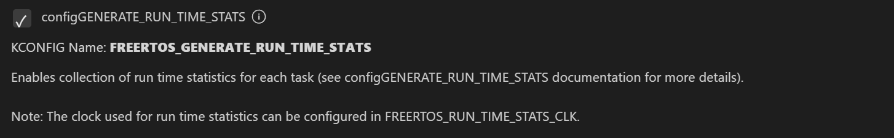
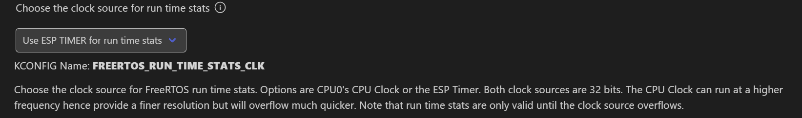
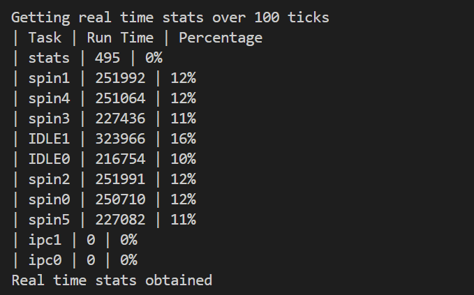

# Real Time State 实时状态

## 粗略阅读README文档

文档简介本示例演示如何在指定持续时间内获取任务的CPU统计情况，即**Real Time State**

项目配置说明

构建烧录示例输出

示例说明：例程创建了多个任务，任务会运行一定数量的CPU周期，然后阻塞一段时间(*文中采用spin来形容tasks，与笔者所写可能有偏差*)

## 构建烧录监视

* 选定合适的芯片型号
* 选择端口号
* 配置项目


* 点击**构建、烧录和监视**
* 窗口输出


## 输出分析

在100ticks时间内，有如下任务运行，展示其运行时间和CPU占用率。**Run Time** 表示 **实际占用CPU时间** ，此处可能的单位是 **微秒（μs）** ； **Percentage** 表示该任务占总统计时间的百分比，也可以看作是CPU占用率

|任务名称|运行时间（单位统一）|占总运行时间比例（CPU占用率）|
|:-----:|:-----------------:|:------------------------:|
|stats|495|0%|
|spin1|251992|12%|
|spin4|251064|12%|
|spin3|227436|11%|
|IDLE1|323966|16%|
|IDLE2|216754|10%|
|spin2|251991|12%|
|spin0|250710|12%|
|spin5|227082|11%|
|ipc1|0|0%|
|ipc0|0|0%|
|总计|2001490|96%|

由上图可以看出，整个CPU运行被拆成了很多部分，**每个任务占用一部分**，这就是FREERTOS的实现原理

## 代码分析

### app_main()

> 函数相关注释写在下方代码块内

main函数中程序先进行延时，确保所有**核初始化完成**。然后**创建信号量**的实例。接着通过循环在核中**创建任务**。最后创建一个state任务并**释放了信号量**，猜测用于通知其他任务*state任务已被创建*[信号量官方链接](https://docs.espressif.com/projects/esp-idf/zh_CN/stable/esp32/api-reference/system/freertos_idf.html#id29) [任务创建API](https://docs.espressif.com/projects/esp-idf/zh_CN/stable/esp32/api-reference/system/freertos_additions.html#_CPPv423xTaskCreatePinnedToCore14TaskFunction_tPCKcK8uint32_tPCv11UBaseType_tPC12TaskHandle_tK10BaseType_t)

```c
void app_main(void)
{
    //Allow other core to finish initialization
    vTaskDelay(pdMS_TO_TICKS(100));

    //Create semaphores to synchronize
    sync_spin_task = xSemaphoreCreateCounting(NUM_OF_SPIN_TASKS, 0); //创建计数信号量实例，并返回一个句柄
    sync_stats_task = xSemaphoreCreateBinary(); //创建二进制信号量实例，并返回一个句柄

    //Create spin tasks
    for (int i = 0; i < NUM_OF_SPIN_TASKS; i++) {
        snprintf(task_names[i], configMAX_TASK_NAME_LEN, "spin%d", i); //将格式化的字符串写入task_names[i],用于生成格式化的任务名称
        xTaskCreatePinnedToCore(spin_task, task_names[i], 1024, NULL, SPIN_TASK_PRIO, NULL, tskNO_AFFINITY); //创建固定到特定核心的新任务,takNO_AFFINITY 代表任务没有指定的核心
    }

    //Create and start stats task
    xTaskCreatePinnedToCore(stats_task, "stats", 4096, NULL, STATS_TASK_PRIO, NULL, tskNO_AFFINITY);
    xSemaphoreGive(sync_stats_task);
}
```

### 预定义和任务静态函数

预定义了**SPIN_TASK任务数量**，每个任务**执行50万次空操作**，**spin优先级为2**，**state优先级为3**，每**隔1000ms打印一次**系统操作，ARRAY_SIZE_OFFSET 定义**内部缓冲区**大小。后续定义了全局变量，包括**任务名**数组，静态**信号量**。
`spin_task()`函数获取信号量然后进行空操作；`stats_task()`函数负责释放信号量，用于让spin_task启动还有每次输出提示信息。

```c
#define NUM_OF_SPIN_TASKS   6
#define SPIN_ITER           500000  //Actual CPU cycles used will depend on compiler optimization
#define SPIN_TASK_PRIO      2
#define STATS_TASK_PRIO     3
#define STATS_TICKS         pdMS_TO_TICKS(1000)
#define ARRAY_SIZE_OFFSET   5   //Increase this if print_real_time_stats returns ESP_ERR_INVALID_SIZE

static char task_names[NUM_OF_SPIN_TASKS][configMAX_TASK_NAME_LEN];
static SemaphoreHandle_t sync_spin_task;
static SemaphoreHandle_t sync_stats_task;

static void spin_task(void *arg)
{
    xSemaphoreTake(sync_spin_task, portMAX_DELAY);
    while (1) {
        //Consume CPU cycles
        for (int i = 0; i < SPIN_ITER; i++) {
            __asm__ __volatile__("NOP");
        }
        vTaskDelay(pdMS_TO_TICKS(100));
    }
}

static void stats_task(void *arg)
{
    xSemaphoreTake(sync_stats_task, portMAX_DELAY);

    //Start all the spin tasks
    for (int i = 0; i < NUM_OF_SPIN_TASKS; i++) {
        xSemaphoreGive(sync_spin_task);
    }

    //Print real time stats periodically
    while (1) {
        printf("\n\nGetting real time stats over %"PRIu32" ticks\n", STATS_TICKS);
        if (print_real_time_stats(STATS_TICKS) == ESP_OK) {
            printf("Real time stats obtained\n");
        } else {
            printf("Error getting real time stats\n");
        }
        vTaskDelay(pdMS_TO_TICKS(1000));
    }
}
```
