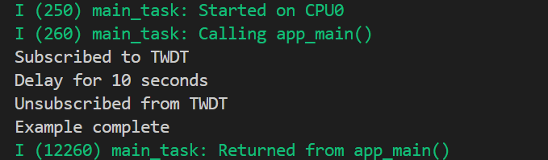
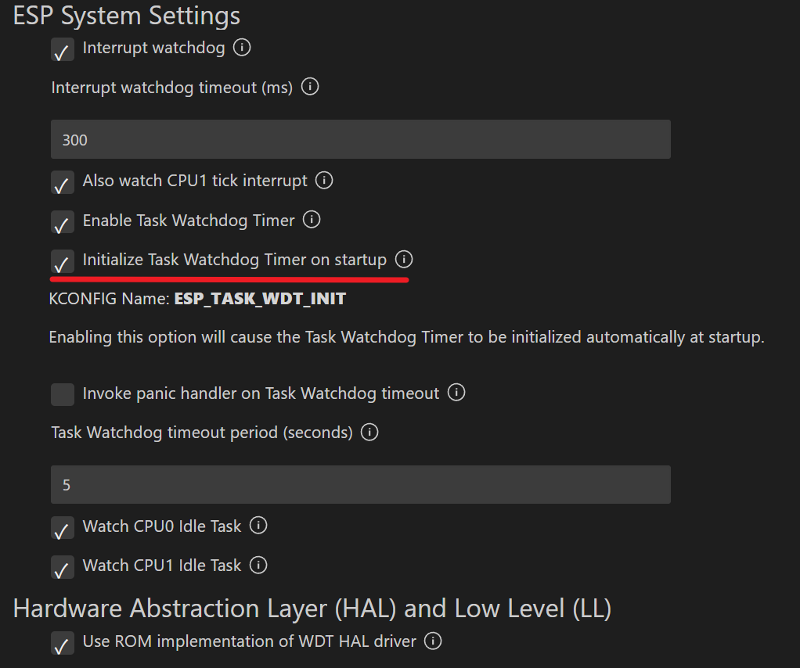

# Task Watchdog 任务看门狗

## 粗略阅读README文档

文档简介示例演示如何使用任务监视定时器（TWDT）。包括初始化和取消初始化，订阅和取消订阅TWDT的任务和用户，任务和用户如何重置TEDT

使用演示和示例输出

## 构建、烧录和示例输出

* 选择目标芯片
* 选择端口号
* 选择烧录方式
* 点击**构建、烧录和监视**
  

## 代码分析

### 头文件和宏定义

除常规头文件之外，跟看门狗有关的文件为`"esp_task_wdt.h"`，宏定义看门狗超时时长，任务重置（相当于给看门狗喂食）时长和总任务延时时长

```c
#include "esp_task_wdt.h"

#define TWDT_TIMEOUT_MS         3000
#define TASK_RESET_PERIOD_MS    2000
#define MAIN_DELAY_MS           10000
```

### app_main函数

1. `#if` 判断`CONFIG_ESP_TASK_WDT_INIT`配置项是否启用，配置项决定看门狗是否自动初始化。具体功能如图
2. 如果没有启用，进行`esp_task_wdt_config_t` 结构体配置
   * `timeout_ms` 超时持续时间
   * `idle_core_mask` 空闲任务应在初始化时订阅的核心位掩码（采用减1把各项都置1）
   * `trigger_panic` 超时时触发死机
3. `esp_task_wdt_init` 函数进行初始化
4. `xTaskCreatePinnedToCore` 把任务创建到核0上，最大2048字节堆栈动态分配，获取当前任务的句柄，优先级为10（越大越高）
5. `pdMS_TO_TICKS`等待主任务延时
6. `ulTaskNotifyTake`延时后等待到达当前任务的任务通知
7. `printf("Example complete\n");`有任务通知进行反初始化和任务完成

```c
void app_main(void)
{
#if !CONFIG_ESP_TASK_WDT_INIT
    // If the TWDT was not initialized automatically on startup, manually intialize it now
    esp_task_wdt_config_t twdt_config = {
        .timeout_ms = TWDT_TIMEOUT_MS,
        .idle_core_mask = (1 << CONFIG_FREERTOS_NUMBER_OF_CORES) - 1,    // Bitmask of all cores
        .trigger_panic = false,
    };
    ESP_ERROR_CHECK(esp_task_wdt_init(&twdt_config));
    printf("TWDT initialized\n");
#endif // CONFIG_ESP_TASK_WDT_INIT

    // Create a task
    run_loop = true;
    xTaskCreatePinnedToCore(task_func, "task", 2048, xTaskGetCurrentTaskHandle(), 10, NULL, 0);

    // Let the created task run for a while
    printf("Delay for %d seconds\n", MAIN_DELAY_MS/1000);
    vTaskDelay(pdMS_TO_TICKS(MAIN_DELAY_MS));

    // Stop the created task
    run_loop = false;
    ulTaskNotifyTake(pdTRUE, portMAX_DELAY);

#if !CONFIG_ESP_TASK_WDT_INIT
    // If we manually initialized the TWDT, deintialize it now
    ESP_ERROR_CHECK(esp_task_wdt_deinit());
    printf("TWDT deinitialized\n");
#endif // CONFIG_ESP_TASK_WDT_INIT
    printf("Example complete\n");
}
```

### 任务函数

1. `esp_task_wdt_add(NULL)`将本任务订阅到TWDT，`esp_task_wdt_status(NULL)`检查订阅状态
2. `esp_task_wdt_add_user`订阅TWDT的任意用户，返回添加的用户句柄
3. 循环中调用`esp_task_wdt_reset`和` esp_task_wdt_reset_user(用户句柄)`进行喂看门狗（即在主任务延时过程中确保整个程序不崩溃）
4. `esp_task_wdt_delete_user` `esp_task_wdt_delete` 删除用户和任务订阅
5. `xTaskNotifyGive`发送任务通知（让主任务继续）

```c
void task_func(void *arg)
{
    // Subscribe this task to TWDT, then check if it is subscribed
    ESP_ERROR_CHECK(esp_task_wdt_add(NULL));
    ESP_ERROR_CHECK(esp_task_wdt_status(NULL));

    // Subscribe func_a and func_b as users of the the TWDT
    ESP_ERROR_CHECK(esp_task_wdt_add_user("func_a", &func_a_twdt_user_hdl));
    ESP_ERROR_CHECK(esp_task_wdt_add_user("func_b", &func_b_twdt_user_hdl));

    printf("Subscribed to TWDT\n");

    while (run_loop) {
        // Reset the task and each user periodically
        /*
        Note: Comment out any one of the calls below to trigger the TWDT
        */
        esp_task_wdt_reset();
        func_a();
        func_b();

        vTaskDelay(pdMS_TO_TICKS(TASK_RESET_PERIOD_MS));
    }

    // Unsubscribe this task, func_a, and func_b
    ESP_ERROR_CHECK(esp_task_wdt_delete_user(func_a_twdt_user_hdl));
    ESP_ERROR_CHECK(esp_task_wdt_delete_user(func_b_twdt_user_hdl));
    ESP_ERROR_CHECK(esp_task_wdt_delete(NULL));

    printf("Unsubscribed from TWDT\n");

    // Notify main task of deletion
    xTaskNotifyGive((TaskHandle_t)arg);
    vTaskDelete(NULL);
}
```

> 在`func_a` `func_b`中，只是对用户订阅的看门狗进行喂食，示例说明可以在函数中进行更加精细和针对不同模块的操作。笔者不对两个函数进行分析

## 总结

看门狗的使用也比较简单，甚至在开启特定配置后不用自行初始化。但看门狗建议单独配置高优先级的任务进行处理，可以订阅用户进行更加具体功能的订阅。
