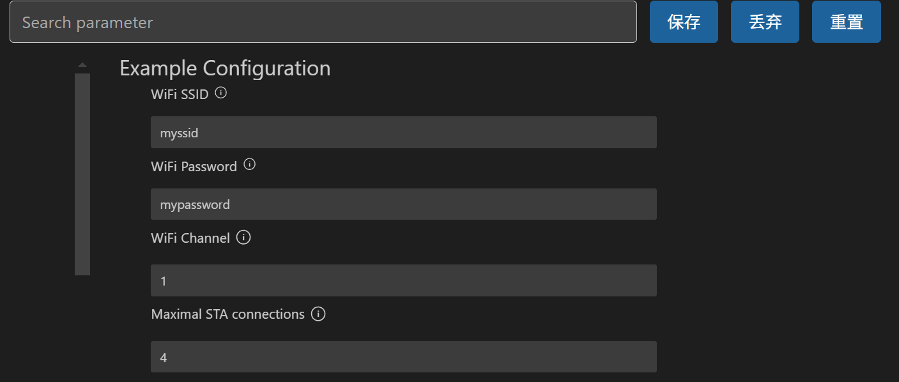
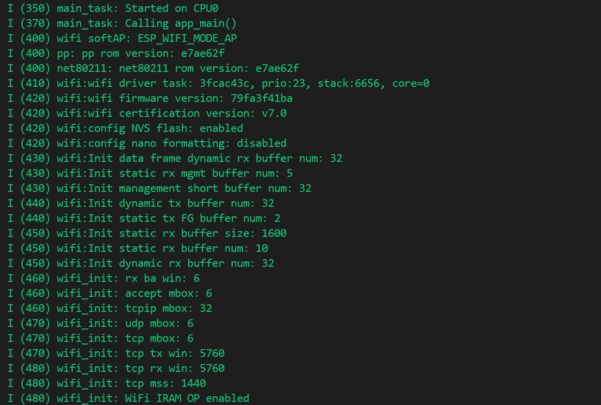
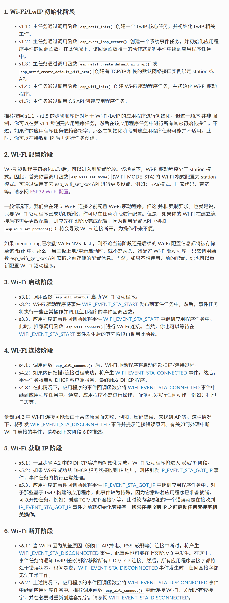

# softAP 软路由模式（充当无线接入点）

## 粗略阅读README文档

文档简介说明该例程演示**WiFi SoftAP**功能充当WiFi接入点

打开配置菜单配置

* WiFi SSID
* WiFi password

示例输出

---

## 构建烧录监视

* 选择**芯片型号**(*遇到报错删掉bulid文件再尝试*)
* 选择**端口号**
* 按照文件配置项目WiFi(*由于此处作WiFi接入点，可以随意配置*)

* 点击**构建、烧录和监视**
* 窗口监视如下



## 监视输出分析

> 笔者水平有限，只能结合ai把部分输出进行翻译解释

* `wifi softAP` 输出： WiFi模式为**ESP_WIFI_MODE_AP**接入点模式
* `wifi` 输出：
  * wifi驱动详细信息 `wifi driver task: 3fcac43c, prio:23, stack:6656, core=0`
  * wifi固件版本 `wifi firmware version: 79fa3f41ba`
  * wifi证书版本 `wifi certification version: v7.0`
  * 使能 `NVS falsh`(*非易失性储存库*)
  * 不使能 `nano formatting`(*nano格式化已禁用*)
  * 初始化**rx**和**tx**的buffer(*寄存器*)
  * 初始化其他信息，包括`accept`、`tcpip`、`udp`、`tcp` (*笔者对于网络协议等了解不多，故暂时不作解释*)
  * `mode: softAP(28:37:2f:88:5a:9d)` 表示WiFi模式为 **softAP** ，括号内为MAC地址(*MAC地址是网络设备的唯一标识符，用于在网络中识别设备*)
  * `Total power save buffer number: 16` 总共16个 **电源节省缓冲区** ,用于在设备进入低功耗模式时保存数据。
  * `Init max length of beacon: 752/752` 表示初始化了 **信标帧的最大长度** 为752字节(信标帧是接入点（AP）定期发送的广播帧，用于通知周围的设备其存在。信标帧中包含了SSID、信道等信息)
* `wifi softAP` 输出：初始化完成。**SSID** 为 `myssid` , **password** 为`mypassword`,**channel(信道)** 为 `1`
* 表示 **DHCP** 服务器在接口 **WIFI_AP_DEF** 上启动，IP地址为 `192.168.4.1` 。
* **station**状态输出：`82:91:7b:e5:96:1d`加入，即进行wifi连接，`AID=1`表示有一个设备
* **DHCP** 服务分配IP为 `192.168.4.2`
* `wifi softAP: station 82:91:7b:e5:96:1d leave, AID=1, reason=3`本行代码未在截图中，意思是该设备断开连接，原因代码为 `3`

---

### app_main主函数

在main函数中先进行NVS的配置，然后调用`wifi_init-softAP`函数进行启用

> NVS 是非易失性存储，通俗理解就是断电以后数据不丢失，主要用于存储配置信息。*可以有效地保存和管理WiFi连接所需的信息，简化设备配网流程，提高用户体验，并确保数据的持久化和安全性。*

```c
void app_main(void)
{
    //Initialize NVS
    esp_err_t ret = nvs_flash_init();
    if (ret == ESP_ERR_NVS_NO_FREE_PAGES || ret == ESP_ERR_NVS_NEW_VERSION_FOUND) {
      ESP_ERROR_CHECK(nvs_flash_erase());
      ret = nvs_flash_init();
    }
    ESP_ERROR_CHECK(ret);

    ESP_LOGI(TAG, "ESP_WIFI_MODE_AP");
    wifi_init_softap();
}
```

## 预定义和静态函数

采用 **define** 将项目配置中的数据导入程序，定义了wifi **事件处理** 的静态函数

```c
#define EXAMPLE_ESP_WIFI_SSID      CONFIG_ESP_WIFI_SSID
#define EXAMPLE_ESP_WIFI_PASS      CONFIG_ESP_WIFI_PASSWORD
#define EXAMPLE_ESP_WIFI_CHANNEL   CONFIG_ESP_WIFI_CHANNEL
#define EXAMPLE_MAX_STA_CONN       CONFIG_ESP_MAX_STA_CONN

static const char *TAG = "wifi softAP";

static void wifi_event_handler(void* arg, esp_event_base_t event_base,
                                    int32_t event_id, void* event_data)
{
    if (event_id == WIFI_EVENT_AP_STACONNECTED) {
        wifi_event_ap_staconnected_t* event = (wifi_event_ap_staconnected_t*) event_data;
        ESP_LOGI(TAG, "station "MACSTR" join, AID=%d",
                 MAC2STR(event->mac), event->aid);
    } else if (event_id == WIFI_EVENT_AP_STADISCONNECTED) {
        wifi_event_ap_stadisconnected_t* event = (wifi_event_ap_stadisconnected_t*) event_data;
        ESP_LOGI(TAG, "station "MACSTR" leave, AID=%d, reason=%d",
                 MAC2STR(event->mac), event->aid, event->reason);
    }
}
```

函数实现WiFi事件连接`STACONNECTED`和断开连接`STADISCONNECTED`，然后把event写为对应类型的事件，后进行`ESP_LOGI`信息输出

## 初始化函数

> esp官方编程指南 [WiFi驱动](https://docs.espressif.com/projects/esp-idf/zh_CN/stable/esp32/api-guides/wifi.html#id4)

```c

void wifi_init_softap(void)
{
    // WiFi初始化阶段
    ESP_ERROR_CHECK(esp_netif_init());
    ESP_ERROR_CHECK(esp_event_loop_create_default());
    esp_netif_create_default_wifi_ap();

    wifi_init_config_t cfg = WIFI_INIT_CONFIG_DEFAULT();
    ESP_ERROR_CHECK(esp_wifi_init(&cfg));

    //WiFi事件注册
    ESP_ERROR_CHECK(esp_event_handler_instance_register(WIFI_EVENT,
                                                        ESP_EVENT_ANY_ID,
                                                        &wifi_event_handler,
                                                        NULL,
                                                        NULL));

    wifi_config_t wifi_config = {
        .ap = {
            .ssid = EXAMPLE_ESP_WIFI_SSID,
            .ssid_len = strlen(EXAMPLE_ESP_WIFI_SSID),
            .channel = EXAMPLE_ESP_WIFI_CHANNEL,
            .password = EXAMPLE_ESP_WIFI_PASS,
            .max_connection = EXAMPLE_MAX_STA_CONN,
#ifdef CONFIG_ESP_WIFI_SOFTAP_SAE_SUPPORT
            .authmode = WIFI_AUTH_WPA3_PSK,
            .sae_pwe_h2e = WPA3_SAE_PWE_BOTH,
#else /* CONFIG_ESP_WIFI_SOFTAP_SAE_SUPPORT */
            .authmode = WIFI_AUTH_WPA2_PSK,
#endif
            .pmf_cfg = {
                    .required = true,
            },
        },
    };
    if (strlen(EXAMPLE_ESP_WIFI_PASS) == 0) {
        wifi_config.ap.authmode = WIFI_AUTH_OPEN;
    }

    //WiFi配置和启动
    ESP_ERROR_CHECK(esp_wifi_set_mode(WIFI_MODE_AP));
    ESP_ERROR_CHECK(esp_wifi_set_config(WIFI_IF_AP, &wifi_config));
    ESP_ERROR_CHECK(esp_wifi_start());

    ESP_LOGI(TAG, "wifi_init_softap finished. SSID:%s password:%s channel:%d",
             EXAMPLE_ESP_WIFI_SSID, EXAMPLE_ESP_WIFI_PASS, EXAMPLE_ESP_WIFI_CHANNEL);
}
```



WiFi配置基本过程如上，基本都采用的默认配置。**ESP_ERROR_CHECK** 函数用于检测配置函数是否正常(*大部分函数都有返回值`ESP_OK`或其他，`ESP_OK`为正常，其他为不正常*)

官方指南中的4-6在上段程序中没有具体提及，中间部分程序为设置`wifi_config`这一结构体并对是否设置密码(password)进行特殊处理。

`esp_event_handler_instance_register`为事件实例注册函数，把`WIFI_EVENT`和`wifi_event_handler`事件处理函数进行绑定，在产生事件时调用函数进行处理。

> 具体过程强烈建议查看官方编程文档，特别是 **ESP32 Wi-Fi station 一般情况** 中的示例图

---

## softAP模式作用

搜索得到的softAP模式作用如下:

>
>SoftAP（软件接入点）模式是ESP8266/ESP32等WiFi模块提供的一种工作模式，它允许模块充当一个无线接入点（AP），使得其他WiFi设备（如智能手机、平板电脑、笔记本电脑等）可以连接到该模块并进行通信。以下是SoftAP模式的具体作用和应用场景：
>
> ### 1. 网络接入
>
>SoftAP模式允许模块为连接的设备提供一个无线网络接入点，使得这些设备可以通过模块访问外部网络（如互联网）。这在没有现成的WiFi网络或需要扩展现有网络覆盖范围时非常有用。
>
> ### 2. 设备间通信
>
> 在没有外部网络的情况下，SoftAP模式可以用于建立一个本地无线网络，使得连接到同一SoftAP的设备之间可以进行数据交换和通信。这对于构建小型局域网或进行设备间协作非常有用。
>
> ### 3. 配置和调试
>
> SoftAP模式常用于设备的初始配置和调试。在设备首次启动或需要重新配置时，用户可以通过连接到SoftAP并访问一个Web界面来输入网络配置信息，如WiFi SSID和密码。
>
> ### 4. 数据采集和控制
>
> 在物联网（IoT）应用中，SoftAP模式可以用于从传感器或其他设备收集数据，或者向它们发送控制指令。例如，一个连接到SoftAP的智能手机可以用于读取连接到同一SoftAP的温湿度传感器的数据。
>
> ### 5. 临时网络解决方案
>
> 在需要快速建立一个临时网络的场景下，如会议、展览或户外活动，SoftAP模式可以提供一个灵活的解决方案，无需依赖现有的网络基础设施。
>
> ### 6. 网络中继和桥接
>
> SoftAP模式还可以用于构建网络中继或桥接设备，将一个网络的信号转换并扩展到另一个网络。例如，可以将一个有线网络转换为无线网络，或者将一个WiFi信号桥接到另一个WiFi网络。
>
> ### 7. 移动热点
>
> SoftAP模式可以用于创建一个移动热点，使得多个设备可以通过一个移动数据连接（如4G/5G）共享互联网访问。
>
> ### 8. 安全性和隐私
>
> 在某些情况下，使用SoftAP模式可以提供更高级别的安全性和隐私保护。例如，在公共场合，用户可以创建自己的SoftAP网络，而不是连接到可能不安全的公共WiFi网络。
>
> 总的来说，SoftAP模式提供了一种灵活的网络解决方案，可以用于多种应用场景，从简单的设备间通信到复杂的网络管理和数据采集。

---

## 总结

对esp-idf的 **softAP** 例程进行了尝试，具体分析理解了监视窗口的输出信息，了解了 **WiFi配置** 的基本过程，但本例程可以修改的东西较少，大部分都是**基础性或者默认的配置**，可能更多的需要理*解记忆和熟练*。另外，对于**官方的编程指南**，此次接触的只是很少一部分，后续需要加深理解。