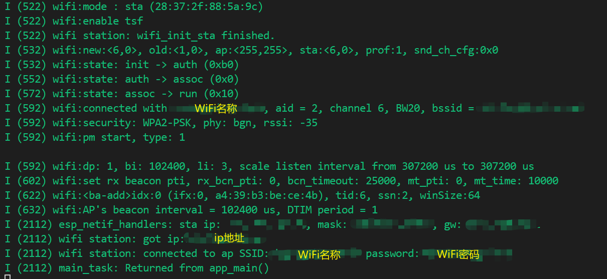
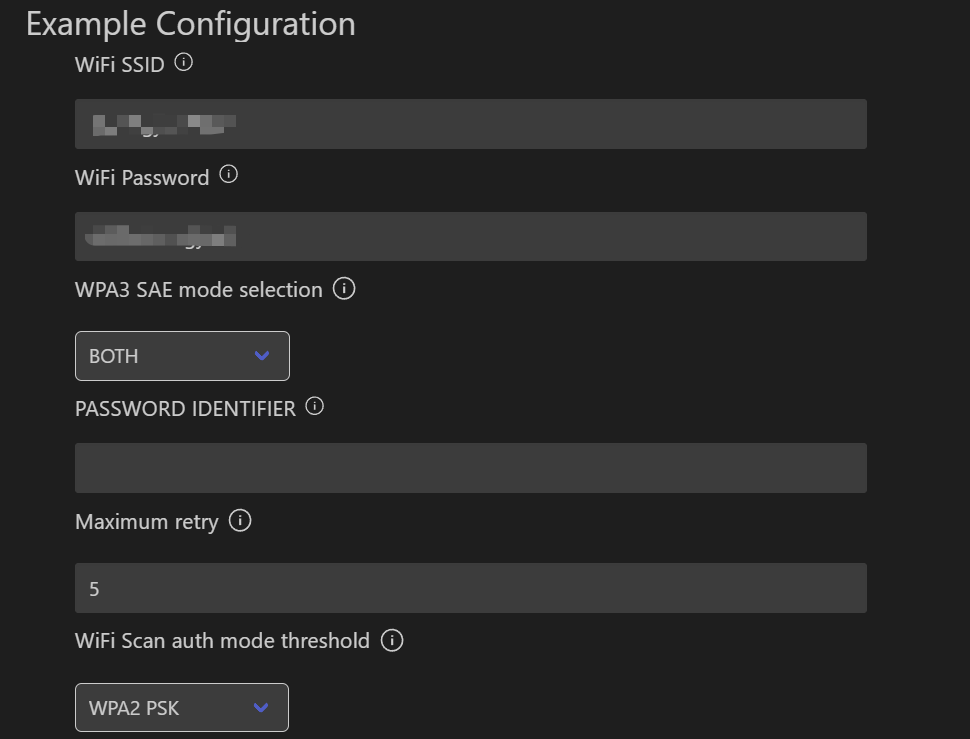

# station 站功能

## 粗略阅读README文档

文档简介说明该例程使用 **WiFi站**功能去连接到接入点(连接到AP)

需要**menuconfig**配置WiFi`SSID`和`password`

构架烧录和示例输出

---

## 构建烧录和输出

* 选择**芯片型号**
* 选择**端口号**
* 修改**配置文件** (*该文件可修改值较为复杂，根据README文件只修改SSID和password*)
* 点击**构建、烧录和监视**
* 窗口监视显示如下(*已隐藏部分隐私信息*)


## 监视输出分析

> 上图监视与 **softAP** 相同部分此处并未展示，故笔者下述分析只包括上图输出部分
> 由于笔者水平有限，下方说明借助ai功能，只作部分解释

`wifi` 输出：

* 模式：`sta`站模式，附带对应MAC码
* 使能**TSF**(Time Sync Function)，时间戳功能
* `state`状态
  * `init -> auth (0xb0)` 从初始化变为认证
  * `auth -> assoc (0x0)` 从认证变为关联
  * `assoc -> run (0x10)` 从关联变为运行
  * 上述是esp在进行wifi连接的步骤
* `connected` 连接成功，连接设备2台，通道6 ...
* `security: WPA2-PSK, phy: bgn, rssi: -35` 表示使用的加密方式为WPA2-PSK，物理层协议为bgn（即802.11b/g/n），信号强度为-35dBm
* `pm start` 表示电源管理已启用，模式为1
* WiFi信息*看不太懂*，不作过多解释
* `sta ip: ,mask: ,gw: `显示station模式下获取的IP地址，子网掩码，网关
  
`wifi station` 输出：

* 获取到IP：`xxx.xxx.xxx.xxx`
* 连接到AP：名称(*SSID*)为`xx`,密码(*password*)为`xxxx`

main函数结束，`Returned from app_main()`

---

## 代码分析

### app_main()

main函数中初始化了NVS(*非易失性储存*)，然后进行**WiFi sta**模式的初始化

```c
void app_main(void)
{
    //Initialize NVS
    esp_err_t ret = nvs_flash_init();
    if (ret == ESP_ERR_NVS_NO_FREE_PAGES || ret == ESP_ERR_NVS_NEW_VERSION_FOUND) {
      ESP_ERROR_CHECK(nvs_flash_erase());
      ret = nvs_flash_init();
    }
    ESP_ERROR_CHECK(ret);

    ESP_LOGI(TAG, "ESP_WIFI_MODE_STA");
    wifi_init_sta();
}
```

### 宏定义和静态参数、函数

最前面通过 **difine** 宏定义把**menuconfig**中的配置导入，针对不同模式进行if判断并进行不同的定义。
然后定义FREERTOS的事件组变量，设置 `CONNECT`和 `FAIL`的事件位。
最后定义事件函数

```c
#define EXAMPLE_ESP_WIFI_SSID      CONFIG_ESP_WIFI_SSID
#define EXAMPLE_ESP_WIFI_PASS      CONFIG_ESP_WIFI_PASSWORD
#define EXAMPLE_ESP_MAXIMUM_RETRY  CONFIG_ESP_MAXIMUM_RETRY
//如果是WPA3扫描身份验证模式
#if CONFIG_ESP_WPA3_SAE_PWE_HUNT_AND_PECK
#define ESP_WIFI_SAE_MODE WPA3_SAE_PWE_HUNT_AND_PECK
#define EXAMPLE_H2E_IDENTIFIER ""
#elif CONFIG_ESP_WPA3_SAE_PWE_HASH_TO_ELEMENT
#define ESP_WIFI_SAE_MODE WPA3_SAE_PWE_HASH_TO_ELEMENT
#define EXAMPLE_H2E_IDENTIFIER CONFIG_ESP_WIFI_PW_ID
#elif CONFIG_ESP_WPA3_SAE_PWE_BOTH
#define ESP_WIFI_SAE_MODE WPA3_SAE_PWE_BOTH
#define EXAMPLE_H2E_IDENTIFIER CONFIG_ESP_WIFI_PW_ID
#endif
//如果是开发身份验证模式
#if CONFIG_ESP_WIFI_AUTH_OPEN
#define ESP_WIFI_SCAN_AUTH_MODE_THRESHOLD WIFI_AUTH_OPEN
#elif CONFIG_ESP_WIFI_AUTH_WEP
#define ESP_WIFI_SCAN_AUTH_MODE_THRESHOLD WIFI_AUTH_WEP
#elif CONFIG_ESP_WIFI_AUTH_WPA_PSK
#define ESP_WIFI_SCAN_AUTH_MODE_THRESHOLD WIFI_AUTH_WPA_PSK
#elif CONFIG_ESP_WIFI_AUTH_WPA2_PSK
#define ESP_WIFI_SCAN_AUTH_MODE_THRESHOLD WIFI_AUTH_WPA2_PSK
#elif CONFIG_ESP_WIFI_AUTH_WPA_WPA2_PSK
#define ESP_WIFI_SCAN_AUTH_MODE_THRESHOLD WIFI_AUTH_WPA_WPA2_PSK
#elif CONFIG_ESP_WIFI_AUTH_WPA3_PSK
#define ESP_WIFI_SCAN_AUTH_MODE_THRESHOLD WIFI_AUTH_WPA3_PSK
#elif CONFIG_ESP_WIFI_AUTH_WPA2_WPA3_PSK
#define ESP_WIFI_SCAN_AUTH_MODE_THRESHOLD WIFI_AUTH_WPA2_WPA3_PSK
#elif CONFIG_ESP_WIFI_AUTH_WAPI_PSK
#define ESP_WIFI_SCAN_AUTH_MODE_THRESHOLD WIFI_AUTH_WAPI_PSK
#endif

/* FreeRTOS event group to signal when we are connected*/
static EventGroupHandle_t s_wifi_event_group;

/* The event group allows multiple bits for each event, but we only care about two events:
 * - we are connected to the AP with an IP
 * - we failed to connect after the maximum amount of retries */
#define WIFI_CONNECTED_BIT BIT0
#define WIFI_FAIL_BIT      BIT1

static const char *TAG = "wifi station";

static int s_retry_num = 0;


static void event_handler(void* arg, esp_event_base_t event_base,
                                int32_t event_id, void* event_data)
{
    if (event_base == WIFI_EVENT && event_id == WIFI_EVENT_STA_START) {
        esp_wifi_connect();
    } else if (event_base == WIFI_EVENT && event_id == WIFI_EVENT_STA_DISCONNECTED) {
        if (s_retry_num < EXAMPLE_ESP_MAXIMUM_RETRY) {
            esp_wifi_connect();
            s_retry_num++;
            ESP_LOGI(TAG, "retry to connect to the AP");
        } else {
            xEventGroupSetBits(s_wifi_event_group, WIFI_FAIL_BIT);
        }
        ESP_LOGI(TAG,"connect to the AP fail");
    } else if (event_base == IP_EVENT && event_id == IP_EVENT_STA_GOT_IP) {
        ip_event_got_ip_t* event = (ip_event_got_ip_t*) event_data;
        ESP_LOGI(TAG, "got ip:" IPSTR, IP2STR(&event->ip_info.ip));
        s_retry_num = 0;
        xEventGroupSetBits(s_wifi_event_group, WIFI_CONNECTED_BIT);
    }
}
```

> 对于事件组，笔者并无多少了解，故不作具体解释，后续再进行具体学习

事件函数基本同 **softAP** ，此处的事件判断更复杂。`START` 、 `DISCONNECTED` 、 `GOT_IP` 等事件都有对应的处理方式，包括WiFi连接，重连，IP获取，报错等。特别的，`xEventGroupSetBits`用于设置事件组中的**事件位**，*用于FREEROTS架构下的任务间控制协调*

### 初始化函数

初始化函数流程基本与 **softAP** 相同，都有对WiFi进行初始化配置，事件函数注册，WiFi配置，WiFi启动 [编程指南](https://docs.espressif.com/projects/esp-idf/zh_CN/stable/esp32/api-guides/wifi.html)

```c
void wifi_init_sta(void)
{
    s_wifi_event_group = xEventGroupCreate();

    ESP_ERROR_CHECK(esp_netif_init());

    ESP_ERROR_CHECK(esp_event_loop_create_default());
    esp_netif_create_default_wifi_sta();

    wifi_init_config_t cfg = WIFI_INIT_CONFIG_DEFAULT();
    ESP_ERROR_CHECK(esp_wifi_init(&cfg));

    esp_event_handler_instance_t instance_any_id;
    esp_event_handler_instance_t instance_got_ip;
    ESP_ERROR_CHECK(esp_event_handler_instance_register(WIFI_EVENT,
                                                        ESP_EVENT_ANY_ID,
                                                        &event_handler,
                                                        NULL,
                                                        &instance_any_id));
    ESP_ERROR_CHECK(esp_event_handler_instance_register(IP_EVENT,
                                                        IP_EVENT_STA_GOT_IP,
                                                        &event_handler,
                                                        NULL,
                                                        &instance_got_ip));

    wifi_config_t wifi_config = {
        .sta = {
            .ssid = EXAMPLE_ESP_WIFI_SSID,
            .password = EXAMPLE_ESP_WIFI_PASS,
            /* Authmode threshold resets to WPA2 as default if password matches WPA2 standards (password len => 8).
             * If you want to connect the device to deprecated WEP/WPA networks, Please set the threshold value
             * to WIFI_AUTH_WEP/WIFI_AUTH_WPA_PSK and set the password with length and format matching to
             * WIFI_AUTH_WEP/WIFI_AUTH_WPA_PSK standards.
             */
            .threshold.authmode = ESP_WIFI_SCAN_AUTH_MODE_THRESHOLD,
            .sae_pwe_h2e = ESP_WIFI_SAE_MODE,
            .sae_h2e_identifier = EXAMPLE_H2E_IDENTIFIER,
        },
    };
    ESP_ERROR_CHECK(esp_wifi_set_mode(WIFI_MODE_STA) );
    ESP_ERROR_CHECK(esp_wifi_set_config(WIFI_IF_STA, &wifi_config) );
    ESP_ERROR_CHECK(esp_wifi_start() );

    ESP_LOGI(TAG, "wifi_init_sta finished.");

    /* Waiting until either the connection is established (WIFI_CONNECTED_BIT) or connection failed for the maximum
     * number of re-tries (WIFI_FAIL_BIT). The bits are set by event_handler() (see above) */
    EventBits_t bits = xEventGroupWaitBits(s_wifi_event_group,
            WIFI_CONNECTED_BIT | WIFI_FAIL_BIT,
            pdFALSE,
            pdFALSE,
            portMAX_DELAY);

    /* xEventGroupWaitBits() returns the bits before the call returned, hence we can test which event actually
     * happened. */
    if (bits & WIFI_CONNECTED_BIT) {
        ESP_LOGI(TAG, "connected to ap SSID:%s password:%s",
                 EXAMPLE_ESP_WIFI_SSID, EXAMPLE_ESP_WIFI_PASS);
    } else if (bits & WIFI_FAIL_BIT) {
        ESP_LOGI(TAG, "Failed to connect to SSID:%s, password:%s",
                 EXAMPLE_ESP_WIFI_SSID, EXAMPLE_ESP_WIFI_PASS);
    } else {
        ESP_LOGE(TAG, "UNEXPECTED EVENT");
    }
}
```

值得一提的是此处的事件注册与事件函数相对应，用到了 `WIFI_EVENT` 和 `IP_EVENT` ,分别进行事件处理。
还有最后一段事件组的使用，此处不过多解释

## 配置文件其他配置项

> 在**menuconfig**文件中，除了本篇中修改的 **SSID** 和 **password**，还有其他配置项，笔者从网上进行了一定的搜索了解 [ESP32WiFi配置](https://docs.espressif.com/projects/esp-idf/zh_CN/stable/esp32/api-guides/wifi.html#id37)



先说结论，一般情况下不需要修改其他参数，可以修改 *Maximum retry* 。

对于`WiFi Scan...`,可选项为各种协议

* *WEP/WPA 安全模式在 IEEE802.11-2016 协议中已弃用，建议**不要使用**。*
* *WPA2-Enterprise 是企业无线网络的安全认证机制。*，意味着目前我们使用的**绝大部分无线网络**都有采用这种认证方式
* *WPA3（Wi-Fi Protected Access 3，第三代Wi-Fi访问保护）是Wi-Fi联盟组织于2018年发布的新一代Wi-Fi（WiFi）加密协议，它对WPA2进行了改进，增加了许多新的功能，为用户和Wi-Fi网络之间的数据传输提供更加强大的加密保护。* 但 **不确定有多少使用** 
* *WAPI与WIFi一样，是一种无线网标准，只不过WiFi由国外主导，WAPI是国产。两者一个最明显的差异是WAPI采用双向认证，WIFi单向认证。* 参考 [知乎回答](https://www.zhihu.com/question/297654008) WAPI目前并**没有什么存在感**

对于 `WPA3 SEA...` 和 `PASSWORD IDENTIFIER` , 前者是**WPA3**模式的选择，后者是在指定 `H2E`模式下的一种特殊参数，此处不作深入追究

## 总结

本次例程中尝试了用ESP连接现有WiFi，成功连接。WiFi算是ESP的一大特点，但就本例程中的简单连接只是**初步尝试**，具有很多**限制和约束**，后续还会尝试更多更复杂的WiFi使用。在本例还了解了更多WiFi配置相关内容，包括加密协议等。
