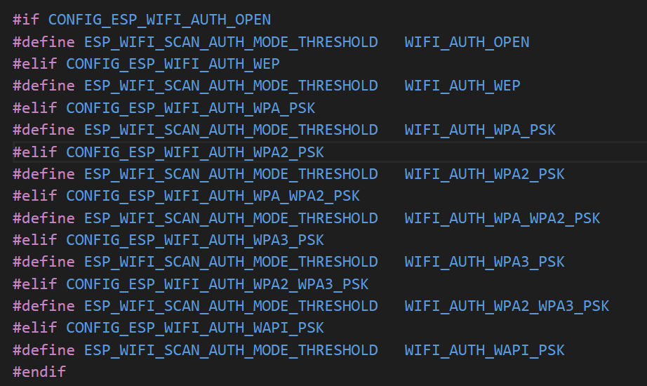

# Wi-Fi SoftAP & Station WiFi AP和STA并存

## 粗略阅读README文档

文档简介示例演示如何使用ESP WiFi驱动程序同时使用SoftAP和Station功能。

如何使用示例，构建烧录和示例输出

## 代码分析

### kconfig配置

* 主目录`"Example Configuration"`
* 子目录中各种项的配置可见帮助，笔者记录是方便使用时进行复制和参考
* 类型后面的字符串是提示描述
* `comment`用于将用户注释添加到条目中
* `choice` 可选的WiFi身份验证，以互斥的布尔值配合文件中预编译定义
* `prompt`相当于提示描述，原来写在类型后，关键字省略

```kconfig
menu "Example Configuration"

    menu "SoftAP Configuration"
        comment "SoftAP Configuration"

        config ESP_WIFI_AP_SSID
            string "WiFi AP SSID"
            default "myssid"
            help
                SSID (network name) of the AP for the example to connect to.

        config ESP_WIFI_AP_PASSWORD
            string "WiFi AP Password"
            default "mypassword"
            help
                WiFi password of the AP for the example to use.

        config ESP_WIFI_AP_CHANNEL
            int "WiFi AP Channel"
            range 1 14
            default 1
            help
                WiFi channel (network channel) of the AP for the example to use.

        config ESP_MAX_STA_CONN_AP
            int "Maximal STA connections"
            default 4
            help
                Max number of the STA connects to AP.
    endmenu

    menu "STA Configuration"
        comment "STA Configuration"

        config ESP_WIFI_REMOTE_AP_SSID
            string "WiFi Remote AP SSID"
            default "otherapssid"
            help
                SSID (network name) for the example's sta to connect to.

        config ESP_WIFI_REMOTE_AP_PASSWORD
            string "WiFi Remote AP Password"
            default "otherappassword"
            help
                WiFi password for the example to use.

        config ESP_MAXIMUM_STA_RETRY
            int "Maximum retry"
            default 5
            help
                Set the maximum retry value to prevent the station from continuously
                attempting to reconnect to the Access Point (AP) when the AP doesn't exist.

        choice ESP_WIFI_SCAN_AUTH_MODE_THRESHOLD
            prompt "WiFi Scan auth mode threshold"
            default ESP_WIFI_AUTH_WPA2_PSK
            help
                The weakest authmode to accept in the scan mode.
                This value defaults to ESP_WIFI_AUTH_WPA2_PSK in case password is present
                and ESP_WIFI_AUTH_OPEN is used. Please select ESP_WIFI_AUTH_WEP / ESP_WIFI_AUTH_WPA_PSK
                in case AP is operating in WEP / WPA mode.

            config ESP_WIFI_AUTH_OPEN
                bool "OPEN"
            config ESP_WIFI_AUTH_WEP
                bool "WEP"
            config ESP_WIFI_AUTH_WPA_PSK
                bool "WPA PSK"
            config ESP_WIFI_AUTH_WPA2_PSK
                bool "WPA2 PSK"
            config ESP_WIFI_AUTH_WPA_WPA2_PSK
                bool "WPA/WPA2 PSK"
            config ESP_WIFI_AUTH_WPA3_PSK
                bool "WPA3 PSK"
            config ESP_WIFI_AUTH_WPA2_WPA3_PSK
                bool "WPA2/WPA3 PSK"
            config ESP_WIFI_AUTH_WAPI_PSK
                bool "WAPI PSK"
        endchoice

    endmenu
endmenu
```

### app_main函数

宏定义事件组的事件位

```c
/* FreeRTOS event group to signal when we are connected/disconnected */
static EventGroupHandle_t s_wifi_event_group;

/* The event group allows multiple bits for each event, but we only care about two events:
 * - we are connected to the AP with an IP
 * - we failed to connect after the maximum amount of retries */
#define WIFI_CONNECTED_BIT BIT0
#define WIFI_FAIL_BIT      BIT1
```

1. WiFi驱动配置，初始化lwip和创建事件循环
2. NVS初始化
3. 创建事件组，将WiFi事件和处理函数进行绑定(event_base,event_id,函数,传入参数,)
4. `WIFI_INIT_CONFIG_DEFAULT`宏函数进行WiFi配置并初始化驱动程序`esp_wifi_init`
5. 设置模式为APSTA
6. 自定义函数进行ap和sta初始化，返回`esp_netif_t`类型变量
7. 启动WiFi`esp_wifi_start`
8. `xEventGroupWaitBits`等待事件位被置位
9. `(bits & WIFI_CONNECTED_BIT)`判断连接到WiFi，把ESP AP的地址设为WiFi地址，作路由器作用
10. 将sta设为默认界面
11. `esp_netif_napt_enable`为ap设置napt（网络地址转换）

```c
void app_main(void)
{
    ESP_ERROR_CHECK(esp_netif_init());
    ESP_ERROR_CHECK(esp_event_loop_create_default());

    //Initialize NVS
    esp_err_t ret = nvs_flash_init();
    if (ret == ESP_ERR_NVS_NO_FREE_PAGES || ret == ESP_ERR_NVS_NEW_VERSION_FOUND) {
        ESP_ERROR_CHECK(nvs_flash_erase());
        ret = nvs_flash_init();
    }
    ESP_ERROR_CHECK(ret);

    /* Initialize event group */
    s_wifi_event_group = xEventGroupCreate();

    /* Register Event handler */
    ESP_ERROR_CHECK(esp_event_handler_instance_register(WIFI_EVENT,
                    ESP_EVENT_ANY_ID,
                    &wifi_event_handler,
                    NULL,
                    NULL));
    ESP_ERROR_CHECK(esp_event_handler_instance_register(IP_EVENT,
                    IP_EVENT_STA_GOT_IP,
                    &wifi_event_handler,
                    NULL,
                    NULL));

    /*Initialize WiFi */
    wifi_init_config_t cfg = WIFI_INIT_CONFIG_DEFAULT();
    ESP_ERROR_CHECK(esp_wifi_init(&cfg));

    ESP_ERROR_CHECK(esp_wifi_set_mode(WIFI_MODE_APSTA));

    /* Initialize AP */
    ESP_LOGI(TAG_AP, "ESP_WIFI_MODE_AP");
    esp_netif_t *esp_netif_ap = wifi_init_softap();

    /* Initialize STA */
    ESP_LOGI(TAG_STA, "ESP_WIFI_MODE_STA");
    esp_netif_t *esp_netif_sta = wifi_init_sta();

    /* Start WiFi */
    ESP_ERROR_CHECK(esp_wifi_start() );

    /*
     * Wait until either the connection is established (WIFI_CONNECTED_BIT) or
     * connection failed for the maximum number of re-tries (WIFI_FAIL_BIT).
     * The bits are set by event_handler() (see above)
     */
    EventBits_t bits = xEventGroupWaitBits(s_wifi_event_group,
                                           WIFI_CONNECTED_BIT | WIFI_FAIL_BIT,
                                           pdFALSE,
                                           pdFALSE,
                                           portMAX_DELAY);

    /* xEventGroupWaitBits() returns the bits before the call returned,
     * hence we can test which event actually happened. */
    if (bits & WIFI_CONNECTED_BIT) {
        ESP_LOGI(TAG_STA, "connected to ap SSID:%s password:%s",
                 EXAMPLE_ESP_WIFI_STA_SSID, EXAMPLE_ESP_WIFI_STA_PASSWD);
        softap_set_dns_addr(esp_netif_ap,esp_netif_sta);
    } else if (bits & WIFI_FAIL_BIT) {
        ESP_LOGI(TAG_STA, "Failed to connect to SSID:%s, password:%s",
                 EXAMPLE_ESP_WIFI_STA_SSID, EXAMPLE_ESP_WIFI_STA_PASSWD);
    } else {
        ESP_LOGE(TAG_STA, "UNEXPECTED EVENT");
        return;
    }

    /* Set sta as the default interface */
    esp_netif_set_default_netif(esp_netif_sta);

    /* Enable napt on the AP netif */
    if (esp_netif_napt_enable(esp_netif_ap) != ESP_OK) {
        ESP_LOGE(TAG_STA, "NAPT not enabled on the netif: %p", esp_netif_ap);
    }
}
```

### 模式初始化

1. `esp_netif_create_default_wifi_ap`创建默认ap指针
2. 进行`wifi_config_t`关于AP的配置
3. 如果没设置密码就把WiFi设为开放
4. `esp_wifi_set_config(WIFI_IF_AP, &wifi_ap_config)`设置ap模式配置
5. 返回创建的ap指针

```c
/* Initialize soft AP */
esp_netif_t *wifi_init_softap(void)
{
    esp_netif_t *esp_netif_ap = esp_netif_create_default_wifi_ap();

    wifi_config_t wifi_ap_config = {
        .ap = {
            .ssid = EXAMPLE_ESP_WIFI_AP_SSID,
            .ssid_len = strlen(EXAMPLE_ESP_WIFI_AP_SSID),
            .channel = EXAMPLE_ESP_WIFI_CHANNEL,
            .password = EXAMPLE_ESP_WIFI_AP_PASSWD,
            .max_connection = EXAMPLE_MAX_STA_CONN,
            .authmode = WIFI_AUTH_WPA2_PSK,
            .pmf_cfg = {
                .required = false,
            },
        },
    };

    if (strlen(EXAMPLE_ESP_WIFI_AP_PASSWD) == 0) {
        wifi_ap_config.ap.authmode = WIFI_AUTH_OPEN;
    }

    ESP_ERROR_CHECK(esp_wifi_set_config(WIFI_IF_AP, &wifi_ap_config));

    ESP_LOGI(TAG_AP, "wifi_init_softap finished. SSID:%s password:%s channel:%d",
             EXAMPLE_ESP_WIFI_AP_SSID, EXAMPLE_ESP_WIFI_AP_PASSWD, EXAMPLE_ESP_WIFI_CHANNEL);

    return esp_netif_ap;
}
```

sta配置基本一致，主要操作是进行配置和写入

```c
/* Initialize wifi station */
esp_netif_t *wifi_init_sta(void)
{
    esp_netif_t *esp_netif_sta = esp_netif_create_default_wifi_sta();

    wifi_config_t wifi_sta_config = {
        .sta = {
            .ssid = EXAMPLE_ESP_WIFI_STA_SSID,
            .password = EXAMPLE_ESP_WIFI_STA_PASSWD,
            .scan_method = WIFI_ALL_CHANNEL_SCAN,
            .failure_retry_cnt = EXAMPLE_ESP_MAXIMUM_RETRY,
            /* Authmode threshold resets to WPA2 as default if password matches WPA2 standards (password len => 8).
             * If you want to connect the device to deprecated WEP/WPA networks, Please set the threshold value
             * to WIFI_AUTH_WEP/WIFI_AUTH_WPA_PSK and set the password with length and format matching to
            * WIFI_AUTH_WEP/WIFI_AUTH_WPA_PSK standards.
             */
            .threshold.authmode = ESP_WIFI_SCAN_AUTH_MODE_THRESHOLD,
            .sae_pwe_h2e = WPA3_SAE_PWE_BOTH,
        },
    };

    ESP_ERROR_CHECK(esp_wifi_set_config(WIFI_IF_STA, &wifi_sta_config) );

    ESP_LOGI(TAG_STA, "wifi_init_sta finished.");

    return esp_netif_sta;
}
```

### 事件处理

[WiFi事件描述](https://docs.espressif.com/projects/esp-idf/zh_CN/stable/esp32/api-guides/wifi.html#id10)

1. WiFi作为AP的连接事件，日志打印
2. WiFi作为AP断开连接，日志打印
3. WiFi作为sta开始连接，调用`esp_wifi_connect`进行WiFi连接
4. IP事件获取到IP，进行日志打印，设置事件位

```c
static void wifi_event_handler(void *arg, esp_event_base_t event_base,
                               int32_t event_id, void *event_data)
{
    if (event_base == WIFI_EVENT && event_id == WIFI_EVENT_AP_STACONNECTED) {
        wifi_event_ap_staconnected_t *event = (wifi_event_ap_staconnected_t *) event_data;
        ESP_LOGI(TAG_AP, "Station "MACSTR" joined, AID=%d",
                 MAC2STR(event->mac), event->aid);
    } else if (event_base == WIFI_EVENT && event_id == WIFI_EVENT_AP_STADISCONNECTED) {
        wifi_event_ap_stadisconnected_t *event = (wifi_event_ap_stadisconnected_t *) event_data;
        ESP_LOGI(TAG_AP, "Station "MACSTR" left, AID=%d, reason:%d",
                 MAC2STR(event->mac), event->aid, event->reason);
    } else if (event_base == WIFI_EVENT && event_id == WIFI_EVENT_STA_START) {
        esp_wifi_connect();
        ESP_LOGI(TAG_STA, "Station started");
    } else if (event_base == IP_EVENT && event_id == IP_EVENT_STA_GOT_IP) {
        ip_event_got_ip_t *event = (ip_event_got_ip_t *) event_data;
        ESP_LOGI(TAG_STA, "Got IP:" IPSTR, IP2STR(&event->ip_info.ip));
        s_retry_num = 0;
        xEventGroupSetBits(s_wifi_event_group, WIFI_CONNECTED_BIT);
    }
}
```

### 设置AP的DNS

1. 传入参数(`esp_netif_ap`指向SoftAP网络接口的指针，`esp_netif_sta`指向Station网络接口的指针)
2. `esp_netif_get_dns_info`从sta中获取主DNS信息，`ESP_NETIF_DNS_MAIN`代表请求主DNS信息，传出到`dns`变量
3. `DHCPS_OFFER_DNS`是预定义常量，表示“允许DHCP服务提供DNS服务器地址”
4. `esp_netif_dhcps_stop`停止AP模式下的DHCP服务器
5. `esp_netif_dhcps_option`对目标AP接口进行DNS设置准备，`ESP_NETIF_DOMAIN_NAME_SERVER指定设置DHCP选项为DNS
6. `esp_netif_set_dns_info`传入从sta获取的dns信息
7. `esp_netif_dhcps_start`重新启动AP模式下的DHCP服务器

```c
void softap_set_dns_addr(esp_netif_t *esp_netif_ap,esp_netif_t *esp_netif_sta)
{
    esp_netif_dns_info_t dns;
    esp_netif_get_dns_info(esp_netif_sta,ESP_NETIF_DNS_MAIN,&dns);
    uint8_t dhcps_offer_option = DHCPS_OFFER_DNS;
    ESP_ERROR_CHECK_WITHOUT_ABORT(esp_netif_dhcps_stop(esp_netif_ap));
    ESP_ERROR_CHECK(esp_netif_dhcps_option(esp_netif_ap, ESP_NETIF_OP_SET, ESP_NETIF_DOMAIN_NAME_SERVER, &dhcps_offer_option, sizeof(dhcps_offer_option)));
    ESP_ERROR_CHECK(esp_netif_set_dns_info(esp_netif_ap, ESP_NETIF_DNS_MAIN, &dns));
    ESP_ERROR_CHECK_WITHOUT_ABORT(esp_netif_dhcps_start(esp_netif_ap));
}
```

## 总结

笔者从本例是来学习如何同时启用STA和AP模式，总结就是先进行初始化，事件回调设置，驱动初始化，然后分别配置ap和sta，再启动WiFi。本例还特别演示了如何以ESP作为“网关”，进行sta和AP转接。